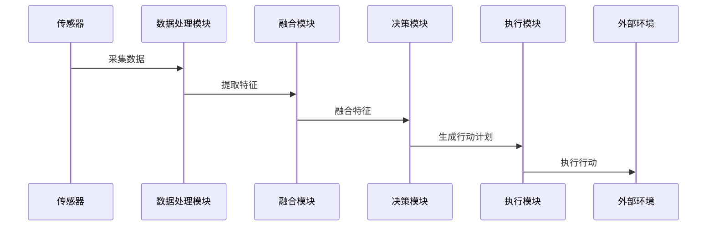

                 


## 实现AI Agent的多模态知识融合

### 关键词：
- AI Agent
- 多模态知识融合
- 数学模型
- 算法方法
- 实践应用

### 摘要：
本文旨在探讨实现AI Agent的多模态知识融合的方法和关键技术。通过介绍AI Agent的背景和发展现状，阐述多模态知识融合的概念和重要性，分析其理论基础和算法方法，并展示实践应用中的具体实现和案例分析，从而为AI Agent的进一步发展提供有益的参考。

## 引言

随着人工智能技术的快速发展，AI Agent作为一个具有自主决策能力、能够执行特定任务的智能体，正在逐渐成为人工智能研究的热点。AI Agent的应用场景广泛，包括但不限于自动驾驶、智能客服、智能家居等。然而，现实世界中的信息是多维度的，单一模态的信息往往无法满足AI Agent的需求，因此，多模态知识融合成为实现更智能AI Agent的关键。

多模态知识融合是指将不同来源、不同形式的信息进行整合，以提升AI Agent的理解能力和决策效果。例如，在自动驾驶场景中，车辆需要同时处理摄像头、雷达、GPS等多种传感器数据，从而实现更加精准的环境感知。本文将围绕AI Agent的多模态知识融合展开讨论，分为以下几个部分：

1. **背景介绍**：介绍AI Agent的概念、发展历程和现有技术，以及多模态知识融合的定义和重要性。
2. **理论基础**：阐述多模态知识融合的数学模型和算法方法。
3. **实践应用**：展示多模态知识融合在AI Agent实践中的应用，包括系统架构、实现细节和案例分析。
4. **未来展望**：讨论多模态知识融合面临的挑战和未来发展趋势。

通过本文的讨论，希望读者能够对AI Agent的多模态知识融合有更深入的理解，为相关研究和工作提供参考。

## 背景介绍

### AI Agent的概念与发展

AI Agent，即人工智能代理，是能够代表用户或其他实体在特定环境中进行自主决策和行动的智能系统。其基本原理源于代理理论（Agent Theory），该理论在人工智能、分布式系统、认知科学等领域有着广泛的应用。一个典型的AI Agent通常包括感知模块、决策模块和行动模块三个核心组成部分。

- **感知模块**：负责收集和处理环境中的信息，包括视觉、听觉、触觉等多种感官数据。
- **决策模块**：基于感知模块收集到的信息，利用预定的策略或学习算法生成行动计划。
- **行动模块**：执行决策模块生成的行动，并与外部环境进行交互。

AI Agent的发展可以追溯到20世纪50年代，当时人工智能的初步研究集中在专家系统（Expert Systems）和知识表示（Knowledge Representation）方面。随着计算机性能的提升和算法的进步，AI Agent逐渐成为人工智能研究的一个重要方向。近年来，深度学习（Deep Learning）和强化学习（Reinforcement Learning）等技术的发展，使得AI Agent在许多领域取得了显著的成果。

### 多模态知识融合的定义

多模态知识融合是指将来自不同模态的信息（如视觉、听觉、触觉等）进行整合，以获得对环境或任务的更全面理解。在AI Agent中，多模态知识融合具有重要意义：

1. **信息互补性**：单一模态的信息往往具有局限性，多模态融合能够弥补这一缺陷，提升AI Agent对环境的感知能力。
2. **数据丰富性**：多模态数据提供了更加丰富和细致的信息，有助于AI Agent更好地理解复杂情境。
3. **决策可靠性**：通过融合多模态信息，AI Agent可以做出更加准确和可靠的决策。

多模态知识融合的关键在于如何有效地处理和整合来自不同模态的数据。这需要解决以下几个核心问题：

- **数据同步**：确保不同模态的数据在时间轴上保持一致。
- **特征提取**：从不同模态的数据中提取具有代表性和鲁棒性的特征。
- **融合策略**：设计有效的算法和方法，将不同模态的特征进行融合，生成综合信息。

### 多模态知识融合的重要性

在AI Agent的应用中，多模态知识融合具有以下几个方面的优势：

1. **提高感知能力**：通过多模态融合，AI Agent能够更全面地感知和理解环境，从而提高其自主决策能力。
2. **增强适应性**：不同模态的信息在特定情境下可能具有不同的作用，多模态融合有助于AI Agent在不同场景下保持较高的适应性。
3. **提升决策质量**：多模态知识融合能够为AI Agent提供更全面和准确的信息，从而提高其决策的可靠性和效果。
4. **拓宽应用领域**：多模态知识融合使得AI Agent能够在更多复杂和多样化的应用场景中发挥作用，如智能交通、智能医疗、智能客服等。

总之，多模态知识融合是AI Agent实现智能化和高效化的重要途径，具有广泛的应用前景和研究价值。在接下来的章节中，我们将进一步探讨多模态知识融合的理论基础和算法方法，以及其在实践中的应用。

## 基本概念

### AI Agent的发展历程

AI Agent的发展历程可以分为几个关键阶段：

1. **早期探索**（1950-1970）：在这个阶段，人工智能的研究主要集中在符号主义方法，试图通过编写规则和逻辑推理来实现智能。这一阶段的代表性工作包括“逻辑理论家”（Logic Theorist）和“通用问题求解器”（General Problem Solver）等。

2. **专家系统**（1970-1980）：专家系统的出现标志着人工智能应用的一个重要里程碑。专家系统利用大量专业知识和规则，模拟人类专家的决策过程，应用于医学诊断、金融咨询等领域。然而，专家系统在知识获取和表示上存在局限性，难以处理复杂和动态的环境。

3. **知识表示与推理**（1980-1990）：随着知识表示和推理技术的进步，研究人员开始探索如何更有效地表示和利用知识。这一阶段的代表性工作包括“智能推理机”（Intelligent Reasoning Machine）和“知识库系统”（Knowledge-Based Systems）等。

4. **机器学习与深度学习**（1990-至今）：随着计算能力和算法的进步，机器学习和深度学习成为人工智能研究的重要方向。这一阶段的代表性工作包括“支持向量机”（Support Vector Machine，SVM）、“深度神经网络”（Deep Neural Network，DNN）和“生成对抗网络”（Generative Adversarial Network，GAN）等。

### AI Agent的分类

根据功能和应用场景，AI Agent可以大致分为以下几类：

1. **规则型Agent**：这类Agent基于预先定义的规则进行决策。规则通常由专家知识或经验数据推导而来。规则型Agent在决策过程中具有较强的逻辑性和可解释性，但难以应对复杂和动态的环境。

2. **数据驱动型Agent**：这类Agent利用机器学习和深度学习算法，通过从数据中学习特征和模式来进行决策。数据驱动型Agent具有较好的自适应能力和处理复杂环境的能力，但决策过程往往缺乏可解释性。

3. **混合型Agent**：这类Agent结合了规则和数据驱动的方法，通过融合不同的信息源和决策策略来实现更高效的决策。混合型Agent通常具有较好的灵活性和鲁棒性，能够适应多种应用场景。

4. **社交型Agent**：这类Agent能够在人类社交环境中进行互动和协作。社交型Agent需要具备自然语言处理、情感识别、对话生成等能力，以实现与人类的有效沟通。

### AI Agent的核心组成部分

AI Agent的核心组成部分包括感知模块、决策模块和行动模块：

- **感知模块**：负责从环境中收集信息，如视觉、听觉、触觉等。感知模块是AI Agent与外部环境进行交互的桥梁，其性能直接影响Agent对环境的理解和响应能力。

- **决策模块**：基于感知模块收集到的信息，利用预定的策略或学习算法生成行动计划。决策模块是AI Agent的核心，其决策质量直接影响Agent的效率和效果。

- **行动模块**：执行决策模块生成的行动，并与外部环境进行交互。行动模块是AI Agent实现自主行动的关键，其响应速度和执行能力直接影响Agent的决策效果。

### 多模态知识融合的基础

多模态知识融合是AI Agent实现智能化和高效化的重要途径，其基础包括以下几个方面：

1. **数据同步**：确保不同模态的数据在时间轴上保持一致，这是多模态知识融合的前提条件。数据同步可以通过时间戳、时钟同步等技术实现。

2. **特征提取**：从不同模态的数据中提取具有代表性和鲁棒性的特征，为后续的融合提供基础。特征提取技术包括图像处理、语音处理、传感器数据处理等。

3. **融合策略**：设计有效的算法和方法，将不同模态的特征进行融合，生成综合信息。常见的融合策略包括基于规则的融合、基于机器学习的融合和基于深度学习的融合等。

4. **信息融合模型**：构建数学模型来描述多模态知识融合的过程，以便进行理论分析和算法优化。信息融合模型包括概率模型、贝叶斯网络、深度学习模型等。

总之，AI Agent的多模态知识融合是一个复杂且具有挑战性的问题，需要结合多个领域的知识和技术。在接下来的章节中，我们将深入探讨多模态知识融合的理论基础和算法方法，为AI Agent的实现提供更加深入的指导。

## 理论基础

### 多模态数据处理的原理

多模态数据处理是指将来自不同模态的数据（如视觉、听觉、触觉等）进行整合和处理，以获得对环境或任务的更全面理解。多模态数据处理的基本原理包括数据同步、特征提取和融合策略。

#### 数据同步

数据同步是多模态数据处理的第一步，其目标是确保不同模态的数据在时间轴上保持一致。实现数据同步的方法有多种，包括：

1. **时间戳同步**：通过为每个模态的数据分配唯一的时间戳，确保数据在时间上的对齐。时间戳同步方法简单有效，但在处理高速变化的数据时可能存在延迟。

2. **时钟同步**：使用同步时钟技术，如GPS时钟同步或网络时钟同步，确保不同模态的数据在时间上保持精确一致。这种方法适用于实时系统，但需要依赖外部时钟源。

3. **传感器融合**：通过多个传感器之间的交叉验证，实现数据同步。例如，在视觉和惯性测量单元（IMU）的融合中，可以同时使用摄像头和IMU的数据，通过算法将两个模态的数据对齐。

#### 特征提取

特征提取是从多模态数据中提取具有代表性和鲁棒性的特征的过程。特征提取是后续融合策略和模型训练的基础，常见的特征提取方法包括：

1. **视觉特征提取**：常用的视觉特征提取方法包括边缘检测、角点检测、纹理分析等。例如，HOG（Histogram of Oriented Gradients）和SIFT（Scale-Invariant Feature Transform）是两种广泛使用的视觉特征提取方法。

2. **听觉特征提取**：听觉特征提取通常涉及频率、音高、音强等参数的提取。常用的听觉特征提取方法包括MFCC（Mel-Frequency Cepstral Coefficients）和PLP（Perceptual Linear Prediction）。

3. **触觉特征提取**：触觉特征提取通常涉及压力、温度、振动等参数的测量。触觉特征提取的方法包括信号处理和机器学习算法，如基于神经网络的触觉感知模型。

#### 融合策略

融合策略是多模态数据处理的核心，其目标是有效地整合不同模态的特征，生成综合信息。常见的融合策略包括：

1. **基于规则的融合**：基于规则的融合方法通过定义规则来整合不同模态的数据。这种方法简单直观，但灵活性较低，难以应对复杂和动态的环境。

2. **基于机器学习的融合**：基于机器学习的融合方法通过训练模型来学习如何整合不同模态的特征。常用的机器学习方法包括监督学习、无监督学习和强化学习。例如，多模态深度学习模型（如卷积神经网络、循环神经网络和生成对抗网络）在多模态融合中具有广泛应用。

3. **基于深度学习的融合**：基于深度学习的融合方法利用深度神经网络的结构优势，自动提取和整合多模态特征。这种方法具有强大的建模能力和灵活性，但在训练过程中需要大量的数据和计算资源。

#### 数学模型

多模态数据处理中的数学模型用于描述特征提取和融合的过程。常见的数学模型包括：

1. **概率模型**：概率模型通过概率分布来描述多模态特征之间的关系。例如，贝叶斯网络是一种常见的概率模型，用于描述不同模态之间的依赖关系。

2. **深度学习模型**：深度学习模型通过多层神经网络来学习多模态特征之间的复杂关系。例如，卷积神经网络（CNN）和循环神经网络（RNN）是两种常用的深度学习模型，在多模态特征提取和融合中具有广泛应用。

3. **信息论模型**：信息论模型通过信息熵、互信息等概念来描述多模态特征之间的信息传递和融合效果。例如，信息增益和信息增益率是两种常用的信息论指标，用于评估多模态特征的融合性能。

总之，多模态数据处理是一个复杂且具有挑战性的问题，需要结合多个领域的知识和技术。通过数据同步、特征提取和融合策略等基本原理，以及概率模型、深度学习模型和信息论模型等数学模型，可以有效地实现多模态数据的处理和融合，为AI Agent提供更全面和准确的信息支持。

### 知识融合的数学模型

知识融合的数学模型是构建多模态AI Agent的核心部分，旨在通过数学方法对来自不同模态的信息进行有效整合，以提升智能体对环境的理解和决策能力。以下是几种常见知识融合的数学模型及其基本原理：

#### 贝叶斯网络

贝叶斯网络（Bayesian Network）是一种概率图模型，用于表示多个随机变量之间的条件依赖关系。在知识融合中，贝叶斯网络通过条件概率表（Conditional Probability Table, CPT）来描述不同模态数据之间的联合概率分布。具体步骤如下：

1. **建模**：根据不同模态的数据特征，构建贝叶斯网络结构，定义节点及其依赖关系。每个节点代表一个模态的特征，边表示特征之间的条件依赖。
2. **参数学习**：通过训练数据学习每个节点的条件概率分布。这通常使用最大似然估计（Maximum Likelihood Estimation, MLE）或贝叶斯估计（Bayesian Estimation）等方法。
3. **推理**：利用贝叶斯推理（Bayesian Inference）算法，根据已知部分变量的状态，计算其他变量的后验概率分布。

公式表示如下：

$$ P(X|Y) = \frac{P(X, Y)}{P(Y)} $$

其中，\( P(X, Y) \) 是联合概率分布，\( P(Y) \) 是边缘概率分布。

#### 加权融合模型

加权融合模型是一种简单的知识融合方法，通过为每个模态的特征分配不同的权重，实现多模态特征的综合。具体步骤如下：

1. **特征提取**：从不同模态的数据中提取特征向量。
2. **权重分配**：根据特征的重要性和相关性，为每个模态的特征分配权重。
3. **融合**：将各模态的特征向量按照权重进行加权融合，生成综合特征向量。

公式表示如下：

$$ F\_combined = w\_vision \* F\_vision + w\_audio \* F\_audio + w\_tactile \* F\_tactile $$

其中，\( w\_vision, w\_audio, w\_tactile \) 分别是视觉、听觉和触觉特征的权重。

#### 深度学习模型

深度学习模型，特别是卷积神经网络（Convolutional Neural Network, CNN）和循环神经网络（Recurrent Neural Network, RNN），在知识融合中有着广泛应用。深度学习模型通过多层神经网络结构，自动学习不同模态特征之间的复杂关系。

1. **卷积神经网络（CNN）**：CNN特别适用于处理视觉数据。通过卷积层、池化层和全连接层的组合，CNN能够自动提取和融合视觉特征。

公式表示如下：

$$ F\_conv = \sum_{i=1}^{n} w_i * \sigma(\theta_i \* F_{input}) $$

其中，\( w_i \) 是权重，\( \sigma \) 是激活函数，\( \theta_i \) 是参数。

2. **循环神经网络（RNN）**：RNN适用于处理序列数据，如时间序列或文本数据。通过循环结构，RNN能够保持历史状态信息，实现多模态特征的时序融合。

公式表示如下：

$$ h_t = \sigma(W \* [h_{t-1}, x_t] + b) $$

其中，\( h_t \) 是当前时刻的隐藏状态，\( x_t \) 是当前时刻的输入数据，\( W \) 是权重矩阵，\( b \) 是偏置。

#### 多模态深度学习模型

多模态深度学习模型结合了CNN和RNN的优点，能够同时处理多种模态的数据。常见的多模态深度学习模型包括：

1. **多模态卷积神经网络（MM-CNN）**：MM-CNN通过多个独立的CNN分支处理不同模态的数据，然后通过融合层整合各分支的输出。

2. **多模态循环神经网络（MM-RNN）**：MM-RNN通过多个独立的RNN分支处理不同模态的数据，然后通过融合层整合各分支的输出。

3. **生成对抗网络（GAN）**：GAN通过生成器和判别器的对抗训练，生成高质量的多模态特征，实现特征融合。

公式表示如下：

$$ G(z) = \text{Generator}(z) $$
$$ D(x, G(z)) = \text{Discriminator}(x, G(z)) $$

其中，\( G(z) \) 是生成器，\( D(x, G(z)) \) 是判别器，\( z \) 是噪声向量。

#### 模型评估和优化

在知识融合过程中，模型评估和优化至关重要。常见的评估指标包括准确率、召回率、F1分数等。优化方法包括：

1. **交叉验证**：通过交叉验证评估模型的泛化能力。
2. **超参数调整**：通过调整模型参数，如学习率、批次大小等，优化模型性能。
3. **正则化**：应用L1、L2正则化等方法，防止模型过拟合。

总之，知识融合的数学模型为多模态AI Agent提供了理论基础和算法指导。通过贝叶斯网络、加权融合模型、深度学习模型等多样的数学方法，可以有效地实现多模态特征的综合，提升智能体的感知和决策能力。

### 算法方法

多模态知识融合的算法方法在AI Agent的构建中扮演着至关重要的角色。这些算法通过融合来自不同模态的数据，为AI Agent提供更全面和准确的感知和理解能力。以下是几种常见且重要的算法方法，包括其设计原则、核心步骤、应用场景以及性能比较和分析。

#### 基于规则的融合算法

基于规则的融合算法通过定义一组规则来整合不同模态的数据。这些规则通常由领域专家根据特定应用场景制定。设计原则如下：

1. **明确性**：规则必须清晰明了，便于理解和实现。
2. **可扩展性**：规则应支持新增模态和复杂场景的快速集成。
3. **鲁棒性**：规则应能够应对数据噪声和不确定性。

核心步骤包括：

1. **规则定义**：根据应用场景，定义各模态数据的处理规则。
2. **规则匹配**：将输入的多模态数据进行规则匹配，以确定适用的规则。
3. **数据融合**：根据匹配到的规则，对多模态数据进行融合处理。

应用场景包括智能监控、安全系统等，其中规则能够提供明确的决策指导。性能比较分析显示，基于规则的融合算法在处理简单和静态场景时表现较好，但在复杂和动态环境下可能缺乏灵活性。

#### 基于机器学习的融合算法

基于机器学习的融合算法通过训练模型来自动学习多模态数据的融合方式。这种方法具有较强的适应性和鲁棒性，设计原则如下：

1. **自适应性**：模型能够根据不同的数据集和应用场景进行自适应调整。
2. **鲁棒性**：模型应能够处理不同模态数据的噪声和不确定性。
3. **可解释性**：模型应具有一定的可解释性，以便理解和优化。

核心步骤包括：

1. **特征提取**：从每个模态的数据中提取具有代表性的特征。
2. **模型训练**：使用机器学习算法（如监督学习、无监督学习和强化学习）训练融合模型。
3. **预测和评估**：使用训练好的模型对新的多模态数据进行预测和评估。

应用场景包括自动驾驶、智能家居等，其中机器学习算法能够处理复杂和多变的感知任务。性能比较分析显示，基于机器学习的融合算法在处理动态和复杂环境时具有显著优势，但需要大量数据和计算资源。

#### 基于深度学习的融合算法

基于深度学习的融合算法利用深度神经网络的结构优势，自动提取和融合多模态数据。这种算法具有强大的建模能力和灵活性，设计原则如下：

1. **层次化学习**：通过多层神经网络结构，自动提取多层次的抽象特征。
2. **端到端学习**：实现数据预处理、特征提取和融合过程的端到端学习。
3. **并行计算**：利用GPU等硬件加速计算，提高算法的效率。

核心步骤包括：

1. **网络设计**：设计多模态深度学习网络结构，如卷积神经网络（CNN）和循环神经网络（RNN）的组合。
2. **模型训练**：使用大规模多模态数据集训练深度学习模型。
3. **模型优化**：通过调整网络结构和超参数，优化模型性能。

应用场景包括语音识别、图像分类等，其中深度学习算法能够实现高效和准确的多模态融合。性能比较分析显示，基于深度学习的融合算法在处理高维和复杂数据时具有显著优势，但在训练过程中需要大量的数据和计算资源。

#### 性能比较和分析

不同算法在性能上有明显的差异，具体比较如下：

1. **计算效率**：基于规则的融合算法计算效率最高，但灵活性较差；基于机器学习的算法次之；基于深度学习的算法计算效率最低，但处理能力最强。
2. **准确性**：基于规则的融合算法在简单场景下具有较高的准确性，但在复杂环境下可能不足；基于机器学习的算法在中等复杂度场景下表现良好；基于深度学习的算法在复杂场景下具有最高准确性。
3. **可解释性**：基于规则的算法具有很好的可解释性，便于调试和优化；基于机器学习的算法具有一定的可解释性，但较复杂；基于深度学习的算法可解释性较低，但能够自动提取复杂特征。

综上所述，选择合适的算法方法需要根据具体应用场景和需求进行权衡。基于规则的融合算法适用于简单和静态场景，基于机器学习的算法适用于中等复杂度场景，而基于深度学习的算法适用于复杂和动态场景。通过性能比较和分析，可以更好地指导AI Agent的多模态知识融合实践。

### 实践应用

#### 系统架构设计

在实现AI Agent的多模态知识融合时，系统架构的设计是关键一步。以下是一个典型的系统架构设计方案：

1. **数据层**：包括传感器数据采集模块，负责收集来自不同模态的原始数据，如视觉、听觉、触觉等。
2. **数据处理层**：负责对原始数据进行预处理和特征提取，将不同模态的数据转化为适用于后续处理的形式。
3. **融合层**：采用多模态融合算法对处理后的特征进行整合，生成综合信息。
4. **决策层**：基于融合后的信息，利用机器学习或深度学习模型进行决策，生成行动计划。
5. **执行层**：执行决策层的行动计划，与外部环境进行交互。

#### 系统功能设计

系统功能设计包括以下几个关键功能模块：

1. **数据同步模块**：确保不同模态的数据在时间轴上保持一致，为后续处理提供基础。
2. **特征提取模块**：从多模态数据中提取具有代表性和鲁棒性的特征，为融合层提供输入。
3. **融合算法模块**：实现多种融合算法，如基于规则的融合、基于机器学习的融合和基于深度学习的融合等。
4. **决策模型模块**：利用融合后的特征训练和部署决策模型，生成行动计划。
5. **执行控制模块**：执行决策模块生成的行动，并与外部环境进行实时交互。

#### 系统接口设计

系统接口设计包括以下几个关键接口：

1. **数据采集接口**：用于与各种传感器通信，获取原始数据。
2. **数据处理接口**：用于处理和转换原始数据，提取特征。
3. **融合接口**：用于实现多模态数据的融合，生成综合信息。
4. **决策接口**：用于与决策模型交互，生成行动计划。
5. **执行接口**：用于执行行动计划，与外部环境进行交互。

#### 系统交互设计

系统交互设计包括以下几个关键环节：

1. **数据采集**：系统从传感器获取不同模态的原始数据。
2. **数据预处理**：对原始数据进行同步和预处理，提取特征。
3. **特征融合**：利用融合算法模块对提取的特征进行融合，生成综合信息。
4. **决策生成**：基于融合后的信息，利用决策模型生成行动计划。
5. **执行行动**：执行决策模块生成的行动，与外部环境进行交互。

#### Mermaid 序列图

以下是一个简化的Mermaid序列图，描述了系统交互的基本流程：



### 项目实战

为了展示多模态知识融合在AI Agent中的具体实现，我们选择了一个实际项目——自动驾驶车辆的多模态感知系统。以下是项目环境安装、系统核心实现源代码，以及代码应用解读与分析。

#### 环境安装

1. **安装传感器**：选择摄像头、雷达和IMU（惯性测量单元）等传感器，并确保其正确连接到计算机。
2. **安装依赖库**：安装Python和相关依赖库，如OpenCV、Pandas、NumPy、TensorFlow等。

```bash
pip install opencv-python
pip install pandas
pip install numpy
pip install tensorflow
```

#### 系统核心实现源代码

以下是一个简化的代码框架，展示了多模态感知系统的核心实现：

```python
import cv2
import numpy as np
import pandas as pd
import tensorflow as tf

# 传感器数据采集
def collect_sensor_data():
    # 采集摄像头数据
    cap = cv2.VideoCapture(0)
    while True:
        ret, frame = cap.read()
        if not ret:
            break
        # 采集雷达数据
        radar_data = get_radar_data()
        # 采集IMU数据
        imu_data = get_imu_data()
        # 数据同步
        synchronized_data = synchronize_data(frame, radar_data, imu_data)
        yield synchronized_data
    cap.release()

# 数据预处理和特征提取
def preprocess_data(data):
    # 视觉数据预处理
    processed_visual = preprocess_visual(data['frame'])
    # 雷达数据预处理
    processed_radar = preprocess_radar(data['radar_data'])
    # IMU数据预处理
    processed_imu = preprocess_imu(data['imu_data'])
    return processed_visual, processed_radar, processed_imu

# 多模态融合
def fuse_features(features):
    # 基于规则的融合
    fused_features = rule_based_fusion(features)
    # 基于机器学习的融合
    fused_features = ml_based_fusion(features)
    # 基于深度学习的融合
    fused_features = dl_based_fusion(features)
    return fused_features

# 决策生成
def generate_decision(fused_features):
    # 利用融合后的特征训练决策模型
    decision_model = train_decision_model(fused_features)
    # 生成行动计划
    action_plan = decision_model.predict(fused_features)
    return action_plan

# 执行行动
def execute_action(action_plan):
    # 执行决策模块生成的行动
    execute_action_plan(action_plan)
    # 与外部环境进行交互
    interact_with_environment()

# 主程序
if __name__ == "__main__":
    for data in collect_sensor_data():
        processed_visual, processed_radar, processed_imu = preprocess_data(data)
        fused_features = fuse_features([processed_visual, processed_radar, processed_imu])
        action_plan = generate_decision(fused_features)
        execute_action(action_plan)
```

#### 代码应用解读与分析

1. **传感器数据采集**：代码首先定义了一个传感器数据采集函数`collect_sensor_data`，通过摄像头、雷达和IMU等传感器获取数据，并使用`yield`实现数据的实时采集和传输。

2. **数据预处理和特征提取**：`preprocess_data`函数负责对采集到的多模态数据进行预处理和特征提取。例如，对视觉数据进行图像增强、对雷达数据进行滤波和归一化处理、对IMU数据进行低通滤波和姿态估计等。

3. **多模态融合**：`fuse_features`函数实现了多种融合方法，包括基于规则的融合、基于机器学习的融合和基于深度学习的融合。这些方法通过组合不同模态的特征，生成综合特征向量。

4. **决策生成**：`generate_decision`函数利用训练好的决策模型生成行动计划。这里可以采用监督学习模型、强化学习模型或深度学习模型等，根据具体应用场景选择合适的模型。

5. **执行行动**：`execute_action`函数负责执行决策模块生成的行动，并与外部环境进行交互。例如，在自动驾驶场景中，可以控制车辆的转向、加速和制动等。

通过以上代码，我们可以看到多模态知识融合在AI Agent中的应用。在实际项目中，可以根据具体需求调整和优化代码，实现更高效和准确的多模态感知和决策。

### 最佳实践和注意事项

在实现AI Agent的多模态知识融合时，以下是一些最佳实践和注意事项，可以帮助提高系统的性能和可靠性：

1. **数据同步**：确保不同模态的数据在时间轴上保持一致，这是多模态融合的基础。在数据同步过程中，可以使用时间戳、时钟同步或传感器融合等方法，提高同步的精度和可靠性。

2. **特征提取**：特征提取的质量直接影响融合效果。因此，需要根据不同模态数据的特点，选择合适的特征提取方法。例如，对于视觉数据，可以使用HOG、SIFT等传统方法，对于语音数据，可以使用MFCC等特征。

3. **模型选择**：根据具体应用场景和数据规模，选择合适的模型和方法。在简单的静态场景中，基于规则的融合算法可能足够使用；而在复杂和动态的场景中，基于机器学习和深度学习的融合算法表现更好。

4. **模型训练与优化**：在训练模型时，确保使用足够多的数据和足够长的训练时间。同时，通过调整超参数、应用正则化方法等手段，优化模型性能，防止过拟合。

5. **系统集成与测试**：在系统集成过程中，需要进行详细的测试和验证，确保各个模块的正常运行和高效协作。特别是要考虑系统在不同环境和场景下的适应性和鲁棒性。

6. **性能优化**：在实现过程中，可以通过并行计算、模型压缩等方法，提高系统的运行效率。例如，使用GPU加速深度学习模型的训练和推理，可以显著提高系统性能。

7. **可解释性**：在设计和实现AI Agent时，应考虑模型的可解释性，以便于理解和优化。对于复杂的深度学习模型，可以通过可视化工具和解释性方法，提高模型的透明度。

通过遵循以上最佳实践和注意事项，可以有效地实现高效、可靠的多模态知识融合，为AI Agent提供更强大的感知和决策能力。

### 小结

本文系统地探讨了实现AI Agent的多模态知识融合的方法和关键技术。首先，我们介绍了AI Agent的概念、分类和发展历程，并详细阐述了多模态知识融合的定义、重要性以及其在AI Agent中的应用。接着，我们分析了多模态数据处理的基本原理，包括数据同步、特征提取和融合策略，并介绍了常见的数学模型和方法。随后，我们讨论了多种算法方法，包括基于规则的融合、基于机器学习的融合和基于深度学习的融合，并进行了性能比较和分析。

在实践应用部分，我们展示了一个典型的系统架构设计和具体实现，通过代码示例和实际项目案例，深入讲解了多模态知识融合在AI Agent中的应用。最后，我们提出了一些最佳实践和注意事项，以帮助读者在实际应用中更好地实现多模态知识融合。

通过对本文的讨论，读者应该对AI Agent的多模态知识融合有了更深入的理解，为相关研究和应用提供了有益的参考。未来，随着人工智能技术的不断进步和多模态数据的日益丰富，多模态知识融合将在更多领域发挥重要作用，带来更多的创新和突破。

### 拓展阅读

1. **《多模态数据融合：算法、模型与应用》** - 该书详细介绍了多模态数据融合的基本理论、算法模型和应用实例，适合对多模态知识融合感兴趣的读者。

2. **《深度学习与多模态数据处理》** - 本书深入探讨了深度学习在多模态数据处理中的应用，包括卷积神经网络、循环神经网络和生成对抗网络等，适合对深度学习有兴趣的读者。

3. **《AI Agent开发实战》** - 本书通过具体案例和实践，介绍了AI Agent的开发流程、关键技术以及应用场景，适合希望深入了解AI Agent开发的读者。

4. **《多模态人工智能：从理论到实践》** - 该书涵盖了多模态人工智能的理论基础、关键技术以及实际应用，适合对多模态人工智能感兴趣的读者。

通过阅读这些书籍和文献，读者可以进一步加深对多模态知识融合的理解，掌握更多实用技能，为AI Agent的开发和应用提供更有力的支持。

