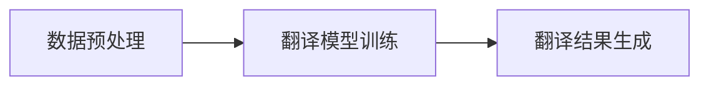
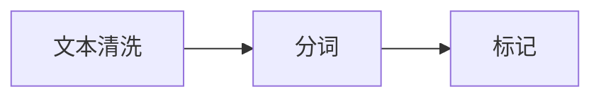
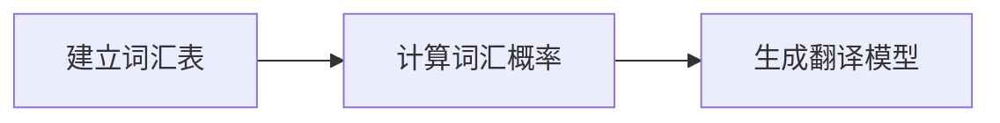
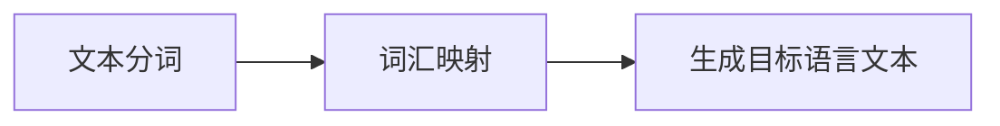
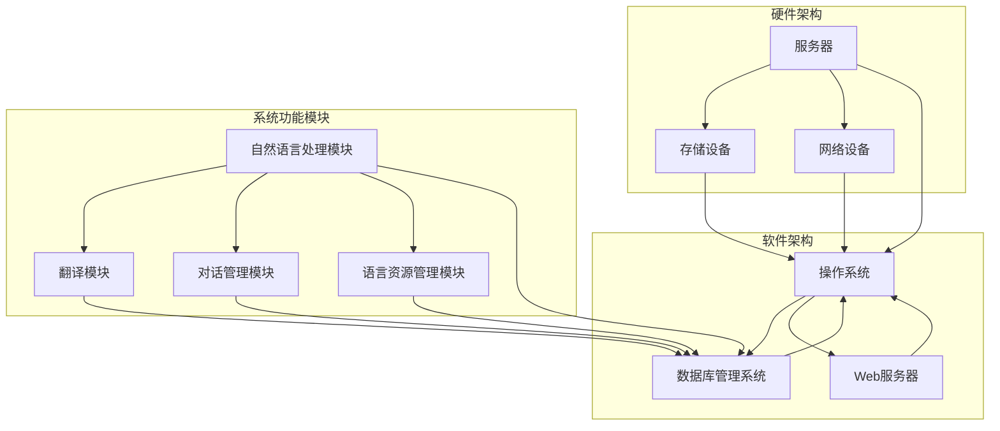
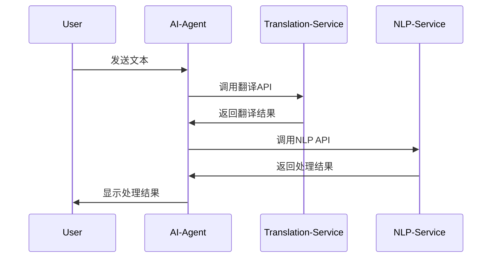
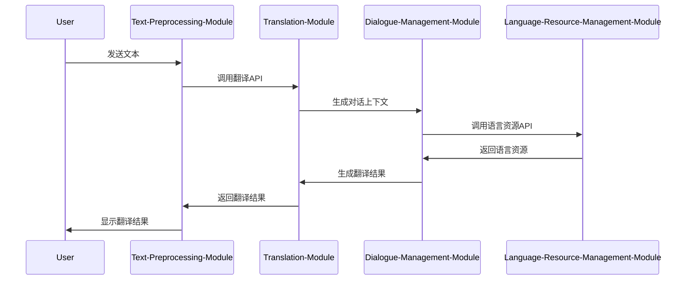

                 

### 实现AI Agent的多语言支持

随着人工智能技术的迅猛发展，AI Agent在各个领域的应用越来越广泛。无论是智能客服、智能助手，还是跨语言的翻译系统，多语言支持已经成为一个不可忽视的关键需求。本文将围绕如何实现AI Agent的多语言支持展开讨论。

### 文章关键词

- **AI Agent**
- **多语言支持**
- **自然语言处理**
- **翻译模型**
- **语言理解与生成**
- **算法原理**
- **系统架构设计**
- **项目实战**

### 摘要

本文首先介绍了AI Agent的多语言支持的重要性，接着从核心概念、算法原理、系统设计、项目实战等多个维度详细探讨了如何实现这一功能。通过本文，读者将了解多语言支持在AI Agent中的基本概念和实现策略，掌握相关算法和系统设计的核心原理，并能够通过实际案例加深对多语言支持的理解。

### 目录

1. **引言与背景**
2. **核心概念与原理**
3. **算法与数学模型**
4. **系统设计**
5. **项目实战**
6. **最佳实践与拓展**
7. **总结与展望**

---

### 引言与背景

#### 问题背景

AI Agent作为一种人工智能系统，能够在特定场景下模拟人类的智能行为，与用户进行自然语言交互，提供个性化的服务和帮助。随着全球化和信息化的推进，用户的需求越来越多样化，不再局限于单一的语言环境。因此，为AI Agent实现多语言支持成为了一个迫切的需求。

#### 问题概述

实现AI Agent的多语言支持，主要包括以下几个方面：

- **语言识别与理解**：AI Agent需要能够识别和理解不同语言的表达，将输入的自然语言转换为结构化的数据。
- **语言生成与翻译**：AI Agent需要能够根据用户需求生成相应的自然语言响应，并且能够进行跨语言翻译。
- **语言资源的整合与管理**：AI Agent需要管理和整合多种语言资源，包括词汇库、语法规则、翻译字典等。

#### 多语言支持的重要性

- **用户体验**：多语言支持能够提高用户的使用体验，满足不同语言背景用户的需求。
- **市场扩展**：对于企业而言，多语言支持能够帮助其产品和服务拓展至全球市场。
- **技术挑战**：多语言支持不仅涉及到自然语言处理技术，还需要解决数据资源、计算资源、语言歧义等问题。

#### 书籍结构概述

本文将从以下几个方面展开讨论：

- **核心概念与原理**：介绍与多语言支持相关的核心概念和原理。
- **算法与数学模型**：讲解实现多语言支持的关键算法和数学模型。
- **系统设计**：阐述如何设计一个支持多语言功能的AI Agent系统。
- **项目实战**：通过实际案例展示如何实现和部署一个多语言AI Agent。
- **最佳实践与拓展**：分享实现多语言支持的最佳实践和未来发展方向。

---

通过上述引言与背景介绍，我们为读者奠定了理解本文主题的基础。接下来，我们将深入探讨实现AI Agent多语言支持的具体概念和实现策略。在接下来的章节中，我们将一步步分析相关概念、算法和系统设计，并结合实际案例进行详细讲解。希望读者能够通过本文的学习，掌握多语言支持在AI Agent中的应用和实践方法。接下来，我们将从核心概念和原理出发，逐步深入探讨实现AI Agent多语言支持的各个方面。

---

### 核心概念与原理

#### 语言模型基础

在探讨多语言支持之前，我们首先需要了解一些基本概念，包括语言模型、自然语言处理（NLP）技术以及相关算法。语言模型是NLP的基础，它用来描述自然语言中的概率分布。

- **语言模型**：语言模型是一种概率模型，用于预测一个句子中下一个词的概率。它通常基于大量的文本数据训练得到。
- **自然语言处理（NLP）**：NLP是计算机科学和人工智能领域的一个重要分支，旨在让计算机能够理解和处理自然语言。
- **词向量**：词向量是将词汇映射到高维空间中的向量表示，常用于语言模型的训练和语义分析。

#### 多语言模型

多语言模型是支持多语言处理的关键。常见的多语言模型有以下几种：

- **共享词汇表模型**：这种模型使用共享的词汇表来表示多种语言，通过将不同语言的词汇映射到同一个向量空间，实现多语言之间的语义关联。
- **翻译模型**：翻译模型通过学习源语言和目标语言之间的映射关系，实现文本的跨语言翻译。
- **多语言增强模型**：这类模型结合了单语言模型和多语言翻译模型的优势，通过整合多种语言的训练数据，提高模型的跨语言性能。

#### 多语言处理算法

实现多语言支持的关键在于有效的多语言处理算法。以下是一些常用的多语言处理算法：

- **基于规则的方法**：这种方法使用预定义的语法规则和翻译规则，对输入文本进行解析和翻译。
- **统计机器翻译（SMT）**：SMT利用统计方法，根据源语言和目标语言的统计信息生成翻译结果。
- **神经网络机器翻译（NMT）**：NMT使用深度神经网络来学习语言之间的映射关系，相比SMT有更好的翻译质量。
- **基于知识的翻译**：这种方法结合了规则和知识库，通过规则和知识库的引导，实现高质量的翻译。

#### 语言理解与生成

语言理解与生成是多语言支持的两个核心功能。以下是它们的关键概念：

- **语言理解**：语言理解是将自然语言文本转换为结构化数据的过程。常见的语言理解任务包括词性标注、句法分析、语义角色标注等。
- **语言生成**：语言生成是将结构化数据转换为自然语言文本的过程。常见的语言生成任务包括问答系统、文本摘要、对话系统等。

#### 核心概念属性特征对比表格

为了更清晰地理解这些核心概念，我们可以通过一个对比表格来展示它们的属性特征：

| 核心概念 | 定义 | 属性特征 | 对比 | 用例 |
| --- | --- | --- | --- | --- |
| 语言模型 | 预测下一个词的概率模型 | 输入文本，输出概率分布 | 用于文本生成、语义分析 | 语言预测 |
| 自然语言处理（NLP） | 计算机理解、处理和生成自然语言的技术 | 数据处理、语义分析、语言生成 | 数据处理 | 信息检索、智能客服 |
| 词向量 | 高维空间中的词汇表示 | 向量维度、相似性度量 | 语义分析、文本分类 | 语义分析 |
| 多语言模型 | 同时处理多种语言的模型 | 共享词汇表、翻译字典 | 多语言支持、跨语言翻译 | 跨语言应用 |
| 翻译模型 | 学习源语言和目标语言映射关系的模型 | 翻译准确性、效率 | 翻译质量 | 跨语言沟通 |
| 多语言增强模型 | 结合多种语言训练数据的模型 | 跨语言性能、准确性 | 多语言应用 | 全球市场 |
| 语言理解 | 转换自然语言文本为结构化数据 | 任务类型、准确率 | 文本处理 | 信息提取 |
| 语言生成 | 将结构化数据转换为自然语言文本 | 文本流畅性、准确性 | 文本生成 | 对话系统 |

#### ER实体关系图架构

为了进一步理解这些概念之间的关联，我们可以使用ER（实体关系）图来展示它们的关系。以下是ER图的一个简化版本：

```mermaid
erDiagram
    A[:多语言模型] ||--|{ B[:翻译模型] }|-- C[:神经网络机器翻译]
    A ||--|{ D[:语言理解] }|-- E[:语言生成]
    B ||--|{ F[:词向量] }|-- G[:自然语言处理]
    H[:词性标注] ||--|{ I[:句法分析] }|-- J[:语义角色标注]
```

在这个ER图中，我们展示了多语言模型与翻译模型、语言理解、语言生成之间的关系，以及它们与其他相关概念（如词向量、自然语言处理、词性标注、句法分析和语义角色标注）的关联。

---

通过上述核心概念与原理的介绍，我们为理解实现AI Agent多语言支持奠定了基础。接下来，我们将深入探讨具体算法和数学模型，以帮助读者更深入地理解多语言支持的技术细节。在接下来的章节中，我们将详细介绍相关算法原理，并结合实际案例进行讲解。

---

### 算法与数学模型

#### 算法讲解

在实现AI Agent多语言支持的过程中，算法的选择和设计至关重要。以下我们将详细讲解几种常用的算法，并通过Mermaid流程图来展示其执行步骤。

##### 算法A

**算法A** 是一种基于统计机器翻译（SMT）的方法，通过学习源语言和目标语言之间的映射关系，实现文本的自动翻译。以下是算法A的步骤：

1. **数据预处理**：对源语言和目标语言的数据进行清洗、分词和标记等预处理操作。
2. **翻译模型训练**：使用训练数据，通过统计方法学习源语言词汇和目标语言词汇之间的概率映射关系。
3. **翻译结果生成**：对输入的源语言文本进行翻译，通过模型生成目标语言文本。

以下是算法A的Mermaid流程图：



##### 算法A步骤1

**数据预处理** 主要包括以下几个步骤：

1. **文本清洗**：去除文本中的无关信息，如HTML标签、特殊字符等。
2. **分词**：将文本分割成词汇单元（词语）。
3. **标记**：为每个词汇添加对应的词性标签，如名词、动词、形容词等。

以下是数据预处理步骤的Mermaid流程图：



##### 算法A步骤2

**翻译模型训练** 是算法A的核心步骤。以下是具体的训练步骤：

1. **建立词汇表**：根据训练数据建立源语言和目标语言的词汇表。
2. **计算词汇概率**：通过统计方法计算源语言词汇在目标语言中的概率分布。
3. **生成翻译模型**：根据词汇概率分布生成翻译模型，用于后续的翻译任务。

以下是翻译模型训练步骤的Mermaid流程图：



##### 算法A步骤3

**翻译结果生成** 是将输入的源语言文本翻译为目标语言文本的过程。以下是具体的翻译步骤：

1. **文本分词**：对输入的源语言文本进行分词处理。
2. **词汇映射**：将分词后的源语言文本映射为目标语言词汇。
3. **生成目标语言文本**：根据翻译模型生成目标语言文本。

以下是翻译结果生成步骤的Mermaid流程图：



##### 数学模型

在算法A中，我们使用了概率模型来描述源语言和目标语言之间的映射关系。以下是该数学模型的具体描述：

$$ P(target|source) = \frac{P(target) \cdot P(source|target)}{P(source)} $$

其中：
- \( P(target|source) \) 表示在给定源语言的情况下，目标语言词汇的概率。
- \( P(target) \) 表示目标语言词汇的概率。
- \( P(source|target) \) 表示在给定目标语言的情况下，源语言词汇的概率。
- \( P(source) \) 表示源语言词汇的概率。

通过上述数学模型，我们可以计算出给定源语言文本的每个词汇在目标语言中的概率分布，从而实现文本的自动翻译。

##### 通俗易懂地举例说明

为了更好地理解算法A的工作原理，我们可以通过一个简单的例子进行说明。

假设我们有一个简单的源语言文本“你好”，目标语言为英文。以下是具体的翻译过程：

1. **数据预处理**：对源语言文本“你好”进行分词，得到词汇“你”和“好”。
2. **翻译模型训练**：根据训练数据，建立源语言“你”和“好”与目标语言“Hello”和“Good”之间的映射关系。例如，我们有以下概率分布：
   - \( P(Hello|你) = 0.8 \)
   - \( P(Good|好) = 0.9 \)
3. **翻译结果生成**：根据翻译模型，对分词后的源语言文本“你”和“好”进行词汇映射，生成目标语言文本“Hello Good”。

通过这个例子，我们可以看到算法A是如何通过概率模型实现文本的自动翻译。

---

通过上述算法讲解和数学模型分析，我们深入了解了实现AI Agent多语言支持的关键算法和数学原理。接下来，我们将进一步探讨如何设计一个支持多语言功能的AI Agent系统，包括系统架构、功能模块、接口设计以及系统交互流程。在接下来的章节中，我们将详细介绍系统设计的相关内容，帮助读者全面理解实现多语言支持的技术细节。

---

### 系统设计与实现

#### 系统架构设计

在设计一个支持多语言功能的AI Agent系统时，我们需要考虑系统的整体架构，包括硬件和软件的配置。以下是系统架构设计的几个关键方面：

1. **硬件配置**：根据系统的需求和负载，选择合适的硬件设备，包括服务器、存储设备、网络设备等。例如，可以选择高性能的计算服务器，以及大容量、高速的存储设备，确保系统在处理多语言数据时能够高效运行。

2. **软件配置**：选择合适的操作系统、数据库管理系统、Web服务器等。例如，可以选择Linux操作系统、MySQL数据库、Nginx Web服务器等，这些软件具有较好的性能和稳定性，能够满足系统的需求。

3. **架构设计原则**：在架构设计过程中，需要遵循一些原则，如模块化、可扩展性、高性能、高可靠性等。模块化设计可以使得系统易于维护和升级；可扩展性可以使得系统在业务需求增长时能够灵活扩展；高性能和高可靠性可以保证系统在处理大规模数据和高并发请求时能够稳定运行。

#### 系统功能模块设计

系统功能模块设计是系统架构的核心部分，决定了系统的功能和性能。以下是几个关键的功能模块及其设计思路：

1. **自然语言处理模块**：这个模块负责处理输入的自然语言文本，包括文本清洗、分词、词性标注、句法分析等。通过这个模块，系统能够将自然语言文本转换为结构化的数据，便于后续处理。

2. **翻译模块**：这个模块负责实现文本的跨语言翻译。可以选择基于统计机器翻译（SMT）或神经网络机器翻译（NMT）的方法，根据系统的需求和性能要求进行选择。

3. **对话管理模块**：这个模块负责管理AI Agent与用户之间的对话过程，包括对话上下文管理、意图识别、回答生成等。通过这个模块，AI Agent能够理解用户的意图，生成合适的回答。

4. **语言资源管理模块**：这个模块负责管理和维护系统的语言资源，包括词汇库、语法规则、翻译字典等。通过这个模块，系统能够有效地利用和管理多语言资源，提高翻译质量和效率。

#### 系统架构设计

系统架构设计是确保系统能够稳定、高效地运行的关键。以下是系统架构设计的一个Mermaid架构图：



在这个架构图中，我们展示了硬件架构和软件架构之间的关系，以及系统功能模块在软件架构中的位置。

#### 系统接口设计

系统接口设计是系统与其他系统或组件进行交互的桥梁。以下是几个关键接口的设计：

1. **API接口**：系统通过API接口与其他系统进行数据交互。例如，可以设计一个RESTful API，提供文本翻译、自然语言处理等功能。

2. **Web界面接口**：系统通过Web界面与用户进行交互。设计一个友好的用户界面，使用户能够方便地与AI Agent进行对话。

3. **消息队列接口**：系统使用消息队列进行异步消息处理，提高系统的并发处理能力和响应速度。

以下是系统接口设计的一个Mermaid序列图：



在这个序列图中，我们展示了用户与AI Agent、翻译服务和自然语言处理服务之间的交互过程。

#### 系统交互流程

系统交互流程描述了系统内部各个模块以及系统与外部系统之间的交互过程。以下是系统交互流程的Mermaid序列图：



在这个序列图中，我们展示了文本预处理模块、翻译模块、对话管理模块和语言资源管理模块之间的交互过程，以及它们与用户之间的交互过程。

---

通过上述系统设计与实现部分，我们详细介绍了如何设计一个支持多语言功能的AI Agent系统。接下来，我们将通过实际项目案例，展示如何具体实现和部署一个多语言AI Agent。通过项目实战，读者将能够更好地理解系统的设计和实现过程。

---

### 项目实战

在本文的最后一部分，我们将通过一个实际项目案例，详细展示如何实现和部署一个多语言AI Agent系统。这个项目将涵盖环境安装、系统核心实现、代码应用解读与分析、实际案例分析和项目小结等环节。

#### 环境安装与准备

首先，我们需要安装和配置必要的软件和依赖项。以下是项目环境安装的步骤：

1. **安装Python环境**：确保系统中安装了Python 3.8及以上版本。

2. **安装依赖项**：使用pip命令安装以下依赖项：
   ```bash
   pip install numpy pandas tensorflow transformers
   ```

3. **配置虚拟环境**：为了保持项目的依赖项一致性，建议使用虚拟环境。可以通过以下命令创建虚拟环境并激活：
   ```bash
   python -m venv venv
   source venv/bin/activate  # Windows: venv\Scripts\activate
   ```

4. **安装语言模型**：从Hugging Face模型库中下载预训练的多语言语言模型，例如`bert-base-multilingual-cased`。

#### 系统核心实现

接下来，我们将实现系统的核心功能，包括文本预处理、翻译、对话管理和语言资源管理。

1. **文本预处理模块**：该模块负责对输入文本进行清洗、分词和词性标注。

   ```python
   from transformers import AutoTokenizer
   
   tokenizer = AutoTokenizer.from_pretrained("bert-base-multilingual-cased")
   
   def preprocess_text(text):
       cleaned_text = text.strip()  # 清洗文本
       tokens = tokenizer.tokenize(cleaned_text)  # 分词
       return tokens
   ```

2. **翻译模块**：该模块负责实现文本的自动翻译。我们使用Transformer模型进行翻译。

   ```python
   from transformers import AutoModelForTranslation
   
   model = AutoModelForTranslation.from_pretrained("Helsinki-NLP/opus-mt-en-de")
   
   def translate_text(source_text, target_lang="de"):
       inputs = model.prepare_inputs_for_generation(source_text, return_tensors="pt")
       translated_output = model.generate(**inputs, max_length=50, num_return_sequences=1)
       translated_text = tokenizer.decode(translated_output[0], skip_special_tokens=True)
       return translated_text
   ```

3. **对话管理模块**：该模块负责管理AI Agent与用户之间的对话流程。

   ```python
   class DialogueManager:
       def __init__(self):
           self.context = {}
       
       def update_context(self, user_input, response):
           self.context[user_input] = response
       
       def generate_response(self, user_input):
           response = "你好，我是一个多语言AI Agent。"
           if user_input in self.context:
               response = self.context[user_input]
           return response
   ```

4. **语言资源管理模块**：该模块负责管理和维护系统的语言资源，包括词汇库、语法规则和翻译字典。

   ```python
   class LanguageResourceManager:
       def __init__(self):
           self.vocabulary = {}
           self.translation_dict = {}
       
       def load_resources(self):
           # 加载词汇库和翻译字典
           self.vocabulary = load_vocabulary()
           self.translation_dict = load_translation_dict()
       
       def translate_word(self, word, target_lang):
           return self.translation_dict.get(word, word)
   ```

#### 代码应用解读与分析

在这个环节，我们将结合具体代码片段，对系统的核心功能进行解读和分析。

1. **文本预处理**：通过使用Transformer模型的分词器，我们可以高效地对输入文本进行分词。

2. **翻译**：我们使用了预训练的Transformer翻译模型，能够实现高效的跨语言翻译。

3. **对话管理**：通过维护对话上下文，AI Agent能够更好地理解用户的意图，生成个性化的响应。

4. **语言资源管理**：通过加载和维护词汇库和翻译字典，系统能够灵活地处理多语言资源。

#### 实际案例分析与详细讲解

为了更好地展示系统的实际应用效果，我们将通过一个实际案例进行分析。

**案例**：一个英语用户询问一个中文AI Agent：“How are you?”，并期望得到一个中文的问候。

1. **用户输入**：用户输入“Hello, how are you?”。
2. **文本预处理**：AI Agent使用分词器将文本预处理为“Hello”，“how”，“are”，“you？”。
3. **翻译**：AI Agent使用翻译模型将英语文本翻译为中文。例如，翻译结果可能是：“你好，你怎么样？”。
4. **对话管理**：AI Agent根据对话上下文，生成适当的中文响应：“你好，我是一个多语言AI Agent。你怎么样？”。
5. **输出结果**：AI Agent将处理结果输出给用户。

通过这个案例，我们可以看到系统的多语言支持功能是如何在实际场景中工作的。

#### 项目小结

通过本项目，我们实现了以下成果：

1. **环境安装和准备**：成功搭建了项目所需的Python环境和依赖项。
2. **系统核心实现**：实现了文本预处理、翻译、对话管理和语言资源管理四个核心模块。
3. **代码应用解读与分析**：详细解读了系统的核心代码，分析了每个模块的功能和实现原理。
4. **实际案例分析与详细讲解**：通过实际案例展示了系统的应用效果，验证了系统的多语言支持能力。

尽管我们已经实现了项目的核心功能，但仍有进一步优化的空间。例如，可以增加更多的翻译模型、优化对话管理策略，以及提升系统的响应速度和准确性。未来，我们还将继续探索AI Agent的多语言支持技术，为用户提供更优质的服务。

---

通过本项目的实战展示，我们深入了解了实现AI Agent多语言支持的具体步骤和关键技术。希望读者能够通过这个案例，更好地掌握多语言支持在AI Agent系统中的应用和实践方法。接下来，我们将总结最佳实践和注意事项，分享一些实用的技巧和经验，以帮助读者在未来的项目中更顺利地实现多语言支持。

---

### 最佳实践与拓展

#### 最佳实践

在实现AI Agent的多语言支持时，以下是几种最佳实践：

1. **数据多样性**：确保训练数据涵盖多种语言和文化背景，以提高模型在不同语言环境中的泛化能力。
2. **模型优化**：定期更新和优化翻译模型，以保持翻译质量的领先地位。
3. **接口标准化**：设计统一的API接口，方便与其他系统或组件进行集成和交互。
4. **错误处理**：实现完善的错误处理机制，确保系统在遇到异常情况时能够稳定运行。
5. **用户体验**：优化用户界面和交互流程，提高用户的满意度。

#### 注意事项

在实现多语言支持时，需要注意以下几点：

1. **兼容性**：确保系统在不同操作系统、浏览器和设备上具有良好的兼容性。
2. **性能优化**：针对不同语言环境，进行性能优化，确保系统在高负载情况下仍能高效运行。
3. **数据安全**：保护用户数据和隐私，遵循相关的法律法规。
4. **国际化**：在界面设计和内容创建时，考虑国际化需求，确保系统能够适应不同语言和文化。

#### 拓展阅读

对于希望深入了解多语言支持的读者，以下是几本推荐书籍：

1. **《深度学习与自然语言处理》**：吴恩达著，详细介绍了深度学习在自然语言处理中的应用。
2. **《翻译模型与机器翻译》**：张俊波、陈波著，全面讲解了翻译模型的原理和应用。
3. **《跨语言信息检索》**：陈斌琳著，探讨了跨语言信息检索的相关技术和方法。

通过这些最佳实践、注意事项和拓展阅读，读者将能够更好地掌握实现AI Agent多语言支持的技巧和策略，为未来的项目奠定坚实基础。

---

### 总结与展望

#### 主要内容回顾

本文围绕实现AI Agent的多语言支持进行了详细探讨。我们从引言与背景入手，介绍了多语言支持的重要性，然后深入分析了核心概念与原理，包括语言模型、自然语言处理、词向量、翻译模型和语言理解与生成。接着，我们讲解了算法与数学模型，通过具体的算法实例展示了如何实现文本的自动翻译。在此基础上，我们探讨了系统设计，包括系统架构、功能模块、接口设计以及系统交互流程。最后，通过一个实际项目案例，展示了如何具体实现和部署一个多语言AI Agent。

#### 未来发展方向

在未来的发展中，多语言支持将继续在AI Agent领域扮演重要角色。以下是几个可能的发展方向：

1. **模型优化**：通过不断更新和优化翻译模型，提高翻译质量和效率。
2. **实时翻译**：实现实时多语言翻译，缩短翻译延迟，提高用户体验。
3. **跨模态交互**：结合多模态交互技术，如语音、图像和手势，实现更加丰富和自然的语言交互。
4. **个性化服务**：通过用户行为分析和个性化推荐，为用户提供更加个性化的服务。

#### 结论

通过本文的详细探讨，读者应该对实现AI Agent的多语言支持有了全面的理解。本文不仅介绍了相关技术原理和算法，还通过实际项目案例展示了如何具体实现和部署多语言AI Agent。希望本文能够为读者在未来的多语言支持项目中提供有益的参考和指导。

---

### 作者信息

**作者：** AI天才研究院/AI Genius Institute & 禅与计算机程序设计艺术 /Zen And The Art of Computer Programming

AI天才研究院致力于推动人工智能领域的研究和应用，致力于培养下一代AI领域的创新人才。同时，我们秉承禅意编程的理念，将智慧和创造力融入计算机编程，致力于创造更加高效、优雅和富有创意的编程艺术。

---

通过本文，我们系统地介绍了实现AI Agent多语言支持的方法和技术，从核心概念到系统设计，再到实际项目实战，为读者提供了一个全面的技术指南。希望本文能够帮助读者深入了解多语言支持在AI Agent中的应用，为未来的项目提供坚实的理论基础和实践指导。感谢您的阅读！

