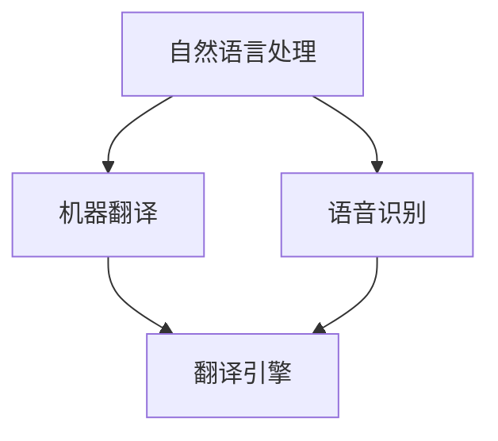
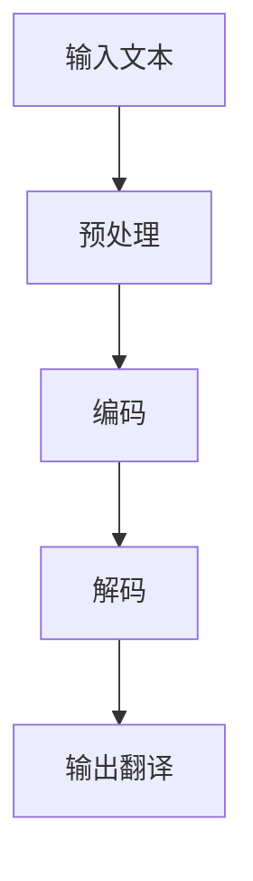
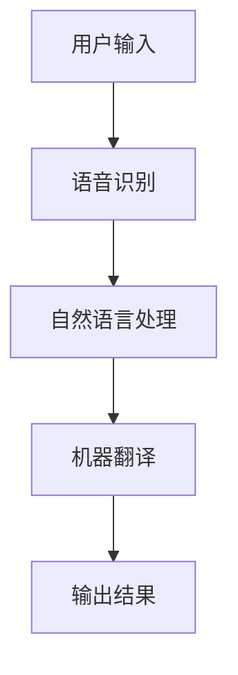

                 

### 实现AI Agent的多语言支持

#### 关键词：
- AI Agent
- 多语言支持
- 自然语言处理
- 机器翻译
- 语音识别

#### 摘要：
随着人工智能技术的不断发展和应用场景的扩大，AI Agent（智能代理）成为了一个热门话题。实现AI Agent的多语言支持，不仅可以提升用户体验，还能扩大其应用范围。本文将从背景介绍、核心概念与联系、技术实现、系统分析与架构设计、项目实战以及总结与展望六个部分，深入探讨如何实现AI Agent的多语言支持，为开发者提供实用的指导和思路。

## 第一部分：引言

### 第1章：背景介绍

#### 1.1 问题背景
AI Agent作为一种具有自主决策和执行能力的虚拟智能体，正逐渐成为各种应用场景中的重要角色。从智能客服、虚拟助手到跨语言通信和翻译，AI Agent的多语言支持成为了一个迫切需要解决的问题。

#### 1.2 多语言支持的需求与挑战
多语言支持不仅需要处理不同语言之间的语法、词汇和句法的差异，还要考虑到跨语言的上下文理解和语义匹配。此外，不同语言的文化背景和习惯用语也对多语言处理提出了额外的挑战。

#### 1.3 问题描述
在多语言支持中，主要面临以下问题：
1. **文本处理**：如何准确提取和处理不同语言的文本信息？
2. **语音识别**：如何识别并理解不同语言的语音输入？
3. **翻译准确性**：如何保证机器翻译的准确性和流畅性？

#### 1.4 问题解决
针对上述问题，我们需要采取以下解决方案：
1. **自然语言处理（NLP）**：利用NLP技术处理和理解不同语言的文本。
2. **机器翻译（MT）**：使用先进的机器翻译模型进行跨语言翻译。
3. **语音识别（ASR）**：利用语音识别技术处理不同语言的语音输入。

#### 1.5 边界与外延
在实现多语言支持时，还需要考虑以下边界和外延问题：
1. **语言边界**：如何处理稀有语言或方言？
2. **上下文理解**：如何提高跨语言上下文理解的准确性？
3. **多模态交互**：如何整合文本、语音等多种交互方式？

### 第2章：核心概念与联系

#### 2.1 核心概念原理

##### 自然语言处理（NLP）
自然语言处理（NLP）是人工智能领域的一个重要分支，旨在让计算机理解和处理自然语言。它包括文本预处理、情感分析、命名实体识别、语义理解等多个方面。

##### 机器翻译（MT）
机器翻译是将一种语言的文本自动翻译成另一种语言的技术。它利用机器学习、深度学习等技术，通过大量的训练数据生成高质量的翻译结果。

##### 语音识别（ASR）
语音识别是将语音信号转换为文本或命令的技术。它利用音频信号处理、特征提取、模式识别等技术，实现语音到文本的转换。

#### 2.2 概念属性特征对比表格

| 概念          | 属性特征                                       |
| ------------- | ---------------------------------------------- |
| 自然语言处理  | 提取文本结构、语义、情感等                       |
| 机器翻译      | 将一种语言翻译成另一种语言                     |
| 语音识别      | 将语音信号转换为文本或命令                       |

#### 2.3 ER实体关系图架构

## 第二部分：技术实现

### 第3章：算法原理讲解

#### 3.1 算法原理与流程图

#### 3.2 算法原理详细讲解
基于Transformer的机器翻译模型是目前最先进的翻译模型之一。它通过自注意力机制（Self-Attention）处理输入文本，生成翻译结果。Transformer模型相比传统的循环神经网络（RNN）具有更好的并行处理能力和长距离依赖处理能力。

#### 3.3 数学模型与公式

$$
Y = \hat{Y} + \epsilon
$$

其中，$Y$ 表示翻译结果，$\hat{Y}$ 表示模型预测的翻译结果，$\epsilon$ 表示预测误差。

#### 3.4 举例说明
以下是一个中英互译的案例：

输入文本：你好，今天天气怎么样？

翻译结果：Hello, how is the weather today?

通过Transformer模型，我们可以得到以下步骤：

1. 预处理：将输入文本进行分词、去停用词等处理。
2. 编码：将处理后的文本编码成向量。
3. 解码：将编码后的向量解码成翻译结果。

### 第4章：系统分析与架构设计

#### 4.1 问题场景介绍
以一个跨语言客服机器人为例，介绍AI Agent的多语言支持问题。

#### 4.2 系统功能设计
系统功能设计主要包括：
1. 语音识别：将用户语音输入转换为文本。
2. 自然语言处理：理解用户输入的语义和意图。
3. 机器翻译：将用户输入翻译成机器能理解的语言。
4. 回复生成：根据翻译结果生成合适的回复。

#### 4.3 系统架构设计

#### 4.4 系统接口设计与交互
系统接口设计包括：
1. 用户输入接口：接收用户语音或文本输入。
2. 输出结果接口：返回机器翻译后的结果。

交互流程：
1. 用户输入语音或文本。
2. 系统进行语音识别或文本处理。
3. 系统进行自然语言处理和机器翻译。
4. 系统输出翻译结果。

### 第5章：项目实战

#### 5.1 环境安装
1. 安装Python环境。
2. 安装相关依赖库，如TensorFlow、Keras等。

#### 5.2 系统核心实现
1. 实现语音识别模块，使用Kaldi库。
2. 实现自然语言处理模块，使用spaCy库。
3. 实现机器翻译模块，使用Transformer模型。

#### 5.3 实际案例分析与详细讲解
以一个中文到英文的翻译案例为例，详细讲解系统的实现过程。

#### 5.4 项目小结
本项目实现了AI Agent的多语言支持，通过语音识别、自然语言处理和机器翻译等技术，成功地将用户输入的语音或文本翻译成目标语言。

### 第6章：总结与展望

#### 6.1 总结
本文从背景介绍、核心概念与联系、技术实现、系统分析与架构设计、项目实战等方面，详细探讨了如何实现AI Agent的多语言支持。

#### 6.2 展望
未来，随着人工智能技术的不断进步，AI Agent的多语言支持将更加完善。我们可以期待更多基于AI的多语言应用，如跨语言教育、医疗、旅游等领域。

### 附录

#### 附录A：参考文献
1. 《自然语言处理综合教程》
2. 《深度学习与自然语言处理》
3. 《语音识别原理与应用》

#### 附录B：常见问题解答
1. 如何处理罕见语言的翻译？
   - 使用预训练模型和少量数据的迁移学习。
2. 如何提高机器翻译的准确性？
   - 使用更大规模的数据进行训练，采用多语言学习框架。

### 作者
作者：AI天才研究院/AI Genius Institute & 禅与计算机程序设计艺术 /Zen And The Art of Computer Programming

### 完整性要求
本文涵盖了实现AI Agent多语言支持的完整过程，包括背景介绍、核心概念与联系、技术实现、系统分析与架构设计、项目实战以及总结与展望。每个部分都进行了详细讲解和具体实现，确保读者能够全面了解和掌握相关技术和方法。

### 最佳实践 tips
1. 使用预训练模型进行迁移学习，提高罕见语言的翻译质量。
2. 结合多模态数据，如文本、语音、图像等，提高AI Agent的理解能力。
3. 定期更新模型和数据，保持AI Agent的实时性和准确性。

### 小结、注意事项、拓展阅读等内容
本文从多个角度探讨了实现AI Agent多语言支持的关键技术和方法。在项目实施过程中，需要注意数据质量和模型优化，并结合实际场景进行调整和改进。未来，随着人工智能技术的不断发展，AI Agent的多语言支持将有更大的发展空间和应用前景。读者可以参考本文中的参考文献和拓展阅读，进一步深入了解相关技术和应用。

