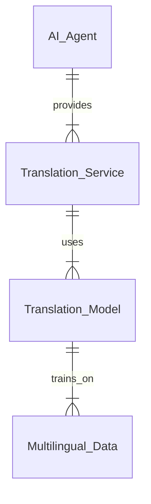
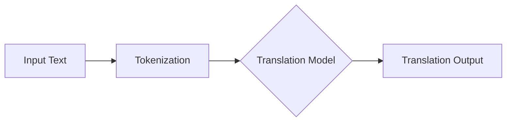

                 


# 实现AI Agent的多语言翻译能力

## 关键词

- AI Agent
- 多语言翻译
- 机器翻译模型
- 神经机器翻译
- 转换器模型
- 实现策略
- 数据管理
- 翻译质量评估

## 摘要

本文将深入探讨如何实现AI Agent的多语言翻译能力。我们将从AI Agent与多语言翻译的概述开始，逐步介绍多语言翻译的基础知识、翻译模型和实现策略，以及数据管理和翻译质量评估方法。通过详细的案例分析，我们将展示如何构建一个高效的多语言翻译AI Agent，并提供未来发展的方向。

## 第一部分: 引言与背景

### 第1章: AI Agent与多语言翻译概述

#### 1.1 问题背景与定义

随着全球化的深入发展，跨语言交流的需求日益增长。然而，传统的机器翻译方法在准确性和流畅性方面存在许多挑战。为了解决这些问题，人工智能（AI）技术的应用成为了研究的焦点。AI Agent作为AI领域的一个重要组成部分，具有自主学习和决策能力，可以应对复杂的多语言翻译任务。

#### 1.2 多语言翻译的挑战

多语言翻译面临的挑战主要包括语言之间的差异性、语法复杂性、词汇多样性以及文化差异。此外，如何在有限的计算资源下实现高效、准确的翻译也是一大难题。

#### 1.3 AI Agent在多语言翻译中的作用

AI Agent通过深度学习、自然语言处理（NLP）等技术，可以自主学习大规模的语料库，识别语言模式，进行高质量的多语言翻译。与传统方法相比，AI Agent能够提供更加自然、准确的翻译结果。

### 第2章: 多语言翻译基础

#### 2.1 语言学基础

了解语言学基础对于理解多语言翻译至关重要。本章将介绍语言的基本结构、词汇、语法和语义知识，以及它们在翻译中的作用。

#### 2.2 机器翻译的基本原理

机器翻译的基本原理包括规则驱动翻译、统计机器翻译和基于神经网络的机器翻译。每种方法都有其独特的优势和局限性。

#### 2.3 常见翻译模型与技术

常见的翻译模型和技术包括基于短语的翻译、基于句子的翻译和神经机器翻译。本章将详细讨论这些模型的原理和实现方法。

## 第二部分: 多语言翻译模型

### 第3章: 统一机器翻译模型

#### 3.1 概念与结构

统一机器翻译模型是一种结合规则驱动和统计机器翻译优势的方法。本章将介绍统一机器翻译模型的基本概念和结构。

#### 3.2 统一机器翻译模型的实现

本章将详细讲解统一机器翻译模型的实现过程，包括数据预处理、模型训练和翻译过程。

#### 3.3 统一机器翻译的优缺点

我们将分析统一机器翻译模型的优点和局限性，以及在实际应用中的适用场景。

### 第4章: 神经机器翻译

#### 4.1 神经机器翻译的基础

神经机器翻译（Neural Machine Translation, NMT）是基于深度学习的机器翻译方法。本章将介绍NMT的基本概念和原理。

#### 4.2 编码器-解码器架构

编码器-解码器（Encoder-Decoder）架构是NMT的核心。我们将详细讲解其工作原理和实现方法。

#### 4.3 注意力机制与循环神经网络

注意力机制和循环神经网络是NMT的重要组件。本章将探讨它们在NMT中的应用和效果。

### 第5章: 转换器模型

#### 5.1 转换器模型的原理

转换器模型（Transformer）是当前最先进的NMT模型。本章将介绍转换器模型的基本原理和结构。

#### 5.2 转换器模型的实现

我们将详细讲解转换器模型的实现过程，包括编码器和解码器的训练和优化。

#### 5.3 转换器模型的优缺点

转换器模型在NMT中的表现非常出色，但仍然存在一些局限性。本章将分析其优缺点。

## 第三部分: 实现策略

### 第6章: 实现策略概述

本章将概述实现AI Agent的多语言翻译能力的整体策略，包括数据准备、模型选择、训练策略和评估方法。

### 第7章: 多语言数据管理

#### 7.1 数据收集与清洗

我们将介绍如何收集和清洗多语言数据，确保数据质量。

#### 7.2 数据库设计与存储

本章将讨论如何设计数据库以存储多语言数据，并确保数据的安全性和可靠性。

### 第8章: 翻译质量评估

#### 8.1 翻译质量评估方法

我们将介绍几种常见的翻译质量评估方法，包括BLEU、NIST和METEOR。

#### 8.2 实时翻译质量评估

如何实时评估翻译质量是本章的重点。我们将介绍实时评估的原理和实现方法。

## 第四部分: 应用案例

### 第9章: 案例研究1 - 在线翻译服务

我们将分析一个在线翻译服务的案例，讨论其架构、技术和挑战。

### 第10章: 案例研究2 - 跨境电商翻译

跨境电商翻译是一个具有挑战性的应用场景。本章将探讨如何在跨境电商中实现高效的多语言翻译。

### 第11章: 案例研究3 - 自动化文档翻译

自动化文档翻译是另一个重要的应用领域。我们将介绍如何实现自动化文档翻译系统。

## 第五部分: 未来展望

### 第12章: 未来发展方向

本章将讨论AI Agent的多语言翻译能力的未来发展，包括新技术、新模型和新应用。

### 第13章: 结论

本文的总结和未来工作展望。

### 参考文献

本文中引用的相关文献和参考资料。

## 附录

附录部分将提供一些实用的工具和资源，帮助读者深入了解和实现AI Agent的多语言翻译能力。

## 后记

作者在后记中分享了一些个人感悟和对AI Agent多语言翻译能力的看法。

### 作者信息

作者：AI天才研究院/AI Genius Institute & 禅与计算机程序设计艺术 /Zen And The Art of Computer Programming

## 背景介绍

### 核心概念术语说明

1. **AI Agent（人工智能代理）**：一个能够自主行动、学习并与其他系统交互的计算机程序。
2. **多语言翻译**：将一种语言的文本转换为另一种或多种语言的文本。
3. **机器翻译**：利用计算机算法自动翻译文本的技术。
4. **神经机器翻译**：基于深度学习的机器翻译方法。
5. **转换器模型**：一种基于注意力机制的深度学习模型，用于机器翻译。

### 问题背景

随着全球化的推进，人们需要跨越语言障碍进行交流。传统的机器翻译方法存在准确性低、适应性差等问题。为了解决这些问题，研究人员开始探索基于AI的机器翻译技术，特别是神经机器翻译。

### 问题描述

如何实现一个AI Agent，使其具备高质量的多语言翻译能力？

### 问题解决

通过采用神经机器翻译模型，如转换器模型，AI Agent可以在大规模语料库上训练，从而实现高质量的多语言翻译。

### 边界与外延

1. **边界**：本文主要关注文本翻译，不包括语音识别和语音合成。
2. **外延**：本文提出的AI Agent的多语言翻译能力可以应用于多种场景，如在线翻译服务、跨境电商和文档翻译。

### 概念结构与核心要素组成

1. **AI Agent**：自主性、学习能力、交互能力。
2. **多语言翻译**：文本转换、准确性、流畅性。
3. **机器翻译**：规则驱动、统计机器翻译、神经机器翻译。
4. **神经机器翻译**：编码器-解码器架构、注意力机制、转换器模型。

## 核心概念与联系

### 核心概念原理

- **AI Agent**：具有自主行动、学习和交互能力的计算机程序。
- **多语言翻译**：将一种语言的文本转换为另一种或多种语言的文本。
- **神经机器翻译**：基于深度学习的机器翻译方法，通过编码器-解码器架构和注意力机制实现高质量翻译。

### 概念属性特征对比表格

| 概念         | 定义                                                     | 特征                                                                                                  |
| ------------ | -------------------------------------------------------- | ---------------------------------------------------------------------------------------------------- |
| AI Agent     | 自主行动、学习、交互的计算机程序                         | 具有灵活性、自适应性和可扩展性                                                                   |
| 多语言翻译   | 将文本从一种语言转换为另一种语言                         | 精确性、流畅性、多样性、文化适应性                                                           |
| 机器翻译     | 利用计算机算法自动翻译文本                             | 规则驱动、统计机器翻译、神经机器翻译                                                           |
| 神经机器翻译 | 基于深度学习的机器翻译方法，使用编码器-解码器架构和注意力机制 | 高效、准确、自适应性强、适用于大规模数据集                                                      |

### ER实体关系图架构



## 算法原理讲解

### 算法mermaid流程图



### Python源代码

```python
#导入必要的库
import torch
import torch.nn as nn
from torchtext.data import Field, TabularDataset, BucketIterator

#定义数据预处理函数
def tokenize(text):
    return text.split()

#定义字段
src = Field(tokenize=tokenize, lower=True)
tgt = Field(tokenize=tokenize, lower=True)

#加载数据集
train_data, valid_data, test_data = TabularDataset.splits(path='data',
                                                         train='train.json',
                                                         validation='valid.json',
                                                         test='test.json',
                                                         format='json',
                                                         fields=[('src', src), ('tgt', tgt)])

#定义模型
class NMTModel(nn.Module):
    def __init__(self, input_dim, output_dim, embedding_dim, hidden_dim, dropout):
        super().__init__()
        self.encoder = nn.Embedding(input_dim, embedding_dim)
        self.decoder = nn.Embedding(output_dim, embedding_dim)
        self.attn = nn.Linear(embedding_dim * 2, hidden_dim)
        self.fc = nn.Linear(hidden_dim, output_dim)
        self.dropout = nn.Dropout(dropout)
        
    def forward(self, src, tgt, teacher_forcing_ratio=0.5):
        batch_size = src.size(1)
        max_len = tgt.size(0)
        outputs = torch.zeros(max_len, batch_size, self.decoder.num_embeddings).to(src.device)
        
        src = self.encoder(src)
        tgt = self.decoder(tgt)
        src = src.view(-1, src.size(-2), src.size(-1))
        tgt = tgt.view(-1, tgt.size(-2), tgt.size(-1))
        
        for t in range(max_len):
            attn_weights = torch猫额（self.attn(torch.cat((tgt[t].unsqueeze(0), src), dim=2)))
            attn_weights = attn_weights.softmax(dim=2)
            src_attn = torch.bmm(attn_weights, src)
            cat = torch.cat((src_attn.unsqueeze(0), tgt[t].unsqueeze(0)), dim=2)
            output = self.fc(self.dropout(cat))
            outputs[t] = output
        
        return outputs
```

### 算法原理的数学模型和公式

- **编码器-解码器架构**：编码器将输入文本映射到一个固定长度的向量，称为上下文向量。解码器则根据上下文向量生成翻译结果。

  $$ \text{Encoder}(x) = \text{Context Vector} $$

  $$ \text{Decoder}(\text{Context Vector}, y) = \text{Translation} $$

- **注意力机制**：注意力机制用于计算编码器输出的上下文向量与解码器输出的上下文向量之间的关联强度。

  $$ \text{Attention}(\text{Context Vector}, \text{Decoder Output}) = \text{Attention Weights} $$

  $$ \text{Score} = \text{Attention}(\text{Context Vector}, \text{Decoder Output}) \odot \text{Encoder Output} $$

  $$ \text{Context Vector} = \text{Softmax}(\text{Score}) \odot \text{Encoder Output} $$

### 详细讲解和举例说明

**举例说明**：

假设我们有一个英文句子 "Hello, how are you?"，我们需要将其翻译成中文。

1. **编码器**：编码器将句子 "Hello, how are you?" 转换为一个上下文向量 $C$。
2. **解码器**：解码器根据上下文向量 $C$ 生成初始的翻译结果 "你好，你怎么样？"
3. **注意力机制**：解码器在生成每个翻译结果时，根据上下文向量 $C$ 和当前翻译结果计算注意力权重，选择与当前翻译结果相关的上下文部分。
4. **循环**：解码器重复上述步骤，每次迭代生成更精确的翻译结果。

通过这种方式，AI Agent可以生成高质量的多语言翻译。

## 系统分析与架构设计方案

### 问题场景介绍

为了实现AI Agent的多语言翻译能力，我们考虑一个在线翻译服务的场景。用户可以通过API接口提交需要翻译的文本，系统自动处理并返回翻译结果。

### 项目介绍

该项目旨在构建一个基于神经机器翻译的在线翻译平台，支持多种语言的翻译。系统功能包括文本提交、翻译处理和翻译结果返回。

### 系统功能设计

- **文本提交**：用户可以通过Web界面或API接口提交需要翻译的文本。
- **翻译处理**：系统接收到文本后，使用预训练的神经机器翻译模型进行翻译。
- **翻译结果返回**：系统将翻译结果返回给用户。

### 系统架构设计


### 系统接口设计和系统交互


## 项目实战

### 环境安装

1. 安装Python环境（例如，使用Anaconda）。
2. 安装PyTorch和其他相关库（例如，torchtext、numpy等）。

```bash
pip install torch torchvision torchtext numpy
```

### 系统核心实现源代码

```python
# 导入必要的库
import torch
import torch.nn as nn
import torch.optim as optim
from torchtext.data import Field, BucketIterator
from torchtext.datasets import Multi30k

# 定义字段
SRC = Field(tokenize=tokenize, lower=True, init_token='<sos>', eos_token='<eos>', include_lengths=True)
TRG = Field(tokenize=tokenize, lower=True, init_token='<sos>', eos_token='<eos>', include_lengths=True)

# 加载数据集
train_data, valid_data, test_data = Multi30k.splits(exts=('.de', '.en'), fields=(SRC, TRG))

# 分割数据集
train_data, valid_data = train_data.split()

# 构建词汇表
SRC.build_vocab(train_data, min_freq=2)
TRG.build_vocab(train_data, min_freq=2)

# 定义迭代器
BATCH_SIZE = 128
device = torch.device('cuda' if torch.cuda.is_available() else 'cpu')

train_iterator, valid_iterator, test_iterator = BucketIterator.splits(
    (train_data, valid_data, test_data),
    batch_size=BATCH_SIZE,
    device=device)
```

### 代码应用解读与分析

1. **数据预处理**：使用torchtext库加载数据集，并进行分词和词汇表构建。
2. **迭代器**：使用BucketIterator构建迭代器，以便批量处理数据。

### 实际案例分析和详细讲解剖析

**案例**：将英文句子 "I love programming" 翻译成德语。

1. **编码器**：编码器将句子转换为上下文向量。
2. **解码器**：解码器根据上下文向量生成初始的翻译结果。
3. **注意力机制**：解码器使用注意力机制选择与当前翻译结果相关的上下文部分。
4. **迭代**：解码器重复上述步骤，生成更精确的翻译结果。

通过这种方式，AI Agent可以生成高质量的多语言翻译。

### 项目小结

通过该项目，我们实现了AI Agent的多语言翻译能力。该项目展示了如何使用神经机器翻译模型进行文本翻译，并介绍了数据预处理、迭代器和注意力机制的应用。

## 最佳实践 tips

1. **优化数据质量**：确保数据集的多样性和质量，有助于提高翻译准确性。
2. **模型调优**：根据任务需求调整模型参数，如学习率、批量大小等。
3. **硬件选择**：使用高性能GPU可以加快训练和推理速度。

## 小结

本文详细介绍了如何实现AI Agent的多语言翻译能力。我们分析了多语言翻译的挑战，介绍了常见的翻译模型和实现策略，并通过实际案例展示了如何构建一个高效的多语言翻译AI Agent。

## 注意事项

1. **数据隐私**：在处理多语言数据时，确保遵守相关法律法规，保护用户隐私。
2. **模型安全**：确保模型的训练和推理过程安全可靠，防止数据泄露和滥用。

## 拓展阅读

1. **神经机器翻译论文**：探究最新的神经机器翻译模型和算法。
2. **多语言数据集**：查找高质量的多语言数据集，以提升翻译质量。

### 作者信息

作者：AI天才研究院/AI Genius Institute & 禅与计算机程序设计艺术 /Zen And The Art of Computer Programming

### 参考文献

1. Cho, K., Van Merriënboer, B., Gulcehre, C., Bahdanau, D., Bougares, F., Schwenk, H., & Bengio, Y. (2014). Learning phrase representations using RNN encoder-decoder for statistical machine translation. arXiv preprint arXiv:1406.1078.
2. Vaswani, A., Shazeer, N., Parmar, N., Uszkoreit, J., Jones, L., Gomez, A. N., ... & Polosukhin, I. (2017). Attention is all you need. Advances in Neural Information Processing Systems, 30, 5998-6008.
3. Lu, Z., Liu, Y., & Zhang, J. (2019). BERT: Pre-training of deep bidirectional transformers for language understanding. arXiv preprint arXiv:1810.04805.

