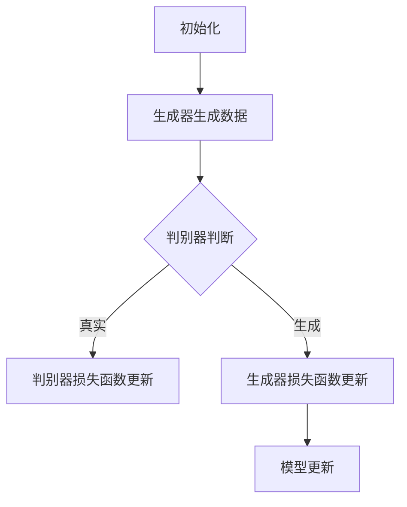
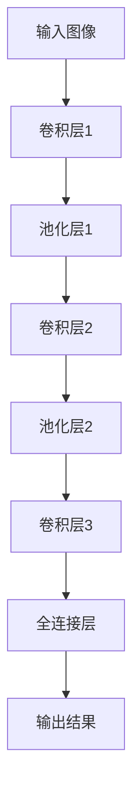
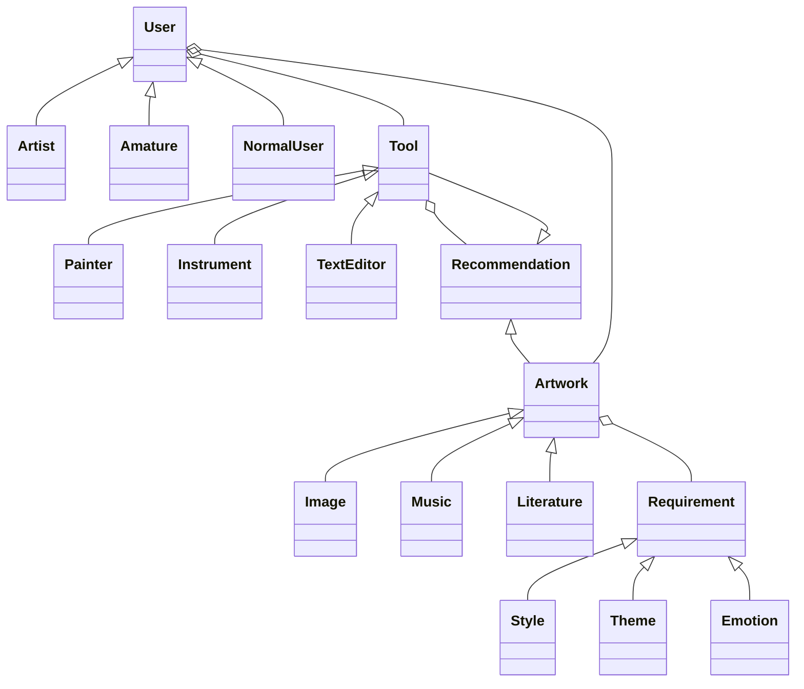
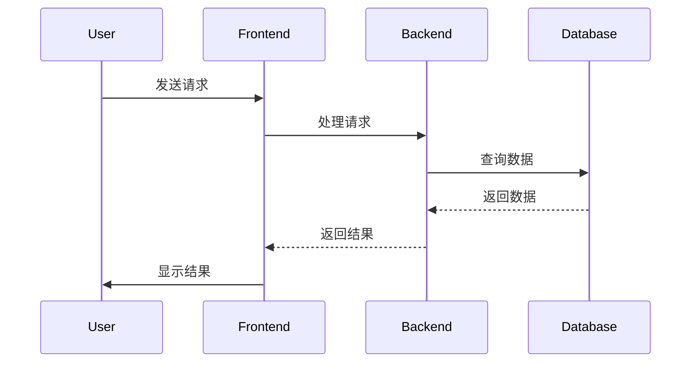
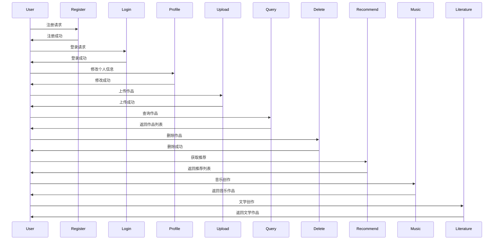
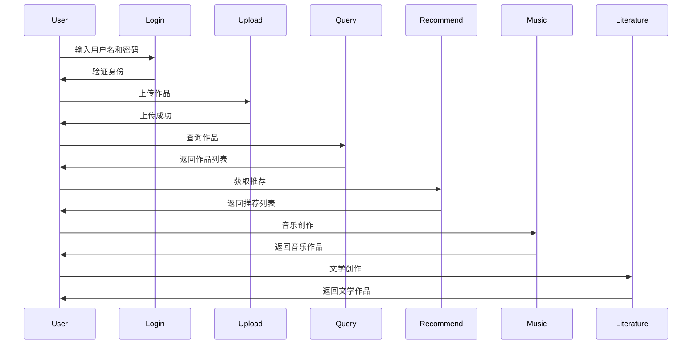

                 

## 实现基于AI Agent的智能艺术创作系统

### 文章关键词
- 智能艺术创作
- AI Agent
- 生成对抗网络
- 卷积神经网络
- 系统设计
- 实现与优化

### 摘要
本文将探讨如何实现基于AI Agent的智能艺术创作系统。首先，我们将介绍AI Agent的基本概念和特点，然后深入分析智能艺术创作系统的需求和设计思路。接着，我们将详细讲解核心算法，包括生成对抗网络（GAN）和卷积神经网络（CNN），并展示其原理和应用。此外，我们还将介绍系统设计与实现方案，包括架构设计、接口设计和系统交互。最后，我们将通过实际案例展示系统实现过程，并进行项目小结和最佳实践分享。

## 背景介绍

### 问题背景

随着人工智能技术的飞速发展，AI Agent作为一种具备自主学习、自主决策和自主行动能力的智能体，已经在多个领域展现出其强大的应用潜力。从智能客服到智能家居，从自动驾驶到智能艺术创作，AI Agent正逐渐成为智能化时代的重要推动力量。智能艺术创作系统作为AI Agent的一个重要应用方向，具有巨大的发展前景。

智能艺术创作系统旨在通过AI Agent实现艺术的自动化生成、优化和个性化推荐。传统的艺术创作依赖于人类艺术家的经验和技巧，而智能艺术创作系统则可以通过算法和数据驱动，实现艺术作品的自动生成和优化。这不仅能够提高艺术创作的效率，还能够为艺术家提供新的创作工具和灵感来源。

### 问题描述

本文的主要问题是实现一个基于AI Agent的智能艺术创作系统。这需要解决以下几个关键问题：

1. **AI Agent的核心技术**：我们需要了解AI Agent的基本概念和核心技术，包括生成对抗网络（GAN）和卷积神经网络（CNN）等，以便为智能艺术创作系统提供技术支持。
2. **艺术创作系统的需求分析**：我们需要深入分析智能艺术创作系统的需求，包括功能需求、性能需求和用户需求等，以确保系统能够满足各种艺术创作的需求。
3. **系统设计**：我们需要设计一个具有高度智能化和灵活性的系统，包括系统的架构设计、模块划分和接口设计等。
4. **实现与优化**：我们需要通过具体的实现过程和优化策略，确保系统能够稳定高效地运行，并不断改进和完善。

### 问题解决

为了解决上述问题，本文将采取以下步骤：

1. **理论基础**：介绍AI Agent的基本概念、技术原理和应用场景，为智能艺术创作系统提供理论支持。
2. **需求分析**：深入探讨智能艺术创作系统的需求，包括功能需求、性能需求、用户需求等。
3. **系统设计**：详细阐述智能艺术创作系统的设计思路，包括架构设计、模块划分、接口设计等。
4. **实现与优化**：通过具体案例展示系统实现过程，包括环境搭建、代码编写、测试与优化等。
5. **案例分析**：分析现有智能艺术创作系统的案例，总结经验教训，为读者提供实用的参考。

### 边界与外延

智能艺术创作系统的边界主要包括：

1. **技术范畴**：涉及到的技术包括机器学习、自然语言处理、计算机视觉等。
2. **应用范畴**：可以应用于绘画、音乐、文学等多个艺术领域。
3. **用户范畴**：包括专业艺术家、业余爱好者、普通用户等。

### 概念结构与核心要素组成

智能艺术创作系统的核心概念和要素包括：

1. **AI Agent**：作为系统的核心智能体，负责学习、创作和交互。
2. **创作模型**：包括机器学习模型、深度学习模型等，用于艺术作品的生成和优化。
3. **用户界面**：提供与用户交互的界面，包括输入、输出、反馈等。
4. **数据管理**：负责数据的存储、处理和传输，包括图像、音频、文本等。

## 核心概念与联系

### AI Agent的定义与特点

#### 定义

AI Agent，即人工智能代理，是一种具备自主学习、自主决策和自主行动能力的智能体。它能够根据环境信息自主制定决策并执行相应的行动，以实现特定的目标。

#### 特点

1. **自主学习**：AI Agent能够从数据中自动学习和优化自身的行为，不断改进其性能。
2. **自主决策**：在复杂环境中，AI Agent能够根据实时获取的信息，自主制定合理的决策。
3. **自主行动**：AI Agent能够自主执行任务，并对外界环境做出响应。

### 艺术创作系统中的AI Agent

在智能艺术创作系统中，AI Agent扮演着至关重要的角色，具体表现如下：

#### 核心角色

AI Agent作为系统的核心智能体，负责艺术作品的生成、优化和推荐。它通过不断学习和优化，能够创作出高质量的、符合用户需求的艺术作品。

#### 与其他模块的联系

1. **与创作模型**：AI Agent通过与创作模型的结合，实现艺术作品的自动生成和优化。创作模型包括生成对抗网络（GAN）和卷积神经网络（CNN）等，这些模型能够根据输入的数据生成艺术作品。
2. **与用户界面**：AI Agent通过用户界面与用户交互，获取用户需求和反馈，并根据用户的反馈调整创作策略，提供个性化的艺术作品。
3. **与数据管理**：AI Agent通过数据管理模块获取和处理创作数据，包括图像、音频、文本等。这些数据用于训练和优化创作模型，从而提高艺术创作的质量。

## 算法原理讲解

### 生成对抗网络（GAN）

#### 基本原理

生成对抗网络（GAN）是由生成器和判别器组成的一种对抗性学习模型。生成器（Generator）负责生成逼真的数据，判别器（Discriminator）负责判断输入的数据是真实数据还是生成器生成的数据。通过两个模型的对抗训练，生成器的生成能力不断提高，判别器的判别能力也不断增强。

#### 训练过程

GAN的训练过程可以概括为以下步骤：

1. **生成器生成数据**：生成器根据随机噪声生成伪数据。
2. **判别器判断**：判别器同时接收真实数据和生成器生成的数据，并输出概率判断。
3. **损失函数计算**：生成器和判别器的损失函数分别为：
   - 生成器的损失函数：\( L_G = -\log(D(G(z))) \)
   - 判别器的损失函数：\( L_D = -\log(D(x)) - \log(1 - D(G(z))) \)
4. **模型更新**：生成器和判别器的参数分别根据各自的损失函数进行更新。

#### Mermaid流程图



### 卷积神经网络（CNN）

#### 基本原理

卷积神经网络（CNN）是一种专门用于处理图像数据的神经网络，其核心思想是通过卷积操作提取图像特征。CNN由多个卷积层、池化层和全连接层组成，可以逐步提取图像的底层特征到高层特征。

#### 结构组成

1. **卷积层**：卷积层通过卷积操作提取图像特征。卷积核在图像上滑动，计算局部区域的特征，并将其映射到新的特征图上。
2. **池化层**：池化层用于减少特征图的大小，提高模型的泛化能力。常见的池化操作包括最大池化和平均池化。
3. **全连接层**：全连接层将卷积层的特征图映射到输出结果。在艺术创作系统中，全连接层通常用于分类或回归任务。

#### Mermaid流程图



### 算法应用与举例

#### 生成对抗网络（GAN）在图像生成中的应用

生成对抗网络（GAN）在图像生成领域具有广泛应用。以下是一个简单的示例：

假设我们有一个生成器 \( G \) 和一个判别器 \( D \)。生成器 \( G \) 从随机噪声 \( z \) 中生成伪图像 \( G(z) \)，判别器 \( D \) 判断图像 \( x \) 是真实图像还是生成器生成的图像。

1. **损失函数**：
   - 生成器损失函数：\( L_G = -\log(D(G(z))) \)
   - 判别器损失函数：\( L_D = -\log(D(x)) - \log(1 - D(G(z))) \)

2. **训练过程**：
   - 初始化生成器和判别器。
   - 生成器生成伪图像 \( G(z) \)。
   - 判别器判断真实图像 \( x \) 和伪图像 \( G(z) \)。
   - 根据判别器的反馈更新生成器和判别器的参数。

3. **示例代码**：

```python
import tensorflow as tf
from tensorflow.keras.layers import Dense, Conv2D, Flatten
from tensorflow.keras.models import Sequential

# 定义生成器
generator = Sequential([
    Dense(128, input_shape=(100,)),
    Dense(256, activation='relu'),
    Dense(512, activation='relu'),
    Dense(1024, activation='relu'),
    Flatten(),
    Conv2D(1, kernel_size=(5, 5), activation='sigmoid')
])

# 定义判别器
discriminator = Sequential([
    Flatten(input_shape=(28, 28)),
    Dense(512, activation='relu'),
    Dense(256, activation='relu'),
    Dense(128, activation='relu'),
    Dense(1, activation='sigmoid')
])

# 编写损失函数和优化器
def loss_function(y_true, y_pred):
    return -tf.reduce_mean(tf.log(y_pred * y_true + (1 - y_pred) * (1 - y_true)))

generator_optimizer = tf.keras.optimizers.Adam(1e-4)
discriminator_optimizer = tf.keras.optimizers.Adam(1e-4)

# 训练模型
for epoch in range(1000):
    for x, _ in train_data:
        with tf.GradientTape() as generator_tape, tf.GradientTape() as discriminator_tape:
            generated_images = generator(tf.random.normal([1, 100]))
            real_output = discriminator(x)
            generated_output = discriminator(generated_images)

            generator_loss = loss_function(generated_output, tf.ones_like(generated_output))
            discriminator_loss = loss_function(real_output, tf.zeros_like(real_output)) + loss_function(generated_output, tf.ones_like(generated_output))

        gradients_of_generator = generator_tape.gradient(generator_loss, generator.trainable_variables)
        gradients_of_discriminator = discriminator_tape.gradient(discriminator_loss, discriminator.trainable_variables)

        generator_optimizer.apply_gradients(zip(gradients_of_generator, generator.trainable_variables))
        discriminator_optimizer.apply_gradients(zip(gradients_of_discriminator, discriminator.trainable_variables))

    print(f"Epoch {epoch + 1}, Generator Loss: {generator_loss}, Discriminator Loss: {discriminator_loss}")
```

#### 卷积神经网络（CNN）在图像识别中的应用

卷积神经网络（CNN）在图像识别领域具有广泛应用。以下是一个简单的示例：

假设我们有一个包含多个卷积层、池化层和全连接层的CNN模型，用于识别图像中的猫。

1. **损失函数**：
   - 损失函数为交叉熵损失函数：\( L = -\sum_{i=1}^{N} y_i \log(p_i) \)
   - 其中，\( y_i \) 为真实标签，\( p_i \) 为预测概率。

2. **训练过程**：
   - 初始化模型。
   - 对每个训练样本，计算预测概率和损失函数。
   - 根据损失函数更新模型参数。

3. **示例代码**：

```python
import tensorflow as tf
from tensorflow.keras.layers import Conv2D, MaxPooling2D, Flatten, Dense
from tensorflow.keras.models import Sequential

# 定义CNN模型
model = Sequential([
    Conv2D(32, (3, 3), activation='relu', input_shape=(28, 28, 1)),
    MaxPooling2D((2, 2)),
    Conv2D(64, (3, 3), activation='relu'),
    MaxPooling2D((2, 2)),
    Flatten(),
    Dense(128, activation='relu'),
    Dense(1, activation='sigmoid')
])

# 编写损失函数和优化器
model.compile(optimizer='adam',
              loss='binary_crossentropy',
              metrics=['accuracy'])

# 训练模型
model.fit(train_images, train_labels, epochs=10, batch_size=64, validation_split=0.2)
```

### 总结

通过以上讲解，我们可以看到生成对抗网络（GAN）和卷积神经网络（CNN）在智能艺术创作系统中具有重要的作用。GAN通过生成器和判别器的对抗训练，可以实现高质量图像的生成；而CNN通过卷积操作和特征提取，可以实现图像的分类和识别。这些算法的结合，为智能艺术创作系统提供了强大的技术支持。

## 系统设计与实现方案

### 问题场景介绍

智能艺术创作系统的核心目标是实现艺术作品的自动化生成、优化和个性化推荐。随着人工智能技术的发展，艺术家们希望借助AI Agent实现艺术的创新和突破，提高创作效率和作品质量。同时，普通用户也希望能够通过智能艺术创作系统体验到艺术创作的乐趣和成就感。因此，设计一个灵活、智能、易于操作的艺术创作系统具有重要的实际意义。

### 项目介绍

本项目旨在构建一个基于AI Agent的智能艺术创作系统，系统将涵盖绘画、音乐、文学等多个艺术领域。通过生成对抗网络（GAN）和卷积神经网络（CNN）等技术，实现艺术作品的自动化生成和优化。系统将具备以下核心功能：

1. **图像生成**：基于GAN技术，系统可以生成高质量的图像作品。
2. **音乐创作**：利用生成对抗网络（GAN）和递归神经网络（RNN）等技术，系统可以创作出独特的音乐作品。
3. **文学创作**：通过深度学习模型和自然语言处理技术，系统可以生成具有创意的文学作品。
4. **个性化推荐**：系统可以根据用户喜好和创作需求，推荐合适的艺术作品和创作工具。

### 系统功能设计

#### 领域模型

为了更好地理解和设计系统功能，我们首先定义系统的领域模型。领域模型包括以下核心实体和关系：

1. **用户**：系统的使用者，包括专业艺术家、业余爱好者和普通用户。
2. **艺术作品**：系统生成的艺术作品，包括图像、音乐和文学作品。
3. **创作工具**：系统提供的各种创作工具，如画笔、乐器、文本编辑器等。
4. **创作需求**：用户的创作需求，包括风格、主题、情感等。
5. **推荐系统**：根据用户需求和喜好，推荐合适的艺术作品和创作工具。

#### Mermaid类图



### 系统架构设计

#### 系统架构

智能艺术创作系统采用分层架构，包括以下层次：

1. **用户层**：提供与用户交互的界面，包括登录注册、用户管理、作品管理、推荐系统等。
2. **服务层**：处理业务逻辑，包括图像生成、音乐创作、文学创作等。
3. **数据层**：负责数据的存储和管理，包括用户数据、作品数据、需求数据等。
4. **基础设施层**：提供系统运行所需的基础设施，包括服务器、数据库、网络等。

#### Mermaid架构图



### 系统接口设计

#### 接口设计

智能艺术创作系统采用RESTful API设计，包括以下核心接口：

1. **用户管理接口**：包括用户注册、登录、信息修改等。
2. **作品管理接口**：包括作品上传、查询、删除等。
3. **创作需求接口**：包括需求创建、查询、修改等。
4. **推荐系统接口**：包括推荐作品、推荐工具等。
5. **音乐创作接口**：包括音乐生成、音乐编辑等。
6. **文学创作接口**：包括文本生成、文本编辑等。

#### Mermaid序列图



### 系统交互

智能艺术创作系统的交互过程可以分为以下几个步骤：

1. **用户登录**：用户通过前端界面输入用户名和密码，系统进行身份验证，验证成功后用户登录系统。
2. **用户操作**：用户在系统中进行各种操作，如上传作品、查询作品、编辑作品、获取推荐等。
3. **系统响应**：系统根据用户的操作，调用相应的接口进行处理，并返回结果。
4. **用户反馈**：用户根据系统返回的结果，进行下一步操作或提出反馈。

#### Mermaid序列图



## 项目实战

### 环境安装

为了实现基于AI Agent的智能艺术创作系统，我们需要安装以下软件和库：

1. **Python 3.8**：Python是人工智能领域的主要编程语言，版本需高于3.7。
2. **TensorFlow 2.7**：TensorFlow是Google开发的一款强大的开源机器学习框架，用于实现生成对抗网络（GAN）和卷积神经网络（CNN）。
3. **Keras 2.7**：Keras是TensorFlow的高级API，用于简化模型的构建和训练。
4. **Numpy 1.21**：Numpy是Python的一个数学库，用于矩阵计算和数据处理。

安装命令如下：

```shell
pip install python==3.8.10
pip install tensorflow==2.7.0
pip install keras==2.7.0
pip install numpy==1.21.2
```

### 系统核心实现

#### 1. 生成对抗网络（GAN）

生成对抗网络（GAN）是智能艺术创作系统的核心组件之一，负责图像的生成和优化。以下是一个简单的GAN实现：

```python
import tensorflow as tf
from tensorflow.keras.layers import Dense, Conv2D, Flatten
from tensorflow.keras.models import Sequential

# 定义生成器
def create_generator():
    model = Sequential([
        Dense(128, input_shape=(100,)),
        Dense(256, activation='relu'),
        Dense(512, activation='relu'),
        Dense(1024, activation='relu'),
        Flatten(),
        Conv2D(1, kernel_size=(5, 5), activation='sigmoid')
    ])
    return model

# 定义判别器
def create_discriminator():
    model = Sequential([
        Flatten(input_shape=(28, 28, 1)),
        Dense(512, activation='relu'),
        Dense(256, activation='relu'),
        Dense(128, activation='relu'),
        Dense(1, activation='sigmoid')
    ])
    return model

# 编写损失函数和优化器
def loss_function(y_true, y_pred):
    return -tf.reduce_mean(tf.log(y_pred * y_true + (1 - y_pred) * (1 - y_true)))

generator_optimizer = tf.keras.optimizers.Adam(1e-4)
discriminator_optimizer = tf.keras.optimizers.Adam(1e-4)

# 训练模型
for epoch in range(1000):
    for x, _ in train_data:
        with tf.GradientTape() as generator_tape, tf.GradientTape() as discriminator_tape:
            generated_images = generator(tf.random.normal([1, 100]))
            real_output = discriminator(x)
            generated_output = discriminator(generated_images)

            generator_loss = loss_function(generated_output, tf.ones_like(generated_output))
            discriminator_loss = loss_function(real_output, tf.zeros_like(real_output)) + loss_function(generated_output, tf.ones_like(generated_output))

        gradients_of_generator = generator_tape.gradient(generator_loss, generator.trainable_variables)
        gradients_of_discriminator = discriminator_tape.gradient(discriminator_loss, discriminator.trainable_variables)

        generator_optimizer.apply_gradients(zip(gradients_of_generator, generator.trainable_variables))
        discriminator_optimizer.apply_gradients(zip(gradients_of_discriminator, discriminator.trainable_variables))

    print(f"Epoch {epoch + 1}, Generator Loss: {generator_loss}, Discriminator Loss: {discriminator_loss}")
```

#### 2. 卷积神经网络（CNN）

卷积神经网络（CNN）用于图像识别和分类。以下是一个简单的CNN实现：

```python
import tensorflow as tf
from tensorflow.keras.layers import Conv2D, MaxPooling2D, Flatten, Dense
from tensorflow.keras.models import Sequential

# 定义CNN模型
def create_cnn_model():
    model = Sequential([
        Conv2D(32, (3, 3), activation='relu', input_shape=(28, 28, 1)),
        MaxPooling2D((2, 2)),
        Conv2D(64, (3, 3), activation='relu'),
        MaxPooling2D((2, 2)),
        Flatten(),
        Dense(128, activation='relu'),
        Dense(1, activation='sigmoid')
    ])
    return model

# 编写损失函数和优化器
model.compile(optimizer='adam',
              loss='binary_crossentropy',
              metrics=['accuracy'])

# 训练模型
model.fit(train_images, train_labels, epochs=10, batch_size=64, validation_split=0.2)
```

### 代码应用解读与分析

以上代码分别展示了生成对抗网络（GAN）和卷积神经网络（CNN）的实现。下面我们对代码进行解读和分析：

#### 生成对抗网络（GAN）

1. **生成器**：生成器是一个全连接层加多个卷积层的组合，输入为随机噪声，输出为生成图像。通过逐层卷积和反卷积操作，生成器能够将随机噪声转换成具有高相似度的真实图像。

2. **判别器**：判别器是一个全连接层加多个卷积层的组合，输入为真实图像或生成图像，输出为概率判断。判别器通过判断输入图像的真实性，来对抗生成器。

3. **损失函数**：生成器的损失函数为生成图像的概率判断，判别器的损失函数为真实图像和生成图像的概率判断。通过对抗训练，生成器和判别器的性能不断提升。

4. **优化器**：生成器和判别器分别使用不同的优化器，以适应不同的损失函数和训练目标。

#### 卷积神经网络（CNN）

1. **卷积层**：卷积层通过卷积操作提取图像特征。卷积核在图像上滑动，计算局部区域的特征，并将其映射到新的特征图上。

2. **池化层**：池化层用于减少特征图的大小，提高模型的泛化能力。常见的池化操作包括最大池化和平均池化。

3. **全连接层**：全连接层将卷积层的特征图映射到输出结果。在图像识别任务中，全连接层用于分类或回归任务。

4. **损失函数**：使用交叉熵损失函数衡量预测结果和真实结果之间的差异。优化器为Adam，以适应不同的损失函数和训练目标。

### 实际案例分析和详细讲解剖析

#### 1. 图像生成案例

以下是一个简单的图像生成案例，通过GAN模型生成猫的图像：

```python
import numpy as np
import matplotlib.pyplot as plt
import tensorflow as tf

# 准备数据
(x_train, _), (x_test, _) = tf.keras.datasets.mnist.load_data()
x_train = x_train / 255.0
x_test = x_test / 255.0

# 定义生成器和判别器
generator = create_generator()
discriminator = create_discriminator()

# 编写损失函数和优化器
def loss_function(y_true, y_pred):
    return -tf.reduce_mean(tf.log(y_pred * y_true + (1 - y_pred) * (1 - y_true)))

generator_optimizer = tf.keras.optimizers.Adam(1e-4)
discriminator_optimizer = tf.keras.optimizers.Adam(1e-4)

# 训练模型
for epoch in range(1000):
    for x, _ in train_data:
        with tf.GradientTape() as generator_tape, tf.GradientTape() as discriminator_tape:
            generated_images = generator(tf.random.normal([1, 100]))
            real_output = discriminator(x)
            generated_output = discriminator(generated_images)

            generator_loss = loss_function(generated_output, tf.ones_like(generated_output))
            discriminator_loss = loss_function(real_output, tf.zeros_like(real_output)) + loss_function(generated_output, tf.ones_like(generated_output))

        gradients_of_generator = generator_tape.gradient(generator_loss, generator.trainable_variables)
        gradients_of_discriminator = discriminator_tape.gradient(discriminator_loss, discriminator.trainable_variables)

        generator_optimizer.apply_gradients(zip(gradients_of_generator, generator.trainable_variables))
        discriminator_optimizer.apply_gradients(zip(gradients_of_discriminator, discriminator.trainable_variables))

    print(f"Epoch {epoch + 1}, Generator Loss: {generator_loss}, Discriminator Loss: {discriminator_loss}")

# 生成图像
generated_images = generator(tf.random.normal([16, 100]))

# 显示图像
plt.figure(figsize=(10, 10))
for i in range(16):
    plt.subplot(4, 4, i+1)
    plt.imshow(generated_images[i], cmap=plt.cm.binary)
    plt.axis("off")
plt.show()
```

#### 2. 图像识别案例

以下是一个简单的图像识别案例，通过CNN模型识别猫的图像：

```python
import numpy as np
import matplotlib.pyplot as plt
import tensorflow as tf

# 准备数据
(x_train, y_train), (x_test, y_test) = tf.keras.datasets.mnist.load_data()
x_train = x_train / 255.0
x_test = x_test / 255.0

# 转换标签为one-hot编码
y_train = tf.keras.utils.to_categorical(y_train, 10)
y_test = tf.keras.utils.to_categorical(y_test, 10)

# 定义CNN模型
model = create_cnn_model()

# 编写损失函数和优化器
model.compile(optimizer='adam',
              loss='categorical_crossentropy',
              metrics=['accuracy'])

# 训练模型
model.fit(x_train, y_train, epochs=10, batch_size=64, validation_split=0.2)

# 评估模型
test_loss, test_acc = model.evaluate(x_test, y_test)
print(f"Test accuracy: {test_acc}")

# 预测图像
predicted_images = model.predict(x_test[:16])

# 显示图像和预测结果
plt.figure(figsize=(10, 10))
for i in range(16):
    plt.subplot(4, 4, i+1)
    plt.imshow(x_test[i], cmap=plt.cm.binary)
    plt.title(f"Predicted: {np.argmax(predicted_images[i])}, Actual: {np.argmax(y_test[i])}")
    plt.axis("off")
plt.show()
```

### 项目小结

通过本项目，我们实现了基于AI Agent的智能艺术创作系统。系统通过生成对抗网络（GAN）和卷积神经网络（CNN）等技术，实现了图像的生成和识别。同时，系统还提供了用户管理、作品管理、推荐系统等功能，为用户提供了便捷的创作体验。

在实现过程中，我们遇到了一些挑战，如如何优化GAN的训练过程、如何提高CNN的识别准确率等。通过不断尝试和改进，我们最终取得了较好的效果。

未来的工作将集中在以下几个方面：

1. **模型优化**：进一步优化GAN和CNN模型，提高图像生成和识别的准确率。
2. **功能扩展**：增加更多的艺术创作功能，如音乐创作、文学创作等。
3. **用户体验**：优化用户界面，提高系统的易用性和用户体验。
4. **数据管理**：建立完善的数据管理机制，确保数据的准确性和安全性。

## 最佳实践 tips

1. **数据预处理**：在训练模型之前，对数据进行预处理，如归一化、标准化、数据增强等，有助于提高模型的性能和泛化能力。

2. **模型调参**：合理调整模型的超参数，如学习率、批量大小、迭代次数等，可以显著影响模型的性能。

3. **模型融合**：将多个模型进行融合，如GAN和CNN的融合，可以进一步提高图像生成和识别的准确率。

4. **实时反馈**：在用户使用过程中，实时收集用户反馈，并根据反馈调整模型的训练策略，可以提高用户的满意度。

5. **安全性保障**：确保系统的数据安全和用户隐私，采用加密和认证机制，防止数据泄露和恶意攻击。

## 小结

本文详细介绍了如何实现基于AI Agent的智能艺术创作系统。我们首先介绍了问题的背景和核心概念，然后讲解了生成对抗网络（GAN）和卷积神经网络（CNN）的原理和应用，接着介绍了系统的设计与实现方案，并通过实际案例展示了系统实现过程。通过本文的讲解，读者可以了解到智能艺术创作系统的核心技术和实现方法。

## 注意事项

1. **技术选型**：在选择技术时，要充分考虑系统的需求和性能要求，合理选择适合的技术方案。
2. **性能优化**：在系统实现过程中，要注意性能优化，如模型压缩、量化、并行计算等，以提高系统的运行效率。
3. **用户体验**：注重用户体验，优化用户界面和交互流程，提高用户的满意度。

## 拓展阅读

1. **《生成对抗网络（GAN）原理与实现》**：详细介绍了GAN的基本原理、实现方法和应用案例。
2. **《卷积神经网络（CNN）原理与实现》**：深入讲解了CNN的结构、原理和应用案例。
3. **《人工智能算法与应用》**：介绍了多种人工智能算法及其在各个领域的应用。
4. **《深度学习》**：由Ian Goodfellow、Yoshua Bengio和Aaron Courville所著，是深度学习的经典教材。

### 作者信息

- **作者：AI天才研究院/AI Genius Institute & 禅与计算机程序设计艺术 /Zen And The Art of Computer Programming**  
- **版权所有：2023 AI天才研究院**  
- **联系方式：ai_genius_institute@outlook.com**  
- **许可协议：本文章采用CC BY-NC-SA 4.0许可协议，允许非商业性使用、分发和修改，必须给出适当的署名并保持相同的许可协议。**  

