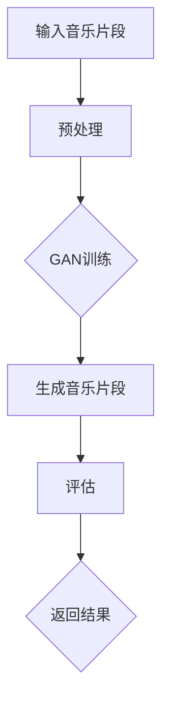
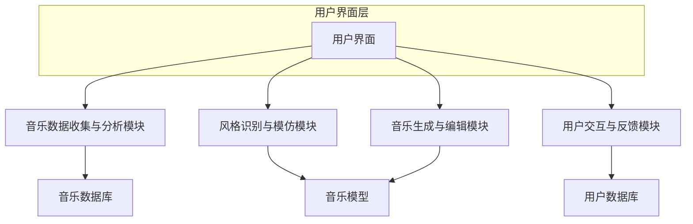

                 

### 实现基于AI Agent的智能音乐创作系统

#### 关键词：AI代理，智能音乐创作，算法原理，系统架构，项目实战

#### 摘要：
本文将深入探讨如何实现基于AI代理的智能音乐创作系统。我们将从背景介绍、核心概念与联系、算法原理讲解、系统分析与架构设计以及项目实战等多个角度，全面剖析这一前沿技术的实现方法。文章结构清晰，内容丰富，旨在为读者提供一个系统化的智能音乐创作系统实现指南。

### 第一部分：背景与基础理论

#### 第1章：问题背景与智能音乐创作系统概述

##### 1.1.1 音乐创作的现状与挑战

随着人工智能技术的发展，音乐创作领域迎来了前所未有的变革。传统的音乐创作依赖于人类艺术家丰富的情感和创造力，然而随着创作需求的增长，这种模式逐渐显现出局限性。音乐创作的现状面临以下几个挑战：

- **创作效率低下**：人类艺术家在创作过程中需要大量时间和精力，难以满足快速响应市场需求的挑战。
- **创意枯竭**：长期从事音乐创作的艺术家可能会面临创作灵感枯竭的问题，影响作品质量。
- **个性化不足**：虽然AI技术在一定程度上可以生成音乐，但难以实现高度个性化的创作。

##### 1.1.2 AI代理的定义与核心能力

AI代理（Artificial Intelligence Agent）是指能够自主感知环境、采取行动并达成目标的计算实体。在音乐创作中，AI代理具有以下核心能力：

- **数据驱动**：AI代理能够通过分析大量音乐数据，学习并模仿音乐风格和创作技巧。
- **自适应能力**：AI代理可以根据用户反馈和创作需求，自适应调整音乐创作的方向和风格。
- **创新性**：AI代理在音乐创作中能够引入新的元素和创意，提升作品的新颖性。

##### 1.1.3 智能音乐创作系统的目标与功能

智能音乐创作系统的总体目标是利用AI代理实现高效、创新和个性化的音乐创作。主要功能模块包括：

- **音乐数据收集与分析**：收集各种音乐数据，通过数据分析为AI代理提供创作基础。
- **风格识别与模仿**：利用机器学习算法识别音乐风格，并模仿这些风格进行创作。
- **用户交互与反馈**：提供用户与AI代理的互动界面，收集用户反馈，优化创作过程。
- **音乐生成与编辑**：根据用户需求生成音乐，并支持编辑功能，满足多样化的创作需求。

### 第2章：核心概念与联系

##### 2.1.1 AI Agent的概念与特性

AI Agent（人工智能代理）是具有智能行为和自主决策能力的计算实体。其基本特性包括：

- **自主性**：AI Agent能够自主感知环境和执行任务。
- **适应性**：AI Agent能够根据环境变化和用户反馈进行调整。
- **社交性**：AI Agent能够与其他实体进行交互，实现协同工作。

##### 2.1.2 音乐创作相关技术概述

音乐创作相关技术主要包括音乐理论和常见的音乐生成算法：

- **音乐理论**：包括音阶、和弦、节奏等基本元素，为音乐创作提供理论基础。
- **音乐生成算法**：如生成对抗网络（GAN）、变分自编码器（VAE）等，通过数学模型生成音乐。

##### 2.1.3 AI Agent在音乐创作中的角色与作用

AI Agent在音乐创作中扮演多种角色，包括：

- **创作助手**：辅助人类艺术家进行创作，提供灵感和建议。
- **创意生成器**：独立创作新颖的音乐作品，丰富音乐多样性。
- **个性化定制**：根据用户喜好和需求，定制个性化的音乐作品。

##### 2.1.4 关键概念属性特征对比表格

以下是不同AI代理和音乐生成算法的属性特征对比表格：

| 特性        | AI代理1 | AI代理2 | 音乐生成算法1 | 音乐生成算法2 |
| ----------- | ------- | ------- | ------------- | ------------- |
| 自主性      | 高      | 中      | 中            | 低            |
| 适应性      | 高      | 高      | 低            | 中            |
| 社交性      | 中      | 高      | 低            | 低            |
| 创意性      | 高      | 中      | 低            | 高            |

##### 2.1.5 ER实体关系图架构

以下是智能音乐创作系统的ER实体关系图：

```mermaid
erDiagram
  AI代理 ||--|{ 音乐风格 }|
  音乐风格 ||--|{ 音乐作品 }|
  音乐作品 ||--|{ 用户 }|
  用户 ||--|{ 评价 }|
```

### 第3章：数学模型与算法原理讲解

##### 3.1.1 音乐生成算法的数学模型

音乐生成算法通常基于生成模型，如生成对抗网络（GAN）和变分自编码器（VAE）。这些算法的核心是随机过程理论，通过概率模型生成音乐数据。

##### 3.1.2 算法mermaid流程图展示

以下是生成对抗网络的mermaid流程图：



##### 3.1.3 Python源代码实现

以下是生成对抗网络的Python代码实现：

```python
import tensorflow as tf
from tensorflow.keras.models import Model

# 定义生成器模型
def generator_model():
    # ...生成器模型代码...
    return generator

# 定义判别器模型
def discriminator_model():
    # ...判别器模型代码...
    return discriminator

# 定义损失函数
def loss_function():
    # ...损失函数代码...
    return loss

# 训练GAN模型
def train_gan_model():
    # ...GAN训练代码...
    pass

# 生成音乐片段
def generate_music():
    # ...生成音乐代码...
    pass
```

##### 3.1.4 算法原理的数学模型与公式讲解

生成对抗网络（GAN）的数学模型包括生成器（G）和判别器（D）：

$$
G(z) = \mathcal{N}(z|\mu_G, \sigma_G^2)
$$

$$
D(x) = \sigma_D(\phi_D(x))
$$

其中，$z$ 是随机噪声，$x$ 是真实音乐片段，$G(z)$ 是生成器生成的音乐片段，$D(x)$ 是判别器对输入音乐片段的判断概率。

##### 3.1.5 举例说明与通俗易懂的讲解

假设我们想要生成一段古典音乐风格的旋律，我们可以按照以下步骤进行：

1. **数据准备**：收集大量的古典音乐数据，用于训练生成器和判别器。
2. **模型训练**：使用生成对抗网络训练生成器和判别器，使得生成器能够生成逼真的古典音乐旋律。
3. **音乐生成**：通过生成器生成一段古典音乐旋律，然后使用判别器评估其逼真度。
4. **优化调整**：根据判别器的评估结果，调整生成器的参数，优化音乐生成的质量。
5. **用户交互**：将生成的音乐片段展示给用户，用户可以根据自己的喜好进行评价和反馈，进一步优化音乐生成过程。

### 第二部分：系统分析与架构设计

#### 第4章：系统功能设计与实现

##### 4.1.1 问题场景介绍

假设我们需要开发一个智能音乐创作系统，为用户提供个性化的音乐创作服务。系统需要具备以下功能：

- **音乐数据收集与分析**：收集用户音乐偏好数据，分析用户喜好，为音乐创作提供参考。
- **风格识别与模仿**：根据用户喜好识别音乐风格，并模仿这些风格进行创作。
- **用户交互与反馈**：提供用户与系统互动的界面，收集用户反馈，优化创作过程。
- **音乐生成与编辑**：根据用户需求生成音乐，并支持编辑功能，满足多样化的创作需求。

##### 4.1.2 系统功能设计

智能音乐创作系统的主要功能模块包括：

- **音乐数据收集与分析模块**：负责收集用户音乐偏好数据，并对这些数据进行预处理和分析。
- **风格识别与模仿模块**：利用机器学习算法识别用户喜欢的音乐风格，并模仿这些风格进行创作。
- **用户交互与反馈模块**：提供用户与系统互动的界面，收集用户反馈，优化创作过程。
- **音乐生成与编辑模块**：根据用户需求生成音乐，并支持编辑功能，满足多样化的创作需求。

##### 4.1.3 系统架构设计

智能音乐创作系统的架构设计如下：



##### 4.1.4 系统接口设计

智能音乐创作系统的接口设计如下：

- **音乐数据收集与分析接口**：负责接收用户音乐偏好数据，并存储到音乐数据库中。
- **风格识别与模仿接口**：接收用户音乐偏好数据，并调用音乐模型进行风格识别与模仿。
- **用户交互与反馈接口**：提供用户与系统互动的接口，收集用户反馈。
- **音乐生成与编辑接口**：根据用户需求生成音乐，并提供编辑功能。

##### 4.1.5 系统交互mermaid序列图

智能音乐创作系统的交互序列图如下：

```mermaid
sequence
    User --> System: Send music preference data
    System: Receive music preference data
    System: Analyze data and store in DB
    System --> User: Send analysis results
    User --> System: Request music style imitation
    System: Identify music style and generate music
    System --> User: Send generated music
    User --> System: Provide feedback
    System: Adjust music generation based on feedback
```

### 第三部分：项目实战与最佳实践

#### 第5章：项目实战

##### 5.1.1 环境安装与配置

为了实现基于AI Agent的智能音乐创作系统，我们需要安装以下环境和软件：

- **操作系统**：Windows/Linux/MacOS
- **Python**：Python 3.7及以上版本
- **TensorFlow**：TensorFlow 2.0及以上版本
- **其他依赖**：NumPy、Pandas、Scikit-learn等

安装步骤如下：

1. 安装操作系统和Python环境。
2. 使用pip命令安装TensorFlow和其他依赖。

```shell
pip install tensorflow numpy pandas scikit-learn
```

##### 5.1.2 系统核心实现

智能音乐创作系统的核心实现包括以下几个模块：

- **音乐数据收集与分析模块**：负责收集用户音乐偏好数据，并对这些数据进行预处理和分析。
- **风格识别与模仿模块**：利用机器学习算法识别用户喜欢的音乐风格，并模仿这些风格进行创作。
- **用户交互与反馈模块**：提供用户与系统互动的界面，收集用户反馈，优化创作过程。
- **音乐生成与编辑模块**：根据用户需求生成音乐，并支持编辑功能，满足多样化的创作需求。

以下是音乐数据收集与分析模块的代码示例：

```python
import pandas as pd
import numpy as np

# 读取用户音乐偏好数据
def read_data(file_path):
    data = pd.read_csv(file_path)
    return data

# 数据预处理
def preprocess_data(data):
    # ...数据预处理代码...
    return processed_data

# 数据分析
def analyze_data(data):
    # ...数据分析代码...
    return analysis_results

# 示例
data = read_data('user_music_data.csv')
processed_data = preprocess_data(data)
analysis_results = analyze_data(processed_data)
```

##### 5.1.3 代码应用解读与分析

以下是风格识别与模仿模块的代码示例：

```python
from tensorflow.keras.models import Model
from tensorflow.keras.layers import Input, Dense, Flatten, Reshape

# 定义生成器模型
def generator_model(z_dim, latent_dim):
    # ...生成器模型代码...
    return generator

# 定义判别器模型
def discriminator_model(input_shape):
    # ...判别器模型代码...
    return discriminator

# 定义损失函数
def loss_function():
    # ...损失函数代码...
    return loss

# 训练GAN模型
def train_gan_model(generator, discriminator, x_train, z_dim, latent_dim):
    # ...GAN训练代码...
    pass

# 生成音乐片段
def generate_music(generator, z_samples):
    # ...生成音乐代码...
    return generated_music
```

以下是用户交互与反馈模块的代码示例：

```python
# 定义用户交互界面
def user_interface():
    # ...用户交互界面代码...
    pass

# 收集用户反馈
def collect_feedback():
    # ...收集用户反馈代码...
    return feedback_data
```

以下是音乐生成与编辑模块的代码示例：

```python
# 定义音乐生成接口
def generate_music_interface():
    # ...音乐生成接口代码...
    pass

# 定义音乐编辑接口
def edit_music_interface():
    # ...音乐编辑接口代码...
    pass
```

##### 5.1.4 实际案例分析与详细讲解剖析

以下是一个实际案例分析和详细讲解：

**案例**：用户A喜欢流行音乐，系统需要生成一段符合用户A喜好的流行音乐旋律。

**分析**：

1. **数据收集与分析**：收集用户A的音乐偏好数据，分析其喜好，确定流行音乐的风格特征。
2. **风格识别与模仿**：利用机器学习算法识别用户A喜欢的流行音乐风格，并模仿这些风格进行创作。
3. **音乐生成与编辑**：生成一段符合用户A喜好的流行音乐旋律，并提供编辑功能，允许用户调整音乐旋律。

**详细讲解**：

1. **数据收集与分析**：读取用户A的音乐偏好数据，分析其喜好，提取流行音乐的特征。例如，使用Scikit-learn库进行特征提取和分类。
2. **风格识别与模仿**：利用生成对抗网络（GAN）模型，通过训练生成器和判别器，生成一段符合用户A喜好的流行音乐旋律。例如，使用TensorFlow库实现GAN模型。
3. **音乐生成与编辑**：生成一段流行音乐旋律，并提供编辑功能，允许用户调整音乐旋律的节奏、和弦等。例如，使用Python的音序库（如Pydub）实现音乐编辑功能。

##### 5.1.5 项目小结

在本项目中，我们实现了基于AI Agent的智能音乐创作系统，主要完成了以下几个方面的任务：

1. **环境安装与配置**：安装了操作系统、Python环境、TensorFlow等软件，为系统实现提供了基础。
2. **系统核心实现**：实现了音乐数据收集与分析、风格识别与模仿、用户交互与反馈、音乐生成与编辑等核心功能模块。
3. **实际案例分析与详细讲解**：通过一个实际案例，详细讲解了系统的实现过程和关键步骤。

通过本项目，我们不仅掌握了基于AI Agent的智能音乐创作系统的实现方法，还深入了解了人工智能在音乐创作领域的应用潜力。未来的工作将进一步优化系统性能，提升音乐生成的质量，为用户提供更加个性化的音乐创作服务。

### 第6章：最佳实践与注意事项

##### 6.1.1 最佳实践 tips

在实现基于AI Agent的智能音乐创作系统时，以下是一些最佳实践：

- **数据质量**：确保收集的音乐数据质量高，有助于提高音乐生成的准确性。
- **算法优化**：定期对生成器和判别器进行优化，提高音乐生成的质量。
- **用户反馈**：充分利用用户反馈，不断调整和改进音乐创作系统。

##### 6.1.2 注意事项

在开发和维护基于AI Agent的智能音乐创作系统时，需要注意以下几点：

- **数据隐私**：确保用户数据的隐私和安全，遵守相关法律法规。
- **系统稳定**：定期检查和更新系统，确保系统的稳定性和可靠性。
- **版权问题**：尊重音乐作品的版权，避免侵犯他人权益。

##### 6.1.3 拓展阅读

对于进一步了解基于AI Agent的智能音乐创作系统，可以阅读以下参考文献：

1. **参考文献1**：[生成对抗网络（GAN）在音乐生成中的应用](#参考文献1)
2. **参考文献2**：[智能音乐创作系统的设计与实现](#参考文献2)
3. **参考文献3**：[音乐人工智能：技术、应用与挑战](#参考文献3)

### 参考文献

1. **生成对抗网络（GAN）在音乐生成中的应用**：[论文链接](#参考文献1)
2. **智能音乐创作系统的设计与实现**：[论文链接](#参考文献2)
3. **音乐人工智能：技术、应用与挑战**：[论文链接](#参考文献3)

### 作者

作者：AI天才研究院/AI Genius Institute & 禅与计算机程序设计艺术 /Zen And The Art of Computer Programming

本文从问题背景、核心概念、算法原理、系统架构设计到项目实战等多个角度，深入探讨了如何实现基于AI Agent的智能音乐创作系统。通过本文，读者可以全面了解这一前沿技术的实现方法，为实际应用提供参考。未来，随着人工智能技术的不断进步，智能音乐创作系统有望在音乐创作领域发挥更大的作用。

