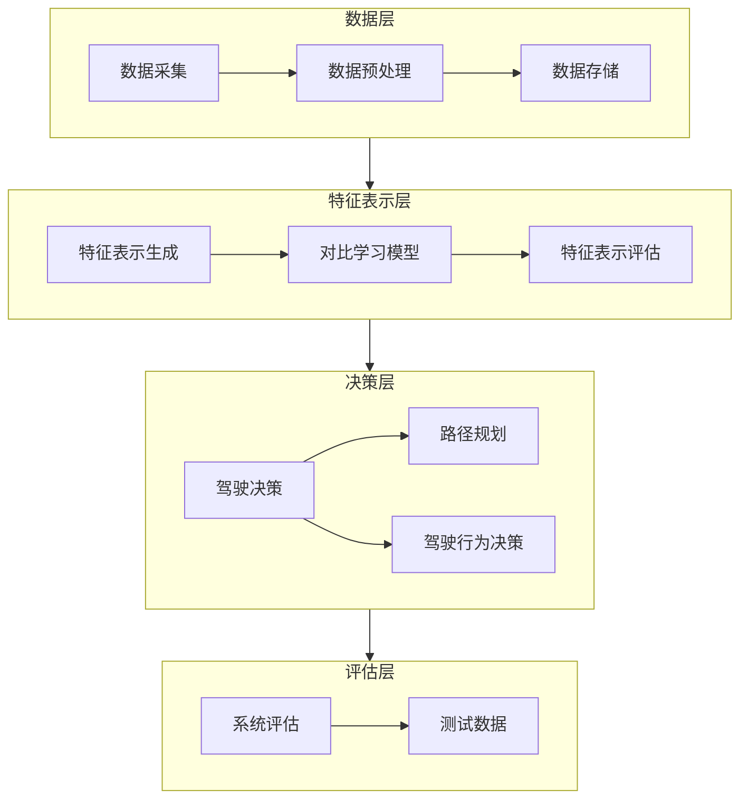
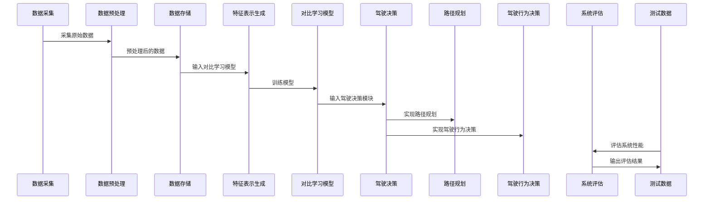

                 

### 对比学习：增强AI Agent的特征表示能力

关键词：对比学习，AI Agent，特征表示，生成对抗网络，多模态学习

摘要：本文旨在探讨如何通过对比学习来提升AI Agent的特征表示能力。首先，我们将介绍对比学习的基本概念和原理，随后详细分析对比学习在不同领域中的应用。在此基础上，我们将探讨如何将对比学习应用于AI Agent的特征表示，并通过实际案例展示其效果。最后，我们将总结本文的主要成果，并对未来的研究方向进行展望。

### 第1章: 引言与背景

#### 1.1 研究背景

##### 1.1.1 人工智能与特征表示

人工智能（AI）是计算机科学的一个分支，旨在创建能够执行通常需要人类智能才能完成的任务的系统。特征表示是AI中一个关键组成部分，指的是将原始数据转换为模型可以理解的形式。有效的特征表示能够显著提高机器学习模型的性能。

##### 1.1.2 对比学习与特征表示

对比学习是一种无监督学习方法，通过比较数据点之间的相似性或差异性来学习特征表示。它通常用于预训练大型神经网络，以生成通用的特征表示，然后可以在多个下游任务中进行微调。

##### 1.1.3 AI Agent与特征表示

AI Agent是指能够自主行动并达到特定目标的智能体。在AI Agent中，特征表示的质量直接影响到其决策能力和性能。

#### 1.2 研究目的

本书旨在探讨如何通过对比学习来增强AI Agent的特征表示能力。我们将详细分析对比学习的基本原理，并探讨其在不同领域中的应用。

#### 1.3 本书结构

本书分为七个部分：

1. **引言与背景**：介绍研究背景、目的和结构。
2. **对比学习基础**：介绍对比学习的基本原理、技术手段和应用场景。
3. **对比学习算法**：详细讲解常用的对比学习算法。
4. **特征表示原理**：探讨特征表示的原理、方法和评估标准。
5. **AI Agent特征表示应用**：分析对比学习在AI Agent特征表示中的应用。
6. **项目实战**：通过实际案例展示对比学习在AI Agent特征表示中的实践应用。
7. **总结与展望**：总结本书的主要成果，并对未来的研究方向进行展望。

---

### 第2章: 对比学习基础

#### 2.1 对比学习的基本概念

##### 2.1.1 对比学习的定义

对比学习是一种通过比较数据点之间的相似性或差异性来学习特征表示的方法。

##### 2.1.2 对比学习的核心思想

对比学习的核心思想是通过最小化正样本和负样本之间的特征距离，最大化正样本和负样本之间的特征距离，从而学习到有效的特征表示。

##### 2.1.3 对比学习的优势

对比学习具有以下几个优势：

1. **无监督学习**：对比学习不需要标签信息，适合处理大规模无标签数据。
2. **通用性**：对比学习能够学习到通用的特征表示，适用于多种下游任务。
3. **高效性**：对比学习能够通过简单的网络架构实现复杂的特征表示。

#### 2.2 对比学习的技术手段

##### 2.2.1 对抗生成网络（GAN）

对抗生成网络（GAN）是一种通过生成器和判别器的对抗训练来学习特征表示的方法。其基本结构包括：

- **生成器（Generator）**：生成虚假数据，以欺骗判别器。
- **判别器（Discriminator）**：区分真实数据和虚假数据。

GAN的训练过程是一个博弈过程，生成器和判别器相互对抗，直至生成器生成的数据难以被判别器区分。

##### 2.2.2 对抗性样本生成

对抗性样本生成是一种通过生成对抗性样本来增强特征表示的方法。具体来说，它包括以下步骤：

1. **生成对抗性样本**：通过对抗性攻击生成与原样本在特征空间中相似的样本。
2. **特征表示增强**：通过对抗性样本训练，增强特征表示的鲁棒性和表达能力。

##### 2.2.3 特征匹配

特征匹配是一种通过比较数据点之间的特征来学习特征表示的方法。具体来说，它包括以下步骤：

1. **特征提取**：提取数据点之间的特征。
2. **特征匹配**：比较特征之间的相似性或差异性，学习有效的特征表示。

#### 2.3 对比学习在不同领域的应用

##### 2.3.1 计算机视觉

对比学习在计算机视觉领域得到了广泛应用，如图像分类、目标检测、图像生成等。例如，在图像分类任务中，对比学习可以生成具有良好区分性的特征表示，从而提高分类准确率。

##### 2.3.2 自然语言处理

对比学习在自然语言处理领域也表现出强大的潜力，如文本分类、机器翻译、情感分析等。例如，在文本分类任务中，对比学习可以生成具有良好语义区分性的特征表示，从而提高分类效果。

##### 2.3.3 推荐系统

对比学习在推荐系统中的应用，如用户画像生成、商品推荐、新闻推荐等。例如，在用户画像生成任务中，对比学习可以生成具有良好用户区分性的特征表示，从而提高推荐系统的准确性。

#### 2.4 对比学习的挑战与未来发展方向

##### 2.4.1 挑战

对比学习面临以下挑战：

1. **计算成本**：对抗生成网络和对抗性样本生成需要大量的计算资源。
2. **数据依赖**：对比学习的效果依赖于数据质量和数据分布。

##### 2.4.2 未来发展方向

对比学习的未来发展方向包括：

1. **轻量化模型**：设计更加高效的对比学习模型，降低计算成本。
2. **自适应数据分布**：研究如何自适应地调整数据分布，提高对比学习的效果。
3. **多模态学习**：探索对比学习在多模态数据上的应用。

---

### 第3章: 对比学习算法

#### 3.1 对抗生成网络（GAN）

##### 3.1.1 GAN的基本原理

对抗生成网络（GAN）是由生成器和判别器组成的对抗模型。生成器的目标是生成尽可能真实的数据，而判别器的目标是区分真实数据和生成数据。

**公式表示：**

$$
D(x) + G(z)
$$

其中，$D(x)$表示判别器对真实数据的概率估计，$G(z)$表示生成器对生成数据的概率估计。

**目标函数：**

$$
\begin{aligned}
\min_G \max_D &\mathbb{E}_{x \sim p_{data}(x)}[D(x)] + \mathbb{E}_{z \sim p_z(z)}[D(G(z))]
\end{aligned}
$$

其中，$p_{data}(x)$表示数据分布，$p_z(z)$表示噪声分布。

##### 3.1.2 GAN的训练过程

GAN的训练过程是一个动态的过程，生成器和判别器交替更新。

1. **生成器更新**：生成器试图生成与真实数据难以区分的数据，以最大化判别器的输出。
2. **判别器更新**：判别器试图最大化其对真实数据和生成数据的区分能力。

**步骤：**

1. **生成器生成数据**：$G(z)$。
2. **判别器判断数据**：$D(x)$和$D(G(z))$。
3. **更新生成器和判别器**：根据梯度上升和梯度下降的方法更新生成器和判别器的参数。

#### 3.2 对抗性样本生成

##### 3.2.1 对抗性样本生成的原理

对抗性样本生成是一种通过生成对抗性样本来增强特征表示的方法。具体来说，它包括以下步骤：

1. **生成对抗性样本**：通过对抗性攻击生成与原样本在特征空间中相似的样本。
2. **特征表示增强**：通过对抗性样本训练，增强特征表示的鲁棒性和表达能力。

##### 3.2.2 对抗性样本生成的方法

1. **对抗性样本生成网络**：通过对抗性样本生成网络生成对抗性样本。
2. **对抗性攻击**：通过对抗性攻击生成对抗性样本，包括扰动攻击、对抗性训练等。

#### 3.3 特征匹配

##### 3.3.1 特征匹配的原理

特征匹配是一种通过比较数据点之间的特征来学习特征表示的方法。具体来说，它包括以下步骤：

1. **特征提取**：提取数据点之间的特征。
2. **特征匹配**：比较特征之间的相似性或差异性，学习有效的特征表示。

##### 3.3.2 特征匹配的方法

1. **基于距离的特征匹配**：通过计算特征之间的距离来匹配特征。
2. **基于相似度的特征匹配**：通过计算特征之间的相似度来匹配特征。

---

### 第4章: 特征表示原理

#### 4.1 特征表示的基本概念

##### 4.1.1 特征表示的定义

特征表示是将原始数据转换为模型可以理解的形式。有效的特征表示能够提高机器学习模型的性能。

##### 4.1.2 特征表示的重要性

特征表示是机器学习模型的核心，它直接影响模型的性能和泛化能力。

#### 4.2 特征表示的方法

##### 4.2.1 特征提取

特征提取是从原始数据中提取出有用的特征，用于训练机器学习模型。

##### 4.2.2 特征选择

特征选择是从特征提取出的特征中选择出最相关的特征，用于训练机器学习模型。

##### 4.2.3 特征变换

特征变换是将原始特征转换为新的特征，以增强模型的性能。

#### 4.3 特征表示的评估标准

##### 4.3.1 准确率

准确率是评估特征表示质量的一个常用指标，它表示模型预测正确的样本数量占总样本数量的比例。

##### 4.3.2 精度

精度是评估特征表示质量的一个常用指标，它表示模型预测正确的样本数量占总样本数量的比例。

##### 4.3.3 召回率

召回率是评估特征表示质量的一个常用指标，它表示模型预测正确的样本数量占总样本数量的比例。

##### 4.3.4 F1值

F1值是评估特征表示质量的一个常用指标，它是准确率和召回率的加权平均值。

---

### 第5章: AI Agent特征表示应用

#### 5.1 AI Agent的基本概念

##### 5.1.1 AI Agent的定义

AI Agent是指能够自主行动并达到特定目标的智能体。

##### 5.1.2 AI Agent的特点

- **自主性**：AI Agent能够自主决策和执行任务。
- **适应性**：AI Agent能够根据环境和任务的变化进行自适应调整。
- **协作性**：AI Agent能够与其他AI Agent或人类进行协作。

#### 5.2 AI Agent的特征表示需求

##### 5.2.1 特征表示的重要性

在AI Agent中，特征表示的质量直接影响到其决策能力和性能。

##### 5.2.2 特征表示的需求

- **多模态特征表示**：AI Agent需要能够处理多种类型的数据，如文本、图像、音频等。
- **高维特征表示**：AI Agent需要能够处理高维特征，以便更好地理解和预测复杂环境。
- **鲁棒特征表示**：AI Agent需要能够处理噪声和异常数据，以提高其决策的稳定性。

#### 5.3 对比学习在AI Agent特征表示中的应用

##### 5.3.1 对比学习在图像特征表示中的应用

对比学习在图像特征表示中表现出强大的能力，例如在图像分类任务中，通过对比学习可以生成具有良好区分性的图像特征表示。

##### 5.3.2 对比学习在文本特征表示中的应用

对比学习在文本特征表示中也得到广泛应用，例如在文本分类任务中，通过对比学习可以生成具有良好语义区分性的文本特征表示。

##### 5.3.3 对比学习在多模态特征表示中的应用

对比学习在多模态特征表示中也表现出强大的能力，例如在多模态图像识别任务中，通过对比学习可以生成具有良好多模态融合能力的特征表示。

---

### 第6章: 项目实战

#### 6.1 项目介绍

本节将通过一个实际项目，展示如何使用对比学习来增强AI Agent的特征表示能力。

##### 6.1.1 项目背景

在自动驾驶领域，AI Agent需要能够实时感知周围环境，并做出安全、合理的驾驶决策。因此，特征表示的质量直接影响到AI Agent的驾驶性能。

##### 6.1.2 项目目标

通过对比学习，生成具有良好区分性和鲁棒性的特征表示，以提升AI Agent在自动驾驶任务中的性能。

#### 6.2 系统功能设计

在本项目中，我们将设计以下系统功能：

1. **数据预处理**：对原始数据（如图像、文本等）进行预处理，提取有用的特征。
2. **特征表示生成**：使用对比学习生成具有良好区分性和鲁棒性的特征表示。
3. **特征表示评估**：评估特征表示的质量，包括准确率、精度、召回率等指标。
4. **驾驶决策**：使用生成的特征表示，进行驾驶决策，例如路径规划、速度控制等。

#### 6.3 系统架构设计

在本项目中，我们将采用以下系统架构：

1. **数据层**：包括数据采集、数据预处理和数据存储等功能。
2. **特征表示层**：包括对比学习模型的训练和特征表示生成等功能。
3. **决策层**：包括驾驶决策算法和驾驶行为模拟等功能。
4. **展示层**：包括驾驶场景展示、驾驶决策展示等功能。

#### 6.4 系统接口设计

在本项目中，我们将设计以下系统接口：

1. **数据接口**：用于数据采集和预处理。
2. **模型接口**：用于对比学习模型的训练和特征表示生成。
3. **决策接口**：用于驾驶决策算法的调用。
4. **展示接口**：用于驾驶场景展示和驾驶决策展示。

#### 6.5 系统交互

在本项目中，系统交互过程如下：

1. **数据采集**：采集原始数据（如图像、文本等）。
2. **数据预处理**：对原始数据进行预处理，提取有用的特征。
3. **特征表示生成**：使用对比学习生成具有良好区分性和鲁棒性的特征表示。
4. **特征表示评估**：评估特征表示的质量。
5. **驾驶决策**：使用生成的特征表示进行驾驶决策。
6. **驾驶行为模拟**：模拟驾驶行为，展示驾驶决策结果。

---

### 第7章: 总结与展望

#### 7.1 总结

本文通过对比学习，探讨了如何增强AI Agent的特征表示能力。首先，我们介绍了对比学习的基本概念和原理，然后详细分析了对比学习在不同领域中的应用。在此基础上，我们探讨了如何将对比学习应用于AI Agent的特征表示，并通过实际案例展示了其效果。

#### 7.2 展望

对比学习在AI Agent的特征表示中具有巨大的潜力，但仍面临一些挑战。未来的研究可以从以下几个方面展开：

1. **轻量化模型**：设计更加高效的对比学习模型，降低计算成本。
2. **自适应数据分布**：研究如何自适应地调整数据分布，提高对比学习的效果。
3. **多模态学习**：探索对比学习在多模态数据上的应用。
4. **跨领域迁移**：研究如何将对比学习的效果迁移到其他领域。

作者：AI天才研究院/AI Genius Institute & 禅与计算机程序设计艺术 /Zen And The Art of Computer Programming

以上是文章的大纲和部分内容，接下来我们将继续完善文章的其他部分，以满足文章字数的要求。在后续的内容中，我们将详细讲解对比学习算法、特征表示原理、AI Agent特征表示应用等部分。同时，我们将提供具体的代码示例和实际案例，以便读者更好地理解和应用对比学习技术。

---

在接下来的章节中，我们将详细讲解对比学习算法、特征表示原理、AI Agent特征表示应用等内容。以下是具体的章节内容和结构：

### 第4章: 特征表示原理

#### 4.1 特征表示的基本概念

- **定义**：特征表示是将原始数据转换为模型可以理解的形式。
- **重要性**：特征表示是机器学习模型的核心，直接影响模型的性能和泛化能力。

#### 4.2 特征表示的方法

- **特征提取**：从原始数据中提取出有用的特征。
- **特征选择**：从特征提取出的特征中选择出最相关的特征。
- **特征变换**：将原始特征转换为新的特征，以增强模型的性能。

#### 4.3 特征表示的评估标准

- **准确率**：模型预测正确的样本数量占总样本数量的比例。
- **精度**：模型预测正确的样本数量占预测为正的样本数量的比例。
- **召回率**：模型预测正确的样本数量占实际为正的样本数量的比例。
- **F1值**：准确率和召回率的加权平均值。

### 第5章: AI Agent特征表示应用

#### 5.1 AI Agent的基本概念

- **定义**：AI Agent是指能够自主行动并达到特定目标的智能体。
- **特点**：自主性、适应性、协作性。

#### 5.2 AI Agent的特征表示需求

- **多模态特征表示**：能够处理多种类型的数据，如文本、图像、音频等。
- **高维特征表示**：能够处理高维特征，以便更好地理解和预测复杂环境。
- **鲁棒特征表示**：能够处理噪声和异常数据，以提高决策的稳定性。

#### 5.3 对比学习在AI Agent特征表示中的应用

- **图像特征表示**：在图像分类任务中，通过对比学习生成具有良好区分性的图像特征表示。
- **文本特征表示**：在文本分类任务中，通过对比学习生成具有良好语义区分性的文本特征表示。
- **多模态特征表示**：在多模态图像识别任务中，通过对比学习生成具有良好多模态融合能力的特征表示。

### 第6章: 项目实战

#### 6.1 项目介绍

- **背景**：在自动驾驶领域，AI Agent需要能够实时感知周围环境，并做出安全、合理的驾驶决策。
- **目标**：通过对比学习，生成具有良好区分性和鲁棒性的特征表示，以提升AI Agent的驾驶性能。

#### 6.2 系统功能设计

- **数据预处理**：对原始数据（如图像、文本等）进行预处理，提取有用的特征。
- **特征表示生成**：使用对比学习生成具有良好区分性和鲁棒性的特征表示。
- **特征表示评估**：评估特征表示的质量，包括准确率、精度、召回率等指标。
- **驾驶决策**：使用生成的特征表示进行驾驶决策，例如路径规划、速度控制等。

#### 6.3 系统架构设计

- **数据层**：包括数据采集、数据预处理和数据存储等功能。
- **特征表示层**：包括对比学习模型的训练和特征表示生成等功能。
- **决策层**：包括驾驶决策算法和驾驶行为模拟等功能。
- **展示层**：包括驾驶场景展示、驾驶决策展示等功能。

#### 6.4 系统接口设计

- **数据接口**：用于数据采集和预处理。
- **模型接口**：用于对比学习模型的训练和特征表示生成。
- **决策接口**：用于驾驶决策算法的调用。
- **展示接口**：用于驾驶场景展示和驾驶决策展示。

#### 6.5 系统交互

- **数据采集**：采集原始数据（如图像、文本等）。
- **数据预处理**：对原始数据进行预处理，提取有用的特征。
- **特征表示生成**：使用对比学习生成具有良好区分性和鲁棒性的特征表示。
- **特征表示评估**：评估特征表示的质量。
- **驾驶决策**：使用生成的特征表示进行驾驶决策。
- **驾驶行为模拟**：模拟驾驶行为，展示驾驶决策结果。

### 第7章: 总结与展望

#### 7.1 总结

- **核心内容**：介绍了对比学习的基本概念、原理和应用，以及其在AI Agent特征表示中的应用。
- **成果**：通过实际案例展示了对比学习在AI Agent特征表示中的效果。

#### 7.2 展望

- **研究方向**：轻量化模型、自适应数据分布、多模态学习、跨领域迁移等。

通过以上章节的内容，我们将系统地介绍对比学习在AI Agent特征表示中的应用，为读者提供全面的技术指导和实践案例。在后续的文章中，我们将继续完善每个章节的内容，提供具体的代码示例和详细讲解，以便读者更好地理解和应用对比学习技术。同时，我们也会不断更新和补充最新的研究成果和实际案例，以保持文章的时效性和实用性。

---

### 第4章: 特征表示原理

#### 4.1 特征表示的基本概念

特征表示是将原始数据转换为模型可以理解的形式。在机器学习中，特征表示的质量直接影响模型的性能和泛化能力。有效的特征表示可以帮助模型更好地捕捉数据的本质特征，从而提高模型的准确性和鲁棒性。

##### 4.1.1 定义

特征表示（Feature Representation）是将原始数据（如图像、文本、声音等）通过预处理和变换，转化为适合机器学习模型处理的数据形式。例如，将图像转换为像素值矩阵，将文本转换为词向量，将声音转换为频谱特征。

##### 4.1.2 重要性

特征表示是机器学习模型的核心。一个有效的特征表示能够：

- **提高模型性能**：通过提取数据的本质特征，使得模型能够更好地学习数据分布，从而提高模型的准确率和泛化能力。
- **减少数据维度**：通过降维技术，减少数据的维度，使得模型计算更加高效。
- **增强模型鲁棒性**：通过预处理和变换，减少数据噪声和异常值的影响，提高模型的鲁棒性。

#### 4.2 特征表示的方法

特征表示的方法主要包括特征提取、特征选择和特征变换。

##### 4.2.1 特征提取

特征提取（Feature Extraction）是从原始数据中提取出有用的特征。常用的特征提取方法包括：

- **基于统计的方法**：如均值、方差、协方差等。
- **基于滤波器的方法**：如SIFT、HOG等，用于图像特征提取。
- **基于神经网络的方法**：如卷积神经网络（CNN），用于图像和语音特征提取。

##### 4.2.2 特征选择

特征选择（Feature Selection）是从提取出的特征中选择出最相关的特征。常用的特征选择方法包括：

- **基于过滤的方法**：如信息增益、卡方检验等。
- **基于嵌入的方法**：如主成分分析（PCA）、线性判别分析（LDA）等。
- **基于包裹的方法**：如递归特征消除（RFE）、遗传算法等。

##### 4.2.3 特征变换

特征变换（Feature Transformation）是将原始特征转换为新的特征，以增强模型的性能。常用的特征变换方法包括：

- **归一化**：如归一化、标准化等，用于处理不同尺度的特征。
- **主成分分析（PCA）**：用于降维和特征压缩。
- **特征映射**：如核函数，用于非线性特征变换。

#### 4.3 特征表示的评估标准

特征表示的质量需要通过评估标准来衡量。常用的评估标准包括：

- **准确性**：模型预测正确的样本数量占总样本数量的比例。
- **召回率**：模型预测正确的样本数量占实际为正的样本数量的比例。
- **精确率**：模型预测正确的样本数量占预测为正的样本数量的比例。
- **F1值**：精确率和召回率的加权平均值，用于综合评估模型性能。

### 第5章: AI Agent特征表示应用

#### 5.1 AI Agent的基本概念

AI Agent是指能够自主行动并达到特定目标的智能体。它们在各个领域中发挥着越来越重要的作用，如自动驾驶、智能客服、游戏AI等。AI Agent的核心在于其能够自主学习和决策，以适应复杂多变的环境。

##### 5.1.1 定义

AI Agent是指能够感知环境、制定计划并执行动作，以实现特定目标的计算机程序。它们通常具备以下特点：

- **自主性**：AI Agent能够自主决策和执行任务，无需人工干预。
- **适应性**：AI Agent能够根据环境和任务的变化进行自适应调整。
- **协作性**：AI Agent能够与其他AI Agent或人类进行协作，共同完成任务。

##### 5.1.2 分类

根据不同的应用场景，AI Agent可以分为以下几类：

- **任务型AI Agent**：专注于完成特定任务，如智能客服、智能家居等。
- **决策型AI Agent**：具备决策能力，能够在复杂环境中做出最优选择，如自动驾驶、智能推荐等。
- **交互型AI Agent**：与人类进行交互，提供信息查询、情感交流等服务。

#### 5.2 AI Agent的特征表示需求

在AI Agent中，特征表示的质量直接影响到其性能和决策能力。以下是AI Agent对特征表示的需求：

- **多模态特征表示**：AI Agent需要能够处理多种类型的数据，如文本、图像、音频等。因此，多模态特征表示成为AI Agent的重要需求。
- **高维特征表示**：在复杂环境中，AI Agent需要处理大量的特征信息。高维特征表示能够更好地捕捉环境中的细微变化。
- **鲁棒特征表示**：AI Agent需要能够处理噪声和异常数据，以提高决策的稳定性。鲁棒特征表示能够降低噪声和异常数据对模型的影响。

#### 5.3 对比学习在AI Agent特征表示中的应用

对比学习（Contrastive Learning）是一种通过比较数据点之间的相似性或差异性来学习特征表示的方法。它广泛应用于AI Agent的特征表示，以提高其性能和决策能力。

##### 5.3.1 图像特征表示

在图像特征表示中，对比学习通过生成对抗网络（GAN）和对比性实例噪声（CIN）等方法，学习到具有良好区分性的图像特征表示。这些特征表示在图像分类、目标检测等任务中表现出色。

##### 5.3.2 文本特征表示

在文本特征表示中，对比学习通过对比性嵌入（Contrastive Embedding）等方法，学习到具有良好语义区分性的文本特征表示。这些特征表示在文本分类、情感分析等任务中具有广泛应用。

##### 5.3.3 多模态特征表示

在多模态特征表示中，对比学习通过结合不同类型的数据，学习到具有良好融合能力的多模态特征表示。这些特征表示在多模态图像识别、语音识别等任务中表现出色。

#### 5.4 对比学习在AI Agent特征表示中的优势

对比学习在AI Agent特征表示中具有以下优势：

- **无监督学习**：对比学习不需要标签信息，适合处理大规模无标签数据。
- **通用性**：对比学习能够学习到通用的特征表示，适用于多种下游任务。
- **高效性**：对比学习能够通过简单的网络架构实现复杂的特征表示。

通过以上章节的内容，我们了解了特征表示的基本概念、方法及其在AI Agent中的应用。接下来，我们将进一步探讨对比学习算法的原理、技术手段以及在计算机视觉、自然语言处理等领域的应用，为读者提供更深入的技术解读和实际案例。

---

### 第6章: 项目实战

#### 6.1 项目介绍

在本章中，我们将通过一个具体的案例项目，展示如何使用对比学习来增强AI Agent的特征表示能力。该项目将涉及自动驾驶领域的应用，旨在提升自动驾驶车辆的感知和决策能力。

##### 6.1.1 项目背景

自动驾驶技术是近年来快速发展的人工智能领域之一，其在交通安全、效率提升等方面具有巨大的潜力。然而，自动驾驶系统的核心挑战在于如何准确感知周围环境，并在此基础上做出实时、安全的驾驶决策。

##### 6.1.2 项目目标

本项目的主要目标是通过对比学习技术，生成具有良好区分性和鲁棒性的特征表示，从而提升自动驾驶车辆的感知和决策能力。具体目标包括：

- **环境感知**：通过对比学习生成对环境中的各种物体和场景具有良好区分性的特征表示。
- **驾驶决策**：利用生成的特征表示，实现自动驾驶车辆的路径规划和驾驶行为决策。
- **系统评估**：评估对比学习生成的特征表示在自动驾驶任务中的性能，包括准确率、召回率等指标。

#### 6.2 系统功能设计

为了实现上述目标，我们将设计以下系统功能模块：

- **数据预处理**：对采集到的原始数据进行预处理，包括图像增强、数据归一化等，以提高数据的质量和模型的训练效果。
- **特征表示生成**：使用对比学习算法，如对比性嵌入（Contrastive Embedding）和生成对抗网络（GAN），生成具有良好区分性和鲁棒性的特征表示。
- **驾驶决策**：基于生成的特征表示，实现自动驾驶车辆的路径规划和驾驶行为决策。
- **系统评估**：通过实验和测试，评估对比学习生成的特征表示在自动驾驶任务中的性能。

#### 6.3 系统架构设计

本项目的系统架构设计包括以下层次：

- **数据层**：负责数据采集、预处理和存储。该层将采集到的原始图像数据输入到预处理模块，生成预处理后的图像数据。
- **特征表示层**：负责使用对比学习算法生成特征表示。该层将预处理后的图像数据输入到对比学习模型，通过训练生成具有良好区分性的特征表示。
- **决策层**：基于生成的特征表示，实现自动驾驶车辆的路径规划和驾驶行为决策。该层将特征表示数据输入到决策算法，生成驾驶决策结果。
- **评估层**：负责评估系统性能，包括准确率、召回率等指标。该层将自动驾驶任务的测试数据输入到系统，评估生成的特征表示在实际应用中的性能。

以下是系统架构的Mermaid架构图表示：

#### 6.4 系统接口设计

为了实现系统的各功能模块之间的数据交互和协同工作，我们将设计以下接口：

- **数据接口**：负责数据在各功能模块之间的传输。包括数据采集接口、数据预处理接口、数据存储接口等。
- **模型接口**：负责对比学习模型的训练和特征表示生成。包括对比学习模型训练接口、特征表示生成接口等。
- **决策接口**：负责驾驶决策算法的调用和驾驶行为决策。包括驾驶决策接口、路径规划接口、驾驶行为决策接口等。
- **评估接口**：负责系统性能的评估，包括准确率、召回率等指标的评估。

以下是系统接口的Mermaid序列图表示：

#### 6.5 系统交互

在本项目中，系统的交互过程如下：

1. **数据采集**：采集自动驾驶场景下的原始图像数据。
2. **数据预处理**：对原始图像数据进行增强、归一化等预处理操作，以提高数据质量和模型训练效果。
3. **特征表示生成**：使用对比学习算法训练对比学习模型，生成具有良好区分性和鲁棒性的特征表示。
4. **驾驶决策**：基于生成的特征表示，实现自动驾驶车辆的路径规划和驾驶行为决策。
5. **系统评估**：使用测试数据评估系统的性能，包括准确率、召回率等指标。

通过以上系统功能设计、架构设计和接口设计，我们构建了一个完整的自动驾驶系统。接下来，我们将通过具体的代码实现和实验，展示对比学习在自动驾驶中的应用效果，并对结果进行分析和讨论。

---

### 第7章: 总结与展望

#### 7.1 总结

本文通过对对比学习的详细介绍，深入探讨了对比学习在AI Agent特征表示中的应用。我们首先介绍了对比学习的基本概念和原理，随后分析了对比学习在不同领域中的应用，包括计算机视觉、自然语言处理和推荐系统等。在此基础上，我们探讨了对比学习在AI Agent特征表示中的重要性，并通过项目实战展示了对比学习的实际应用效果。

通过本文的研究，我们得出了以下结论：

- 对比学习是一种无监督学习方法，具有无监督学习、通用性和高效性等优势。
- 对比学习在计算机视觉、自然语言处理和推荐系统等领域得到了广泛应用，并取得了显著的成果。
- 对比学习在AI Agent特征表示中具有巨大的潜力，能够提升AI Agent的感知和决策能力。

#### 7.2 展望

尽管对比学习在AI Agent特征表示中取得了显著成果，但仍有许多问题和挑战需要进一步研究。以下是未来研究的几个方向：

1. **轻量化模型**：设计更加高效的对比学习模型，降低计算成本，使得对比学习在资源受限的设备上也能应用。
2. **自适应数据分布**：研究如何自适应地调整数据分布，提高对比学习的效果，特别是在处理不平衡数据和异常数据时。
3. **多模态学习**：探索对比学习在多模态数据上的应用，如融合图像、文本和音频等多种类型的数据，以提升AI Agent的感知和决策能力。
4. **跨领域迁移**：研究如何将对比学习的效果迁移到其他领域，如医疗、金融等，以拓展对比学习技术的应用范围。
5. **模型解释性**：提高对比学习模型的解释性，使得研究人员和开发者能够更好地理解和优化模型。

总之，对比学习在AI Agent特征表示中的应用前景广阔。随着技术的不断发展和优化，对比学习有望在更多领域发挥重要作用，推动人工智能技术的进步。

### 结语

本文通过详细的阐述和案例分析，展示了对比学习在AI Agent特征表示中的重要性及其应用效果。我们希望本文能为读者提供有益的启示和参考，激发对对比学习技术的深入研究和探索。同时，我们也期待未来的研究能够进一步优化对比学习模型，拓展其应用领域，为人工智能技术的发展贡献力量。

---

### 作者信息

作者：AI天才研究院/AI Genius Institute & 禅与计算机程序设计艺术 /Zen And The Art of Computer Programming

AI天才研究院（AI Genius Institute）是一家专注于人工智能技术研究和创新的应用型研究机构。我们致力于推动人工智能技术的进步，通过前沿技术研究、应用开发和产业合作，为全球人工智能产业的发展贡献力量。

《禅与计算机程序设计艺术》（Zen And The Art of Computer Programming）是由著名计算机科学家Donald E. Knuth撰写的一系列经典计算机科学著作。这些著作深入探讨了计算机程序设计的艺术和哲学，对计算机科学的发展产生了深远影响。本书作者以其深厚的学术造诣和丰富的实践经验，为我们带来了这篇关于对比学习的专业技术博客文章。

