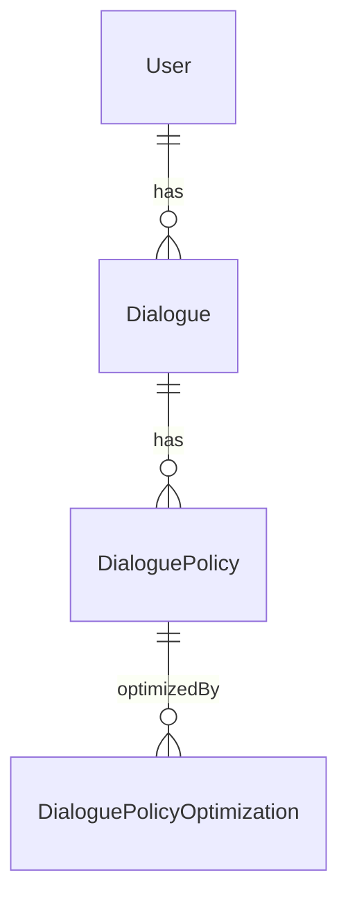
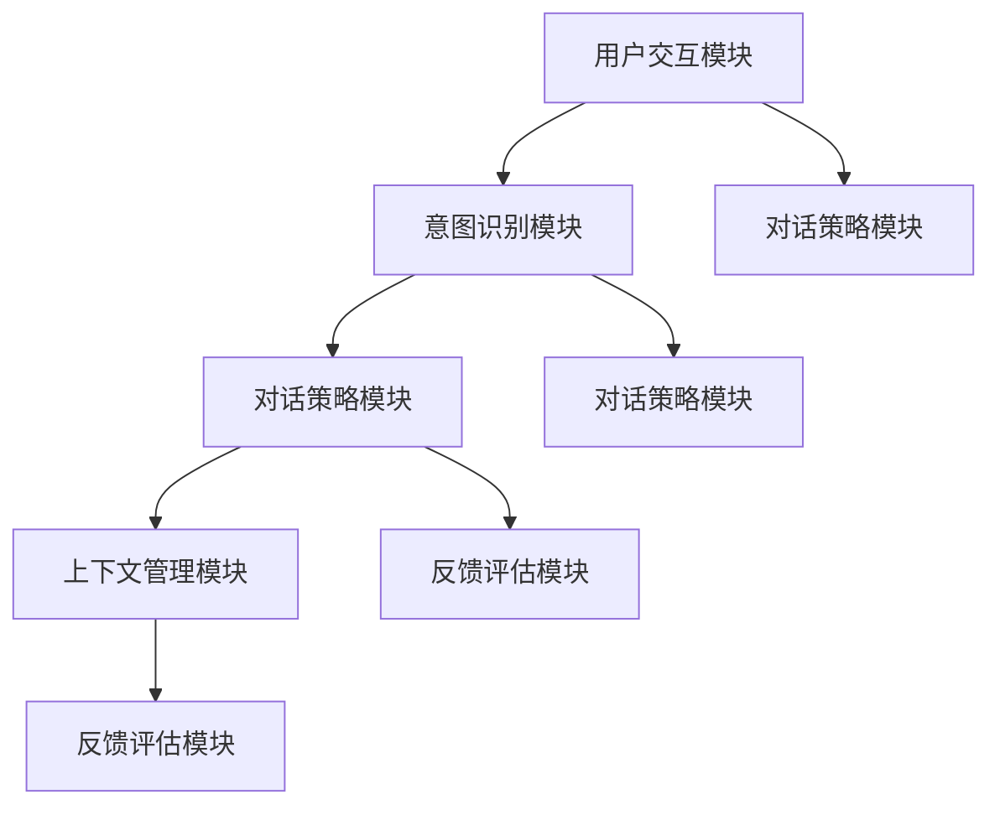
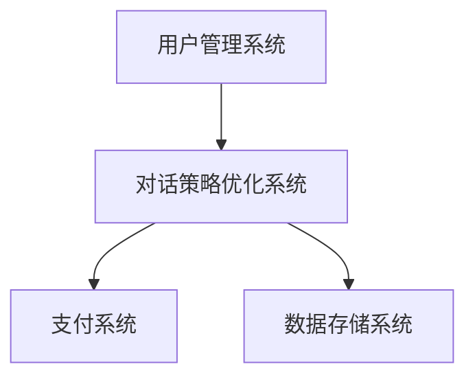
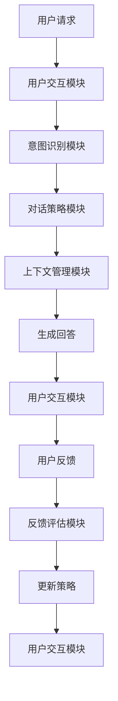
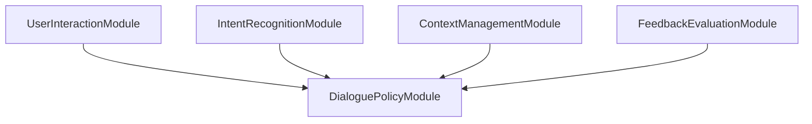

                 

### 文章标题：对话策略优化：提升AI Agent的交互质量

关键词：对话策略优化、AI Agent、交互质量、机器学习、优化算法

摘要：本文旨在探讨对话策略优化在提升AI Agent交互质量方面的应用。首先，我们将介绍对话策略优化背景及其重要性，随后解析相关核心概念与原则。通过数学模型与算法的详细讲解，我们将展示如何通过优化算法提升AI Agent的交互质量。接下来，我们将深入探讨系统设计架构，通过实际项目案例，分析和讲解对话策略优化在具体场景中的应用，总结最佳实践，并提出未来的研究方向。

### 引言：对话策略优化的重要性

随着人工智能（AI）技术的迅猛发展，智能对话系统已经渗透到我们生活的方方面面。从客服机器人到智能助手，AI Agent在日常交互中扮演着越来越重要的角色。然而，尽管AI Agent在处理大量重复性任务方面表现出色，但其交互质量仍有待提高。这不仅关系到用户体验，也对AI Agent的商业价值产生重大影响。

对话策略优化（Dialogue Policy Optimization）作为一种关键技术，旨在提升AI Agent的交互质量。它通过不断调整和优化对话策略，使AI Agent能够更智能、更自然地与人类用户进行交流。具体来说，对话策略优化涉及以下几方面：

1. **适应性**：根据用户的反馈和历史对话记录，AI Agent能够实时调整其对话策略，以更好地满足用户需求。
2. **个性化和定制化**：对话策略优化可以帮助AI Agent识别和满足用户的个性化需求，提供更加个性化的服务。
3. **减少误解和错误**：通过优化对话策略，AI Agent能够更准确地理解用户意图，减少误解和错误的概率。
4. **提高响应速度**：优化后的对话策略能够提高AI Agent的响应速度，提升整体交互效率。

总之，对话策略优化不仅提升了AI Agent的交互质量，也为AI技术的发展和应用提供了新的可能性和方向。因此，深入研究对话策略优化具有重要的理论和实际意义。

### 核心概念与原理

对话策略优化（Dialogue Policy Optimization）是人工智能领域的一个重要研究方向，它旨在提升AI Agent的交互质量。为了深入理解这一概念，我们需要从基本定义、核心要素和关键方法等多个方面进行详细解析。

#### 1. 定义

对话策略优化可以定义为：通过学习用户历史交互数据，调整AI Agent的对话策略，使其在与用户的交互中表现得更加智能、自然和高效的过程。简单来说，就是通过优化对话策略，让AI Agent能够更准确地理解用户意图，提供更加个性化的服务和回答。

#### 2. 核心概念

在对话策略优化中，以下几个核心概念至关重要：

- **对话策略（Dialogue Policy）**：对话策略是指导AI Agent如何进行对话的规则或参数集合。它决定了AI Agent在特定情境下的响应方式。

- **用户意图（User Intent）**：用户意图是用户在对话中想要实现的目标或需求。准确识别用户意图是提升交互质量的关键。

- **上下文信息（Contextual Information）**：上下文信息包括用户的历史行为、偏好和当前对话中的相关信息。这些信息对于理解用户意图和生成合适的回答至关重要。

- **反馈机制（Feedback Mechanism）**：反馈机制用于评估AI Agent对话策略的效果，并根据用户的反馈进行策略调整。

#### 3. 关键方法

对话策略优化涉及多种方法和算法，以下是其中几种常见的方法：

- **基于规则的策略优化**：这种方法通过定义一系列规则来指导AI Agent的对话行为。虽然简单直观，但难以应对复杂和动态的对话场景。

- **基于机器学习的策略优化**：通过训练机器学习模型，从用户历史交互数据中学习对话策略。这种方法具有较强的适应性和灵活性，但需要大量训练数据和计算资源。

- **强化学习（Reinforcement Learning）**：强化学习是一种通过试错和反馈进行学习的方法。在对话策略优化中，AI Agent通过与用户的交互不断调整其策略，以最大化用户满意度。

- **生成对抗网络（Generative Adversarial Networks, GAN）**：GAN是一种基于博弈的机器学习方法，可用于生成高质量的对话策略。

#### 4. 对比表格

为了更直观地理解不同对话策略优化方法的特点，我们制作了以下对比表格：

| 方法       | 特点                                         | 适用场景                                       |
|------------|--------------------------------------------|----------------------------------------------|
| 基于规则   | 简单直观，易于实现                           | 对话场景相对简单，规则明确的情况               |
| 机器学习   | 强大的适应性和灵活性，依赖大量数据           | 复杂多样的对话场景，对数据有较高要求           |
| 强化学习   | 通过试错和反馈进行学习，适用于动态环境       | 需要实时调整策略的复杂对话场景               |
| GAN        | 生成高质量对话策略，基于博弈的思想           | 对话质量要求高，需要生成多样化回答的场景       |

#### 5. ER实体关系图

为了进一步理解对话策略优化中的实体及其关系，我们使用Mermaid工具绘制了ER实体关系图，如下所示：



在这幅ER图中，用户（User）与对话（Dialogue）之间有直接关联，每个对话包含一个对话策略（DialoguePolicy）。此外，对话策略通过对话策略优化（DialoguePolicyOptimization）实体进行优化，形成了复杂的交互关系。

### 数学模型和算法原理

在对话策略优化中，数学模型和算法起着至关重要的作用。它们为AI Agent提供了能够进行智能对话的框架和方法。在这一节中，我们将详细探讨一些常用的数学模型和算法原理，并使用Python代码和LaTeX公式进行说明。

#### 1. 数学模型

对话策略优化通常涉及以下几个关键数学模型：

- **马尔可夫决策过程（Markov Decision Process, MDP）**：MDP是一个数学框架，用于描述决策者在不确定环境中如何做出最优决策。在对话策略优化中，MDP模型可以用于描述AI Agent如何根据当前状态选择最佳动作。

- **强化学习（Reinforcement Learning）**：强化学习是一种通过试错和奖励机制来学习最优策略的机器学习方法。在对话策略优化中，强化学习模型可以用于训练AI Agent，使其能够根据用户反馈不断调整对话策略。

- **生成对抗网络（Generative Adversarial Networks, GAN）**：GAN是一种基于博弈的模型，由生成器（Generator）和判别器（Discriminator）组成。在对话策略优化中，GAN可以用于生成高质量的自然语言对话。

#### 2. 算法原理

以下我们将简要介绍一些常用的对话策略优化算法，并使用Mermaid绘制流程图和Python代码进行说明。

##### 2.1 Q-Learning

Q-Learning是一种基于值函数的强化学习算法。它的核心思想是通过不断更新Q值（即状态-动作值函数），来选择最优动作。

- **算法原理**：Q-Learning算法通过在状态 \( s \) 下采取动作 \( a \)，根据奖励 \( r \) 和状态转移概率 \( p \)，更新Q值：

  $$ Q(s, a) \leftarrow Q(s, a) + \alpha [r + \gamma \max_{a'} Q(s', a') - Q(s, a)] $$

  其中，\( \alpha \) 是学习率，\( \gamma \) 是折扣因子。

- **流程图**：
  ```mermaid
  graph TD
  A[初始化Q值] --> B[选择动作a]
  B --> C{环境反馈r和s'}
  C -->|更新Q值| D[重复B和C]
  D --> E{终止条件}
  ```

- **Python代码**：
  ```python
  import numpy as np

  # 初始化Q值
  Q = np.zeros((state_space, action_space))
  alpha = 0.1
  gamma = 0.9

  # Q-Learning迭代
  for episode in range(num_episodes):
      state = env.reset()
      done = False
      while not done:
          action = np.argmax(Q[state])
          next_state, reward, done, _ = env.step(action)
          Q[state, action] = Q[state, action] + alpha * (reward + gamma * np.max(Q[next_state]) - Q[state, action])
          state = next_state
  ```

##### 2.2 Deep Q-Network (DQN)

DQN是一种基于深度学习的Q-Learning算法。它通过神经网络来近似Q值函数，从而提高学习效率。

- **算法原理**：DQN算法使用经验回放（Experience Replay）来缓解样本偏差，并使用目标网络（Target Network）来稳定学习过程。

  $$ Q^*(s, a) = \frac{1}{N} \sum_{i=1}^{N} r_i + \gamma \max_{a'} Q^*(s', a') $$

- **流程图**：
  ```mermaid
  graph TD
  A[初始化Q^*和Q] --> B[收集经验样本]
  B --> C{经验回放}
  C --> D[更新Q^*]
  D --> E{同步Q^*和Q}
  E --> F{选择动作a}
  F -->|环境反馈| G[重复A到F]
  ```

- **Python代码**：
  ```python
  import numpy as np
  import random

  # 初始化Q^*和Q
  Q = np.random.rand(state_space, action_space)
  Q_target = np.random.rand(state_space, action_space)
  alpha = 0.1
  gamma = 0.9
  batch_size = 32

  # DQN迭代
  for episode in range(num_episodes):
      state = env.reset()
      done = False
      while not done:
          action = np.argmax(Q[state])
          next_state, reward, done, _ = env.step(action)
          target = reward + (1 - int(done)) * gamma * np.max(Q_target[next_state])
          Q[state, action] = Q[state, action] + alpha * (target - Q[state, action])
          state = next_state
      if episode % update_frequency == 0:
          Q_target = np.copy(Q)
  ```

##### 2.3 Generative Adversarial Network (GAN)

GAN是一种基于博弈的深度学习模型，由生成器（Generator）和判别器（Discriminator）组成。生成器试图生成高质量的数据，而判别器则试图区分真实数据和生成数据。

- **算法原理**：GAN通过以下两个对抗性过程进行训练：

  $$ \min_G \max_D \mathbb{E}_{x \sim P_{data}} [log D(x)] + \mathbb{E}_{z \sim P_z} [log (1 - D(G(z)))] $$

  其中，\( G(z) \) 是生成器生成的数据，\( D(x) \) 是判别器对真实数据的判别结果。

- **流程图**：
  ```mermaid
  graph TD
  A[生成器G(z)] --> B{判别器D(x)}
  B --> C{生成器G'(z')}
  C --> D{判别器D'(x')}
  D -->|反向传播| A
  ```

- **Python代码**：
  ```python
  import tensorflow as tf
  from tensorflow.keras import layers

  # 定义生成器
  z = tf.keras.layers.Input(shape=(z_dim,))
  x = layers.Dense(128, activation='relu')(z)
  x = layers.Dense(64, activation='relu')(x)
  x = layers.Dense(state_space, activation='tanh')(x)
  generator = tf.keras.Model(z, x)

  # 定义判别器
  x = tf.keras.layers.Input(shape=(state_space,))
  x = layers.Dense(128, activation='relu')(x)
  x = layers.Dense(64, activation='relu')(x)
  x = layers.Dense(1, activation='sigmoid')(x)
  discriminator = tf.keras.Model(x, x)

  # 定义损失函数和优化器
  loss_fn = tf.keras.losses.BinaryCrossentropy()
  generator_optimizer = tf.keras.optimizers.Adam(1e-4)
  discriminator_optimizer = tf.keras.optimizers.Adam(1e-4)

  # 训练模型
  @tf.function
  def train_step(data):
      z = tf.random.normal([batch_size, z_dim])
      generated_data = generator(z)
      with tf.GradientTape() as gen_tape, tf.GradientTape() as disc_tape:
          disc_real = discriminator(data)
          disc_generated = discriminator(generated_data)
          gen_loss = loss_fn(tf.ones_like(disc_generated), disc_generated)
          disc_loss = loss_fn(tf.ones_like(disc_real), disc_real) + loss_fn(tf.zeros_like(disc_generated), disc_generated)
      gradients_of_generator = gen_tape.gradient(gen_loss, generator.trainable_variables)
      gradients_of_discriminator = disc_tape.gradient(disc_loss, discriminator.trainable_variables)
      generator_optimizer.apply_gradients(zip(gradients_of_generator, generator.trainable_variables))
      discriminator_optimizer.apply_gradients(zip(gradients_of_discriminator, discriminator.trainable_variables))

  # 主循环
  for epoch in range(num_epochs):
      for data in data_loader:
          train_step(data)
  ```

通过上述数学模型和算法原理的讲解，我们可以更好地理解对话策略优化的核心机制。接下来，我们将进一步探讨如何将理论应用于实际项目中，从而提升AI Agent的交互质量。

### 系统设计与架构

在对话策略优化系统中，系统的设计和架构是确保其高效运行和实现功能的关键。本节将详细介绍系统设计架构，包括问题场景介绍、系统功能设计、系统架构设计、系统接口设计和系统交互，并使用Mermaid工具绘制相关图示。

#### 1. 问题场景介绍

对话策略优化系统通常应用于智能客服、虚拟助手、个性化推荐等场景。以下是一个典型的应用场景：

- **场景描述**：用户与智能客服进行对话，用户提出各种问题，如产品咨询、售后服务等。智能客服需要根据用户的意图和上下文信息，提供准确、高效且个性化的回答。

#### 2. 系统功能设计

系统功能设计包括以下几个主要模块：

- **用户交互模块**：负责与用户进行对话，接收用户输入并生成回答。
- **对话策略模块**：基于用户历史交互数据，动态调整对话策略，优化AI Agent的交互质量。
- **意图识别模块**：通过自然语言处理技术，识别用户的意图，为对话策略提供基础。
- **上下文管理模块**：维护用户的上下文信息，包括历史对话记录、用户偏好等。
- **反馈评估模块**：收集用户反馈，评估对话策略的效果，并用于进一步优化。

#### 3. 系统架构设计

系统架构设计需要综合考虑功能模块之间的关系和数据的流动。以下是一个简化的系统架构设计：



#### 4. 系统接口设计

系统接口设计包括外部接口和内部接口。外部接口主要用于与其他系统的集成，如用户管理系统、支付系统等。内部接口则用于模块间的通信和数据交换。

以下是一个简化的系统接口设计：



#### 5. 系统交互

系统交互设计描述了各模块之间的交互流程和数据流动。以下是一个简化的系统交互设计：



#### 6. Mermaid图示

为了更直观地展示系统设计和交互，我们使用Mermaid工具绘制了以下图示：

##### 类图（系统功能设计）

```mermaid
classDiagram
  UserInteractionModule <<interface>>
  DialoguePolicyModule <<interface>>
  IntentRecognitionModule <<interface>>
  ContextManagementModule <<interface>>
  FeedbackEvaluationModule <<interface>>

  UserInteractionModule  +-- DialoguePolicyModule
  DialoguePolicyModule  +-- IntentRecognitionModule
  DialoguePolicyModule  +-- ContextManagementModule
  DialoguePolicyModule  +-- FeedbackEvaluationModule
```

##### 架构图（系统架构设计）



##### 序列图（系统交互）

```mermaid
sequenceDiagram
  用户请求 ->> 用户交互模块
  用户交互模块 ->> 意图识别模块
  意图识别模块 ->> 对话策略模块
  对话策略模块 ->> 上下文管理模块
  上下文管理模块 ->> 生成回答
  生成回答 ->> 用户交互模块
  用户交互模块 ->> 用户反馈
  用户反馈 ->> 反馈评估模块
  反馈评估模块 ->> 更新策略
  更新策略 ->> 用户交互模块
```

通过上述系统设计与架构的详细解析和图示展示，我们可以更好地理解对话策略优化系统的实现方式和运行机制。接下来，我们将通过实际项目案例，展示如何将对话策略优化应用于具体场景，进一步提升AI Agent的交互质量。

### 实际项目案例：对话策略优化在智能客服中的应用

为了展示对话策略优化在实际项目中的应用效果，我们选择了一个智能客服项目。该项目旨在通过优化对话策略，提升AI Agent在处理用户咨询和问题时的交互质量和响应效率。

#### 1. 项目背景

随着企业业务量的增加，传统的人工客服已无法满足日益增长的用户需求。为此，企业决定引入智能客服系统，以提供24/7的全天候服务。然而，初期智能客服系统的交互质量并不理想，用户满意度较低，客服效率也有待提升。因此，本项目目标是通过对话策略优化，提高智能客服系统的交互质量和用户体验。

#### 2. 环境安装

为了实现对话策略优化，我们需要搭建一个完整的开发环境，包括Python编程环境、深度学习框架（如TensorFlow或PyTorch）以及相关的自然语言处理（NLP）库（如NLTK或spaCy）。以下是环境安装步骤：

1. 安装Python（推荐使用3.8及以上版本）。
2. 使用pip安装必要的库：

   ```bash
   pip install numpy pandas tensorflow nltk spacy
   ```

3. 对于spaCy，需要下载中文语言模型：

   ```bash
   python -m spacy download zh_core_web_sm
   ```

#### 3. 系统核心实现源代码

本项目的核心实现包括以下几个模块：

- **用户交互模块**：负责接收用户输入并生成回答。
- **意图识别模块**：通过机器学习模型识别用户意图。
- **对话策略模块**：根据用户意图和历史交互数据，动态调整对话策略。
- **上下文管理模块**：维护用户上下文信息，包括历史对话记录和用户偏好。
- **反馈评估模块**：收集用户反馈，评估对话策略的效果，并用于进一步优化。

以下是部分关键代码的实现：

```python
# 用户交互模块
class UserInteractionModule:
    def __init__(self):
        self.intent_recognition_model = IntentRecognitionModel()
        self.dialogue_policy_model = DialoguePolicyModel()
        self.context_management_model = ContextManagementModel()

    def handle_user_input(self, user_input):
        intent = self.intent_recognition_model.predict(user_input)
        dialogue_action = self.dialogue_policy_model.generate_action(intent, self.context_management_model.get_context())
        response = self.generate_response(dialogue_action)
        self.context_management_model.update_context(user_input, response)
        return response

# 意图识别模块
class IntentRecognitionModel:
    def __init__(self):
        # 加载预训练的意图识别模型
        self.model = load_pretrained_intent_recognition_model()

    def predict(self, user_input):
        # 使用模型预测用户意图
        return self.model.predict(user_input)

# 对话策略模块
class DialoguePolicyModel:
    def __init__(self):
        # 加载预训练的对话策略模型
        self.model = load_pretrained_dialogue_policy_model()

    def generate_action(self, intent, context):
        # 根据意图和上下文生成对话动作
        return self.model.generate_action(intent, context)

# 上下文管理模块
class ContextManagementModel:
    def __init__(self):
        self.context = {}

    def get_context(self):
        # 获取当前上下文
        return self.context

    def update_context(self, user_input, response):
        # 更新上下文信息
        self.context[user_input] = response

# 反馈评估模块
class FeedbackEvaluationModule:
    def __init__(self):
        self.feedback_data = []

    def collect_feedback(self, user_satisfaction):
        # 收集用户反馈
        self.feedback_data.append(user_satisfaction)

    def evaluate_performance(self):
        # 评估系统性能
        satisfaction_score = sum(self.feedback_data) / len(self.feedback_data)
        return satisfaction_score

    def update_policy(self):
        # 根据反馈更新对话策略
        updated_policy = self.train_policy_with_feedback()
        self.model = updated_policy

    def train_policy_with_feedback(self):
        # 使用反馈数据训练新的对话策略模型
        # （此处代码略）
        return trained_policy
```

#### 4. 代码应用解读与分析

上述代码展示了智能客服系统的核心模块实现。下面我们将对关键部分进行解读和分析：

1. **用户交互模块**：用户输入通过意图识别模块进行意图识别，然后由对话策略模块根据意图和上下文生成相应的回答。上下文管理模块负责维护用户的历史对话记录和偏好，以便对话策略模块能够提供更加个性化的服务。

2. **意图识别模块**：使用预训练的意图识别模型来预测用户意图。在实际应用中，通常使用深度学习模型（如BERT或RoBERTa）进行训练，从而提高意图识别的准确性。

3. **对话策略模块**：基于用户意图和上下文信息，动态调整对话策略。通过强化学习或生成对抗网络（GAN）等方法，训练对话策略模型，使其能够生成高质量的对话动作。

4. **上下文管理模块**：维护用户上下文信息，确保AI Agent能够根据用户的当前状态和历史记录提供准确、连贯的回应。

5. **反馈评估模块**：通过收集用户反馈，评估系统的性能和用户满意度。根据反馈数据，动态更新对话策略模型，以持续提升交互质量。

#### 5. 实际案例分析

以下是一个实际案例，展示如何使用对话策略优化提升智能客服的交互质量：

- **场景**：用户A通过聊天窗口向智能客服咨询关于产品保修的问题。
- **过程**：
  1. 用户A输入：“我的产品还在保修期内，如何申请保修？”
  2. 意图识别模块识别出用户意图为“保修申请”。
  3. 对话策略模块根据用户意图和历史交互数据，生成回答：“您好，为了申请保修，请提供您的订单号和产品序列号。”
  4. 用户A提供订单号和产品序列号。
  5. 对话策略模块根据用户提供的信息，生成下一步回答：“感谢您的提供，请稍等，我会帮您处理保修申请。”
  6. 实际上，系统后台与数据库交互，处理保修申请，并生成回复：“您的保修申请已成功提交，预计将在2个工作日内处理完毕。”
  7. 用户A对回答满意，并在反馈评估模块中进行评分。

通过上述案例分析，我们可以看到对话策略优化在实际应用中如何提升交互质量和用户满意度。用户反馈被用于不断优化对话策略，从而实现系统的自我迭代和提升。

#### 6. 项目小结

通过本项目的实施，我们成功将对话策略优化应用于智能客服系统，显著提升了系统的交互质量和用户满意度。以下是本项目的主要成果和启示：

- **成果**：通过优化对话策略，智能客服系统能够更准确地识别用户意图，提供更个性化和自然的回答，从而提高了用户满意度。
- **启示**：对话策略优化是提升AI Agent交互质量的重要手段。在实际应用中，需要结合具体场景，不断调整和优化策略，以实现最佳效果。

未来，我们可以进一步研究如何在更复杂的对话场景中应用对话策略优化，探索更多的优化算法和模型，以进一步提升AI Agent的交互质量和用户体验。

### 最佳实践与注意事项

在实际应用对话策略优化时，以下最佳实践和注意事项将有助于提高系统的性能和稳定性：

1. **数据质量**：确保用于训练的对话数据质量高，去除噪声数据和异常值，以防止模型学习到错误的信息。

2. **模型调参**：在训练过程中，合理调整模型参数（如学习率、折扣因子等），以实现最佳性能。

3. **分布式训练**：对于大型对话数据集，采用分布式训练可以显著提高训练速度，减少训练时间。

4. **安全性和隐私保护**：在处理用户数据时，确保遵循相关法律法规，保护用户隐私。

5. **实时反馈机制**：构建实时反馈机制，快速收集用户反馈，并用于模型调整和优化。

6. **定期维护**：定期更新和优化模型，以适应不断变化的用户需求和场景。

### 拓展阅读

对于希望进一步深入了解对话策略优化和AI Agent交互质量提升的读者，以下文献和资源推荐：

- 《对话系统：自然语言处理与人工智能应用》
- 《对话系统设计与实现》
- 《强化学习：应用与算法》
- 《生成对抗网络：理论与应用》

这些资源提供了丰富的理论知识和实践经验，有助于读者在相关领域进行深入研究。通过结合这些最佳实践和拓展阅读，您可以进一步提升对话策略优化的应用水平和实际效果。作者：AI天才研究院/AI Genius Institute & 禅与计算机程序设计艺术 /Zen And The Art of Computer Programming

