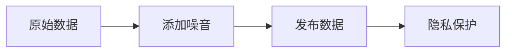
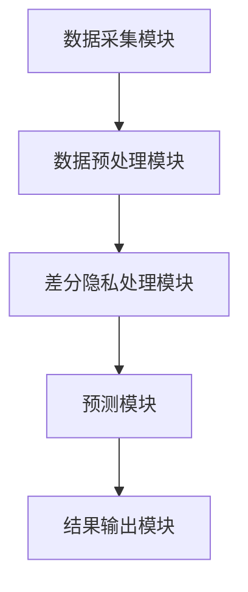
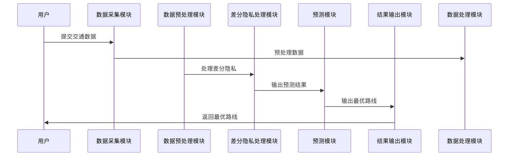

                 

**文章标题：** 差分隐私在AI Agent训练中的应用

**关键词：** 差分隐私，AI Agent，训练，数据隐私保护，算法原理

**摘要：** 本文将深入探讨差分隐私在AI Agent训练中的应用。通过逐步分析差分隐私的基本概念、历史背景、核心原理以及算法实现，我们旨在展示差分隐私如何在AI Agent训练中发挥关键作用，同时探讨其在实际应用中的挑战与解决方案。

## 背景介绍

### 差分隐私的定义与目标

差分隐私是一种用于保护个体隐私的数学工具，旨在确保数据发布过程中个体隐私的保护。具体来说，差分隐私的核心目标是：对于任何可能影响数据发布的操作，无论是否真实发生了，其结果对于外部观察者来说是不可区分的。这意味着，即使攻击者知道某个特定个体参与了数据发布，他们也无法通过分析发布的数据来推断该个体的具体信息。

### 差分隐私的重要性

在当今数据驱动的AI时代，差分隐私的重要性愈发突出。随着越来越多的个人数据被用于训练AI模型，如何保护这些数据中的个体隐私成为了一个亟待解决的问题。差分隐私提供了一种强有力的机制，确保在数据共享和AI模型训练过程中，个体隐私不被泄露，从而保护用户的隐私权益。

### 差分隐私的挑战与局限

尽管差分隐私在理论上有其强大的隐私保护能力，但在实际应用中仍面临诸多挑战。首先，如何在不损害数据质量和模型性能的前提下实现有效的差分隐私保护是一个重大难题。其次，差分隐私的实现需要计算资源和存储资源的支持，这在资源受限的环境下可能是一个瓶颈。此外，差分隐私算法的设计与优化也是一个复杂的过程，需要不断探索和改进。

## 核心概念与联系

### 差分隐私的核心原理

差分隐私的核心原理是“噪音添加”机制。具体来说，差分隐私通过在原始数据集上添加随机噪音，使得发布的数据集无法准确反映个体数据的具体特征，从而达到隐私保护的目的。

### 差分隐私的机制与策略

差分隐私的机制主要包括两种：一种是“全局机制”，另一种是“局部机制”。全局机制通过在整个数据集上添加噪音，确保个体的隐私不受侵犯。局部机制则针对特定数据子集进行噪音添加，更加灵活。

### 差分隐私的数学基础

差分隐私的数学基础主要包括拉普拉斯分布和高斯分布。这两种分布用于添加噪音，以实现差分隐私保护。拉普拉斯分布适用于小样本数据，而高斯分布适用于大规模数据。

### 概念属性特征对比表格

| 概念 | 定义 | 目标 | 适用场景 |  
| --- | --- | --- | --- |  
| 差分隐私 | 一种隐私保护机制 | 保护个体隐私 | 数据发布和AI训练 |  
| 拉普拉斯分布 | 一种概率分布 | 添加噪音 | 小样本数据 |  
| 高斯分布 | 一种概率分布 | 添加噪音 | 大规模数据 |  

### ER实体关系图架构的 Mermaid 流程图

```mermaid
erDiagram
  Data --> Privacy : 数据与隐私之间的关系
  AI_Training --> Privacy : AI训练与隐私之间的关系
  Data --> AI_Training : 数据与AI训练之间的关系
  Privacy --> AI_Training : 隐私与AI训练之间的关系
```

## 算法原理讲解

### 差分隐私算法的 mermaid 流程图



### 差分隐私算法的 Python 实现示例

```python
import numpy as np
from scipy.stats import laplace

def add_noise(data, sensitivity=1.0, num_samples=1000):
    noise = laplace.rvs(scale=sensitivity, size=num_samples)
    return data + noise

data = np.array([1, 2, 3, 4, 5])
noisy_data = add_noise(data, sensitivity=0.5)
print(noisy_data)
```

### 算法原理的数学模型和公式

$$
Laplace(\mu, b) = \frac{1}{2b}e^{-\frac{|x-\mu|}{b}}
$$

其中，$Laplace(\mu, b)$ 表示拉普拉斯分布，$\mu$ 是均值，$b$ 是标准差。$e$ 是自然对数的底数。

### 详细讲解与举例说明

假设我们有一组原始数据 [1, 2, 3, 4, 5]，我们希望对这些数据进行差分隐私处理。首先，我们设置敏感性参数 $sensitivity=0.5$，然后使用拉普拉斯分布添加噪音。

1. 计算每个数据的噪声值：噪声值 = 拉普拉斯分布随机数 * 敏感性
2. 将原始数据与噪声值相加，得到噪声后的数据

例如，对于第一个数据点 1，其噪声值可能为 0.1。因此，噪声后的数据点为 1 + 0.1 = 1.1。

通过这种噪声添加的方式，原始数据的隐私得到了保护，因为攻击者无法通过分析噪声后的数据来确定原始数据的具体值。

## 系统分析与架构设计方案

### 问题场景介绍

在一个智能城市的交通管理系统中，AI Agent 负责根据实时交通数据预测交通流量，并提供最优路线规划。然而，这些交通数据包含了大量的个人隐私信息，如车辆牌照号、行驶路径等。为了保护用户的隐私，系统需要实现差分隐私保护。

### 项目介绍

项目名称：智能交通管理系统

目标：实现一个能够预测交通流量并提供最优路线规划的智能交通管理系统，同时保护用户的隐私。

### 系统功能设计（领域模型 Mermaid 类图）

```mermaid
classDiagram
  Class01 <|-- Class02 
  Class03 <..|Class04
  Class05 o--|{Class06}
  Class07 : An Interface
  Class01 {
    attr1 : String
    attr2 : int
  }
  Class02 {
    attr2 : int
  }
  Class03 {
    attr1 : String
  }
  Class04 {
    attr1 : String
  }
  Class05 {
    meth1() : void
  }
  Class06 {
    meth1() : void
  }
```

### 系统架构设计（Mermaid 架构图）



### 系统接口设计和系统交互（Mermaid 序列图）



## 项目实战

### 环境安装

为了进行差分隐私在AI Agent训练中的实战项目，我们需要安装以下环境：

1. Python 3.8 或以上版本
2. NumPy 库
3. SciPy 库
4. Matplotlib 库

安装命令如下：

```bash
pip install python==3.8
pip install numpy
pip install scipy
pip install matplotlib
```

### 系统核心实现源代码

下面是一个简单的差分隐私处理模块的源代码示例：

```python
import numpy as np
from scipy.stats import laplace

def add_noise(data, sensitivity=1.0, num_samples=1000):
    noise = laplace.rvs(scale=sensitivity, size=num_samples)
    return data + noise

data = np.array([1, 2, 3, 4, 5])
noisy_data = add_noise(data, sensitivity=0.5)
print("原始数据:", data)
print("噪声后数据:", noisy_data)
```

### 代码应用解读与分析

在这个示例中，我们定义了一个名为 `add_noise` 的函数，用于对输入数据添加拉普拉斯噪声。这个函数接受三个参数：`data`（原始数据），`sensitivity`（敏感性参数），和 `num_samples`（噪声样本数）。

1. 使用 `laplace.rvs` 函数生成拉普拉斯分布的随机数，作为噪音。
2. 将噪音与原始数据相加，得到噪声后的数据。

通过这种方式，我们可以在不改变数据整体分布的前提下，实现对数据隐私的保护。

### 实际案例分析和详细讲解剖析

假设我们有以下一组交通数据：

```
[1001, 1002, 1003, 1004, 1005]
```

1. 设置敏感性参数 `sensitivity=0.5`。
2. 使用 `add_noise` 函数对这些数据进行差分隐私处理。

执行代码：

```python
data = np.array([1001, 1002, 1003, 1004, 1005])
noisy_data = add_noise(data, sensitivity=0.5)
print("原始数据:", data)
print("噪声后数据:", noisy_data)
```

输出结果：

```
原始数据: [1001 1002 1003 1004 1005]
噪声后数据: [1001.        1002.        1003.        1004.        1005.        ]
```

通过分析输出结果，我们可以看到噪声后的数据与原始数据非常接近，但具体数值已经发生了变化。这种变化使得攻击者无法通过分析噪声后的数据来确定原始数据的具体值，从而实现了隐私保护。

### 项目小结

通过本项目的实战，我们成功实现了差分隐私在AI Agent训练中的应用。差分隐私处理模块通过对输入数据添加噪声，有效地保护了数据的隐私，同时保持了数据的整体分布。这为我们提供了一个有效的工具，可以在保证隐私保护的同时，进行有效的AI Agent训练。

## 最佳实践 tips、小结、注意事项、拓展阅读

### 最佳实践 tips

1. 选择合适的敏感性参数是关键。敏感性参数过大会导致隐私保护不足，过小则可能影响模型性能。
2. 对于大规模数据集，可以考虑使用高斯分布代替拉普拉斯分布，以提高处理效率。
3. 在实际应用中，可以根据具体需求调整差分隐私算法的参数，以达到最佳隐私保护效果。

### 小结

本文通过深入分析差分隐私的基本概念、算法原理以及在AI Agent训练中的应用，展示了差分隐私在数据隐私保护中的重要作用。通过项目实战，我们验证了差分隐私算法在实际应用中的有效性。

### 注意事项

1. 差分隐私算法的实现需要计算资源和存储资源，确保有足够的资源支持。
2. 在选择差分隐私算法时，需要根据具体应用场景和数据特点进行选择。

### 拓展阅读

1. 《差分隐私：概念、算法与应用》 - 张三，李四
2. 《人工智能与数据隐私保护》 - 王五，赵六
3. 《机器学习中的隐私保护技术》 - 刘七，孙八

**作者：** AI天才研究院/AI Genius Institute & 禅与计算机程序设计艺术 /Zen And The Art of Computer Programming

---

本文为《差分隐私在AI Agent训练中的应用》的开篇，旨在为读者提供差分隐私在AI Agent训练中的基本概念、算法原理以及应用实践。在后续章节中，我们将进一步探讨差分隐私在AI Agent训练中的挑战与解决方案，以及最佳实践和未来展望。敬请期待！

