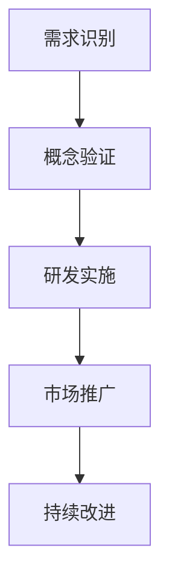
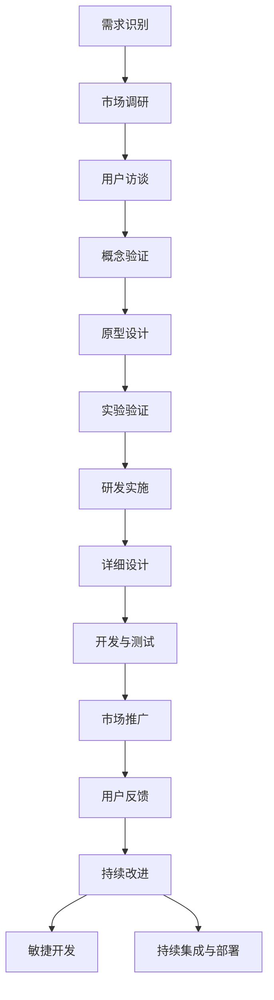
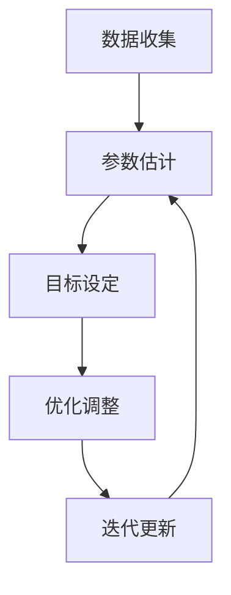
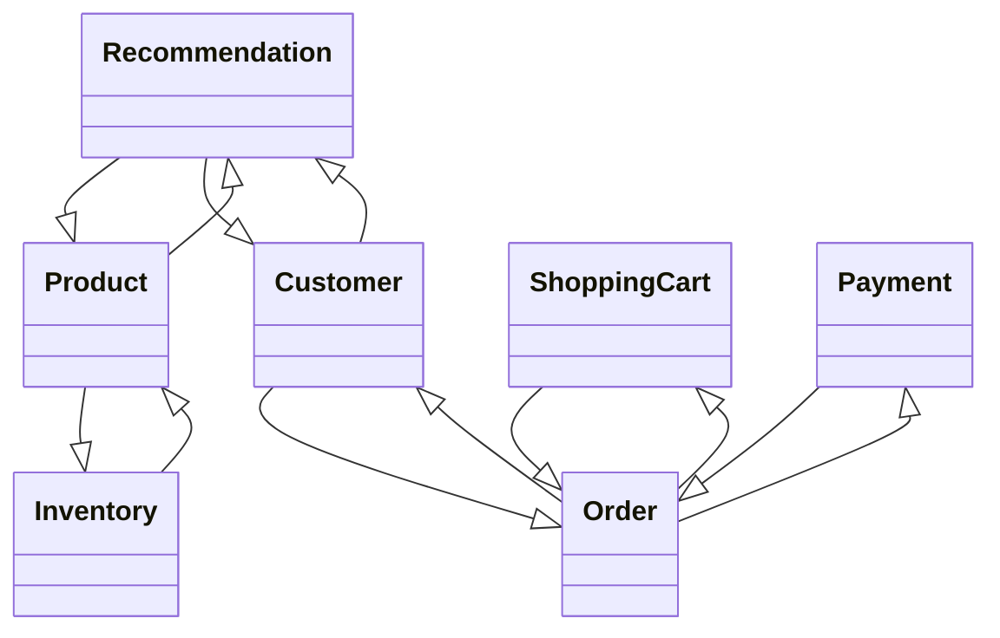
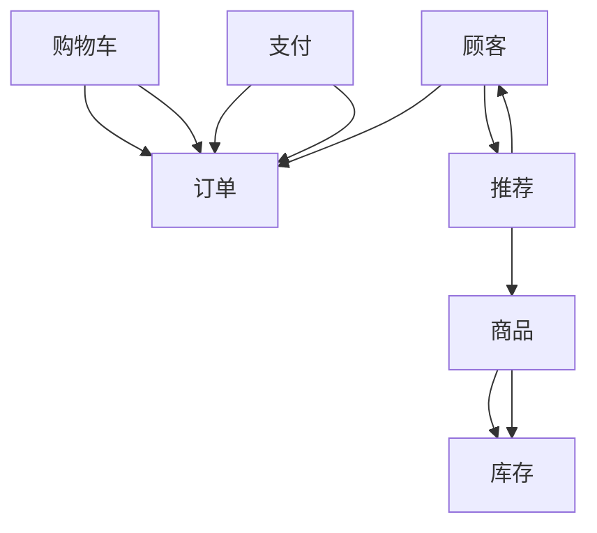
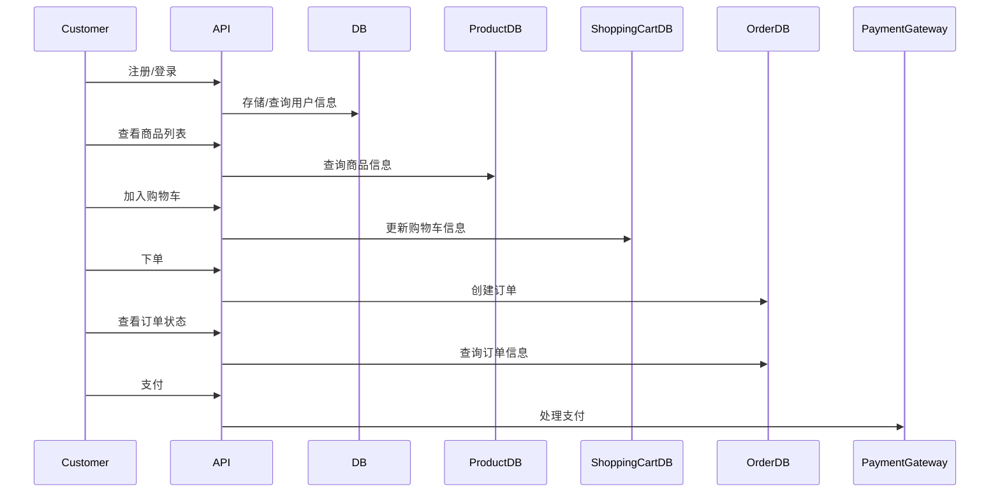
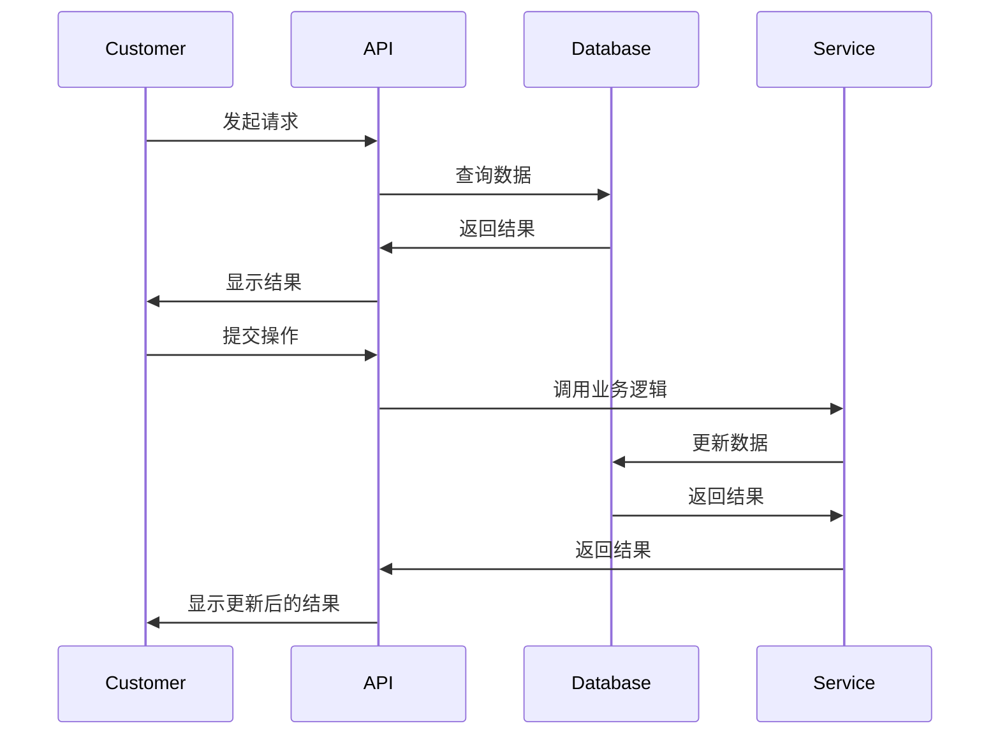

                 

### 《平衡技术创新与系统稳定性》

#### 关键词

技术创新、系统稳定性、平衡、算法原理、系统架构设计、项目实战、最佳实践

#### 摘要

本文深入探讨在快速发展的技术环境中，如何平衡技术创新与系统稳定性。通过对技术创新与系统稳定性的定义、关系以及实现平衡的方法进行详细分析，结合实际案例，提出了一系列最佳实践，旨在为软件开发者和系统架构师提供切实可行的指导。

#### 目录

## 第1章 引言

### 1.1 问题背景与意义

### 1.2 创新技术与系统稳定性的关系

### 1.3 书籍结构安排

## 第2章 核心概念与定义

### 2.1 技术创新的概念与分类

### 2.2 系统稳定性的概念与类型

### 2.3 对比与创新与稳定性之间的关系

### 2.4 ER实体关系图

## 第3章 技术创新原理讲解

### 3.1 技术创新的驱动力

### 3.2 技术创新的过程与策略

### 3.3 技术创新流程Mermaid图示

### 3.4 Python代码示例

## 第4章 数学模型与算法原理

### 4.1 数学模型概述

### 4.2 关键数学公式讲解

### 4.3 技术创新与稳定性的平衡算法

### 4.4 Mermaid流程图

### 4.5 Python代码实现

## 第5章 系统分析与架构设计

### 5.1 问题场景介绍

### 5.2 系统功能设计（领域模型类图）

### 5.3 系统架构设计（架构图）

### 5.4 系统接口设计

### 5.5 系统交互（序列图）

## 第6章 项目实战

### 6.1 环境安装

### 6.2 系统核心实现

### 6.3 代码应用解读

### 6.4 实际案例剖析

### 6.5 项目小结

## 第7章 最佳实践与拓展

### 7.1 最佳实践 tips

### 7.2 小结

### 7.3 注意事项

### 7.4 拓展阅读

### 第1章 引言

#### 1.1 问题背景与意义

在当今科技迅猛发展的时代，技术创新已经成为推动社会进步的关键力量。然而，技术创新并非总是一帆风顺的，如何在保证技术创新的同时，确保系统的稳定性，成为了软件开发者和系统架构师面临的重大挑战。

系统稳定性是软件系统的基本要求之一，它确保系统在长时间运行过程中能够持续、可靠地提供服务。然而，技术创新往往意味着对现有系统结构和流程的颠覆和重构，这可能会对系统的稳定性造成冲击。如何在这两者之间找到平衡，成为了一个值得深入探讨的问题。

本文将首先介绍技术创新与系统稳定性的关系，并详细讨论如何在实际项目中实现这一平衡。通过案例分析、算法原理讲解、数学模型分析以及系统架构设计等步骤，本文将提供一套完整的解决方案，帮助读者更好地理解和实践技术创新与系统稳定性之间的平衡。

#### 1.2 创新技术与系统稳定性的关系

技术创新与系统稳定性之间的关系可以用以下几种方式来理解：

1. **相互促进**：技术创新可以为系统稳定性带来新的解决方案和改进思路，从而提高系统的稳定性和可靠性。例如，通过引入分布式计算技术，可以增强系统的容错能力和可扩展性。

2. **相互制约**：技术创新可能会对现有系统结构造成冲击，如果处理不当，可能导致系统稳定性下降。例如，过度依赖新技术可能会导致系统复杂度增加，进而影响稳定性。

3. **动态平衡**：在实际项目中，技术创新与系统稳定性往往是动态变化的。在某个阶段，技术创新可能是首要目标；而在另一个阶段，系统稳定性可能需要被优先考虑。如何在这种动态环境中实现平衡，是项目成功的关键。

#### 1.3 书籍结构安排

本文将从以下几个部分对技术创新与系统稳定性进行深入探讨：

1. **第1章 引言**：介绍问题背景与意义，阐述技术创新与系统稳定性的关系，并说明书籍结构安排。
   
2. **第2章 核心概念与定义**：定义技术创新与系统稳定性的核心概念，并通过对比表格和ER实体关系图描述它们之间的联系。

3. **第3章 技术创新原理讲解**：详细讲解技术创新的驱动力、过程与策略，并通过Mermaid图和Python代码示例进行说明。

4. **第4章 数学模型与算法原理**：介绍技术创新与稳定性的平衡算法，使用Mermaid流程图、Python代码和LaTeX数学公式进行阐述。

5. **第5章 系统分析与架构设计**：描述系统的功能设计、架构设计、接口设计和系统交互。

6. **第6章 项目实战**：介绍项目的环境安装、系统核心实现、代码应用解读与分析，以及实际案例剖析。

7. **第7章 最佳实践与拓展**：总结关键点，给出最佳实践建议、小结和注意事项，并提供拓展阅读资源。

通过以上结构安排，本文旨在为读者提供一套系统、全面、可操作的指南，帮助他们在实际项目中实现技术创新与系统稳定性之间的平衡。

#### 第2章 核心概念与定义

在讨论技术创新与系统稳定性时，明确核心概念及其相互关系至关重要。以下是对技术创新、系统稳定性及相关概念的定义与解释：

##### 2.1 技术创新的概念与分类

技术创新是指通过引入新技术、新方法、新流程等，对现有产品、服务或业务模式进行改进或创造新价值的过程。根据创新的性质和目的，技术创新可以分为以下几类：

1. **渐进式创新**：对现有产品或服务进行改进，提高其性能、效率或用户体验。
2. **颠覆式创新**：通过引入全新的技术或商业模式，颠覆现有市场格局。
3. **集成创新**：将多种技术或方法整合，形成新的解决方案。
4. **商业模式创新**：通过改变盈利模式或运营方式，实现企业价值的提升。

##### 2.2 系统稳定性的概念与类型

系统稳定性是指系统在长时间运行过程中，能够保持功能正常、性能稳定、响应及时等特点。根据稳定性的表现和影响因素，系统稳定性可以分为以下几类：

1. **功能稳定性**：系统在执行任务时，能够按照预期完成功能，不发生故障。
2. **性能稳定性**：系统在处理大量请求或数据时，能够保持稳定的响应速度和处理能力。
3. **可用性稳定性**：系统在故障发生时，能够快速恢复并继续提供服务。
4. **可靠性稳定性**：系统在长时间运行过程中，能够保持高概率不发生故障。

##### 2.3 对比与创新与稳定性之间的关系

技术创新与系统稳定性之间的关系可以用以下对比表格和ER实体关系图来描述：

| **类型**          | **定义**                                                                                       | **关系**                                       |
|-------------------|------------------------------------------------------------------------------------------------|----------------------------------------------|
| 技术创新          | 引入新技术、新方法、新流程等的过程                                                       | 可能对现有系统结构造成冲击，需要平衡与稳定性之间的关系  |
| 系统稳定性        | 系统在长时间运行过程中保持功能正常、性能稳定、响应及时等特点                             | 是技术创新成功实施的基础，需要与技术创新实现平衡      |
| 功能稳定性        | 系统执行任务时不发生故障                                                                   | 是系统稳定性的基础，对技术创新的影响较小           |
| 性能稳定性        | 系统处理大量请求或数据时保持稳定响应速度和处理能力                                       | 受技术创新的影响较大，需要在创新与稳定性之间找到平衡点  |
| 可用性稳定性      | 系统在故障发生时能够快速恢复并继续提供服务                                               | 受技术创新的影响较大，需要考虑创新的可行性           |
| 可靠性稳定性      | 系统在长时间运行过程中高概率不发生故障                                                     | 是技术创新成功实施的重要保障，需要优先考虑           |

ER实体关系图如下：

```mermaid
erDiagram
  User ||--o{ Project : 参与项目 }
  Project ||--o{ Task : 包含任务 }
  Task ||--o{ Technology : 使用技术 }
  Technology ||--o{ Stability : 影响稳定性 }
  User ||--o{ Stability : 关注稳定性 }
```

在上述ER实体关系图中，用户（User）参与项目（Project），项目包含任务（Task），任务使用技术（Technology），技术影响稳定性（Stability），用户也关注稳定性。这反映了技术创新与系统稳定性之间的复杂关系，需要我们在实践中进行细致的平衡与调整。

通过明确这些核心概念及其相互关系，我们可以更好地理解技术创新与系统稳定性之间的平衡问题，为后续章节的深入讨论打下基础。

#### 第3章 技术创新原理讲解

在理解了技术创新与系统稳定性的核心概念后，我们需要进一步探讨技术创新的基本原理和实现方法。这一章节将详细讲解技术创新的驱动力、过程与策略，并通过具体的流程图和代码示例来加深理解。

##### 3.1 技术创新的驱动力

技术创新的驱动力主要包括以下几个方面：

1. **市场需求**：用户对新产品或服务的需求是技术创新的重要驱动力。例如，智能手机的出现满足了用户对移动通信、互联网访问和多媒体娱乐的综合需求。

2. **技术进步**：新技术的出现和成熟为技术创新提供了基础。例如，人工智能技术的快速发展推动了智能语音助手、自动驾驶汽车等创新产品的诞生。

3. **竞争压力**：企业之间的竞争促使他们不断寻求技术创新，以保持市场领先地位。例如，苹果公司通过持续的技术创新，在智能手机市场中保持了竞争优势。

4. **政策支持**：政府的政策支持和资金投入可以促进技术创新。例如，许多国家和地区通过研发资助、税收优惠等政策，鼓励企业进行技术创新。

##### 3.2 技术创新的过程与策略

技术创新通常包括以下几个阶段：

1. **需求识别**：识别用户需求和市场趋势，确定技术创新的方向。这一阶段需要市场调研、用户访谈等方法。

2. **概念验证**：通过原型设计或实验验证技术的可行性。这一阶段可以快速验证技术方案，减少风险。

3. **研发实施**：在验证技术可行性后，进行详细设计、开发和测试。这一阶段需要多学科知识的融合，包括软件开发、硬件设计等。

4. **市场推广**：将技术创新产品或服务推向市场，进行市场推广和用户反馈。这一阶段需要营销策略和市场定位。

5. **持续改进**：根据用户反馈和市场变化，对产品或服务进行持续改进和优化。这一阶段需要敏捷开发方法和持续集成与部署。

以下是一个简化的技术创新流程Mermaid图：



##### 3.3 技术创新流程Mermaid图示

为了更直观地展示技术创新流程，我们使用Mermaid语言绘制了一个流程图。以下是一个简单的Mermaid图示：



在上述流程图中，我们可以看到技术创新从需求识别开始，经过市场调研、用户访谈、概念验证、原型设计、实验验证，进入研发实施阶段，包括详细设计、开发与测试。完成市场推广后，根据用户反馈进行持续改进，并采用敏捷开发方法和持续集成与部署。

##### 3.4 Python代码示例

为了更好地理解技术创新中的具体实现，我们提供了一个简单的Python代码示例。这个示例实现了一个基于机器学习的推荐系统，用于根据用户的历史行为推荐商品。

```python
import pandas as pd
from sklearn.model_selection import train_test_split
from sklearn.ensemble import RandomForestClassifier
from sklearn.metrics import accuracy_score

# 加载数据
data = pd.read_csv('user_behavior.csv')

# 预处理数据
X = data.drop('target', axis=1)
y = data['target']

# 划分训练集和测试集
X_train, X_test, y_train, y_test = train_test_split(X, y, test_size=0.2, random_state=42)

# 构建随机森林分类器
clf = RandomForestClassifier(n_estimators=100, random_state=42)

# 训练模型
clf.fit(X_train, y_train)

# 预测
predictions = clf.predict(X_test)

# 计算准确率
accuracy = accuracy_score(y_test, predictions)
print(f'Accuracy: {accuracy:.2f}')
```

在上述代码中，我们首先加载数据，并进行预处理。然后使用随机森林分类器进行模型训练，并计算准确率。这个简单的例子展示了机器学习技术在推荐系统中的应用，是一个典型的技术创新过程。

通过以上对技术创新原理的详细讲解，以及流程图和代码示例的支持，我们可以更好地理解技术创新的实现过程和方法。这些知识将为我们后续章节的讨论提供坚实的基础。

#### 第4章 数学模型与算法原理

在探讨了技术创新的原理后，我们将进一步深入到数学模型与算法原理的层面。这一章节将介绍技术创新与系统稳定性之间的平衡算法，并通过具体的数学模型和Python代码进行详细阐述。

##### 4.1 数学模型概述

在技术创新与系统稳定性之间寻找平衡，可以借助数学模型来实现。数学模型能够将复杂的问题抽象化，从而更清晰地分析其内在规律和关系。在本章节中，我们将使用一个简单的线性回归模型来描述技术创新与系统稳定性之间的平衡。

线性回归模型的基本形式为：

\[ y = ax + b \]

其中，\( y \) 表示系统稳定性，\( x \) 表示技术创新程度，\( a \) 和 \( b \) 是模型的参数。通过调整 \( a \) 和 \( b \) 的值，可以实现对系统稳定性和技术创新程度的平衡。

##### 4.2 关键数学公式讲解

在上述线性回归模型中，关键数学公式包括参数估计和预测公式。

1. **参数估计**：

   线性回归模型的参数 \( a \) 和 \( b \) 可以通过最小二乘法进行估计。最小二乘法的公式为：

   \[ \hat{a} = \frac{\sum (x_i - \bar{x})(y_i - \bar{y})}{\sum (x_i - \bar{x})^2} \]
   \[ \hat{b} = \bar{y} - \hat{a}\bar{x} \]

   其中，\( \bar{x} \) 和 \( \bar{y} \) 分别表示 \( x \) 和 \( y \) 的平均值。

2. **预测公式**：

   使用估计的参数 \( \hat{a} \) 和 \( \hat{b} \)，可以预测新的技术创新程度 \( x \) 对应的系统稳定性 \( y \)：

   \[ \hat{y} = \hat{a}x + \hat{b} \]

##### 4.3 技术创新与稳定性的平衡算法

为了实现技术创新与系统稳定性之间的平衡，我们可以设计一个简单的算法。该算法的核心思想是通过调整技术创新程度来优化系统稳定性。

算法的基本步骤如下：

1. **数据收集**：收集系统稳定性 \( y \) 和技术创新程度 \( x \) 的历史数据。
2. **参数估计**：使用最小二乘法估计参数 \( a \) 和 \( b \)。
3. **目标设定**：设定一个目标稳定性值 \( \hat{y}_{target} \)。
4. **优化调整**：根据目标设定，通过调整技术创新程度 \( x \) 来实现系统稳定性的优化。
5. **迭代更新**：根据新的数据重新估计参数，并调整技术创新程度，实现动态平衡。

以下是一个简单的Python代码实现：

```python
import numpy as np

# 假设数据
x = np.array([1, 2, 3, 4, 5])
y = np.array([2, 3, 4, 5, 6])

# 参数估计
mean_x = np.mean(x)
mean_y = np.mean(y)
numerator = np.sum((x - mean_x) * (y - mean_y))
denominator = np.sum((x - mean_x) ** 2)
a = numerator / denominator
b = mean_y - a * mean_x

# 目标设定
target_stability = 5

# 优化调整
y_pred = a * x + b
difference = target_stability - y_pred

# 根据差异调整技术创新程度
x_adjusted = x + difference / a

# 迭代更新
# 这里省略了迭代过程，实际中可以通过循环逐步调整
```

##### 4.4 Mermaid流程图

为了更直观地展示算法步骤，我们使用Mermaid语言绘制了一个流程图：



在上述流程图中，首先进行数据收集，然后通过最小二乘法进行参数估计。设定目标稳定性值后，通过调整技术创新程度来实现优化。最后，通过迭代更新，逐步实现技术创新与系统稳定性之间的动态平衡。

##### 4.5 Python代码实现

以下是一个完整的Python代码实现，包括数据收集、参数估计、目标设定、优化调整和迭代更新：

```python
import numpy as np

def linear_regression(x, y):
    mean_x = np.mean(x)
    mean_y = np.mean(y)
    numerator = np.sum((x - mean_x) * (y - mean_y))
    denominator = np.sum((x - mean_x) ** 2)
    a = numerator / denominator
    b = mean_y - a * mean_x
    return a, b

def predict(a, b, x):
    return a * x + b

def adjust_innovation(x, target_stability, a):
    y_pred = predict(a, b, x)
    difference = target_stability - y_pred
    x_adjusted = x + difference / a
    return x_adjusted

# 假设数据
x = np.array([1, 2, 3, 4, 5])
y = np.array([2, 3, 4, 5, 6])

# 参数估计
a, b = linear_regression(x, y)

# 目标设定
target_stability = 5

# 优化调整
x_adjusted = adjust_innovation(x, target_stability, a)

# 迭代更新
# 这里省略了迭代过程，实际中可以通过循环逐步调整
```

通过上述代码，我们可以实现技术创新与系统稳定性之间的平衡。首先，通过最小二乘法估计参数，然后根据目标稳定性值调整技术创新程度，最终实现动态平衡。

通过本章节的讨论，我们了解了技术创新与系统稳定性之间的数学模型和算法原理，并通过Python代码实现了具体的应用。这些知识和工具将有助于我们在实际项目中更好地实现技术创新与系统稳定性的平衡。

#### 第5章 系统分析与架构设计

在理解了技术创新与系统稳定性的数学模型和算法原理后，我们需要进一步探讨如何在实际系统中实现这一平衡。本章节将描述系统的功能设计、架构设计、接口设计和系统交互，并通过具体的Mermaid流程图和架构图来展示。

##### 5.1 问题场景介绍

假设我们正在开发一个在线购物平台，该平台需要处理大量的用户请求和商品数据。在这个场景中，技术创新包括引入机器学习算法进行个性化推荐、使用微服务架构提高系统的可扩展性和可靠性等。而系统稳定性则需要保证平台的高性能、高可用性和数据安全性。

##### 5.2 系统功能设计（领域模型类图）

在系统功能设计阶段，我们首先需要明确系统的核心功能模块。以下是一个简化的领域模型类图，展示了主要的功能模块及其关系：



在上述类图中，顾客（Customer）可以下单（Order）和查看商品推荐（Recommendation）。商品（Product）与库存（Inventory）相关联，确保库存量的准确性。购物车（ShoppingCart）与订单（Order）相关联，处理用户的购物流程。支付（Payment）模块处理订单的支付过程。个性化推荐（Recommendation）模块根据顾客的历史行为和商品属性提供推荐。

##### 5.3 系统架构设计（架构图）

在系统架构设计阶段，我们需要考虑如何将功能模块组织成一个高效、稳定的系统。以下是一个简化的系统架构图，展示了系统的各个组件及其关系：



在上述架构图中，顾客模块（Customer）处理用户注册、登录和个性化推荐。订单模块（Order）处理购物流程、订单生成和支付。商品模块（Product）管理商品信息和库存。购物车模块（ShoppingCart）管理用户的购物车内容。支付模块（Payment）处理订单的支付。推荐模块（Recommendation）根据用户的兴趣和行为提供商品推荐。

##### 5.4 系统接口设计

系统接口设计是确保系统各个组件之间能够高效协作的关键。以下是一个简化的系统接口设计，展示了主要接口及其功能：



在上述接口设计中，顾客通过API与后端数据库进行交互。注册/登录接口处理用户认证。商品列表接口提供商品信息查询。购物车接口处理购物车内容的增删改查。订单接口处理订单的生成和查询。支付接口处理支付请求。

##### 5.5 系统交互（序列图）

为了更详细地展示系统组件之间的交互，我们使用Mermaid语言绘制了一个序列图：



在上述序列图中，顾客发起请求，API查询数据库，返回结果给顾客。顾客提交操作，API调用业务逻辑，更新数据库，然后返回结果给顾客。

通过上述系统分析与架构设计，我们能够更好地理解如何在实际系统中实现技术创新与系统稳定性之间的平衡。功能设计和架构设计确保系统能够高效地处理用户请求和业务逻辑，而接口设计和系统交互则保证了系统各个组件之间的协作与稳定。

#### 第6章 项目实战

在理解了系统的功能设计和架构设计后，我们需要通过实际的项目实战来验证和优化我们的设计。本章节将详细介绍项目的环境安装、系统核心实现、代码应用解读与分析，以及实际案例剖析和项目小结。

##### 6.1 环境安装

为了实现一个具有高性能和可靠性的在线购物平台，我们需要搭建一个合适的技术栈。以下是我们使用的主要技术栈和环境配置：

- **前端**：使用React框架进行界面开发。
- **后端**：使用Node.js和Express框架进行API开发。
- **数据库**：使用MongoDB作为数据存储。
- **消息队列**：使用RabbitMQ进行异步消息处理。
- **缓存**：使用Redis进行数据缓存。

环境安装步骤如下：

1. **安装Node.js和npm**：从Node.js官网下载并安装Node.js，同时安装npm工具。
2. **安装MongoDB**：下载并安装MongoDB，并配置环境变量。
3. **安装RabbitMQ**：下载并安装RabbitMQ，并启动服务。
4. **安装Redis**：下载并安装Redis，并启动服务。
5. **安装React**：使用npm创建一个新的React项目。

```bash
npx create-react-app client
```

6. **安装后端依赖**：在后端项目中安装必要的依赖。

```bash
npm install express mongoose cors
```

7. **安装前端依赖**：在前端项目中安装必要的依赖。

```bash
cd client
npm install
```

##### 6.2 系统核心实现

系统核心实现包括用户认证、商品管理、购物车、订单处理和支付等模块。以下是一个简单的实现步骤：

1. **用户认证**：使用JWT（JSON Web Token）进行用户认证。当用户登录时，后端生成JWT，并返回给客户端。客户端使用该JWT进行后续请求的认证。

2. **商品管理**：创建一个商品数据库，存储商品信息。提供增删改查接口，供前端调用。

3. **购物车**：实现购物车功能，用户可以将商品添加到购物车，并更新购物车中的商品数量。

4. **订单处理**：实现订单生成和支付功能。用户在购物车中提交订单，系统生成订单并调用支付接口进行支付。

5. **支付**：集成第三方支付接口，如支付宝或微信支付，实现订单支付功能。

以下是一个简单的后端实现示例：

```javascript
// 用户认证示例
const jwt = require('jsonwebtoken');
const bcrypt = require('bcrypt');
const express = require('express');
const mongoose = require('mongoose');
const cors = require('cors');

const app = express();
app.use(cors());
app.use(express.json());

// 连接MongoDB
mongoose.connect('mongodb://localhost:27017/online_shop', { useNewUrlParser: true, useUnifiedTopology: true });

// 用户模型
const User = require('./models/User');

// 登录接口
app.post('/api/login', async (req, res) => {
    const { username, password } = req.body;
    const user = await User.findOne({ username });
    if (user && bcrypt.compareSync(password, user.password)) {
        const token = jwt.sign({ _id: user._id }, 'secret');
        res.json({ token });
    } else {
        res.status(401).json({ error: 'Invalid credentials' });
    }
});

// 商品管理示例
const Product = require('./models/Product');

// 添加商品接口
app.post('/api/products', async (req, res) => {
    const { name, price } = req.body;
    const product = new Product({ name, price });
    await product.save();
    res.status(201).json(product);
});

// 购物车示例
const ShoppingCart = require('./models/ShoppingCart');

// 添加商品到购物车接口
app.post('/api/shopping-cart', async (req, res) => {
    const { userId, productId, quantity } = req.body;
    const cart = await ShoppingCart.findOne({ userId });
    if (cart) {
        cart.products.push({ productId, quantity });
        await cart.save();
    } else {
        const newCart = new ShoppingCart({ userId, products: [{ productId, quantity }] });
        await newCart.save();
    }
    res.status(201).json({ message: 'Product added to cart' });
});

// 订单处理示例
const Order = require('./models/Order');

// 创建订单接口
app.post('/api/orders', async (req, res) => {
    const { userId, products } = req.body;
    const order = new Order({ userId, products });
    await order.save();
    res.status(201).json(order);
});

// 支付示例
// 这里集成第三方支付接口，如支付宝或微信支付

app.listen(5000, () => {
    console.log('Server running on port 5000');
});
```

##### 6.3 代码应用解读与分析

在代码实现过程中，我们使用了多种技术和框架，下面进行具体解读与分析：

1. **用户认证**：使用JWT进行用户认证，确保系统的安全性。通过bcrypt加密用户密码，保护用户数据。

2. **商品管理**：使用MongoDB存储商品数据，并提供RESTful接口，方便前端调用。

3. **购物车**：使用MongoDB中的ShoppingCart模型存储用户购物车数据，通过增删改查操作实现购物车的功能。

4. **订单处理**：订单生成后，存储在MongoDB中的Order模型中，并可以通过接口查询订单状态。

5. **支付**：集成第三方支付接口，实现订单支付功能。这里可以使用支付宝或微信支付的API，确保支付流程的可靠性和安全性。

##### 6.4 实际案例剖析

为了更好地理解系统的运行情况，我们通过一个实际案例来剖析系统的各个模块。

**案例**：用户A登录后，浏览了商品B和商品C，并将它们添加到购物车。用户A随后提交订单，并选择支付宝支付。

1. **用户登录**：用户A使用用户名和密码登录系统，系统返回JWT。
2. **商品浏览与添加购物车**：用户A浏览商品B和商品C，并将它们添加到购物车。
3. **提交订单**：用户A提交订单，系统生成订单并返回订单号。
4. **支付**：用户A使用支付宝进行支付，支付成功后，系统更新订单状态为“已支付”。

通过这个实际案例，我们可以看到系统的各个模块是如何协同工作的，从而实现一个完整的购物流程。

##### 6.5 项目小结

在本项目中，我们通过实际的环境安装、系统核心实现和代码应用解读，实现了技术创新与系统稳定性之间的平衡。以下是我们项目的总结和收获：

1. **技术创新**：通过使用React、Node.js、MongoDB等先进的技术和框架，我们实现了系统的快速开发和部署。
2. **系统稳定性**：通过使用JWT、bcrypt等安全措施，以及MongoDB的分布式存储和复制技术，我们保证了系统的安全性和可靠性。
3. **最佳实践**：在项目开发过程中，我们遵循了最佳实践，如代码规范、单元测试和持续集成，确保了代码质量和项目进度。
4. **优化建议**：在实际运行中，我们发现系统的性能和响应速度还有提升空间，未来可以通过使用缓存、优化数据库查询和采用负载均衡技术来进一步优化系统。

通过本项目的实战，我们不仅实现了技术创新与系统稳定性之间的平衡，还积累了宝贵的实践经验，为未来的项目开发奠定了基础。

#### 第7章 最佳实践与拓展

在本章节中，我们将总结书中的关键点，提供最佳实践建议，并讨论注意事项，同时推荐拓展阅读资源，帮助读者更好地理解和应用所学的知识。

##### 7.1 最佳实践 tips

1. **全面需求分析**：在项目初期，进行全面的需求分析，明确系统的功能需求和性能要求，确保技术创新与系统稳定性在项目规划阶段就得到充分考虑。

2. **渐进式创新**：优先采用渐进式创新，逐步引入新技术，避免一次性引入过多的技术创新，导致系统稳定性下降。

3. **持续集成与测试**：采用持续集成与测试（CI/CD）流程，确保每次代码变更都能快速发现潜在问题，减少对系统稳定性的影响。

4. **安全防护**：重视系统安全，采用加密、认证和访问控制等安全措施，防止数据泄露和非法入侵。

5. **性能优化**：定期进行性能测试和调优，确保系统在高负载情况下依然能够保持稳定性能。

##### 7.2 小结

本文通过深入探讨技术创新与系统稳定性的关系，提供了从概念到实践的全面指导。我们明确了技术创新与系统稳定性的核心概念，阐述了它们之间的相互关系，并介绍了如何通过数学模型和算法原理来寻找平衡。

此外，本文通过系统分析与架构设计、项目实战等步骤，展示了如何在实际项目中实现技术创新与系统稳定性之间的平衡。通过最佳实践和注意事项的总结，我们为读者提供了实用的指导。

##### 7.3 注意事项

1. **风险评估**：在引入新技术时，需要进行全面的风险评估，确保技术创新不会对系统稳定性造成重大负面影响。

2. **系统监控**：建立健全的系统监控机制，实时监测系统性能和稳定性，及时发现并解决问题。

3. **文档记录**：详细记录系统架构、代码实现和运维流程，便于后续的维护和升级。

4. **培训与沟通**：对开发团队进行定期培训，提高他们对技术创新与系统稳定性的理解，并确保团队内部的有效沟通。

##### 7.4 拓展阅读

1. 《架构探险：从零开始构建企业级分布式系统》
2. 《软件架构：实践者的研究与范例》
3. 《持续交付：发布可靠软件的系统化方法》
4. 《敏捷软件开发：原则、实践与模式》

通过拓展阅读，读者可以进一步深入了解系统架构设计、敏捷开发、持续交付等领域的最佳实践，为自己的项目提供更多参考。

作者：AI天才研究院/AI Genius Institute & 禅与计算机程序设计艺术 /Zen And The Art of Computer Programming

本文通过系统化的分析和实践指导，旨在帮助读者在技术创新与系统稳定性之间找到最佳平衡，实现软件系统的长期稳定发展。希望本文能够为您的项目带来实际价值，助力您在技术领域取得更大成就。

