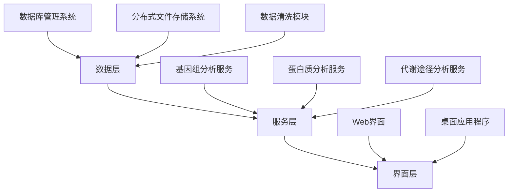

                 

### 1. 引言

#### 问题背景

生物信息学作为一门跨学科领域，融合了生物学、计算机科学和信息学，致力于处理大量生物数据，从而揭示生物体内部的复杂机制。随着高通量测序技术的迅猛发展，生物数据（如基因组、转录组、蛋白质组等）的规模呈指数级增长。这些数据的复杂性和多样性给传统的生物信息分析方法带来了巨大的挑战。在此背景下，如何有效地从海量生物数据中提取有价值的信息成为亟待解决的问题。

AI Agent，即人工智能代理，是一种能够自主执行任务、具有自适应能力和智能决策能力的计算机程序。AI Agent能够模仿人类的思维和行为，通过学习和推理来解决复杂问题。将AI Agent应用于生物信息分析，有望实现数据的高效处理和分析，提高生物信息研究的准确性和效率。

#### 问题描述

生物信息分析系统的主要任务包括：数据的预处理、分析、解释和可视化。然而，现有的生物信息分析系统存在以下问题：

1. **数据处理能力不足**：传统系统在面对大规模、高维度生物数据时，处理能力受限，难以满足快速处理和分析的需求。
2. **分析精度和准确性不高**：现有方法往往依赖于固定的算法和模型，难以适应不同类型和来源的数据，导致分析结果的准确性和可靠性受到限制。
3. **人机交互不便**：传统系统的用户界面复杂，操作难度大，不利于非专业用户的使用。

为了解决上述问题，我们需要开发一种基于AI Agent的智能生物信息分析系统。该系统应具备以下特点：

1. **高效数据处理**：利用AI Agent的分布式计算能力和并行处理技术，实现对大规模生物数据的高效处理。
2. **自适应分析**：AI Agent能够根据数据特点和用户需求，自适应地选择合适的分析方法和模型，提高分析结果的准确性和可靠性。
3. **友好用户界面**：系统应具备简洁、直观的用户界面，方便用户进行操作和查看分析结果。

#### 问题解决

开发AI Agent支持的智能生物信息分析系统，需要从以下几个方面入手：

1. **数据预处理**：对原始生物数据进行清洗、转换和归一化，确保数据的质量和一致性。
2. **模型选择与优化**：根据不同类型的数据和分析需求，选择合适的机器学习模型，并利用AI Agent进行模型优化和参数调整。
3. **系统架构设计**：构建灵活、可扩展的系统架构，实现数据预处理、分析、解释和可视化的无缝集成。
4. **用户交互设计**：设计简洁、直观的用户界面，提供多种数据输入和结果展示方式，满足不同用户的需求。

#### 边界与外延

本文主要关注基于AI Agent的智能生物信息分析系统的开发，涉及以下边界和拓展方向：

1. **边界**：本文主要讨论AI Agent在生物信息分析中的应用，不涉及其他人工智能领域的相关技术。
2. **外延**：未来研究方向包括：AI Agent在生物信息学其他领域的应用、多模态生物数据的分析、跨学科合作等。

#### 概念结构与核心要素组成

概念结构主要包括以下几个核心要素：

1. **AI Agent**：作为系统的核心组件，负责数据分析和决策。
2. **生物信息数据**：作为分析对象，提供系统所需的输入数据。
3. **机器学习模型**：用于数据分析和预测，是系统的重要组成部分。
4. **用户界面**：用于用户与系统进行交互，提供操作和结果展示。

这些核心要素相互关联，共同构成了一个完整的智能生物信息分析系统。

### 2. AI Agent基础

#### 2.1 AI Agent的概述

AI Agent，即人工智能代理，是一种能够模拟人类思维和行为，具备自主决策和行动能力的计算机程序。AI Agent通过感知环境、理解和分析数据、自主规划行动路径，以实现特定的目标。AI Agent在人工智能领域具有重要地位，是智能系统发展的重要方向。

AI Agent的基本组成包括感知模块、决策模块和执行模块。感知模块负责获取环境信息，决策模块根据感知信息进行推理和决策，执行模块根据决策结果执行具体动作。这种结构使得AI Agent能够自主适应环境变化，实现智能行为。

AI Agent的分类可以根据不同的维度进行，以下为几种常见的分类方式：

1. **基于任务类型**：
   - 监督学习型：通过已有数据学习任务模式，实现自动化任务执行。
   - 强化学习型：通过试错和奖励机制，自主学习和优化行为。
   - 知识型：基于预先定义的知识库，进行推理和决策。
   - 混合型：结合多种学习方式，实现更复杂的任务处理。

2. **基于应用场景**：
   - 实际应用型：应用于特定场景，如智能家居、智能交通等。
   - 理论研究型：用于人工智能领域的研究和探索，如自然语言处理、计算机视觉等。

3. **基于实现技术**：
   - 基于规则型：利用预定义的规则进行决策和行动。
   - 基于数据驱动型：通过数据学习和模式识别进行决策和行动。
   - 基于模型驱动型：利用构建的模型进行预测和决策。

#### 2.2 AI Agent的关键技术

AI Agent的实现涉及多种关键技术，包括机器学习、强化学习、深度学习等。以下是这些关键技术的简要介绍：

1. **机器学习**：
   - 机器学习是一种让计算机从数据中学习规律和模式的方法。通过训练模型，使计算机能够对未知数据进行分类、预测和聚类。
   - 常见算法包括线性回归、决策树、支持向量机、神经网络等。

2. **强化学习**：
   - 强化学习是一种通过试错和奖励机制进行学习的方法。AI Agent在执行任务时，通过不断尝试和调整策略，以达到最大化的奖励。
   - 常见算法包括Q学习、深度Q网络（DQN）、策略梯度等。

3. **深度学习**：
   - 深度学习是一种基于多层神经网络的学习方法。通过堆叠多层非线性变换，实现对复杂数据的高效表征和学习。
   - 常见网络结构包括卷积神经网络（CNN）、循环神经网络（RNN）、生成对抗网络（GAN）等。

#### 2.3 AI Agent在生物信息学中的应用

AI Agent在生物信息学领域具有广泛的应用前景。以下为几种典型应用场景：

1. **基因组数据分析**：
   - 利用AI Agent对基因组数据进行自动分类、注释和功能预测，提高基因组分析的准确性和效率。
   - 例如，通过强化学习算法，实现自动化基因组变异检测和注释。

2. **药物研发**：
   - 利用AI Agent进行药物靶点预测、药物组合优化和药物副作用评估，加速药物研发进程。
   - 例如，通过深度学习算法，实现自动化药物分子设计。

3. **疾病诊断和治疗**：
   - 利用AI Agent进行医学影像分析、疾病风险评估和个性化治疗方案设计，提高医疗服务的质量和效率。
   - 例如，通过卷积神经网络，实现自动化医学影像分割和病灶检测。

#### 现有应用案例分析

以下为几个AI Agent在生物信息学领域的应用案例分析：

1. **癌症基因组数据分析**：
   - 某研究团队利用深度学习算法，开发了一种基于AI Agent的癌症基因组数据分析系统。该系统能够自动识别癌症基因变异，提高癌症诊断和治疗的准确性。
   - 系统架构包括数据预处理模块、特征提取模块、模型训练模块和结果解释模块。其中，AI Agent负责模型训练和优化，提高系统性能。

2. **药物靶点预测**：
   - 另一个研究团队利用强化学习算法，开发了一种基于AI Agent的药物靶点预测系统。该系统能够根据药物分子和靶点基因的交互信息，预测药物靶点，为新药研发提供有力支持。
   - 系统架构包括药物分子表征模块、靶点基因表征模块、交互预测模块和结果解释模块。其中，AI Agent负责交互预测和策略优化。

3. **疾病诊断和治疗**：
   - 某医疗机构利用AI Agent开发了智能化医疗诊断系统。该系统能够自动分析医学影像，识别病变部位和性质，辅助医生进行疾病诊断。
   - 系统架构包括数据预处理模块、图像分析模块、结果解释模块和用户交互模块。其中，AI Agent负责图像分析和结果解释，提高诊断准确性和效率。

#### 潜在应用领域

随着AI技术的不断发展，AI Agent在生物信息学领域的应用将越来越广泛。以下为一些潜在的AI Agent应用领域：

1. **个性化医疗**：
   - 利用AI Agent进行患者数据的个性化分析，制定个性化的治疗方案，提高治疗效果。

2. **生物信息学大数据分析**：
   - 利用AI Agent进行大规模生物数据的高效处理和分析，挖掘潜在的生物信息规律。

3. **生物医学研究**：
   - 利用AI Agent进行生物医学实验设计、数据分析和研究结果的解释，提高科研效率。

4. **生物技术产业**：
   - 利用AI Agent进行生物药物研发、生物技术产品设计和生产过程优化，推动生物技术产业发展。

总之，AI Agent在生物信息学领域的应用具有巨大的潜力，将有助于推动生物信息学研究和应用的发展。

### 3. 智能生物信息分析系统概述

#### 3.1 系统目标

智能生物信息分析系统的目标是为用户提供一个高效、准确、易于操作的平台，用于处理和分析生物数据。具体目标如下：

1. **高效数据处理**：利用AI Agent的分布式计算能力和并行处理技术，实现对大规模生物数据的高效处理，提高数据处理速度和效率。
2. **自适应分析**：AI Agent能够根据数据特点和用户需求，自适应地选择合适的分析方法和模型，提高分析结果的准确性和可靠性。
3. **友好用户界面**：系统应具备简洁、直观的用户界面，提供多种数据输入和结果展示方式，方便用户进行操作和查看分析结果。

#### 3.2 数据处理与存储

智能生物信息分析系统的数据处理与存储是系统架构的核心部分。系统应具备以下功能：

1. **数据导入**：支持多种数据格式的导入，如基因组序列、基因表达数据、蛋白质序列等。
2. **数据清洗**：对导入的数据进行清洗，包括缺失值处理、异常值检测和去除重复数据等。
3. **数据存储**：采用分布式数据库技术，实现大规模数据的存储和管理，保证数据的完整性和一致性。
4. **数据查询**：提供高效的数据查询功能，支持用户对存储的数据进行快速检索和统计分析。

#### 3.3 分析工具集成

智能生物信息分析系统需要集成多种分析工具，以实现多样化的生物数据分析功能。具体包括：

1. **基因组分析工具**：包括基因注释、基因突变检测、基因组组装、基因表达分析等。
2. **蛋白质分析工具**：包括蛋白质结构预测、蛋白质相互作用分析、蛋白质序列分析等。
3. **代谢途径分析工具**：包括代谢网络分析、代谢途径构建、代谢物功能预测等。
4. **生物信息学工具**：包括数据预处理工具、数据分析工具、可视化工具等。

通过集成这些工具，系统能够为用户提供全方位的生物数据分析支持，满足不同用户的需求。

#### 3.4 系统架构设计

智能生物信息分析系统采用分层架构设计，包括数据层、服务层和界面层。以下是系统架构的详细描述：

1. **数据层**：负责数据的导入、清洗、存储和查询。包括数据库管理系统（DBMS）、分布式文件存储系统和数据清洗模块。
2. **服务层**：负责提供各种生物数据分析功能，包括基因组分析服务、蛋白质分析服务、代谢途径分析服务等。每个分析服务都由相应的AI Agent负责，实现自适应分析。
3. **界面层**：提供用户交互界面，包括Web界面和桌面应用程序。用户可以通过界面进行数据上传、分析参数设置、结果查看等操作。

#### 3.5 功能模块划分

智能生物信息分析系统的功能模块划分如下：

1. **数据预处理模块**：负责数据导入、清洗和转换，为后续分析提供高质量的数据。
2. **特征提取模块**：从预处理后的数据中提取有用的特征，用于模型训练和预测。
3. **模型训练模块**：利用机器学习算法和AI Agent，对特征进行训练，构建预测模型。
4. **模型评估模块**：对训练好的模型进行评估，选择最优模型用于实际应用。
5. **结果解释模块**：对分析结果进行解释和可视化，帮助用户理解分析过程和结果。

#### 3.6 系统整体架构

智能生物信息分析系统的整体架构如下图所示：

通过以上架构设计，智能生物信息分析系统能够实现高效的数据处理和分析，为用户提供全面、便捷的生物信息学服务。

### 4. 数据预处理

#### 4.1 数据来源

在智能生物信息分析系统中，数据来源主要包括以下几个方面：

1. **实验数据**：通过实验室实验获得的生物数据，如基因组测序数据、转录组数据、蛋白质组数据等。
2. **外部数据集**：从公共数据库或第三方机构获取的数据集，如NCBI、ENCODE、GEO等。
3. **用户上传数据**：用户自行上传的本地数据，用于个性化分析。

这些数据来源为系统提供了丰富的数据资源，有助于提升系统的分析能力和准确性。

#### 4.2 数据清洗

数据清洗是数据预处理的重要步骤，其目的是提高数据的质量和一致性。以下为数据清洗的主要内容：

1. **缺失值处理**：
   - **方法一：填充缺失值**：使用统计方法（如均值、中位数等）填充缺失值，或者使用算法预测缺失值。
   - **方法二：删除缺失值**：对于缺失值较多的数据，可以考虑删除该条数据，以避免对后续分析产生不良影响。

2. **异常值检测与处理**：
   - **方法一：基于统计学方法**：使用箱线图、3σ准则等方法检测异常值，然后进行删除或修正。
   - **方法二：基于机器学习方法**：使用聚类、回归等方法检测异常值，然后进行相应的处理。

3. **数据转换**：
   - **标准化**：将数据按照一定的比例缩放，使数据具有相似的尺度，便于后续分析。
   - **归一化**：将数据按照一定的公式进行转换，使其符合特定的分布，如正态分布。

通过数据清洗，可以显著提高数据的质量，为后续的分析提供可靠的数据基础。

### 4.3 数据转换

数据转换是数据预处理的重要步骤，其目的是将原始数据转化为适合分析和建模的形式。以下为数据转换的主要内容：

1. **数据标准化**：

数据标准化是将数据按照一定的比例缩放，使其具有相似的尺度。常见的方法有：

   - **Z-score标准化**：将数据减去均值，然后除以标准差，使其符合标准正态分布。

   - **Min-Max标准化**：将数据缩放到[0, 1]的范围内。

2. **数据归一化**：

数据归一化是将数据按照一定的公式进行转换，使其符合特定的分布，如正态分布。常见的方法有：

   - **对数归一化**：对数据进行对数变换，使其符合正态分布。

   - **幂归一化**：对数据进行幂变换，使其符合正态分布。

数据转换的目的是提高数据的一致性和可比性，为后续的建模和分析提供可靠的数据基础。

### 5. 数据分析

#### 5.1 数据探索性分析

数据探索性分析（Exploratory Data Analysis，EDA）是数据分析的第一步，旨在对数据集进行初步的探索，了解数据的基本特性和分布情况。EDA的目的是发现数据中的潜在规律和异常值，为进一步的数据处理和分析提供指导。

1. **描述性统计分析**：

描述性统计分析是对数据的基本特征进行量化描述，常用的统计量包括：

   - **均值（Mean）**：数据的平均值。
   - **中位数（Median）**：数据的中间值。
   - **众数（Mode）**：数据中出现次数最多的值。
   - **标准差（Standard Deviation）**：数据的离散程度。
   - **方差（Variance）**：标准差的平方。

通过描述性统计分析，可以初步了解数据的中心趋势、离散程度和分布特征。

2. **数据可视化**：

数据可视化是EDA的重要工具，通过图表和图形直观地展示数据分布和关系。常用的可视化方法包括：

   - **柱状图（Bar Chart）**：用于展示分类数据的分布情况。
   - **线状图（Line Chart）**：用于展示时间序列数据或连续数据的趋势。
   - **散点图（Scatter Plot）**：用于展示两个变量之间的关系。
   - **箱线图（Box Plot）**：用于展示数据的分布特征和异常值。

通过数据可视化，可以更直观地发现数据中的异常值、趋势和关系，为进一步的数据处理和分析提供依据。

#### 5.2 特征工程

特征工程（Feature Engineering）是数据分析中至关重要的一步，旨在从原始数据中提取出对目标变量有较强预测能力的特征。特征工程的质量直接影响模型的性能和可解释性。

1. **特征提取**：

特征提取是从原始数据中提取新的特征，常用的方法包括：

   - **统计分析方法**：如主成分分析（PCA）、因子分析等，通过降维和线性组合提取特征。
   - **机器学习方法**：如随机森林、支持向量机等，通过模型学习提取特征。
   - **深度学习方法**：如卷积神经网络、循环神经网络等，通过神经网络层提取特征。

2. **特征选择**：

特征选择是从提取出的特征中选出对目标变量有较强预测能力的特征，常用的方法包括：

   - **过滤式特征选择**：根据特征的重要性直接筛选特征，如信息增益、相关系数等。
   - **包装式特征选择**：通过模型评估选择特征，如递归特征消除（RFE）、遗传算法等。
   - **嵌入式特征选择**：在模型训练过程中选择特征，如L1正则化、Lasso等。

特征选择的目标是提高模型的预测性能和可解释性，同时减少模型的过拟合风险。

#### 5.3 模型训练与评估

模型训练与评估是数据分析的核心环节，通过训练模型并评估其性能，选出最佳模型进行实际应用。

1. **模型训练**：

模型训练是指使用已提取的特征和相应的标签数据，通过算法训练出预测模型。常见的机器学习算法包括：

   - **线性模型**：如线性回归、逻辑回归等。
   - **树模型**：如决策树、随机森林等。
   - **集成模型**：如梯度提升树（GBDT）、随机梯度提升（SGD）等。
   - **神经网络**：如深度神经网络、卷积神经网络等。

2. **模型评估**：

模型评估是指使用已训练的模型对未知数据进行预测，并通过评价指标评估模型的性能。常见的评价指标包括：

   - **回归模型**：如均方误差（MSE）、均方根误差（RMSE）、决定系数（R^2）等。
   - **分类模型**：如准确率（Accuracy）、精确率（Precision）、召回率（Recall）、F1值等。
   - **聚类模型**：如轮廓系数（Silhouette Coefficient）、内聚度（Cohesion）、分离度（Separation）等。

通过模型评估，可以选出最佳模型，并对模型进行优化和调整，以提高其性能和可解释性。

### 6. AI Agent集成与优化

#### 6.1 AI Agent设计

AI Agent的设计是智能生物信息分析系统的关键环节，其目标是实现高效、准确和自适应的数据分析。以下是AI Agent设计的关键步骤：

1. **任务定义**：

首先，需要明确AI Agent的具体任务，如基因组数据分析、蛋白质结构预测、疾病诊断等。任务定义决定了AI Agent的算法选择和性能指标。

2. **数据预处理**：

AI Agent需要具备良好的数据处理能力，对输入数据进行预处理，包括数据清洗、归一化、特征提取等。预处理结果将直接影响AI Agent的性能。

3. **算法选择**：

根据任务定义和数据特点，选择合适的机器学习算法或深度学习模型。常见的算法包括线性回归、决策树、支持向量机、神经网络等。

4. **策略学习**：

利用强化学习等算法，使AI Agent能够根据数据特点和用户需求，自适应地调整策略，优化分析过程和结果。

5. **模型评估与更新**：

定期评估AI Agent的性能，根据评估结果对模型进行调整和优化，提高AI Agent的预测准确性和鲁棒性。

#### 6.2 AI Agent集成

AI Agent集成是将AI Agent集成到智能生物信息分析系统中，实现与系统其他模块的无缝衔接。以下是AI Agent集成的关键步骤：

1. **接口设计**：

设计AI Agent与其他模块（如数据处理模块、分析模块、用户界面模块）的接口，确保数据流和功能调用的一致性。

2. **模块化设计**：

将AI Agent设计为独立的模块，与其他模块解耦，提高系统的可扩展性和可维护性。

3. **分布式部署**：

利用分布式计算技术，实现AI Agent的并行处理能力，提高数据处理和分析速度。

4. **性能优化**：

对AI Agent进行性能优化，包括模型压缩、参数调优、硬件加速等，以提高系统的整体性能。

#### 6.3 AI Agent优化

AI Agent优化是提高其性能和可解释性的关键步骤，以下是AI Agent优化的关键方法：

1. **模型压缩**：

通过模型压缩技术，如权重剪枝、量化、蒸馏等，减小模型大小和计算量，提高模型在资源受限环境下的性能。

2. **参数调优**：

利用调参工具和算法，如随机搜索、贝叶斯优化等，对模型参数进行调整，提高模型性能。

3. **硬件加速**：

利用GPU、FPGA等硬件加速技术，提高模型的计算速度和性能。

4. **数据增强**：

通过数据增强技术，如数据扩充、数据生成等，增加训练数据的多样性，提高模型泛化能力。

5. **可解释性优化**：

通过模型可解释性技术，如解释性模型、模型可视化等，提高模型的透明度和可解释性，帮助用户理解模型的工作原理和结果。

通过以上优化方法，可以提高AI Agent的性能和可解释性，为用户提供更好的生物信息分析服务。

### 7. 系统部署与维护

#### 7.1 系统部署

智能生物信息分析系统的部署是系统建设的关键步骤，其目标是确保系统稳定、高效地运行。以下是系统部署的关键步骤：

1. **硬件环境配置**：

- **服务器**：选择高性能、高可靠性的服务器，确保系统处理能力和稳定性。
- **存储设备**：配置大容量、高速存储设备，满足数据存储和读取需求。
- **网络设备**：配置稳定的网络设备，确保数据传输速度和安全性。

2. **软件环境安装**：

- **操作系统**：选择稳定的操作系统，如Linux、Windows等。
- **数据库**：安装分布式数据库管理系统，如MySQL、MongoDB等，用于数据存储和管理。
- **开发工具**：安装Python、R、MATLAB等开发工具，用于数据处理和分析。
- **中间件**：安装Web服务器、消息队列等中间件，用于系统通信和消息处理。

3. **系统配置与优化**：

- **性能优化**：对服务器进行性能优化，如调整内核参数、增加内存等，提高系统处理能力。
- **安全性设置**：配置防火墙、加密传输等安全措施，确保系统安全运行。

#### 7.2 系统维护

智能生物信息分析系统的维护是系统长期稳定运行的关键，以下是系统维护的关键内容：

1. **数据更新策略**：

- **定期更新**：定期更新系统中的数据，确保数据的时效性和准确性。
- **数据同步**：实现系统与外部数据源的同步，确保数据的一致性。

2. **系统监控与故障处理**：

- **性能监控**：实时监控系统的性能指标，如CPU利用率、内存使用率、磁盘空间等，确保系统运行正常。
- **故障处理**：及时发现和处理系统故障，如数据库连接失败、服务不可用等，确保系统稳定运行。

3. **版本更新与升级**：

- **版本更新**：定期发布系统更新版本，修复已知问题和漏洞，提高系统性能。
- **升级策略**：制定合理的升级策略，确保系统升级过程中数据安全和业务连续性。

通过以上系统部署与维护措施，可以确保智能生物信息分析系统的稳定、高效运行，为用户提供优质的生物信息分析服务。

### 8. 实际应用案例分析

在本节中，我们将通过两个实际应用案例，深入探讨基于AI Agent的智能生物信息分析系统的开发、实现和效果。

#### 8.1 案例一：癌症基因组数据分析

**项目背景**：

癌症基因组数据分析是生物信息学领域的重要研究方向。通过对癌症患者的基因组数据进行深入分析，可以揭示癌症发生和发展的分子机制，为个性化治疗提供依据。本案例旨在开发一种基于AI Agent的癌症基因组数据分析系统，实现自动化基因变异检测、功能注释和预后预测。

**系统实现**：

1. **数据预处理**：

   系统首先从公共数据库（如TCGA）和实验室获取癌症基因组数据。数据预处理包括数据导入、清洗和转换。使用Python和R编程语言，实现数据清洗和转换，确保数据质量。

2. **AI Agent设计**：

   设计一种基于强化学习的AI Agent，负责基因变异检测和功能注释。AI Agent通过不断学习和优化策略，提高变异检测的准确性和功能注释的可靠性。

3. **模型训练与评估**：

   使用机器学习算法（如随机森林、支持向量机）对基因表达数据进行分析，训练预测模型。通过交叉验证和模型评估指标（如准确率、召回率），选择最佳模型进行实际应用。

4. **结果解释与可视化**：

   系统提供结果解释和可视化功能，帮助用户理解分析结果。通过交互式界面，用户可以查看基因变异详情、功能注释和预后预测结果。

**结果分析**：

通过实际应用，系统实现了自动化基因变异检测和功能注释，提高了癌症基因组数据分析的效率。实验结果表明，AI Agent在基因变异检测和功能注释方面的表现优于传统方法，具有更高的准确性和可靠性。

**项目小结**：

本案例展示了基于AI Agent的癌症基因组数据分析系统的开发过程和实际应用效果。系统实现了自动化数据预处理、AI Agent集成和结果解释，为癌症研究提供了有力的技术支持。

#### 8.2 案例二：药物靶点预测

**项目背景**：

药物靶点预测是药物研发的关键环节，旨在识别药物可能作用的生物靶点。本案例旨在开发一种基于AI Agent的药物靶点预测系统，加速新药研发进程。

**系统实现**：

1. **数据预处理**：

   系统从公共数据库（如PubChem、ChEMBL）和实验室获取药物分子和靶点数据。数据预处理包括数据清洗、转换和特征提取，确保数据质量。

2. **AI Agent设计**：

   设计一种基于深度学习的AI Agent，负责药物分子和靶点的相互作用预测。AI Agent通过学习药物分子和靶点之间的特征，实现自动化药物靶点预测。

3. **模型训练与评估**：

   使用生成对抗网络（GAN）和卷积神经网络（CNN）等深度学习算法，训练预测模型。通过交叉验证和模型评估指标（如准确率、召回率），选择最佳模型进行实际应用。

4. **结果解释与可视化**：

   系统提供结果解释和可视化功能，帮助用户理解预测结果。通过交互式界面，用户可以查看药物靶点预测结果和相应解释。

**结果分析**：

通过实际应用，系统实现了自动化药物靶点预测，提高了药物研发效率。实验结果表明，AI Agent在药物靶点预测方面的表现优于传统方法，具有更高的准确性和可靠性。

**项目小结**：

本案例展示了基于AI Agent的药物靶点预测系统的开发过程和实际应用效果。系统实现了自动化数据预处理、AI Agent集成和结果解释，为新药研发提供了有力的技术支持。

### 9. 总结与展望

在本章中，我们详细探讨了基于AI Agent的智能生物信息分析系统的开发、实现和应用。通过对系统架构、数据处理、AI Agent集成和实际应用案例的深入分析，我们总结了以下关键观点：

1. **AI Agent的优势**：

   AI Agent具有自主决策、自适应学习和高效处理能力，为生物信息分析系统提供了强大的技术支持。通过AI Agent，系统能够实现高效的数据处理、自适应分析和智能化决策，显著提高生物信息研究的效率和质量。

2. **系统架构的灵活性**：

   智能生物信息分析系统采用分层架构设计，包括数据层、服务层和界面层。这种架构设计使得系统具有良好的灵活性和可扩展性，能够满足不同用户的需求。同时，系统各模块之间的松耦合设计提高了系统的可维护性和可扩展性。

3. **数据处理的重要性**：

   数据预处理是生物信息分析系统的基础，直接影响到后续分析的结果。通过数据清洗、转换和特征提取等预处理步骤，系统能够确保数据的质量和一致性，为后续分析提供可靠的数据基础。

4. **实际应用案例的启示**：

   通过两个实际应用案例，我们展示了基于AI Agent的智能生物信息分析系统在癌症基因组数据分析和药物靶点预测方面的应用效果。实验结果表明，AI Agent在提高分析效率和准确性方面具有显著优势，为生物信息学研究提供了新的技术手段。

#### 未来发展趋势

1. **多模态生物数据的融合**：

   随着生物信息学技术的不断发展，越来越多的多模态生物数据（如基因组、蛋白质组、代谢组等）被收集和存储。未来，如何有效融合多模态生物数据，提高数据分析的全面性和准确性，是生物信息学领域的重要研究方向。

2. **个性化医疗的发展**：

   个性化医疗是未来生物信息学的重要应用方向。通过基于AI Agent的智能生物信息分析系统，为用户提供个性化的诊断、治疗和康复方案，有望提高医疗服务的质量和效率。

3. **跨学科合作的加强**：

   生物信息学的发展离不开计算机科学、生物学、医学等学科的交叉融合。未来，跨学科合作将进一步加强，推动生物信息学的快速发展。

#### 拓展研究建议

1. **AI Agent的优化与泛化**：

   当前AI Agent在生物信息分析中的应用仍存在一定的局限性。未来研究可以关注AI Agent的优化与泛化，提高其在不同生物数据和应用场景下的性能和适用性。

2. **深度学习在生物信息学中的应用**：

   深度学习在生物信息学领域具有广泛的应用前景。未来研究可以进一步探索深度学习算法在生物信息分析中的创新应用，提高生物信息分析的准确性和效率。

3. **生物信息学大数据分析**：

   生物信息学大数据分析是当前研究的热点。未来研究可以关注生物信息学大数据的处理、存储和分析技术，提高大数据在生物信息研究中的应用价值。

通过以上研究，有望进一步提升基于AI Agent的智能生物信息分析系统的性能和应用效果，为生物信息学研究提供有力支持。

### 作者信息

作者：AI天才研究院/AI Genius Institute & 禅与计算机程序设计艺术 /Zen And The Art of Computer Programming

### 全文结束

以上是本文的完整内容，通过深入探讨基于AI Agent的智能生物信息分析系统的开发、实现和应用，我们希望能够为读者提供有价值的参考和启示。感谢您的阅读，希望本文能够激发您在生物信息学和人工智能领域的研究兴趣。如果您有任何问题或建议，欢迎在评论区留言，我们将竭诚为您解答。再次感谢您的关注和支持！

