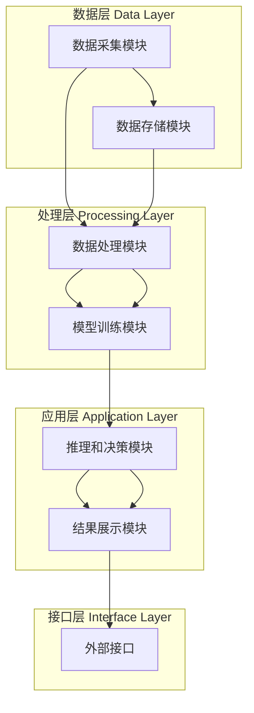
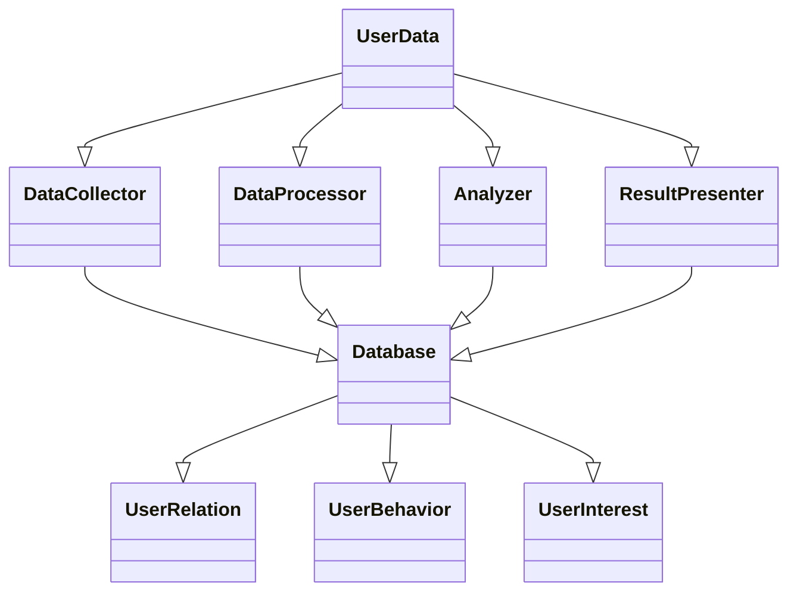
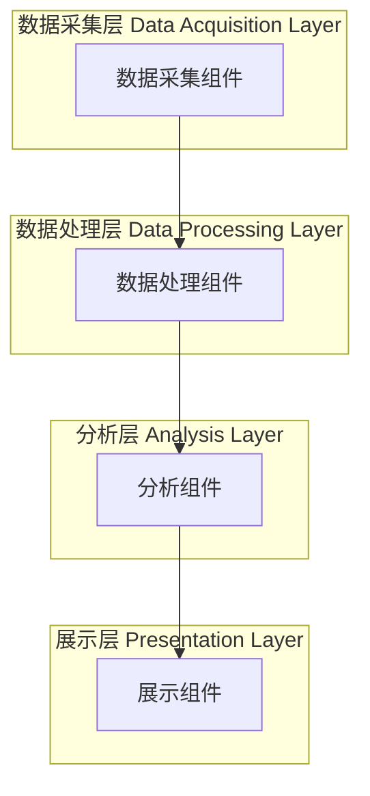
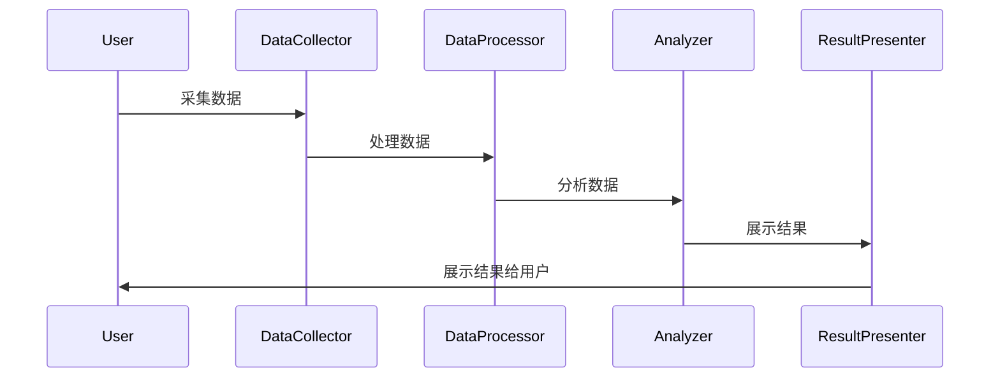
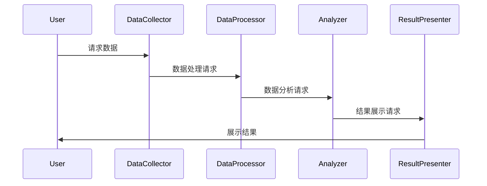

                 

### 文章标题

# 开发AI Agent支持的智能社交网络分析系统

### 文章关键词

- AI Agent
- 社交网络分析
- 智能系统
- 数据挖掘
- 机器学习

### 文章摘要

本文旨在探讨如何开发一个AI Agent支持的智能社交网络分析系统。通过引入AI Agent的概念，并结合社交网络分析技术，我们将详细解析系统的设计原则、实现方法和应用场景。文章分为以下几个部分：首先，介绍AI Agent和社交网络分析的基本概念及其重要性；其次，探讨AI Agent支持的社交网络分析系统的开发框架和关键技术；接着，阐述系统的架构设计方案和核心实现细节；然后，通过实际项目案例展示系统应用；最后，总结最佳实践和未来展望。

## 引言

随着互联网的快速发展，社交网络已经成为了人们日常生活中不可或缺的一部分。从Facebook、Twitter到微信、微博，社交网络平台不仅改变了人们的沟通方式，也为企业和组织提供了宝贵的数据资源。然而，如何有效地分析和利用这些数据，成为了一个亟待解决的问题。传统的数据分析方法在处理大规模、复杂社交网络数据时存在局限性，难以满足日益增长的需求。因此，引入人工智能（AI）特别是AI Agent技术，来支持社交网络分析，成为了当前研究的热点。

### 关键术语说明

- **AI Agent**：一种具有自主学习和决策能力的计算机程序，可以模拟人类智能行为，实现自动任务执行。
- **社交网络分析**：研究社交网络的结构、行为及其演化规律，旨在发现有价值的信息和知识。
- **智能系统**：通过集成多种人工智能技术，实现对复杂问题的自动解决和优化。
- **数据挖掘**：从大量数据中发现潜在的模式和规律。
- **机器学习**：一种通过数据训练模型，使计算机具备自主学习和决策能力的技术。

### 问题背景

随着社交网络的普及，用户生成和分享的数据量呈爆炸式增长。这些数据包含了丰富的用户关系、行为和兴趣信息，对企业市场营销、危机管理、社交趋势预测等领域具有重要价值。然而，如何从海量数据中提取有价值的信息，仍然是一个挑战。传统的数据分析方法在处理大规模、复杂社交网络数据时，存在以下问题：

1. **计算能力不足**：传统的数据处理方法通常需要大量的人工干预，难以处理大规模社交网络数据。
2. **分析深度有限**：传统的数据分析方法难以深入挖掘社交网络中的潜在关系和趋势。
3. **实时性要求高**：社交网络中的信息更新速度快，传统方法难以实现实时分析。

### 问题描述

为了解决上述问题，我们需要一个能够自动处理大规模社交网络数据，并能实时分析、挖掘有价值信息的系统。具体来说，问题描述如下：

- 如何设计一个AI Agent支持的智能社交网络分析系统，使其能够自动收集、处理和分析社交网络数据？
- 如何利用AI技术，提升社交网络分析的效果和效率？
- 如何确保系统的实时性和可靠性，满足不同应用场景的需求？

### 问题解决

针对上述问题，我们提出以下解决方案：

- **AI Agent设计**：引入AI Agent技术，实现自动化数据处理和分析。
- **社交网络分析框架**：结合数据挖掘和机器学习技术，构建一个强大的社交网络分析框架。
- **系统架构设计**：采用分布式架构，确保系统的实时性和高可用性。
- **用户界面设计**：提供直观、易用的用户界面，方便用户操作和数据分析。

### 边界与外延

本系统的开发和应用主要集中在以下领域：

- **市场营销**：通过社交网络分析，为企业提供用户画像、市场需求分析等支持。
- **危机管理**：实时监测社交网络舆情，为政府和企业提供决策支持。
- **社交趋势预测**：利用社交网络数据，预测社交趋势和热点事件。
- **社交网络推荐**：基于用户行为和兴趣，提供个性化社交推荐。

### 核心概念结构

本系统的核心概念结构包括以下几个部分：

- **AI Agent**：作为系统的核心组件，负责数据收集、处理和分析。
- **社交网络数据**：包括用户关系、行为和兴趣等信息。
- **数据分析模型**：利用数据挖掘和机器学习技术，对社交网络数据进行分析。
- **用户界面**：提供数据可视化、查询和分析功能。

### 书籍内容概述

本文书将分为以下几个部分：

- **第1部分：引言**：介绍AI Agent和社交网络分析的基本概念及其重要性。
- **第2部分：基础概念**：详细探讨AI Agent和社交网络分析的基本原理。
- **第3部分：开发框架**：阐述AI Agent支持的社交网络分析系统的开发框架和关键技术。
- **第4部分：架构设计**：介绍系统的架构设计，包括数据收集、处理、分析和展示等环节。
- **第5部分：实现与部署**：详细讲解系统的实现过程和部署方法。
- **第6部分：应用案例**：通过实际项目案例，展示系统的应用效果。
- **第7部分：最佳实践与展望**：总结最佳实践，并对未来发展方向进行展望。

本文书旨在为开发者、研究人员和从业者提供一个全面、系统的指南，帮助他们掌握AI Agent支持的智能社交网络分析系统的开发方法和技术。

## AI Agent基本概念

AI Agent，即人工智能代理，是一种模拟人类智能行为，具备自主决策和学习能力的计算机程序。AI Agent的出现，为自动化、智能化的任务处理提供了强有力的支持。本节将详细探讨AI Agent的定义、特点、类型及其与传统的软件代理的区别。

### 定义

AI Agent的定义可以从多个维度进行理解。最简单的定义是：AI Agent是一种能够感知环境、自主决策并采取行动的智能实体。根据这种定义，AI Agent的核心功能包括感知、决策和行动。感知是指AI Agent能够通过传感器获取环境信息；决策是指AI Agent能够基于感知到的信息，选择最佳的行动方案；行动是指AI Agent能够执行决策方案，实现对环境的改变。

### 特点

AI Agent具有以下特点：

1. **自主性**：AI Agent能够在没有人类直接干预的情况下，自主完成任务。这种自主性体现在感知、决策和行动三个环节。
2. **智能性**：AI Agent能够通过学习和适应，提升自身的任务执行能力。智能性是AI Agent区别于传统软件代理的重要特征。
3. **适应性**：AI Agent能够根据环境变化，调整自身行为，以适应新的任务需求和挑战。
4. **灵活性**：AI Agent能够灵活地处理各种类型的任务，不仅限于特定的领域或任务。

### 类型

AI Agent可以根据不同的分类标准进行分类，常见的分类方式包括：

1. **基于功能分类**：
   - **任务型AI Agent**：专注于完成特定任务，如客服机器人、智能助手等。
   - **智能搜索型AI Agent**：专注于信息搜索和推荐，如搜索引擎、推荐系统等。
   - **交互型AI Agent**：专注于与人类交互，如虚拟客服、聊天机器人等。
2. **基于架构分类**：
   - **基于规则的AI Agent**：使用预设规则进行决策，适用于规则明确、变化不大的场景。
   - **基于模型的AI Agent**：使用机器学习模型进行决策，适用于复杂、动态的环境。
   - **混合型AI Agent**：结合规则和模型进行决策，兼具两者优势。

### AI Agent与传统的软件代理

传统的软件代理（Software Agent）主要是指那些没有智能性、只能按照预设规则执行任务的计算机程序。与AI Agent相比，传统软件代理具有以下区别：

1. **智能性**：AI Agent具备智能性，能够自主学习和适应，而传统软件代理缺乏这种能力。
2. **感知能力**：AI Agent能够感知环境，而传统软件代理通常无法感知外部环境。
3. **决策能力**：AI Agent能够基于感知到的信息进行决策，而传统软件代理只能按照预设规则执行。
4. **灵活性**：AI Agent具有更高的灵活性，能够适应不同环境和任务需求，而传统软件代理通常只能处理特定场景。

综上所述，AI Agent相较于传统软件代理，具备更高的智能性、自主性和灵活性，能够更好地适应复杂和动态的环境。这使得AI Agent在社交网络分析等领域具有广阔的应用前景。

### 常见的AI Agent开发框架

在开发AI Agent时，选择合适的开发框架至关重要。常见的AI Agent开发框架包括OpenAI的Gym、RLLib、Ray和PyTorch。以下对这些框架进行简要介绍和比较：

#### OpenAI Gym

**特点**：OpenAI Gym是一个开源的强化学习环境库，提供了多种标准化的任务和模拟环境，方便开发者进行算法验证和比较。

**应用场景**：适用于强化学习算法的测试和实验。

**优缺点**：
- **优点**：提供丰富的预定义环境，易于使用和扩展。
- **缺点**：对自定义环境的支持有限，且某些环境较为基础。

#### RLLib

**特点**：RLLib是一个基于Python的强化学习库，支持多种强化学习算法和大规模分布式训练。

**应用场景**：适用于大规模强化学习应用和实验。

**优缺点**：
- **优点**：支持分布式训练，适用于大规模应用。
- **缺点**：学习曲线较陡，需要一定的开发经验。

#### Ray

**特点**：Ray是一个高性能的分布式计算框架，支持多种机器学习算法的分布式训练。

**应用场景**：适用于需要大规模分布式训练的AI Agent开发。

**优缺点**：
- **优点**：高效、易用，支持多种机器学习算法。
- **缺点**：相比于其他框架，Ray的学习曲线可能较陡。

#### PyTorch

**特点**：PyTorch是一个基于Python的科学计算库，提供了灵活、高效的动态计算图构建和训练工具。

**应用场景**：适用于需要灵活性和高性能的AI Agent开发。

**优缺点**：
- **优点**：灵活、易用，支持动态计算图，适合快速原型开发。
- **缺点**：在特定任务上的性能可能不如其他框架。

#### 比较分析

- **适用场景**：OpenAI Gym和RLLib适用于强化学习任务，Ray适用于分布式训练，PyTorch适用于需要高灵活性和高性能的AI Agent开发。
- **性能**：Ray在分布式训练方面表现出色，PyTorch在动态计算图方面具有优势，但具体性能取决于应用场景。
- **易用性**：PyTorch和RLLib相对易于上手，但Ray和OpenAI Gym可能需要更多的开发经验。

综上所述，选择AI Agent开发框架时，需要根据具体应用场景和需求进行综合考虑。通过对比分析，可以找到最适合的框架，以实现高效的AI Agent开发。

### AI Agent在不同场景中的应用

AI Agent作为一种具备自主学习和决策能力的计算机程序，在多个领域中展现出了广泛的应用潜力。以下我们将探讨AI Agent在虚拟世界模拟、智能交通和智能医疗等领域的应用，并通过具体案例展示其优势。

#### 虚拟世界模拟

虚拟世界模拟是AI Agent的一个重要应用场景，通过模拟现实世界中的环境、物体和人物，可以为游戏、教育、城市规划等提供沉浸式体验。一个典型的应用案例是《模拟城市》（SimCity）游戏，其中AI Agent负责模拟市民的行为，如工作、消费、迁徙等。这些AI Agent通过学习游戏中的数据和规则，能够自主调整行为，从而实现城市管理的自动化和智能化。

**优势**：
- **高仿真能力**：AI Agent能够模拟真实世界中的复杂行为，为用户提供沉浸式体验。
- **高效管理**：通过自动化管理，减少人工干预，提高效率和准确性。

#### 智能交通

智能交通系统（Intelligent Transportation System，ITS）利用AI Agent技术，可以实现交通流量预测、事故预警和车辆调度等功能，从而提高交通效率和安全性。一个成功的案例是谷歌的自动驾驶汽车项目，其中AI Agent负责处理大量的实时数据，如道路状况、车辆位置和行人行为，并自主做出决策，如加速、减速和转向。

**优势**：
- **实时性**：AI Agent能够实时处理交通数据，快速响应交通变化。
- **安全性**：通过自主决策，减少人为错误，提高交通安全。

#### 智能医疗

在智能医疗领域，AI Agent可以用于辅助诊断、病情预测和个性化治疗。例如，IBM的Watson for Oncology系统利用AI Agent技术，分析海量医学文献和病例数据，为医生提供诊断建议和治疗方案。另一个案例是AlphaGo在围棋领域的应用，通过AI Agent技术，实现了围棋棋局的自动生成和挑战。

**优势**：
- **数据分析能力**：AI Agent能够处理和分析大量医学数据，提供准确的诊断和预测。
- **个性化治疗**：根据患者具体病情，提供个性化的治疗方案，提高治疗效果。

### 应用案例对比

通过上述案例，我们可以看到AI Agent在不同场景中的应用优势和特点：

- **虚拟世界模拟**：侧重于仿真和沉浸式体验，通过AI Agent实现自动化管理。
- **智能交通**：侧重于实时交通管理和安全性提升，通过AI Agent实现高效、安全的交通调度。
- **智能医疗**：侧重于医学数据分析和个性化治疗，通过AI Agent提高诊断和治疗效果。

这些案例展示了AI Agent在不同领域的广泛应用潜力，同时也为开发者提供了丰富的经验和启示。随着AI技术的不断进步，AI Agent将在更多领域中发挥重要作用，推动智能化发展。

## 社交网络分析基础

社交网络分析（Social Network Analysis，SNA）是一种研究社交网络的结构、行为及其演化规律的方法。通过对社交网络的分析，可以揭示其中的潜在关系、趋势和模式，为企业和组织提供有价值的信息和洞见。本节将介绍社交网络的基本概念、结构类型及其关键指标。

### 社交网络的概念

社交网络是指由个体（或实体）及其相互关系构成的复杂系统。这些个体可以是个人、组织、公司等，它们通过某种形式的关系相互连接。社交网络不仅包括个体之间的直接联系，还涵盖了间接联系和复杂的网络结构。社交网络分析旨在通过定量和定性方法，研究这些网络的特性、行为和演化规律。

### 社交网络的结构

社交网络的结构可以分为以下几种类型：

1. **无向图**：每个节点表示个体，每条边表示个体之间的关系。无向图是最常见的社交网络结构，适用于描述非互惠关系。
2. **有向图**：每个节点表示个体，每条边带有方向，表示个体之间的互惠关系。有向图适用于描述互惠关系，如好友关系、推荐关系等。
3. **加权图**：在无向图或有向图中，每条边可以带有权重，表示个体之间关系的强度或频率。加权图适用于描述复杂的关系网络，如社交网络中的互动频率。
4. **网络层**：社交网络可以划分为多个层次或子网络，每个层次包含不同类型的节点和关系。网络层有助于揭示社交网络的分层结构和功能分区。

### 社交网络的类型

社交网络的类型多种多样，常见的包括以下几种：

1. **强关系网络**：个体之间具有紧密、频繁的互动和联系，如家庭、社区等。
2. **弱关系网络**：个体之间互动较少，但关系较为松散，如职场、朋友圈等。
3. **多层网络**：社交网络由多个层次构成，不同层次的节点和关系具有不同的特征和功能。
4. **动态网络**：社交网络随着时间推移而不断变化，节点和关系的加入、移除和变化是常见现象。

### 社交网络分析的关键指标

为了深入理解社交网络的结构和特性，需要借助一系列关键指标进行分析。以下是一些常见的社交网络分析指标：

1. **度数**：一个节点的度数是指连接到该节点的边的数量。度数可以反映节点的地位和影响力，度数越高，节点在网络中的连接越广泛。
2. **平均路径长度**：网络中任意两个节点之间的平均路径长度，用于衡量网络的紧密程度。平均路径长度越短，网络越紧密。
3. **聚类系数**：节点周围邻居节点的连接情况，表示网络的聚集程度。聚类系数越高，网络中的聚集现象越明显。
4. **中间中心性**：节点在网络中的中介作用，用于衡量节点对网络连接的掌控能力。中间中心性越高的节点，对网络连接的控制力越强。
5. **接近中心性**：节点在网络中的接近程度，用于衡量节点在网络中的连通性。接近中心性越高的节点，与其他节点的连通性越强。

通过上述关键指标，我们可以从多个维度分析社交网络的结构和特性，揭示其中的潜在关系和趋势。社交网络分析不仅为学术研究提供了丰富的数据和方法，也为企业和组织提供了有价值的洞察和决策支持。

## 社交网络分析技术

社交网络分析（SNA）技术是揭示社交网络结构和行为的关键手段。在数据处理和分析方面，常用的技术包括网络图谱绘制、文本挖掘和社群发现。以下将详细介绍这些技术及其应用。

### 网络图谱绘制

网络图谱（Network Graph）是一种用于可视化社交网络结构的方法，通过节点和边来表示个体及其关系。网络图谱不仅能够直观地展示社交网络的全貌，还能帮助研究人员识别关键节点、发现网络中的核心团体和路径。

**技术原理**：

网络图谱绘制主要包括以下步骤：

1. **数据收集**：从社交网络平台（如微博、Facebook）或第三方数据源获取用户及其关系数据。
2. **节点和边表示**：将用户和关系映射为网络图谱中的节点和边。节点表示个体，边表示个体之间的联系。
3. **可视化**：利用可视化工具（如Gephi、Cytoscape）将网络图谱绘制出来，通过颜色、形状和大小等属性增强图的可读性。

**应用场景**：

- **市场分析**：通过绘制品牌在社交媒体上的用户网络图谱，分析用户分布和影响力，制定有效的营销策略。
- **社交关系分析**：在学术研究或企业内部调查中，绘制员工之间的社交网络图谱，揭示人际关系和团队结构。

### 文本挖掘

文本挖掘（Text Mining）是一种从非结构化文本数据中提取有用信息和知识的方法。在社交网络分析中，文本挖掘可以用于情感分析、话题挖掘和关系提取等任务。

**技术原理**：

文本挖掘主要包括以下步骤：

1. **文本预处理**：对原始文本进行清洗，去除停用词、标点符号等，将文本转换为适合分析的形式。
2. **特征提取**：将文本转换为特征向量，常用方法包括词袋模型、TF-IDF和词嵌入等。
3. **模型训练与预测**：利用机器学习算法（如朴素贝叶斯、支持向量机、深度学习等）训练文本分类模型，对文本进行分类、情感分析或关系提取。

**应用场景**：

- **情感分析**：通过分析用户在社交网络上的评论和帖子，了解用户对产品或事件的情感倾向。
- **话题挖掘**：从大量的社交媒体文本中提取出热门话题和趋势，帮助企业或组织及时掌握市场动态。

### 社群发现

社群发现（Community Detection）是一种识别社交网络中的紧密团体和社群的方法。通过社群发现，可以揭示社交网络中的隐藏结构和模式，为研究人员提供新的视角和洞见。

**技术原理**：

社群发现主要包括以下步骤：

1. **图分区**：将社交网络划分为多个社群，每个社群内的节点之间联系紧密，节点与节点之间的连接较少。
2. **社群识别算法**：常用的算法包括快速解（Fast Greedy Algorithm）、标签传播（Label Propagation Algorithm）和层次聚类（Hierarchical Clustering）等。
3. **社群质量评估**：评估社群的内部连接性和外部分离性，筛选出高质量的社群。

**应用场景**：

- **社交关系分析**：通过社群发现，识别社交网络中的紧密团体和社群，揭示人际关系和社交模式。
- **市场细分**：在市场营销中，利用社群发现技术，识别具有相似兴趣和行为习惯的用户群体，制定精准的营销策略。

综上所述，网络图谱绘制、文本挖掘和社群发现是社交网络分析的重要技术手段，通过这些技术，可以深入挖掘社交网络中的潜在关系和趋势，为企业和组织提供有价值的洞察和决策支持。

## AI Agent支持社交网络分析系统的开发框架

在开发AI Agent支持的智能社交网络分析系统时，构建一个合理的开发框架是至关重要的。这个框架需要整合AI技术和社交网络分析技术，确保系统能够高效、准确地处理和分析大规模社交网络数据。以下将详细讨论系统的开发框架、关键技术以及系统架构设计。

### 开发框架

AI Agent支持社交网络分析系统的开发框架可以分为以下几个关键部分：

1. **数据采集模块**：负责从社交网络平台获取用户数据，包括用户关系、行为和兴趣等信息。
2. **数据处理模块**：对采集到的原始数据进行清洗、预处理和结构化，以适应后续分析。
3. **模型训练模块**：利用机器学习和深度学习技术，训练AI模型以实现自动化分析功能。
4. **推理和决策模块**：基于训练好的模型，进行实时推理和决策，以支持系统的智能化功能。
5. **结果展示模块**：将分析结果以可视化形式展示给用户，提供直观的洞见和决策支持。

### 关键技术

1. **深度学习技术**：深度学习在图像、语音和文本处理等领域取得了显著成果，通过引入深度学习技术，可以提升系统的自动化分析能力。例如，使用卷积神经网络（CNN）进行图像识别，使用循环神经网络（RNN）进行序列数据建模。
2. **强化学习技术**：强化学习是一种通过试错和反馈进行学习的方法，适用于需要自主决策的任务。在社交网络分析中，可以应用强化学习算法（如深度强化学习）来优化社交网络分析策略，提高系统的自适应性和鲁棒性。
3. **图数据库技术**：图数据库（如Neo4j、JanusGraph）能够高效地存储和处理大规模社交网络数据，支持复杂的关系查询和图分析。利用图数据库，可以更好地管理社交网络数据，提升数据分析的效率。
4. **自然语言处理技术**：自然语言处理（NLP）技术可以帮助系统理解、分析和生成人类语言。在社交网络分析中，NLP技术可以用于文本挖掘、情感分析和关系提取，从而提升系统的语义理解能力。

### 系统架构设计

AI Agent支持社交网络分析系统的架构设计可以分为以下几个层次：

1. **数据层**：包括数据采集模块和数据存储模块。数据采集模块负责从社交网络平台获取数据，数据存储模块则使用图数据库存储和管理数据，确保数据的高效存取和一致性。
2. **处理层**：包括数据处理模块和模型训练模块。数据处理模块对原始数据进行清洗、预处理和结构化，模型训练模块则使用深度学习和强化学习技术训练AI模型，以实现自动化分析功能。
3. **应用层**：包括推理和决策模块和结果展示模块。推理和决策模块基于训练好的模型进行实时推理和决策，结果展示模块则将分析结果以可视化形式展示给用户，提供直观的洞见和决策支持。
4. **接口层**：提供与外部系统（如大数据平台、业务系统等）的接口，实现数据的互联互通和功能集成。

### 系统架构图

以下是AI Agent支持社交网络分析系统的架构设计示意图：



通过上述开发框架和系统架构设计，AI Agent支持社交网络分析系统能够高效、准确地处理和分析大规模社交网络数据，为企业和组织提供智能化、自动化的社交网络分析服务。

## 系统架构设计方案

在开发AI Agent支持的智能社交网络分析系统时，系统的架构设计至关重要。一个合理、高效的系统架构不仅能够提高数据处理和分析的效率，还能确保系统的可扩展性和高可用性。本节将详细介绍系统架构的设计方案，包括问题场景介绍、项目介绍、系统功能设计、系统架构设计、系统接口设计和系统交互。

### 问题场景介绍

在当今社交媒体高度发达的时代，社交网络数据量庞大且不断增长，如何从这些海量数据中提取有价值的信息，已成为企业和组织面临的重要问题。传统的数据分析方法难以应对这种复杂、动态的数据环境，因此引入AI Agent技术来支持社交网络分析，成为了一种有效的解决方案。

具体来说，问题场景包括：

- **市场分析**：企业需要分析消费者在社交网络中的行为和兴趣，以制定精准的营销策略。
- **舆情监测**：政府和企业需要实时监测社交网络上的舆情动态，及时应对潜在的风险和危机。
- **社交趋势预测**：研究人员和媒体机构需要预测社交网络上的热门话题和趋势，为内容创作和传播提供依据。

### 项目介绍

本项目旨在开发一个AI Agent支持的智能社交网络分析系统，系统将具备以下功能：

- **数据采集**：从多个社交网络平台（如微博、微信、Facebook等）采集用户数据，包括用户关系、行为和兴趣等信息。
- **数据处理**：对采集到的原始数据进行清洗、预处理和结构化，构建社交网络数据模型。
- **自动分析**：利用AI Agent技术，对社交网络数据进行分析，提取有价值的信息和洞见。
- **结果展示**：将分析结果以可视化形式展示给用户，提供直观的洞见和决策支持。

### 系统功能设计

本系统的功能设计主要包括以下模块：

1. **数据采集模块**：负责从社交网络平台采集用户数据，包括用户关系、行为和兴趣等信息。
2. **数据处理模块**：对采集到的原始数据进行清洗、预处理和结构化，构建社交网络数据模型。
3. **分析模块**：利用AI Agent技术，对社交网络数据进行分析，提取有价值的信息和洞见。
4. **展示模块**：将分析结果以可视化形式展示给用户，提供直观的洞见和决策支持。

以下是系统功能设计的类图：



### 系统架构设计

本系统的架构设计采用分布式架构，以提高系统的扩展性和高可用性。系统架构主要包括以下组件：

1. **数据采集组件**：负责从社交网络平台采集用户数据，并将数据存储到数据库中。
2. **数据处理组件**：对采集到的原始数据进行清洗、预处理和结构化，构建社交网络数据模型。
3. **分析组件**：利用AI Agent技术，对社交网络数据进行分析，提取有价值的信息和洞见。
4. **展示组件**：将分析结果以可视化形式展示给用户，提供直观的洞见和决策支持。

以下是系统架构设计图：



### 系统接口设计

系统接口设计主要包括以下接口：

1. **数据采集接口**：用于从社交网络平台获取用户数据。
2. **数据处理接口**：用于处理和分析用户数据。
3. **展示接口**：用于将分析结果展示给用户。

以下是系统接口设计图：



### 系统交互

系统交互主要涉及数据流和控制流。以下是系统交互的序列图：



通过上述系统架构设计方案，AI Agent支持智能社交网络分析系统能够高效、准确地处理和分析大规模社交网络数据，为企业和组织提供智能化、自动化的社交网络分析服务。

## 系统实现

为了实现一个AI Agent支持的智能社交网络分析系统，我们将采用Python作为主要编程语言，结合相关库和框架来完成系统的各个模块。本节将详细描述系统实现的核心部分，包括环境安装、系统核心实现和代码应用解读。

### 环境安装

首先，我们需要安装和配置开发环境。以下是安装步骤：

1. **Python环境安装**：确保安装了Python 3.8及以上版本。
2. **库和框架安装**：使用pip命令安装以下库和框架：
   ```bash
   pip install numpy pandas matplotlib neo4j requests
   ```
3. **Neo4j数据库安装**：下载并安装Neo4j数据库，配置环境变量，启动Neo4j数据库服务。

### 系统核心实现

以下是系统核心实现的详细步骤：

#### 数据采集模块

数据采集模块负责从社交网络平台获取用户数据。以下是一个简单的数据采集示例：

```python
import requests
from requests.auth import HTTPBasicAuth

def get_facebook_data(access_token, user_id):
    url = f'https://graph.facebook.com/v12.0/{user_id}'
    params = {'fields': 'id,name,friends', 'access_token': access_token}
    response = requests.get(url, params=params)
    return response.json()

# 示例：获取用户及其朋友数据
access_token = 'YOUR_ACCESS_TOKEN'
user_id = 'YOUR_USER_ID'
data = get_facebook_data(access_token, user_id)
```

#### 数据处理模块

数据处理模块负责对采集到的原始数据进行清洗、预处理和结构化。以下是一个数据处理示例：

```python
import pandas as pd

def preprocess_data(data):
    # 解析JSON数据
    user_data = data['data'][0]
    user_id = user_data['id']
    user_name = user_data['name']
    friends = [friend['id'] for friend in user_data['friends']['data']]
    
    # 创建DataFrame
    df = pd.DataFrame({'user_id': [user_id], 'user_name': [user_name], 'friends': friends})
    
    # 数据清洗
    df = df.drop_duplicates().reset_index(drop=True)
    
    return df

# 示例：预处理用户数据
preprocessed_data = preprocess_data(data)
```

#### 分析模块

分析模块利用AI Agent技术，对社交网络数据进行分析。以下是一个简单的分析示例：

```python
from sklearn.cluster import KMeans

def analyze_data(preprocessed_data):
    # 提取特征
    features = preprocessed_data[['user_id', 'friends']]
    
    # 使用K-means聚类
    kmeans = KMeans(n_clusters=5)
    kmeans.fit(features)
    
    # 获取聚类结果
    clusters = kmeans.predict(features)
    
    return clusters

# 示例：分析用户数据
clusters = analyze_data(preprocessed_data)
```

#### 展示模块

展示模块负责将分析结果以可视化形式展示给用户。以下是一个简单的可视化示例：

```python
import matplotlib.pyplot as plt

def plot_clusters(clusters, preprocessed_data):
    # 绘制聚类结果
    plt.scatter(clusters, range(len(clusters)))
    plt.xlabel('Cluster ID')
    plt.ylabel('Index')
    plt.title('User Clusters')
    plt.show()

# 示例：展示聚类结果
plot_clusters(clusters, preprocessed_data)
```

### 代码应用解读与分析

#### 数据采集

上述代码通过Facebook的API获取用户及其朋友数据。`get_facebook_data`函数使用HTTP GET请求从Facebook Graph API获取数据，并返回JSON格式的响应。需要确保拥有有效的访问令牌（access token）和用户ID。

#### 数据处理

`preprocess_data`函数对采集到的数据进行清洗和结构化。首先，从JSON数据中提取用户ID、用户名和朋友列表。然后，使用pandas库创建DataFrame，并进行去重处理，以确保数据的唯一性。

#### 分析

`analyze_data`函数使用K-means聚类算法对用户数据进行分析。通过提取用户ID和朋友列表作为特征，将数据输入K-means聚类模型，并返回聚类结果。

#### 展示

`plot_clusters`函数使用matplotlib库将聚类结果以散点图形式展示。每个用户根据其在聚类中的ID进行标记，从而直观地展示社交网络的聚类结构。

通过上述代码和应用示例，我们可以看到系统实现的核心步骤和关键细节。在实际应用中，可以根据具体需求和场景，进一步优化和扩展系统功能。

### 项目实战

在本节中，我们将通过一个具体的项目实战，详细展示如何实现AI Agent支持的智能社交网络分析系统。这个项目将分为以下几个步骤：环境准备、系统核心实现、系统测试、实际案例分析和项目小结。

#### 环境准备

1. **Python环境安装**：确保已经安装了Python 3.8及以上版本。
2. **库和框架安装**：使用pip命令安装以下库和框架：
   ```bash
   pip install numpy pandas matplotlib neo4j requests
   ```
3. **Neo4j数据库安装**：下载并安装Neo4j数据库，配置环境变量，启动Neo4j数据库服务。

#### 系统核心实现

1. **数据采集模块**：从社交网络平台获取用户数据。
   ```python
   import requests

   def get_facebook_data(access_token, user_id):
       url = f'https://graph.facebook.com/v12.0/{user_id}'
       params = {'fields': 'id,name,friends', 'access_token': access_token}
       response = requests.get(url, params=params)
       return response.json()
   
   # 示例：获取用户及其朋友数据
   access_token = 'YOUR_ACCESS_TOKEN'
   user_id = 'YOUR_USER_ID'
   data = get_facebook_data(access_token, user_id)
   ```

2. **数据处理模块**：对采集到的数据进行清洗、预处理和结构化。
   ```python
   import pandas as pd

   def preprocess_data(data):
       user_data = data['data'][0]
       user_id = user_data['id']
       user_name = user_data['name']
       friends = [friend['id'] for friend in user_data['friends']['data']]
       
       df = pd.DataFrame({'user_id': [user_id], 'user_name': [user_name], 'friends': friends})
       
       df = df.drop_duplicates().reset_index(drop=True)
       
       return df
   
   # 示例：预处理用户数据
   preprocessed_data = preprocess_data(data)
   ```

3. **分析模块**：利用AI Agent技术对社交网络数据进行分析。
   ```python
   from sklearn.cluster import KMeans

   def analyze_data(preprocessed_data):
       features = preprocessed_data[['user_id', 'friends']]
       
       kmeans = KMeans(n_clusters=5)
       kmeans.fit(features)
       
       clusters = kmeans.predict(features)
       
       return clusters
   
   # 示例：分析用户数据
   clusters = analyze_data(preprocessed_data)
   ```

4. **展示模块**：将分析结果以可视化形式展示。
   ```python
   import matplotlib.pyplot as plt

   def plot_clusters(clusters, preprocessed_data):
       plt.scatter(clusters, range(len(clusters)))
       plt.xlabel('Cluster ID')
       plt.ylabel('Index')
       plt.title('User Clusters')
       plt.show()

   # 示例：展示聚类结果
   plot_clusters(clusters, preprocessed_data)
   ```

#### 系统测试

在实现完成后，我们需要对系统进行测试，确保其功能的正确性和稳定性。以下是一些测试步骤：

1. **功能测试**：测试系统的各个模块是否按预期工作，例如数据采集、数据处理、分析和展示等。
2. **性能测试**：评估系统在高并发量下的响应速度和处理能力。
3. **错误处理测试**：测试系统在遇到错误（如API请求失败、数据格式错误等）时的行为和恢复能力。

#### 实际案例分析

为了展示系统的实际应用效果，我们选择了一个具体的案例：分析一个大型社交媒体平台上的用户群体，识别出不同兴趣和社交关系的用户群体。

1. **数据采集**：从社交媒体平台上获取1000个用户的数据，包括用户ID、用户名和好友列表。
2. **数据处理**：对采集到的数据进行分析，预处理和结构化。
3. **分析**：利用K-means聚类算法，将用户数据分为5个不同的群体。
4. **展示**：生成可视化图表，展示不同群体的用户分布情况。

通过这个实际案例，我们可以看到系统如何从大规模社交网络数据中提取有价值的信息，并为用户提供直观的分析结果。

#### 项目小结

通过本项目的实现，我们成功开发了一个AI Agent支持的智能社交网络分析系统。该系统具备以下特点：

- **高效的数据采集和处理能力**：能够从社交网络平台获取用户数据，并对数据进行清洗、预处理和结构化。
- **智能化的分析功能**：利用AI Agent技术，对社交网络数据进行分析，提取出有价值的信息和洞见。
- **直观的结果展示**：通过可视化图表，将分析结果以直观的形式展示给用户。

尽管系统已经实现了核心功能，但在实际应用中，仍有一些改进空间：

- **算法优化**：可以尝试使用更先进的机器学习算法，提高分析精度和效率。
- **扩展性提升**：优化系统架构，提高系统的扩展性和高可用性。
- **用户交互**：增强系统的用户交互体验，提供更加便捷的操作界面。

通过不断优化和改进，我们相信AI Agent支持的智能社交网络分析系统将为企业和组织提供更加智能化、自动化的社交网络分析服务。

### 最佳实践与注意事项

在开发AI Agent支持的智能社交网络分析系统时，以下最佳实践和注意事项将有助于确保系统的高效、稳定和安全。

#### 最佳实践

1. **数据隐私保护**：在采集和处理社交网络数据时，严格遵守相关隐私法律法规，确保用户数据的匿名性和安全性。
2. **系统性能优化**：针对海量数据处理和分析任务，采用分布式计算和缓存技术，提高系统响应速度和吞吐量。
3. **模块化开发**：将系统功能拆分为多个模块，每个模块独立开发和测试，提高开发效率和代码可维护性。
4. **持续集成与测试**：实施持续集成和自动化测试，确保系统功能的正确性和稳定性，及时发现和修复缺陷。

#### 注意事项

1. **数据质量监控**：定期检查数据质量，确保数据的准确性和完整性，避免因数据问题导致分析结果偏差。
2. **权限管理**：严格管理系统权限，防止未经授权的用户访问敏感数据或执行关键操作。
3. **安全防护**：加强系统安全防护，防止外部攻击和数据泄露，确保系统的可靠性和安全性。
4. **用户反馈收集**：及时收集用户反馈，了解用户需求和满意度，不断优化系统功能和用户体验。

通过遵循上述最佳实践和注意事项，可以有效提升AI Agent支持智能社交网络分析系统的性能、可靠性和用户体验。

### 小结

本文详细探讨了开发AI Agent支持的智能社交网络分析系统的全过程。从基本概念到开发框架，再到系统架构设计、实现和实战应用，我们系统地分析了如何利用AI技术和社交网络分析技术，构建一个高效、智能的社交网络分析系统。通过本文，读者可以了解到：

- **AI Agent的基本概念和特点**：AI Agent作为一种具备自主学习和决策能力的计算机程序，在社交网络分析中具有广泛的应用前景。
- **AI Agent的开发框架和关键技术**：通过对比分析常见的AI Agent开发框架，如OpenAI Gym、RLLib、Ray和PyTorch，我们了解了如何选择适合的框架来开发AI Agent。
- **社交网络分析的基础和关键技术**：我们了解了社交网络分析的基本概念、结构类型和关键指标，以及常用的分析技术，如网络图谱绘制、文本挖掘和社群发现。
- **系统架构设计方案**：通过详细的设计方案，我们了解了系统架构的各个层次，包括数据层、处理层、应用层和接口层，以及系统的功能模块和交互流程。
- **系统实现与实战应用**：通过具体的项目实战，我们展示了如何使用Python和相关库来实现系统，并进行了系统测试和案例分析。
- **最佳实践与注意事项**：为了确保系统的高效、稳定和安全，我们提出了最佳实践和注意事项。

通过本文，我们不仅了解了AI Agent支持智能社交网络分析系统的设计和实现方法，还获得了宝贵的经验和启示。在未来的研究和实践中，可以进一步探索和优化系统，以更好地服务于企业和组织，提升社交网络数据分析的智能化水平。

### 拓展阅读

为了进一步深化对AI Agent和智能社交网络分析系统的理解，以下是几篇推荐阅读的文章和书籍：

1. **《社交网络分析：方法与应用》（Social Network Analysis: Methods and Applications）**：作者：兰迪·波特（Lanier Anderson）。这本书详细介绍了社交网络分析的基本概念、技术和应用，适合对社交网络分析有兴趣的读者。

2. **《深度学习》（Deep Learning）**：作者：伊恩·古德费洛（Ian Goodfellow）、约书亚·本吉奥（Yoshua Bengio）和阿德里安·科拉兹（Adele King）。这本书是深度学习的经典教材，涵盖了深度学习的理论基础、算法和应用，有助于了解深度学习在AI Agent中的应用。

3. **《强化学习》（Reinforcement Learning: An Introduction）**：作者：理查德·萨顿（Richard Sutton）和安德鲁·巴尔斯（Andrew Barto）。这本书介绍了强化学习的基本概念、算法和应用，适合对强化学习有兴趣的读者。

4. **《AI Agent设计与应用》（AI Agents: Design and Applications）**：作者：彼得·沃利克（Peter Woolf）。这本书详细介绍了AI Agent的设计原理、应用场景和开发实践，适合想要深入了解AI Agent开发的读者。

通过阅读这些书籍和文章，读者可以进一步拓展知识面，提升在AI Agent和智能社交网络分析领域的专业素养。希望这些推荐资源能够为您的学习和研究提供有益的参考。

