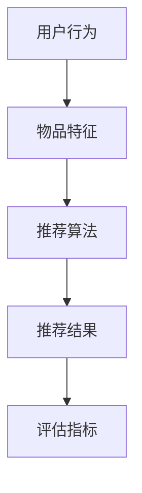

                 

### 文章标题：开发AI Agent的个性化推荐系统

#### 关键词：AI Agent，个性化推荐系统，协同过滤，基于内容推荐，混合推荐算法，系统架构设计，项目实战

#### 摘要：
本文将深入探讨AI Agent个性化推荐系统的开发，从问题背景、核心概念到系统设计、项目实施，提供全面的指导和实战经验。我们将一步一步分析推荐系统的架构与算法，并结合实际案例进行详细讲解，以帮助开发者掌握这一前沿技术。

## 第一部分：引言

### 第1章：推荐系统概述

#### 1.1 问题背景

在当今信息爆炸的时代，用户面临着大量信息过载的问题。如何从海量数据中筛选出用户可能感兴趣的内容，成为了一个重要课题。推荐系统应运而生，它通过收集和分析用户的行为数据，为用户提供个性化的内容推荐。

#### 1.2 问题解决

推荐系统通过以下几种方式解决信息过载问题：

1. **协同过滤**：基于用户的行为和偏好，找到相似的用户和物品，进行推荐。
2. **基于内容的推荐**：根据物品的内容特征，与用户的兴趣进行匹配，生成推荐列表。
3. **混合推荐**：结合协同过滤和基于内容推荐的优势，提供更加精准的推荐结果。

#### 1.3 推荐系统的边界与外延

推荐系统的边界涉及数据收集、用户隐私保护、算法公平性等方面。其外延包括电子商务、社交媒体、新闻推荐等多个领域。

#### 1.4 推荐系统的核心要素组成

推荐系统的核心要素包括：

1. **用户行为数据**：用户的浏览、购买、评价等行为数据。
2. **物品特征数据**：物品的文本、图像、音频等多媒体特征。
3. **推荐算法**：协同过滤、基于内容推荐、混合推荐等算法。
4. **推荐结果评估**：通过准确率、召回率等指标评估推荐效果。

### 第2章：个性化推荐系统基础

#### 2.1 核心概念与联系

个性化推荐系统的核心概念包括用户行为、物品特征、推荐算法等。它们之间的联系如下图所示：

#### 2.2 个性化推荐系统的原理

个性化推荐系统的工作原理可以概括为以下步骤：

1. 数据收集：收集用户行为数据和物品特征数据。
2. 数据预处理：对数据进行清洗、去噪、归一化等处理。
3. 特征提取：从原始数据中提取有用的特征信息。
4. 算法选择：根据场景和需求选择合适的推荐算法。
5. 推荐生成：利用算法生成个性化推荐结果。
6. 评估与优化：通过评估指标对推荐结果进行评估和优化。

#### 2.3 个性化推荐系统的主要特点

个性化推荐系统的主要特点包括：

1. **个性化**：根据用户兴趣和行为特点生成个性化的推荐结果。
2. **实时性**：对用户行为数据进行实时分析，快速生成推荐结果。
3. **多样性**：提供多样化的推荐内容，满足不同用户的需求。

## 第二部分：开发个性化推荐系统

### 第3章：机器学习在个性化推荐中的应用

#### 3.1 机器学习基础

机器学习是推荐系统的重要组成部分。本节将介绍机器学习的基本概念、分类和方法。

#### 3.2 协同过滤算法

协同过滤算法是推荐系统中最常用的算法之一。本节将详细介绍协同过滤算法的原理、分类和优化方法。

#### 3.3 协同过滤算法的改进

为了提高推荐系统的性能，需要对协同过滤算法进行改进。本节将介绍一些常见的改进方法。

### 第4章：基于内容的推荐算法

#### 4.1 内容表示

内容表示是推荐系统的基础。本节将介绍如何对文本、图像、音频等多媒体数据进行表示。

#### 4.2 基于内容的推荐算法原理

基于内容的推荐算法通过物品的内容特征与用户兴趣进行匹配，生成推荐结果。本节将详细介绍基于内容的推荐算法原理。

#### 4.3 基于内容的推荐算法实现

本节将结合Python代码，详细讲解基于内容的推荐算法实现过程。

### 第5章：混合推荐算法

#### 5.1 混合推荐算法概述

混合推荐算法结合了协同过滤和基于内容推荐的优势，提高了推荐系统的性能。本节将介绍混合推荐算法的基本概念和分类。

#### 5.2 混合推荐算法的设计

本节将介绍混合推荐算法的设计原则和实现方法。

#### 5.3 混合推荐算法的应用

本节将结合实际案例，分析混合推荐算法在不同场景中的应用。

## 第三部分：开发个性化推荐系统

### 第6章：系统架构设计

#### 6.1 系统功能设计

本节将介绍个性化推荐系统的功能设计，包括数据收集、数据预处理、推荐算法选择、推荐结果生成等。

#### 6.2 系统架构设计

本节将使用Mermaid绘制系统架构图，详细讲解推荐系统的整体架构。

#### 6.3 系统接口设计

本节将介绍系统接口设计，包括API设计、数据接口设计等。

#### 6.4 系统交互设计

本节将使用Mermaid绘制系统交互图，详细讲解系统各部分的交互流程。

### 第7章：推荐算法实现与优化

#### 7.1 算法实现

本节将结合Python代码，详细讲解推荐算法的实现过程。

#### 7.2 算法优化

本节将介绍推荐算法的优化方法，包括算法参数调优、数据预处理优化等。

#### 7.3 性能评估

本节将介绍推荐系统的性能评估方法，包括准确率、召回率、F1值等指标。

### 第8章：项目实战

#### 8.1 环境安装

本节将介绍项目所需环境的安装过程。

#### 8.2 系统核心实现

本节将介绍系统核心功能的实现过程。

#### 8.3 代码应用解读与分析

本节将结合实际代码，详细解读和分析推荐系统的实现细节。

#### 8.4 实际案例分析与详细讲解

本节将结合实际案例，对推荐系统进行详细分析和讲解。

#### 8.5 项目小结

本节将对项目进行总结，分享项目经验和收获。

### 第9章：最佳实践

#### 9.1 推荐系统的部署

本节将介绍推荐系统的部署过程，包括硬件选择、软件配置等。

#### 9.2 推荐系统的监控与维护

本节将介绍推荐系统的监控与维护方法，包括系统监控、数据监控等。

#### 9.3 推荐系统的数据管理

本节将介绍推荐系统的数据管理方法，包括数据清洗、数据存储等。

### 第10章：小结与展望

#### 10.1 小结

本节将对全文进行总结，回顾核心概念和关键技术。

#### 10.2 注意事项

本节将列出推荐系统开发过程中需要注意的问题。

#### 10.3 拓展阅读

本节将推荐一些相关阅读材料，供读者进一步学习。

## 总结

本文系统地介绍了AI Agent个性化推荐系统的开发，从基础概念到实际应用，全面讲解了推荐系统的设计和实现。希望本文能为开发者提供有益的参考，助力他们在AI领域取得成功。

---

作者：AI天才研究院/AI Genius Institute & 禅与计算机程序设计艺术 /Zen And The Art of Computer Programming

---

**注意**：以上内容是一个大纲结构，具体的内容撰写和代码实现还需要进一步深入和细化。每个章节都需要丰富具体的讲解，确保文章的完整性和深度。在实际撰写过程中，可以结合具体的项目经验和案例，使得文章更具实用价值。文章的字数在10000～12000字之间，确保内容的丰富性和条理性。

