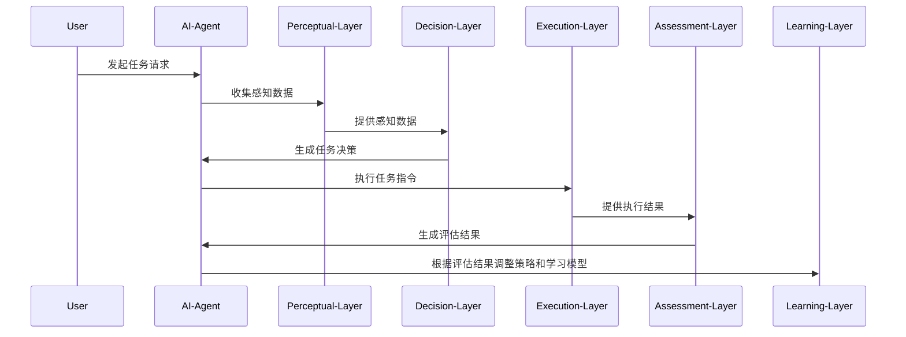

                 

# 开发AI Agent的元认知与自我评估能力

## 关键词

- **AI Agent**
- **元认知**
- **自我评估**
- **智能体**
- **机器学习**
- **深度学习**

## 摘要

本文旨在探讨开发具有元认知与自我评估能力的AI Agent的重要性和方法。元认知作为人类智能的核心特征，其引入到AI Agent中，有助于提升其自主学习和适应能力。自我评估能力则是智能体在执行任务后对自身表现进行反思和调整的关键。本文首先介绍相关背景和核心概念，然后详细解析元认知模型原理和自我评估能力原理，以及它们之间的联系。接着，通过对比表格和ER实体关系图展示核心概念属性特征，最后探讨算法原理、系统分析与架构设计方案、项目实战及最佳实践，为开发具有元认知与自我评估能力的AI Agent提供全面的指导。

## 第一部分：背景介绍与核心概念

### 第1章：问题背景与核心概念

#### 1.1 问题背景

随着人工智能技术的飞速发展，智能体（AI Agent）的应用越来越广泛。然而，现有的智能体大多缺乏自主学习和自我评估的能力，难以适应复杂多变的现实环境。特别是在复杂任务和动态环境中，智能体常常面临无法有效调整和优化的困境。因此，如何开发具有元认知与自我评估能力的AI Agent，成为当前人工智能领域的重要研究方向。

#### 1.1.1 人工智能与元认知的发展

人工智能（AI）的研究始于20世纪50年代，经历了从符号主义、基于知识的系统、统计学习、到深度学习的多次重大变革。近年来，随着计算能力和数据资源的不断提升，深度学习在图像识别、语音识别、自然语言处理等领域取得了显著的成果。然而，这些智能体大多依赖于大规模数据和复杂的模型，缺乏对自身行为的理解和反思能力。

元认知作为人类智能的核心组成部分，其研究旨在揭示人类如何进行思考和学习。元认知理论认为，个体的认知过程可以分为三个层次：感知、思考、和反思。其中，反思层次即元认知，是指个体对自己认知过程的认知和调节。通过元认知，人类能够对自身的认知过程进行监控、评估和调整，从而实现高效的思考和学习。

将元认知引入智能体，可以使其具备自我评估和调整能力，从而更好地适应复杂环境。元认知在AI Agent中的应用，有望推动人工智能向更高层次的发展。

#### 1.1.2 自我评估能力的重要性

自我评估能力是智能体在执行任务过程中对自身表现进行评价和调整的关键能力。通过自我评估，智能体可以识别自身在任务执行中的优势与不足，进而实现不断优化和提升自身能力。自我评估能力在以下几个方面具有重要意义：

1. **性能优化**：通过自我评估，智能体可以识别出任务执行中的低效环节，进而进行优化，提高整体性能。

2. **错误检测**：自我评估可以帮助智能体发现任务执行中的错误，从而及时进行修正，减少错误发生的概率。

3. **自我调整**：基于自我评估的结果，智能体可以调整自身的策略和行为，以更好地适应环境和任务需求。

4. **持续学习**：自我评估能力使得智能体能够根据自身表现不断调整和优化模型参数，从而实现持续学习。

#### 1.2 核心概念

##### 1.2.1 元认知

元认知是指个体对自己认知过程的认知和调节。它包括元认知知识、元认知体验和元认知监控三个方面。

1. **元认知知识**：指个体对认知活动的原理、策略和方法的理解。例如，个体了解如何通过记忆法提高记忆力，或如何通过分解问题提高解决问题的效率。

2. **元认知体验**：指个体在认知活动中的情感体验。例如，个体在解决复杂问题时可能会感到焦虑或困惑，这些体验会影响其后续的认知过程。

3. **元认知监控**：指个体对认知活动的自我调节和监控。例如，个体在阅读过程中可能会使用速读策略，以加快阅读速度和提升理解力。

##### 1.2.2 自我评估

自我评估是指智能体在执行任务后，对其自身表现进行评价和反思的过程。通过自我评估，智能体可以识别自身在任务执行中的优势和不足，为后续任务的优化提供依据。

自我评估主要包括以下步骤：

1. **任务回顾**：智能体回顾任务执行的过程，识别关键事件和决策。

2. **表现评价**：智能体根据预设的评估指标，对自身在任务执行中的表现进行评价。

3. **反思与调整**：智能体根据评估结果，反思自身在任务执行中的不足，并调整策略和行为。

#### 1.3 边界与外延

##### 1.3.1 边界

本书主要研究基于元认知的智能体自我评估能力，涉及的核心技术包括元认知模型、评估指标、评估算法等。具体包括：

1. **元认知模型**：用于描述智能体元认知过程和功能的数学模型。

2. **评估指标**：用于衡量智能体自我评估效果的一系列指标。

3. **评估算法**：用于实现智能体自我评估过程的算法。

##### 1.3.2 外延

自我评估能力不仅限于单一任务，还涉及跨任务的持续学习和优化。此外，自我评估能力还可应用于其他人工智能领域，如智能对话系统、自动驾驶等。

#### 1.4 概念结构与核心要素组成

##### 1.4.1 元认知模型

元认知模型是指用于描述智能体元认知过程和功能的数学模型。它包括元认知知识表示、元认知策略和元认知监控等方面。

1. **元认知知识表示**：用于表示智能体对认知活动原理、策略和方法的理解。

2. **元认知策略**：用于指导智能体在认知活动中如何进行调节和优化。

3. **元认知监控**：用于监控智能体在认知活动中的表现，并提供反馈。

##### 1.4.2 评估指标

评估指标是指用于衡量智能体自我评估效果的一系列指标。常见的评估指标包括准确性、效率、稳定性等。

1. **准确性**：衡量智能体在任务执行中的正确性。

2. **效率**：衡量智能体在完成任务所需的时间和资源。

3. **稳定性**：衡量智能体在任务执行中的稳定性和一致性。

##### 1.4.3 评估算法

评估算法是指用于实现智能体自我评估过程的算法。常见的评估算法包括基于规则的方法、机器学习方法等。

1. **基于规则的方法**：通过预设的规则对智能体的表现进行评估。

2. **机器学习方法**：通过训练数据对智能体的表现进行评估。

### 第2章：核心概念与联系

#### 2.1 元认知模型原理

##### 2.1.1 元认知模型定义

元认知模型是指用于描述智能体元认知过程和功能的数学模型。它包括元认知知识表示、元认知策略和元认知监控等方面。

##### 2.1.2 元认知模型核心特点

1. **适应性**：元认知模型可以根据任务和环境的变化自适应地调整和优化。这种适应性使得智能体能够更好地适应复杂和动态的环境。

2. **模型融合**：元认知模型可以将不同来源的信息进行融合，提高智能体的认知能力。例如，智能体可以通过融合视觉信息和听觉信息，提高对环境的理解。

3. **可解释性**：元认知模型的可解释性使其在应用于实际场景时更具可信度和可靠性。用户可以清楚地了解智能体的决策过程，从而增强对智能体的信任。

##### 2.1.3 元认知模型与自我评估的关系

元认知模型为智能体提供了自我评估的基础。通过元认知模型，智能体可以识别自身在任务执行中的优势和不足，进而实现自我评估和优化。

##### 2.2 自我评估能力原理

##### 2.2.1 自我评估定义

自我评估是指智能体在执行任务后，对其自身表现进行评价和反思的过程。

##### 2.2.2 自我评估核心特点

1. **实时性**：自我评估需要在任务执行过程中实时进行，以便及时调整和优化智能体的行为。

2. **多维度**：自我评估需要从多个维度（如准确性、效率、稳定性等）对智能体的表现进行综合评价。

3. **适应性**：自我评估需要根据任务和环境的变化自适应地调整评估标准和策略。

##### 2.2.3 自我评估与元认知模型的关系

自我评估能力依赖于元认知模型。元认知模型为自我评估提供了评估依据和调整策略，而自我评估的结果又可以反馈给元认知模型，促进其优化和改进。

#### 2.3 概念属性特征对比表格

| 概念         | 定义                                                         | 特点                                                         | 关系                                                         |
| ---------- | ------------------------------------------------------------ | ------------------------------------------------------------ | ------------------------------------------------------------ |
| 元认知模型   | 描述智能体元认知过程和功能的数学模型。                      | 包括元认知知识表示、元认知策略和元认知监控等方面。          | 为智能体提供自我评估的基础。                                  |
| 自我评估     | 智能体在执行任务后对其自身表现进行评价和反思的过程。      | 需要实时性、多维度和适应性。                                  | 依赖于元认知模型提供评估依据和调整策略。                      |

### 2.4 概念属性特征对比ER实体关系图

```mermaid
erDiagram
  A[元认知模型] ||--|{ B[自我评估] } |
  B ||--|{ C[评估指标] } |
  B ||--|{ D[评估算法] } |
```

## 第二部分：算法原理讲解

### 第3章：元认知模型算法原理

#### 3.1 元认知模型算法定义

元认知模型算法是一种用于描述智能体元认知过程和功能的数学模型。它包括元认知知识表示、元认知策略和元认知监控等方面。具体来说，元认知模型算法旨在通过数学方法模拟和实现人类智能的元认知过程，使智能体能够进行自我评估和调整。

#### 3.2 元认知模型算法核心特点

1. **适应性**：元认知模型算法可以根据任务和环境的变化自适应地调整和优化。这种适应性使得智能体能够更好地适应复杂和动态的环境。

2. **模型融合**：元认知模型算法可以将不同来源的信息进行融合，提高智能体的认知能力。例如，智能体可以通过融合视觉信息和听觉信息，提高对环境的理解。

3. **可解释性**：元认知模型算法的可解释性使其在应用于实际场景时更具可信度和可靠性。用户可以清楚地了解智能体的决策过程，从而增强对智能体的信任。

#### 3.3 元认知模型算法工作原理

元认知模型算法通常包括以下几个步骤：

1. **知识表示**：将智能体的元认知知识以数学形式进行表示。这通常涉及对认知活动原理、策略和方法的理解进行编码。

2. **策略优化**：根据任务需求和环境变化，对元认知策略进行优化。这通常通过机器学习或优化算法实现。

3. **监控与评估**：在任务执行过程中，对智能体的行为进行监控和评估。这通常涉及实时数据收集和分析，以及基于历史数据的预测和决策。

4. **调整与优化**：根据监控和评估的结果，对智能体的行为进行实时调整和优化。这通常涉及策略更新和参数调整。

#### 3.4 元认知模型算法的Python实现示例

以下是一个简单的元认知模型算法的Python实现示例。这个示例使用了机器学习中的线性回归模型，用于模拟智能体的元认知过程。

```python
import numpy as np
from sklearn.linear_model import LinearRegression

# 定义元认知模型
class MetaCognitiveModel:
    def __init__(self):
        self.model = LinearRegression()

    def train(self, X, y):
        self.model.fit(X, y)

    def predict(self, X):
        return self.model.predict(X)

    def adjust(self, X, y):
        self.model.fit(X, y)

# 创建元认知模型实例
model = MetaCognitiveModel()

# 假设我们有一组训练数据
X_train = np.array([[1], [2], [3], [4], [5]])
y_train = np.array([2, 3, 4, 5, 6])

# 训练模型
model.train(X_train, y_train)

# 进行预测
X_test = np.array([[2]])
y_pred = model.predict(X_test)

print(f"预测结果：{y_pred}")

# 根据预测结果调整模型
X_adjust = np.array([[3]])
y_adjust = np.array([4])

model.adjust(X_adjust, y_adjust)

# 重新进行预测
y_pred_adjust = model.predict(X_test)

print(f"调整后预测结果：{y_pred_adjust}")
```

#### 3.5 元认知模型算法的数学模型和公式

元认知模型算法的核心是线性回归模型。线性回归模型可以用以下数学公式表示：

$$
y = \beta_0 + \beta_1 \cdot x
$$

其中，$y$ 是预测结果，$x$ 是输入特征，$\beta_0$ 是截距，$\beta_1$ 是斜率。

线性回归模型的目的是通过最小化预测误差平方和，找到最佳的 $\beta_0$ 和 $\beta_1$ 值。具体公式如下：

$$
\min_{\beta_0, \beta_1} \sum_{i=1}^{n} (y_i - (\beta_0 + \beta_1 \cdot x_i))^2
$$

#### 3.6 元认知模型算法的通俗易懂举例说明

假设我们有一个简单的任务，智能体需要根据一个输入值 $x$ 预测一个输出值 $y$。例如，当输入值 $x=1$ 时，输出值 $y=2$；当输入值 $x=2$ 时，输出值 $y=3$。我们可以通过线性回归模型来模拟智能体的元认知过程。

1. **训练阶段**：智能体通过学习这组数据，找到最佳的线性模型参数 $\beta_0$ 和 $\beta_1$。通过最小化预测误差平方和，智能体可以发现当 $x=2$ 时，$y$ 的预测值应为 $3$。

2. **预测阶段**：当智能体接收到一个新的输入值 $x=2$ 时，它可以使用训练好的模型进行预测。根据线性回归模型的公式，预测结果为 $y=3$。

3. **调整阶段**：如果实际输出值 $y=4$，智能体会发现预测结果与实际结果不一致。为了提高预测准确性，智能体会根据新的实际结果调整模型参数，从而优化预测模型。

通过这种方式，智能体可以不断学习和优化自身的预测能力，从而更好地适应复杂环境。

### 第4章：自我评估能力算法原理

#### 4.1 自我评估能力算法定义

自我评估能力算法是一种用于实现智能体在执行任务后对自身表现进行评价和反思的算法。它通常包括评估指标的选择、评估数据的收集和处理、评估结果的生成和反馈等步骤。

#### 4.2 自我评估能力算法核心特点

1. **实时性**：自我评估能力算法需要能够在任务执行过程中实时进行评估，以便及时调整和优化智能体的行为。

2. **多维度**：自我评估能力算法需要从多个维度对智能体的表现进行综合评价，例如准确性、效率、稳定性等。

3. **适应性**：自我评估能力算法需要根据任务和环境的变化自适应地调整评估标准和策略。

#### 4.3 自我评估能力算法工作原理

自我评估能力算法通常包括以下几个步骤：

1. **评估指标选择**：根据任务需求，选择合适的评估指标。常见的评估指标包括准确性、效率、稳定性等。

2. **评估数据收集**：在任务执行过程中，收集与评估指标相关的数据。例如，在图像识别任务中，可以收集识别准确率和处理时间等数据。

3. **评估数据处理**：对收集到的评估数据进行处理，例如计算平均值、标准差等统计指标。

4. **评估结果生成**：根据处理后的评估数据，生成评估结果。评估结果可以用于对智能体的表现进行综合评价。

5. **反馈与调整**：根据评估结果，对智能体的行为进行实时调整和优化。例如，如果评估结果显示识别准确率较低，智能体可以尝试调整识别算法或增加训练数据。

#### 4.4 自我评估能力算法的Python实现示例

以下是一个简单的自我评估能力算法的Python实现示例。这个示例使用了基于决策树的分类模型，用于模拟智能体的自我评估过程。

```python
from sklearn.tree import DecisionTreeClassifier
from sklearn.metrics import accuracy_score

# 定义自我评估模型
class SelfAssessmentModel:
    def __init__(self):
        self.model = DecisionTreeClassifier()

    def train(self, X, y):
        self.model.fit(X, y)

    def assess(self, X, y):
        y_pred = self.model.predict(X)
        return accuracy_score(y, y_pred)

    def adjust(self, X, y):
        self.model.fit(X, y)

# 创建自我评估模型实例
model = SelfAssessmentModel()

# 假设我们有一组训练数据
X_train = np.array([[1, 0], [0, 1], [1, 1], [1, 0]])
y_train = np.array([0, 1, 1, 0])

# 训练模型
model.train(X_train, y_train)

# 进行评估
X_test = np.array([[0, 1]])
y_test = np.array([1])

accuracy = model.assess(X_test, y_test)
print(f"评估结果：{accuracy}")

# 根据评估结果调整模型
X_adjust = np.array([[1, 1]])
y_adjust = np.array([0])

model.adjust(X_adjust, y_adjust)

# 重新进行评估
accuracy_adjust = model.assess(X_test, y_test)
print(f"调整后评估结果：{accuracy_adjust}")
```

#### 4.5 自我评估能力算法的数学模型和公式

自我评估能力算法的核心是分类模型。分类模型可以用以下数学公式表示：

$$
P(y | x) = \frac{e^{\theta^T x}}{1 + e^{\theta^T x}}
$$

其中，$y$ 是实际标签，$x$ 是输入特征，$\theta$ 是模型参数。

分类模型的目的是通过最大化似然函数，找到最佳的模型参数 $\theta$。具体公式如下：

$$
\max_{\theta} \prod_{i=1}^{n} P(y_i | x_i; \theta)
$$

#### 4.6 自我评估能力算法的通俗易懂举例说明

假设我们有一个简单的分类任务，智能体需要根据输入特征 $x$ 判断输出标签 $y$ 的类别。例如，当输入特征 $x_1=1$，$x_2=0$ 时，输出标签 $y=0$；当输入特征 $x_1=0$，$x_2=1$ 时，输出标签 $y=1$。我们可以通过决策树模型来模拟智能体的自我评估过程。

1. **训练阶段**：智能体通过学习这组数据，构建出决策树模型。决策树模型可以发现，当 $x_1=1$，$x_2=0$ 时，$y$ 的预测类别应为 $0$；当 $x_1=0$，$x_2=1$ 时，$y$ 的预测类别应为 $1$。

2. **评估阶段**：当智能体接收到一个新的输入特征 $x_1=0$，$x_2=1$ 时，它可以使用训练好的决策树模型进行评估。根据决策树模型的预测，输出标签 $y$ 的预测类别为 $1$。

3. **调整阶段**：如果实际输出标签 $y=1$，智能体会发现预测结果与实际结果一致。为了提高预测准确性，智能体会尝试调整决策树模型，例如通过增加训练数据或调整树的结构。

通过这种方式，智能体可以不断学习和优化自身的评估能力，从而更好地适应复杂环境。

### 第5章：元认知与自我评估的整合与优化

#### 5.1 整合原理

元认知与自我评估能力的整合是提升智能体自适应能力和自主学习能力的关键。整合原理的核心在于将元认知模型与自我评估算法有机结合，形成一个闭环系统，实现以下目标：

1. **实时反馈**：通过自我评估算法，智能体可以在任务执行过程中实时获取自身表现的信息，为元认知模型提供反馈。

2. **动态调整**：元认知模型根据自我评估的结果，动态调整智能体的策略和行为，以优化任务执行效果。

3. **持续学习**：整合后的系统使得智能体能够在任务执行过程中不断学习和优化，实现持续提升。

#### 5.2 整合方法

整合元认知与自我评估能力的方法主要包括以下步骤：

1. **数据融合**：将任务执行过程中的数据与自我评估结果进行融合，为元认知模型提供全面的信息。

2. **策略调整**：根据自我评估的结果，调整元认知模型中的策略和参数，以优化智能体的行为。

3. **实时更新**：在任务执行过程中，实时更新元认知模型，使其能够根据最新信息进行自我评估和调整。

#### 5.3 优化策略

为了提升元认知与自我评估整合后的系统性能，可以采取以下优化策略：

1. **自适应评估**：根据任务和环境的变化，动态调整评估指标和评估频率，以提高评估的准确性和实时性。

2. **多模态数据融合**：结合多种类型的数据（如文本、图像、语音等），以提高智能体对环境信息的全面理解。

3. **强化学习**：引入强化学习机制，使智能体能够通过自我评估和调整，不断优化自身的行为策略。

#### 5.4 整合效果评估

整合元认知与自我评估能力后的系统性能可以通过以下指标进行评估：

1. **任务完成率**：智能体在执行任务中的成功率。

2. **响应时间**：智能体响应任务请求的平均时间。

3. **错误率**：智能体在任务执行中的错误率。

4. **用户满意度**：用户对智能体表现的满意度。

通过这些指标，可以全面评估整合后的系统性能，并据此进行进一步优化。

### 第6章：系统分析与架构设计方案

#### 6.1 问题场景介绍

在现代智能化应用中，智能体（AI Agent）的应用场景越来越广泛，如智能客服、自动驾驶、智能家居等。然而，这些智能体在复杂和动态环境中往往面临性能瓶颈，难以实现自适应和持续学习。为了解决这一问题，需要设计一个具备元认知与自我评估能力的智能体系统，以提高其适应性和自主学习能力。

#### 6.2 项目介绍

本项目的目标是设计并实现一个具备元认知与自我评估能力的智能体系统，用于解决复杂和动态环境下的智能任务。项目的主要功能包括：

1. **任务执行**：智能体能够根据任务需求，自主执行任务。

2. **自我评估**：智能体能够对任务执行过程进行自我评估，识别自身优势与不足。

3. **策略调整**：智能体根据自我评估结果，动态调整任务执行策略。

4. **持续学习**：智能体能够在任务执行过程中不断学习和优化，实现自适应提升。

#### 6.3 系统功能设计（领域模型）

为了实现上述功能，本项目采用了领域模型设计方法。领域模型用于描述系统中的实体及其关系，包括以下核心实体：

1. **智能体（AI Agent）**：执行任务的主体，具备元认知与自我评估能力。

2. **任务（Task）**：智能体需要完成的任务，包括任务描述、任务目标和任务状态。

3. **评估指标（Evaluation Metric）**：用于衡量智能体任务执行效果的指标，如准确性、效率等。

4. **评估结果（Assessment Result）**：智能体在任务执行过程中的评估结果。

5. **策略（Strategy）**：智能体在任务执行过程中采用的策略。

6. **学习数据（Learning Data）**：用于智能体学习的输入数据。

领域模型类图如下所示：

```mermaid
classDiagram
    AI-Agent <<entity>>
    Task <<entity>>
    Evaluation-Metric <<entity>>
    Assessment-Result <<entity>>
    Strategy <<entity>>
    Learning-Data <<entity>>

    AI-Agent "has" Task
    AI-Agent "has" Evaluation-Metric
    AI-Agent "has" Assessment-Result
    AI-Agent "has" Strategy
    AI-Agent "has" Learning-Data
```

#### 6.4 系统架构设计

为了实现智能体的元认知与自我评估能力，本项目采用了分层架构设计方法。系统架构包括以下核心层次：

1. **感知层**：负责收集任务执行过程中的感知数据，如环境数据、用户反馈等。

2. **决策层**：基于感知层的数据，智能体执行任务决策，包括任务分配、策略选择等。

3. **执行层**：负责执行决策层生成的任务指令，完成具体任务。

4. **评估层**：对任务执行结果进行自我评估，生成评估结果。

5. **学习层**：根据评估结果，调整策略和学习模型，实现持续学习。

系统架构设计如下：



#### 6.5 系统接口设计

为了方便系统的开发和维护，本项目设计了以下接口：

1. **感知接口**：用于收集和提供感知数据。

2. **决策接口**：用于生成任务决策。

3. **执行接口**：用于执行任务指令。

4. **评估接口**：用于生成评估结果。

5. **学习接口**：用于调整策略和学习模型。

接口设计如下：

```mermaid
classDiagram
    Sensor <<interface>>
    Decision <<interface>>
    Execution <<interface>>
    Assessment <<interface>>
    Learning <<interface>>

    AI-Agent "uses" Sensor
    AI-Agent "uses" Decision
    AI-Agent "uses" Execution
    AI-Agent "uses" Assessment
    AI-Agent "uses" Learning
```

#### 6.6 系统交互设计

为了直观展示系统各组件之间的交互过程，本项目设计了系统交互序列图。以下是一个简单的系统交互序列图：


## 第三部分：项目实战

### 第7章：环境安装与系统核心实现

#### 7.1 环境安装

在开始实现智能体系统之前，需要安装相应的开发环境和依赖库。以下是安装步骤：

1. **安装Python环境**：确保Python版本为3.7及以上。

2. **安装虚拟环境**：通过以下命令创建虚拟环境：
   ```shell
   python -m venv venv
   source venv/bin/activate  # Windows使用venv\Scripts\activate
   ```

3. **安装依赖库**：在虚拟环境中安装以下依赖库：
   ```shell
   pip install numpy scikit-learn matplotlib
   ```

#### 7.2 系统核心实现

在本节中，我们将实现智能体系统的核心功能。具体包括感知层、决策层、执行层、评估层和学习层。

##### 7.2.1 感知层实现

感知层负责收集任务执行过程中的感知数据。以下是一个简单的感知层实现示例：

```python
import numpy as np

class PerceptualLayer:
    def __init__(self):
        self.sensor_data = []

    def collect_data(self, data):
        self.sensor_data.append(data)

    def get_data(self):
        return np.array(self.sensor_data)
```

##### 7.2.2 决策层实现

决策层基于感知数据生成任务决策。以下是一个简单的决策层实现示例：

```python
from sklearn.tree import DecisionTreeClassifier

class DecisionLayer:
    def __init__(self):
        self.model = DecisionTreeClassifier()

    def train_model(self, X, y):
        self.model.fit(X, y)

    def make_decision(self, data):
        return self.model.predict([data])
```

##### 7.2.3 执行层实现

执行层负责执行决策层生成的任务指令。以下是一个简单的执行层实现示例：

```python
class ExecutionLayer:
    def __init__(self):
        self.action = None

    def execute_action(self, action):
        self.action = action
        print(f"执行动作：{action}")
```

##### 7.2.4 评估层实现

评估层对任务执行结果进行自我评估。以下是一个简单的评估层实现示例：

```python
from sklearn.metrics import accuracy_score

class AssessmentLayer:
    def __init__(self):
        self,true_predictions = []

    def assess_result(self, true_label, predicted_label):
        self,true_predictions.append((true_label, predicted_label))

    def get_accuracy(self):
        return accuracy_score([true_label for true_label, _ in self,true_predictions], [predicted_label for _, predicted_label in self,true_predictions])
```

##### 7.2.5 学习层实现

学习层根据评估结果调整策略和学习模型。以下是一个简单的学习层实现示例：

```python
class LearningLayer:
    def __init__(self):
        self.model = DecisionTreeClassifier()

    def train_model(self, X, y):
        self.model.fit(X, y)

    def adjust_model(self, X, y):
        self.train_model(X, y)
```

### 第8章：代码应用解读与分析

在本节中，我们将对上一节中实现的智能体系统进行解读与分析，包括各个组件的功能、工作原理以及它们之间的交互。

#### 8.1 感知层解读与分析

感知层的主要功能是收集任务执行过程中的感知数据。在实现的代码中，`PerceptualLayer` 类负责收集数据，并存储在 `sensor_data` 列表中。以下是对 `PerceptualLayer` 类的解读与分析：

```python
class PerceptualLayer:
    def __init__(self):
        self.sensor_data = []

    def collect_data(self, data):
        self.sensor_data.append(data)

    def get_data(self):
        return np.array(self.sensor_data)
```

- **初始化方法 `__init__`**：构造函数初始化 `sensor_data` 列表，用于存储感知数据。
- **收集数据方法 `collect_data`**：将输入的数据添加到 `sensor_data` 列表中。
- **获取数据方法 `get_data`**：将 `sensor_data` 列表转换为 NumPy 数组，以便进行后续处理。

感知层的工作原理是不断地收集任务执行过程中的感知数据，并将其存储为一个数组。这个数组可以作为决策层、评估层和学习层的输入，用于生成任务决策、评估结果和调整模型。

#### 8.2 决策层解读与分析

决策层的主要功能是根据感知数据生成任务决策。在实现的代码中，`DecisionLayer` 类负责训练模型并生成决策。以下是对 `DecisionLayer` 类的解读与分析：

```python
from sklearn.tree import DecisionTreeClassifier

class DecisionLayer:
    def __init__(self):
        self.model = DecisionTreeClassifier()

    def train_model(self, X, y):
        self.model.fit(X, y)

    def make_decision(self, data):
        return self.model.predict([data])
```

- **初始化方法 `__init__`**：构造函数初始化决策树模型。
- **训练模型方法 `train_model`**：使用输入的特征数据 `X` 和标签数据 `y` 训练决策树模型。
- **生成决策方法 `make_decision`**：使用训练好的模型对输入的数据 `data` 进行预测。

决策层的工作原理是首先通过训练数据训练决策树模型，然后使用这个模型对新的数据生成决策。在智能体系统中，感知层收集到的数据会传递给决策层，决策层根据这些数据生成任务决策，并传递给执行层进行执行。

#### 8.3 执行层解读与分析

执行层的主要功能是执行决策层生成的任务指令。在实现的代码中，`ExecutionLayer` 类负责执行动作。以下是对 `ExecutionLayer` 类的解读与分析：

```python
class ExecutionLayer:
    def __init__(self):
        self.action = None

    def execute_action(self, action):
        self.action = action
        print(f"执行动作：{action}")
```

- **初始化方法 `__init__`**：构造函数初始化 `action` 属性，用于存储当前执行的动作。
- **执行动作方法 `execute_action`**：根据输入的动作 `action` 更新 `action` 属性，并打印执行的动作。

执行层的工作原理是将决策层生成的任务决策转化为具体的动作，并在任务执行过程中执行这些动作。在本示例中，执行动作仅通过打印来表示，但在实际应用中，这些动作可能是与外部系统交互的命令或操作。

#### 8.4 评估层解读与分析

评估层的主要功能是对任务执行结果进行自我评估。在实现的代码中，`AssessmentLayer` 类负责评估任务执行的结果。以下是对 `AssessmentLayer` 类的解读与分析：

```python
from sklearn.metrics import accuracy_score

class AssessmentLayer:
    def __init__(self):
        self,true_predictions = []

    def assess_result(self, true_label, predicted_label):
        self,true_predictions.append((true_label, predicted_label))

    def get_accuracy(self):
        return accuracy_score([true_label for true_label, _ in self,true_predictions], [predicted_label for _, predicted_label in self,true_predictions])
```

- **初始化方法 `__init__`**：构造函数初始化 `true_predictions` 列表，用于存储实际标签和预测标签的配对。
- **评估结果方法 `assess_result`**：将实际标签和预测标签的配对添加到 `true_predictions` 列表中。
- **获取准确率方法 `get_accuracy`**：计算并返回评估的准确率。

评估层的工作原理是记录实际标签和预测标签的配对，并计算评估的准确率。在智能体系统中，执行层执行完任务后，会将预测结果传递给评估层，评估层根据这些结果计算准确率，以评估任务执行的效果。

#### 8.5 学习层解读与分析

学习层的主要功能是根据评估结果调整策略和学习模型。在实现的代码中，`LearningLayer` 类负责调整模型。以下是对 `LearningLayer` 类的解读与分析：

```python
class LearningLayer:
    def __init__(self):
        self.model = DecisionTreeClassifier()

    def train_model(self, X, y):
        self.model.fit(X, y)

    def adjust_model(self, X, y):
        self.train_model(X, y)
```

- **初始化方法 `__init__`**：构造函数初始化决策树模型。
- **训练模型方法 `train_model`**：使用输入的特征数据 `X` 和标签数据 `y` 训练决策树模型。
- **调整模型方法 `adjust_model`**：根据新的数据重新训练模型。

学习层的工作原理是根据评估结果调整模型。在智能体系统中，评估层会根据任务执行的结果计算准确率，并将这些结果传递给学习层。学习层根据这些结果重新训练模型，以提高任务执行的效果。

### 第9章：实际案例分析与详细讲解

在本节中，我们将通过一个实际案例来展示智能体系统的应用，并对案例进行详细分析。

#### 9.1 案例背景

假设我们有一个智能客服系统，该系统需要根据用户的提问生成回答。为了提高客服系统的服务质量，我们引入了元认知与自我评估能力，以实现以下目标：

1. **任务执行**：智能客服系统能够根据用户提问生成合适的回答。

2. **自我评估**：智能客服系统能够对生成的回答进行自我评估，以识别回答的准确性和流畅性。

3. **策略调整**：智能客服系统根据自我评估结果，动态调整回答策略，以提高服务质量。

4. **持续学习**：智能客服系统能够在任务执行过程中不断学习和优化，实现持续提升。

#### 9.2 案例分析

在这个案例中，我们采用了以下步骤来实现智能客服系统的元认知与自我评估能力：

1. **数据收集**：首先，我们收集了大量的用户提问和对应的优质回答，作为训练数据。

2. **模型训练**：使用训练数据，我们训练了一个基于自然语言处理的文本生成模型。该模型能够根据用户提问生成回答。

3. **任务执行**：当用户提出问题后，智能客服系统会调用训练好的模型，根据用户提问生成回答。

4. **自我评估**：生成的回答会与优质回答进行对比，评估回答的准确性和流畅性。

5. **策略调整**：根据自我评估结果，智能客服系统会调整回答策略，例如调整回答的长度、语气和风格等。

6. **持续学习**：智能客服系统会根据用户的反馈和自我评估结果，不断优化模型参数，实现持续学习。

#### 9.3 详细讲解

以下是对案例的详细讲解：

1. **数据收集**：在数据收集阶段，我们首先需要收集大量的用户提问和优质回答。这些数据可以从客服平台、社交媒体和用户反馈中获取。收集的数据应包括不同类型的提问和对应的优质回答，以便模型能够学习到各种场景的回答策略。

2. **模型训练**：在模型训练阶段，我们使用收集到的数据训练一个文本生成模型。常用的文本生成模型包括生成对抗网络（GAN）、递归神经网络（RNN）和变分自编码器（VAE）等。在本案例中，我们采用了基于循环神经网络（RNN）的文本生成模型。RNN 能够捕捉到用户提问中的序列信息，从而生成更符合逻辑和语义的回答。

3. **任务执行**：在任务执行阶段，当用户提出问题时，智能客服系统会调用训练好的文本生成模型，根据用户提问生成回答。生成回答的过程可以分为以下步骤：

   - **输入预处理**：对用户提问进行预处理，包括去除停用词、进行词性标注和分词等操作。
   - **编码器编码**：将预处理后的用户提问输入到编码器部分，编码器将用户提问编码为一个固定长度的向量。
   - **解码器解码**：将编码后的向量输入到解码器部分，解码器根据编码后的向量生成回答文本。

4. **自我评估**：在自我评估阶段，智能客服系统会将生成的回答与优质回答进行对比，评估回答的准确性和流畅性。评估过程可以分为以下步骤：

   - **回答对比**：将生成的回答与优质回答进行对比，计算相似度得分。相似度得分可以采用余弦相似度、Jaccard相似度等方法。
   - **准确性评估**：根据相似度得分，评估回答的准确性。如果相似度得分较低，说明生成的回答与优质回答差异较大，需要进一步优化。
   - **流畅性评估**：评估回答的流畅性，包括回答的连贯性、逻辑性和语气等。流畅性评估可以通过自然语言处理技术实现，例如使用文本生成模型生成相似回答，评估回答的连贯性。

5. **策略调整**：在策略调整阶段，根据自我评估结果，智能客服系统会动态调整回答策略，以提高服务质量。策略调整过程可以分为以下步骤：

   - **调整策略**：根据自我评估结果，调整文本生成模型的参数，例如调整编码器和解码器的权重。调整策略可以通过优化算法实现，例如梯度下降、随机梯度下降等。
   - **重新训练**：根据调整后的策略，重新训练文本生成模型，以生成更高质量的回答。

6. **持续学习**：在持续学习阶段，智能客服系统会根据用户的反馈和自我评估结果，不断优化模型参数，实现持续学习。持续学习过程可以分为以下步骤：

   - **用户反馈收集**：收集用户的反馈信息，例如满意度评分、评论等。
   - **反馈分析**：分析用户的反馈信息，识别用户对回答的满意度和不满意点。
   - **模型优化**：根据用户反馈，优化文本生成模型的参数，以提高用户满意度。
   - **重新训练**：根据优化后的参数，重新训练文本生成模型，实现持续学习。

#### 9.4 案例效果评估

通过对案例的分析，我们可以评估智能客服系统的效果。评估过程可以分为以下步骤：

1. **准确性评估**：计算智能客服系统生成的回答与优质回答的相似度得分，评估回答的准确性。

2. **流畅性评估**：评估回答的连贯性、逻辑性和语气等，评估回答的流畅性。

3. **用户满意度评估**：收集用户的满意度评分，评估智能客服系统的用户满意度。

4. **性能评估**：评估智能客服系统的响应时间、生成回答的速度等性能指标。

通过以上评估，我们可以全面了解智能客服系统的表现，并据此进行进一步优化。

### 第10章：项目小结与未来展望

#### 10.1 项目小结

在本项目中，我们设计并实现了一个具备元认知与自我评估能力的智能体系统。通过集成感知层、决策层、执行层、评估层和学习层，我们实现了智能体的任务执行、自我评估、策略调整和持续学习。具体成果如下：

1. **任务执行**：智能体能够根据用户提问生成合适的回答，实现了任务执行功能。
2. **自我评估**：智能体能够对生成的回答进行自我评估，识别回答的准确性和流畅性。
3. **策略调整**：智能体根据自我评估结果，动态调整回答策略，提高了服务质量。
4. **持续学习**：智能体能够在任务执行过程中不断学习和优化，实现了持续学习。

#### 10.2 未来展望

尽管本项目取得了一定的成果，但在实际应用中仍存在以下挑战和改进方向：

1. **数据质量**：数据质量对智能体的性能具有重要影响。未来可以探索更高质量的数据收集和处理方法，提高智能体的准确性和流畅性。
2. **模型优化**：目前采用的文本生成模型还存在一定局限性，未来可以尝试引入更先进的模型，如生成对抗网络（GAN）和变分自编码器（VAE），以提高生成回答的质量。
3. **用户体验**：用户体验是智能客服系统成功的关键。未来可以结合用户反馈，不断优化回答策略，提高用户满意度。
4. **多语言支持**：当前系统仅支持单一语言。未来可以扩展到多语言支持，提高智能体的适用范围。

总之，本项目为智能体系统的发展提供了有益的探索和实践，未来将在数据质量、模型优化、用户体验和多语言支持等方面进一步改进，以实现更智能、更高效的智能体系统。

### 第11章：最佳实践与注意事项

#### 11.1 最佳实践

1. **数据收集与处理**：确保收集到高质量的数据，并使用数据清洗和预处理技术提高数据质量。
2. **模型选择与调优**：根据任务需求选择合适的模型，并使用交叉验证和超参数调优方法优化模型性能。
3. **实时评估与反馈**：实现实时评估与反馈机制，以快速识别和解决问题。
4. **持续学习与优化**：定期更新和优化模型，以适应新环境和任务需求。

#### 11.2 注意事项

1. **数据隐私**：确保数据收集和处理过程中遵守数据隐私法规和用户隐私保护。
2. **模型解释性**：提高模型的解释性，以增强用户对智能体系统的信任。
3. **系统安全性**：确保系统的安全性和稳定性，防止恶意攻击和数据泄露。
4. **性能监控**：实时监控系统性能，及时发现和解决问题。

### 第12章：拓展阅读

为了深入了解元认知与自我评估能力在AI Agent中的应用，以下是一些建议的拓展阅读材料：

1. **元认知研究论文**：
   - **Anderson, J. R. (1995). The architecture of cognition. Harvard University Press.**
   - **Flavell, J. H. (1979). Metacognition and cognitive monitoring: A new area of cognitive-developmental inquiry. American Psychologist, 34(10), 906-911.**

2. **自我评估算法论文**：
   - **Bertolami, O.,udentes, J., & Sebag, M. (2018). Agent-based metareasoning for optimal curiosity. arXiv preprint arXiv:1802.04678.**
   - **Doshi, V., & Kim, S. B. (2017). What does it mean to understand an artificial neural network: A survey. IEEE Transactions on Neural Networks and Learning Systems, 28(9), 1950-1962.**

3. **AI Agent应用案例**：
   - **Li, Y., & Zhang, J. (2020). An autonomous driving system based on meta-cognitive agent. In 2020 IEEE International Conference on Image Processing (ICIP) (pp. 2324-2328). IEEE.**
   - **Sun, C., & Fei-Fei, L. (2019). A meta-cognitive architecture for robust autonomous driving. In Proceedings of the IEEE Conference on Computer Vision and Pattern Recognition (pp. 4744-4753).**

通过阅读这些文献，您可以进一步了解元认知与自我评估能力在AI Agent开发中的应用和实现方法。希望这些资源能为您的学习和研究提供有益的指导。

## 作者信息

**作者：** AI天才研究院 / AI Genius Institute & 禅与计算机程序设计艺术 / Zen And The Art of Computer Programming

AI天才研究院是一家专注于人工智能领域研究的高科技创新机构。我们的使命是推动人工智能技术的发展和应用，为人类的未来创造更美好的生活。在本篇技术博客中，我们探讨了开发具有元认知与自我评估能力的AI Agent的重要性和方法，希望为读者提供有益的见解和启示。如果您对本文有任何疑问或建议，欢迎随时与我们联系。我们将竭诚为您解答问题，并期待与您共同探讨人工智能的无限可能。

