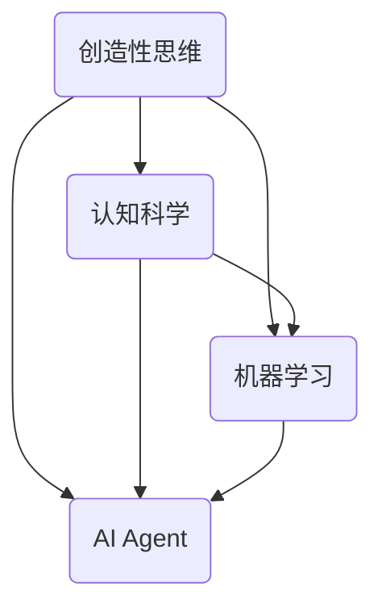

                 

# 开发AI Agent的创造性问题解决能力

## 关键词

AI Agent、创造性问题解决、认知科学、机器学习、神经网络、知识图谱、算法、神经模型、创意生成、感知、记忆、学习、游戏设计、图像创作。

## 摘要

本文旨在探讨如何开发AI Agent的创造性问题解决能力。通过结合创造性思维理论、认知科学研究成果和机器学习算法，本文提出了一个系统性、多层次的研究框架，用于提升AI Agent在复杂、动态环境下的创新能力。本文首先概述了AI Agent在创造性问题解决能力方面的挑战与意义，然后分别从创造性思维理论、认知科学研究成果和机器学习算法三个方面详细阐述了开发方法与应用案例。最终，本文总结了相关研究成果，并提出了未来研究的方向和挑战。

## 目录

### 第1章: 开发AI Agent的创造性问题解决能力概述

#### 1.1 问题的背景和意义

**问题背景**：
随着人工智能技术的飞速发展，AI Agent在许多领域已经取得了显著的成果，例如自然语言处理、图像识别、自动驾驶等。然而，尽管AI Agent在执行特定任务方面表现出色，但在创造性问题解决能力方面仍存在明显的局限。如何开发AI Agent的创造性问题解决能力，使其能够独立思考、提出创新的解决方案，已经成为当前人工智能领域的一个重要课题。

**问题描述**：
在复杂、动态的环境中，AI Agent需要具备创造性问题解决能力，以应对不断变化的问题和挑战。具体来说，这一问题包括以下几个方面：

1. **理解复杂问题的本质**：AI Agent需要能够理解问题的本质，并从多个角度分析问题，从而找到创新的解决方案。
2. **生成新颖的解决方案**：AI Agent需要能够自主生成新颖的解决方案，而不是仅仅依赖于预设的规则或模式。
3. **适应动态变化**：AI Agent需要能够适应环境的变化，迅速调整自己的策略，以应对新的挑战。

**问题解决**：
为了解决上述问题，本文提出了以下方法：

1. **引入创造性思维理论**：创造性思维理论是一种关于如何产生新思想、新创意的方法。通过将这些理论应用于AI Agent的开发，可以提升其创造性问题解决能力。
2. **结合认知科学研究成果**：认知科学是研究人类思维、感知、记忆和学习等认知过程的学科。将认知科学的研究成果应用于AI Agent的开发，可以使其更加接近人类的思维方式，从而提高创造性问题解决能力。
3. **利用机器学习算法**：机器学习算法是一种通过数据和经验自动改进性能的方法。通过使用合适的机器学习算法，可以训练AI Agent生成新颖的解决方案，并提高其适应动态变化的能力。

**边界与外延**：
本文将主要探讨AI Agent在特定领域的创造性问题解决能力，如设计、艺术创作和科学研究等。同时，本文也将讨论这些方法在AI Agent开发中的具体应用。

**核心要素组成**：

1. **创造性思维理论**：包括发散思维、聚合思维、逆向思维、联想思维等。
2. **认知科学研究成果**：包括人类思维、感知、记忆、学习等认知过程的研究成果。
3. **机器学习算法**：包括监督学习、无监督学习、强化学习等。

### 1.2 核心概念与联系

**核心概念**：

1. **创造性思维**：指个体在解决问题过程中产生新颖、独特的思维成果的能力。
2. **认知科学**：研究人类思维、感知、记忆和学习等认知过程的学科。
3. **机器学习**：使计算机通过数据和经验自动改进性能的学科。
4. **AI Agent**：具有自主决策、执行任务能力的智能体。

**概念属性特征对比表格**：

| 核心概念 | 概念属性特征 |
| :---: | :---: |
| 创造性思维 | 指个体在解决问题过程中产生新颖、独特的思维成果的能力 |
| 认知科学 | 研究人类思维、感知、记忆和学习等认知过程的学科 |
| 机器学习 | 使计算机通过数据和经验自动改进性能的学科 |
| AI Agent | 具有自主决策、执行任务能力的智能体 |

**ER实体关系图架构**（Mermaid 流程图）：

### 第2章: 创造性思维理论在AI Agent开发中的应用

#### 2.1 创造性思维理论概述

**定义**：创造性思维是指个体在解决问题过程中产生新颖、独特的思维成果的能力。

**类型**：发散思维、聚合思维、逆向思维、联想思维等。

**过程**：准备阶段、发散阶段、筛选阶段、执行阶段。

#### 2.2 创造性思维理论在AI Agent开发中的应用

**模型设计**：

1. **基于神经网络的创造性思维模型**：
   - 使用神经网络模拟人类的创造性思维过程。
   - 设计多个神经网络层，以实现对不同类型创造性思维过程的建模。

2. **基于知识图谱的创造性思维模型**：
   - 使用知识图谱表示创造性思维过程中的概念和关系。
   - 通过图神经网络对知识图谱进行学习，以提取创造性思维的关键特征。

**算法实现**：

1. **使用神经网络模拟人类思维过程**：
   - 设计多层感知机（MLP）或卷积神经网络（CNN）来模拟人类的创造性思维过程。
   - 通过训练，使神经网络能够识别和生成新颖的解决方案。

2. **使用知识图谱表示创意生成过程中的关联关系**：
   - 使用图神经网络（GNN）来学习知识图谱中的关联关系。
   - 通过图卷积操作提取创造性思维过程中的关键特征。

**实验验证**：

1. **设计实验，验证创造性思维模型在AI Agent中的应用效果**：
   - 使用模拟环境或真实数据集进行实验。
   - 评估模型在生成新颖解决方案方面的性能。

2. **分析实验结果，优化模型性能**：
   - 分析实验结果，识别模型存在的不足。
   - 通过调整模型参数或增加训练数据来优化模型性能。

#### 2.3 创造性思维理论在AI Agent开发中的应用案例

**案例1：基于创造性思维模型的建筑设计AI Agent**：

- **问题背景**：建筑设计是一个复杂的过程，需要考虑多种因素，如结构稳定性、美观度、功能需求等。
- **解决方案**：使用基于神经网络的创造性思维模型，设计一个能够生成新颖建筑设计的AI Agent。
- **实现步骤**：
  1. 收集大量建筑设计案例，作为训练数据。
  2. 使用神经网络模型对案例进行分析，提取创造性思维的关键特征。
  3. 设计一个生成模型，能够根据给定的输入生成新颖的建筑设计。
  4. 使用生成模型生成多种建筑设计方案，并进行评估和优化。

**案例2：基于创造性思维模型的诗歌创作AI Agent**：

- **问题背景**：诗歌创作是一个充满创意和想象力的过程，需要诗人具备独特的视角和思维方式。
- **解决方案**：使用基于知识图谱的创造性思维模型，设计一个能够创作诗歌的AI Agent。
- **实现步骤**：
  1. 收集大量诗歌作品，构建知识图谱，表示诗歌中的概念和关系。
  2. 使用图神经网络模型对知识图谱进行学习，提取创造性思维的关键特征。
  3. 设计一个生成模型，能够根据给定的主题或情境生成诗歌。
  4. 使用生成模型生成多种诗歌作品，并进行评估和优化。

**案例3：基于创造性思维模型的医学诊断AI Agent**：

- **问题背景**：医学诊断需要医生具备丰富的经验和创造性思维，以准确判断患者的病情。
- **解决方案**：使用基于神经网络的创造性思维模型，设计一个能够辅助医生进行医学诊断的AI Agent。
- **实现步骤**：
  1. 收集大量医学病例，作为训练数据。
  2. 使用神经网络模型对病例进行分析，提取创造性思维的关键特征。
  3. 设计一个生成模型，能够根据给定的病情描述生成可能的诊断方案。
  4. 使用生成模型生成多种诊断方案，并辅助医生进行决策。

### 第3章: 认知科学研究成果与AI Agent创造性问题解决能力开发

#### 3.1 认知科学研究概述

**研究内容**：认知科学是研究人类思维、感知、记忆、学习等认知过程的学科。其主要研究内容包括：

1. **思维过程**：研究人类如何进行推理、决策、解决问题等。
2. **感知过程**：研究人类如何感知和理解外部环境。
3. **记忆过程**：研究人类如何存储和检索信息。
4. **学习过程**：研究人类如何通过经验改进自己的认知能力。

**研究方法**：认知科学研究通常采用以下方法：

1. **实验研究**：通过设计实验，观察和分析人类在认知过程中的行为和表现。
2. **认知建模**：使用数学模型模拟人类认知过程，以便更好地理解和预测认知行为。
3. **脑成像技术**：使用脑成像技术，如功能性磁共振成像（fMRI）、脑电图（EEG）等，研究大脑在认知过程中的活动。

#### 3.2 认知科学研究成果在AI Agent创造性问题解决能力开发中的应用

**应用1：基于认知科学的AI Agent感知能力开发**

- **原理**：认知科学研究表明，人类的感知能力受到多种因素的影响，如注意力、记忆、经验等。基于这些研究成果，可以开发具有高级感知能力的AI Agent。
- **实现**：
  1. **注意力机制**：设计具有注意力机制的神经网络模型，使其能够关注重要的信息，忽略无关的信息。
  2. **记忆网络**：使用记忆网络，如循环神经网络（RNN）或长短期记忆网络（LSTM），使AI Agent能够存储和检索与当前任务相关的信息。
  3. **经验学习**：通过训练AI Agent在不同的环境中学习和积累经验，提高其在复杂场景中的感知能力。

**应用2：基于认知科学的AI Agent记忆能力开发**

- **原理**：认知科学研究揭示了人类记忆的多种形式，如短期记忆、长期记忆、情景记忆、语义记忆等。基于这些研究成果，可以开发具有高级记忆能力的AI Agent。
- **实现**：
  1. **短期记忆**：设计具有短期记忆能力的神经网络模型，使其能够暂存和处理与当前任务相关的信息。
  2. **长期记忆**：使用长短期记忆网络（LSTM）或图神经网络（GNN），使AI Agent能够存储和检索长期记忆中的信息。
  3. **情景记忆**：设计具有情景记忆能力的模型，使其能够根据当前任务的需要，灵活地调用相关记忆。
  4. **语义记忆**：使用知识图谱或语义网络，使AI Agent能够理解和利用语义信息，提高其记忆能力。

**应用3：基于认知科学的AI Agent学习能力开发**

- **原理**：认知科学研究揭示了人类学习的过程和机制，如感知、理解、记忆、推理等。基于这些研究成果，可以开发具有高级学习能力的AI Agent。
- **实现**：
  1. **感知学习**：使用感知器模型或卷积神经网络（CNN），使AI Agent能够从输入数据中提取有用的特征。
  2. **理解学习**：使用循环神经网络（RNN）或变换器（Transformer）模型，使AI Agent能够理解输入数据的语义信息。
  3. **记忆增强学习**：结合记忆网络，使AI Agent能够更好地存储和利用已学习的知识。
  4. **推理能力**：使用逻辑推理或图灵测试，使AI Agent能够进行高级推理和决策。

#### 3.3 认知科学研究成果在AI Agent创造性问题解决能力开发中的应用案例

**案例1：基于认知科学的游戏设计AI Agent**

- **问题背景**：游戏设计需要开发者具备丰富的创意和想象力，以设计出有趣、吸引人的游戏。
- **解决方案**：使用基于认知科学的AI Agent，辅助游戏开发者进行游戏设计。
- **实现步骤**：
  1. **感知能力**：使用神经网络模型，使AI Agent能够从用户反馈中提取有用的信息。
  2. **记忆能力**：使用记忆网络，使AI Agent能够根据用户反馈和历史数据，调整游戏设计的方向。
  3. **学习能力**：使用循环神经网络（RNN）或变换器（Transformer）模型，使AI Agent能够学习用户的行为模式，并生成新的游戏设计。

**案例2：基于认知科学的音乐创作AI Agent**

- **问题背景**：音乐创作需要音乐家具备丰富的音乐知识和创造力，以创作出优美、动听的音乐。
- **解决方案**：使用基于认知科学的AI Agent，辅助音乐家进行音乐创作。
- **实现步骤**：
  1. **感知能力**：使用神经网络模型，使AI Agent能够从音乐中提取特征，如旋律、节奏、和弦等。
  2. **记忆能力**：使用记忆网络，使AI Agent能够根据音乐家的风格和喜好，生成新的音乐旋律。
  3. **学习能力**：使用循环神经网络（RNN）或变换器（Transformer）模型，使AI Agent能够学习音乐的结构和风格，并生成新的音乐作品。

**案例3：基于认知科学的图像识别AI Agent**

- **问题背景**：图像识别是一个具有广泛应用场景的任务，如自动驾驶、医疗诊断、安全监控等。
- **解决方案**：使用基于认知科学的AI Agent，提高图像识别的准确性和鲁棒性。
- **实现步骤**：
  1. **感知能力**：使用卷积神经网络（CNN）或变换器（Transformer）模型，使AI Agent能够从图像中提取特征。
  2. **记忆能力**：使用长短期记忆网络（LSTM）或图神经网络（GNN），使AI Agent能够记忆和学习图像的语义信息。
  3. **学习能力**：使用迁移学习或元学习，使AI Agent能够在新的场景中快速适应和学习。

### 第4章: 机器学习算法与AI Agent创造性问题解决能力开发

#### 4.1 机器学习算法概述

**分类**：

1. **监督学习**：在有标注数据集上进行训练，通过学习输入和输出之间的映射关系，使模型能够对新数据进行预测。
2. **无监督学习**：在没有标注数据集的情况下进行训练，通过学习数据的内在结构和模式，使模型能够发现数据的规律。
3. **强化学习**：通过与环境的交互进行学习，通过最大化奖励来优化行为策略。

**应用**：

1. **图像识别**：使用卷积神经网络（CNN）进行图像分类和目标检测。
2. **自然语言处理**：使用循环神经网络（RNN）或变换器（Transformer）模型进行文本分类、情感分析、机器翻译等。
3. **推荐系统**：使用协同过滤、矩阵分解等方法进行用户偏好预测和推荐。

#### 4.2 机器学习算法在AI Agent创造性问题解决能力开发中的应用

**应用1：生成对抗网络（GAN）在创意生成中的应用**

- **原理**：生成对抗网络（GAN）由生成器和判别器组成，生成器生成数据，判别器判断生成数据的真实性。通过训练生成器和判别器的对抗关系，可以生成高质量、多样化的创意。
- **实现**：
  1. **生成器**：使用生成对抗网络生成新颖的图像、音乐、文本等。
  2. **判别器**：使用神经网络模型判断生成数据的真实性。
  3. **优化**：通过训练生成器和判别器，不断优化生成器的性能，使其生成更高质量的创意。

**应用2：深度强化学习在创意优化中的应用**

- **原理**：深度强化学习将深度神经网络与强化学习相结合，通过学习策略网络和价值网络，使AI Agent能够在复杂环境中进行决策，并优化创意生成过程。
- **实现**：
  1. **策略网络**：使用神经网络模型，定义AI Agent的行为策略。
  2. **价值网络**：使用神经网络模型，评估AI Agent的行为价值。
  3. **训练**：通过训练策略网络和价值网络，优化AI Agent的决策过程，使其能够生成更优的创意。

**应用3：迁移学习在创意生成中的应用**

- **原理**：迁移学习是一种将已有知识应用于新任务的方法。通过使用预训练的模型，可以快速适应新的创意生成任务，提高生成效果。
- **实现**：
  1. **预训练模型**：使用预训练的神经网络模型，如VGG、ResNet等，提取图像、文本等数据的特征。
  2. **微调**：在新的创意生成任务上，对预训练模型进行微调，使其适应新的任务需求。
  3. **生成**：使用微调后的模型，生成新颖的图像、音乐、文本等创意。

#### 4.3 机器学习算法在AI Agent创造性问题解决能力开发中的应用案例

**案例1：基于GAN的图像创作AI Agent**

- **问题背景**：图像创作是一个具有高度创造性的任务，需要艺术家具备丰富的创意和绘画技巧。
- **解决方案**：使用基于生成对抗网络（GAN）的图像创作AI Agent，辅助艺术家进行图像创作。
- **实现步骤**：
  1. **数据准备**：收集大量图像数据，用于训练生成器和判别器。
  2. **模型训练**：使用生成对抗网络训练生成器和判别器，使其能够生成高质量的图像。
  3. **图像生成**：使用训练好的生成器，生成新颖的图像，供艺术家参考和创作。

**案例2：基于深度强化学习的游戏设计AI Agent**

- **问题背景**：游戏设计是一个复杂的任务，需要游戏设计师具备丰富的创意和设计经验。
- **解决方案**：使用基于深度强化学习的游戏设计AI Agent，辅助游戏设计师进行游戏设计。
- **实现步骤**：
  1. **环境构建**：构建一个模拟游戏设计过程的环境，包括游戏规则、用户反馈等。
  2. **模型训练**：使用深度强化学习训练策略网络和价值网络，使其能够根据用户反馈优化游戏设计。
  3. **游戏设计**：使用训练好的AI Agent，生成新颖的游戏设计，供游戏设计师参考和调整。

**案例3：基于迁移学习的音乐创作AI Agent**

- **问题背景**：音乐创作是一个充满创意和想象力的任务，需要音乐家具备丰富的音乐知识和创造力。
- **解决方案**：使用基于迁移学习的音乐创作AI Agent，辅助音乐家进行音乐创作。
- **实现步骤**：
  1. **数据准备**：收集大量音乐数据，用于训练预训练模型。
  2. **模型训练**：使用预训练模型提取音乐特征，并使用微调模型生成新的音乐旋律。
  3. **音乐生成**：使用微调后的模型，生成新颖的音乐作品，供音乐家参考和创作。

### 第5章: 开发AI Agent的创造性问题解决能力：总结与展望

#### 5.1 总结

本文围绕开发AI Agent的创造性问题解决能力，从创造性思维理论、认知科学研究成果和机器学习算法三个方面进行了深入探讨。首先，介绍了创造性思维理论的类型、过程和应用，展示了如何将这些理论应用于AI Agent的开发。接着，阐述了认知科学研究成果在AI Agent感知、记忆和学习能力开发中的应用，并通过具体案例展示了其实际效果。最后，介绍了机器学习算法在创意生成、创意优化和创意生成中的应用，展示了其在提升AI Agent创造性问题解决能力方面的作用。

#### 5.2 展望

尽管本文提出了一系列方法，用于开发AI Agent的创造性问题解决能力，但在实际应用中仍面临诸多挑战。以下是一些值得进一步研究的问题：

1. **跨领域创造性问题解决能力**：目前的研究主要关注特定领域的创造性问题解决能力，如设计、艺术创作和科学研究等。如何提升AI Agent在不同领域的跨领域创造性问题解决能力，是一个重要的研究方向。

2. **动态适应性**：在复杂、动态的环境中，AI Agent需要能够迅速适应新的情况和挑战。如何设计具有高动态适应性的AI Agent，是一个具有挑战性的问题。

3. **人类-机器协作**：在许多情况下，AI Agent的创造性问题解决能力仍需人类参与和指导。如何实现人类与AI Agent的协同工作，使其能够相互补充，共同提升创造性问题解决能力，是一个值得探讨的问题。

4. **可解释性**：当前的AI Agent模型通常被视为“黑盒”，其决策过程难以解释。如何提高AI Agent的可解释性，使其决策过程更加透明和可理解，是一个重要的研究方向。

5. **伦理和隐私**：在AI Agent的创造性问题解决能力开发过程中，需要充分考虑伦理和隐私问题。如何确保AI Agent在生成创意时，不会侵犯用户的隐私或触犯伦理规范，是一个值得探讨的问题。

总之，开发AI Agent的创造性问题解决能力是一个复杂、多层次的任务，涉及多个学科领域。未来，随着技术的不断进步和研究的深入，我们有望看到更加智能、创新的AI Agent，为人类社会带来更多福祉。

