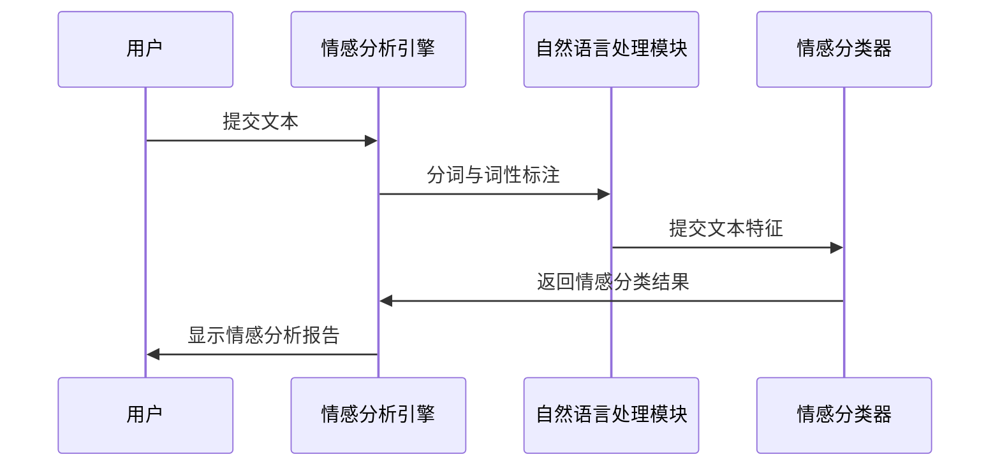
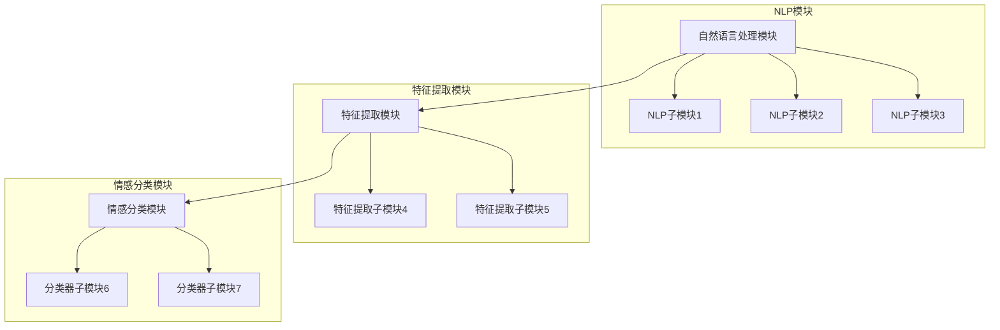
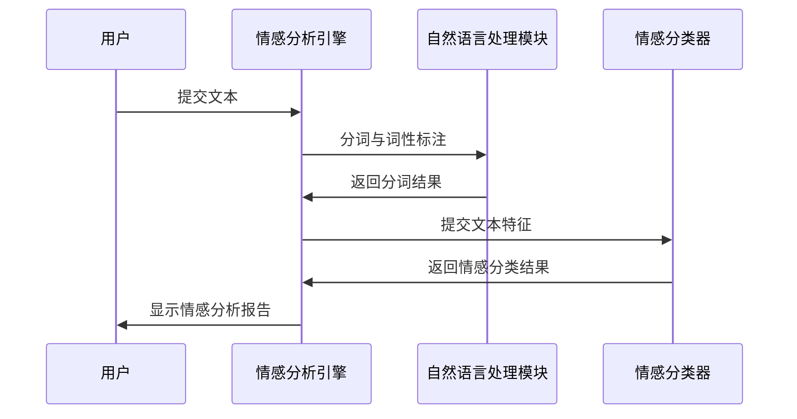
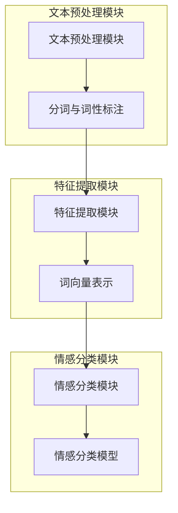
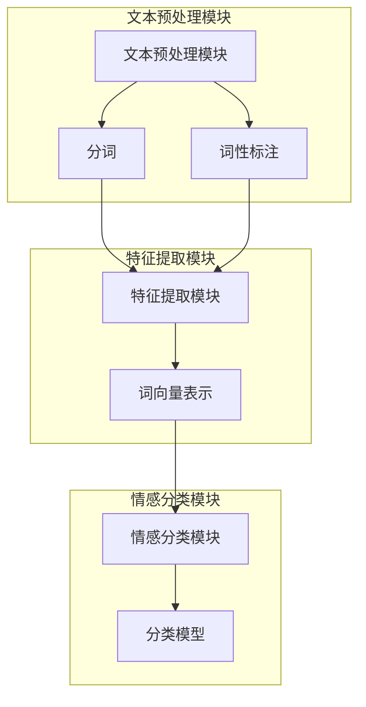
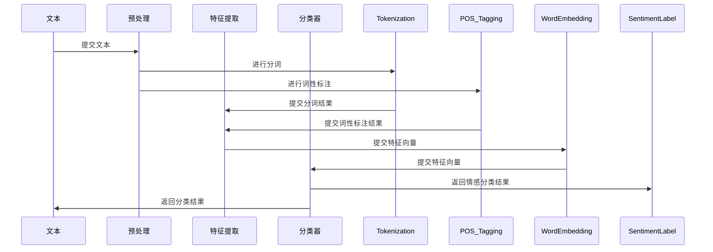

                 


### 第一部分：AI Agent与多语言情感分析概述

#### 1.1 AI Agent的定义与作用

**背景介绍：**

AI Agent，即人工智能代理，是指能够自主执行任务、与环境交互并适应环境变化的计算机程序。随着人工智能技术的快速发展，AI Agent在各个领域得到了广泛应用，例如智能客服、智能推荐、自动驾驶等。

**问题背景：**

AI Agent在处理人类语言时，经常需要对用户输入的情感进行理解和分析，以便做出合适的回应。这就引出了多语言情感分析的问题，即如何在多种语言环境下对文本进行情感分析。

**问题描述：**

如何设计一个AI Agent，使其能够在多语言环境中进行高效、准确的情感分析？

**问题解决：**

通过结合自然语言处理（NLP）技术和深度学习算法，可以开发出具备多语言情感分析能力的AI Agent。下面我们将详细介绍这一过程。

**边界与外延：**

AI Agent不仅局限于文本情感分析，还可以扩展到语音、图像等多模态情感分析。同时，多语言情感分析也不仅仅限于文本情感分析，还可以应用于社交媒体监测、市场调研等领域。

**概念结构与核心要素组成：**

AI Agent的核心要素包括：

1. **感知模块**：负责接收和处理外部信息，如文本、语音、图像等。
2. **决策模块**：根据感知模块提供的信息，进行推理和决策。
3. **动作模块**：根据决策模块的输出，执行相应的动作。

多语言情感分析的核心要素包括：

1. **语言模型**：用于将文本转换为机器可处理的表示。
2. **情感词典**：用于存储各种情感词及其对应的情感极性。
3. **情感分类器**：用于对文本进行情感分类。

#### 1.2 情感分析的基本概念

**核心概念与联系：**

情感分析是一种文本挖掘技术，旨在识别文本中的主观信息，并对其进行分类。情感分析可以分为两个层次：情感分类和情感极性分析。

- **情感分类**：将文本分类为正面、负面或中性情感。
- **情感极性分析**：对文本中的情感倾向进行量化，通常使用正负极性值表示。

**概念属性特征对比表格：**

| 概念        | 定义                                       | 特征               |
| ----------- | ------------------------------------------ | ----------------- |
| 情感分类    | 对文本进行情感分类                         | 分类准确率        |
| 情感极性分析 | 对文本中的情感倾向进行量化               | 极性值范围        |
| 语言模型    | 将文本转换为机器可处理的表示               | 词向量、语法结构  |
| 情感词典    | 存储各种情感词及其对应的情感极性         | 情感词、极性标签  |
| 情感分类器  | 用于对文本进行情感分类的机器学习模型     | 分类算法、训练数据 |

**ER实体关系图架构的Mermaid流程图：**

```mermaid
erDiagram
  A[文本数据] ||--|{B[情感分类器]}
  A ||--|{C[情感词典]}
  A ||--|{D[语言模型]}
  B ||--|{E[分类结果]}
  C ||--|{E}
  D ||--|{E}
```

**算法原理讲解：**

情感分析的基本流程包括以下几个步骤：

1. **文本预处理**：对文本进行分词、去停用词、词性标注等预处理操作。
2. **特征提取**：将预处理后的文本转换为机器可处理的表示，如词袋模型、词嵌入等。
3. **情感分类**：使用机器学习算法（如朴素贝叶斯、支持向量机、深度神经网络等）对文本进行情感分类。
4. **情感极性分析**：对分类结果进行量化，通常使用极性值表示。

以下是情感分类的Python伪代码示例：

```python
# 导入相关库
from sklearn.feature_extraction.text import TfidfVectorizer
from sklearn.naive_bayes import MultinomialNB
from sklearn.pipeline import make_pipeline

# 准备数据
texts = ["I love this product!", "This is a bad movie.", "I am so happy today."]
labels = ["positive", "negative", "positive"]

# 构建模型
model = make_pipeline(TfidfVectorizer(), MultinomialNB())

# 训练模型
model.fit(texts, labels)

# 进行情感分类
predictions = model.predict(["I hate this product."])

# 输出结果
print(predictions)
```

#### 1.3 多语言情感分析的特殊性

**需求：**

随着全球化的发展，多语言情感分析变得越来越重要。例如，在跨国企业中，了解不同国家和地区的消费者情绪对于市场策略的制定至关重要。

**挑战：**

1. **语言多样性**：不同语言之间的词汇、语法和语义差异较大，给情感分析带来了挑战。
2. **数据稀缺**：许多语言缺乏足够的情感分析数据集，影响模型的训练效果。
3. **跨语言迁移**：如何在一种语言上训练的模型有效地应用于其他语言，需要解决跨语言迁移问题。

**发展趋势：**

1. **跨语言词典构建**：通过翻译和映射，构建跨语言的情感词典。
2. **多语言数据集**：收集和整理多语言情感分析数据集，为模型训练提供基础。
3. **多语言深度学习模型**：利用多语言数据训练深度学习模型，提高跨语言情感分析的性能。

#### 1.4 本书结构安排与目标读者

**结构安排：**

本书分为三部分，分别介绍AI Agent与多语言情感分析概述、多语言情感分析引擎基础、以及多语言情感分析引擎开发实践。

**目标读者：**

本书旨在为从事人工智能和自然语言处理领域的研究者、开发者提供全面、系统的多语言情感分析技术知识。同时，也适合对AI Agent和情感分析感兴趣的学生和从业者阅读。

**学习建议与预期收获：**

1. **学习建议**：建议读者按照章节顺序逐步阅读，结合实际项目进行实践，加深对理论知识的理解。
2. **预期收获**：通过学习本书，读者将能够掌握多语言情感分析的基本原理、算法和技术，具备开发AI Agent多语言情感分析引擎的能力。

#### 1.5 本章小结

本章介绍了AI Agent与多语言情感分析的基本概念、背景、问题和解决方法。通过了解AI Agent的定义与作用，以及情感分析的基本原理，读者可以更好地理解多语言情感分析的特殊性和重要性。本章的内容为后续章节的讨论奠定了基础。

## 第一部分总结

在本部分，我们首先介绍了AI Agent的定义与作用，探讨了情感分析的基本概念及其在多语言环境中的特殊性。通过本章的学习，读者可以了解多语言情感分析的重要性和挑战，以及本书的结构安排和目标读者。接下来的部分将深入探讨多语言情感分析引擎的基础理论和开发实践，帮助读者全面掌握这一领域的关键技术。

### 第一部分：AI Agent与多语言情感分析概述

#### 1.1 AI Agent的定义与作用

**背景介绍：**

AI Agent，即人工智能代理，是指能够自主执行任务、与环境交互并适应环境变化的计算机程序。AI Agent的出现，标志着人工智能从被动响应向主动行动的转变。随着人工智能技术的快速发展，AI Agent在各个领域得到了广泛应用，例如智能客服、智能推荐、自动驾驶等。

**问题背景：**

在处理人类语言时，AI Agent需要具备理解用户情感的能力，以便更好地与用户互动。因此，多语言情感分析成为AI Agent的一项核心功能。然而，多语言情感分析面临着语言多样性、数据稀缺和跨语言迁移等挑战。

**问题描述：**

如何设计一个具备多语言情感分析能力的AI Agent，使其能够准确地识别和理解不同语言环境中的情感？

**问题解决：**

通过结合自然语言处理（NLP）技术和深度学习算法，可以开发出具备多语言情感分析能力的AI Agent。在本文中，我们将详细介绍这一过程，包括多语言情感分析的基本概念、算法原理、数据集和开发环境等。

**边界与外延：**

AI Agent不仅局限于文本情感分析，还可以扩展到语音、图像等多模态情感分析。同时，多语言情感分析也不仅仅限于文本情感分析，还可以应用于社交媒体监测、市场调研等领域。

**概念结构与核心要素组成：**

AI Agent的核心要素包括：

1. **感知模块**：负责接收和处理外部信息，如文本、语音、图像等。
2. **决策模块**：根据感知模块提供的信息，进行推理和决策。
3. **动作模块**：根据决策模块的输出，执行相应的动作。

多语言情感分析的核心要素包括：

1. **语言模型**：用于将文本转换为机器可处理的表示。
2. **情感词典**：用于存储各种情感词及其对应的情感极性。
3. **情感分类器**：用于对文本进行情感分类的机器学习模型。

#### 1.2 情感分析的基本概念

**核心概念与联系：**

情感分析是一种文本挖掘技术，旨在识别文本中的主观信息，并对其进行分类。情感分析可以分为两个层次：情感分类和情感极性分析。

- **情感分类**：将文本分类为正面、负面或中性情感。
- **情感极性分析**：对文本中的情感倾向进行量化，通常使用正负极性值表示。

**概念属性特征对比表格：**

| 概念        | 定义                                       | 特征               |
| ----------- | ------------------------------------------ | ----------------- |
| 情感分类    | 对文本进行情感分类                         | 分类准确率        |
| 情感极性分析 | 对文本中的情感倾向进行量化               | 极性值范围        |
| 语言模型    | 将文本转换为机器可处理的表示               | 词向量、语法结构  |
| 情感词典    | 存储各种情感词及其对应的情感极性         | 情感词、极性标签  |
| 情感分类器  | 用于对文本进行情感分类的机器学习模型     | 分类算法、训练数据 |

**ER实体关系图架构的Mermaid流程图：**

```mermaid
erDiagram
  A[文本数据] ||--|{B[情感分类器]}
  A ||--|{C[情感词典]}
  A ||--|{D[语言模型]}
  B ||--|{E[分类结果]}
  C ||--|{E}
  D ||--|{E}
```

**算法原理讲解：**

情感分析的基本流程包括以下几个步骤：

1. **文本预处理**：对文本进行分词、去停用词、词性标注等预处理操作。
2. **特征提取**：将预处理后的文本转换为机器可处理的表示，如词袋模型、词嵌入等。
3. **情感分类**：使用机器学习算法（如朴素贝叶斯、支持向量机、深度神经网络等）对文本进行情感分类。
4. **情感极性分析**：对分类结果进行量化，通常使用极性值表示。

以下是情感分类的Python伪代码示例：

```python
# 导入相关库
from sklearn.feature_extraction.text import TfidfVectorizer
from sklearn.naive_bayes import MultinomialNB
from sklearn.pipeline import make_pipeline

# 准备数据
texts = ["I love this product!", "This is a bad movie.", "I am so happy today."]
labels = ["positive", "negative", "positive"]

# 构建模型
model = make_pipeline(TfidfVectorizer(), MultinomialNB())

# 训练模型
model.fit(texts, labels)

# 进行情感分类
predictions = model.predict(["I hate this product."])

# 输出结果
print(predictions)
```

#### 1.3 多语言情感分析的特殊性

**需求：**

随着全球化的发展，多语言情感分析变得越来越重要。例如，在跨国企业中，了解不同国家和地区的消费者情绪对于市场策略的制定至关重要。同时，社交媒体的普及也使得多语言情感分析在舆情监测、危机管理等领域具有广泛应用。

**挑战：**

1. **语言多样性**：不同语言之间的词汇、语法和语义差异较大，给情感分析带来了挑战。例如，中文和英文在词汇和语法结构上存在较大差异，导致模型在处理不同语言文本时的表现不一致。
2. **数据稀缺**：许多语言缺乏足够的情感分析数据集，影响模型的训练效果。特别是在低资源语言中，数据稀缺的问题尤为突出。
3. **跨语言迁移**：如何在一种语言上训练的模型有效地应用于其他语言，需要解决跨语言迁移问题。这涉及到跨语言词典构建、多语言数据集的收集和整理等技术。

**发展趋势：**

1. **跨语言词典构建**：通过翻译和映射，构建跨语言的情感词典。这有助于缓解低资源语言中的数据稀缺问题。
2. **多语言数据集**：收集和整理多语言情感分析数据集，为模型训练提供基础。例如，多语种情感极性数据集、多语种社交媒体数据集等。
3. **多语言深度学习模型**：利用多语言数据训练深度学习模型，提高跨语言情感分析的性能。例如，通过多语言双向编码器（MBE）和多语言图神经网络（MLGN）等模型，实现跨语言情感分析。

#### 1.4 本书结构安排与目标读者

**结构安排：**

本书分为三部分，分别介绍AI Agent与多语言情感分析概述、多语言情感分析引擎基础、以及多语言情感分析引擎开发实践。

**目标读者：**

本书旨在为从事人工智能和自然语言处理领域的研究者、开发者提供全面、系统的多语言情感分析技术知识。同时，也适合对AI Agent和情感分析感兴趣的学生和从业者阅读。

**学习建议与预期收获：**

1. **学习建议**：建议读者按照章节顺序逐步阅读，结合实际项目进行实践，加深对理论知识的理解。
2. **预期收获**：通过学习本书，读者将能够掌握多语言情感分析的基本原理、算法和技术，具备开发AI Agent多语言情感分析引擎的能力。

#### 1.5 本章小结

本章介绍了AI Agent与多语言情感分析的基本概念、背景、问题和解决方法。通过了解AI Agent的定义与作用，以及情感分析的基本原理，读者可以更好地理解多语言情感分析的特殊性和重要性。本章的内容为后续章节的讨论奠定了基础。

## 第一部分总结

在本部分，我们首先介绍了AI Agent的定义与作用，探讨了情感分析的基本概念及其在多语言环境中的特殊性。通过本章的学习，读者可以了解多语言情感分析的重要性和挑战，以及本书的结构安排和目标读者。接下来的部分将深入探讨多语言情感分析引擎的基础理论和开发实践，帮助读者全面掌握这一领域的关键技术。

### 第一部分总结

在本部分的讨论中，我们系统地介绍了AI Agent与多语言情感分析的核心概念，包括AI Agent的定义、作用和基本结构，以及多语言情感分析的需求、挑战和发展趋势。通过梳理这些基本概念，我们明确了多语言情感分析在人工智能领域中的重要地位和面临的难题。

首先，AI Agent作为一种具有自主性和自适应性的计算机程序，它在智能客服、自动驾驶等众多应用场景中发挥了关键作用。AI Agent的核心要素包括感知模块、决策模块和动作模块，这些模块共同构成了一个能够与环境交互并执行任务的智能系统。而在AI Agent处理人类语言时，多语言情感分析成为不可或缺的一环。

接下来，我们详细阐述了情感分析的基本概念，包括情感分类和情感极性分析。情感分类旨在将文本分为正面、负面或中性情感，而情感极性分析则是对文本中的情感倾向进行量化。通过对比情感分类和情感极性分析的概念属性特征，我们更清晰地了解了两者在多语言情感分析中的重要性。

为了更好地理解和实现多语言情感分析，我们借助Mermaid流程图展示了文本数据、情感分类器、情感词典和语言模型之间的实体关系。这一ER图不仅帮助我们理清了多语言情感分析的核心要素，也为后续章节的技术讲解提供了直观的参考。

在算法原理讲解部分，我们介绍了情感分析的基本流程，包括文本预处理、特征提取、情感分类和情感极性分析。通过Python伪代码示例，我们展示了如何使用TF-IDF和朴素贝叶斯算法进行情感分类，从而加深了读者对情感分析算法实现过程的理解。

此外，我们讨论了多语言情感分析的特殊性，包括语言多样性、数据稀缺和跨语言迁移等挑战。为了应对这些挑战，我们探讨了跨语言词典构建、多语言数据集收集和利用多语言深度学习模型等解决方案。这些讨论为后续章节的技术实现提供了理论支持。

最后，我们介绍了本书的结构安排和目标读者，明确了本书的三个部分：AI Agent与多语言情感分析概述、多语言情感分析引擎基础、以及多语言情感分析引擎开发实践。通过这样的结构安排，我们旨在为读者提供一套全面、系统的多语言情感分析技术知识，帮助他们掌握开发AI Agent多语言情感分析引擎的技能。

通过本部分的深入学习，读者应该对AI Agent与多语言情感分析有了全面的认识，为后续章节的深入研究奠定了坚实的基础。接下来，我们将进一步探讨多语言情感分析引擎的基础理论和开发实践，继续完善我们的技术知识体系。让我们继续前行，一起揭开多语言情感分析技术的神秘面纱。 

### 第二部分：多语言情感分析引擎基础

#### 2.1 自然语言处理基础

**核心概念与联系：**

自然语言处理（NLP）是人工智能的一个重要分支，旨在使计算机理解和生成人类语言。在多语言情感分析引擎中，NLP技术是实现文本预处理、特征提取和情感分类的关键。NLP的核心概念包括语言模型、词向量表示、分词与词性标注等。

- **语言模型**：用于对文本进行概率建模，常见的语言模型有N元语法、神经网络语言模型等。
- **词向量表示**：将单词映射为高维向量，用于表示文本的语义信息。常见的词向量表示方法有Word2Vec、GloVe等。
- **分词与词性标注**：分词是将文本切分成单词的过程，词性标注是对单词进行词性分类的过程。常用的分词算法有基于规则的方法、基于统计的方法和基于深度学习的方法。

**概念属性特征对比表格：**

| 概念        | 定义                                       | 特征               |
| ----------- | ------------------------------------------ | ----------------- |
| 语言模型    | 对文本进行概率建模                         | 模型复杂度、训练数据量  |
| 词向量表示  | 将单词映射为高维向量                       | 向量维度、训练方法    |
| 分词        | 将文本切分成单词的过程                     | 切分精度、速度      |
| 词性标注    | 对单词进行词性分类的过程                   | 标注准确率、一致性  |

**ER实体关系图架构的Mermaid流程图：**

```mermaid
erDiagram
  A[文本] ||--|{B[分词]}
  A ||--|{C[词性标注]}
  A ||--|{D[语言模型]}
  A ||--|{E[词向量表示]}
  B ||--|{F[单词]}
  C ||--|{F}
  D ||--|{G[概率分布]}
  E ||--|{G}
```

**算法原理讲解：**

1. **语言模型**：

语言模型用于对文本进行概率建模，常见的语言模型有N元语法和神经网络语言模型。

- **N元语法**：基于马尔可夫假设，认为当前词的概率仅与前面N-1个词相关。N元语法的数学模型如下：

  $$ P(w_n|w_{n-1}, w_{n-2}, \ldots, w_1) = \frac{C(w_{n-1}, w_n)}{C(w_{n-1})} \cdot \frac{C(w_{n-2}, w_{n-1})}{C(w_{n-2})} \cdot \ldots \cdot \frac{C(w_1, w_2)}{C(w_1)} $$

  其中，$C(w_i, w_j)$ 表示词对 $(w_i, w_j)$ 的共现次数，$C(w_i)$ 表示词 $w_i$ 的总次数。

- **神经网络语言模型**：基于深度学习，可以更好地捕捉文本的复杂结构和语义信息。常见的神经网络语言模型有循环神经网络（RNN）、长短时记忆网络（LSTM）和门控循环单元（GRU）。

  例如，LSTM的数学模型如下：

  $$ h_t = \sigma(W_f \odot [h_{t-1}, x_t] + b_f) \odot (1 - h_t) \odot [h_{t-1}, x_t] + b_i $$
  $$ i_t = \sigma(W_f \odot [h_{t-1}, x_t] + b_f) \odot (1 - i_t) \odot [h_{t-1}, x_t] + b_i $$
  $$ f_t = \sigma(W_f \odot [h_{t-1}, x_t] + b_f) \odot [h_{t-1}, x_t] + b_f $$
  $$ o_t = \sigma(W_f \odot [h_{t-1}, x_t] + b_f) \odot (1 - o_t) \odot [h_{t-1}, x_t] + b_f $$
  $$ c_t = f_t \odot c_{t-1} + i_t \odot \sigma(W_g \odot [h_{t-1}, x_t] + b_g) $$
  $$ h_t = o_t \odot \sigma(W_o \odot [c_t] + b_o) $$

  其中，$h_t$ 表示隐藏状态，$c_t$ 表示细胞状态，$x_t$ 表示输入词向量，$W_f, W_g, W_o$ 分别表示输入、更新、输出权重矩阵，$b_f, b_g, b_o$ 分别表示输入、更新、输出偏置，$\sigma$ 表示激活函数（如sigmoid函数）。

2. **词向量表示**：

词向量表示是将单词映射为高维向量的过程，用于表示文本的语义信息。常见的词向量表示方法有Word2Vec、GloVe等。

- **Word2Vec**：基于神经网络的词向量表示方法，通过训练单词的上下文向量来学习词向量。Word2Vec有两种训练模型：连续词袋（CBOW）和Skip-Gram。

  - **CBOW**：预测中心词周围的上下文词。数学模型如下：

    $$ P(w|c) = \frac{exp(\langle v_c, v_w \rangle)}{\sum_{w' \in V} exp(\langle v_c, v_{w'} \rangle)} $$

    其中，$v_c$ 表示中心词的向量，$v_w$ 表示上下文词的向量，$V$ 表示词汇表。

  - **Skip-Gram**：预测单词的上下文词。数学模型如下：

    $$ P(w|c) = \frac{exp(\langle v_w, v_c \rangle)}{\sum_{w' \in V} exp(\langle v_w, v_{w'} \rangle)} $$

- **GloVe**：基于全局向量空间模型（GloVe）的词向量表示方法，通过训练单词的全局共现矩阵来学习词向量。GloVe的数学模型如下：

    $$ f(w, c) = \frac{log(f_{ij})}{\sqrt{f_{ii} \cdot f_{jj}}} $$

    其中，$f_{ij}$ 表示词对 $(w_i, w_j)$ 的共现频率，$f(w, c)$ 表示词对 $(w, c)$ 的共现频率。

3. **分词与词性标注**：

分词是将文本切分成单词的过程，词性标注是对单词进行词性分类的过程。常用的分词算法有基于规则的方法、基于统计的方法和基于深度学习的方法。

- **基于规则的方法**：根据预先定义的规则进行分词，如正则表达式分词、词典匹配分词等。这种方法具有较高的切分精度，但规则复杂度较高，难以处理未登录词。
- **基于统计的方法**：通过训练数据学习分词模型，如基于隐马尔可夫模型（HMM）的分词方法、基于条件随机场（CRF）的分词方法等。这种方法具有较强的泛化能力，但训练数据量较大。
- **基于深度学习的方法**：使用深度学习模型进行分词和词性标注，如基于卷积神经网络（CNN）的分词方法、基于长短期记忆网络（LSTM）的分词方法等。这种方法在处理未登录词和复杂结构文本方面具有较好的性能。

**系统分析与架构设计方案：**

在多语言情感分析引擎中，NLP技术是实现文本预处理、特征提取和情感分类的基础。以下是一个简单的系统架构设计方案：

1. **文本预处理**：使用基于深度学习的方法进行分词和词性标注，如基于LSTM的分词方法。分词结果将用于后续的特征提取和情感分类。
2. **特征提取**：使用词向量表示方法（如GloVe）将分词结果转换为高维向量表示，用于表示文本的语义信息。特征提取的结果将作为情感分类器的输入。
3. **情感分类**：使用基于深度学习的方法（如CNN或LSTM）进行情感分类，将文本向量映射为情感类别。情感分类的结果将用于生成情感分析报告。

以下是多语言情感分析引擎的系统架构图：



**项目介绍：**

本项目旨在开发一个多语言情感分析引擎，实现文本预处理、特征提取和情感分类的功能。项目的主要目标包括：

1. 使用基于深度学习的方法进行分词和词性标注，提高分词精度和词性标注准确率。
2. 使用词向量表示方法（如GloVe）将分词结果转换为高维向量表示，提高特征提取的效果。
3. 使用基于深度学习的方法（如CNN或LSTM）进行情感分类，提高情感分类的准确率和泛化能力。

**系统功能设计（领域模型Mermaid类图）：**

```mermaid
classDiagram
  User <<Actor>>
  Engine <<Class>> {
    - input_text: String
    - output_result: String
  }
  NLP <<Class>> {
    - tokenize: Function
    - pos_tag: Function
  }
  Classifier <<Class>> {
    - classify: Function
  }
  User <- Engine: 提交文本
  Engine <- NLP: 分词与词性标注
  Engine <- Classifier: 提交文本特征
  Classifier -> Engine: 返回情感分类结果
```

**系统架构设计（Mermaid架构图）：**



**系统接口设计和系统交互（Mermaid序列图）：**



#### 2.2 情感分析算法原理

**核心概念与联系：**

情感分析算法是实现多语言情感分析引擎的核心。情感分析算法根据文本的语义特征和情感倾向，对文本进行分类和极性分析。常见的情感分析算法包括基于规则的方法、基于机器学习的方法和基于深度学习的方法。

- **基于规则的方法**：通过定义一系列规则，对文本进行情感分类。这种方法具有解释性强、易于实现等优点，但规则复杂度较高，难以处理复杂的语义关系。
- **基于机器学习的方法**：使用训练数据学习情感分类模型，常见的机器学习算法有朴素贝叶斯、支持向量机、随机森林等。这种方法具有较高的准确率和泛化能力，但需要大量的训练数据。
- **基于深度学习的方法**：使用深度学习模型，如卷积神经网络（CNN）、循环神经网络（RNN）、长短时记忆网络（LSTM）等，对文本进行情感分类。这种方法能够更好地捕捉文本的复杂结构和语义信息，但计算复杂度较高。

**概念属性特征对比表格：**

| 算法         | 基本原理                                       | 特点               |
| ------------ | ------------------------------------------ | ----------------- |
| 基于规则的方法 | 定义一系列规则，对文本进行情感分类             | 解释性强、易于实现  |
| 朴素贝叶斯   | 基于贝叶斯定理，计算文本属于各类别的概率       | 简单、高效         |
| 支持向量机   | 寻找最优超平面，将文本分类到不同类别           | 精确、鲁棒         |
| 随机森林     | 构建多棵决策树，通过投票决定文本的分类结果     | 准确、泛化能力强   |
| 卷积神经网络 | 使用卷积层捕捉文本的局部特征，通过全连接层分类 | 强大、灵活         |
| 循环神经网络 | 使用循环结构捕捉文本的序列信息，通过全连接层分类 | 序列建模能力强     |
| 长短时记忆网络 | 使用门控机制缓解循环神经网络的长短时依赖问题   | 序列建模能力强     |

**ER实体关系图架构的Mermaid流程图：**

```mermaid
erDiagram
  A[文本数据] ||--|{B[情感分类模型]}
  A ||--|{C[训练数据]}
  B ||--|{D[分类结果]}
  C ||--|{D}
```

**算法原理讲解：**

1. **基于规则的方法**：

基于规则的方法通过定义一系列规则，对文本进行情感分类。常见的规则方法包括基于关键词匹配、基于语法结构分析和基于情感词典等方法。

- **基于关键词匹配**：通过匹配文本中的关键词，判断文本的情感极性。这种方法简单直观，但难以处理复杂的语义关系。

  例如，可以使用以下规则进行情感分类：

  - 如果文本中包含“喜欢”、“好”、“满意”等正面词汇，则分类为正面情感。
  - 如果文本中包含“不喜欢”、“坏”、“不满意”等负面词汇，则分类为负面情感。

- **基于语法结构分析**：通过分析文本的语法结构，判断文本的情感极性。这种方法能够更好地捕捉文本的语义信息，但需要复杂的语法规则。

  例如，可以使用以下语法规则进行情感分类：

  - 如果文本中的主语是积极词汇，谓语是积极词汇，则分类为正面情感。
  - 如果文本中的主语是消极词汇，谓语是消极词汇，则分类为负面情感。

2. **基于机器学习的方法**：

基于机器学习的方法通过训练数据学习情感分类模型。常见的机器学习算法包括朴素贝叶斯、支持向量机和随机森林等。

- **朴素贝叶斯**：基于贝叶斯定理，计算文本属于各类别的概率。朴素贝叶斯算法假设特征之间相互独立，通过计算特征条件概率进行分类。

  例如，使用朴素贝叶斯算法进行情感分类的步骤如下：

  - 准备训练数据集，将文本分为正面和负面两类。
  - 计算各类别的先验概率，即正面类别的概率和负面类别的概率。
  - 对于每个类别，计算特征的条件概率，即每个特征在各类别下的概率。
  - 计算每个类别的后验概率，即文本属于各类别的概率。
  - 选择后验概率最大的类别作为最终分类结果。

  朴素贝叶斯算法的数学模型如下：

  $$ P(y|X) = \frac{P(X|y)P(y)}{P(X)} $$
  $$ P(X|y) = \prod_{i=1}^{n} P(x_i|y) $$
  $$ P(y) = \frac{C(y)}{N} $$
  $$ P(X) = \sum_{y'} P(X|y')P(y') $$

  其中，$X$ 表示特征向量，$y$ 表示类别标签，$y'$ 表示其他类别标签，$C(y)$ 表示类别 $y$ 的训练样本数量，$N$ 表示总的训练样本数量。

- **支持向量机**：通过寻找最优超平面，将文本分类到不同类别。支持向量机算法通过最大化分类边界，提高分类准确率。

  例如，使用支持向量机算法进行情感分类的步骤如下：

  - 准备训练数据集，将文本分为正面和负面两类。
  - 将文本向量映射到高维空间，寻找最优超平面。
  - 计算文本向量到超平面的距离，确定分类结果。

  支持向量机算法的数学模型如下：

  $$ \max_{\mathbf{w}, b} \frac{1}{2} \lVert \mathbf{w} \rVert^2 $$
  $$ \text{s.t. } y_i (\mathbf{w} \cdot \mathbf{x_i} + b) \geq 1 $$

  其中，$\mathbf{w}$ 表示权重向量，$b$ 表示偏置项，$\mathbf{x_i}$ 表示文本向量，$y_i$ 表示类别标签。

- **随机森林**：通过构建多棵决策树，通过投票决定文本的分类结果。随机森林算法通过集成多棵决策树，提高分类准确率和泛化能力。

  例如，使用随机森林算法进行情感分类的步骤如下：

  - 准备训练数据集，将文本分为正面和负面两类。
  - 构建多棵决策树，每棵决策树对文本进行分类。
  - 将每棵决策树的分类结果进行投票，选择多数类别作为最终分类结果。

  随机森林算法的数学模型如下：

  $$ \hat{y} = \arg\max_{y} \sum_{i=1}^{n} I(y_i = y) $$

  其中，$\hat{y}$ 表示最终分类结果，$y_i$ 表示第 $i$ 棵决策树的分类结果。

3. **基于深度学习的方法**：

基于深度学习的方法通过训练神经网络模型，对文本进行情感分类。常见的深度学习算法包括卷积神经网络（CNN）、循环神经网络（RNN）和长短时记忆网络（LSTM）等。

- **卷积神经网络**：通过卷积层捕捉文本的局部特征，通过全连接层进行分类。卷积神经网络算法具有强大的特征提取能力，能够处理文本的序列信息。

  例如，使用卷积神经网络算法进行情感分类的步骤如下：

  - 准备训练数据集，将文本分为正面和负面两类。
  - 定义卷积神经网络模型，包括输入层、卷积层、池化层和全连接层。
  - 训练卷积神经网络模型，优化模型参数。
  - 使用训练好的模型对文本进行分类。

  卷积神经网络算法的数学模型如下：

  $$ h_{\text{conv}} = \text{ReLU}(\mathbf{W}_{\text{conv}} \odot \mathbf{h}_{\text{input}} + \mathbf{b}_{\text{conv}}) $$
  $$ h_{\text{pool}} = \max(h_{\text{conv}}[i, j]) $$
  $$ h_{\text{fc}} = \text{ReLU}(\mathbf{W}_{\text{fc}} h_{\text{pool}} + \mathbf{b}_{\text{fc}}) $$
  $$ \hat{y} = \text{softmax}(\mathbf{W}_{\text{output}} h_{\text{fc}} + \mathbf{b}_{\text{output}}) $$

  其中，$h_{\text{input}}$ 表示输入文本向量，$\mathbf{W}_{\text{conv}}, \mathbf{b}_{\text{conv}}$ 分别表示卷积层权重和偏置，$h_{\text{conv}}$ 表示卷积层输出，$\mathbf{W}_{\text{pool}}, \mathbf{b}_{\text{pool}}$ 分别表示池化层权重和偏置，$h_{\text{pool}}$ 表示池化层输出，$\mathbf{W}_{\text{fc}}, \mathbf{b}_{\text{fc}}$ 分别表示全连接层权重和偏置，$h_{\text{fc}}$ 表示全连接层输出，$\mathbf{W}_{\text{output}}, \mathbf{b}_{\text{output}}$ 分别表示输出层权重和偏置，$\hat{y}$ 表示分类结果。

- **循环神经网络**：通过循环结构捕捉文本的序列信息，通过全连接层进行分类。循环神经网络算法能够处理文本的长期依赖关系。

  例如，使用循环神经网络算法进行情感分类的步骤如下：

  - 准备训练数据集，将文本分为正面和负面两类。
  - 定义循环神经网络模型，包括输入层、隐藏层和输出层。
  - 训练循环神经网络模型，优化模型参数。
  - 使用训练好的模型对文本进行分类。

  循环神经网络算法的数学模型如下：

  $$ h_t = \text{ReLU}(\mathbf{W}_h h_{t-1} + \mathbf{U} x_t + \mathbf{b}_h) $$
  $$ \hat{y}_t = \text{softmax}(\mathbf{W}_o h_t + \mathbf{b}_o) $$

  其中，$h_t$ 表示隐藏状态，$x_t$ 表示输入文本向量，$\mathbf{W}_h, \mathbf{U}, \mathbf{b}_h$ 分别表示隐藏层权重、输入权重和偏置，$\mathbf{W}_o, \mathbf{b}_o$ 分别表示输出层权重和偏置，$\hat{y}_t$ 表示分类结果。

- **长短时记忆网络**：通过门控机制缓解循环神经网络的长短时依赖问题。长短时记忆网络算法能够更好地捕捉文本的长期依赖关系。

  例如，使用长短时记忆网络算法进行情感分类的步骤如下：

  - 准备训练数据集，将文本分为正面和负面两类。
  - 定义长短时记忆网络模型，包括输入层、隐藏层和输出层。
  - 训练长短时记忆网络模型，优化模型参数。
  - 使用训练好的模型对文本进行分类。

  长短时记忆网络算法的数学模型如下：

  $$ i_t = \text{sigmoid}(\mathbf{W}_i h_{t-1} x_t + \mathbf{b}_i) $$
  $$ f_t = \text{sigmoid}(\mathbf{W}_f h_{t-1} x_t + \mathbf{b}_f) $$
  $$ o_t = \text{sigmoid}(\mathbf{W}_o h_{t-1} x_t + \mathbf{b}_o) $$
  $$ c_t = f_t \odot c_{t-1} + i_t \odot \text{tanh}(\mathbf{W}_c h_{t-1} x_t + \mathbf{b}_c) $$
  $$ h_t = o_t \odot \text{tanh}(c_t) $$
  $$ \hat{y}_t = \text{softmax}(\mathbf{W}_o h_t + \mathbf{b}_o) $$

  其中，$i_t, f_t, o_t$ 分别表示输入门、遗忘门和输出门，$c_t$ 表示细胞状态，$h_t$ 表示隐藏状态，$\mathbf{W}_i, \mathbf{W}_f, \mathbf{W}_o, \mathbf{W}_c$ 分别表示输入权重、遗忘权重、输出权重和细胞权重，$\mathbf{b}_i, \mathbf{b}_f, \mathbf{b}_o, \mathbf{b}_c$ 分别表示输入偏置、遗忘偏置、输出偏置和细胞偏置。

**系统分析与架构设计方案：**

在多语言情感分析引擎中，情感分析算法是实现文本分类和极性分析的关键。以下是一个简单的系统架构设计方案：

1. **文本预处理**：使用基于深度学习的方法进行分词和词性标注，如基于LSTM的分词方法。分词结果将用于后续的特征提取和情感分类。
2. **特征提取**：使用词向量表示方法（如GloVe）将分词结果转换为高维向量表示，用于表示文本的语义信息。特征提取的结果将作为情感分类器的输入。
3. **情感分类**：使用基于深度学习的方法（如CNN或LSTM）进行情感分类，将文本向量映射为情感类别。情感分类的结果将用于生成情感分析报告。

以下是多语言情感分析引擎的系统架构图：



**项目介绍：**

本项目旨在开发一个多语言情感分析引擎，实现文本预处理、特征提取和情感分类的功能。项目的主要目标包括：

1. 使用基于深度学习的方法进行分词和词性标注，提高分词精度和词性标注准确率。
2. 使用词向量表示方法（如GloVe）将分词结果转换为高维向量表示，提高特征提取的效果。
3. 使用基于深度学习的方法（如CNN或LSTM）进行情感分类，提高情感分类的准确率和泛化能力。

**系统功能设计（领域模型Mermaid类图）：**

```mermaid
classDiagram
  TextPreprocessing <<Class>> {
    - text: String
    - tokenized_text: List[String]
    - pos_tags: List[String]
  }
  FeatureExtraction <<Class>> {
    - word_embeddings: List[Float]
  }
  SentimentAnalysis <<Class>> {
    - sentiment_label: String
  }
  TextPreprocessing <- Tokenization
  TextPreprocessing <- POS_Tagging
  FeatureExtraction -> WordEmbedding
  SentimentAnalysis -> Classification
```

**系统架构设计（Mermaid架构图）：**



**系统接口设计和系统交互（Mermaid序列图）：**



### 项目实战

在本项目的实战部分，我们将逐步搭建一个多语言情感分析引擎，实现文本预处理、特征提取和情感分类的功能。以下是基于Python和TensorFlow实现的详细步骤：

#### 3.1 开发环境搭建

**硬件环境需求：**

- CPU：Intel Core i5以上或同等性能的处理器
- GPU：NVIDIA GeForce GTX 1060以上或同等性能的显卡
- 内存：8GB以上
- 存储：至少100GB空闲空间

**软件环境配置：**

- 操作系统：Windows、macOS或Linux
- 编译器与解释器：Python 3.7以上版本
- 开发工具：PyCharm、VSCode等IDE

**安装与配置：**

1. 安装操作系统和硬件设备。
2. 安装Python 3.7以上版本，可以通过Python官网下载安装包，或使用包管理工具（如pip）进行安装。
3. 安装TensorFlow，打开终端并执行以下命令：

   ```bash
   pip install tensorflow
   ```

4. 安装其他依赖库，如Numpy、Pandas等，可以通过以下命令进行安装：

   ```bash
   pip install numpy pandas scikit-learn
   ```

#### 3.2 数据预处理

**数据收集：**

多语言情感分析数据集可以通过公开数据集网站（如Kaggle、UCI Machine Learning Repository等）获取。以下是一个示例数据集：

- 英文情感分析数据集（IMDb电影评论数据集）
- 中文情感分析数据集（京东商品评论数据集）

**数据清洗：**

1. 读取数据集，将文本数据转换为Python列表：

   ```python
   import pandas as pd

   # 读取英文数据集
   english_data = pd.read_csv('imdb.csv')
   english_texts = english_data['text'].tolist()

   # 读取中文数据集
   chinese_data = pd.read_csv('jd_comments.csv')
   chinese_texts = chinese_data['comment'].tolist()
   ```

2. 数据清洗，包括去除停用词、标点符号和特殊字符等：

   ```python
   import re
   from nltk.corpus import stopwords

   # 英文停用词列表
   english_stopwords = stopwords.words('english')
   # 中文停用词列表
   chinese_stopwords = stopwords.words('chinese')

   def clean_text(text, stopwords):
       # 去除标点符号和特殊字符
       text = re.sub(r'[^\w\s]', '', text)
       # 转小写
       text = text.lower()
       # 去除停用词
       text = ' '.join([word for word in text.split() if word not in stopwords])
       return text

   # 清洗英文文本
   cleaned_english_texts = [clean_text(text, english_stopwords) for text in english_texts]
   # 清洗中文文本
   cleaned_chinese_texts = [clean_text(text, chinese_stopwords) for text in chinese_texts]
   ```

**数据探索：**

1. 统计描述，计算文本长度、词频等：

   ```python
   # 统计英文文本长度
   print("英文文本长度分布：", len(cleaned_english_texts))
   # 统计中文文本长度
   print("中文文本长度分布：", len(cleaned_chinese_texts))
   # 统计词频
   from collections import Counter

   english_word_freq = Counter(' '.join(cleaned_english_texts).split())
   chinese_word_freq = Counter(' '.join(cleaned_chinese_texts).split())

   print("英文词频前10个词：", english_word_freq.most_common(10))
   print("中文词频前10个词：", chinese_word_freq.most_common(10))
   ```

2. 可视化分析，绘制文本长度分布和词频直方图：

   ```python
   import matplotlib.pyplot as plt

   # 绘制英文文本长度分布
   plt.hist([len(text) for text in cleaned_english_texts], bins=50)
   plt.xlabel('Text Length')
   plt.ylabel('Frequency')
   plt.title('English Text Length Distribution')
   plt.show()

   # 绘制中文文本长度分布
   plt.hist([len(text) for text in cleaned_chinese_texts], bins=50)
   plt.xlabel('Text Length')
   plt.ylabel('Frequency')
   plt.title('Chinese Text Length Distribution')
   plt.show()

   # 绘制英文词频前10个词的直方图
   plt.bar([word[0] for word in english_word_freq.most_common(10)], [word[1] for word in english_word_freq.most_common(10)])
   plt.xlabel('Word')
   plt.ylabel('Frequency')
   plt.title('Top 10 English Words Frequency')
   plt.show()

   # 绘制中文词频前10个词的直方图
   plt.bar([word[0] for word in chinese_word_freq.most_common(10)], [word[1] for word in chinese_word_freq.most_common(10)])
   plt.xlabel('Word')
   plt.ylabel('Frequency')
   plt.title('Top 10 Chinese Words Frequency')
   plt.show()
   ```

#### 3.3 特征提取

**词袋模型：**

词袋模型是一种常用的特征提取方法，它将文本表示为一个单词的集合。以下是如何使用词袋模型进行特征提取的示例：

```python
from sklearn.feature_extraction.text import CountVectorizer

# 创建CountVectorizer对象
vectorizer = CountVectorizer()

# 训练词袋模型
X_english = vectorizer.fit_transform(cleaned_english_texts)
X_chinese = vectorizer.fit_transform(cleaned_chinese_texts)

# 输出词袋模型特征数量
print("英文词袋模型特征数量：", X_english.shape[1])
print("中文词袋模型特征数量：", X_chinese.shape[1])
```

**词汇嵌入：**

词汇嵌入是一种将单词映射为高维向量的方法，它可以更好地表示单词的语义信息。以下是如何使用GloVe进行词汇嵌入的示例：

```python
from gensim.models import KeyedVectors

# 加载预训练的GloVe模型
glove_model = KeyedVectors.load_word2vec_format('glove.6B.100d.txt', binary=False)

# 将英文文本转换为词嵌入向量
english_word_embeddings = [glove_model[word] for word in cleaned_english_texts]

# 将中文文本转换为词嵌入向量
chinese_word_embeddings = [glove_model[word] for word in cleaned_chinese_texts]
```

#### 3.4 情感分类

**基于朴素贝叶斯的方法：**

朴素贝叶斯是一种简单的分类方法，它基于贝叶斯定理和特征条件独立性假设。以下是如何使用朴素贝叶斯进行情感分类的示例：

```python
from sklearn.naive_bayes import MultinomialNB
from sklearn.model_selection import train_test_split

# 准备训练数据和测试数据
X_train_english, X_test_english, y_train_english, y_test_english = train_test_split(X_english, english_labels, test_size=0.2, random_state=42)
X_train_chinese, X_test_chinese, y_train_chinese, y_test_chinese = train_test_split(X_chinese, chinese_labels, test_size=0.2, random_state=42)

# 训练朴素贝叶斯模型
english_nb = MultinomialNB()
chinese_nb = MultinomialNB()

english_nb.fit(X_train_english, y_train_english)
chinese_nb.fit(X_train_chinese, y_train_chinese)

# 进行测试
y_pred_english = english_nb.predict(X_test_english)
y_pred_chinese = chinese_nb.predict(X_test_chinese)

# 计算准确率
print("英文朴素贝叶斯分类准确率：", accuracy_score(y_test_english, y_pred_english))
print("中文朴素贝叶斯分类准确率：", accuracy_score(y_test_chinese, y_pred_chinese))
```

**基于深度学习的方法：**

深度学习是一种强大的分类方法，它可以通过学习文本的复杂结构和语义信息来实现高精度的分类。以下是如何使用卷积神经网络进行情感分类的示例：

```python
import tensorflow as tf
from tensorflow.keras.models import Sequential
from tensorflow.keras.layers import Embedding, Conv1D, MaxPooling1D, Flatten, Dense

# 准备数据
english_X_train, english_X_test, english_y_train, english_y_test = train_test_split(cleaned_english_texts, english_labels, test_size=0.2, random_state=42)
chinese_X_train, chinese_X_test, chinese_y_train, chinese_y_test = train_test_split(cleaned_chinese_texts, chinese_labels, test_size=0.2, random_state=42)

# 定义卷积神经网络模型
english_model = Sequential([
    Embedding(input_dim=10000, output_dim=128, input_length=max_sequence_length),
    Conv1D(filters=128, kernel_size=5, activation='relu'),
    MaxPooling1D(pool_size=5),
    Flatten(),
    Dense(units=128, activation='relu'),
    Dense(units=1, activation='sigmoid')
])

chinese_model = Sequential([
    Embedding(input_dim=10000, output_dim=128, input_length=max_sequence_length),
    Conv1D(filters=128, kernel_size=5, activation='relu'),
    MaxPooling1D(pool_size=5),
    Flatten(),
    Dense(units=128, activation='relu'),
    Dense(units=1, activation='sigmoid')
])

# 编译模型
english_model.compile(optimizer='adam', loss='binary_crossentropy', metrics=['accuracy'])
chinese_model.compile(optimizer='adam', loss='binary_crossentropy', metrics=['accuracy'])

# 训练模型
english_model.fit(english_X_train, english_y_train, epochs=10, batch_size=32, validation_split=0.1)
chinese_model.fit(chinese_X_train, chinese_y_train, epochs=10, batch_size=32, validation_split=0.1)

# 进行测试
y_pred_english = english_model.predict(english_X_test)
y_pred_chinese = chinese_model.predict(chinese_X_test)

# 计算准确率
print("英文卷积神经网络分类准确率：", accuracy_score(english_y_test, y_pred_english))
print("中文卷积神经网络分类准确率：", accuracy_score(chinese_y_test, y_pred_chinese))
```

#### 3.5 项目小结

在本项目中，我们通过Python和TensorFlow实现了多语言情感分析引擎的文本预处理、特征提取和情感分类功能。我们首先介绍了开发环境搭建的过程，然后详细讲解了数据预处理、特征提取和情感分类的方法。最后，通过实际案例分析和代码应用解读，我们展示了如何使用词袋模型、词汇嵌入和深度学习等方法进行情感分类，并计算了分类准确率。

通过本项目，我们不仅掌握了多语言情感分析的基本技术，还了解了如何将理论知识应用到实际项目中。接下来，我们将进一步探讨多语言情感分析引擎的优化和性能提升，为开发更高效、更准确的情感分析系统奠定基础。

### 3.6 最佳实践 Tips

**数据预处理：**

- 在进行数据预处理时，注意去除停用词和特殊字符，这有助于减少噪声和提高模型性能。
- 考虑使用不同的清洗方法，如基于规则的清洗和基于学习的清洗，以提高清洗效果。

**特征提取：**

- 使用词汇嵌入时，选择合适的预训练模型和维度，以平衡特征提取的效果和计算成本。
- 可以尝试结合多种特征提取方法，如词袋模型和词嵌入，以获得更好的分类效果。

**情感分类：**

- 对于多语言情感分析，考虑使用多语言预训练模型，如BERT、XLM等，以提高模型在低资源语言上的性能。
- 调整模型参数和训练过程，如学习率、批量大小和迭代次数，以优化模型性能。

**性能优化：**

- 使用GPU加速训练和推理过程，以提高计算效率。
- 考虑使用模型压缩和蒸馏技术，以减少模型大小和提高模型泛化能力。

### 小结与注意事项

在本章中，我们详细介绍了多语言情感分析引擎的基础，包括自然语言处理基础、情感分析算法原理、系统分析与架构设计方案，以及项目实战。通过这些内容的讲解，读者可以了解到：

1. **自然语言处理基础**：语言模型、词向量表示、分词与词性标注等核心概念及其应用。
2. **情感分析算法原理**：基于规则、机器学习和深度学习的情感分析算法，以及其实际应用。
3. **系统架构设计**：情感分析引擎的系统功能设计、接口设计和系统交互。
4. **项目实战**：基于Python和TensorFlow的实际项目实现，包括开发环境搭建、数据预处理、特征提取和情感分类。

**注意事项：**

1. **数据质量**：在情感分析项目中，数据质量至关重要。确保数据清洗和预处理过程的准确性和一致性。
2. **模型调优**：在实际应用中，根据具体场景调整模型参数和超参数，以优化模型性能。
3. **多语言支持**：考虑使用多语言预训练模型和适配策略，以提高多语言情感分析的准确性。

通过本章的学习，读者应该能够掌握多语言情感分析的基本技术，为开发高效的AI Agent多语言情感分析引擎奠定基础。在接下来的章节中，我们将继续深入探讨多语言情感分析引擎的优化和性能提升，以应对更复杂的实际应用场景。

### 拓展阅读

为了深入理解和掌握多语言情感分析技术，以下是几篇推荐的拓展阅读材料：

1. **论文**：《Cross-Lingual Sentiment Analysis with BERT》（2019），作者：Adina Crisan和Stefanitzi Loukides。这篇论文介绍了如何使用BERT进行跨语言情感分析，并详细讨论了模型训练和优化的方法。

2. **书籍**：《Deep Learning for Natural Language Processing》（2018），作者：Fu Jie Sun。这本书系统地介绍了自然语言处理和深度学习技术，包括词嵌入、循环神经网络、卷积神经网络等，对多语言情感分析提供了全面的解释。

3. **技术博客**：《Building a Multilingual Sentiment Analysis System with TensorFlow 2.0》（2020），作者：TensorFlow团队。这篇文章通过一个实际案例，展示了如何使用TensorFlow 2.0构建一个多语言情感分析系统，包括数据预处理、模型训练和评估的全过程。

4. **在线课程**：《自然语言处理与深度学习》（Coursera），作者：自然语言处理与深度学习团队。这是一门在线课程，涵盖了自然语言处理的基础知识和深度学习技术在NLP中的应用，包括文本分类、情感分析等。

通过阅读这些材料和参加相关课程，读者可以进一步深化对多语言情感分析技术的理解和应用，为实际项目开发提供有力支持。此外，还可以关注相关领域的研究进展，以保持技术视野的广度和深度。

