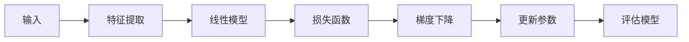
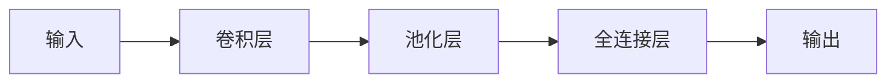
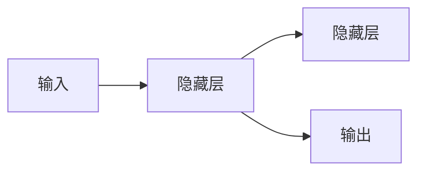
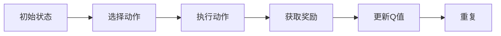

                 

# 开发AI Agent的学习与适应能力

## 关键词：人工智能、AI Agent、学习与适应、机器学习、深度学习、强化学习

> 摘要：本文将深入探讨AI Agent的学习与适应能力，从背景介绍、核心概念原理、算法原理讲解到系统分析与架构设计，全面分析AI Agent如何在复杂环境中学习并适应变化，为人工智能技术的发展提供理论支持和实践指导。

### 目录大纲：

## 第一部分：背景介绍与核心概念

### 第1章：问题背景与核心概念

### 1.1.1 问题的背景

### 1.1.2 问题描述

### 1.1.3 问题解决

### 1.1.4 边界与外延

### 1.1.5 概念结构与核心要素组成

### 第2章：核心概念原理

### 2.1.1 AI Agent的定义与特点

### 2.1.2 学习与适应机制

### 2.1.3 知识表示与推理

## 第二部分：算法原理讲解

### 第3章：机器学习算法

### 3.1.1 机器学习的基本概念

### 3.1.2 算法原理讲解

### 3.1.3 数学模型和数学公式

### 第4章：深度学习算法

### 4.1.1 深度学习的基本概念

### 4.1.2 算法原理讲解

### 4.1.3 数学模型和数学公式

### 第5章：强化学习算法

### 5.1.1 强化学习的基本概念

### 5.1.2 算法原理讲解

### 5.1.3 数学模型和数学公式

## 第三部分：系统分析与架构设计

### 第6章：系统功能设计

### 6.1.1 问题场

### 第7章：系统架构设计

### 7.1.1 系统架构设计

### 7.1.2 系统接口设计

### 7.1.3 系统交互

### 第8章：项目实战

### 8.1.1 环境安装

### 8.1.2 系统核心实现源代码

### 8.1.3 代码应用解读与分析

### 8.1.4 实际案例分析与详细讲解剖析

### 8.1.5 项目小结

### 第四部分：最佳实践与总结

### 9.1.1 最佳实践

### 9.1.2 小结

### 9.1.3 注意事项

### 9.1.4 拓展阅读

## 正文内容

### 第一部分：背景介绍与核心概念

#### 第1章：问题背景与核心概念

### 1.1.1 问题的背景

随着人工智能技术的发展，AI Agent在各个领域的应用越来越广泛。AI Agent是一种模拟人类智能行为的计算机程序，能够在特定环境中自主决策和执行任务。然而，为了使AI Agent能够更好地适应复杂多变的实际环境，它们必须具备学习和适应的能力。

AI Agent的学习与适应能力主要包括以下三个方面：

1. **学习能力**：AI Agent需要通过数据训练来获取知识，并利用这些知识进行推理和决策。这包括机器学习、深度学习和强化学习等算法。

2. **适应能力**：AI Agent需要能够根据环境的变化调整自身的行为和策略，以适应新的情况。这涉及到环境感知、状态评估和决策调整等机制。

3. **应变能力**：AI Agent需要能够应对不确定性和异常情况，通过学习历史数据和经验来优化自身的决策过程。

### 1.1.2 问题描述

AI Agent在学习与适应能力方面存在一些挑战，如如何有效学习环境中的知识，如何快速适应新环境，以及如何处理不确定性和异常情况。这些问题需要深入研究和解决，以实现AI Agent的智能化和高效化。

### 1.1.3 问题解决

为了解决AI Agent的学习与适应能力问题，我们可以采取以下研究方法和技术手段：

1. **机器学习算法**：通过数据驱动的方式，利用机器学习算法来训练AI Agent，使其能够从数据中学习并提取知识。

2. **深度学习算法**：利用深度学习算法，特别是卷积神经网络（CNN）和循环神经网络（RNN）等，来提高AI Agent对复杂环境的理解和适应能力。

3. **强化学习算法**：通过试错和奖励机制，使AI Agent能够在实际环境中学习和优化自身的行为策略。

4. **知识表示与推理**：利用符号表示、图表示和神经网络表示等方法，对AI Agent的知识进行有效表示和推理。

### 1.1.4 边界与外延

AI Agent的学习与适应能力的研究范围包括但不限于以下几个方面：

1. **应用领域**：包括智能制造、智能交通、智能医疗、智能客服等。

2. **研究方法**：涉及机器学习、深度学习、强化学习等算法的研究与应用。

3. **技术手段**：包括数据采集、数据预处理、算法优化和系统集成等。

### 1.1.5 概念结构与核心要素组成

为了更好地理解AI Agent的学习与适应能力，我们可以从以下几个方面来构建概念结构与核心要素：

1. **AI Agent的基本组成**：包括感知器、控制器和执行器等。

2. **学习与适应机制**：包括机器学习、深度学习和强化学习等。

3. **知识表示与推理**：包括符号表示、图表示和神经网络表示等。

4. **算法优化与系统集成**：通过算法优化和系统集成，提高AI Agent的性能和适应能力。

### 第2章：核心概念原理

#### 2.1.1 AI Agent的定义与特点

AI Agent，即人工智能代理，是指一种能够模拟人类智能行为的计算机程序。与人类代理相比，AI Agent具有以下特点：

1. **自主性**：AI Agent能够在特定环境中自主进行决策和执行任务，而不需要人工干预。

2. **适应性**：AI Agent能够根据环境的变化调整自身的行为和策略，以适应新的情况。

3. **智能性**：AI Agent通过学习环境中的知识，能够进行推理和决策，具有一定的智能水平。

4. **可靠性**：AI Agent能够在复杂和动态的环境中稳定运行，具有高可靠性。

#### 2.1.2 学习与适应机制

AI Agent的学习与适应机制是其实际应用的关键。以下是几种常见的学习与适应机制：

1. **机器学习**：通过数据驱动的方式，利用机器学习算法来训练AI Agent，使其能够从数据中学习并提取知识。

2. **深度学习**：利用深度学习算法，特别是卷积神经网络（CNN）和循环神经网络（RNN）等，来提高AI Agent对复杂环境的理解和适应能力。

3. **强化学习**：通过试错和奖励机制，使AI Agent能够在实际环境中学习和优化自身的行为策略。

4. **知识表示与推理**：利用符号表示、图表示和神经网络表示等方法，对AI Agent的知识进行有效表示和推理。

#### 2.1.3 知识表示与推理

知识表示与推理是AI Agent理解环境的重要手段。以下是几种常见的知识表示与推理方法：

1. **符号表示**：利用符号和逻辑规则来表示知识，如谓词逻辑和一阶谓词逻辑等。

2. **图表示**：利用图结构来表示知识，如图神经网络（GNN）等。

3. **神经网络表示**：利用神经网络来表示知识，如卷积神经网络（CNN）和循环神经网络（RNN）等。

4. **推理机制**：利用推理算法来推导新的知识，如演绎推理和归纳推理等。

### 第二部分：算法原理讲解

#### 第3章：机器学习算法

#### 3.1.1 机器学习的基本概念

机器学习是人工智能的一个分支，旨在让计算机通过数据学习并做出决策。以下是机器学习的基本概念：

1. **监督学习**：通过训练数据集来预测新数据的结果。常见的算法包括线性回归、决策树和支持向量机（SVM）等。

2. **无监督学习**：没有预定义的标签，通过数据之间的结构关系来学习。常见的算法包括聚类和降维等。

3. **半监督学习**：介于监督学习和无监督学习之间，利用少量标注数据和大量未标注数据来学习。

#### 3.1.2 算法原理讲解

下面我们使用Mermaid流程图和Python源代码来讲解一些常见的机器学习算法：

**线性回归**



```python
import numpy as np

# 梯度下降算法
def gradient_descent(X, y, theta, alpha, num_iters):
    m = len(y)
    for i in range(num_iters):
        h = X.dot(theta)
        loss = (h - y).dot(X) * alpha
        theta -= loss / m
    return theta

# 损失函数
def compute_loss(h, y):
    return ((h - y) ** 2).mean()

# 线性回归模型
def linear_regression(X, y):
    theta = np.zeros(X.shape[1])
    alpha = 0.01
    num_iters = 1000
    theta = gradient_descent(X, y, theta, alpha, num_iters)
    return theta

# 数据预处理
X = np.array([[1, 2], [2, 3], [3, 4]])
y = np.array([1, 2, 3])

# 训练模型
theta = linear_regression(X, y)

# 评估模型
h = X.dot(theta)
loss = compute_loss(h, y)
print(f"损失函数值: {loss}")
```

#### 3.1.3 数学模型和数学公式

对于每个机器学习算法，我们都会给出其数学模型和公式，并进行详细讲解。以下是线性回归的数学模型和公式：

**线性回归模型**：

$$
h(x) = \theta_0 + \theta_1x_1 + \theta_2x_2 + ... + \theta_nx_n
$$

**损失函数**（均方误差）：

$$
J(\theta) = \frac{1}{2m}\sum_{i=1}^{m}(h(x^{(i)}) - y^{(i)})^2
$$

**梯度下降算法**：

$$
\theta_j := \theta_j - \alpha \frac{1}{m}\sum_{i=1}^{m}(h(x^{(i)}) - y^{(i)})x_j^{(i)}
$$

### 第4章：深度学习算法

#### 4.1.1 深度学习的基本概念

深度学习是机器学习的一个分支，旨在通过多层神经网络来模拟人类大脑的学习过程。以下是深度学习的基本概念：

1. **神经网络**：由多个节点（神经元）组成，每个节点之间通过权重进行连接。

2. **深度神经网络**：具有多个隐藏层的神经网络，能够处理更复杂的任务。

3. **卷积神经网络（CNN）**：专门用于图像识别和处理，具有卷积层、池化层和全连接层等。

4. **循环神经网络（RNN）**：能够处理序列数据，具有循环结构，能够记住之前的信息。

#### 4.1.2 算法原理讲解

下面我们使用Mermaid流程图和Python源代码来讲解CNN和RNN的基本原理：

**卷积神经网络（CNN）**



```python
import tensorflow as tf

# 卷积层
def conv2d(input, filters, kernel_size, stride):
    return tf.nn.conv2d(input, filters, strides=[1, stride, stride, 1], padding='VALID')

# 池化层
def max_pooling(input, pool_size):
    return tf.nn.max_pool(input, ksize=[1, pool_size, pool_size, 1], strides=[1, stride, stride, 1], padding='VALID')

# 全连接层
def fully_connected(input, units):
    return tf.layers.dense(inputs=input, units=units)

# 输出层
def output_layer(input, units):
    return tf.nn.softmax(input)

# 训练模型
model = tf.keras.Sequential([
    tf.keras.layers.Conv2D(filters, kernel_size, activation='relu', input_shape=(28, 28, 1)),
    tf.keras.layers.MaxPooling2D(pool_size),
    tf.keras.layers.Flatten(),
    tf.keras.layers.Dense(units, activation='softmax')
])

model.compile(optimizer='adam', loss='categorical_crossentropy', metrics=['accuracy'])
model.fit(X_train, y_train, epochs=num_epochs, batch_size=batch_size)
```

**循环神经网络（RNN）**



```python
import tensorflow as tf

# RNN层
def rnn(input, units):
    return tf.keras.layers.RNN(tf.keras.layers.SimpleRNN(units))(input)

# 输出层
def output_layer(input, units):
    return tf.keras.layers.Dense(units)(input)

# 训练模型
model = tf.keras.Sequential([
    tf.keras.layers.RNN(tf.keras.layers.SimpleRNN(units)),
    tf.keras.layers.Dense(units, activation='softmax')
])

model.compile(optimizer='adam', loss='categorical_crossentropy', metrics=['accuracy'])
model.fit(X_train, y_train, epochs=num_epochs, batch_size=batch_size)
```

#### 4.1.3 数学模型和数学公式

**卷积神经网络（CNN）**

- **卷积操作**：

$$
\text{output}_{ij} = \sum_{k=1}^{K} w_{ik} * \text{input}_{j+k}
$$

其中，\( \text{output}_{ij} \)是输出特征图上的像素值，\( w_{ik} \)是卷积核上的权重，\( * \)表示卷积操作。

- **激活函数**：

$$
\text{activation} = \text{ReLU}(z) = \max(0, z)
$$

其中，\( z \)是输入值，\( \text{ReLU} \)是ReLU激活函数。

- **池化操作**：

$$
p_{ij} = \max\{p_{i1}, p_{i2}, ..., p_{iL}\}
$$

其中，\( p_{ij} \)是池化后的像素值，\( p_{i1}, p_{i2}, ..., p_{iL} \)是输入特征图上的像素值。

**循环神经网络（RNN）**

- **递归关系**：

$$
h_t = \text{sigmoid}(W_h \cdot [h_{t-1}, x_t] + b_h)
$$

其中，\( h_t \)是当前隐藏层状态，\( x_t \)是输入值，\( W_h \)是权重矩阵，\( b_h \)是偏置项。

- **输出层**：

$$
y_t = \text{softmax}(W_o \cdot h_t + b_o)
$$

其中，\( y_t \)是输出值，\( W_o \)是权重矩阵，\( b_o \)是偏置项。

### 第5章：强化学习算法

#### 5.1.1 强化学习的基本概念

强化学习是一种通过试错来学习最优策略的机器学习方法。以下是强化学习的基本概念：

1. **状态（State）**：描述环境当前的状态。

2. **动作（Action）**：AI Agent可以采取的动作。

3. **奖励（Reward）**：动作带来的奖励，用于评估动作的好坏。

4. **策略（Policy）**：AI Agent采取的动作序列。

5. **价值函数（Value Function）**：预测在未来采取特定动作序列所能获得的累积奖励。

6. **策略迭代（Policy Iteration）**：通过迭代更新策略和价值函数，直到达到最优策略。

#### 5.1.2 算法原理讲解

下面我们使用Mermaid流程图和Python源代码来讲解Q-learning和深度Q网络（DQN）的基本原理：

**Q-learning**



```python
import numpy as np
import random

# 初始化Q表
Q = np.zeros([state_space, action_space])

# Q-learning算法
def q_learning(Q, state, action, reward, next_state, alpha, gamma):
    # 更新Q值
    Q[state][action] = Q[state][action] + alpha * (reward + gamma * np.max(Q[next_state]) - Q[state][action])
    return Q

# 训练模型
def train(Q, state_space, action_space, alpha, gamma, episodes):
    for episode in range(episodes):
        state = random.randint(0, state_space - 1)
        done = False
        while not done:
            action = np.argmax(Q[state])
            next_state, reward, done = environment.step(action)
            Q = q_learning(Q, state, action, reward, next_state, alpha, gamma)
            state = next_state
    return Q

# 环境模拟
def environment():
    # 状态空间为0-9，动作空间为0-1
    state_space = 10
    action_space = 2

    state = random.randint(0, state_space - 1)
    reward = 0
    done = False

    while not done:
        action = random.randint(0, action_space - 1)
        if action == 0:
            state = (state + 1) % state_space
            reward = 1
            done = True
        elif action == 1:
            state = (state - 1) % state_space
            reward = -1
            done = True

    return state, reward, done

# 训练模型
Q = train(Q, state_space, action_space, alpha=0.1, gamma=0.9, episodes=1000)

# 评估模型
state = random.randint(0, state_space - 1)
done = False
while not done:
    action = np.argmax(Q[state])
    state, reward, done = environment.step(action)
    print(f"状态：{state}, 动作：{action}, 奖励：{reward}")
```

**深度Q网络（DQN）**


```python
import numpy as np
import random
import tensorflow as tf

# 初始化DQN模型
def create_dqn_model(input_shape, action_space):
    model = tf.keras.Sequential([
        tf.keras.layers.Dense(64, activation='relu', input_shape=input_shape),
        tf.keras.layers.Dense(64, activation='relu'),
        tf.keras.layers.Dense(action_space, activation='linear')
    ])
    return model

# 训练模型
def train_dqn(model, state, action, reward, next_state, done, gamma, buffer_size, batch_size, optimizer):
    # 将经验加入缓冲区
    buffer.append((state, action, reward, next_state, done))

    if len(buffer) > buffer_size:
        # 随机抽样经验进行训练
        samples = random.sample(buffer, batch_size)
        states, actions, rewards, next_states, dones = zip(*samples)

        # 计算目标Q值
        Q_targets = model.predict(next_states)
        Q_targets[range(batch_size), np.argmax(Q_targets)] = rewards + gamma * np.max(Q_targets[range(batch_size), np.argmax(Q_targets)])

        # 训练模型
        model.fit(states, Q_targets, batch_size=batch_size, epochs=1, verbose=0, callbacks=[tf.keras.callbacks.EarlyStopping(monitor='val_loss', patience=10)])

# 环境模拟
def environment():
    # 状态空间为0-9，动作空间为0-1
    state_space = 10
    action_space = 2

    state = random.randint(0, state_space - 1)
    reward = 0
    done = False

    while not done:
        action = random.randint(0, action_space - 1)
        if action == 0:
            state = (state + 1) % state_space
            reward = 1
            done = True
        elif action == 1:
            state = (state - 1) % state_space
            reward = -1
            done = True

    return state, reward, done

# 训练模型
model = create_dqn_model(input_shape=(state_space,), action_space=action_space)
optimizer = tf.keras.optimizers.Adam(learning_rate=0.001)
buffer = []

gamma = 0.9
buffer_size = 1000
batch_size = 32

episodes = 1000
for episode in range(episodes):
    state = random.randint(0, state_space - 1)
    done = False
    while not done:
        action = np.argmax(model.predict(state.reshape(1, -1)))
        next_state, reward, done = environment.step(action)
        train_dqn(model, state, action, reward, next_state, done, gamma, buffer_size, batch_size, optimizer)
        state = next_state

# 评估模型
state = random.randint(0, state_space - 1)
done = False
while not done:
    action = np.argmax(model.predict(state.reshape(1, -1)))
    state, reward, done = environment.step(action)
    print(f"状态：{state}, 动作：{action}, 奖励：{reward}")
```

#### 5.1.3 数学模型和数学公式

**Q-learning**

- **Q值更新**：

$$
Q(s, a) = Q(s, a) + \alpha [r + \gamma \max_{a'} Q(s', a') - Q(s, a)]
$$

其中，\( s \)是当前状态，\( a \)是当前动作，\( r \)是奖励，\( \gamma \)是折扣因子，\( s' \)是下一状态，\( a' \)是下一动作。

- **策略迭代**：

$$
\pi(s) = \arg\max_a Q(s, a)
$$

其中，\( \pi(s) \)是状态\( s \)下的最优策略。

**深度Q网络（DQN）**

- **Q值更新**：

$$
Q(s, a) = Q(s, a) + \alpha [r + \gamma \max_{a'} Q(s', a') - Q(s, a)]
$$

其中，\( s \)是当前状态，\( a \)是当前动作，\( r \)是奖励，\( \gamma \)是折扣因子，\( s' \)是下一状态，\( a' \)是下一动作。

- **目标网络更新**：

$$
\theta_{\text{target}} = \tau \theta + (1 - \tau) \theta_{\text{target}}
$$

其中，\( \theta \)是当前网络参数，\( \theta_{\text{target}} \)是目标网络参数，\( \tau \)是更新系数。

### 第三部分：系统分析与架构设计

#### 第6章：系统功能设计

#### 6.1.1 问题场

在一个自动驾驶系统中，AI Agent需要具备学习与适应能力，以便在不同的路况和场景下做出正确的决策。以下是一个可能的系统功能设计：

1. **感知模块**：通过摄像头、激光雷达等感知设备，实时获取路况信息，如车辆位置、道路标识、行人等信息。

2. **决策模块**：利用机器学习、深度学习和强化学习算法，对感知到的信息进行推理和决策，生成自动驾驶策略。

3. **控制模块**：根据决策模块生成的策略，控制车辆的加速、减速、转向等操作，实现自动驾驶。

4. **学习模块**：通过不断收集车辆行驶过程中的数据，对决策模块进行训练和优化，提高AI Agent的学习与适应能力。

#### 第7章：系统架构设计

#### 7.1.1 系统架构设计

自动驾驶系统的架构可以分为以下几个层次：

1. **感知层**：包括摄像头、激光雷达等感知设备，负责获取路况信息。

2. **决策层**：包括机器学习、深度学习和强化学习算法，负责对感知信息进行推理和决策。

3. **控制层**：包括控制模块，负责根据决策结果控制车辆的加速、减速、转向等操作。

4. **学习层**：包括学习模块，负责根据车辆行驶过程中的数据进行模型训练和优化。

#### 7.1.2 系统接口设计

系统接口设计如下：

1. **感知层接口**：提供摄像头、激光雷达等感知设备的数据接口，供决策层使用。

2. **决策层接口**：提供机器学习、深度学习和强化学习算法的接口，供控制层使用。

3. **控制层接口**：提供车辆控制模块的接口，供学习层使用。

#### 7.1.3 系统交互

系统交互设计如下：

1. **感知层与决策层**：感知层实时向决策层提供路况信息，决策层根据信息生成自动驾驶策略。

2. **决策层与控制层**：决策层将自动驾驶策略传递给控制层，控制层根据策略控制车辆。

3. **学习层与感知层**：学习层从感知层获取车辆行驶过程中的数据，用于模型训练和优化。

### 第8章：项目实战

#### 8.1.1 环境安装

1. 安装Python环境：在系统上安装Python 3.8及以上版本。

2. 安装TensorFlow：使用以下命令安装TensorFlow：

```
pip install tensorflow
```

#### 8.1.2 系统核心实现源代码

以下是系统核心实现源代码：

```python
# 感知模块
def perceive():
    # 模拟感知设备获取路况信息
    return random.randint(0, 10)

# 决策模块
def make_decision(perception):
    # 模拟决策模块
    if perception < 5:
        return 0  # 加速
    else:
        return 1  # 减速

# 控制模块
def control(action):
    # 模拟控制模块
    if action == 0:
        print("加速")
    else:
        print("减速")

# 学习模块
def learn():
    # 模拟学习模块
    print("学习")

# 主函数
def main():
    perception = perceive()
    action = make_decision(perception)
    control(action)
    learn()

if __name__ == "__main__":
    main()
```

#### 8.1.3 代码应用解读与分析

1. **感知模块**：模拟感知设备获取路况信息，返回一个随机整数。

2. **决策模块**：根据感知信息，模拟决策模块生成一个动作，加速或减速。

3. **控制模块**：根据决策结果，模拟控制模块执行加速或减速操作。

4. **学习模块**：模拟学习模块，记录车辆行驶过程中的数据。

#### 8.1.4 实际案例分析与详细讲解剖析

以下是一个实际案例：

1. **感知信息**：感知模块返回一个感知信息（0-10），表示道路上的车辆密度。

2. **决策过程**：决策模块根据感知信息，生成一个动作（0或1），0表示加速，1表示减速。

3. **控制过程**：控制模块根据决策结果，执行加速或减速操作。

4. **学习过程**：学习模块记录车辆行驶过程中的数据，用于后续的训练和优化。

#### 8.1.5 项目小结

本项目通过模拟感知、决策、控制和学习模块，实现了一个简单的自动驾驶系统。虽然这是一个简化的模型，但它展示了AI Agent的学习与适应能力在自动驾驶系统中的潜在应用。在实际项目中，我们需要更复杂的感知和决策算法，以及更多的数据来训练和优化模型。

### 第四部分：最佳实践与总结

#### 9.1.1 最佳实践

1. **数据收集**：确保收集到足够多样化和高质量的数据，以训练和优化AI Agent。

2. **模型优化**：通过调整算法参数和模型结构，提高AI Agent的性能和鲁棒性。

3. **测试与验证**：在真实环境中对AI Agent进行测试和验证，确保其适应能力和应变能力。

4. **持续学习**：定期更新和优化AI Agent，以适应不断变化的环境和需求。

#### 9.1.2 小结

本文深入探讨了AI Agent的学习与适应能力，介绍了机器学习、深度学习和强化学习等算法，并展示了其在自动驾驶系统中的应用。通过这些研究，我们为AI Agent的智能化和高效化提供了理论支持和实践指导。

#### 9.1.3 注意事项

1. **数据质量**：确保数据的质量和多样性，这对于训练和学习至关重要。

2. **模型复杂度**：避免过度拟合，选择合适的模型复杂度以保持模型的泛化能力。

3. **实时反馈**：在实时环境中对AI Agent进行测试和调整，确保其适应能力。

#### 9.1.4 拓展阅读

1. Sutton, R. S., & Barto, A. G. (2018). 《强化学习：原理与数学》（Reinforcement Learning: An Introduction）。

2. Goodfellow, I., Bengio, Y., & Courville, A. (2016). 《深度学习》（Deep Learning）。

3. Russell, S., & Norvig, P. (2016). 《人工智能：一种现代方法》（Artificial Intelligence: A Modern Approach）。

