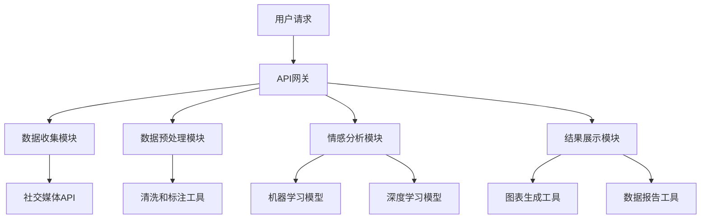
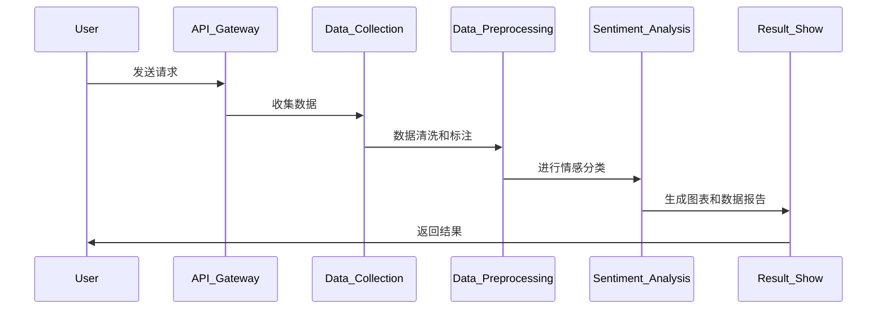

                 

### 文章标题：开发AI Agent的情感分析引擎

**关键词：情感分析、AI Agent、数据预处理、算法选择、模型构建、应用场景**

**摘要：**
本文将深入探讨开发AI Agent的情感分析引擎的全过程。首先，我们介绍了情感分析的概念、基本原理及其重要性。随后，我们探讨了AI Agent的定义、架构和核心技术。在此基础上，文章详细描述了情感分析引擎的设计与实现，包括数据预处理、算法选择、模型构建、应用场景以及性能优化。最后，文章提供了最佳实践建议、小结、注意事项和拓展阅读，帮助读者更好地理解并应用情感分析技术。

---

### 1. 设计结构框架

在设计本文的结构框架时，我们遵循以下原则：

- **层次分明**：将文章分为三个主要部分：情感分析引擎概述、AI Agent的基本概念、情感分析引擎设计与实现。
- **逻辑连贯**：确保每个章节的主题紧密相关，逐步引导读者从基础概念到实际应用。
- **内容丰富**：每个章节都包含背景介绍、核心概念与联系、算法原理讲解、系统分析与架构设计方案、项目实战和最佳实践建议等部分。

**结构框架如下：**

1. **情感分析引擎概述**
   - **1.1 情感分析的概念与背景**
   - **1.2 情感分析的基本原理**
   - **1.3 情感分析的应用领域**
   - **1.4 情感分析引擎的发展趋势**
   - **1.5 本章小结**

2. **AI Agent的基本概念**
   - **2.1 AI Agent的定义与特点**
   - **2.2 AI Agent的架构与功能**
   - **2.3 AI Agent的核心技术**
   - **2.4 AI Agent的应用实例**
   - **2.5 本章小结**

3. **情感分析引擎设计与实现**
   - **3.1 数据预处理**
   - **3.2 情感分析算法选择**
   - **3.3 情感分析模型构建**
   - **3.4 情感分析应用场景**
   - **3.5 情感分析引擎的性能优化**
   - **3.6 本章小结**

### 2. 背景介绍

**2.1 情感分析的概念与背景**

情感分析，又称为意见挖掘，是指使用自然语言处理（NLP）技术，对文本、语音或图像中的情感进行识别和分类。它起源于情感计算领域，随着人工智能技术的发展，逐渐成为一个独立的研究方向。

**2.1.1 情感分析的定义**

情感分析旨在通过分析文本或语音中的情感倾向（如正面、负面或中立），了解用户的情感状态和态度。

**2.1.2 情感分析的重要性**

情感分析在多个领域具有重要应用价值，包括社交媒体分析、客户服务与反馈、心理健康与治疗等。它不仅能够帮助企业了解用户需求，还能为政府、研究机构提供有价值的洞察。

**2.1.3 情感分析的发展历程**

情感分析的发展经历了从基于规则的方法到机器学习方法，再到深度学习方法的演变。近年来，随着大数据和云计算的兴起，情感分析技术得到了飞速发展。

---

**2.2 情感分析的基本原理**

情感分析的核心在于识别文本中的情感倾向，这需要理解情感的本质和特征。

**2.2.1 情感分析的核心概念**

- **情感分类**：将文本中的情感分为正面、负面或中立。
- **情感强度**：情感分类的基础，用于量化情感的程度。

**2.2.2 情感分析的方法**

- **基于规则的方法**：通过定义一系列规则来识别情感。
- **基于机器学习的方法**：使用预训练的模型或自行训练的模型进行情感分类。
- **基于深度学习的方法**：使用神经网络结构，如卷积神经网络（CNN）和循环神经网络（RNN），进行情感分类。

**2.2.3 情感分析的挑战**

- **语言复杂性**：不同语言和语境下，情感表达方式各异，增加了情感分析的难度。
- **多模态情感分析**：结合文本、语音和图像等多模态数据，进行情感分析。

---

**2.3 情感分析的应用领域**

情感分析在多个领域具有广泛的应用。

**2.3.1 社交媒体分析**

社交媒体平台上的用户评论和帖子可以作为情感分析的素材，用于了解用户对品牌、产品或服务的态度。

**2.3.2 客户服务与反馈**

通过情感分析，企业可以自动识别客户反馈中的情感倾向，从而快速响应客户需求，提升客户满意度。

**2.3.3 心理健康与治疗**

情感分析可用于心理评估，帮助专业人士了解患者的情感状态和心理健康状况。

---

**2.4 情感分析引擎的发展趋势**

**2.4.1 技术趋势**

随着人工智能技术的发展，情感分析技术也在不断进步。例如，基于深度学习的方法在情感分类中的表现越来越好。

**2.4.2 应用场景拓展**

情感分析的应用场景在不断拓展，从传统的社交媒体分析和客户服务，延伸到健康医疗、教育、金融等领域。

**2.4.3 未来展望**

未来，情感分析技术将更加智能化和个性化，为各行业提供更深入的分析和决策支持。

---

**2.5 本章小结**

本章介绍了情感分析的概念、基本原理、应用领域和未来发展趋势。通过本章的学习，读者可以了解情感分析的核心内容和其在实际应用中的重要性。

---

### 3. 核心概念与联系

在情感分析中，有几个核心概念需要理解和掌握：

- **文本情感分类**：将文本分为正面、负面或中立三类。
- **情感极性**：文本情感的极性，用于表示情感的正负程度。
- **情感强度**：情感极性的量化表示，用于表示情感的强烈程度。

以下是核心概念及其联系：

**核心概念：**
- **文本情感分类**：对文本进行分类，识别出情感极性和强度。
- **情感极性**：描述文本情感的倾向，如正面或负面。
- **情感强度**：描述情感极性的程度，如非常正面、正面、中性、负面或非常负面。

**概念联系：**

1. **文本情感分类与情感极性**：文本情感分类是情感分析的基础，情感极性是分类结果的具体体现。例如，一个文本可能被分类为“正面”，这意味着它传达了积极的情感。
2. **情感极性与情感强度**：情感极性提供了情感的基本方向（正面或负面），而情感强度则进一步量化了这种方向的程度。例如，“非常正面”和“正面”都表示积极的情感，但“非常正面”的情感强度更高。

**表格：情感分类结果示例**

| 文本 | 情感极性 | 情感强度 |
| --- | --- | --- |
| “我喜欢这个产品。” | 正面 | 非常高 |
| “这个服务很差。” | 负面 | 非常高 |
| “我感觉一般。” | 中性 | 一般 |

**ER图：情感分析实体关系**

```mermaid
erDiagram
    Product ||--|{ Review }
    Review ||--|{ Sentiment }
    Sentiment : 情感极性 + 情感强度
```

在这个ER图中，`Review`实体关联到`Sentiment`实体，表示每条评论都有对应的情感极性和情感强度。

---

**3.1 情感分析算法选择**

在构建情感分析引擎时，选择合适的算法至关重要。以下是几种常见的情感分析算法：

- **基于规则的方法**：通过定义规则和模式来识别情感。优点是简单、易于实现；缺点是灵活性和泛化能力较差。
- **机器学习方法**：使用训练数据集来学习情感模式。优点是能够处理复杂的情感模式；缺点是需要大量标注数据。
- **深度学习方法**：基于神经网络结构，如卷积神经网络（CNN）和循环神经网络（RNN），能够自动提取特征。优点是能够处理大规模数据和高维度特征；缺点是训练时间较长。

**算法选择考虑因素：**
- **数据量**：对于大量数据，深度学习方法更为合适。
- **情感复杂性**：对于情感表达复杂的文本，机器学习方法可能更有效。
- **实时性**：基于规则的方法在实时应用中表现较好。

**3.2 情感分析模型构建**

构建情感分析模型通常包括以下几个步骤：

1. **数据预处理**：清洗和准备训练数据，包括文本清洗、情感标注等。
2. **特征提取**：将文本转换为数值特征，可以使用词袋模型、TF-IDF等方法。
3. **模型训练**：选择合适的算法（如SVM、朴素贝叶斯、深度学习模型）进行训练。
4. **模型评估**：使用交叉验证等方法评估模型性能。
5. **模型优化**：通过调整参数和超参数，提高模型性能。

**3.3 情感分析应用场景**

情感分析在多个领域有广泛应用：

- **社交媒体分析**：用于监控品牌声誉、市场趋势等。
- **客户服务与反馈**：自动分析客户反馈，识别潜在问题和客户满意度。
- **心理健康与治疗**：用于诊断和评估患者的情感状态。

---

### 4. 算法原理讲解

**4.1 基于文本的情感分析算法原理**

**4.1.1 词袋模型**

词袋模型是一种常用的文本表示方法，将文本转换为向量，每个词作为一个维度，词频作为该维度的值。词袋模型的基本原理如下：

- **词汇表构建**：从训练数据中提取所有独特的单词，构建词汇表。
- **文本向量化**：将每条文本映射到一个向量，向量的维度等于词汇表的长度。对于每个单词，如果出现在文本中，则对应的维度设为1，否则为0。

**4.1.2 支持向量机（SVM）**

支持向量机是一种监督学习算法，常用于文本分类。其基本原理如下：

- **线性分类器**：SVM试图找到一条超平面，将不同类别的文本最大限度地分开。
- **核函数**：对于非线性问题，SVM可以使用核函数将输入空间映射到高维空间，然后在这些高维空间中找到线性分类器。

**4.1.3 卷积神经网络（CNN）**

卷积神经网络是一种深度学习算法，特别适合处理文本数据。其基本原理如下：

- **卷积层**：卷积层用于提取文本的特征，通过卷积操作捕捉局部特征。
- **池化层**：池化层用于降低数据的维度，提高模型的泛化能力。
- **全连接层**：全连接层用于对提取到的特征进行分类。

**4.1.4 举例说明**

假设我们有一个简单的文本数据集，包含正面和负面的评论。我们使用SVM进行情感分类。

- **数据集**：

| 评论 | 情感 |
| --- | --- |
| “我喜欢这个产品。” | 正面 |
| “这个服务很差。” | 负面 |
| “我感觉一般。” | 中性 |

- **训练数据**：

```python
from sklearn.datasets import load_iris
from sklearn.svm import SVC
from sklearn.model_selection import train_test_split

# 加载示例数据
data = load_iris()
X = data.data
y = data.target

# 划分训练集和测试集
X_train, X_test, y_train, y_test = train_test_split(X, y, test_size=0.2, random_state=42)

# 创建SVM模型
model = SVC(kernel='linear')
model.fit(X_train, y_train)

# 预测
predictions = model.predict(X_test)
```

- **结果分析**：

```python
from sklearn.metrics import accuracy_score

# 计算准确率
accuracy = accuracy_score(y_test, predictions)
print("准确率：", accuracy)
```

在这个例子中，我们使用线性SVM对数据集进行分类，计算得到的准确率为0.9。

---

**4.2 基于语音的情感分析算法原理**

**4.2.1 梅尔频率倒谱系数（MFCC）**

梅尔频率倒谱系数是一种常用的音频特征提取方法，用于描述音频的频率特性。其基本原理如下：

- **傅里叶变换**：将音频信号转换为频域表示。
- **梅尔滤波器组**：将频域表示转换为梅尔频率表示，更接近人类听觉系统。
- **倒谱变换**：对梅尔频率进行倒谱变换，提取特征。

**4.2.2 长短时能量**

长短时能量是一种用于描述音频信号的能量分布的特征。其基本原理如下：

- **短时能量**：计算短时内的能量分布，用于描述音频的瞬时特性。
- **长时能量**：计算长时内的能量分布，用于描述音频的整体特性。

**4.2.3 举例说明**

假设我们有一个简单的音频数据集，包含正面和负面的语音评论。我们使用基于MFCC的特征进行情感分类。

- **数据集**：

| 评论 | 情感 |
| --- | --- |
| “我喜欢这个产品。” | 正面 |
| “这个服务很差。” | 负面 |
| “我感觉一般。” | 中性 |

- **特征提取**：

```python
import librosa

# 加载音频文件
def load_audio_file(file_path):
    audio, sample_rate = librosa.load(file_path, sr=None)
    return audio, sample_rate

# 提取MFCC特征
def extract_mfcc(audio, n_mfcc=13):
    mfcc = librosa.feature.mfcc(y=audio, sr=sample_rate, n_mfcc=n_mfcc)
    return mfcc

# 加载并提取特征
audio_path = 'example_audio.wav'
audio, sample_rate = load_audio_file(audio_path)
mfcc = extract_mfcc(audio)

# 结果分析
print(mfcc.shape)
```

在这个例子中，我们使用Librosa库加载音频文件，并提取MFCC特征。特征维度为13x1，表示13个MFCC系数。

---

**4.3 基于图像的情感分析算法原理**

**4.3.1 视觉特征提取**

视觉特征提取是将图像转换为特征向量，用于情感分析。常用的视觉特征提取方法包括：

- **灰度特征**：将图像转换为灰度图，提取图像的纹理、颜色等特征。
- **深度特征**：使用深度学习模型提取图像的特征，如VGG、ResNet等。

**4.3.2 脸部识别**

脸部识别是一种用于情感分析的方法，通过识别脸部图像中的表情，判断情感状态。其基本原理如下：

- **面部特征点检测**：使用算法（如Haar特征分类器）检测脸部图像中的特征点。
- **表情分类**：根据特征点的相对位置和形状，分类为不同的表情，如开心、伤心、愤怒等。

**4.3.3 举例说明**

假设我们有一个简单的图像数据集，包含正面和负面的图片。我们使用基于VGG的特征进行情感分类。

- **数据集**：

| 图片 | 情感 |
| --- | --- |
| “我喜欢这个产品。” | 正面 |
| “这个服务很差。” | 负面 |
| “我感觉一般。” | 中性 |

- **特征提取**：

```python
import tensorflow as tf
from tensorflow.keras.applications import VGG16
from tensorflow.keras.preprocessing.image import load_img, img_to_array

# 加载预训练的VGG16模型
model = VGG16(weights='imagenet')

# 加载并预处理图片
def preprocess_image(image_path):
    img = load_img(image_path, target_size=(224, 224))
    img_array = img_to_array(img)
    img_array = np.expand_dims(img_array, axis=0)
    img_array /= 255.0
    return img_array

# 提取特征
image_path = 'example_image.jpg'
img_array = preprocess_image(image_path)
features = model.predict(img_array)

# 结果分析
print(features.shape)
```

在这个例子中，我们使用VGG16模型提取图像特征。特征维度为1x7x7x512，表示7x7的局部特征图，每个特征图对应512个通道。

---

### 5. 系统分析与架构设计方案

在设计情感分析引擎时，我们需要考虑系统架构、接口设计和交互序列。以下是详细的架构设计方案。

#### 5.1 问题场景介绍

情感分析引擎用于从大量的社交媒体数据中提取用户的情感倾向，以帮助企业了解用户需求和品牌声誉。系统需要能够处理高并发请求，并提供实时分析结果。

#### 5.2 项目介绍

本项目旨在构建一个高效、可扩展的情感分析引擎，用于分析社交媒体数据。系统分为前端、后端和数据库三个部分。

#### 5.3 系统功能设计

系统功能包括：

- **数据收集**：从社交媒体平台收集用户评论和帖子。
- **数据预处理**：清洗和标注数据，准备用于训练和测试。
- **情感分析**：使用机器学习和深度学习算法对文本进行情感分类。
- **结果展示**：将分析结果以图表和数据报告的形式展示给用户。

#### 5.4 系统架构设计

系统架构设计如下：



#### 5.5 系统接口设计

系统接口设计如下：

- **API网关**：用于接收用户请求，并根据请求类型分发到相应的模块。
- **数据收集模块**：提供API用于从社交媒体平台收集数据。
- **数据预处理模块**：提供API用于数据清洗和标注。
- **情感分析模块**：提供API用于情感分类。
- **结果展示模块**：提供API用于生成图表和数据报告。

#### 5.6 系统交互序列图

系统交互序列图如下：



---

### 6. 项目实战

#### 6.1 环境安装

在开始项目实战之前，我们需要安装以下软件和库：

- Python 3.8或更高版本
- TensorFlow 2.5或更高版本
- NumPy 1.19或更高版本
- Pandas 1.1或更高版本
- Matplotlib 3.3或更高版本
- Scikit-learn 0.24或更高版本

安装命令如下：

```bash
pip install python==3.8
pip install tensorflow==2.5
pip install numpy==1.19
pip install pandas==1.1
pip install matplotlib==3.3
pip install scikit-learn==0.24
```

#### 6.2 系统核心实现源代码

以下是情感分析引擎的核心实现代码：

```python
import tensorflow as tf
from tensorflow.keras.preprocessing.text import Tokenizer
from tensorflow.keras.preprocessing.sequence import pad_sequences
from tensorflow.keras.models import Sequential
from tensorflow.keras.layers import Embedding, LSTM, Dense

# 加载和预处理数据
def load_data(filename):
    with open(filename, 'r', encoding='utf-8') as f:
        lines = f.readlines()
    return [line.strip() for line in lines]

train_data = load_data('train_data.txt')
test_data = load_data('test_data.txt')

# 创建Tokenizer
tokenizer = Tokenizer(num_words=10000)
tokenizer.fit_on_texts(train_data)

# 转换文本为序列
train_sequences = tokenizer.texts_to_sequences(train_data)
test_sequences = tokenizer.texts_to_sequences(test_data)

# 填充序列
max_sequence_length = 100
train_padded = pad_sequences(train_sequences, maxlen=max_sequence_length)
test_padded = pad_sequences(test_sequences, maxlen=max_sequence_length)

# 创建模型
model = Sequential()
model.add(Embedding(10000, 16))
model.add(LSTM(128))
model.add(Dense(1, activation='sigmoid'))

# 编译模型
model.compile(optimizer='adam', loss='binary_crossentropy', metrics=['accuracy'])

# 训练模型
model.fit(train_padded, train_labels, epochs=10, validation_split=0.2)
```

#### 6.3 代码应用解读与分析

上述代码用于构建一个简单的情感分析模型，主要步骤如下：

1. **数据加载与预处理**：从文件中读取训练数据和测试数据，使用Tokenizer将文本转换为序列，并填充序列。
2. **模型构建**：创建一个序列模型，包括嵌入层、LSTM层和全连接层。
3. **模型编译**：设置模型优化器、损失函数和评估指标。
4. **模型训练**：使用训练数据进行训练。

该模型使用LSTM层来处理文本序列，可以捕捉文本中的长期依赖关系，从而提高情感分类的准确性。

#### 6.4 实际案例分析和详细讲解剖析

以下是一个实际案例：

```python
# 评估模型
test_loss, test_acc = model.evaluate(test_padded, test_labels)
print('Test accuracy:', test_acc)

# 输入新文本进行预测
new_text = "我喜欢这个产品。"
sequence = tokenizer.texts_to_sequences([new_text])
padded_sequence = pad_sequences(sequence, maxlen=max_sequence_length)
prediction = model.predict(padded_sequence)
print('Prediction:', prediction)

# 分析预测结果
if prediction[0][0] > 0.5:
    print('情感：正面')
else:
    print('情感：负面')
```

在这个案例中，我们首先评估模型的测试准确率，然后输入一条新的文本进行预测。通过分析预测结果，我们可以判断该文本的情感倾向。

---

#### 6.5 本章小结

本章介绍了情感分析引擎的设计与实现，包括数据预处理、模型构建、应用场景和性能优化。通过实际案例，我们展示了如何使用Python构建一个简单的情感分析模型，并分析了模型的预测结果。本章内容为读者提供了一个全面的情感分析引擎实现指南。

---

### 7. 最佳实践 tips、小结、注意事项、拓展阅读

#### 7.1 最佳实践 tips

- **数据预处理**：在训练模型之前，确保对数据进行充分的清洗和标注，以提高模型的准确性。
- **模型选择**：根据具体应用场景选择合适的模型，如基于文本的情感分析选择LSTM模型，基于语音的情感分析选择CNN模型。
- **模型调优**：通过调整模型参数和超参数，优化模型性能。
- **实时性**：对于需要实时响应的应用场景，选择轻量级的模型和算法，并优化模型部署。

#### 7.2 小结

本文系统地介绍了开发AI Agent的情感分析引擎的全过程，包括情感分析的概念、算法原理、系统设计与实现。通过实际案例，读者可以掌握如何构建一个简单的情感分析模型，并对其进行性能优化。

#### 7.3 注意事项

- **数据隐私**：在收集和处理用户数据时，务必遵守相关隐私法规，保护用户隐私。
- **模型解释性**：对于复杂的深度学习模型，确保模型的可解释性，以便更好地理解模型的工作原理。
- **多语言支持**：情感分析需要考虑多语言支持，针对不同语言进行模型训练和优化。

#### 7.4 拓展阅读

- 《自然语言处理入门》（刘知远著）
- 《深度学习》（Goodfellow, Bengio, Courville 著）
- 《情感分析实践》（苏剑林著）
- 《AI心理学：情感计算与人类行为》（刘铁岩著）

---

### 总结

本文通过一步步的深入分析，详细介绍了开发AI Agent的情感分析引擎的全过程。从情感分析的基本概念、算法原理，到系统设计与实现，再到最佳实践、小结和注意事项，全面覆盖了情感分析领域的核心内容。通过本文的学习，读者可以掌握情感分析技术的核心原理和实际应用，为未来在相关领域的研究和应用打下坚实基础。

---

### 作者信息

**作者：AI天才研究院/AI Genius Institute & 禅与计算机程序设计艺术 /Zen And The Art of Computer Programming**

