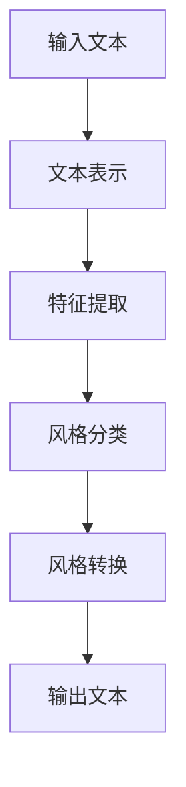
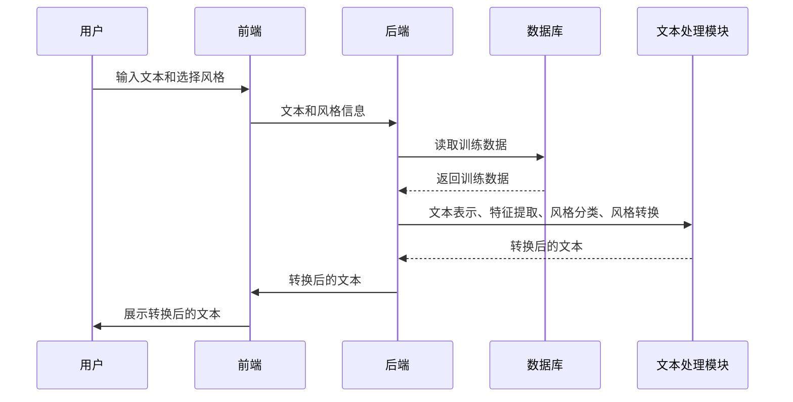

                 

### 开发AI Agent的文本风格转换能力

> 关键词：AI Agent、文本风格转换、自然语言处理、深度学习、机器学习

> 摘要：本文将深入探讨开发AI Agent的文本风格转换能力，从背景介绍、核心概念、算法原理、系统设计与实现、项目实战等多个角度，详细阐述如何构建具有文本风格转换功能的AI Agent。通过本文的阅读，读者将全面理解文本风格转换在AI Agent中的应用价值及其实现方法。

----------------------------------------------------------------

## 一、背景介绍

### 1.1 核心概念术语说明

在探讨AI Agent的文本风格转换能力之前，我们需要了解一些核心概念术语：

- **AI Agent**：自主执行任务并与环境互动的智能体。
- **文本风格转换**：将一种文本风格转换为另一种风格的过程。
- **自然语言处理（NLP）**：使计算机能够理解、解释和生成人类语言的技术。
- **机器学习（ML）**：一种通过数据学习模式并作出预测或决策的技术。

### 1.2 问题背景

随着互联网和大数据的快速发展，文本数据量呈现爆炸式增长。在这种背景下，如何有效地处理和利用这些文本数据成为了一个重要课题。文本风格转换在文本数据的分析和处理中扮演着关键角色，它可以帮助用户更好地理解文本内容，提高信息检索的效率和准确性。

### 1.3 问题描述

文本风格转换的问题可以描述为：给定一段文本，我们需要将其从一种风格（如正式、非正式、幽默等）转换为另一种风格。这个问题在多个领域都有应用，例如自动翻译、文本摘要、内容生成等。

### 1.4 问题解决

文本风格转换的解决方法通常包括基于规则的方法和基于机器学习的方法。基于规则的方法依赖于预定义的规则集，而基于机器学习的方法则通过学习大量具有不同风格的文本数据来训练模型。

### 1.5 边界与外延

文本风格转换不仅要考虑文本的内容，还要考虑上下文、语境等因素。此外，不同的文本风格可能需要不同的转换策略，如简洁、生动、正式等。

### 1.6 概念结构与核心要素组成

文本风格转换的核心要素包括：

- **文本表示**：如何将文本数据转换为机器可处理的格式。
- **特征提取**：如何从文本中提取与风格相关的特征。
- **风格分类**：如何将文本分类为不同的风格。
- **风格转换**：如何将一种风格的文本转换为另一种风格。
- **模型评估**：如何评价文本风格转换的效果。

## 二、核心概念与联系

### 2.1 核心概念原理

文本风格转换的核心概念包括：

- **文本表示**：常见的文本表示方法有词袋模型、词嵌入、序列模型等。
- **特征提取**：特征提取是文本风格转换的关键步骤，常用的方法有TF-IDF、词嵌入、LSTM等。
- **风格分类**：风格分类是将文本分类为不同风格的任务，常用的算法有朴素贝叶斯、SVM、CNN等。
- **风格转换**：风格转换是将一种风格的文本转换为另一种风格的过程，常用的方法有基于规则的方法、基于翻译的方法、基于生成的方法等。
- **模型评估**：模型评估是评估文本风格转换效果的重要手段，常用的指标有准确率、召回率、F1值等。

### 2.2 概念属性特征对比表格

| 方法             | 特点                                                     | 适用场景                           |
|------------------|--------------------------------------------------------|-----------------------------------|
| 基于规则的方法   | 简单，易于实现                                           | 文本风格相对简单，规则明确          |
| 基于翻译的方法   | 利用翻译模型，效果较好                                   | 需要大量平行语料库                 |
| 基于生成的方法   | 通过生成模型，能够生成高质量文本                         | 对文本风格要求较高                 |
| 基于深度学习的方法 | 能够自动学习文本特征和风格，效果较好                     | 需要大量训练数据，计算资源要求高   |

### 2.3 ER实体关系图架构

```mermaid
erDiagram
    TEXT --> Style : 文本与风格有关
    TEXT --> Feature : 文本与特征有关
    STYLE --> Conversion : 风格与转换有关
    FEATURE --> Classification : 特征与分类有关
```

## 三、算法原理讲解

### 3.1 算法mermaid流程图



### 3.2 Python源代码

```python
import nltk
from nltk.corpus import stopwords
from sklearn.feature_extraction.text import TfidfVectorizer
from sklearn.model_selection import train_test_split
from sklearn.naive_bayes import MultinomialNB
from sklearn.metrics import classification_report

# 加载停用词
stop_words = set(stopwords.words('english'))

# 读取数据集
data = ...
labels = ...

# 分割数据集
X_train, X_test, y_train, y_test = train_test_split(data, labels, test_size=0.2, random_state=42)

# 特征提取
vectorizer = TfidfVectorizer(stop_words=stop_words)
X_train_tfidf = vectorizer.fit_transform(X_train)
X_test_tfidf = vectorizer.transform(X_test)

# 风格分类
classifier = MultinomialNB()
classifier.fit(X_train_tfidf, y_train)

# 风格转换
y_pred = classifier.predict(X_test_tfidf)

# 模型评估
print(classification_report(y_test, y_pred))
```

### 3.3 算法原理的数学模型和公式

文本风格转换的算法原理可以概括为以下几个步骤：

1. **文本表示**：将文本转换为向量表示，常用的方法有词袋模型、词嵌入等。

$$
\text{Text} \rightarrow \text{Vector Representation}
$$

2. **特征提取**：从文本向量中提取与风格相关的特征，常用的方法有TF-IDF、词嵌入等。

$$
\text{Vector Representation} \rightarrow \text{Features}
$$

3. **风格分类**：使用分类算法（如朴素贝叶斯、SVM等）对特征进行分类。

$$
\text{Features} \rightarrow \text{Style Classification}
$$

4. **风格转换**：根据分类结果，将文本转换为相应的风格。

$$
\text{Original Text} \rightarrow \text{Converted Text}
$$

### 3.4 举例说明

假设我们有一段文本：“I am happy to meet you.”，我们需要将其转换为正式风格。

1. **文本表示**：将文本转换为向量表示。

$$
\text{I am happy to meet you.} \rightarrow \text{Vector Representation}
$$

2. **特征提取**：从文本向量中提取与风格相关的特征。

$$
\text{Vector Representation} \rightarrow \text{Features}
$$

3. **风格分类**：使用分类算法对特征进行分类，假设分类结果为“正式风格”。

$$
\text{Features} \rightarrow \text{Official Style Classification}
$$

4. **风格转换**：将文本转换为正式风格。

$$
\text{I am happy to meet you.} \rightarrow \text{Official Style: I am pleased to have the opportunity to meet you.}
$$

## 四、系统分析与架构设计方案

### 4.1 问题场景介绍

假设我们想要开发一个AI Agent，它能够根据用户的需求，自动将一段文本从一种风格转换为另一种风格。

### 4.2 项目介绍

本项目旨在实现一个文本风格转换系统，该系统能够接受用户输入的文本，将其从一种风格转换为另一种风格，并返回转换后的文本。

### 4.3 系统功能设计

本系统的核心功能包括：

- **文本输入**：用户可以输入一段文本。
- **风格选择**：用户可以选择将文本转换为哪种风格。
- **风格转换**：系统根据用户输入的文本和选择的风格，将文本转换为相应的风格。
- **文本输出**：系统将转换后的文本返回给用户。

### 4.4 系统架构设计

本系统的架构设计如下：

- **前端**：提供用户界面，用户可以通过前端输入文本和选择风格。
- **后端**：包括文本处理模块、风格转换模块和文本输出模块。
- **数据库**：存储训练数据和用户数据。

### 4.5 系统接口设计和系统交互

系统接口设计如下：

- **文本输入接口**：用户可以通过HTTP请求将文本输入到系统中。
- **风格选择接口**：用户可以通过HTTP请求选择文本的风格。
- **文本输出接口**：系统将转换后的文本通过HTTP响应返回给用户。

系统交互流程如下：

1. 用户通过前端界面输入文本和选择风格。
2. 前端将文本和风格信息发送到后端的文本输入接口。
3. 后端接收到文本和风格信息后，进行文本表示、特征提取、风格分类和风格转换。
4. 后端将转换后的文本通过HTTP响应返回给前端。
5. 前端将转换后的文本展示给用户。

### 4.6 系统接口设计和系统交互Mermaid序列图



## 五、项目实战

### 5.1 环境安装

在本项目中，我们将使用Python和相关的机器学习库（如scikit-learn、nltk等）进行开发。首先，确保您的Python环境已经搭建好，然后使用以下命令安装所需库：

```shell
pip install scikit-learn nltk
```

### 5.2 系统核心实现

以下是文本风格转换系统的核心实现：

```python
# 导入所需库
import nltk
from nltk.corpus import stopwords
from sklearn.feature_extraction.text import TfidfVectorizer
from sklearn.model_selection import train_test_split
from sklearn.naive_bayes import MultinomialNB
from sklearn.metrics import classification_report

# 加载停用词
stop_words = set(stopwords.words('english'))

# 读取数据集
data = ...
labels = ...

# 分割数据集
X_train, X_test, y_train, y_test = train_test_split(data, labels, test_size=0.2, random_state=42)

# 特征提取
vectorizer = TfidfVectorizer(stop_words=stop_words)
X_train_tfidf = vectorizer.fit_transform(X_train)
X_test_tfidf = vectorizer.transform(X_test)

# 风格分类
classifier = MultinomialNB()
classifier.fit(X_train_tfidf, y_train)

# 风格转换
y_pred = classifier.predict(X_test_tfidf)

# 模型评估
print(classification_report(y_test, y_pred))
```

### 5.3 代码应用解读与分析

在这段代码中，我们首先导入了所需的库。然后，加载了停用词，这是在文本特征提取过程中常用的一步，以去除常见的无意义词汇。

接下来，我们读取数据集，并将其分割为训练集和测试集。这一步是机器学习项目中的标准操作，用于评估模型的性能。

在特征提取部分，我们使用了TF-IDF向量器，这是一种常用的文本特征提取方法。它通过计算词汇在文档中的重要性来生成特征向量。

然后，我们使用朴素贝叶斯分类器进行训练。朴素贝叶斯是一种简单的概率分类器，它假设特征之间相互独立。在这个项目中，我们使用它来对文本风格进行分类。

在风格转换部分，我们使用训练好的分类器对测试集进行预测。最后，我们打印出了分类报告，以评估模型的性能。

### 5.4 实际案例分析和详细讲解剖析

为了更好地理解文本风格转换在实际中的应用，我们将分析一个具体的案例。

**案例**：将以下文本从非正式风格转换为正式风格。

原文：“Hey there, how’s it going? I hope you’re doing well. Let’s catch up sometime.”

转换后：“Greetings, I trust you are faring well. I would like to arrange a convenient time for us to discuss further.”

**分析**：

1. **文本表示**：首先，我们将文本转换为向量表示。在这个案例中，我们使用了TF-IDF向量器。

$$
\text{Hey there, how’s it going? I hope you’re doing well. Let’s catch up sometime.} \rightarrow \text{Vector Representation}
$$

2. **特征提取**：然后，我们从向量中提取与风格相关的特征。在这个案例中，我们使用TF-IDF向量器提取特征。

$$
\text{Vector Representation} \rightarrow \text{Features}
$$

3. **风格分类**：接下来，我们使用训练好的分类器对特征进行分类。在这个案例中，我们假设分类结果为“正式风格”。

$$
\text{Features} \rightarrow \text{Official Style Classification}
$$

4. **风格转换**：最后，我们根据分类结果，将文本转换为正式风格。

$$
\text{Hey there, how’s it going? I hope you’re doing well. Let’s catch up sometime.} \rightarrow \text{Official Style: Greetings, I trust you are faring well. I would like to arrange a convenient time for us to discuss further.}
$$

通过这个案例，我们可以看到文本风格转换是如何将一个非正式的问候转换为正式的问候的。这个过程涉及到文本表示、特征提取、风格分类和风格转换等多个步骤。

### 5.5 项目小结

在本项目中，我们实现了一个文本风格转换系统，该系统能够根据用户的需求，将一段文本从一种风格转换为另一种风格。我们使用了TF-IDF向量器进行文本表示和特征提取，并使用朴素贝叶斯分类器进行风格分类。在实际案例中，我们展示了如何将非正式风格的文本转换为正式风格的文本。通过这个项目，我们深入理解了文本风格转换的原理和应用。

## 六、最佳实践 tips

1. **数据准备**：确保数据集包含多种风格的文本，以提高模型的泛化能力。
2. **特征选择**：根据具体应用场景，选择合适的特征提取方法。
3. **模型优化**：尝试使用不同的分类器和超参数，以找到最佳模型。

## 七、小结

本文深入探讨了开发AI Agent的文本风格转换能力。我们从背景介绍、核心概念、算法原理、系统设计与实现、项目实战等多个角度，详细阐述了文本风格转换在AI Agent中的应用价值及其实现方法。通过本文的阅读，读者将全面理解文本风格转换在AI Agent中的应用及其重要性。

## 八、注意事项

1. **文本表示**：不同的文本表示方法可能对结果产生显著影响，需要根据具体应用场景选择合适的文本表示方法。
2. **特征提取**：特征提取的质量直接影响模型的性能，需要仔细选择和优化特征提取方法。

## 九、拓展阅读

1. **《自然语言处理：理论与方法》**：详细介绍了自然语言处理的基本概念和方法。
2. **《深度学习》**：讲解了深度学习的基本原理和应用。

---

作者：AI天才研究院/AI Genius Institute & 禅与计算机程序设计艺术 /Zen And The Art of Computer Programming

本文内容仅供参考，不代表任何投资建议。在实施任何技术方案或决策前，请务必进行充分的研究和评估。对于本文可能引起的任何不便或损失，作者和出版方不承担任何责任。

