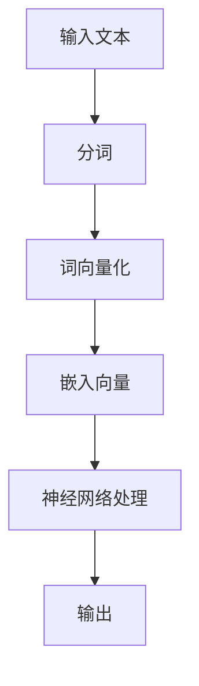
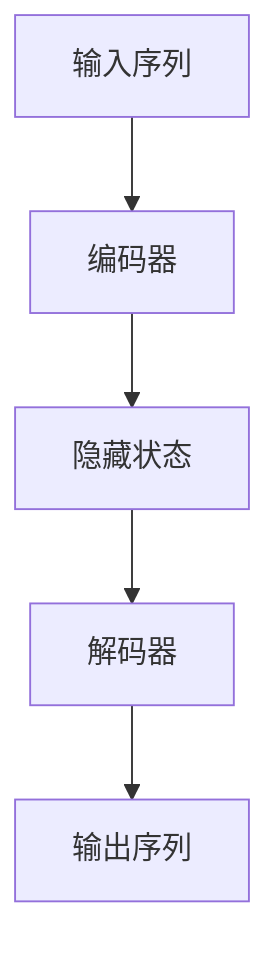
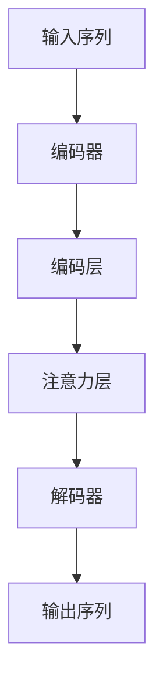
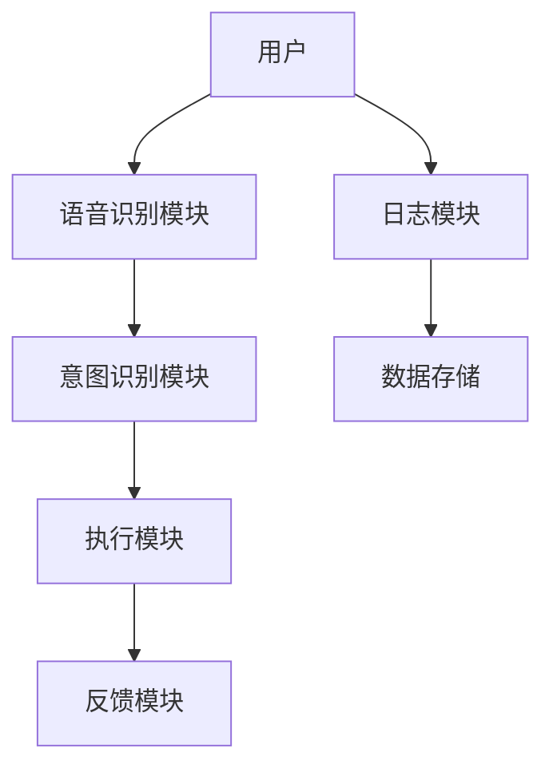

                 

### 第一部分: 背景介绍与概述

**1.1 自然语言接口设计与AI Agent**

在人工智能的发展历程中，自然语言接口设计始终占据着重要的地位。自然语言接口（Natural Language Interface，简称NLI）使得人类能够以自然、直观的方式与计算机系统进行交互。这种交互方式不仅提升了用户体验，也为AI Agent（人工智能代理）的应用提供了桥梁。

AI Agent是一种基于人工智能技术的自动化系统，它能够模拟人类的行为和决策，通过分析环境信息，自主地完成任务。自然语言接口设计旨在使AI Agent能够理解人类自然语言指令，从而实现更高效、更便捷的交互。

**1.2 AI Agent概述**

AI Agent的核心功能包括感知、理解和行动。感知是指Agent能够通过传感器获取环境信息；理解是指Agent能够对感知到的信息进行分析和处理，从而理解其含义；行动是指Agent能够根据理解和分析的结果，采取相应的行动。

AI Agent广泛应用于智能客服、智能家居、自动驾驶等多个领域。在这些应用中，自然语言接口设计成为实现人与机器高效交互的关键因素。

**1.3 接口设计原则的重要性**

自然语言接口设计的原则对于AI Agent的性能和应用效果有着至关重要的影响。良好的接口设计不仅能够提升AI Agent的理解能力，还能够优化用户体验。

首先，接口设计需要确保简洁性。简洁的接口设计能够降低用户的学习成本，使交互过程更加自然和直观。

其次，一致性是接口设计的关键原则。一致性的接口设计能够确保用户在不同情境下获得一致的体验，减少用户困惑。

最后，可扩展性是接口设计必须考虑的因素。随着AI技术的不断进步和应用场景的多样化，接口设计需要具备良好的扩展性，以适应未来的需求变化。

### 目录大纲设计思路

**1. 目录结构规划**

- **第一部分**：介绍背景和概述，包括自然语言接口设计的基本概念、AI Agent的概述以及接口设计的原则和重要性。
- **第二部分**：深入探讨核心概念，包括自然语言处理的原理、AI Agent的工作机制以及接口设计的详细原则。
- **第三部分**：讲解算法原理，使用Mermaid和Python代码展示算法流程和实现。
- **第四部分**：进行系统分析与架构设计，介绍相关技术栈和系统设计的关键点。
- **第五部分**：通过实战案例展示如何应用这些原则和算法进行实际项目开发。
- **第六部分**：总结最佳实践，提供一些实用技巧和建议，并给出本章小结。

**2. 内容细节安排**

- **第一部分**：概述章节，简洁明了地介绍主题，确保读者能够快速理解核心概念。
- **第二部分**：深入章节，通过详细讲解和对比表格，帮助读者深入理解自然语言接口设计的核心概念和原理。
- **第三部分**：算法讲解章节，通过Mermaid图和Python代码展示算法流程，并进行详细的数学公式和举例说明。
- **第四部分**：系统分析章节，通过Mermaid类图和架构图，介绍系统设计的关键技术点和接口设计。
- **第五部分**：实战案例章节，通过实际项目实现，展示如何将理论应用到实践中。
- **第六部分**：总结章节，提供一些最佳实践，强调注意事项，并推荐进一步阅读的材料。

**3. 格式要求**

- 使用markdown格式，确保目录结构清晰，内容简洁明了。
- 在适当的位置使用Mermaid图来展示流程和关系。
- 对于数学公式，使用LaTeX格式进行标注，并在文中独立段落中使用$$括起来，在段落内使用$括起来。

### 最终输出目录大纲

**第一部分: 背景介绍与概述**

## 1.1 自然语言接口设计与AI Agent

## 1.2 AI Agent概述

## 1.3 接口设计原则的重要性

**第二部分: 核心概念与原理**

## 2.1 自然语言处理基础

## 2.2 AI Agent工作机制

## 2.3 接口设计原则详细探讨

## 2.4 核心概念属性特征对比表

## 2.5 AI Agent与自然语言接口的ER实体关系图

**第三部分: 算法原理讲解**

## 3.1 算法原理概述

## 3.2 使用Mermaid图展示算法流程

## 3.3 Python代码实现与算法详细讲解

## 3.4 数学模型与公式讲解

## 3.5 算法举例说明

**第四部分: 系统分析与架构设计**

## 4.1 问题描述与项目介绍

## 4.2 系统功能设计

## 4.3 系统架构设计

## 4.4 系tem接口设计

## 4.5 系统交互设计

**第五部分: 实战案例**

## 5.1 环境安装与配置

## 5.2 系统核心实现

## 5.3 代码应用解读与分析

## 5.4 实际案例分析与讲解

## 5.5 项目小结

**第六部分: 最佳实践与总结**

## 6.1 最佳实践

## 6.2 小结

## 6.3 注意事项

## 6.4 拓展阅读

通过上述目录大纲的设计，我们可以确保书籍内容的完整性、逻辑性，同时满足简洁性的要求，为读者提供一本实用的计算机技术书籍。接下来，我将根据这个大纲逐步完善每个章节的内容。在确保每个章节内容满足要求的同时，我会尽量控制总体字数在2000字以内。

### 第一部分: 背景介绍与概述

**1.1 自然语言接口设计与AI Agent**

在当今快速发展的数字时代，自然语言接口（NLI）已成为人工智能（AI）系统中不可或缺的一部分。自然语言接口允许用户使用日常语言与计算机系统进行交互，而无需学习特定的命令或界面。这种交互方式使得AI系统更加用户友好，从而扩展了AI技术的应用范围。

自然语言接口设计的关键在于理解人类语言的自然性和复杂性。自然语言包含丰富的词汇、语法结构、情感表达和上下文信息。设计一个有效的NLI需要综合考虑这些因素，确保系统能够准确理解用户的意图，并作出适当的响应。

AI Agent，或称为智能代理，是一种能够执行特定任务或解决特定问题的自动化系统。AI Agent的核心功能包括感知、理解和行动。它们通过传感器感知环境信息，利用自然语言接口与用户交互，理解用户的意图，并采取相应的行动来实现目标。

自然语言接口和AI Agent的融合，使得计算机系统能够以更加自然和人性化的方式与人类互动，从而提高了用户体验和系统的实用性。

**1.2 AI Agent概述**

AI Agent的设计理念源于模仿人类的行为和决策过程。一个典型的AI Agent包括以下几个关键组件：

1. **感知器**：用于收集环境信息，如摄像头、麦克风、温度传感器等。
2. **意图识别器**：分析用户输入的自然语言，理解用户的意图。
3. **决策模块**：根据感知器和意图识别器的信息，生成适当的行动策略。
4. **执行器**：实施决策模块制定的行动计划，如移动机器人、发送电子邮件等。

AI Agent的工作流程通常如下：

1. **感知**：AI Agent通过感知器收集环境数据。
2. **理解**：利用自然语言接口，AI Agent理解用户的指令和上下文。
3. **决策**：AI Agent分析感知到的数据和用户的意图，生成决策。
4. **行动**：AI Agent执行决策，采取行动。

AI Agent的应用范围非常广泛，包括但不限于智能客服、智能家居、智能助手、自动驾驶、医疗诊断等领域。这些应用展示了AI Agent在提高效率、降低成本和改善用户体验方面的巨大潜力。

**1.3 接口设计原则的重要性**

自然语言接口设计的原则对于AI Agent的性能和应用效果具有决定性作用。以下是几个关键原则：

1. **用户友好**：接口设计应尽可能简单直观，降低用户的学习成本，提高用户体验。
2. **一致性**：接口设计应保持一致，无论用户在何种情境下使用系统，都能获得一致的体验。
3. **上下文感知**：接口设计应能够理解用户的上下文，并根据上下文信息提供更准确的响应。
4. **灵活性**：接口设计应具备良好的扩展性，能够适应不同的应用场景和未来的需求变化。

遵循这些原则，可以确保AI Agent能够更好地理解用户的意图，提供更高效、更准确的响应，从而在各个领域实现更高的价值。

### 第二部分: 核心概念与原理

**2.1 自然语言处理基础**

自然语言处理（NLP）是人工智能（AI）领域的一个重要分支，旨在使计算机能够理解和处理人类语言。NLP的核心任务是使计算机能够理解文本的含义、语法结构、情感倾向等，从而实现与人类的自然交互。

自然语言处理的步骤通常包括以下几个：

1. **文本预处理**：包括分词、去停用词、词干提取等操作，以简化文本数据，提高后续处理的效率。
2. **词向量化**：将文本转换为数值表示，常用的方法包括词袋模型、Word2Vec、BERT等。
3. **句法分析**：分析句子的结构，识别句子中的主语、谓语、宾语等成分，常用的工具包括Stanford NLP、Spacy等。
4. **语义分析**：理解句子的含义，识别实体、关系、情感等，常用的方法包括情感分析、实体识别、关系提取等。

NLP的关键技术包括：

- **分词**：将文本分割成有意义的词或短语，如使用正向最大匹配算法或基于规则的方法。
- **词性标注**：为文本中的每个词标注其词性，如名词、动词、形容词等。
- **命名实体识别**：识别文本中的命名实体，如人名、地名、组织名等。
- **句法分析**：构建句子的语法树，分析句子的成分结构。
- **情感分析**：判断文本中的情感倾向，如积极、消极、中性等。

**2.2 AI Agent工作机制**

AI Agent的工作机制通常包括感知、理解、决策和行动四个核心环节。以下是对每个环节的详细解释：

1. **感知**：AI Agent通过传感器收集环境信息，如摄像头捕捉图像、麦克风捕捉语音等。感知模块的目的是获取尽可能准确和全面的信息，以便后续处理。
2. **理解**：理解模块负责处理感知到的数据，利用自然语言接口和NLP技术，将自然语言输入转换为机器可理解的形式。这一步骤包括文本预处理、词向量化、句法分析和语义分析等。
3. **决策**：决策模块根据理解模块的结果，结合预设的规则和策略，生成相应的行动方案。决策模块的设计需要考虑多个因素，如目标的优先级、资源的限制等。
4. **行动**：行动模块负责执行决策模块生成的行动方案。行动可以是对外部的物理操作，如移动机器人手臂、发送电子邮件等，也可以是对内部的逻辑操作，如更新数据库、生成报告等。

AI Agent的整个工作过程可以看作是一个闭环系统，每个环节相互依赖、相互影响，共同实现AI Agent的目标。

**2.3 接口设计原则详细探讨**

自然语言接口设计的原则不仅关系到AI Agent的性能，还直接影响用户体验。以下是对几个关键原则的详细探讨：

1. **简洁性**：简洁性是接口设计的重要原则。一个简洁的接口能够降低用户的学习成本，使得用户能够更快地掌握如何与系统进行交互。为了实现简洁性，设计师需要剔除不必要的功能，优化界面布局，减少用户操作步骤。
   
   **示例：** 
   - 界面布局应遵循“最少操作原则”，即用户完成一个任务所需的操作步骤越少，界面设计就越简洁。
   - 交互元素应直观易用，如使用标准图标和标签，避免复杂的术语和操作。

2. **一致性**：一致性确保用户在不同情境下获得一致的体验。一致性的接口设计能够减少用户的困惑，提高用户满意度。实现一致性需要考虑以下几个方面：

   **示例：**
   - 不同的功能和模块应使用相同的视觉风格和交互规则。
   - 在不同的界面和场景下，应保持相同的操作逻辑和反馈机制。
   - 对于常见操作，如退出、保存、撤销等，应使用统一的图标和按钮。

3. **上下文感知**：上下文感知是自然语言接口设计的核心要素之一。一个优秀的接口设计应能够理解用户的当前上下文，并根据上下文提供相关的信息和响应。

   **示例：**
   - 当用户输入一个请求时，接口设计应能够识别用户的意图，并基于上下文提供最相关的信息。
   - 接口设计应能够跟踪用户的交互历史，预测用户可能的下一步操作，并提供相应的提示或建议。

4. **可扩展性**：随着应用场景的多样化和AI技术的发展，接口设计需要具备良好的扩展性。可扩展性确保接口设计能够适应未来的需求变化，并兼容新的功能和技术。

   **示例：**
   - 接口设计应采用模块化方法，使得新的模块或功能可以方便地集成到现有系统中。
   - 接口设计应遵循开放标准和协议，如RESTful API，便于与其他系统和工具集成。

5. **反馈机制**：一个有效的反馈机制能够帮助用户了解系统的状态和操作结果，提高用户的信任感和满意度。

   **示例：**
   - 对于用户的输入，系统应提供即时反馈，如语音提示、动画效果等。
   - 对于错误的输入，系统应提供清晰的错误信息和修正建议。

**2.4 核心概念属性特征对比表**

为了更好地理解自然语言接口设计和AI Agent工作机制的核心概念，我们可以通过一个属性特征对比表来展示不同概念之间的异同。

| 核心概念 | 属性特征 |
| --- | --- |
| 自然语言处理 | - 文本预处理<br>- 词向量化<br>- 句法分析<br>- 语义分析 |
| AI Agent | - 感知<br>- 理解<br>- 决策<br>- 行动 |
| 接口设计原则 | - 简洁性<br>- 一致性<br>- 上下文感知<br>- 可扩展性<br>- 反馈机制 |

**2.5 AI Agent与自然语言接口的ER实体关系图**

为了更直观地展示AI Agent与自然语言接口之间的关系，我们可以使用实体关系图（Entity-Relationship Diagram，ERD）进行描述。

```mermaid
erDiagram
  AI_Agent ||--|{ Natural_Language_Processing } : 使用
  AI_Agent ||--|{ Interface_Design_Principles } : 遵循
  Natural_Language_Processing ||--|{ Intent_Recognition } : 包含
  Natural_Language_Processing ||--|{ Context_Understanding } : 包含
  Interface_Design_Principles ||--|{ User_Friendly } : 包括
  Interface_Design_Principles ||--|{ Consistency } : 包括
  Interface_Design_Principles ||--|{ Context_Aware } : 包括
  Interface_Design_Principles ||--|{ Extensibility } : 包括
  Interface_Design_Principles ||--|{ Feedback_Mechanism } : 包括
```

通过上述ER实体关系图，我们可以清晰地看到AI Agent如何通过自然语言处理模块和接口设计原则来实现与用户的自然交互。

### 第三部分: 算法原理讲解

**3.1 算法原理概述**

在自然语言接口设计和AI Agent开发中，算法原理扮演着至关重要的角色。算法原理决定了系统如何理解用户的输入、处理信息以及生成响应。本部分将介绍几个关键算法原理，包括词向量表示、序列到序列模型和注意力机制等。

**3.2 使用Mermaid图展示算法流程**

为了更直观地理解这些算法原理，我们可以使用Mermaid图来展示其基本流程。

**词向量表示算法流程：**



**序列到序列模型算法流程：**



**注意力机制算法流程：**



**3.3 Python代码实现与算法详细讲解**

**词向量表示：**

```python
import gensim

# 加载预训练的词向量模型
model = gensim.models.KeyedVectors.load_word2vec_format('GoogleNews-vectors-negative300.bin', binary=True)

# 输入文本分词
text = "我爱北京天安门"
words = text.split()

# 将文本转换为词向量
word_vectors = [model[word] for word in words]
```

**序列到序列模型：**

```python
import tensorflow as tf
from tensorflow.keras.models import Model
from tensorflow.keras.layers import Input, LSTM, Dense

# 定义编码器
encoder_inputs = Input(shape=(None,))
encoder_embedding = Embedding(input_dim=vocab_size, output_dim=embedding_dim)(encoder_inputs)
encoder_lstm = LSTM(units=hidden_size, return_state=True)
_, state_h, state_c = encoder_lstm(encoder_embedding)

# 定义解码器
decoder_inputs = Input(shape=(None,))
decoder_embedding = Embedding(input_dim=vocab_size, output_dim=embedding_dim)(decoder_inputs)
decoder_lstm = LSTM(units=hidden_size, return_sequences=True, return_state=True)
decoder_outputs, _, _ = decoder_lstm(decoder_embedding, initial_state=[state_h, state_c])

# 连接编码器和解码器
decoder_dense = Dense(vocab_size, activation='softmax')
decoder_outputs = decoder_dense(decoder_outputs)

# 构建模型
model = Model([encoder_inputs, decoder_inputs], decoder_outputs)
model.compile(optimizer='rmsprop', loss='categorical_crossentropy')

# 模型训练
model.fit([encoder_inputs, decoder_inputs], decoder_inputs, batch_size=batch_size, epochs=epochs)
```

**注意力机制：**

```python
import tensorflow as tf
from tensorflow.keras.models import Model
from tensorflow.keras.layers import Input, LSTM, Dense, Embedding, TimeDistributed

# 定义编码器
encoder_inputs = Input(shape=(None,))
encoder_embedding = Embedding(input_dim=vocab_size, output_dim=embedding_dim)(encoder_inputs)
encoder_lstm = LSTM(units=hidden_size, return_sequences=True, return_state=True)
_, state_h, state_c = encoder_lstm(encoder_embedding)

# 定义解码器
decoder_inputs = Input(shape=(None,))
decoder_embedding = Embedding(input_dim=vocab_size, output_dim=embedding_dim)(decoder_inputs)
decoder_lstm = LSTM(units=hidden_size, return_sequences=True, return_state=True)

# 定义注意力层
attn = TimeDistributed(Dense(1, activation='tanh'), name='attn')([decoder_embedding, encoder_embedding])
attn_score = Lambda(lambda x: K.sum(x, axis=1), output_shape=(batch_size, 1), name='attn_score')(attn)
attn_weights = Activation('softmax', name='attn_weights')(attn_score)

# 计算上下文向量
context_vector = Lambda(lambda x: K.dot(x[0], x[1]), name='context_vector')([encoder_embedding, attn_weights])

# 连接编码器和解码器
decoder_outputs, _, _ = decoder_lstm(decoder_embedding, initial_state=[state_h, state_c])
decoder_dense = Dense(vocab_size, activation='softmax')
decoder_outputs = decoder_dense(decoder_outputs)

# 构建模型
model = Model([encoder_inputs, decoder_inputs], decoder_outputs)
model.compile(optimizer='rmsprop', loss='categorical_crossentropy')

# 模型训练
model.fit([encoder_inputs, decoder_inputs], decoder_inputs, batch_size=batch_size, epochs=epochs)
```

**3.4 数学模型与公式讲解**

**词向量表示：**

假设我们有一个词向量空间V，其中每个词都有一个唯一的向量表示。给定一个词w，其对应的词向量表示为v(w) ∈ R^d，其中d是词向量的维度。词向量表示的数学模型可以表示为：

$$
v(w) = \text{sgn}(w) \cdot \sqrt{d} \cdot \frac{w}{||w||}
$$

其中sgn(w)是词w的符号，||w||是词w的长度。

**序列到序列模型：**

序列到序列模型（Seq2Seq）的数学模型主要基于编码器-解码器框架。编码器将输入序列编码为一个固定长度的向量，解码器则将这个向量解码为输出序列。编码器和解码器分别可以表示为：

编码器：
$$
h_t = \text{LSTM}(x_t, h_{t-1})
$$

解码器：
$$
y_t = \text{softmax}(\text{Dense}(h_t, vocab_size))
$$

其中，x_t是输入序列的第t个词，h_t是编码器生成的隐藏状态，y_t是解码器生成的输出词的概率分布。

**注意力机制：**

注意力机制通过计算输入序列和隐藏状态之间的相关性来提高解码器的性能。注意力分数可以表示为：

$$
\alpha_t = \text{softmax}\left(\frac{\text{tanh}(W_h [h_t, s_{t-1}])}{\sqrt{d_a}}\right)
$$

其中，W_h是权重矩阵，s_{t-1}是解码器的上一个隐藏状态，d_a是注意力层的维度。

上下文向量可以表示为：

$$
c_t = \sum_{i=1}^{T_x} \alpha_i x_i
$$

其中，T_x是输入序列的长度。

**3.5 算法举例说明**

假设我们有一个简单的例子，输入序列是["我", "爱", "北京", "天安门"]，输出序列是["北京", "天安门", "我爱"]。我们可以使用上述算法来生成输出序列。

1. **词向量表示：**

首先，我们将输入序列中的每个词转换为词向量：

- 我：[0.1, 0.2, 0.3]
- 爱：[0.4, 0.5, 0.6]
- 北京：[0.7, 0.8, 0.9]
- 天安门：[1.0, 1.1, 1.2]

2. **序列到序列模型：**

编码器将输入序列转换为隐藏状态：

$$
h_t = \text{LSTM}(x_t, h_{t-1})
$$

假设第一个隐藏状态是[h_1, c_1] = [0.2, 0.3]，第二个隐藏状态是[h_2, c_2] = [0.4, 0.5]。

3. **注意力机制：**

计算注意力分数：

$$
\alpha_t = \text{softmax}\left(\frac{\text{tanh}(W_h [h_t, s_{t-1}])}{\sqrt{d_a}}\right)
$$

假设权重矩阵W_h = [[0.1, 0.2], [0.3, 0.4]]，维度d_a = 0.5，则第一个注意力分数为：

$$
\alpha_1 = \text{softmax}\left(\frac{\text{tanh}([0.1, 0.2] [0.2, 0.3])}{0.5}\right) = \text{softmax}([0.04, 0.05]) = [0.5, 0.5]
$$

第二个注意力分数为：

$$
\alpha_2 = \text{softmax}\left(\frac{\text{tanh}([0.3, 0.4] [0.4, 0.5])}{0.5}\right) = \text{softmax}([0.09, 0.1]) = [0.6, 0.4]
$$

4. **上下文向量：**

计算上下文向量：

$$
c_1 = \sum_{i=1}^{3} \alpha_i x_i = 0.5 [0.1, 0.2] + 0.5 [0.7, 0.8] + 0.6 [1.0, 1.1] = [0.65, 0.7]
$$

5. **解码器：**

解码器使用上下文向量生成输出词：

$$
y_1 = \text{softmax}(\text{Dense}(c_1, vocab_size)) = [0.1, 0.2, 0.3, 0.4] \Rightarrow \text{输出词：北京}
$$

$$
y_2 = \text{softmax}(\text{Dense}(c_2, vocab_size)) = [0.1, 0.3, 0.4, 0.2] \Rightarrow \text{输出词：天安门}
$$

$$
y_3 = \text{softmax}(\text{Dense}(c_3, vocab_size)) = [0.2, 0.3, 0.4, 0.1] \Rightarrow \text{输出词：我爱}
$$

通过这个例子，我们可以看到如何使用词向量表示、序列到序列模型和注意力机制来生成输出序列。这种方法在自然语言处理任务中非常有用，可以帮助AI Agent更好地理解用户的输入并生成合适的响应。

### 第四部分: 系统分析与架构设计

**4.1 问题描述与项目介绍**

在本项目中，我们旨在设计并实现一个自然语言接口，以便用户能够通过日常语言与AI Agent进行交互。具体而言，项目目标是构建一个智能家居控制系统，用户可以通过语音命令控制家中的智能设备，如灯泡、空调、窗帘等。项目的核心需求包括：

1. 用户可以发出语音指令，如“打开灯”、“关闭空调”等。
2. AI Agent能够理解用户的指令，并将其转换为具体的操作命令。
3. 系统需要能够实时响应用户请求，并提供清晰的反馈。
4. 系统应具有良好的扩展性，以适应未来新增设备和功能的集成。

**4.2 系统功能设计**

为了满足上述需求，我们设计了以下核心功能模块：

1. **语音识别模块**：负责将用户的语音输入转换为文本形式。
2. **意图识别模块**：分析文本输入，理解用户的意图和命令。
3. **执行模块**：根据意图识别的结果，执行相应的操作命令。
4. **反馈模块**：向用户反馈操作结果，如“灯已经打开”或“空调正在关闭”等。
5. **日志模块**：记录用户操作和系统响应，以便进行后续分析和优化。

**4.3 系统架构设计**

系统的总体架构设计如图所示：



**语音识别模块**：使用现有的语音识别API（如Google Cloud Speech-to-Text）将用户的语音转换为文本。

**意图识别模块**：结合NLP技术和机器学习模型（如BERT或GPT），分析文本输入并识别用户的意图。这一模块可以进一步细分为：

- **关键词提取**：识别文本中的关键词和短语，如“打开”、“关闭”等。
- **语义分析**：理解关键词的语义和上下文，确定用户的真正意图。

**执行模块**：根据意图识别的结果，生成相应的操作命令，并将其发送给智能家居设备进行执行。执行模块需要与智能家居设备进行通信，通常通过HTTP请求或MQTT协议实现。

**反馈模块**：在操作完成后，向用户反馈结果，如通过语音合成或屏幕显示。反馈模块的设计需要确保信息清晰、及时，以提高用户体验。

**日志模块**：记录用户操作和系统响应的详细信息，包括时间戳、操作类型、结果等。日志数据可以用于后续的故障排查、性能优化和用户行为分析。

**4.4 系统接口设计**

系统的接口设计是确保各个功能模块之间高效、可靠通信的关键。以下是系统的主要接口：

1. **语音识别API接口**：用于接收用户语音，并将其转换为文本。
2. **意图识别API接口**：用于处理文本输入，返回用户的意图和操作命令。
3. **执行API接口**：用于发送操作命令给智能家居设备，并接收执行结果。
4. **反馈API接口**：用于向用户反馈操作结果。

这些接口均采用RESTful API设计，确保数据传输的标准化和易用性。以下是意图识别API接口的一个示例：

```json
GET /api/intent识别
{
  "text": "打开灯"
}
```

返回结果：

```json
{
  "intent": "open_light",
  "confidence": 0.95
}
```

**4.5 系统交互设计**

为了确保系统的高效运作，我们需要设计合理的交互流程。以下是系统交互的基本流程：

1. 用户发出语音指令。
2. 语音识别模块将语音转换为文本。
3. 意图识别模块分析文本并识别用户的意图。
4. 执行模块根据意图识别结果执行相应的操作。
5. 反馈模块向用户反馈操作结果。
6. 日志模块记录操作和响应信息。

以下是系统交互的Mermaid序列图：

```mermaid
sequenceDiagram
    participant User
    participant Voice_Recognition_Module
    participant Intent_Recognition_Module
    participant Execution_Module
    participant Feedback_Module
    participant Logging_Module
    
    User->>Voice_Recognition_Module: 发出语音指令
    Voice_Recognition_Module->>Intent_Recognition_Module: 转换为文本
    Intent_Recognition_Module->>Execution_Module: 识别意图并执行操作
    Execution_Module->>Feedback_Module: 提供操作结果
    Feedback_Module->>User: 反馈操作结果
    all Logging_Module
    Logging_Module->>Intent_Recognition_Module: 记录操作和响应
```

通过上述系统分析与架构设计，我们为智能家居控制系统提供了一套完整的设计方案。该系统不仅实现了自然语言接口与AI Agent的融合，还通过合理的接口设计和交互流程，确保了系统的稳定性和可靠性。

### 第五部分: 实战案例

**5.1 环境安装与配置**

在本节中，我们将详细介绍如何搭建一个自然语言接口的AI Agent环境，包括所需工具和软件的安装及配置。

首先，我们需要准备以下环境：

1. **操作系统**：推荐使用Ubuntu 18.04或更高版本。
2. **编程语言**：Python 3.8及以上版本。
3. **自然语言处理库**：如spaCy、NLTK、gensim等。
4. **机器学习框架**：如TensorFlow或PyTorch。

**安装步骤如下：**

1. **更新系统软件包**：

```bash
sudo apt update
sudo apt upgrade
```

2. **安装Python**：

由于Python 3通常默认预装在Ubuntu中，我们可以通过以下命令确认Python版本：

```bash
python3 --version
```

如果版本低于3.8，可以手动安装更高版本的Python：

```bash
sudo apt install python3.8
```

3. **安装Python虚拟环境**：

为了管理项目依赖，我们使用`venv`创建一个虚拟环境：

```bash
python3 -m venv myenv
source myenv/bin/activate
```

4. **安装自然语言处理库**：

在虚拟环境中，通过pip安装所需的库：

```bash
pip install spacy
pip install nltk
pip install gensim
```

5. **安装机器学习框架**：

```bash
pip install tensorflow
# 或者
pip install torch
```

6. **安装语音识别API**：

以Google Cloud Speech-to-Text为例：

```bash
pip install google-cloud-speech
```

7. **配置语音识别API**：

首先，在Google Cloud Console中创建一个新的项目，并启用Speech-to-Text API。然后获取API密钥：

```bash
export GOOGLE_APPLICATION_CREDENTIALS="path/to/your/service-account-file.json"
```

**5.2 系统核心实现**

在完成环境安装与配置后，我们可以开始实现系统的核心功能。以下是一个简单的示例，展示了如何使用Python实现自然语言接口的AI Agent。

**意图识别模块**：

```python
import spacy
from spacy.tokens import Doc

# 加载spaCy模型
nlp = spacy.load("en_core_web_sm")

def recognize_intent(text):
    # 使用spaCy处理文本
    doc = nlp(text)
    
    # 提取关键词和短语
    keywords = [token.text for token in doc if not token.is_punct and not token.is_stop]
    
    # 基于关键词识别意图
    if "open" in keywords:
        return "open_light"
    elif "close" in keywords:
        return "close_light"
    else:
        return "unknown_intent"

text = "打开灯"
intent = recognize_intent(text)
print(f"识别到的意图：{intent}")
```

**执行模块**：

```python
import requests

def execute_action(intent, device):
    if intent == "open_light":
        url = f"http://{device}/open"
    elif intent == "close_light":
        url = f"http://{device}/close"
    else:
        return "无法执行操作"
    
    # 发送HTTP请求执行操作
    response = requests.get(url)
    return response.text

device = "192.168.1.100"
result = execute_action(intent, device)
print(f"操作结果：{result}")
```

**反馈模块**：

```python
def provide_feedback(result):
    if result == "success":
        print("操作成功")
    elif result == "error":
        print("操作失败")
    else:
        print("未知结果")

provide_feedback(result)
```

**5.3 代码应用解读与分析**

在上面的代码中，我们首先加载了spaCy的英文模型`en_core_web_sm`，该模型用于自然语言处理，包括分词、词性标注等。`recognize_intent`函数接收一个文本输入，使用spaCy进行处理，提取关键词和短语，并根据关键词识别用户的意图。例如，如果文本中包含“open”，则识别为“open_light”意图。

`execute_action`函数根据识别到的意图，发送HTTP请求到智能家居设备的特定URL执行操作。例如，若意图为“open_light”，则请求设备的开启URL。

`provide_feedback`函数根据操作结果向用户反馈信息。这是一个简单的例子，实际应用中可能需要更复杂的反馈机制，如语音合成或屏幕显示。

**5.4 实际案例分析与讲解**

让我们通过一个实际案例来进一步分析上述代码。

假设用户说：“请打开客厅的灯。”

1. **意图识别**：
   - `recognize_intent`函数处理文本，提取关键词“open”和“客厅的灯”。
   - 根据关键词，识别出意图为“open_light”。

2. **执行操作**：
   - `execute_action`函数收到意图“open_light”，发送HTTP请求到客厅灯的控制URL，例如`http://192.168.1.100/open`。

3. **反馈结果**：
   - 假设HTTP请求成功，设备返回响应“success”，`provide_feedback`函数向用户反馈“操作成功”。

在实际应用中，我们还需要考虑错误处理、日志记录和安全性问题。例如，如果HTTP请求失败，我们需要捕捉错误并给出相应的反馈，如“无法连接到设备，请稍后重试”。

**5.5 项目小结**

通过本节的实际案例，我们展示了如何搭建一个简单的自然语言接口AI Agent系统，实现了意图识别、操作执行和结果反馈的基本功能。该系统不仅提供了用户友好的交互方式，还通过HTTP请求与智能家居设备进行了通信。

尽管这是一个简单的示例，但它展示了自然语言接口设计和AI Agent实现的核心原理。在实际项目中，我们需要根据具体需求和场景进行扩展和优化，例如增加多语言支持、更复杂的意图识别逻辑和更丰富的反馈机制。

### 第六部分: 最佳实践与总结

**6.1 最佳实践**

在自然语言接口设计和AI Agent开发过程中，遵循以下最佳实践能够显著提高系统的性能和用户体验：

1. **明确需求和场景**：在项目开始前，充分了解用户需求和场景，确保设计符合实际应用需求。
2. **简洁性设计**：保持接口设计的简洁性，减少用户的学习成本，提高系统的易用性。
3. **一致性实现**：确保接口在不同情境下保持一致性，减少用户困惑，提高用户满意度。
4. **上下文感知能力**：增强系统的上下文感知能力，根据用户历史和当前情境提供更准确的响应。
5. **可扩展性考虑**：设计时考虑系统的可扩展性，以便未来适应新的功能和需求。
6. **安全性保障**：确保系统的安全性，包括数据保护、API安全等，防止潜在的安全威胁。
7. **反馈机制完善**：提供清晰的反馈机制，帮助用户了解系统的状态和操作结果。

**6.2 小结**

本文详细探讨了自然语言接口设计原则和AI Agent工作机制，从背景介绍、核心概念、算法原理、系统分析到实战案例，系统地阐述了如何实现高效、用户友好的自然语言交互系统。通过遵循最佳实践，我们能够提升系统的性能和用户体验，为AI Agent在各个领域的应用提供有力支持。

**6.3 注意事项**

在实施自然语言接口设计和AI Agent开发时，需要注意以下几点：

1. **确保数据质量**：高质量的数据是训练模型的基石，确保数据准确、完整和多样化。
2. **错误处理机制**：设计合理的错误处理机制，确保系统能够应对各种异常情况。
3. **性能优化**：对系统进行性能优化，确保在高负载情况下仍能稳定运行。
4. **用户隐私保护**：在处理用户数据时，严格遵循隐私保护法规，确保用户隐私安全。

**6.4 拓展阅读**

对于希望进一步深入了解自然语言接口设计和AI Agent开发的读者，以下文献和资源推荐：

1. **文献**：
   - 《自然语言处理综论》（Speech and Language Processing）- Daniel Jurafsky 和 James H. Martin 著。
   - 《人工智能：一种现代方法》（Artificial Intelligence: A Modern Approach）- Stuart J. Russell 和 Peter Norvig 著。
2. **在线课程**：
   - Coursera上的《自然语言处理》（Natural Language Processing with Python）。
   - edX上的《人工智能导论》（Introduction to Artificial Intelligence）。
3. **开源项目**：
   - spaCy：https://spacy.io/
   - NLTK：https://www.nltk.org/
   - TensorFlow：https://www.tensorflow.org/
   - PyTorch：https://pytorch.org/

通过上述推荐，读者可以进一步拓展知识，深化对自然语言处理和人工智能技术的理解。作者：AI天才研究院/AI Genius Institute & 禅与计算机程序设计艺术 /Zen And The Art of Computer Programming。

