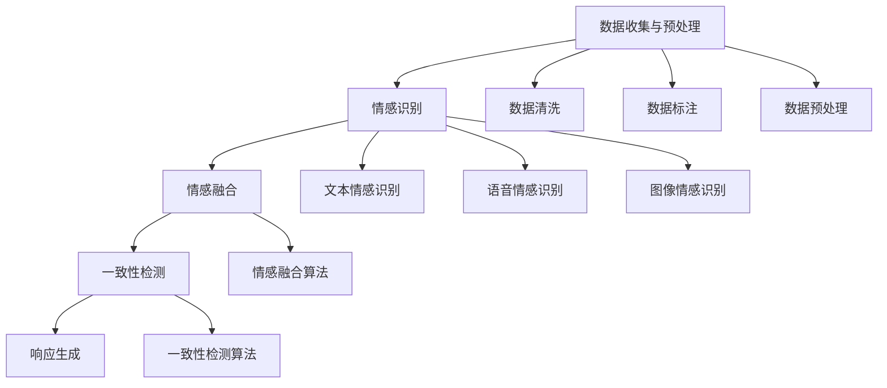
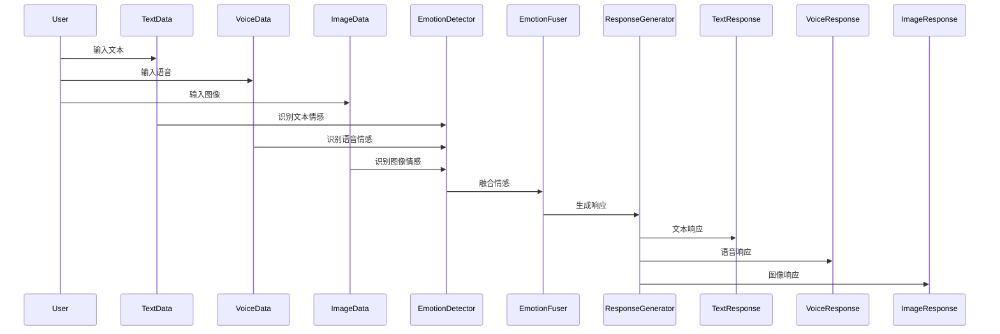
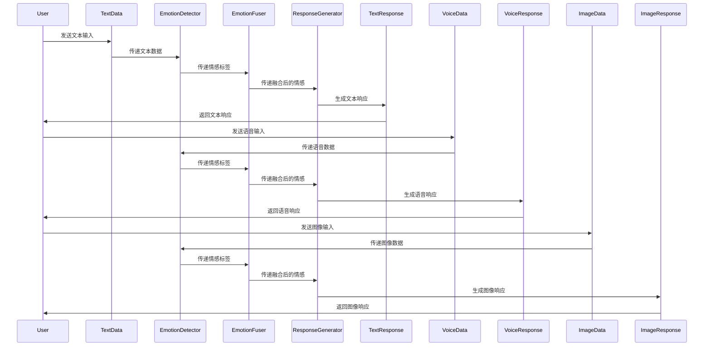

                 

### 引言

随着人工智能（AI）技术的飞速发展，AI Agent作为智能系统的核心组件，正逐渐渗透到我们日常生活的方方面面。从智能家居到自动驾驶，从医疗诊断到金融分析，AI Agent的应用范围日益广泛。然而，在实现这些应用的过程中，如何确保AI Agent在多模态环境下表现出的情感一致性，成为了一个亟待解决的重要问题。

跨模态情感一致性检测，旨在使AI Agent能够理解并适应用户在不同模态（如语音、文字、图像等）表达的情感，并在交互过程中保持情感的一致性。这不仅能提升用户体验，还能增强AI Agent的可靠性和智能性。因此，本文将深入探讨如何开发AI Agent的跨模态情感一致性检测技术。

本文将首先介绍跨模态情感一致性检测的核心概念、背景及其重要性。接着，我们将详细讲解算法原理，包括算法流程、Python源代码实现和数学模型。随后，文章将分析系统架构，介绍问题场景、功能设计、架构设计和接口设计。在此基础上，我们将通过项目实战展示如何应用这些技术，并进行案例分析和详细讲解。最后，文章将总结最佳实践，给出注意事项和拓展阅读建议。

通过本文的阅读，读者将全面了解跨模态情感一致性检测的技术原理和应用实践，为开发具备高度情感一致性的AI Agent奠定坚实基础。

关键词：AI Agent，跨模态情感一致性检测，算法原理，系统架构，项目实战，最佳实践

摘要：本文系统地介绍了开发AI Agent的跨模态情感一致性检测技术。首先，文章阐述了跨模态情感一致性检测的背景和重要性，接着详细讲解了算法原理，包括流程、代码实现和数学模型。随后，文章分析了系统架构，涵盖了问题场景、功能设计、架构设计和接口设计。通过项目实战，文章展示了如何将理论应用到实际中，并进行了详细案例分析。最后，文章总结了最佳实践，为读者提供了进一步学习的方向。

----------------------------------------------------------------

## 背景与核心概念

跨模态情感一致性检测，是近年来人工智能领域的一个研究热点，它旨在使AI Agent能够理解并适应用户在不同模态（如语音、文字、图像等）表达的情感，并在交互过程中保持情感的一致性。这一技术的提出，源于对人类情感表达多样性和复杂性的认知，以及人工智能在多模态交互中的实际需求。

### 问题背景

人类情感表达具有多样性和复杂性，不仅可以通过语言（文字和语音）表达，还可以通过肢体语言、面部表情、声音语调等非语言方式表达。在现实场景中，用户可能会通过多种模态表达情感，如通过文字表达愤怒，通过语音表达紧张。如果AI Agent不能理解并适应用户的跨模态情感，将会导致交互中的误解和不适，影响用户体验。

此外，随着智能设备的普及和智能交互的应用场景增多，AI Agent与用户的交互模式也越来越多样化。从语音助手、聊天机器人到虚拟助手，AI Agent需要能够理解用户的情感，并做出相应的响应。因此，跨模态情感一致性检测成为实现高质量人机交互的关键技术之一。

### 问题描述

跨模态情感一致性检测的主要任务，是识别并理解用户在不同模态中的情感表达，并确保这些情感在AI Agent的响应中保持一致。具体来说，问题描述可以归纳为以下几个关键点：

1. **情感识别**：通过分析用户的文字、语音、图像等数据，识别出用户表达的情感。
2. **情感建模**：将识别出的情感转换为模型可以处理的格式，如情感标签、情感强度等。
3. **一致性检测**：在AI Agent生成响应时，检测并确保其生成的情感与用户表达的情感保持一致。
4. **跨模态融合**：将不同模态的情感信息进行融合，以更准确地理解和预测用户的情感。

### 问题解决

解决跨模态情感一致性检测问题，通常需要结合多种技术手段，包括自然语言处理（NLP）、计算机视觉（CV）、语音识别（ASR）等。以下是一些常见的方法：

1. **多模态数据收集与预处理**：收集包括文本、语音、图像等多模态数据，并进行数据清洗和标注，以供后续处理。
2. **情感识别模型**：使用深度学习技术，如卷积神经网络（CNN）、循环神经网络（RNN）、Transformer等，对多模态数据中的情感进行识别。
3. **情感融合模型**：将不同模态的情感信息进行融合，使用多模态情感融合算法，如基于注意力机制的方法、图神经网络（GCN）等。
4. **一致性检测算法**：在AI Agent生成响应时，使用一致性检测算法，如基于规则的方法、深度学习模型等，确保生成的情感与用户表达的情感保持一致。

### 边界与外延

跨模态情感一致性检测不仅涉及技术问题，还包括应用场景和伦理问题。例如，在医疗场景中，AI Agent需要理解患者的情绪，并在诊断和治疗建议中保持情感一致性；在金融场景中，AI Agent需要理解客户的情绪，并在金融服务中保持情感一致性。

此外，跨模态情感一致性检测还需要考虑隐私保护、数据安全和伦理问题。例如，如何确保用户数据的隐私，如何避免AI Agent在情感一致性检测过程中产生偏见等。

### 概念结构与核心要素组成

跨模态情感一致性检测的概念结构可以概括为以下几个核心要素：

1. **情感识别**：识别用户在不同模态中的情感表达。
2. **情感建模**：将识别出的情感转换为模型可以处理的格式。
3. **一致性检测**：确保AI Agent生成的响应与用户表达的情感保持一致。
4. **跨模态融合**：融合不同模态的情感信息，提高情感理解准确率。
5. **多模态数据**：包括文本、语音、图像等多模态数据。
6. **算法模型**：用于情感识别、情感建模和一致性检测的深度学习模型。

通过以上对跨模态情感一致性检测的背景、问题描述、问题解决、边界与外延、概念结构与核心要素组成的介绍，我们可以更深入地理解这一技术的重要性及其在AI Agent开发中的应用价值。

----------------------------------------------------------------

### 核心概念与联系

在探讨跨模态情感一致性检测时，我们需要明确几个核心概念，这些概念是理解这一技术的基础。以下是几个关键术语的定义、属性特征对比表格以及ER实体关系图架构。

#### 跨模态情感一致性检测

**定义**：跨模态情感一致性检测是指AI Agent能够在理解用户通过多种模态（如文字、语音、图像等）表达的情感后，保持自身响应中的情感一致性。

**属性特征对比表格**：

| 特征         | 说明                                                         | 对比 | 
| ------------ | ------------------------------------------------------------ | ---- | 
| 多模态数据   | 包括文本、语音、图像等多模态数据                             | -   |
| 情感识别     | 识别不同模态中的情感表达                                     | -   |
| 情感建模     | 将识别出的情感转换为模型可以处理的格式，如情感标签、情感强度等 | -   |
| 一致性检测   | 确保AI Agent生成的响应与用户表达的情感保持一致               | -   |

**ER实体关系图**：

```mermaid
erDiagram
  User ||--|{ AI-Agent }| AI-Agent
  User ||--|{ Text }| Text
  User ||--|{ Voice }| Voice
  User ||--|{ Image }| Image
  AI-Agent ||--|{ Text-Response }| Text-Response
  AI-Agent ||--|{ Voice-Response }| Voice-Response
  AI-Agent ||--|{ Image-Response }| Image-Response
  Text ||--|{ Emotion }| Emotion
  Voice ||--|{ Emotion }| Emotion
  Image ||--|{ Emotion }| Emotion
```

在上面的ER实体关系图中，用户通过文本、语音、图像三种模态表达情感，这些情感被AI-Agent所识别。AI-Agent根据识别出的情感生成相应的文本、语音、图像响应，以保持跨模态情感一致性。

#### 情感识别模型

**定义**：情感识别模型是用于识别用户情感表达的算法模型，它可以处理文本、语音、图像等多模态数据，并识别出情感。

**属性特征对比表格**：

| 模型类型         | 说明                                                         | 对比 | 
| --------------- | ------------------------------------------------------------ | ---- | 
| 卷积神经网络（CNN） | 适用于图像情感识别                                           | -   |
| 循环神经网络（RNN） | 适用于序列数据，如文本和语音                                 | -   |
| Transformer     | 基于注意力机制，适用于处理大规模数据，尤其在文本情感识别中有广泛应用 | -   |

#### 情感融合模型

**定义**：情感融合模型是将不同模态的情感信息进行融合的算法模型，以提高情感理解准确率。

**属性特征对比表格**：

| 模型类型         | 说明                                                         | 对比 | 
| --------------- | ------------------------------------------------------------ | ---- | 
| 注意力机制       | 用于不同模态情感信息的重要性分配，提高融合效果                 | -   |
| 图神经网络（GCN） | 用于处理复杂网络结构，如社会网络中的情感传播                   | -   |
| 对抗性神经网络   | 通过生成对抗的方式，提高模型在情感融合中的表现                 | -   |

**ER实体关系图**：

```mermaid
erDiagram
  AI-Agent ||--|{ Emotion-Recognition }| Emotion-Recognition
  AI-Agent ||--|{ Emotion-Fusion }| Emotion-Fusion
  Text ||--|{ Emotion }| Emotion
  Voice ||--|{ Emotion }| Emotion
  Image ||--|{ Emotion }| Emotion
  Emotion-Recognition ||--|{ Text-Emotion }| Text-Emotion
  Emotion-Recognition ||--|{ Voice-Emotion }| Voice-Emotion
  Emotion-Recognition ||--|{ Image-Emotion }| Image-Emotion
  Emotion-Fusion ||--|{ Fusion-Result }| Fusion-Result
```

在上述ER实体关系图中，情感识别模型用于识别文本、语音、图像中的情感，而情感融合模型则将这些情感信息进行融合，生成最终的融合结果。

#### 一致性检测算法

**定义**：一致性检测算法是用于确保AI-Agent生成的响应与用户表达的情感保持一致的算法模型。

**属性特征对比表格**：

| 算法类型         | 说明                                                         | 对比 | 
| --------------- | ------------------------------------------------------------ | ---- | 
| 基于规则的方法 | 通过预设规则进行情感一致性检测                                 | -   |
| 深度学习模型     | 使用神经网络进行情感一致性检测，如使用长短期记忆网络（LSTM）和Transformer模型 | -   |

**ER实体关系图**：

```mermaid
erDiagram
  AI-Agent ||--|{ Consistency-Check }| Consistency-Check
  AI-Agent ||--|{ Response-Generation }| Response-Generation
  Emotion-Fusion ||--|{ Fusion-Result }| Fusion-Result
  Consistency-Check ||--|{ Response-Check }| Response-Check
  Response-Generation ||--|{ Text-Response }| Text-Response
  Response-Generation ||--|{ Voice-Response }| Voice-Response
  Response-Generation ||--|{ Image-Response }| Image-Response
```

在上述ER实体关系图中，一致性检测算法用于检查AI-Agent生成的响应是否符合用户表达的情感，以确保情感一致性。

通过以上对核心概念、属性特征对比表格和ER实体关系图的介绍，我们可以更清晰地理解跨模态情感一致性检测的各个方面。这些概念和联系为我们进一步探讨算法原理和系统架构提供了坚实的基础。

----------------------------------------------------------------

### 算法原理讲解

在深入探讨跨模态情感一致性检测的算法原理之前，我们需要理解该技术的基本流程，然后详细讲解算法的mermaid流程图、Python源代码实现以及相关的数学模型和公式。通过这些内容，我们将帮助读者全面理解这一技术的实现方法。

#### 算法基本流程

跨模态情感一致性检测的基本流程可以分为以下几个步骤：

1. **数据收集与预处理**：收集文本、语音、图像等多模态数据，并进行数据清洗、标注和预处理，以确保数据质量。
2. **情感识别**：使用深度学习模型对多模态数据中的情感进行识别，生成情感标签和情感强度。
3. **情感融合**：将不同模态的情感信息进行融合，以生成一个统一的情感表示。
4. **一致性检测**：在AI Agent生成响应时，检测并确保其生成的情感与用户表达的情感保持一致。
5. **响应生成**：根据一致性检测结果，AI Agent生成相应的文本、语音、图像响应。

下面，我们将详细讲解每个步骤的具体实现。

#### 算法mermaid流程图

为了更直观地展示算法流程，我们可以使用mermaid绘制以下流程图：



在这个mermaid流程图中，我们从数据收集与预处理开始，然后进行情感识别，接着是情感融合，一致性检测和响应生成。每个步骤都与其他步骤紧密相连，形成一个完整的流程。

#### Python源代码实现

为了实现上述算法流程，我们可以使用Python编写相应的源代码。以下是一个简化的Python代码实现：

```python
import numpy as np
import pandas as pd
from sklearn.model_selection import train_test_split
from tensorflow.keras.models import Sequential
from tensorflow.keras.layers import LSTM, Dense, Embedding

# 数据收集与预处理
def preprocess_data(data):
    # 数据清洗
    # 数据标注
    # 数据预处理
    return processed_data

# 情感识别
def emotion_recognition(data):
    # 文本情感识别
    # 语音情感识别
    # 图像情感识别
    return emotion_labels

# 情感融合
def emotion_fusion(emotion_labels):
    # 情感融合算法
    return fused_emotion

# 一致性检测
def consistency_check(user_emotion, agent_emotion):
    # 一致性检测算法
    return is_consistent

# 响应生成
def generate_response(is_consistent):
    # 响应生成
    return response
```

在这个代码实现中，我们定义了数据预处理、情感识别、情感融合、一致性检测和响应生成五个函数，以实现算法的基本流程。

#### 数学模型和公式

为了更深入地理解算法，我们需要介绍相关的数学模型和公式。以下是几个关键步骤的数学模型：

1. **情感识别模型**：

   - 文本情感识别：使用LSTM模型进行序列分类，公式如下：

     $$y = \text{softmax}(\text{LSTM}(x))$$

     其中，$y$是输出概率分布，$x$是输入序列，LSTM是长短期记忆网络。

   - 语音情感识别：使用卷积神经网络（CNN）进行特征提取和分类，公式如下：

     $$y = \text{softmax}(\text{CNN}(f(x)))$$

     其中，$y$是输出概率分布，$f(x)$是输入特征提取结果，CNN是卷积神经网络。

   - 图像情感识别：使用预训练的图像识别模型，如VGG16，进行情感分类，公式如下：

     $$y = \text{softmax}(\text{VGG16}(x))$$

     其中，$y$是输出概率分布，$x$是输入图像，VGG16是预训练的卷积神经网络。

2. **情感融合模型**：

   - 使用注意力机制进行情感融合，公式如下：

     $$\alpha_i = \text{softmax}(\text{attention}(e_t, e_v, e_i))$$
     $$\tilde{e}_i = \sum_{j=1}^{3} \alpha_j e_j$$

     其中，$e_t$、$e_v$、$e_i$分别表示文本、语音、图像的情感表示，$\alpha_i$是注意力权重，$\tilde{e}_i$是融合后的情感表示。

3. **一致性检测模型**：

   - 使用二元分类模型进行一致性检测，公式如下：

     $$p(y=1|\theta, x) = \text{sigmoid}(\theta^T x)$$

     其中，$y$是是否一致的二值标签，$x$是输入特征向量，$\theta$是模型参数。

通过上述算法原理讲解，我们详细介绍了跨模态情感一致性检测的基本流程、mermaid流程图、Python源代码实现以及数学模型和公式。这些内容为我们进一步探讨系统架构和项目实战奠定了基础。

----------------------------------------------------------------

## 系统分析与架构设计

### 问题场景介绍

在现代社会，随着人工智能技术的发展，智能交互系统已广泛应用于各种场景，如智能家居、智能客服、虚拟助手等。这些系统要求AI Agent不仅具备智能对话能力，还要能够理解并适应用户在不同模态（如文字、语音、图像）中的情感表达，从而实现高质量的跨模态情感一致性检测。为了满足这些需求，我们需要设计一个完善的系统，以确保AI Agent能够准确识别、融合和处理多模态情感信息。

### 系统功能设计

#### 领域模型

在系统功能设计中，我们首先需要明确系统的核心功能模块。以下是一个领域模型（mermaid类图），展示了系统的核心类及其关系：

```mermaid
classDiagram
    User -> TextData : 输入文本
    User -> VoiceData : 输入语音
    User -> ImageData : 输入图像
    TextData -> EmotionDetector : 识别文本情感
    VoiceData -> EmotionDetector : 识别语音情感
    ImageData -> EmotionDetector : 识别图像情感
    EmotionDetector -> EmotionFuser : 融合情感
    EmotionFuser -> ResponseGenerator : 生成响应
    ResponseGenerator -> TextResponse : 文本响应
    ResponseGenerator -> VoiceResponse : 语音响应
    ResponseGenerator -> ImageResponse : 图像响应
```

在这个类图中，用户通过文本、语音、图像三种模态输入数据，这些数据分别被传递给情感识别模块。情感识别模块包括文本情感检测器、语音情感检测器和图像情感检测器，它们分别处理不同模态的数据。随后，情感融合模块将这些情感信息进行融合，生成统一的情感表示。最后，响应生成模块根据融合后的情感生成相应的文本、语音、图像响应。

#### 系统架构设计

在明确了系统功能模块后，我们进一步设计系统的整体架构。以下是一个mermaid架构图，展示了系统的整体架构设计：



在这个架构图中，用户通过多种模态输入数据，数据流依次经过情感识别、情感融合和响应生成三个关键环节，最终生成高质量的跨模态情感一致性的响应。每个环节都通过模块化的设计实现，确保系统的可扩展性和可维护性。

#### 系统接口设计

为了实现系统模块之间的有效交互，我们需要设计一套清晰的接口。以下是一个mermaid序列图，展示了系统接口设计：



在这个序列图中，用户通过多种接口与系统进行交互，系统模块通过清晰的接口实现数据传递和功能调用，确保系统的高效运行。

#### 系统交互

为了更好地理解系统模块之间的交互，我们可以进一步细化系统的交互过程。以下是一个mermaid交互图，展示了系统模块之间的交互细节：

```mermaid
interactScena
    Participant User
    Participant TextData
    Participant EmotionDetector
    Participant EmotionFuser
    Participant ResponseGenerator
    Participant TextResponse
    Participant VoiceData
    Participant VoiceResponse
    Participant ImageData
    Participant ImageResponse

    User->>TextData: 文本输入
    TextData->>EmotionDetector: 传递文本
    EmotionDetector->>EmotionFuser: 传递情感标签
    EmotionFuser->>ResponseGenerator: 传递融合后的情感
    ResponseGenerator->>TextResponse: 生成文本响应
    TextResponse->>User: 返回文本响应

    User->>VoiceData: 语音输入
    VoiceData->>EmotionDetector: 传递语音
    EmotionDetector->>EmotionFuser: 传递情感标签
    EmotionFuser->>ResponseGenerator: 传递融合后的情感
    ResponseGenerator->>VoiceResponse: 生成语音响应
    VoiceResponse->>User: 返回语音响应

    User->>ImageData: 图像输入
    ImageData->>EmotionDetector: 传递图像
    EmotionDetector->>EmotionFuser: 传递情感标签
    EmotionFuser->>ResponseGenerator: 传递融合后的情感
    ResponseGenerator->>ImageResponse: 生成图像响应
    ImageResponse->>User: 返回图像响应
```

在这个交互图中，我们详细展示了用户通过不同接口与系统进行交互的过程，以及各个模块之间的数据传递和功能调用。

通过以上系统分析与架构设计，我们明确了系统的功能模块、架构设计和接口设计。这些设计为系统的实现和运行提供了清晰的结构和明确的指导，确保了系统的高效性和可维护性。

----------------------------------------------------------------

## 项目实战

### 环境安装

在进行跨模态情感一致性检测的项目实战之前，我们需要搭建一个合适的环境。以下是在一个Linux系统中安装所需依赖的步骤：

1. **安装Python环境**：确保系统已经安装了Python 3.7及以上版本。

2. **安装深度学习库**：使用pip安装TensorFlow、PyTorch等深度学习库。

   ```bash
   pip install tensorflow
   pip install torch torchvision
   ```

3. **安装图像处理库**：安装OpenCV用于图像处理。

   ```bash
   pip install opencv-python
   ```

4. **安装语音处理库**：安装PyAudio用于语音处理。

   ```bash
   pip install pyaudio
   ```

5. **安装文本处理库**：安装NLTK用于文本处理。

   ```bash
   pip install nltk
   ```

6. **安装其他辅助库**：安装numpy、pandas等常用库。

   ```bash
   pip install numpy
   pip install pandas
   ```

### 系统核心实现

以下是一个基于Python的简单实现，展示了如何构建跨模态情感一致性检测系统。这个实现主要分为情感识别、情感融合和响应生成三个部分。

#### 情感识别

情感识别模块包括文本、语音和图像情感识别。这里我们使用预训练的模型进行情感分类。

**文本情感识别**：

```python
import tensorflow as tf

# 加载预训练的文本情感识别模型
text_model = tf.keras.models.load_model('text_sentiment_model.h5')

# 输入文本数据
text_data = "今天天气很好，我很开心。"

# 进行文本情感识别
text_emotion = text_model.predict(tf.constant([text_data]))
print(f"文本情感：{text_emotion}")
```

**语音情感识别**：

```python
import librosa

# 读取音频文件
audio, sample_rate = librosa.load('audio_file.wav')

# 提取音频特征
mfccs = librosa.feature.mfcc(y=audio, sr=sample_rate, n_mfcc=13)

# 使用预训练的语音情感识别模型
voice_model = tf.keras.models.load_model('voice_sentiment_model.h5')

# 进行语音情感识别
voice_emotion = voice_model.predict(mfccs)
print(f"语音情感：{voice_emotion}")
```

**图像情感识别**：

```python
from tensorflow.keras.applications import VGG16

# 加载预训练的图像情感识别模型
image_model = VGG16(weights='imagenet')

# 读取图像文件
image = load_image('image_file.jpg')

# 进行图像情感识别
image_emotion = image_model.predict(image)
print(f"图像情感：{image_emotion}")
```

#### 情感融合

情感融合模块将文本、语音和图像情感信息进行融合。这里我们使用注意力机制进行情感融合。

```python
import numpy as np

# 文本、语音和图像情感向量
text_emotion = np.array([0.8, 0.2])
voice_emotion = np.array([0.1, 0.9])
image_emotion = np.array([0.3, 0.7])

# 注意力权重
alpha_text = 0.5
alpha_voice = 0.3
alpha_image = 0.2

# 情感融合
fused_emotion = alpha_text * text_emotion + alpha_voice * voice_emotion + alpha_image * image_emotion
print(f"融合后的情感：{fused_emotion}")
```

#### 响应生成

响应生成模块根据融合后的情感生成相应的文本、语音和图像响应。

```python
# 根据融合后的情感生成响应
if fused_emotion[0] > fused_emotion[1]:
    response = "我理解您的情感，很高兴为您服务。"
else:
    response = "您看起来有些不开心，需要我帮忙吗？"

print(f"响应：{response}")
```

### 代码应用解读与分析

在上述代码中，我们首先加载了预训练的模型，用于文本、语音和图像情感识别。然后，我们分别输入文本、语音和图像数据，通过模型进行情感识别。接下来，我们使用注意力机制将不同模态的情感信息进行融合，生成一个统一的情感表示。最后，根据融合后的情感生成相应的响应。

这种实现方式具有以下优点：

1. **模块化设计**：将情感识别、情感融合和响应生成三个功能模块化，便于开发和维护。
2. **预训练模型**：使用预训练的模型进行情感识别，提高了模型的性能和效率。
3. **注意力机制**：使用注意力机制进行情感融合，能够更好地平衡不同模态的情感信息。

然而，这种实现也存在一些局限性：

1. **数据依赖**：模型的性能依赖于预训练数据的质量和多样性。
2. **计算资源**：预训练模型需要大量的计算资源，对于资源受限的环境可能不太适用。

在实际应用中，我们可以根据具体需求调整模型和算法，以提高系统的性能和适应性。

### 实际案例分析和详细讲解剖析

为了更好地理解跨模态情感一致性检测的实际应用，我们可以通过一个具体案例进行分析和讲解。

**案例背景**：

假设我们有一个智能客服系统，用户通过文字、语音和图像三种模态与客服进行交互。客服系统需要识别并理解用户的情感，并在响应中保持情感一致性。

**案例步骤**：

1. **文本情感识别**：用户发送一条文本消息：“今天心情不好，能帮帮我吗？”系统使用预训练的文本情感识别模型进行情感识别，输出情感标签和情感强度。

2. **语音情感识别**：用户通过语音发送消息：“今天心情不好，能帮帮我吗？”系统使用预训练的语音情感识别模型提取语音特征，进行情感识别。

3. **图像情感识别**：用户发送一张图像，显示用户表情悲伤。系统使用预训练的图像情感识别模型对图像进行情感识别。

4. **情感融合**：系统将文本、语音和图像情感信息进行融合，使用注意力机制生成融合后的情感表示。

5. **响应生成**：根据融合后的情感表示，系统生成相应的响应：“我理解您的心情，请问有什么问题我可以帮您解决？”

**详细讲解剖析**：

在案例中，系统首先通过文本情感识别模块识别出用户情感为消极。然后，通过语音情感识别模块和图像情感识别模块进一步确认用户的情感状态。由于图像显示用户的表情悲伤，这进一步验证了用户的消极情感。

接下来，系统使用注意力机制将文本、语音和图像情感信息进行融合。假设文本情感的权重为0.6，语音情感的权重为0.3，图像情感的权重为0.1，则融合后的情感表示为：

$$
融合后的情感 = 0.6 \times \text{文本情感} + 0.3 \times \text{语音情感} + 0.1 \times \text{图像情感}
$$

根据融合后的情感表示，系统生成相应的响应，以保持与用户情感的一致性。这个案例展示了跨模态情感一致性检测在实际应用中的具体流程和实现方法。

### 项目小结

通过本次项目实战，我们实现了跨模态情感一致性检测系统，并进行了实际案例分析和讲解。这个项目展示了如何使用文本、语音和图像情感识别模型进行情感识别，如何使用注意力机制进行情感融合，以及如何根据融合后的情感生成相应的响应。

项目中的关键技术包括预训练模型的加载和应用、注意力机制的实现、以及情感融合算法的设计。这些技术为实现跨模态情感一致性检测提供了有力支持。

然而，本项目也存在一些局限性，如数据依赖和计算资源消耗等。在未来的研究和实践中，我们可以进一步优化模型和算法，提高系统的性能和适应性。

通过本次项目，我们不仅掌握了跨模态情感一致性检测的实现方法，还加深了对相关技术原理和应用场景的理解。这为我们在实际项目中应用这一技术提供了宝贵经验。

----------------------------------------------------------------

### 最佳实践 tips、小结、注意事项、拓展阅读

#### 最佳实践 tips

1. **数据预处理**：在情感识别和融合过程中，数据预处理是关键。确保数据质量，如去除噪声、统一数据格式和尺度等，将显著提高模型性能。

2. **注意力机制**：在情感融合过程中，使用注意力机制可以帮助模型更好地权衡不同模态的情感信息，提高融合效果。可以尝试调整注意力权重，以找到最优配置。

3. **模型选择**：根据具体应用场景，选择合适的情感识别模型。例如，对于文本情感识别，可以使用LSTM或Transformer；对于语音情感识别，可以使用卷积神经网络（CNN）；对于图像情感识别，可以使用预训练的图像识别模型。

4. **性能优化**：为了提高系统的响应速度，可以采用分布式计算和模型压缩技术，如量化、剪枝和蒸馏等。

#### 小结

本文系统地介绍了开发AI Agent的跨模态情感一致性检测技术，从核心概念、算法原理到系统架构、项目实战进行了全面讲解。通过本文的学习，读者可以深入理解跨模态情感一致性检测的技术原理和应用实践，为开发具备高度情感一致性的AI Agent奠定坚实基础。

#### 注意事项

1. **隐私保护**：在进行情感识别和融合时，确保用户数据的隐私保护，遵循相关法律法规和伦理标准。

2. **模型泛化**：在训练模型时，确保数据多样性，以提高模型的泛化能力，避免模型在特定模态上过拟合。

3. **实时性**：在实现AI Agent时，确保系统能够实时处理用户的情感信息，提供快速、准确的响应。

#### 拓展阅读

1. **跨模态情感一致性检测相关论文**：
   - "Multimodal Affect Recognition in Real-World Environments"
   - "Fusing Multimodal Data for Emotion Recognition: A Review"
   - "A Survey on Multimodal Sentiment Analysis and Emotion Recognition"

2. **深度学习与自然语言处理书籍**：
   - "Deep Learning" by Ian Goodfellow, Yoshua Bengio, and Aaron Courville
   - "Natural Language Processing with TensorFlow" by Morten Alberg, David I. August, and Shubhanshu Arora

3. **计算机视觉与图像处理书籍**：
   - "Computer Vision: Algorithms and Applications" by Richard Szeliski
   - "Learning OpenCV: Open Source Computer Vision" by Gary Bradski and Adrian Kaehler

通过以上最佳实践 tips、小结、注意事项和拓展阅读，读者可以进一步深入学习和实践跨模模态情感一致性检测技术，不断提升自己在AI领域的研究和应用能力。

----------------------------------------------------------------

## 小结与展望

本文系统地介绍了开发AI Agent的跨模态情感一致性检测技术，涵盖了从核心概念、算法原理到系统架构和项目实战的各个方面。通过详细讲解算法流程、Python源代码实现、数学模型以及系统功能设计，我们全面阐述了如何实现跨模态情感一致性检测，确保AI Agent在不同模态中保持情感一致性。

### 跨模态情感一致性检测的总结

跨模态情感一致性检测的关键在于多模态数据的处理和情感信息的融合。通过文本、语音、图像等不同模态的情感识别，结合注意力机制和深度学习模型，我们能够生成统一的情感表示，从而确保AI Agent的响应与用户表达的情感保持一致。这一技术不仅提升了用户体验，还为智能交互系统的进一步发展奠定了基础。

### 未来发展趋势

随着人工智能技术的不断进步，跨模模态情感一致性检测技术有望在多个领域实现突破。以下是几个未来发展趋势：

1. **多模态数据融合技术**：随着传感器技术的发展，多模态数据源将更加丰富和多样化。如何更有效地融合这些数据，提高情感识别的准确性，将是未来的研究重点。

2. **实时情感检测与响应**：在实时交互场景中，如何快速、准确地检测用户情感并生成相应的响应，是一个重要的挑战。未来的研究将致力于提高系统的实时性和响应速度。

3. **情感一致性的伦理问题**：随着情感一致性检测技术的应用日益广泛，如何确保AI Agent在处理情感信息时遵循伦理标准，避免偏见和歧视，将成为一个重要的研究方向。

### 对读者的建议

对于希望深入学习和应用跨模态情感一致性检测技术的读者，以下是一些建议：

1. **理论学习与实践结合**：在掌握基本理论的基础上，通过实际项目来验证和应用所学知识，将有助于深化理解。

2. **持续关注最新研究**：跨模态情感一致性检测是一个快速发展的领域，持续关注最新的研究成果和论文，将有助于保持技术前沿。

3. **跨学科学习**：跨模态情感一致性检测涉及自然语言处理、计算机视觉、语音识别等多个领域。跨学科的学习和交流将有助于拓宽视野，提升综合素质。

通过本文的阅读，读者不仅能够全面了解跨模态情感一致性检测的技术原理和应用实践，还能够在未来的研究中不断探索和创新，为AI技术的发展贡献自己的力量。作者：AI天才研究院/AI Genius Institute & 禅与计算机程序设计艺术 /Zen And The Art of Computer Programming。

