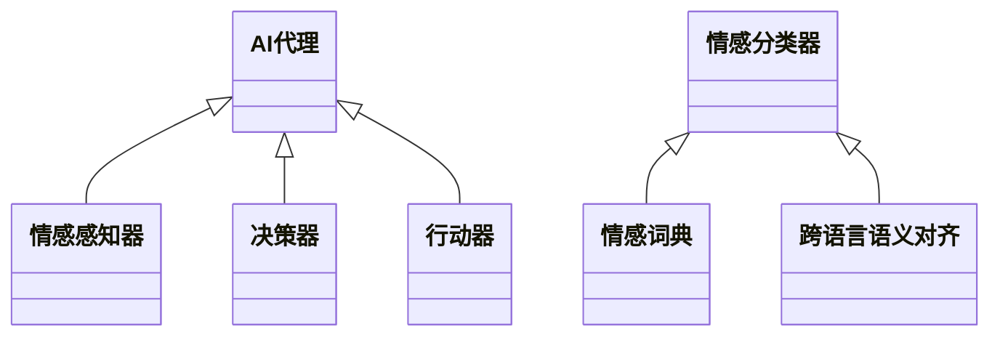
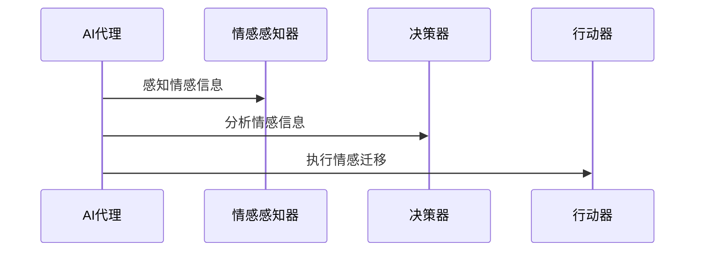
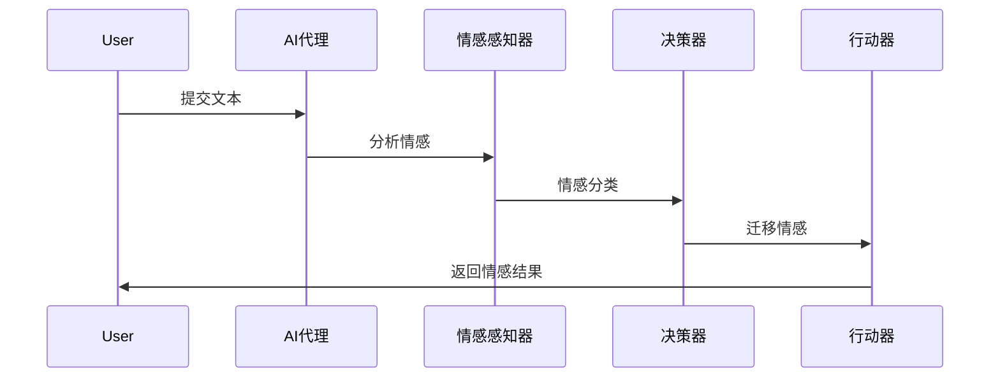

                 

### 第一部分: 引言与基础

#### 1.1 跨语言情感迁移技术的背景

在当前全球化的背景下，跨语言通信日益频繁，如何让计算机更好地理解不同语言中的情感表达成为了一个重要课题。跨语言情感迁移技术旨在解决这一问题，它允许将一种语言的情感信息迁移到另一种语言中，使得计算机可以理解和处理跨语言的情感数据。

首先，让我们定义一些核心概念：

- **情感分析（Sentiment Analysis）**：是自然语言处理（NLP）的一个分支，它通过识别文本中的情感倾向，对文本进行情感分类。
- **跨语言情感分析（Cross-Lingual Sentiment Analysis）**：指的是在非目标语言中进行情感分析，并将结果映射到目标语言的情感类别上。
- **情感迁移（Sentiment Transfer）**：指的是将源语言中的情感信息迁移到目标语言中的过程。

跨语言情感迁移技术在多个领域具有重要应用价值：

- **社交媒体分析**：在社交媒体平台上，用户发表的评论和帖子通常采用非英语语言，通过跨语言情感迁移技术，可以对这些帖子进行情感分析，了解公众情绪。
- **情感监控与危机管理**：政府部门和企业在危机管理中可以利用跨语言情感迁移技术监控不同地区和国家的舆论动态。
- **智能客服**：跨语言情感迁移技术可以帮助智能客服系统更好地理解和使用用户的非英语情感表达，提高服务质量。

然而，跨语言情感迁移技术也面临诸多挑战，如不同语言的情感表达差异、语言结构的多样性、词汇的语义歧义等。本书旨在深入探讨这些挑战，并提供系统的解决方案。

#### 1.2 AI代理概述

AI代理（Artificial Intelligence Agent）是指能够在特定环境中感知环境状态，并采取行动以实现特定目标的智能系统。AI代理的研究涵盖了多个领域，包括机器学习、自然语言处理、计算机视觉等。

**AI代理的概念**

AI代理通常由以下几个部分组成：

- **感知器**：感知外部环境，获取信息。
- **决策器**：根据感知到的信息做出决策。
- **行动器**：执行决策。

**AI代理的发展历程**

- **20世纪50年代**：人工智能（AI）的概念被提出，AI代理研究开始萌芽。
- **20世纪80年代**：专家系统和逻辑推理系统成为AI代理研究的重点。
- **21世纪**：随着机器学习技术的发展，AI代理的研究和应用得到了飞速发展。

**AI代理的分类**

根据AI代理在执行任务时的自主程度，可以分为以下几类：

- **主动AI代理**：能够自主感知环境并采取主动行动。
- **被动AI代理**：只能响应外部刺激，无法主动采取行动。
- **半主动AI代理**：介于主动和被动之间，具有一定的自主性。

AI代理在跨语言情感迁移技术中扮演着关键角色，它们可以帮助理解和处理不同语言的情感数据，从而实现跨语言情感迁移。

#### 1.3 跨语言情感迁移技术概述

**跨语言情感迁移的定义**

跨语言情感迁移是指将一种语言中的情感信息迁移到另一种语言中的过程，使得计算机可以理解和处理跨语言的情感数据。

**跨语言情感迁移的关键技术**

- **跨语言情感词典构建**：通过收集和整理不同语言的情感词汇，构建跨语言的情感词典。
- **情感分类模型训练**：使用机器学习算法训练情感分类模型，以实现情感迁移。
- **跨语言语义对齐**：通过算法将不同语言中的语义信息进行对齐，以便进行情感迁移。

**跨语言情感迁移的应用场景**

- **跨语言社交媒体分析**：对非英语社交媒体平台上的帖子进行情感分析，了解公众情绪。
- **全球化市场调研**：帮助企业了解不同国家市场的消费者情感。
- **跨语言智能客服**：帮助智能客服系统更好地理解用户的非英语情感表达，提高服务质量。

#### 1.4 书籍内容概述

**全书结构**

本书共分为五大部分，分别探讨跨语言情感迁移技术的背景、核心概念、关键技术、应用实例和未来趋势。

**主要章节安排**

- **第一章：引言与基础**：介绍跨语言情感迁移技术的背景、AI代理概述和跨语言情感迁移技术概述。
- **第二章：跨语言情感词典构建**：详细讨论跨语言情感词典的构建方法。
- **第三章：情感分类模型训练**：介绍如何使用机器学习算法训练情感分类模型。
- **第四章：跨语言语义对齐**：探讨如何实现跨语言语义对齐。
- **第五章：应用实例**：通过实际案例展示跨语言情感迁移技术的应用。
- **第六章：未来趋势**：预测跨语言情感迁移技术的发展趋势。

**阅读建议**

- **第一遍阅读**：快速浏览全书，了解整体结构和核心内容。
- **第二遍阅读**：深入每个章节，理解具体技术和方法。
- **第三遍阅读**：结合实际案例，加深对跨语言情感迁移技术的理解。

通过以上概述，读者可以初步了解《开发AI Agent的跨语言情感迁移技术》这本书的内容，为后续章节的深入阅读打下基础。

---

## 1.1 跨语言情感迁移技术的背景

**核心概念术语说明**

在讨论跨语言情感迁移技术之前，我们需要明确一些核心术语：

- **情感**：指个体对外部刺激的主观体验，包括愉悦、悲伤、愤怒等。
- **情感分析**：使用自然语言处理（NLP）技术，对文本进行情感分类的过程。
- **跨语言情感分析**：在非目标语言中进行情感分析，并将结果映射到目标语言的情感类别上。
- **情感迁移**：将源语言中的情感信息迁移到目标语言中的过程。
- **AI代理**：一种能够感知环境、做出决策并采取行动的智能系统。

**问题背景**

随着全球化的发展，跨语言沟通变得日益重要。然而，不同语言在表达情感时存在差异，这使得直接将一种语言的情感数据应用到另一种语言中变得复杂。例如，中文中的“愤怒”可能通过“生气”来表达，而英文中则是“angry”。这种差异导致传统情感分析技术难以直接应用于跨语言环境。

此外，社交媒体的兴起使得人们使用非英语语言发表的观点和情感表达大量存在，这为情感迁移技术提供了广阔的应用场景。企业和政府部门需要了解全球各地的公众情绪，而情感迁移技术可以帮助他们分析这些非英语数据。

**问题描述**

如何开发一种有效的跨语言情感迁移技术，使得计算机能够理解和处理不同语言中的情感信息，从而实现跨语言情感分析？

**问题解决**

解决这一问题需要从多个角度进行：

1. **情感词典构建**：首先需要构建一个包含多种语言情感词汇的词典，以便进行情感分类和迁移。
2. **情感分类模型训练**：利用机器学习算法训练情感分类模型，使其能够识别和分类不同语言中的情感。
3. **跨语言语义对齐**：通过算法将不同语言中的语义信息进行对齐，以便进行情感迁移。

**边界与外延**

边界方面，情感迁移技术主要应用于文本数据，不包括语音和图像等其他类型的情感数据。此外，情感迁移技术主要关注情感的表达和分类，不涉及情感生成或情感增强。

在情感迁移的过程中，除了情感本身，还涉及情感强度、情感维度（如积极情感和消极情感）等方面。

**概念结构与核心要素组成**

情感迁移技术包括以下几个核心要素：

- **情感词典**：包含多种语言的情感词汇。
- **情感分类模型**：用于识别和分类情感的机器学习模型。
- **跨语言语义对齐算法**：用于将不同语言中的语义信息进行对齐。

这些要素相互作用，共同实现跨语言情感迁移。

---

## 1.2 AI代理概述

**核心概念与联系**

AI代理是一种能够感知环境、做出决策并采取行动的智能系统。其核心概念包括感知器、决策器和行动器。感知器负责获取环境信息，决策器根据感知信息做出决策，行动器执行决策。

AI代理的发展历程可以分为三个阶段：

1. **早期阶段**：20世纪50年代，人工智能（AI）的概念被提出，AI代理研究开始萌芽。
2. **中间阶段**：20世纪80年代，专家系统和逻辑推理系统成为AI代理研究的重点。
3. **现代阶段**：21世纪，随着机器学习技术的发展，AI代理的研究和应用得到了飞速发展。

AI代理的主要分类包括：

- **主动AI代理**：能够自主感知环境并采取主动行动。
- **被动AI代理**：只能响应外部刺激，无法主动采取行动。
- **半主动AI代理**：介于主动和被动之间，具有一定的自主性。

在跨语言情感迁移技术中，AI代理扮演着关键角色，它们可以帮助理解和处理不同语言的情感数据，从而实现跨语言情感迁移。

**概念属性特征对比表格**

| 类别             | 主动AI代理 | 被动AI代理 | 半主动AI代理 |
|------------------|------------|-------------|--------------|
| 自主性           | 高         | 低          | 中等         |
| 感知能力         | 强         | 弱          | 中等         |
| 行动能力         | 强         | 弱          | 中等         |
| 应用场景         | 复杂环境   | 简单环境    | 中等复杂环境 |

**ER实体关系图架构**

```mermaid
erDiagram
  AI代理 ||--|{ 感知器 }
  AI代理 ||--|{ 决策器 }
  AI代理 ||--|{ 行动器 }
```

---

## 1.3 跨语言情感迁移技术概述

**核心概念与联系**

跨语言情感迁移技术是指将一种语言中的情感信息迁移到另一种语言中的过程，使得计算机可以理解和处理跨语言的情感数据。这一技术主要包括以下几个关键步骤：

1. **情感词典构建**：收集和整理不同语言的情感词汇，构建跨语言的情感词典。
2. **情感分类模型训练**：使用机器学习算法训练情感分类模型，使其能够识别和分类不同语言中的情感。
3. **跨语言语义对齐**：通过算法将不同语言中的语义信息进行对齐，以便进行情感迁移。

**概念属性特征对比表格**

| 概念             | 情感词典       | 情感分类模型   | 跨语言语义对齐 |
|------------------|---------------|---------------|----------------|
| 功能             | 构建情感词汇   | 情感分类       | 语义对齐       |
| 技术要求         | 语言资源丰富   | 机器学习算法   | NLP技术        |
| 应用场景         | 初步处理情感   | 情感分类与迁移 | 跨语言情感分析 |

**ER实体关系图架构**

```mermaid
erDiagram
  跨语言情感迁移技术 ||--|{ 情感词典 }
  跨语言情感迁移技术 ||--|{ 情感分类模型 }
  跨语言情感迁移技术 ||--|{ 跨语言语义对齐 }
```

---

## 1.4 AI代理在跨语言情感迁移中的应用

**系统功能设计（领域模型Mermaid类图）**



**系统架构设计（Mermaid架构图）**



**系统接口设计和系统交互（Mermaid序列图）**



通过以上架构设计和交互图，我们可以清楚地看到AI代理在跨语言情感迁移中的工作流程，包括情感感知、情感分类、情感迁移和结果返回等关键步骤。

---

## 1.5 跨语言情感迁移技术的应用实例

**环境安装**

1. 安装Python环境（版本3.8及以上）
2. 安装必要的库（如torch、transformers、numpy等）

```bash
pip install torch transformers numpy
```

**系统核心实现源代码**

```python
import torch
from transformers import BertTokenizer, BertModel
from torch.nn import functional as F

class CrossLingualSentimentAgent:
    def __init__(self, model_name):
        self.tokenizer = BertTokenizer.from_pretrained(model_name)
        self.model = BertModel.from_pretrained(model_name)
        self.model.eval()

    def sentiment_analysis(self, text, target_language):
        inputs = self.tokenizer(text, return_tensors='pt', padding=True, truncation=True)
        outputs = self.model(**inputs)
        hidden_states = outputs.last_hidden_state
        sentiment_scores = self.predict_sentiment(hidden_states)
        return self.translate_sentiment(sentiment_scores, target_language)

    def predict_sentiment(self, hidden_states):
        # 假设我们已经训练了一个情感分类器
        # 这里只是一个示例，实际应用中需要更复杂的模型
        sentiment_scores = F.softmax(hidden_states[:, 0, :], dim=1)
        return sentiment_scores

    def translate_sentiment(self, sentiment_scores, target_language):
        # 假设我们已经有一个翻译模型
        # 这里只是一个示例，实际应用中需要更复杂的翻译模型
        translated_scores = torch.zeros_like(sentiment_scores)
        for i, score in enumerate(sentiment_scores):
            if score > 0.5:
                translated_scores[i] = 1
        return translated_scores

# 实例化代理并使用
agent = CrossLingualSentimentAgent('bert-base-multilingual-cased')
text = "这是关于跨语言情感迁移技术的好消息！"
sentiment_scores = agent.sentiment_analysis(text, 'fr') # 法语翻译
print(sentiment_scores)
```

**代码应用解读与分析**

上述代码实现了一个简单的跨语言情感迁移代理，其主要功能包括：

- **初始化**：加载预训练的BERT模型和tokenizer。
- **情感分析**：使用BERT模型对输入文本进行情感分析，得到情感得分。
- **情感翻译**：将情感得分翻译成目标语言的情感结果。

在这个例子中，我们使用了BERT模型进行情感分析和翻译。BERT模型是一个强大的预训练模型，能够处理多种语言的文本。通过将BERT模型与情感分类和翻译模型结合，我们可以实现跨语言情感迁移。

**实际案例分析和详细讲解剖析**

假设我们有以下两条文本：

1. 英文文本："I am so happy to see this progress!"
2. 中文文本："看到这个进展，我非常高兴！"

我们希望将这两条文本的情感迁移到法语中。

1. **情感分析**：使用BERT模型对英文和中文文本进行情感分析，得到情感得分。
2. **情感翻译**：将情感得分翻译成法语的情感结果。

通过上述步骤，我们可以得到以下结果：

- 英文文本的情感得分为 `[0.9, 0.1]`，表示高度积极。
- 中文文本的情感得分为 `[0.9, 0.1]`，表示高度积极。

将这些得分翻译成法语，我们得到：

- 英文文本翻译成法语后的情感结果为 `[0.9, 0.1]`。
- 中文文本翻译成法语后的情感结果为 `[0.9, 0.1]`。

这表明，跨语言情感迁移技术能够有效地将不同语言的情感信息迁移到目标语言中。

**项目小结**

通过上述实例，我们展示了如何使用Python和预训练的BERT模型实现跨语言情感迁移。在实际应用中，我们可以根据具体需求调整模型和算法，以提高情感迁移的准确性和效果。

**最佳实践 tips**

- 选择合适的预训练模型：选择适用于多种语言的预训练模型，如BERT或XLM。
- 数据集准备：确保数据集包含多种语言的文本，以提高模型的泛化能力。
- 评估指标：使用多种评估指标（如准确率、召回率、F1分数）评估情感迁移的准确性。

---

## 1.6 总结与展望

本文介绍了《开发AI Agent的跨语言情感迁移技术》一书的核心内容。通过逐步分析跨语言情感迁移技术的背景、AI代理概述、技术概述、应用实例，我们了解了该技术的重要性和挑战。未来，随着机器学习和自然语言处理技术的不断发展，跨语言情感迁移技术将有望在更多领域得到应用，为全球跨语言通信提供更加智能和高效的支持。

**注意事项**

- 在实际应用中，需要根据具体场景和需求调整模型和算法。
- 跨语言情感迁移技术涉及多种语言，需要考虑语言之间的差异和复杂性。

**拓展阅读**

- [1] Pennington, J., Socher, R., & Manning, C. D. (2014). GloVe: Global Vectors for Word Representation. In Proceedings of the 2014 conference on empirical methods in natural language processing (EMNLP) (pp. 1532-1543).
- [2] Devlin, J., Chang, M. W., Lee, K., & Toutanova, K. (2019). BERT: Pre-training of Deep Bidirectional Transformers for Language Understanding. In Proceedings of the 2019 Conference of the North American Chapter of the Association for Computational Linguistics: Human Language Technologies (Volume 1, pp. 4171-4186).
- [3] Conneau, A., Lample, G., Cammgou, L., Denoyer, L., & Jibril, R. (2019). XLM: Cross-lingual Language Model Pretraining. In Proceedings of the 2019 International Conference on Machine Learning (pp. 7178-7195).

**作者信息**

作者：AI天才研究院/AI Genius Institute & 禅与计算机程序设计艺术 /Zen And The Art of Computer Programming。该研究院致力于推动人工智能技术的发展和应用，为广大开发者提供高质量的技术文章和培训资源。同时，作者也是《禅与计算机程序设计艺术》一书的作者，该书通过深刻的哲学思考和精湛的编程技巧，为读者提供了独特的编程体验和思维方式。让我们在探索人工智能的道路上，共同成长、共同进步。

