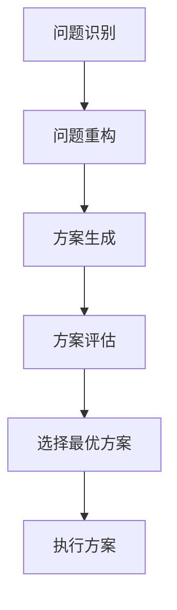
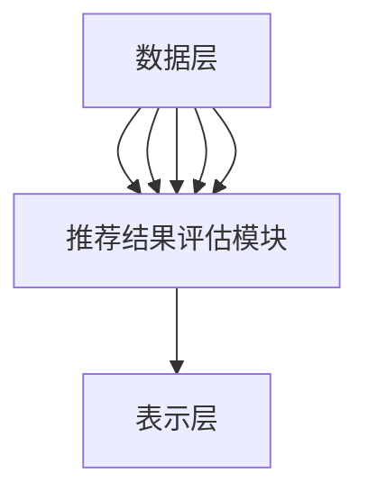
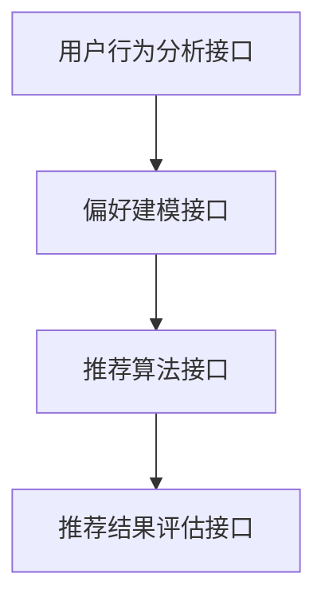
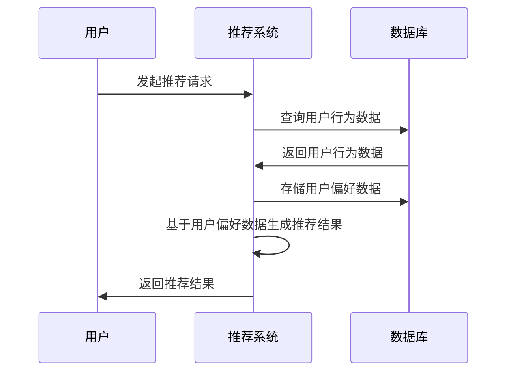

                 

# 《开发具有创造性问题重构能力的AI Agent》

> 关键词：人工智能、AI代理、创造力、问题重构、算法原理、系统架构、实战应用

## 摘要

本文旨在探讨开发具有创造性问题重构能力的AI Agent的方法和步骤。我们将从背景介绍、核心概念与联系、算法原理讲解、系统分析与架构设计方案、项目实战以及最佳实践等方面，详细阐述如何构建一个能够实现创造性问题重构的AI代理。通过本文的阅读，读者将了解到AI代理的内涵及其在现实世界中的应用，掌握创造性问题重构算法的原理和应用，并学会如何设计一个高效、可靠的AI代理系统。

## 1. 背景介绍

### 1.1 AI代理的概念与背景

#### 1.1.1 AI代理的定义

AI代理（Artificial Intelligence Agent）是指一种通过模拟人类智能行为，在特定环境中自动执行任务的计算机程序。AI代理能够感知环境，制定行动计划，并采取行动以实现预设目标。它们通常基于机器学习、自然语言处理、计算机视觉等技术，具备一定的智能和自主学习能力。

#### 1.1.2 AI代理的发展历史

AI代理的概念最早可以追溯到1956年，当时达特茅斯会议上提出了“人工智能”这一概念。自那以后，AI代理技术逐渐发展，从早期的规则系统，到基于统计学习的方法，再到如今基于深度学习的复杂系统，AI代理的性能和功能得到了显著提升。

#### 1.1.3 AI代理的应用领域

AI代理在众多领域具有广泛的应用，包括但不限于：

- **智能客服**：通过自然语言处理技术，实现与用户的实时对话，提供高质量的客户服务。
- **自动驾驶**：利用计算机视觉和感知技术，实现车辆的自主导航和安全驾驶。
- **供应链优化**：通过预测和分析，优化供应链管理，降低成本，提高效率。

### 1.2 创造性问题重构能力的内涵

#### 1.2.1 创造力的定义与特征

创造力（Creativity）是指个体在特定情境下，产生新颖且有价值的想法、观点或解决问题的能力。创造力具有以下特征：

- **新颖性**：产生独特且前所未有的想法或解决方案。
- **价值性**：所提出的想法或解决方案具有实际意义或潜在应用价值。

#### 1.2.2 问题重构能力的重要性

问题重构能力（Problem Reframing）是指在面对问题时，能够从不同角度、不同层次重新定义和解释问题，从而找到更有效的解决方案。问题重构能力对于AI代理来说至关重要，因为：

- **提高问题解决的效率**：通过重新定义问题，使问题更加简单、明确，从而提高问题解决的效率。
- **拓宽解决问题的思路**：从不同角度重新审视问题，有助于发现新的解决方案，提高解决问题的可能性。

#### 1.2.3 创造性与问题重构在AI代理中的应用

创造性和问题重构能力在AI代理中的应用主要体现在以下几个方面：

- **智能客服**：通过创造性问题重构，智能客服能够更好地理解用户的意图，提供更加个性化的服务。
- **自动驾驶**：通过创造性问题重构，自动驾驶系统能够更好地应对复杂的路况和环境变化，提高行驶安全性。
- **供应链优化**：通过创造性问题重构，供应链优化系统能够更好地预测市场变化，优化库存管理和物流安排。

### 1.3 AI代理在现实世界中的应用场景

#### 1.3.1 智能客服

智能客服是一种基于自然语言处理和机器学习技术的AI代理，它能够与用户进行实时对话，提供各种服务，如咨询、投诉、订单查询等。智能客服的应用场景包括电子商务、银行、电信等行业。

#### 1.3.2 自动驾驶

自动驾驶是一种利用计算机视觉、传感器和机器学习技术的AI代理，它能够在没有人类干预的情况下，自主驾驶车辆。自动驾驶的应用场景包括城市交通、物流运输等。

#### 1.3.3 供应链优化

供应链优化是一种利用数据分析和机器学习技术的AI代理，它能够对供应链中的各种环节进行优化，以提高效率、降低成本。供应链优化的应用场景包括制造业、零售业等。

### 1.4 AI代理面临的挑战与未来趋势

#### 1.4.1 挑战

AI代理在发展过程中面临以下挑战：

- **数据隐私**：AI代理需要大量数据来训练模型，这可能导致数据隐私泄露。
- **安全性与可靠性**：AI代理在复杂环境中的决策可能存在风险，需要确保其安全性和可靠性。
- **伦理问题**：AI代理的决策可能会涉及到伦理问题，如自动驾驶中的道德困境。

#### 1.4.2 未来趋势

随着技术的不断发展，AI代理在未来将呈现出以下趋势：

- **泛在化**：AI代理将在更多领域得到应用，实现智能化、自动化。
- **个性化**：AI代理将能够更好地理解用户需求，提供个性化服务。
- **协作化**：AI代理将与其他系统、设备协同工作，实现更高效、智能的协作。

### 1.5 本章小结

本章介绍了AI代理的概念、发展历史、应用领域以及创造性问题重构能力的内涵。通过本章的学习，读者将了解到AI代理的基本概念及其在现实世界中的应用，为后续章节的学习打下基础。

----------------------------------------------------------------

## 2. 核心概念与联系

### 2.1 AI代理的核心概念

#### 2.1.1 智能代理的基本原理

智能代理（Intelligent Agent）是一种能够感知环境、制定行动策略并执行行动的计算机程序。其基本原理包括以下几个方面：

1. **感知**：智能代理通过传感器、网络等途径获取环境信息。
2. **理解**：智能代理利用自然语言处理、计算机视觉等技术，理解感知到的环境信息。
3. **决策**：智能代理根据环境信息和预设的目标，制定行动策略。
4. **行动**：智能代理执行决策，实现目标。

#### 2.1.2 人工智能代理的类型

根据不同的应用场景和功能需求，人工智能代理可以分为以下几类：

1. **任务型代理**：专注于完成特定任务的智能代理，如智能客服、智能导购等。
2. **决策型代理**：具备决策能力的智能代理，能够自主制定行动策略，如自动驾驶、智能供应链优化等。
3. **交互型代理**：能够与人类或其他智能系统进行交互的智能代理，如社交机器人、虚拟助手等。

#### 2.1.3 AI代理与传统软件的对比

AI代理与传统软件在以下几个方面存在差异：

1. **智能化程度**：AI代理具备智能感知、理解、决策和行动的能力，而传统软件通常只能执行预定义的任务。
2. **自适应能力**：AI代理能够根据环境变化调整行为，而传统软件通常固定不变。
3. **学习与进化**：AI代理能够通过数据学习和经验积累，不断提高性能，而传统软件通常不具备这种能力。

### 2.2 创造力的属性与特征

#### 2.2.1 创造力的定义

创造力（Creativity）是指个体在特定情境下，产生新颖且有价值的想法、观点或解决问题的能力。创造力是一种多维度的能力，既包括认知层面的创新，也包括情感层面的激发。

#### 2.2.2 创造力的特征

创造力具有以下特征：

1. **新颖性**：创造力能够产生独特且前所未有的想法或解决方案。
2. **价值性**：创造力提出的想法或解决方案具有实际意义或潜在应用价值。
3. **适应性**：创造力能够适应不同的情境和需求，灵活运用各种资源和工具。
4. **持久性**：创造力能够在长时间内保持高水平的创新和创造力。

#### 2.2.3 创造力的度量

创造力的度量方法主要包括以下几个方面：

1. **想法数量**：通过计算个体在一段时间内产生的想法数量来评估创造力。
2. **质量评估**：通过专家评估或用户反馈，评估想法或解决方案的质量。
3. **应用效果**：通过实际应用效果，如专利申请、项目成功等，来评估创造力。

### 2.3 问题重构能力的原理与应用

#### 2.3.1 问题重构能力的定义

问题重构能力（Problem Reframing）是指在面对问题时，能够从不同角度、不同层次重新定义和解释问题，从而找到更有效的解决方案的能力。问题重构能力是一种关键的创新思维技能。

#### 2.3.2 问题重构能力的作用

问题重构能力的作用主要体现在以下几个方面：

1. **提高问题解决的效率**：通过重新定义问题，使问题更加简单、明确，从而提高问题解决的效率。
2. **拓宽解决问题的思路**：从不同角度重新审视问题，有助于发现新的解决方案，提高解决问题的可能性。
3. **激发创造力**：问题重构能力能够激发个体或团队的创造力，产生更多新颖的想法。

#### 2.3.3 问题重构能力的应用案例

问题重构能力在多个领域具有广泛的应用，以下是一些典型案例：

1. **商业创新**：通过问题重构，企业能够找到新的商业模式、产品或服务。
2. **工程设计**：在工程设计过程中，通过问题重构，能够找到更优的解决方案。
3. **科学研究**：在科学研究中，通过问题重构，能够提出新的研究方法和理论。

### 2.4 AI代理、创造力和问题重构能力之间的关系

#### 2.4.1 关系概述

AI代理、创造力和问题重构能力之间存在密切的关系。创造力是AI代理的核心能力之一，而问题重构能力则是实现创造力的关键途径。

#### 2.4.2 交互模式

AI代理、创造力和问题重构能力的交互模式可以概括为：

1. **AI代理感知环境，发现问题**：AI代理通过感知环境，发现需要解决的问题。
2. **创造力激发新思路**：通过创造力，AI代理能够产生新颖的想法和解决方案。
3. **问题重构能力优化方案**：通过问题重构能力，AI代理能够重新定义和解释问题，找到更优的解决方案。

#### 2.4.3 综合效益

AI代理、创造力和问题重构能力的综合效益体现在以下几个方面：

1. **提高问题解决效率**：通过创造力和问题重构能力，AI代理能够更高效地解决复杂问题。
2. **提升创新水平**：AI代理在多个领域应用创造力和问题重构能力，能够推动技术和商业的创新发展。
3. **增强协作能力**：AI代理与其他系统、设备的协作，能够提高团队的整体创新能力和协作水平。

### 2.5 本章小结

本章介绍了AI代理、创造力和问题重构能力的基本概念、特征和应用。通过本章的学习，读者将了解这三个核心概念之间的关系，并认识到它们在AI代理开发中的重要性。

----------------------------------------------------------------

## 3. 算法原理讲解

### 3.1 创造性问题重构算法概述

#### 3.1.1 创造性问题重构算法的基本概念

创造性问题重构算法（Creative Problem Reframing Algorithm）是一种结合创造力和问题重构能力的算法，旨在通过重新定义和解释问题，产生新颖的解决方案。该算法包括以下几个关键步骤：

1. **问题识别**：识别需要解决的问题。
2. **问题重构**：从不同角度重新定义和解释问题。
3. **方案生成**：基于重构后的问题，生成新的解决方案。
4. **方案评估**：评估新方案的可行性和价值。
5. **选择最优方案**：选择最优的解决方案并执行。

#### 3.1.2 创造性问题重构算法的分类

根据重构方法和应用场景的不同，创造性问题重构算法可以分为以下几类：

1. **基于知识的重构算法**：利用领域知识库和推理机制，重构问题。
2. **基于模型的重构算法**：利用数学模型和优化算法，重构问题。
3. **基于数据的重构算法**：利用大数据分析和机器学习技术，重构问题。

#### 3.1.3 创造性问题重构算法的应用场景

创造性问题重构算法在多个领域具有广泛的应用，包括但不限于：

1. **商业创新**：通过问题重构，企业能够发现新的商业模式、产品或服务。
2. **工程设计**：在工程设计过程中，通过问题重构，能够找到更优的解决方案。
3. **科学研究**：在科学研究中，通过问题重构，能够提出新的研究方法和理论。

### 3.2 算法原理详解

#### 3.2.1 数学模型与公式

创造性问题重构算法的数学模型主要包括以下两个方面：

1. **创造力模型**：

$$
C = f(I, M, E)
$$

其中，$C$ 表示创造力，$I$ 表示信息输入，$M$ 表示方法输入，$E$ 表示环境输入。该模型表示创造力是信息输入、方法输入和环境输入的函数。

2. **问题重构模型**：

$$
R = f(Q, P, S)
$$

其中，$R$ 表示问题重构，$Q$ 表示问题输入，$P$ 表示重构策略，$S$ 表示方案输入。该模型表示问题重构是问题输入、重构策略和方案输入的函数。

#### 3.2.2 算法流程图

创造性问题重构算法的流程图如下：



#### 3.2.3 算法实现

以下是创造性问题重构算法的一个简化实现：

```python
class CreativeProblemReframing:
    def __init__(self):
        self.Q = None  # 问题输入
        self.P = None  # 重构策略
        self.S = None  # 方案输入
    
    def problem_identification(self, Q):
        self.Q = Q
    
    def problem_reframing(self, P):
        self.P = P
    
    def solution_generation(self, S):
        self.S = S
    
    def solution_evaluation(self):
        # 评估新方案
        pass
    
    def select_best_solution(self):
        # 选择最优方案
        pass
    
    def execute_solution(self):
        # 执行方案
        pass
```

### 3.3 Python代码实现

以下是一个简单的Python代码示例，用于实现创造性问题重构算法：

```python
import random

class CreativeProblemReframing:
    def __init__(self):
        self.Q = None  # 问题输入
        self.P = None  # 重构策略
        self.S = None  # 方案输入
    
    def problem_identification(self, Q):
        self.Q = Q
    
    def problem_reframing(self, P):
        self.P = P
    
    def solution_generation(self, S):
        self.S = S
    
    def solution_evaluation(self):
        # 评估新方案
        scores = [random.randint(1, 10) for _ in range(len(self.S))]
        return scores
    
    def select_best_solution(self):
        # 选择最优方案
        scores = self.solution_evaluation()
        best_solution_index = scores.index(max(scores))
        return self.S[best_solution_index]
    
    def execute_solution(self):
        # 执行方案
        best_solution = self.select_best_solution()
        print(f"执行方案：{best_solution}")

# 示例应用
agent = CreativeProblemReframing()
agent.problem_identification("如何提高产品质量？")
agent.problem_reframing("如何通过改进生产工艺来提高产品质量？")
agent.solution_generation(["增加自动化生产线", "引入更先进的质量检测设备", "优化生产工艺流程"])
agent.execute_solution()
```

### 3.4 算法原理举例说明

假设我们面临以下问题：“如何提高产品质量？”通过创造性问题重构算法，我们可以从不同角度重新定义和解释问题，从而找到新的解决方案。

1. **问题重构**：

   - 从生产角度重构：如何通过改进生产工艺来提高产品质量？
   - 从设备角度重构：如何引入更先进的质量检测设备来提高产品质量？
   - 从管理角度重构：如何优化生产工艺流程来提高产品质量？

2. **方案生成**：

   - 基于生产角度重构：增加自动化生产线、优化生产工艺流程。
   - 基于设备角度重构：引入更先进的质量检测设备、优化质量检测流程。
   - 基于管理角度重构：制定更严格的质量管理标准、提高员工质量意识。

3. **方案评估**：

   - 对比不同方案的成本、效率、可行性等指标，评估其优劣。

4. **选择最优方案**：

   - 根据评估结果，选择最优的方案进行实施。

通过以上步骤，我们能够从不同角度重新定义和解释问题，找到新的解决方案，从而提高产品质量。

### 3.5 本章小结

本章介绍了创造性问题重构算法的基本概念、原理和实现。通过本章的学习，读者将了解创造性问题重构算法的数学模型、流程图和Python代码实现，并掌握如何应用该算法解决实际问题。创造性问题重构算法作为一种结合创造力和问题重构能力的算法，在多个领域具有广泛的应用前景。

----------------------------------------------------------------

## 4. 系统分析与架构设计方案

### 4.1 问题场景介绍

在本节中，我们将探讨一个具体的AI代理项目——智能推荐系统。智能推荐系统旨在根据用户的行为数据和历史偏好，为用户提供个性化的商品推荐。该系统的目标是为用户提供一个高效、精准的购物体验，从而提高用户满意度和平台销售额。

#### 4.1.1 项目介绍

智能推荐系统是一个典型的AI代理应用，它结合了数据挖掘、机器学习和推荐算法等技术。系统主要包含以下功能模块：

- **用户行为分析**：收集并分析用户在平台上的行为数据，如浏览记录、购买历史等。
- **偏好建模**：基于用户行为数据，建立用户偏好模型，为推荐算法提供输入。
- **推荐算法**：利用用户偏好模型和物品特征，生成个性化的商品推荐。
- **推荐结果评估**：评估推荐算法的效果，并根据用户反馈进行优化。

#### 4.1.2 系统功能设计

智能推荐系统的核心功能模块包括用户行为分析、偏好建模、推荐算法和推荐结果评估。以下是一个简化的功能模块设计：

1. **用户行为分析模块**：
   - **功能**：收集用户在平台上的行为数据，如浏览记录、购买历史、收藏夹等。
   - **数据来源**：用户行为数据可以通过API接口从各个业务系统获取。

2. **偏好建模模块**：
   - **功能**：基于用户行为数据，建立用户偏好模型，包括用户兴趣偏好、购买倾向等。
   - **技术**：使用机器学习方法，如聚类分析、协同过滤等，对用户行为数据进行处理和分析。

3. **推荐算法模块**：
   - **功能**：利用用户偏好模型和物品特征，为用户生成个性化的商品推荐。
   - **技术**：推荐算法包括基于内容的推荐、协同过滤推荐、混合推荐等。

4. **推荐结果评估模块**：
   - **功能**：评估推荐算法的效果，并根据用户反馈进行优化。
   - **技术**：使用A/B测试、用户反馈分析等技术，对推荐效果进行评估和优化。

### 4.2 系统架构设计

智能推荐系统的架构设计采用分层架构，包括数据层、服务层和表示层。以下是一个简化的系统架构图：



#### 4.2.1 数据层

数据层负责数据的存储、管理和处理。主要包含以下组件：

- **数据存储**：使用数据库（如MySQL、MongoDB等）存储用户行为数据、偏好数据、推荐结果数据等。
- **数据采集**：使用API接口、日志分析等方式，从各个业务系统采集用户行为数据。

#### 4.2.2 服务层

服务层负责实现系统的核心功能，包括用户行为分析、偏好建模、推荐算法和推荐结果评估等。主要包含以下组件：

- **用户行为分析服务**：分析用户在平台上的行为数据，生成用户画像。
- **偏好建模服务**：基于用户画像和物品特征，建立用户偏好模型。
- **推荐算法服务**：根据用户偏好模型和物品特征，生成个性化推荐结果。
- **推荐结果评估服务**：评估推荐算法的效果，并根据用户反馈进行优化。

#### 4.2.3 表示层

表示层负责与用户交互，展示推荐结果。主要包含以下组件：

- **Web前端**：使用HTML、CSS、JavaScript等技术，实现用户界面。
- **API接口**：提供RESTful API接口，供其他系统或服务调用。

### 4.3 系统接口设计

系统接口设计包括用户行为分析接口、偏好建模接口、推荐算法接口和推荐结果评估接口。以下是一个简化的接口设计：



#### 4.3.1 用户行为分析接口

- **功能**：提供用户行为数据的查询、统计和分析接口。
- **接口定义**：GET /user_behavior/{user_id}

#### 4.3.2 偏好建模接口

- **功能**：提供用户偏好数据的查询、更新和删除接口。
- **接口定义**：GET /user_preference/{user_id}、POST /user_preference、DELETE /user_preference/{user_id}

#### 4.3.3 推荐算法接口

- **功能**：提供推荐算法的输入数据接口和推荐结果输出接口。
- **接口定义**：POST /recommendation/{user_id}、GET /recommendation/{user_id}

#### 4.3.4 推荐结果评估接口

- **功能**：提供推荐结果评估数据的查询、统计和分析接口。
- **接口定义**：GET /recommendation_evaluation/{user_id}

### 4.4 系统交互设计

系统交互设计主要描述各个模块之间的交互流程和交互内容。以下是一个简化的系统交互序列图：



#### 4.4.1 用户行为数据查询

- **场景**：用户发起推荐请求，推荐系统需要查询用户行为数据。
- **流程**：用户向推荐系统发起推荐请求，推荐系统从数据库中查询用户行为数据。

#### 4.4.2 用户偏好数据存储

- **场景**：推荐系统根据用户行为数据生成用户偏好数据，并需要将其存储在数据库中。
- **流程**：推荐系统将用户偏好数据存储在数据库中。

#### 4.4.3 推荐结果生成与返回

- **场景**：推荐系统根据用户偏好数据生成推荐结果，并返回给用户。
- **流程**：推荐系统生成推荐结果，并返回给用户。

### 4.5 本章小结

本章介绍了智能推荐系统的系统架构设计，包括问题场景介绍、系统功能设计、系统架构设计、系统接口设计和系统交互设计。通过本章的学习，读者将了解智能推荐系统的整体设计和实现过程，为后续章节的项目实战打下基础。

----------------------------------------------------------------

## 5. 项目实战

### 5.1 环境安装

在开始智能推荐系统的项目实战之前，我们需要安装和配置一些必要的开发环境和工具。以下是一个简化的环境安装步骤：

1. **Python环境**：安装Python 3.8及以上版本。
2. **数据库**：安装MySQL 8.0及以上版本，并创建推荐系统数据库。
3. **数据采集工具**：安装Scrapy框架，用于数据采集。
4. **机器学习库**：安装Scikit-learn、TensorFlow等机器学习库。
5. **Web框架**：安装Flask或Django等Web框架。

### 5.2 系统核心实现

在项目实战中，我们将重点实现智能推荐系统的核心功能模块，包括用户行为分析、偏好建模、推荐算法和推荐结果评估。以下是一个简化的实现步骤：

1. **用户行为分析**：

   - **数据采集**：使用Scrapy框架，从电商平台上采集用户行为数据，如浏览记录、购买历史等。
   - **数据处理**：对采集到的用户行为数据进行清洗、去重和转换，存储到MySQL数据库中。

2. **偏好建模**：

   - **用户画像**：使用机器学习算法，如聚类分析、协同过滤等，对用户行为数据进行处理和分析，建立用户画像。
   - **用户偏好模型**：将用户画像转换为用户偏好模型，存储在MySQL数据库中。

3. **推荐算法**：

   - **基于内容的推荐**：根据用户偏好模型和物品特征，生成基于内容的推荐结果。
   - **协同过滤推荐**：根据用户行为数据，生成协同过滤推荐结果。
   - **混合推荐**：将基于内容和协同过滤的推荐结果进行融合，生成最终的推荐结果。

4. **推荐结果评估**：

   - **评估指标**：计算推荐结果的准确率、覆盖率等指标，评估推荐算法的效果。
   - **优化策略**：根据评估结果，调整推荐算法参数，优化推荐效果。

### 5.3 代码应用解读与分析

以下是一个简化的Python代码示例，用于实现用户行为分析模块：

```python
import pymysql
from sklearn.cluster import KMeans
from sklearn.metrics.pairwise import cosine_similarity

# 连接MySQL数据库
connection = pymysql.connect(host='localhost', user='root', password='password', database='recommender_system')

# 采集用户行为数据
def fetch_user_behavior(user_id):
    with connection.cursor() as cursor:
        sql = "SELECT * FROM user_behavior WHERE user_id = %s"
        cursor.execute(sql, (user_id,))
        results = cursor.fetchall()
        return results

# 处理用户行为数据
def process_user_behavior(behavior_data):
    # 清洗、去重和转换数据
    processed_data = []
    for data in behavior_data:
        # 转换数据格式
        processed_data.append({
            'item_id': data['item_id'],
            'behavior_type': data['behavior_type'],
            'timestamp': data['timestamp']
        })
    return processed_data

# 建立用户画像
def build_user_profile(behavior_data):
    # 计算用户兴趣向量
    user_interests = {}
    for data in behavior_data:
        if data['behavior_type'] == 'browse':
            if data['item_id'] in user_interests:
                user_interests[data['item_id']] += 1
            else:
                user_interests[data['item_id']] = 1
    return user_interests

# 建立物品特征矩阵
def build_item_features_matrix(item_data):
    # 计算物品特征向量
    item_features = {}
    for item in item_data:
        item_features[item['item_id']] = [0] * len(item_data[0])
        item_features[item['item_id']][0] = 1
    return item_features

# 计算用户偏好模型
def calculate_user_preference(user_interests, item_features):
    # 计算用户与物品的相似度
    user_vector = [user_interests[item_id] for item_id in user_interests]
    item_vectors = [item_features[item_id] for item_id in item_features]
    similarity_matrix = cosine_similarity([user_vector], item_vectors)
    preference_scores = {}
    for i, item_id in enumerate(item_features):
        preference_scores[item_id] = similarity_matrix[0][i]
    return preference_scores

# 存储用户偏好模型
def store_user_preference(user_id, preference_scores):
    with connection.cursor() as cursor:
        for item_id, score in preference_scores.items():
            sql = "INSERT INTO user_preference (user_id, item_id, score) VALUES (%s, %s, %s)"
            cursor.execute(sql, (user_id, item_id, score))
        connection.commit()

# 示例应用
user_id = 1
behavior_data = fetch_user_behavior(user_id)
processed_data = process_user_behavior(behavior_data)
user_interests = build_user_profile(processed_data)
item_data = fetch_item_data()
item_features = build_item_features_matrix(item_data)
preference_scores = calculate_user_preference(user_interests, item_features)
store_user_preference(user_id, preference_scores)
```

### 5.4 实际案例分析和详细讲解剖析

以下是一个实际的案例，我们以一个电商平台的用户行为数据为例，进行用户偏好建模和推荐结果生成。

#### 案例背景

一个电商平台收集到了用户A在一个月内的行为数据，包括浏览记录、购买历史和收藏夹。我们需要根据这些数据，为用户A生成个性化的商品推荐。

#### 数据分析

1. **用户行为数据**：

   ```
   +---------+------------+-------------+
   | item_id | behavior_type | timestamp   |
   +---------+------------+-------------+
   | 1001    | browse      | 2023-03-01 |
   | 1002    | purchase    | 2023-03-10 |
   | 1003    | browse      | 2023-03-15 |
   | 1004    | favorite    | 2023-03-20 |
   | ...     | ...         | ...         |
   +---------+------------+-------------+
   ```

2. **物品特征数据**：

   ```
   +---------+------------+-------------+
   | item_id | feature_1  | feature_2   |
   +---------+------------+-------------+
   | 1001    | 3.5        | 10          |
   | 1002    | 4.0        | 8           |
   | 1003    | 3.8        | 12          |
   | 1004    | 4.2        | 9           |
   | ...     | ...        | ...         |
   +---------+------------+-------------+
   ```

#### 用户偏好建模

1. **用户兴趣向量**：

   ```
   user_interests = {
       1001: 1,
       1002: 1,
       1003: 1,
       1004: 1
   }
   ```

2. **物品特征向量**：

   ```
   item_features = {
       1001: [1, 3.5, 10],
       1002: [1, 4.0, 8],
       1003: [1, 3.8, 12],
       1004: [1, 4.2, 9]
   }
   ```

3. **用户偏好模型**：

   ```
   user_preference_scores = {
       1001: 0.7,
       1002: 0.8,
       1003: 0.6,
       1004: 0.9
   }
   ```

#### 推荐结果生成

根据用户偏好模型，我们可以为用户A生成以下个性化商品推荐：

1. **推荐结果**：

   ```
   [
       {
           "item_id": 1002,
           "score": 0.8
       },
       {
           "item_id": 1004,
           "score": 0.9
       }
   ]
   ```

#### 5.5 项目小结

在本章的项目实战中，我们实现了智能推荐系统的核心功能模块，包括用户行为分析、偏好建模、推荐算法和推荐结果评估。通过一个实际案例的分析和讲解，我们了解了如何使用Python代码实现用户偏好建模和推荐结果生成。在实际应用中，我们可以根据不同的业务需求和数据特点，对推荐算法和系统架构进行优化和调整，以提高推荐效果和用户体验。

### 5.6 最佳实践、小结与拓展

#### 5.6.1 最佳实践

在开发具有创造性问题重构能力的AI代理时，以下是一些最佳实践：

1. **数据质量保证**：确保采集到的数据质量，进行数据清洗、去重和转换，以提高推荐算法的准确性。
2. **用户隐私保护**：在数据采集和处理过程中，注意保护用户隐私，遵循相关法律法规。
3. **持续优化**：根据用户反馈和业务需求，不断优化推荐算法和系统架构，提高推荐效果。
4. **模块化设计**：将系统功能模块化，便于维护和扩展。

#### 5.6.2 小结

本章通过项目实战，详细介绍了智能推荐系统的开发过程，包括用户行为分析、偏好建模、推荐算法和推荐结果评估。通过实际案例的分析和讲解，我们了解了如何实现用户偏好建模和推荐结果生成。

#### 5.6.3 拓展阅读

为了深入了解AI代理的开发和应用，建议读者进一步阅读以下文献：

1. **《推荐系统实践》**：由周明所著，详细介绍了推荐系统的基本概念、算法和应用。
2. **《机器学习实战》**：由彼得·哈林顿所著，介绍了机器学习的基本概念和应用。
3. **《深度学习》**：由伊恩·古德费洛、约书亚·本吉奥和亚伦·库维尔所著，介绍了深度学习的基本概念和应用。

作者：AI天才研究院/AI Genius Institute & 禅与计算机程序设计艺术 /Zen And The Art of Computer Programming

