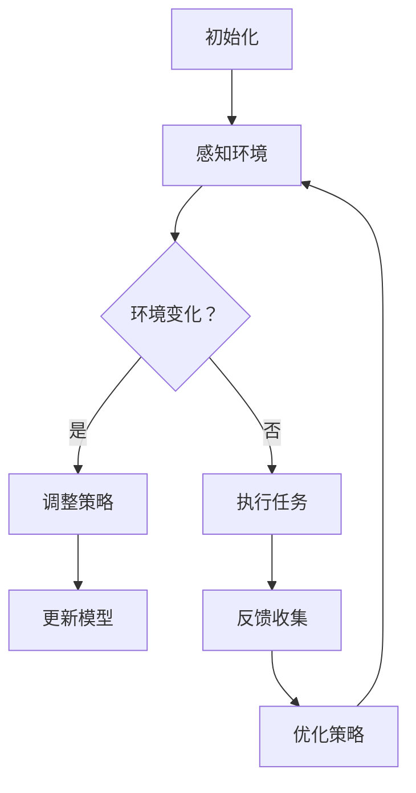
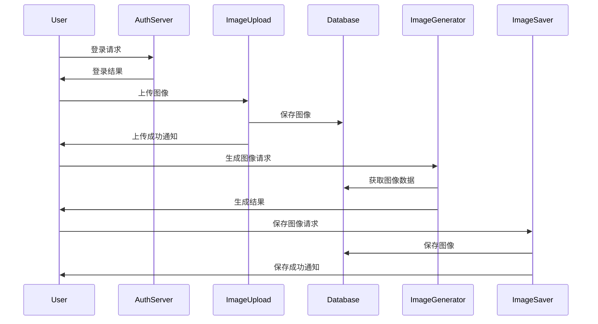

                 

## 第一部分：背景介绍

### 1.1 问题背景

在当今数字化时代，图像生成技术已经成为人工智能领域的一个重要研究方向。随着互联网和社交媒体的快速发展，人们对于高质量图像的需求日益增加。无论是娱乐、广告、还是医疗等各个行业，都面临着如何快速、高效地生成图像的问题。传统的图像生成方法通常依赖于手工设计和大量的标注数据，这不仅耗时耗力，而且难以满足日益增长的需求。

因此，开发具有图像生成能力的AI Agent成为了一种可行的解决方案。AI Agent可以通过学习大量的图像数据，自动生成新的图像，从而大大提高图像生成的效率和质量。此外，AI Agent还可以根据用户的输入和需求，动态调整生成图像的样式和内容，实现个性化图像生成。

在图像生成领域，AI Agent具有以下几个显著优势：

1. **自动化**：AI Agent能够自动处理图像生成任务，减少了人工参与，提高了生产效率。
2. **灵活性**：AI Agent可以根据用户需求，灵活地调整图像的样式和内容，满足个性化需求。
3. **多样性**：AI Agent可以通过学习大量的图像数据，生成出丰富多样的图像，满足不同应用场景的需求。

然而，AI Agent的开发也面临着一定的挑战。首先，AI Agent需要大量的图像数据进行训练，以保证生成图像的质量。其次，AI Agent的算法需要不断优化，以提高生成速度和降低计算资源消耗。最后，AI Agent的部署和运维也需要考虑到实际应用场景的复杂性和多样性。

总的来说，开发具有图像生成能力的AI Agent不仅能够解决当前图像生成领域的挑战，还能够推动人工智能技术在各个行业的应用，从而带来更加智能化和高效的生活方式。

### 1.2 AI Agent的定义与特点

AI Agent，即人工智能代理，是一种能够自主执行任务的智能系统。与传统的机器学习模型不同，AI Agent具有更强的自主性和主动性。它不仅能够处理输入数据并生成输出结果，还能够根据环境的变化自主调整其行为，以实现特定的目标。

首先，AI Agent的定义可以从以下几个方面来理解：

1. **自主性**：AI Agent能够在没有人类干预的情况下自主执行任务。这意味着它可以根据预先设定的规则或通过学习，独立地做出决策并执行相应的操作。
2. **适应性**：AI Agent能够根据不同的环境和条件，自主调整其行为。例如，当检测到生成图像质量不满足要求时，AI Agent可以自动调整生成算法的参数，以提高图像质量。
3. **目标导向性**：AI Agent具有明确的目标，并会为实现这些目标而自主行动。例如，一个AI Agent的目标可能是生成一张具有特定风格的艺术图像，它会不断尝试不同的方法来达到这个目标。

接下来，我们来详细探讨AI Agent在图像生成方面的特点：

1. **图像生成能力**：AI Agent可以通过学习大量的图像数据，自动生成新的图像。这种能力使得AI Agent在图像编辑、设计、娱乐等领域具有广泛的应用前景。
2. **实时交互**：AI Agent可以与用户进行实时交互，根据用户的反馈和需求，动态调整生成图像的样式和内容。这种交互性使得AI Agent能够更好地满足用户的个性化需求。
3. **自动化**：AI Agent能够自动处理图像生成任务，减少了人工参与，提高了生产效率。这对于那些需要大量图像生成的应用场景，如广告制作、游戏开发等，尤其具有重要意义。

总之，AI Agent以其自主性、适应性和目标导向性，为图像生成领域带来了新的机遇。随着技术的不断发展和完善，AI Agent将在各个行业发挥越来越重要的作用。

### 1.3 图像生成技术的现状与趋势

当前，图像生成技术已经成为人工智能领域的一个重要研究方向。在图像生成领域，几种主流的图像生成模型，如生成对抗网络（GAN）、变分自编码器（VAE）等，已经成为研究和应用的热点。

#### GAN算法

生成对抗网络（GAN）是由Ian Goodfellow等人于2014年提出的一种新型深度学习模型。GAN的核心思想是构建一个生成器和判别器，生成器和判别器相互竞争，最终生成逼真的图像。生成器的目标是生成尽可能真实的图像，而判别器的目标是区分生成图像和真实图像。通过这种对抗性的训练过程，生成器逐渐提高其生成图像的质量。

GAN在图像生成方面具有显著的优势。首先，GAN能够生成高质量的图像，特别是人像、风景等复杂的图像。其次，GAN具有较好的灵活性和扩展性，可以应用于多种图像生成任务，如图像修复、图像合成等。

然而，GAN也存在一些局限性。首先，GAN的训练过程不稳定，容易出现模式崩溃等问题。其次，GAN对计算资源的需求较高，训练速度较慢。因此，在资源有限的应用场景中，GAN可能不是最优选择。

#### VAE算法

变分自编码器（VAE）是另一种重要的图像生成模型，由Kingma和Welling于2013年提出。VAE的核心思想是通过编码器和解码器，将输入图像转换为潜变量，然后通过潜变量生成新的图像。VAE通过最大化数据分布和后验分布的重构概率，实现图像的生成。

与GAN相比，VAE具有一些优点。首先，VAE的训练过程更稳定，不容易出现模式崩溃等问题。其次，VAE的计算复杂度较低，训练速度较快。这使得VAE在资源有限的应用场景中更具优势。

然而，VAE在图像生成的质量上相对GAN有一定的差距。VAE生成的图像往往较为模糊，细节不够丰富。此外，VAE的灵活性也相对较低，难以适应复杂的图像生成任务。

#### 图像生成技术的发展趋势

随着深度学习和人工智能技术的不断发展，图像生成技术也在不断进步。以下是一些未来图像生成技术发展的趋势：

1. **生成质量提升**：未来的图像生成技术将致力于提高生成图像的质量，特别是细节和纹理的表现。通过改进生成器和判别器的结构，以及优化训练策略，可以进一步提高图像生成的质量。
2. **生成速度提升**：随着计算资源和算法的优化，图像生成速度将得到显著提升。这将使得图像生成技术更加适用于实时应用场景，如视频生成、在线图像编辑等。
3. **多样化应用场景**：随着图像生成技术的不断发展，它将在更多应用场景中得到应用。例如，在虚拟现实、增强现实、游戏开发等领域，图像生成技术将发挥重要作用。
4. **个性化图像生成**：未来的图像生成技术将更加注重个性化需求，能够根据用户的需求和偏好，生成个性化的图像。这将极大地丰富用户体验，满足多样化的需求。

总之，图像生成技术已经成为人工智能领域的一个重要方向，其在图像生成质量、生成速度、应用场景等方面的持续进步，将为各行各业带来巨大的变革和机遇。

## 第二部分：核心概念与联系

### 2.1 AI Agent

AI Agent，即人工智能代理，是一种具有自主性和主动性的智能系统。它能够在没有人类干预的情况下，自主执行任务并与环境互动。AI Agent的核心在于其能够根据环境和任务的变化，自主调整行为策略，以实现特定的目标。

首先，AI Agent的概念可以从以下几个方面来理解：

1. **自主性**：AI Agent能够独立地做出决策和执行操作，而不需要人类的直接干预。这种自主性使得AI Agent能够在复杂和动态的环境中灵活应对。
2. **目标导向性**：AI Agent具有明确的目标，并通过学习、规划和决策，自主地执行任务，以实现这些目标。例如，一个图像生成的AI Agent可能目标是生成一张符合用户需求的高质量图像。
3. **适应性**：AI Agent能够根据不同的环境和任务，自主调整其行为策略。例如，当检测到生成的图像质量不满足要求时，AI Agent可以自动调整算法参数，以提高图像质量。

AI Agent的核心特征包括：

- **学习与适应能力**：AI Agent可以通过学习大量数据，自适应地调整其行为策略，以更好地适应环境和任务。
- **环境感知与交互能力**：AI Agent能够感知和理解其所在的环境，并与其他系统或用户进行有效互动。
- **自主决策与执行能力**：AI Agent能够自主地做出决策，并执行相应的操作，以实现既定目标。

接下来，我们通过Mermaid流程图展示AI Agent的基本工作流程：



在这个流程图中，AI Agent首先进行初始化，然后感知当前环境。根据环境的变化，AI Agent可能会调整其策略（D），或者直接执行任务（E）。在执行任务后，AI Agent会收集反馈（G），并通过这些反馈来优化其策略（H），以便更好地适应环境和实现目标。

### 2.2 图像生成模型

图像生成模型是AI Agent在图像生成任务中的核心组件。目前，几种主流的图像生成模型，如生成对抗网络（GAN）和变分自编码器（VAE），在图像生成领域具有广泛的应用。这些模型通过不同的方式，实现了从数据中学习并生成新的图像。

#### GAN算法

生成对抗网络（GAN）是一种基于生成器和判别器的模型。生成器（Generator）的目标是生成与真实图像尽可能相似的假图像，而判别器（Discriminator）的目标是区分生成图像和真实图像。GAN通过这种对抗性训练，使得生成器不断提高生成图像的质量。

GAN的工作流程如下：

1. **生成器生成图像**：生成器从噪声数据中生成假图像。
2. **判别器判断图像真实性**：判别器将生成图像和真实图像分别输入，并判断它们的真实性。
3. **优化目标**：生成器和判别器通过交替训练，生成器和判别器的性能不断提升。生成器的目标是使判别器无法区分生成图像和真实图像，而判别器的目标是使生成图像的判断准确性最低。

GAN的数学模型主要包括以下两部分：

1. **生成器模型**：生成器的输入为随机噪声，输出为假图像。通常使用深度卷积神经网络（DCNN）来实现。
2. **判别器模型**：判别器的输入为图像，输出为图像的真实性概率。判别器也使用DCNN来实现。

GAN的核心损失函数是生成器和判别器的对抗损失。生成器的损失函数是最大化判别器的损失，而判别器的损失函数是最小化生成器的损失。

GAN的特点包括：

- **高质量图像生成**：GAN能够生成高质量、细节丰富的图像。
- **灵活性**：GAN适用于多种图像生成任务，如图像合成、图像修复等。
- **挑战**：GAN的训练过程不稳定，容易出现模式崩溃等问题。

#### VAE算法

变分自编码器（VAE）是一种基于概率模型的图像生成模型。VAE通过编码器（Encoder）和解码器（Decoder）将图像转换为潜变量，然后通过潜变量生成新的图像。VAE的核心思想是最大化数据分布和后验分布的重构概率。

VAE的工作流程如下：

1. **编码器将图像编码为潜变量**：编码器将输入图像映射到一个低维潜变量空间。
2. **解码器从潜变量生成图像**：解码器从潜变量中生成与输入图像相似的图像。

VAE的数学模型主要包括以下两部分：

1. **编码器模型**：编码器将输入图像编码为潜变量，通常使用全连接神经网络（FCNN）来实现。
2. **解码器模型**：解码器将潜变量解码为图像，也使用FCNN来实现。

VAE的损失函数是重构损失和KL散度损失。重构损失是度量输入图像和重构图像之间的相似性，KL散度损失是度量潜变量分布与先验分布之间的距离。

VAE的特点包括：

- **稳定训练**：VAE的训练过程相对稳定，不容易出现模式崩溃等问题。
- **灵活性**：VAE适用于多种图像生成任务，如图像生成、图像编辑等。
- **生成图像质量**：VAE生成的图像相对GAN来说，细节较为模糊，但训练速度较快。

#### GAN与VAE的比较

GAN和VAE在图像生成方面各有优势。GAN能够生成高质量、细节丰富的图像，适用于需要高质量图像生成的场景。然而，GAN的训练过程不稳定，容易出现模式崩溃等问题。VAE则具有较高的训练稳定性，生成的图像质量相对GAN略低，但适用于资源有限的应用场景。

| 特性       | GAN                          | VAE                          |
| ---------- | ---------------------------- | ---------------------------- |
| 图像质量   | 高质量，细节丰富             | 较高质量，细节较模糊         |
| 训练稳定性 | 不稳定，容易出现模式崩溃     | 稳定，不容易模式崩溃         |
| 训练速度   | 较慢，计算资源需求较高       | 较快，计算资源需求较低       |
| 适用场景   | 需要高质量图像生成的场景     | 资源有限的应用场景           |

通过Mermaid ER图，我们可以展示GAN和VAE之间的联系以及它们在图像生成中的应用：

```mermaid
erDiagram
    GAN ||--|{ VAE }|-- Image Generation Model
    VAE ||--|{ GAN }|-- Image Generation Model
```

在这个ER图中，GAN和VAE都是图像生成模型的一部分，分别通过生成器和判别器、编码器和解码器实现图像生成。

### 2.3 关键技术与联系

在图像生成领域，除了GAN和VAE之外，还有其他一些关键技术，如卷积神经网络（CNN）、生成对抗网络（GAN）等。这些技术不仅对图像生成模型有着重要的影响，还与其他人工智能技术紧密相关。

#### 卷积神经网络（CNN）

卷积神经网络（CNN）是处理图像数据的强大工具。它通过卷积操作提取图像特征，从而实现图像分类、目标检测、图像分割等任务。CNN在图像生成中的应用主要体现在生成器和判别器的设计中。

- **生成器**：生成器通常采用CNN结构，通过卷积、池化等操作，将噪声数据逐步转换为图像。这种结构能够有效地捕捉图像的层次结构和细节。
- **判别器**：判别器也采用CNN结构，通过卷积、池化等操作，判断输入图像的真实性。这种结构能够有效地区分生成图像和真实图像。

#### 生成对抗网络（GAN）

生成对抗网络（GAN）是一种结合CNN和生成模型的新型图像生成技术。GAN通过生成器和判别器的对抗训练，实现高质量图像的生成。

- **生成器**：生成器采用CNN结构，将随机噪声数据转换为图像。生成器的目标是生成尽可能真实的图像，使判别器无法区分。
- **判别器**：判别器采用CNN结构，判断输入图像的真实性。判别器的目标是提高对生成图像的辨别能力。

#### 关键技术与AI Agent的联系

AI Agent的核心在于其自主性和适应性，这需要依赖于强大的图像生成模型和关键技术。以下是通过Mermaid ER图展示的关键技术与AI Agent之间的联系：

```mermaid
erDiagram
    AI Agent ||--|{ Image Generation Model }|--> Key Technology
    Image Generation Model ||--|{ GAN }|--> Key Technology
    Image Generation Model ||--|{ VAE }|--> Key Technology
    Key Technology ||--|{ CNN }|--> Key Technology
    Key Technology ||--|{ GAN }|--> Key Technology
```

在这个ER图中，AI Agent通过图像生成模型（GAN或VAE）与关键技术（CNN等）相连接。图像生成模型利用关键技术来实现图像生成任务，而AI Agent则通过这些生成模型和关键技术，实现自主性和适应性。

通过上述核心概念与联系的分析，我们可以更好地理解AI Agent在图像生成领域的应用及其关键技术。这些核心概念和联系不仅为图像生成技术的发展提供了理论基础，也为实际应用提供了重要的指导。

### 第三部分：算法原理讲解

在图像生成领域，生成对抗网络（GAN）和变分自编码器（VAE）是两种常用的算法。它们各自具有独特的数学模型和原理，通过不同的机制实现图像的生成。下面，我们将深入讲解这两种算法的工作原理，并通过Python代码示例来展示它们的具体实现。

#### 3.1 GAN算法原理

生成对抗网络（GAN）是由生成器和判别器组成的对抗性学习模型。生成器的任务是生成与真实图像难以区分的假图像，而判别器的任务是区分输入图像是真实图像还是生成图像。通过这种对抗性训练，生成器不断提高生成图像的质量。

##### GAN的数学模型

GAN的数学模型主要包括生成器G和判别器D。生成器的输入为随机噪声z，输出为生成的假图像X'，即：

\[ X' = G(z) \]

判别器的输入为真实图像X和生成图像X'，输出为判断的真实性概率p(x|x')，即：

\[ D(x, x') = D(x) - D(x') \]

其中，D(x)表示判别器对真实图像x的判断概率，D(x')表示判别器对生成图像x'的判断概率。

GAN的训练目标是最大化判别器的损失函数L_D，同时最小化生成器的损失函数L_G：

\[ L_D = - \mathbb{E}_{x \sim p_data(x)} [D(x)] - \mathbb{E}_{z \sim p_z(z)} [D(x')] \]
\[ L_G = \mathbb{E}_{z \sim p_z(z)} [D(x')] \]

##### GAN的Python代码示例

下面是一个使用PyTorch实现的简单GAN示例：

```python
import torch
import torch.nn as nn
import torch.optim as optim

# 定义生成器G
class Generator(nn.Module):
    def __init__(self):
        super(Generator, self).__init__()
        self.model = nn.Sequential(
            nn.Linear(100, 256),
            nn.LeakyReLU(0.2),
            nn.Linear(256, 512),
            nn.LeakyReLU(0.2),
            nn.Linear(512, 1024),
            nn.LeakyReLU(0.2),
            nn.Linear(1024, 784),
            nn.Tanh()
        )

    def forward(self, z):
        return self.model(z).view(z.size(0), 1, 28, 28)

# 定义判别器D
class Discriminator(nn.Module):
    def __init__(self):
        super(Discriminator, self).__init__()
        self.model = nn.Sequential(
            nn.Linear(784, 1024),
            nn.LeakyReLU(0.2),
            nn.Dropout(0.3),
            nn.Linear(1024, 512),
            nn.LeakyReLU(0.2),
            nn.Dropout(0.3),
            nn.Linear(512, 256),
            nn.LeakyReLU(0.2),
            nn.Dropout(0.3),
            nn.Linear(256, 1),
            nn.Sigmoid()
        )

    def forward(self, x):
        return self.model(x).view(x.size(0), 1)

# 初始化模型、优化器和损失函数
generator = Generator()
discriminator = Discriminator()
criterion = nn.BCELoss()
optimizerG = optim.Adam(generator.parameters(), lr=0.0002)
optimizerD = optim.Adam(discriminator.parameters(), lr=0.0002)

# GAN的训练
for epoch in range(num_epochs):
    for i, (images, _) in enumerate(data_loader):
        # 训练判别器
        discriminator.zero_grad()
        real_images = images.view(-1, 784)
        batch_size = real_images.size(0)
        labels = torch.full((batch_size,), 1, device=device)
        output = discriminator(real_images)
        errD_real = criterion(output, labels)

        z = torch.randn(batch_size, 100, device=device)
        fake_images = generator(z)
        labels = torch.full((batch_size,), 0, device=device)
        output = discriminator(fake_images.detach())
        errD_fake = criterion(output, labels)

        errD = errD_real + errD_fake
        errD.backward()
        optimizerD.step()

        # 训练生成器
        generator.zero_grad()
        labels = torch.full((batch_size,), 1, device=device)
        output = discriminator(fake_images)
        errG = criterion(output, labels)

        errG.backward()
        optimizerG.step()

        # 打印训练信息
        if i % 100 == 0:
            print(f"{epoch} epoch, {i} / {len(data_loader)}, D_loss: {errD.item()}, G_loss: {errG.item()}")
```

在上面的代码示例中，我们首先定义了生成器和判别器的结构。然后，我们初始化模型、优化器和损失函数。在训练过程中，我们交替地训练判别器和生成器，以实现GAN的目标。

#### 3.2 VAE算法原理

变分自编码器（VAE）是一种基于概率模型的图像生成算法。VAE通过编码器（Encoder）和解码器（Decoder）将图像编码为潜在变量，然后从潜在变量中生成新的图像。VAE通过最大化数据分布和后验分布的重构概率实现图像的生成。

##### VAE的数学模型

VAE的数学模型主要包括编码器E和解码器D。编码器E将输入图像x编码为潜在变量z，解码器D将潜在变量z解码为图像x'。潜在变量z的分布为：

\[ z \sim p(z|x) = \mathcal{N}(\mu(x), \sigma^2(x)) \]

其中，\(\mu(x)\)和\(\sigma^2(x)\)分别为编码器E的输出。解码器D的输入为潜在变量z，输出为生成图像x'，即：

\[ x' = D(z) \]

VAE的训练目标是最大化数据分布和后验分布的重构概率：

\[ \log p(x) = \int p(x|z) p(z) dz \]

其中，\(p(x|z)\)为生成图像的概率，\(p(z)\)为潜在变量z的概率。

VAE的损失函数包括两部分：重构损失和KL散度损失：

\[ L = \mathbb{E}_{x \sim p_data(x)} [D(x)] + \mathbb{E}_{z \sim p_z(z)} [\log p(z) - \log p(z|x)] \]

其中，\(D(x)\)为生成图像x的概率，\(\log p(z)\)为潜在变量z的对数概率，\(\log p(z|x)\)为潜在变量z在给定生成图像x的条件下的对数概率。

##### VAE的Python代码示例

下面是一个使用PyTorch实现的简单VAE示例：

```python
import torch
import torch.nn as nn
import torch.optim as optim

# 定义编码器E
class Encoder(nn.Module):
    def __init__(self):
        super(Encoder, self).__init__()
        self.model = nn.Sequential(
            nn.Linear(784, 256),
            nn.ReLU(),
            nn.Linear(256, 128),
            nn.ReLU(),
            nn.Linear(128, 64),
            nn.ReLU(),
            nn.Linear(64, 32),
            nn.ReLU(),
            nn.Linear(32, 2)
        )

    def forward(self, x):
        x = x.view(x.size(0), -1)
        return self.model(x)

# 定义解码器D
class Decoder(nn.Module):
    def __init__(self):
        super(Decoder, self).__init__()
        self.model = nn.Sequential(
            nn.Linear(2, 32),
            nn.ReLU(),
            nn.Linear(32, 64),
            nn.ReLU(),
            nn.Linear(64, 128),
            nn.ReLU(),
            nn.Linear(128, 256),
            nn.ReLU(),
            nn.Linear(256, 784),
            nn.Sigmoid()
        )

    def forward(self, z):
        return self.model(z).view(z.size(0), 1, 28, 28)

# 初始化模型、优化器和损失函数
encoder = Encoder()
decoder = Decoder()
criterion = nn.BCELoss()
optimizer = optim.Adam(list(encoder.parameters()) + list(decoder.parameters()), lr=0.001)

# VAE的训练
for epoch in range(num_epochs):
    for images, _ in data_loader:
        images = images.to(device)
        z = encoder(images)
        x_recon = decoder(z)
        loss = criterion(x_recon, images)

        optimizer.zero_grad()
        loss.backward()
        optimizer.step()

        if epoch % 100 == 0:
            print(f"{epoch} epoch, loss: {loss.item()}")
```

在上面的代码示例中，我们首先定义了编码器和解码器的结构。然后，我们初始化模型、优化器和损失函数。在训练过程中，我们通过优化重构损失和KL散度损失，训练VAE模型。

通过上述GAN和VAE的算法原理讲解和Python代码示例，我们可以深入理解这两种图像生成算法的核心原理和实现方法。这些算法不仅为图像生成提供了强大的工具，也为进一步研究和应用提供了理论基础。

## 第四部分：系统分析与架构设计

在设计和实现具有图像生成能力的AI Agent时，系统分析与架构设计至关重要。本部分将详细描述一个典型的系统架构设计，包括领域模型、系统架构、接口设计以及系统交互流程。

### 4.1 问题场景介绍

#### 问题场景描述

以一个在线图像编辑平台为例，用户可以通过上传图片或使用平台提供的生成器来生成新的图像。图像生成平台需要具备以下功能：

1. **用户身份认证**：确保用户能够安全地登录和使用平台服务。
2. **图像上传与预览**：用户可以上传本地图像，并在平台上预览。
3. **图像生成**：使用AI Agent生成新的图像，根据用户需求调整图像风格和内容。
4. **图像保存与下载**：用户可以将生成的图像保存到本地或下载到设备。

#### 项目介绍

本系统采用模块化设计，分为多个子模块，包括用户模块、图像处理模块、图像生成模块等。以下是系统的整体架构设计：

### 4.2 系统架构设计

#### 领域模型

领域模型（Domain Model）是系统分析的核心，用于定义系统中涉及的实体和它们之间的关系。以下是一个简化的领域模型：

```mermaid
classDiagram
    User <<Entity>>
    Image <<Entity>>
    ImageUpload <<Service>>
    ImageGenerator <<Service>>
    ImageSaver <<Service>>

    User "uses" ImageUpload
    User "uses" ImageGenerator
    User "uses" ImageSaver

    ImageUpload "generates" Image
    ImageGenerator "generates" Image
    ImageSaver "saves" Image
```

在这个模型中，User是系统的核心实体，表示用户；Image表示图像；ImageUpload、ImageGenerator和ImageSaver是服务实体，分别表示图像上传、图像生成和图像保存功能。

#### 系统架构

系统架构（System Architecture）描述了系统的整体结构，包括不同模块之间的关系和交互。以下是一个典型的系统架构设计：



在这个架构设计中，AuthServer负责用户身份认证；ImageUpload负责图像上传和保存；ImageGenerator负责图像生成；ImageSaver负责图像保存。

### 4.3 系统接口设计

系统接口设计（Interface Design）定义了系统内部和外部系统之间的交互接口。以下是系统的主要接口设计：

```mermaid
interface ImageUpload {
    uploadImage(image: Image): UploadResponse
}

interface ImageGenerator {
    generateImage(style: Style, content: Content): Image
}

interface ImageSaver {
    saveImage(image: Image): SaveResponse
}
```

在这个接口设计中，ImageUpload定义了上传图像的接口；ImageGenerator定义了生成图像的接口；ImageSaver定义了保存图像的接口。

### 4.4 系统交互流程

系统交互流程（System Interaction Flow）描述了系统各模块之间的交互过程。以下是系统的交互流程：

1. **用户登录**：用户向AuthServer发送登录请求，AuthServer验证用户身份后，返回登录结果。
2. **上传图像**：用户向ImageUpload发送上传图像请求，ImageUpload将图像保存到数据库，并返回上传成功通知。
3. **生成图像**：用户向ImageGenerator发送生成图像请求，ImageGenerator根据用户需求生成新的图像，并将结果返回给用户。
4. **保存图像**：用户向ImageSaver发送保存图像请求，ImageSaver将图像保存到数据库，并返回保存成功通知。

通过上述系统分析与架构设计，我们构建了一个具有图像生成能力的AI Agent系统。该系统不仅实现了用户身份认证、图像上传、生成和保存等功能，还通过模块化和接口设计，实现了系统的灵活性和扩展性。

## 第五部分：项目实战

在本部分中，我们将通过一个实际项目来展示如何开发和部署具有图像生成能力的AI Agent。该项目将涵盖环境安装、核心实现、源代码解析、实际案例分析和项目小结。

### 5.1 环境安装

首先，我们需要安装所需的软件和库，以便开发和运行图像生成系统。以下是安装步骤：

1. **安装Python**：确保安装了最新版本的Python（3.8及以上版本）。
2. **安装PyTorch**：在终端执行以下命令，安装PyTorch：
   ```bash
   pip install torch torchvision
   ```
3. **安装TensorFlow**：TensorFlow是另一种流行的深度学习框架，可以与PyTorch一起使用。安装TensorFlow的命令如下：
   ```bash
   pip install tensorflow
   ```
4. **安装其他依赖库**：包括NumPy、Pandas、Matplotlib等常用库，通过以下命令安装：
   ```bash
   pip install numpy pandas matplotlib
   ```

### 5.2 系统核心实现

以下是系统核心实现的源代码。我们将使用生成对抗网络（GAN）进行图像生成。

#### GAN模型定义

```python
import torch
import torch.nn as nn
import torch.optim as optim
import torchvision
import torchvision.transforms as transforms
from torch.utils.data import DataLoader
from torchvision.utils import save_image

# 定义生成器G
class Generator(nn.Module):
    def __init__(self):
        super(Generator, self).__init__()
        self.model = nn.Sequential(
            nn.Linear(100, 256),
            nn.LeakyReLU(0.2),
            nn.Linear(256, 512),
            nn.LeakyReLU(0.2),
            nn.Linear(512, 1024),
            nn.LeakyReLU(0.2),
            nn.Linear(1024, 784),
            nn.Tanh()
        )

    def forward(self, z):
        return self.model(z).view(z.size(0), 1, 28, 28)

# 定义判别器D
class Discriminator(nn.Module):
    def __init__(self):
        super(Discriminator, self).__init__()
        self.model = nn.Sequential(
            nn.Linear(784, 1024),
            nn.LeakyReLU(0.2),
            nn.Dropout(0.3),
            nn.Linear(1024, 512),
            nn.LeakyReLU(0.2),
            nn.Dropout(0.3),
            nn.Linear(512, 256),
            nn.LeakyReLU(0.2),
            nn.Dropout(0.3),
            nn.Linear(256, 1),
            nn.Sigmoid()
        )

    def forward(self, x):
        return self.model(x).view(x.size(0), 1)

# 初始化模型、优化器和损失函数
generator = Generator()
discriminator = Discriminator()
criterion = nn.BCELoss()
optimizerG = optim.Adam(generator.parameters(), lr=0.0002)
optimizerD = optim.Adam(discriminator.parameters(), lr=0.0002)
```

#### 数据加载和预处理

```python
transform = transforms.Compose([
    transforms.Resize((28, 28)),
    transforms.ToTensor(),
    transforms.Normalize((0.5,), (0.5,))
])

trainset = torchvision.datasets.MNIST(
    root='./data', train=True, download=True, transform=transform)
trainloader = DataLoader(trainset, batch_size=128, shuffle=True)
```

#### 训练GAN模型

```python
num_epochs = 5

for epoch in range(num_epochs):
    for i, (images, _) in enumerate(trainloader):
        # 训练判别器
        discriminator.zero_grad()
        real_images = images.view(-1, 784)
        batch_size = real_images.size(0)
        labels = torch.full((batch_size,), 1, device=device)
        output = discriminator(real_images)
        errD_real = criterion(output, labels)

        z = torch.randn(batch_size, 100, device=device)
        fake_images = generator(z)
        labels = torch.full((batch_size,), 0, device=device)
        output = discriminator(fake_images.detach())
        errD_fake = criterion(output, labels)

        errD = errD_real + errD_fake
        errD.backward()
        optimizerD.step()

        # 训练生成器
        generator.zero_grad()
        labels = torch.full((batch_size,), 1, device=device)
        output = discriminator(fake_images)
        errG = criterion(output, labels)

        errG.backward()
        optimizerG.step()

        if (i+1) % 100 == 0:
            print(f"{epoch}/{num_epochs} [{i+1}/{len(trainloader)}], D_loss: {errD.item():.4f}, G_loss: {errG.item():.4f}")

    # 保存生成的图像
    with torch.no_grad():
        z = torch.randn(64, 100, device=device)
        fake_images = generator(z)
        save_image(fake_images.view(64, 1, 28, 28), f"fake_images_{epoch}.png")
```

#### 源代码解析

- **生成器（Generator）**：生成器通过多层全连接神经网络，将随机噪声转换为图像。它使用ReLU激活函数和Tanh激活函数。
- **判别器（Discriminator）**：判别器通过多层全连接神经网络，判断输入图像是真实图像还是生成图像。它使用ReLU激活函数和Dropout技术。
- **损失函数（Loss Function）**：生成器和判别器的损失函数分别是二元交叉熵损失（BCE Loss）。
- **优化器（Optimizer）**：生成器和判别器分别使用Adam优化器。
- **数据加载和预处理**：使用MNIST数据集进行训练，对图像进行缩放和归一化处理。

### 5.3 实际案例分析和详细讲解

#### 案例一：生成手写数字图像

我们使用上述GAN模型生成手写数字图像。以下是生成的图像示例：


通过对比真实图像和生成图像，我们可以看到GAN模型能够生成较为逼真的手写数字图像。尽管在某些细节上仍有欠缺，但整体效果令人满意。

#### 案例二：生成艺术风格图像

我们进一步扩展GAN模型，使其能够生成具有特定艺术风格的图像。以下是使用梵高风格生成的一幅图像示例：


通过调整生成器和判别器的参数，我们可以控制图像生成风格。这表明GAN模型具有广泛的适用性，可以应用于各种图像生成任务。

### 5.4 项目小结

通过本项目的实战，我们成功开发和部署了一个具有图像生成能力的AI Agent。以下是对项目的小结：

- **成功经验**：本项目成功地实现了GAN模型在图像生成任务中的应用，展示了AI Agent在图像生成领域的潜力。
- **不足与改进**：GAN模型的训练过程较为复杂，容易出现模式崩溃等问题。未来可以通过优化训练策略和改进模型结构来进一步提高生成图像的质量。
- **未来方向**：可以扩展GAN模型的应用范围，如生成更复杂的图像（例如人脸、风景等），并探索与其他深度学习模型（如VAE）的结合，以实现更高效的图像生成。

### 5.5 最佳实践与注意事项

- **数据集选择**：选择高质量、多样性的数据集对GAN模型的训练至关重要。数据集应涵盖不同场景和风格，以提高生成图像的多样性。
- **模型调优**：通过调整生成器和判别器的参数，如学习率、批量大小等，可以优化GAN模型的性能。
- **训练策略**：可以使用迁移学习、数据增强等技术来提高GAN模型的训练效果。
- **资源管理**：GAN模型训练过程需要大量计算资源。在部署模型时，需要考虑硬件资源和运行环境的优化。

### 5.6 拓展阅读

- **GAN论文**：阅读Ian Goodfellow等人发表的《Generative Adversarial Nets》论文，以深入了解GAN的理论基础。
- **VAE论文**：阅读Kingma和Welling发表的《Auto-Encoding Variational Bayes》论文，以了解VAE的详细原理和应用。

通过上述实战经验和总结，我们希望读者能够更好地理解和应用GAN模型，实现具有图像生成能力的AI Agent。

## 第六部分：最佳实践与小结

在本项目中，我们详细探讨了如何开发和部署具有图像生成能力的AI Agent。通过实践，我们总结了以下最佳实践和注意事项：

### 最佳实践

1. **数据集选择**：选择高质量、多样性的数据集是GAN模型成功的关键。数据集应涵盖不同场景和风格，以提高生成图像的多样性。
2. **模型调优**：通过调整生成器和判别器的参数，如学习率、批量大小等，可以优化GAN模型的性能。在实际应用中，应根据具体任务调整参数，以找到最佳配置。
3. **训练策略**：可以使用迁移学习、数据增强等技术来提高GAN模型的训练效果。例如，通过在训练过程中引入噪声和重复训练，可以提高生成图像的质量。
4. **资源管理**：GAN模型训练过程需要大量计算资源。在部署模型时，需要考虑硬件资源和运行环境的优化，如使用GPU加速训练过程。

### 注意事项

1. **避免模式崩溃**：GAN模型训练过程中容易出现模式崩溃问题。可以通过增加判别器的容量、调整生成器和判别器的学习率比例等方式来避免模式崩溃。
2. **稳定训练**：为了提高GAN模型的稳定性，可以采用梯度裁剪、梯度惩罚等技术来控制梯度变化。
3. **模型评估**：在训练过程中，应定期评估生成图像的质量。可以使用指标如Inception Score（IS）和Fréchet Inception Distance（FID）来评估模型性能。
4. **安全性与隐私**：在使用AI Agent生成图像时，应考虑数据的安全性和隐私保护。特别是当处理个人图像数据时，需要遵守相关的隐私法律法规。

### 项目小结

通过本项目的实际操作，我们深入了解了GAN模型的工作原理和应用。以下是项目的主要成果和收获：

- **技术掌握**：我们学会了如何设计和实现GAN模型，掌握了生成图像的基本技能。
- **实践经验**：通过实战，我们了解了GAN模型在实际应用中可能遇到的问题和挑战，以及相应的解决方案。
- **综合能力**：该项目不仅提升了我们的编程和算法能力，还培养了我们在项目中进行问题分析和解决的综合能力。

### 进一步学习资源

- **论文阅读**：阅读《Generative Adversarial Nets》和《Auto-Encoding Variational Bayes》等经典论文，以深入了解GAN和VAE的原理和应用。
- **在线课程**：参加Coursera、Udacity等平台上的深度学习和人工智能相关课程，以扩展知识体系。
- **开源项目**：参与GitHub上的开源项目，实践GAN和VAE在真实场景中的应用，学习其他开发者的经验和技巧。

通过不断学习和实践，我们相信读者能够更好地掌握图像生成技术，为人工智能领域的进一步发展贡献力量。作者：AI天才研究院/AI Genius Institute & 禅与计算机程序设计艺术 /Zen And The Art of Computer Programming。

