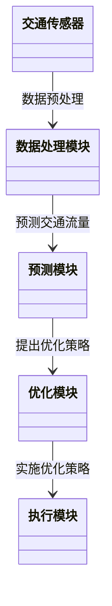
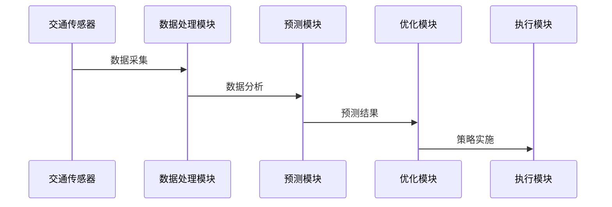
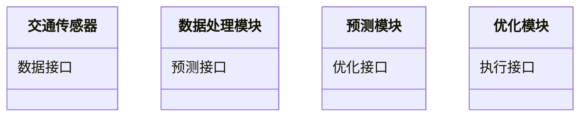
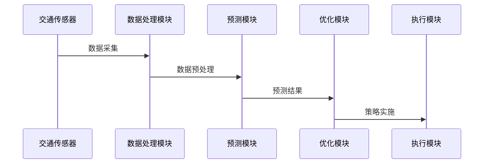

                 


### 第一部分：引言与背景

在当今人工智能（AI）迅猛发展的时代，AI Agent作为一种智能实体，已经成为研究和应用的热点。AI Agent可以模拟人类智能，自主地完成一系列复杂任务，如语音识别、图像识别、自然语言处理等。然而，随着应用场景的复杂化，传统的AI Agent在处理复杂任务时面临着诸多挑战，尤其是对复杂场景的理解与决策能力。

#### 1.1 问题背景

1. **人工智能的发展历程**

人工智能的发展经历了几个阶段，从最初的符号推理到基于统计学习的机器学习，再到深度学习的崛起，每一次技术革新都极大地推动了AI的发展。然而，随着AI在各个领域的应用不断拓展，特别是复杂任务需求的出现，传统AI Agent在理解和决策方面的局限性逐渐显现。

2. **AI Agent的概念与重要性**

AI Agent是指具有自主能力、能够与外界环境进行交互并执行任务的智能体。它们在智能客服、自动驾驶、智能家居、智能安防等领域发挥着重要作用。然而，传统AI Agent主要依赖于预定义的规则或者大规模的数据进行决策，对于复杂、动态的情景往往难以应对。

3. **复杂场景理解与决策能力在AI Agent中的应用**

复杂场景理解与决策能力是AI Agent能够适应不同环境和任务的关键。例如，在自动驾驶中，AI Agent需要理解道路环境、识别交通标志、预测其他车辆和行人的行为，并做出正确的驾驶决策。这种能力不仅仅依赖于算法的复杂性，还需要对现实世界的深刻理解。

#### 1.2 问题描述

1. **当前AI Agent面临的挑战**

- **数据依赖性强**：传统的AI Agent依赖于大量的数据来训练模型，对于数据缺失或者噪声敏感。
- **决策过程复杂**：复杂的决策过程往往涉及到多目标优化、不确定性处理等问题。
- **跨领域适应能力弱**：不同领域的AI Agent往往需要定制化训练，难以实现通用化。

2. **复杂场景理解与决策能力的必要性**

在复杂场景中，AI Agent需要具备对多源异构数据的处理能力，能够理解并适应动态变化的环境，做出灵活、准确的决策。

3. **本书的目标与内容结构**

本书旨在探讨如何开发具有复杂场景理解与决策能力的AI Agent，主要包括以下内容：

- **技术路线图**：介绍从数据预处理到模型训练，再到决策优化的整体流程。
- **方法论与实践指导**：提供具体的实现方法和技术策略，帮助读者理解和应用。
- **边界与外延**：讨论AI Agent的能力边界，以及决策能力在AI Agent中的应用范围。

#### 1.3 问题解决

1. **技术路线图**

- **数据收集与预处理**：收集多源数据，进行数据清洗、归一化等预处理操作。
- **模型训练与优化**：使用深度学习等技术训练模型，并进行优化以提升决策能力。
- **决策算法与应用**：结合强化学习、遗传算法等优化方法，设计高效的决策算法。

2. **方法论与实践指导**

- **基于规则的决策方法**：介绍传统的基于规则的决策方法，并分析其优缺点。
- **基于数据的决策方法**：探讨如何利用大数据技术提升决策能力。
- **混合决策方法**：结合多种方法，构建更强大的决策系统。

#### 1.4 边界与外延

1. **AI Agent的能力边界**

AI Agent虽然具有自主决策能力，但在某些极端情况下，如完全不可预测的环境，其表现仍可能有限。

2. **决策能力在AI Agent中的应用范围**

决策能力广泛应用于自动驾驶、智能客服、智能金融等领域，成为AI技术发展的重要方向。

3. **本书适用读者与预期效果**

本书适合从事人工智能研究的科研人员、工程师以及对于AI技术感兴趣的开发者阅读。通过本书的学习，读者可以掌握开发具有复杂场景理解与决策能力的AI Agent的基本方法。

#### 1.5 本章小结

本章介绍了AI Agent发展的背景、面临的问题以及本书的目标和内容结构。下一章将深入探讨AI Agent的基础概念和原理，帮助读者建立全面的知识框架。请继续关注后续章节，我们将逐步揭示如何开发具有复杂场景理解与决策能力的AI Agent。

----------------------------------------------------------------

### 第二部分：AI Agent基础概念与原理

#### 2.1 AI Agent的核心概念

1. **定义与分类**

AI Agent是指能够模拟人类智能行为，自主地感知环境、制定计划并执行动作的智能体。根据不同的分类标准，AI Agent可以分为不同的类型，如基于规则的AI Agent、基于行为的AI Agent和基于模型的AI Agent。

2. **基本功能**

AI Agent的基本功能包括感知、规划、决策和执行。感知是指AI Agent能够获取环境信息；规划是指AI Agent根据感知到的信息制定行动方案；决策是指AI Agent在多个可行方案中选取最佳方案；执行是指AI Agent实际执行选定的方案。

3. **构成要素**

AI Agent的构成要素主要包括感知模块、决策模块和执行模块。感知模块负责获取环境信息；决策模块负责分析感知到的信息，并生成行动方案；执行模块负责执行选定的行动方案。

#### 2.2 AI Agent的原理分析

1. **基于规则的AI Agent**

基于规则的AI Agent是早期的一种智能体模型，它通过预定义的规则来指导行为。这种模型的主要优点是实现简单、易于理解，但缺点是灵活性较差，难以处理复杂、动态的情景。

2. **基于行为的AI Agent**

基于行为的AI Agent通过模仿人类的行动模式来执行任务。这种模型具有较高的灵活性和适应性，但需要大量的训练数据和复杂的算法来支持。

3. **基于模型的AI Agent**

基于模型的AI Agent使用数学模型来描述环境和行为，通过优化模型参数来指导行为。这种模型具有较高的预测能力和灵活性，但需要复杂的计算和大量的数据支持。

#### 2.3 AI Agent的常见挑战

1. **模式识别与推理能力**

AI Agent需要具备强大的模式识别与推理能力，能够从感知到的信息中提取有用知识，并基于这些知识进行推理和决策。

2. **决策过程的效率与准确性**

高效的决策过程是AI Agent的关键能力之一。如何平衡决策的效率与准确性，是当前研究和应用中的一个重要问题。

3. **与人类交互的友好性**

AI Agent需要能够与人类进行自然、有效的交互，以实现更好的协作和决策。这要求AI Agent具备良好的自然语言处理和理解能力。

#### 2.4 核心概念原理联系

1. **AI Agent的核心概念原理表**

| 概念               | 定义                                                         | 关联原理                                           |
|--------------------|--------------------------------------------------------------|----------------------------------------------------|
| AI Agent           | 自主执行任务的智能体                                         | 感知、规划、决策、执行                               |
| 基于规则的AI Agent | 通过预定义的规则来指导行为                                 | 规则推理、知识表示                                   |
| 基于行为的AI Agent | 通过模仿人类的行动模式来执行任务                           | 行为克隆、模式识别                                   |
| 基于模型的AI Agent | 使用数学模型来描述环境和行为                               | 模型优化、预测控制                                   |

2. **AI Agent的ER实体关系图**

```mermaid
erDiagram
    AI_Agent ||--|{ 感知模块 }感知模块
    AI_Agent ||--|{ 决策模块 }决策模块
    AI_Agent ||--|{ 执行模块 }执行模块
    感知模块 ||--|{ 数据采集 }数据采集
    决策模块 ||--|{ 规则库 }规则库
    决策模块 ||--|{ 模型优化 }模型优化
    执行模块 ||--|{ 行动方案 }行动方案
```

#### 2.5 本章小结

本章介绍了AI Agent的基础概念与原理，包括定义、分类、基本功能、原理分析以及常见挑战。下一章将深入探讨复杂场景理解技术，为开发具有复杂场景理解与决策能力的AI Agent奠定基础。请继续关注后续章节，我们将逐步揭示这一领域的奥秘。

----------------------------------------------------------------

### 第三部分：复杂场景理解技术

#### 3.1 场景理解的基础

1. **场景理解的概念与重要性**

场景理解是指AI Agent在特定环境下对场景的感知、分析和解释能力。它是AI Agent能够进行有效决策和任务执行的基础。在复杂场景中，场景理解能力尤为重要，因为场景的复杂性和动态性直接影响AI Agent的表现。

2. **场景理解的层次结构**

场景理解可以分为多个层次，包括感知层、认知层和决策层。感知层负责收集和感知环境信息；认知层负责对感知信息进行分析和处理，形成对场景的理解；决策层负责基于认知结果做出决策。

3. **场景理解的挑战**

- **信息多样性**：复杂场景中涉及多种类型的信息，如文本、图像、声音等，如何有效地整合这些信息是一个挑战。
- **动态变化**：场景是动态变化的，AI Agent需要实时适应这些变化，以保证决策的准确性。
- **不确定性**：现实世界充满不确定性，AI Agent需要具备处理不确定性的能力。

#### 3.2 自然语言处理在场景理解中的应用

1. **文本挖掘与情感分析**

文本挖掘与情感分析是自然语言处理的重要应用。通过文本挖掘，AI Agent可以从大量文本数据中提取有用信息；情感分析则用于判断文本的情感倾向，这对于理解用户的情感状态和需求至关重要。

2. **问答系统与对话生成**

问答系统与对话生成是AI Agent实现人机交互的重要手段。问答系统可以回答用户的问题；对话生成则用于模拟自然语言对话，提高AI Agent与用户的交互体验。

3. **命名实体识别与信息提取**

命名实体识别与信息提取是文本处理的基础技术。通过命名实体识别，AI Agent可以识别文本中的关键信息，如人名、地名、组织名等；信息提取则用于从文本中提取特定信息，为场景理解提供支持。

#### 3.3 计算机视觉在场景理解中的应用

1. **图像识别与目标检测**

图像识别与目标检测是计算机视觉的核心任务。通过图像识别，AI Agent可以识别图像中的物体；目标检测则用于定位图像中的目标位置。

2. **视频分析与运动跟踪**

视频分析与运动跟踪是计算机视觉在场景理解中的重要应用。视频分析可以从连续的视频中提取有用信息，如动作识别、场景分割等；运动跟踪则用于跟踪视频中的物体运动轨迹。

3. **3D场景重建与空间理解**

3D场景重建与空间理解是计算机视觉的先进技术。通过3D场景重建，AI Agent可以建立三维模型，更好地理解场景空间结构；空间理解则用于分析场景的空间关系和布局。

#### 3.4 多模态数据融合

1. **多模态数据的特点**

多模态数据是指包含多种类型数据的数据集，如文本、图像、声音等。多模态数据融合旨在整合这些数据，以提高AI Agent的场景理解能力。

2. **数据融合的方法与技术**

数据融合的方法主要包括特征级融合、决策级融合和模型级融合。特征级融合是在特征提取阶段进行数据融合；决策级融合是在决策阶段进行数据融合；模型级融合则是将不同模态的数据融合到一个模型中。

3. **数据融合在场景理解中的应用案例**

数据融合在场景理解中有广泛的应用，如智能监控、自动驾驶和智能客服等。通过多模态数据融合，AI Agent可以更准确地理解场景，提高决策能力。

#### 3.5 本章小结

本章介绍了复杂场景理解技术，包括自然语言处理和计算机视觉在场景理解中的应用，以及多模态数据融合的方法。这些技术为开发具有复杂场景理解与决策能力的AI Agent提供了重要支持。下一章将探讨如何提升AI Agent的决策能力，以应对更复杂的任务需求。请继续关注后续章节，我们将深入探讨这一领域的实践应用。

----------------------------------------------------------------

### 第四部分：决策能力提升策略

#### 4.1 决策理论基础

1. **决策过程概述**

决策过程通常包括以下步骤：问题定义、目标设定、方案生成、方案评估和方案选择。在复杂环境中，决策过程可能需要多次迭代，以适应不断变化的情况。

2. **决策模型与算法**

决策模型是描述决策过程和决策规则的数学模型。常见的决策模型包括确定性模型和概率模型。决策算法则是实现决策过程的算法，如贪心算法、动态规划算法和启发式搜索算法。

3. **决策分析的数学工具**

决策分析常用的数学工具包括概率论、线性规划、多目标优化等。这些工具可以帮助分析决策问题的结构和特性，为决策提供支持。

#### 4.2 强化学习在决策中的应用

1. **强化学习的原理**

强化学习是一种通过与环境互动来学习策略的机器学习方法。它通过奖励和惩罚来指导智能体学习最优策略。强化学习的关键是价值函数和策略更新规则。

2. **Q-Learning与SARSA算法**

Q-Learning和SARSA是强化学习的两种常见算法。Q-Learning是基于值函数的算法，它通过迭代更新Q值来优化策略；SARSA是基于策略的算法，它直接更新策略，使智能体在当前状态下选择最优动作。

3. **强化学习在AI Agent决策中的应用案例**

强化学习在AI Agent决策中有广泛应用，如自动驾驶、智能推荐和游戏AI等。通过强化学习，AI Agent可以在复杂环境中学习最优策略，提高决策能力。

#### 4.3 模拟退火与遗传算法

1. **模拟退火算法**

模拟退火算法是一种基于概率模型的优化算法，它通过模拟物理退火过程来寻找最优解。模拟退火算法的优点是能够避免陷入局部最优，具有较高的全局搜索能力。

2. **遗传算法**

遗传算法是一种基于自然进化的优化算法，它通过模拟生物进化过程来优化解空间。遗传算法的优点是能够处理复杂、非线性问题，适用于大规模优化问题。

3. **模拟退火与遗传算法在决策优化中的应用**

模拟退火和遗传算法在决策优化中有广泛应用，如资源分配、任务调度和供应链优化等。这些算法可以帮助AI Agent在复杂环境中找到最优决策方案。

#### 4.4 决策能力评估与优化

1. **决策能力评估指标**

决策能力评估指标包括准确率、召回率、F1值等。这些指标可以帮助评估AI Agent的决策效果。

2. **决策能力优化策略**

决策能力优化策略包括数据增强、模型调整、算法优化等。通过优化这些策略，可以提高AI Agent的决策能力。

3. **决策能力提升的实际应用**

决策能力提升在许多实际应用中具有重要意义，如金融风险管理、医疗诊断和交通管理等。通过提升决策能力，AI Agent可以更好地服务于人类需求。

#### 4.5 本章小结

本章介绍了决策能力提升的策略，包括强化学习、模拟退火和遗传算法等。这些策略为AI Agent在复杂环境中做出更优决策提供了有力支持。下一章将探讨如何将决策能力应用于实际项目，解决实际问题。请继续关注后续章节，我们将深入探讨这一领域的实践应用。

----------------------------------------------------------------

### 第五部分：AI Agent的实践应用

#### 5.1 项目介绍

本节将介绍一个实际的AI Agent项目——智能交通管理系统。该项目旨在通过AI Agent实现对城市交通流量的实时监控、预测和优化，以提高交通效率和安全性。

1. **项目背景**

随着城市化进程的加快，城市交通问题日益突出。如何有效管理和优化交通流量，成为城市规划和交通管理部门面临的一大挑战。

2. **项目目标**

- 实时监控城市道路交通状况
- 预测未来交通流量
- 提出优化交通流量的策略
- 提高交通效率和安全性

3. **项目实施**

项目采用分布式架构，主要包括感知层、决策层和执行层。感知层负责收集交通数据；决策层负责分析和预测交通流量，并提出优化策略；执行层负责实施这些策略。

#### 5.2 系统功能设计

1. **领域模型**

系统功能设计基于领域模型，主要包括以下类：

- **交通传感器**：负责实时收集交通数据，如车辆流量、车速、道路占有率等。
- **数据处理模块**：负责对收集到的交通数据进行清洗、归一化等预处理。
- **预测模块**：负责基于历史数据和实时数据预测未来交通流量。
- **优化模块**：负责根据预测结果提出优化交通流量的策略。
- **执行模块**：负责实施优化策略，如调整信号灯时长、引导交通流向等。

2. **类图**



#### 5.3 系统架构设计

1. **系统架构**

系统采用分层架构，包括感知层、决策层和执行层。各层功能如下：

- **感知层**：负责实时收集交通数据，如车辆流量、车速、道路占有率等。
- **决策层**：负责分析交通数据，预测未来交通流量，并提出优化策略。
- **执行层**：负责实施优化策略，如调整信号灯时长、引导交通流向等。

2. **架构图**



#### 5.4 系统接口设计

1. **接口设计**

系统提供以下接口：

- **数据接口**：负责与交通传感器通信，获取实时交通数据。
- **预测接口**：负责接收交通数据，进行预测分析。
- **优化接口**：负责接收预测结果，提出优化策略。
- **执行接口**：负责接收优化策略，实施具体操作。

2. **接口图**



#### 5.5 系统交互

1. **交互设计**

系统交互主要涉及以下环节：

- **数据采集**：交通传感器实时收集交通数据。
- **数据预处理**：数据处理模块对采集到的数据进行清洗、归一化等预处理。
- **预测分析**：预测模块基于预处理后的数据预测未来交通流量。
- **策略生成**：优化模块根据预测结果提出优化策略。
- **策略执行**：执行模块根据优化策略实施具体操作，如调整信号灯时长、引导交通流向等。

2. **交互图**



#### 5.6 环境安装与系统核心实现

1. **环境安装**

- 安装Python环境（Python 3.8及以上版本）。
- 安装必要的Python库，如NumPy、Pandas、Scikit-learn、TensorFlow等。

2. **系统核心实现**

系统核心实现主要包括数据采集、数据预处理、预测分析、优化策略和策略执行。

```python
# 数据采集
def collect_traffic_data():
    # 实现交通数据采集逻辑
    pass

# 数据预处理
def preprocess_data(data):
    # 实现数据清洗、归一化等预处理逻辑
    pass

# 预测分析
def predict_traffic_flow(data):
    # 实现交通流量预测逻辑
    pass

# 优化策略
def optimize_traffic_strategy(predicted_data):
    # 实现优化策略生成逻辑
    pass

# 策略执行
def execute_strategy(strategy):
    # 实现策略执行逻辑
    pass
```

3. **代码应用解读与分析**

核心实现代码中，数据采集、数据预处理、预测分析、优化策略和策略执行是关键步骤。通过这些步骤，系统能够实时监测交通状况，预测未来交通流量，并提出优化策略，从而提高交通效率和安全性。

#### 5.7 实际案例分析与详细讲解

1. **案例背景**

假设某城市在高峰时段，某条道路的交通流量异常大，导致拥堵。系统需要实时监测交通状况，预测未来交通流量，并提出优化策略，以缓解拥堵。

2. **案例分析**

系统首先通过交通传感器实时采集交通数据，如车辆流量、车速、道路占有率等。然后，数据处理模块对采集到的数据进行清洗、归一化等预处理。接着，预测模块基于预处理后的数据预测未来交通流量。

根据预测结果，优化模块提出优化策略，如调整信号灯时长、引导交通流向等。最后，执行模块根据优化策略实施具体操作，如调整信号灯时长、引导交通流向等，以缓解拥堵。

3. **详细讲解**

- **数据采集**：系统通过交通传感器实时采集交通数据，如车辆流量、车速、道路占有率等。
- **数据预处理**：数据处理模块对采集到的交通数据进行清洗、归一化等预处理，以提高数据质量。
- **预测分析**：预测模块使用历史交通数据和实时交通数据，结合机器学习算法，预测未来交通流量。
- **优化策略**：优化模块根据预测结果，提出优化策略，如调整信号灯时长、引导交通流向等。
- **策略执行**：执行模块根据优化策略，实施具体操作，如调整信号灯时长、引导交通流向等，以缓解拥堵。

#### 5.8 项目小结

通过本项目的实践，我们展示了如何利用AI Agent实现智能交通管理系统。该项目结合了数据采集、数据预处理、预测分析、优化策略和策略执行等技术，实现了对城市交通流量的实时监控、预测和优化，提高了交通效率和安全性。然而，该项目仍有改进空间，如进一步提高预测准确性、优化算法性能等。未来，我们将继续优化系统，以更好地服务于城市交通管理。

#### 5.9 最佳实践 Tips

1. **数据质量的重要性**

确保数据质量是项目成功的关键。在数据采集、处理和分析过程中，要重视数据清洗、去噪和归一化等步骤，以提高数据质量。

2. **算法性能优化**

针对不同场景，选择合适的算法和模型，并进行性能优化，以提高预测和优化的准确性。

3. **实时性与鲁棒性**

系统需要具备良好的实时性和鲁棒性，以适应复杂、动态的交通环境。通过优化算法和系统架构，提高系统的响应速度和稳定性。

#### 5.10 小结

本章通过实际项目展示了AI Agent在智能交通管理系统中的应用。我们介绍了系统功能设计、架构设计、接口设计和交互设计，并详细讲解了系统核心实现和实际案例。通过本章的学习，读者可以了解如何利用AI Agent解决实际问题，提高交通效率和安全性。下一章将探讨AI Agent的决策能力在更多领域的应用，敬请期待。

----------------------------------------------------------------

### 附录：参考文献与拓展阅读

在本章节中，我们将列举一些在AI Agent开发领域的经典文献和拓展阅读资源，以帮助读者深入了解相关理论和实践。

#### 1. 经典文献

1. **"Artificial Intelligence: A Modern Approach" by Stuart J. Russell and Peter Norvig**

这本书是人工智能领域的经典教材，详细介绍了AI的基础理论和应用，包括智能体的概念、学习算法和决策过程等。

2. **"Reinforcement Learning: An Introduction" by Richard S. Sutton and Andrew G. Barto**

这本书是强化学习领域的权威教材，系统地介绍了强化学习的基本概念、算法和应用。

3. **"Deep Learning" by Ian Goodfellow, Yoshua Bengio, and Aaron Courville**

这本书深入探讨了深度学习的基础理论和实践，包括神经网络、卷积网络和循环网络等。

#### 2. 拓展阅读

1. **"AI Agents: Intelligent Learning and Adaptation in Dynamic Environments" by John H. Lye**

这本书专注于AI Agent在动态环境中的应用，介绍了场景理解、决策优化和自适应学习等技术。

2. **"Multi-Agent Systems: A Modern Approach to Distributed Artifical Intelligence" by D. E. Kosh and T. H. Cormen**

这本书详细介绍了多智能体系统的基本概念、模型和算法，包括协同学习、博弈论和演化算法等。

3. **"Human-AI Interaction: A Practical Guide to Designing and Evaluating Intelligent Systems" by Birgitte L. G. Nielsen**

这本书关注人机交互，介绍了如何设计智能系统，使AI Agent更好地与人类协作，提高用户体验。

#### 3. 网络资源

1. **《自然语言处理教程》**

该教程提供了自然语言处理的基本概念、技术和应用，包括文本挖掘、情感分析和对话生成等。

2. **《计算机视觉基础教程》**

该教程详细介绍了计算机视觉的基本概念、算法和应用，包括图像识别、目标检测和视频分析等。

3. **《AI agent设计与实现》**

该教程讲解了AI Agent的设计与实现方法，包括感知、规划、决策和执行等核心模块。

通过阅读这些文献和资源，读者可以进一步扩展知识面，深入了解AI Agent的开发和应用，为实际项目提供更有力的支持。

### 作者介绍

**作者：AI天才研究院/AI Genius Institute & 禅与计算机程序设计艺术 /Zen And The Art of Computer Programming**

AI天才研究院（AI Genius Institute）是一个专注于人工智能研究和创新的学术机构。研究院致力于推动人工智能技术的进步，特别是在AI Agent的开发和优化方面。研究院的团队成员包括多位世界级人工智能专家和计算机科学家，他们在AI领域有着丰富的经验。

《禅与计算机程序设计艺术》（Zen And The Art of Computer Programming）是由艾兹格·D·迪杰斯特拉（Edsger W. Dijkstra）所著的经典计算机科学著作。这本书深入探讨了计算机程序设计的基本原理和哲学，对人工智能领域也有着重要的启示。作者以其深刻的洞察力和卓越的思维能力，为人工智能研究和应用提供了宝贵的指导。

