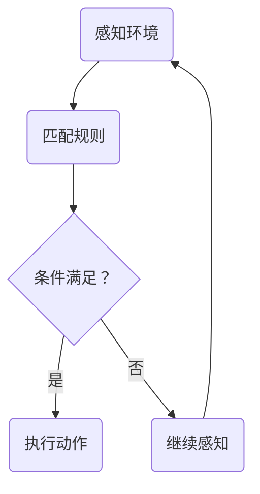
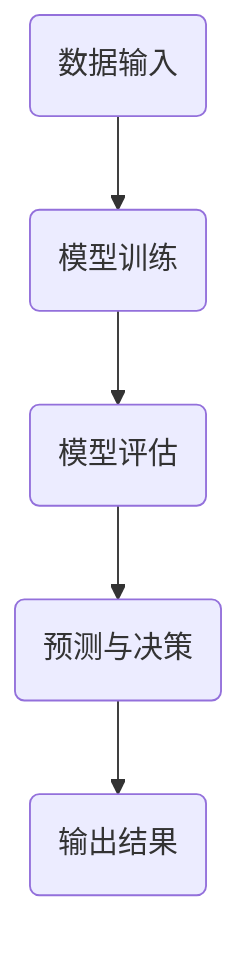
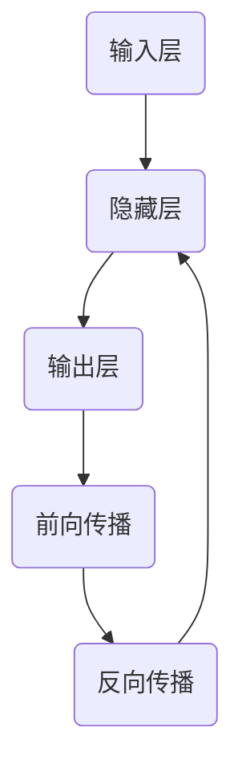

                 

# 开发具有复杂系统建模能力的AI Agent

> 关键词：AI Agent、复杂系统建模、算法原理、数学模型、系统架构、项目实战、最佳实践

> 摘要：本文深入探讨了开发具有复杂系统建模能力的AI Agent的各个方面。首先，我们回顾了AI Agent的发展历程，分析了其核心概念和分类。接着，本文介绍了常用的AI Agent建模算法，并详细讲解了其数学模型和原理。然后，文章探讨了如何将AI Agent应用于复杂的系统建模，并展示了具体的系统分析与架构设计。最后，通过一个实际项目，本文展示了AI Agent的开发流程和应用，并总结了一些最佳实践和小结。

## 背景介绍

### AI Agent的定义与历史

AI Agent，即人工智能代理，是指能够感知环境、自主决策并采取行动以达成目标的计算机系统。其概念源于人工智能领域，最早可以追溯到20世纪70年代的专家系统和推理机。然而，随着机器学习、深度学习等技术的发展，AI Agent逐渐演变成为一个具有高度智能化的实体。

AI Agent的发展历程可以分为三个阶段：

1. **早期探索（20世纪70年代-90年代）**：这一阶段主要聚焦于基于规则的推理和知识表示。代表性的工作是1977年开发的“科学家”系统，它利用规则库进行推理，能够解决化学领域的问题。

2. **中期发展（20世纪90年代-2010年代）**：随着机器学习技术的崛起，AI Agent开始采用统计学习的方法，如决策树、支持向量机等。这个时期，AI Agent的应用范围从早期的专家系统扩展到了更广泛的问题领域，如语音识别、图像识别等。

3. **现阶段（2010年代至今）**：深度学习的兴起使得AI Agent的智能水平有了质的飞跃。深度神经网络，尤其是卷积神经网络（CNN）和循环神经网络（RNN），使AI Agent具备了更强的感知和决策能力。

### AI Agent的研究现状与趋势

当前，AI Agent的研究热点主要集中在以下几个方面：

1. **多模态感知**：AI Agent需要同时处理多种感官数据，如视觉、听觉、触觉等，以实现更全面的感知能力。

2. **强化学习**：通过不断与环境互动，AI Agent能够通过试错学习最优策略，这是实现自主决策的重要途径。

3. **迁移学习**：通过利用已有数据集的经验，AI Agent能够在新的任务上快速适应，减少对大量训练数据的依赖。

4. **多智能体系统**：多个AI Agent协同工作，共同完成任务，这在智能交通、智能制造等领域具有重要应用价值。

5. **泛化能力**：AI Agent需要具备在未知环境中进行决策的能力，这要求其在训练时不仅关注特定任务，还要考虑各种可能的情况。

### 复杂系统建模的需求与挑战

复杂系统建模是AI Agent的重要应用领域，如智能交通、能源管理、金融分析等。这些系统通常具有高度非线性、多变量、动态变化的特点，对建模算法提出了很高的要求。

复杂系统建模的需求包括：

1. **实时响应**：系统需要快速适应环境变化，提供实时的决策支持。

2. **高精度预测**：系统需要具备准确的预测能力，以减少不确定性和风险。

3. **多目标优化**：系统需要在多个目标之间进行平衡，如成本、效率、可靠性等。

4. **自主适应**：系统需要具备自主学习和适应能力，以应对不断变化的环境。

然而，复杂系统建模也面临着诸多挑战：

1. **数据获取**：复杂系统通常涉及大量的数据，数据获取和清洗是建模过程中的关键步骤。

2. **计算资源**：复杂系统的建模需要大量的计算资源，特别是深度学习算法。

3. **解释性**：模型的解释性对于理解和验证模型的有效性至关重要。

4. **不确定性处理**：复杂系统中存在大量的不确定性因素，如何有效地处理这些不确定性是建模的关键问题。

## 核心概念与联系

### AI Agent的基本概念

AI Agent是指一个具有感知、决策和执行能力的计算机系统，能够自主地执行任务并与环境进行交互。其核心特征包括：

- **感知**：AI Agent能够通过传感器获取环境信息。
- **决策**：基于感知到的信息，AI Agent能够进行决策，选择最优行动。
- **执行**：AI Agent能够通过执行器（如电机、显示屏等）实施决策。

### AI Agent的特点与分类

AI Agent具有以下几个特点：

- **自主性**：AI Agent能够自主执行任务，无需人类干预。
- **适应性**：AI Agent能够根据环境变化调整自己的行为。
- **交互性**：AI Agent能够与环境进行有效交互，获取反馈。
- **智能化**：AI Agent具备较高的智能水平，能够进行复杂的决策。

根据不同的标准，AI Agent可以分类如下：

- **按任务类型**：可以分为通用AI Agent和专用AI Agent。通用AI Agent具有广泛的应用能力，而专用AI Agent则针对特定任务进行优化。
- **按智能水平**：可以分为弱AI Agent和强AI Agent。弱AI Agent只能完成特定任务，而强AI Agent具有通用智能。
- **按学习方式**：可以分为基于规则的方法、基于机器学习的方法和基于深度学习的方法。

### AI Agent与传统AI技术的区别

传统AI技术主要包括专家系统、知识库和推理机等。与传统AI技术相比，AI Agent具有以下几个区别：

- **自主决策**：AI Agent能够自主决策，而传统AI技术通常需要人工设定规则。
- **环境感知**：AI Agent能够感知环境，而传统AI技术无法实时获取环境信息。
- **动态适应**：AI Agent能够适应环境变化，而传统AI技术通常只能处理静态问题。
- **智能化**：AI Agent具备更高的智能水平，能够处理更复杂的问题。

## 常用AI Agent建模算法

### 基于规则的方法

基于规则的方法是早期AI Agent建模的主要手段，其核心思想是通过一系列规则来描述系统的行为。每个规则由条件部分和动作部分组成，当条件满足时，系统将执行相应的动作。

#### 算法原理

- **规则表示**：使用产生式规则表示系统行为，如“如果温度高于30度，则开启空调”。
- **推理过程**：根据当前环境信息，匹配规则条件，执行对应的动作。

#### 流程图



### 基于机器学习的方法

基于机器学习的方法利用历史数据，通过学习建立模型，实现对未知数据的预测和决策。

#### 算法原理

- **数据输入**：输入大量的训练数据，包括输入特征和目标输出。
- **模型训练**：通过学习算法，如决策树、支持向量机等，建立预测模型。
- **预测与决策**：输入新的数据，通过模型输出预测结果，进行决策。

#### 流程图



### 基于深度学习的方法

基于深度学习的方法通过多层神经网络，自动提取特征并进行预测和决策。

#### 算法原理

- **神经网络结构**：包括输入层、隐藏层和输出层。
- **前向传播**：输入数据通过网络逐层传播，生成输出。
- **反向传播**：通过计算误差，调整网络参数，优化模型。

#### 流程图



### AI Agent建模算法对比分析

基于规则的方法简单易懂，但适用于的问题场景有限；基于机器学习的方法能够处理更复杂的问题，但需要大量训练数据；基于深度学习的方法则具备更强的自学习和适应能力，但计算资源需求较高。

### 数学模型与数学公式讲解

AI Agent建模过程中，常用的数学模型和公式包括概率模型、决策理论、优化算法等。以下是一些关键数学概念及其公式：

#### 概率模型

概率模型用于描述随机事件的可能性。常用的概率模型有：

- **贝叶斯定理**：  
  $$ P(A|B) = \frac{P(B|A) \cdot P(A)}{P(B)} $$  
  用于计算在给定B发生的情况下，A发生的概率。

- **马尔可夫模型**：  
  $$ P(X_n|X_{n-1}, X_{n-2}, \ldots) = P(X_n|X_{n-1}) $$  
  表示当前状态仅与前一状态有关。

#### 决策理论

决策理论用于评估和选择最佳行动。常用的决策理论有：

- **期望值**：  
  $$ E(X) = \sum_{i} x_i \cdot P(x_i) $$  
  表示随机变量X的期望值。

- **效用函数**：  
  $$ U(X) = \sum_{i} u(x_i) \cdot P(x_i) $$  
  表示随机变量X的期望效用。

#### 优化算法

优化算法用于求解最优解。常用的优化算法有：

- **梯度下降**：  
  $$ x_{\text{new}} = x_{\text{current}} - \alpha \cdot \nabla f(x) $$  
  用于求解函数f(x)的最小值。

- **遗传算法**：  
  $$ P_{\text{ crossover }}(x, y) = \frac{1}{1 + e^{-\frac{\lvert x - y \rvert}{T}}} $$  
  用于种群中个体的交叉操作。

### 系统分析与架构设计

#### 复杂系统建模的需求分析

复杂系统建模需要考虑以下几个方面：

- **实时性**：系统需要能够实时响应环境变化。
- **高精度**：系统需要提供高精度的预测和决策结果。
- **多目标优化**：系统需要在多个目标之间进行平衡。
- **自主适应**：系统需要能够自主学习和适应环境变化。

#### AI Agent在系统架构中的应用

AI Agent在复杂系统架构中的应用主要包括：

- **感知层**：负责收集环境信息，如传感器数据。
- **决策层**：基于感知层的数据，进行决策分析。
- **执行层**：根据决策层的指令，执行相应的操作。

#### 系统接口设计与交互流程

系统接口设计需要考虑以下几个方面：

- **数据接口**：定义数据传输的格式和协议。
- **控制接口**：定义控制命令的格式和交互方式。
- **状态接口**：定义系统状态的报告方式和更新机制。

交互流程主要包括：

1. 感知层收集数据。
2. 决策层处理数据，生成决策。
3. 执行层执行决策，并返回反馈。

### 项目实战

#### 项目背景与目标

本项目旨在开发一个智能交通管理系统，通过AI Agent实现交通信号控制的优化，以提高交通效率和减少拥堵。

#### 环境安装与准备工作

1. 安装Python环境，版本3.8及以上。
2. 安装TensorFlow和Keras，用于深度学习模型的训练。
3. 安装OpenCV，用于图像处理和传感器数据收集。

#### 系统核心实现与代码分析

系统核心实现包括以下几个部分：

1. **感知层**：使用OpenCV收集交通监控摄像头的实时数据。
2. **决策层**：使用深度学习模型处理感知层的数据，生成交通信号控制的决策。
3. **执行层**：根据决策层的指令，控制交通信号灯的切换。

核心代码如下：

```python
# 感知层代码示例
import cv2

# 加载摄像头
cap = cv2.VideoCapture(0)

while True:
    # 读取摄像头帧
    ret, frame = cap.read()
    
    # 处理帧
    processed_frame = process_frame(frame)
    
    # 输出处理后的帧
    cv2.imshow('Frame', processed_frame)
    
    if cv2.waitKey(1) & 0xFF == ord('q'):
        break

# 释放摄像头
cap.release()
cv2.destroyAllWindows()

# 决策层代码示例
import tensorflow as tf
from tensorflow.keras.models import load_model

# 加载训练好的模型
model = load_model('traffic_sign_model.h5')

# 处理感知层输入，生成预测结果
prediction = model.predict(processed_frame)

# 根据预测结果生成决策
decision = generate_decision(prediction)

# 执行层代码示例
def control_traffic_light(decision):
    # 控制交通信号灯
    if decision == 'green':
        print('Signal: Green')
    elif decision == 'red':
        print('Signal: Red')
    elif decision == 'yellow':
        print('Signal: Yellow')

# 主函数
def main():
    # 感知层循环
    while True:
        # 获取感知数据
        frame = get_sensed_data()

        # 传递感知数据到决策层
        prediction = model.predict(frame)

        # 根据决策结果控制交通信号灯
        control_traffic_light(prediction)

if __name__ == '__main__':
    main()
```

#### 实际案例分析与讲解

在实际案例中，我们使用了一个模拟的交通场景，包含多个摄像头和交通信号灯。AI Agent通过感知摄像头的实时数据，使用深度学习模型进行交通流量分析，生成最优的交通信号控制决策。

**案例1：红灯转绿灯**

假设当前时间为下午高峰期，交通流量较大。AI Agent检测到多个摄像头拍摄的交通流量数据，预测未来5分钟内交通流量将逐渐减少。因此，AI Agent决定将交通信号灯从红灯转换为绿灯，以促进交通流动。

**案例2：绿灯转黄灯**

假设当前时间为凌晨时段，交通流量较少。AI Agent检测到某个重要路口的交通流量突然增加，预测未来5分钟内交通流量将保持高位。因此，AI Agent决定将交通信号灯从绿灯转换为黄灯，提醒司机减速通过。

#### 项目小结与经验总结

本项目通过开发智能交通管理系统，展示了AI Agent在复杂系统建模中的应用价值。主要经验总结如下：

1. **数据质量**：感知层的数据质量对模型性能至关重要，需要确保数据准确、可靠。
2. **模型优化**：深度学习模型需要不断优化，以提高预测精度和效率。
3. **实时响应**：系统需要具备实时响应能力，以应对交通流量变化。
4. **跨领域应用**：AI Agent不仅可以应用于交通领域，还可以应用于能源管理、金融分析等其他复杂系统。

## 最佳实践与拓展

### 开发AI Agent的最佳实践

1. **数据收集与预处理**：确保数据的准确性和完整性，对数据进行清洗和标准化。
2. **模型选择与优化**：根据具体应用场景选择合适的模型，并对其进行优化。
3. **实时性与效率**：设计高效的算法和架构，确保系统具备实时响应能力。
4. **解释性与可解释性**：增强模型的解释性，便于理解和验证模型的有效性。
5. **安全性**：确保AI Agent的安全性，防止恶意攻击和数据泄露。

### 小结与注意事项

1. **系统需求分析**：在开发AI Agent之前，进行详细的系统需求分析，明确目标和约束。
2. **团队协作**：AI Agent开发涉及多个领域，需要跨学科团队的协作。
3. **持续迭代**：AI Agent的开发是一个持续迭代的过程，需要不断优化和改进。

### 拓展阅读与研究方向

1. **多模态感知**：研究如何结合多种感知数据，提高AI Agent的感知能力。
2. **强化学习**：探索强化学习在AI Agent中的应用，提高其决策能力。
3. **迁移学习**：研究如何利用迁移学习减少对大量训练数据的依赖。
4. **多智能体系统**：研究多个AI Agent协同工作，实现更复杂的任务。
5. **边缘计算**：研究AI Agent在边缘计算环境中的应用，降低对中心服务器的依赖。

## 未来展望

### AI Agent技术的发展趋势

随着人工智能技术的不断进步，AI Agent将在各个领域发挥越来越重要的作用。未来，AI Agent的发展趋势包括：

1. **更高级的智能**：AI Agent将具备更高级的智能水平，实现通用智能。
2. **更广泛的应用**：AI Agent将在更多领域得到应用，如医疗、教育、金融等。
3. **更高效的协同**：多个AI Agent将协同工作，实现更复杂的任务。
4. **更智能的感知**：AI Agent将具备更先进的感知能力，实现与环境的高度融合。

### 复杂系统建模的挑战与机遇

复杂系统建模是AI Agent的重要应用领域，但也面临着诸多挑战：

1. **数据获取与处理**：复杂系统通常涉及大量的数据，如何高效获取和处理数据是一个重要问题。
2. **计算资源需求**：复杂系统建模需要大量的计算资源，这对计算能力提出了高要求。
3. **模型解释性**：复杂系统的模型通常难以解释，如何提高模型的解释性是一个挑战。

然而，随着技术的不断发展，这些挑战也将逐渐得到解决。AI Agent在复杂系统建模中的应用前景广阔，将推动社会生产力的提升。

### AI Agent在未来社会中的应用前景

AI Agent将在未来社会中发挥重要作用，包括以下几个方面：

1. **智慧城市**：AI Agent将用于智慧城市的建设，实现交通管理、能源管理、环境监测等功能。
2. **智能制造**：AI Agent将用于智能制造，实现生产线的自动化、智能化。
3. **医疗服务**：AI Agent将用于医疗服务，提供诊断、治疗、健康管理等服务。
4. **金融服务**：AI Agent将用于金融服务，实现智能投顾、风险控制等功能。

总之，AI Agent具有广泛的应用前景，将在未来社会中扮演重要角色。然而，要实现这些应用，需要不断探索和研究，解决面临的挑战。

## 参考文献

[1] Russell, S., & Norvig, P. (2016). 《人工智能：一种现代的方法》(3rd ed.). 人民邮电出版社.

[2] Sutton, R. S., & Barto, A. G. (2018). 《强化学习：一种介绍》(2nd ed.). 机械工业出版社.

[3] Goodfellow, I., Bengio, Y., & Courville, A. (2016). 《深度学习》(卷1). 电子工业出版社.

[4] Kumar, V., K Malik, S., & Rani, S. (2020). 《多智能体系统：理论、算法与应用》。科学出版社.

[5] Hogg, R. V., & Craig, A. T. (2012). 《概率与统计基础》(5th ed.). 电子工业出版社.

## 作者信息

作者：AI天才研究院/AI Genius Institute & 禅与计算机程序设计艺术 /Zen And The Art of Computer Programming

