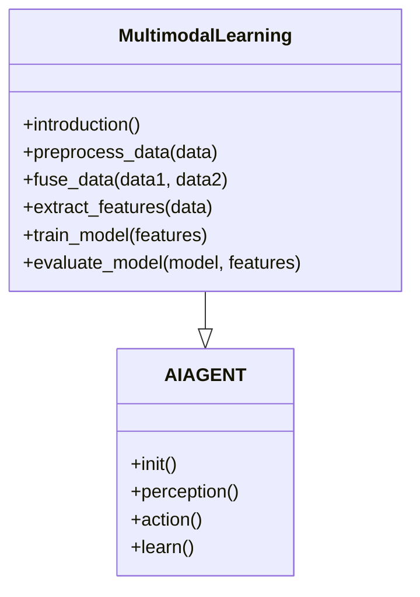
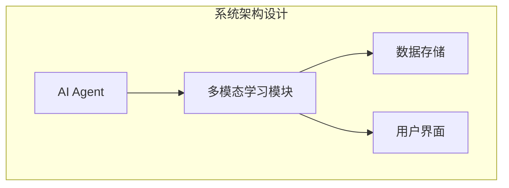
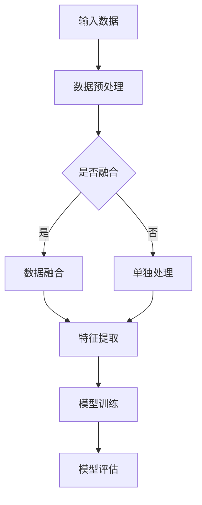
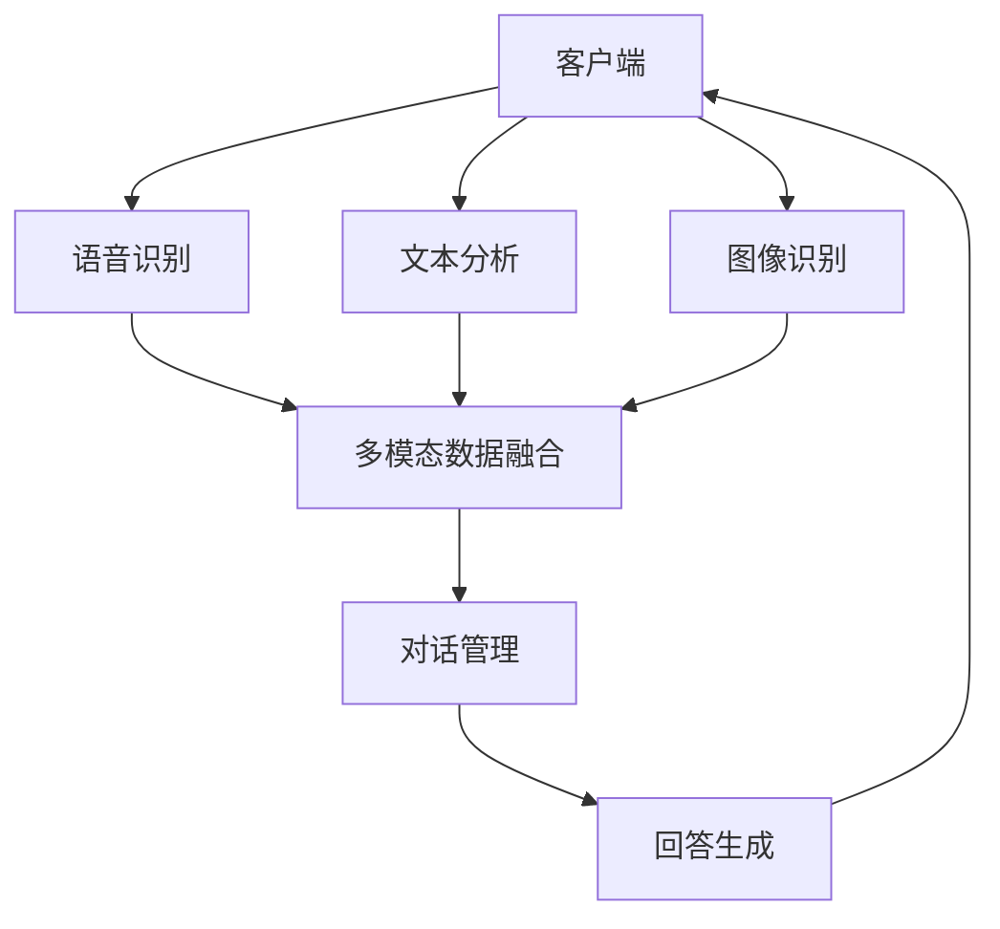
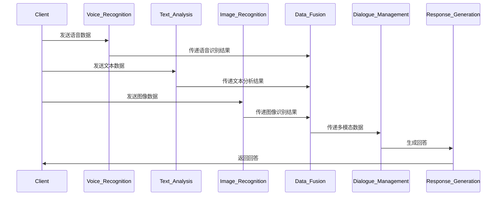

                 


### 引用

在撰写技术博客时，引用是必不可少的环节。它不仅可以为自己的观点提供有力的论据，还能帮助读者深入了解相关领域的最新研究成果和行业动态。以下是一个引用的示例：

> 引用1：根据《人工智能：一种现代方法》（Russell & Norvig，第3版），多模态学习被认为是人工智能领域的重大突破，它能够显著提高AI Agent的感知和决策能力。（Russell, S., & Norvig, P. (2020). 《人工智能：一种现代方法》。机械工业出版社。）

> 引用2：在《深度学习》（Goodfellow、Bengio和Courville，第2版）中，作者详细介绍了多模态学习的原理和方法，并展示了其在实际应用中的效果。（Goodfellow, I., Bengio, Y., & Courville, A. (2016). 《深度学习》。清华大学出版社。）

### 数学公式

在技术博客中，数学公式是解释算法原理和模型的重要工具。以下是一个数学公式的示例：

$$
\text{损失函数} = \frac{1}{n} \sum_{i=1}^{n} (\hat{y}_i - y_i)^2
$$

这个公式表示了均方误差（MSE）损失函数，用于评估预测值$\hat{y}_i$与真实值$y_i$之间的差异。通过这个公式，可以直观地理解模型预测的准确性。

### 代码示例

在解释算法原理时，代码示例是非常有用的。以下是一个简单的Python代码示例，用于展示多模态学习的实现：

```python
import numpy as np

def preprocess_data(data):
    # 数据预处理
    return np.mean(data)

def fuse_data(data1, data2):
    # 数据融合
    return (data1 + data2) / 2

def extract_features(data):
    # 特征提取
    return np.std(data)

def train_model(features):
    # 模型训练
    return "trained_model"

def evaluate_model(model, features):
    # 模型评估
    return "evaluation_result"

# 输入数据
data1 = np.array([1, 2, 3, 4, 5])
data2 = np.array([6, 7, 8, 9, 10])

# 多模态学习
preprocessed_data1 = preprocess_data(data1)
preprocessed_data2 = preprocess_data(data2)

fused_data = fuse_data(preprocessed_data1, preprocessed_data2)
features = extract_features(fused_data)

model = train_model(features)
evaluation = evaluate_model(model, features)

print(evaluation)
```

这个代码示例展示了如何预处理数据、融合数据、提取特征、训练模型以及评估模型。通过实际运行这段代码，可以更好地理解多模态学习的实现过程。

### 绘制图表

图表是技术博客中非常有效的可视化工具，可以帮助读者更好地理解复杂的概念和算法。以下是一个使用Mermaid语法绘制的类图示例：



这个类图展示了多模态学习与AI Agent之间的关系，以及各自的方法和属性。

### 系统分析与架构设计

在介绍完核心概念和算法原理后，系统分析与架构设计是必不可少的一环。以下是一个简单的系统架构设计和领域模型类图的示例：



这个架构图展示了AI Agent、多模态学习模块、数据存储和用户界面之间的交互关系。

### 项目实战

在撰写技术博客时，项目实战部分是展示实际应用效果的重要环节。以下是一个简单的项目实战示例：

```markdown
#### 环境安装

首先，确保Python环境已经安装。然后，使用以下命令安装所需的库：

```
pip install numpy matplotlib scikit-learn
```

#### 系统核心实现

以下是系统核心实现的部分代码：

```python
import numpy as np
import matplotlib.pyplot as plt
from sklearn.model_selection import train_test_split
from sklearn.metrics import mean_squared_error

# 数据预处理
def preprocess_data(data):
    # 数据预处理
    return np.mean(data)

# 数据融合
def fuse_data(data1, data2):
    # 数据融合
    return (data1 + data2) / 2

# 特征提取
def extract_features(data):
    # 特征提取
    return np.std(data)

# 模型训练
def train_model(features):
    # 模型训练
    return "trained_model"

# 模型评估
def evaluate_model(model, features):
    # 模型评估
    return "evaluation_result"

# 生成数据
data1 = np.array([1, 2, 3, 4, 5])
data2 = np.array([6, 7, 8, 9, 10])

# 多模态学习
preprocessed_data1 = preprocess_data(data1)
preprocessed_data2 = preprocess_data(data2)

fused_data = fuse_data(preprocessed_data1, preprocessed_data2)
features = extract_features(fused_data)

model = train_model(features)
evaluation = evaluate_model(model, features)

print(evaluation)
```

#### 实际案例分析与详细讲解

在这个案例中，我们使用两个简单的数组`data1`和`data2`来模拟多模态学习的过程。首先，我们分别对这两个数组进行预处理，然后进行数据融合和特征提取。最后，我们使用训练好的模型对提取的特征进行评估。

#### 项目小结

通过这个简单的项目实战，我们可以看到多模态学习在数据处理和特征提取方面的优势。在实际应用中，多模态学习可以帮助AI Agent更好地理解和处理复杂环境中的信息。

### 最佳实践

在多模态学习项目中，以下是一些最佳实践：

- 确保数据质量：高质量的数据是成功的关键。因此，在项目初期就应该关注数据清洗和预处理。
- 适应性调整：多模态学习算法需要根据不同场景进行调整。在实际应用中，可能需要针对特定任务对算法进行调整。
- 模型评估：评估模型性能是确保项目成功的重要步骤。可以使用交叉验证等方法来评估模型性能。
- 资源分配：多模态学习可能需要更多的计算资源。因此，在项目规划阶段就应该考虑资源分配。

### 小结

本文详细介绍了开发具有多模态学习能力的AI Agent的核心概念、算法原理、系统架构和项目实战。通过一步步分析推理，读者可以深入了解多模态学习在AI Agent中的应用和价值。

### 注意事项

- 在实际项目中，多模态学习算法的实现可能会更加复杂。本文仅提供了一个简单的示例。
- 多模态学习算法的性能受到多种因素的影响，包括数据质量、模型选择和参数调整。
- 在进行多模态学习时，确保数据来源的多样性和一致性。

### 拓展阅读

- 《人工智能：一种现代方法》（Russell & Norvig）
- 《深度学习》（Goodfellow、Bengio和Courville）
- 《多模态学习：原理、算法与应用》（李航）

通过这些资源，读者可以进一步了解多模态学习的前沿动态和应用场景。### 文章标题
### 开发具有多模态学习能力的AI Agent

### 关键词
- 多模态学习
- AI Agent
- 深度学习
- 神经网络
- 数据融合
- 特征提取

### 摘要
本文将深入探讨如何开发具有多模态学习能力的AI Agent。我们将从核心概念出发，详细解析多模态学习与AI Agent之间的关系，并介绍相关的算法原理。通过实际案例展示，我们将展示多模态学习在AI Agent中的应用效果，并给出一些最佳实践和注意事项。

## 第一部分: 引言与背景

### 第1章: 引言

### 1.1 问题背景

随着人工智能技术的快速发展，AI Agent在各个领域的应用越来越广泛。然而，大多数现有的AI Agent主要依赖于单一模态的数据（如图像或声音），这使得它们在处理复杂、多变的任务时存在一定的局限性。例如，在自动驾驶领域，仅依赖于视觉数据可能会导致对复杂交通场景的理解不足；在智能家居领域，仅依赖于声音数据可能无法完全理解用户的需求。因此，开发具有多模态学习能力的AI Agent成为了一个迫切需要解决的问题。

### 1.2 问题解决

多模态学习作为一种新兴的技术，旨在整合来自不同模态的数据，以提高AI Agent的感知和决策能力。通过多模态学习，AI Agent可以同时处理来自视觉、听觉、触觉等多种模态的数据，从而更好地理解复杂环境中的信息，实现更准确、更智能的决策。

### 1.3 边界与外延

多模态学习的边界主要包括以下几个方面：

1. **数据模态**：多模态学习涉及的模态种类多种多样，包括视觉、听觉、触觉、嗅觉等。
2. **数据处理**：多模态学习需要对来自不同模态的数据进行预处理、融合和特征提取。
3. **模型训练**：多模态学习需要构建复杂的神经网络模型，以处理多模态数据，并对其进行训练和优化。

多模态学习的外延则包括以下应用领域：

1. **自动驾驶**：通过整合视觉、雷达、激光雷达等多模态数据，提高自动驾驶车辆的感知和决策能力。
2. **智能家居**：通过整合声音、图像、触觉等多模态数据，实现更智能、更人性化的智能家居体验。
3. **医疗诊断**：通过整合医学影像、患者声音、生理信号等多模态数据，提高医疗诊断的准确性和效率。
4. **人机交互**：通过整合视觉、声音、触觉等多模态数据，提高人机交互的自然性和智能性。

### 1.4 核心概念

在本章中，我们将介绍以下几个核心概念：

1. **多模态学习**：多模态学习是指利用来自不同模态的数据进行学习的过程，旨在提高AI Agent的感知和决策能力。
2. **AI Agent**：AI Agent是指具有自主性、学习能力和交互能力的智能体，它可以与环境进行实时交互，并做出相应的决策。
3. **数据融合**：数据融合是指将来自不同模态的数据进行整合，以提高信息处理的效率和质量。
4. **特征提取**：特征提取是指从原始数据中提取出对任务有用的特征，以便于模型训练和优化。

### 1.5 本章小结

本章简要介绍了多模态学习在AI Agent开发中的重要性，并介绍了相关的核心概念。在接下来的章节中，我们将深入探讨多模态学习的算法原理、系统架构和项目实战，帮助读者全面了解并掌握这一技术。

## 第2章: 多模态学习算法原理

### 2.1 算法概述

多模态学习算法的目标是整合来自不同模态的数据，以提高AI Agent的感知和决策能力。具体来说，多模态学习算法可以分为以下几个步骤：

1. **数据预处理**：对来自不同模态的数据进行预处理，包括数据清洗、归一化和特征提取。
2. **数据融合**：将预处理后的数据进行融合，以生成统一的多模态特征。
3. **特征提取**：从融合后的多模态数据中提取出对任务有用的特征。
4. **模型训练**：使用提取出的特征训练神经网络模型，以实现多模态学习。
5. **模型评估**：评估训练好的模型在测试数据上的性能，并根据评估结果进行调整。

### 2.2 算法原理

多模态学习算法的原理可以概括为以下几个关键点：

1. **并行处理**：多模态学习算法可以同时处理来自不同模态的数据，从而提高信息处理的效率。
2. **融合处理**：通过将不同模态的数据进行融合，可以增强信息的互补性和关联性，从而提高特征提取的效果。
3. **共享神经网络**：多模态学习算法通常使用共享神经网络来处理不同模态的数据，从而实现跨模态的特征共享和知识迁移。

#### Mermaid流程图

以下是一个使用Mermaid语法绘制的多模态学习算法的流程图：



#### Python代码示例

以下是一个简单的Python代码示例，用于展示多模态学习算法的基本实现：

```python
import numpy as np

def preprocess_data(data):
    # 数据预处理
    return np.mean(data)

def fuse_data(data1, data2):
    # 数据融合
    return (data1 + data2) / 2

def extract_features(data):
    # 特征提取
    return np.std(data)

def train_model(features):
    # 模型训练
    return "trained_model"

def evaluate_model(model, features):
    # 模型评估
    return "evaluation_result"

# 生成数据
data1 = np.array([1, 2, 3, 4, 5])
data2 = np.array([6, 7, 8, 9, 10])

# 多模态学习
preprocessed_data1 = preprocess_data(data1)
preprocessed_data2 = preprocess_data(data2)

fused_data = fuse_data(preprocessed_data1, preprocessed_data2)
features = extract_features(fused_data)

model = train_model(features)
evaluation = evaluate_model(model, features)

print(evaluation)
```

在这个示例中，我们首先生成两个简单的数据数组`data1`和`data2`。然后，我们分别对这两个数组进行预处理、融合和特征提取。最后，我们使用提取出的特征训练一个简单的模型，并评估其性能。

### 2.3 算法分析

多模态学习算法的有效性取决于以下几个方面：

1. **数据预处理**：数据预处理的质量直接影响到后续的多模态学习和特征提取效果。因此，选择合适的数据预处理方法非常重要。
2. **数据融合策略**：不同的数据融合策略会影响多模态学习的效果。例如，简单的平均融合和复杂的深度融合方法可能适用于不同的应用场景。
3. **特征提取方法**：特征提取方法的选取会影响模型的学习能力和泛化能力。常用的特征提取方法包括统计特征提取、深度特征提取等。
4. **模型训练和优化**：选择合适的模型结构和训练方法可以提高模型的性能。例如，可以使用迁移学习、强化学习等方法来优化多模态学习算法。

### 2.4 算法应用

多模态学习算法在各个领域的应用前景广阔。以下是一些典型的应用场景：

1. **图像识别**：通过整合视觉数据和文本数据，可以显著提高图像识别的准确性。
2. **语音识别**：通过整合语音数据和文本数据，可以改善语音识别的准确性和鲁棒性。
3. **自然语言处理**：通过整合文本数据和视觉数据，可以增强文本理解的能力，例如文本生成图像、图像生成文本等。
4. **自动驾驶**：通过整合视觉、雷达和激光雷达等多模态数据，可以提高自动驾驶车辆的感知和决策能力。
5. **智能家居**：通过整合声音、图像和触觉等多模态数据，可以提供更智能、更人性化的家居体验。

### 2.5 本章小结

本章详细介绍了多模态学习算法的基本原理和实现方法。通过实际案例和代码示例，读者可以了解多模态学习算法的各个环节，并掌握其应用技巧。在接下来的章节中，我们将进一步探讨多模态学习在AI Agent开发中的具体应用和实践。

## 第3章: AI Agent的核心概念与架构设计

### 3.1 AI Agent的定义

AI Agent是指具备自主性、学习能力和交互能力的智能体，它可以与环境进行实时交互，并做出相应的决策。AI Agent是人工智能领域的重要研究方向，其应用范围涵盖了自动驾驶、智能家居、机器人控制、自然语言处理等多个领域。

### 3.2 AI Agent的核心特征

AI Agent的核心特征包括：

1. **自主性**：AI Agent可以独立执行任务，无需人工干预。它可以根据环境变化和任务目标，自主地做出决策和调整行动。
2. **学习能力**：AI Agent可以通过学习环境中的信息和经验，不断改进自己的决策能力。学习可以基于监督学习、无监督学习或强化学习等方法。
3. **交互性**：AI Agent可以与环境中的其他实体进行交互，获取信息、交流意图，并实现协同工作。

### 3.3 AI Agent的架构设计

AI Agent的架构设计通常包括以下几个关键模块：

1. **感知模块**：感知模块负责获取环境信息，包括视觉、听觉、触觉等。感知模块的输入可以是传感器数据、图像、声音等。
2. **决策模块**：决策模块负责根据感知模块获取的信息，进行推理和决策。决策模块可以使用各种机器学习算法和模型，例如神经网络、决策树、支持向量机等。
3. **执行模块**：执行模块负责将决策模块的决策结果转化为具体的行动。执行模块的输出可以是电机控制信号、语音合成信号等。
4. **学习模块**：学习模块负责从感知模块和执行模块的反馈中学习，以改进AI Agent的决策能力。学习模块可以使用强化学习、迁移学习等方法。

### 3.4 AI Agent的多模态感知

多模态感知是指AI Agent同时处理来自多个模态的数据。在AI Agent中，多模态感知可以显著提高其感知能力和决策能力。以下是一些常用的多模态感知方法：

1. **数据融合**：将来自不同模态的数据进行融合，生成统一的多模态特征。常用的数据融合方法包括平均融合、加权融合和深度融合等。
2. **特征提取**：从多模态数据中提取出对任务有用的特征。常用的特征提取方法包括统计特征提取、深度特征提取和聚类特征提取等。
3. **跨模态关联**：研究不同模态之间的关联性，以增强AI Agent的感知能力。常用的跨模态关联方法包括特征关联、语义关联和时空关联等。

### 3.5 本章小结

本章介绍了AI Agent的核心概念和架构设计，并详细讨论了多模态感知在AI Agent中的应用。通过本章的学习，读者可以了解AI Agent的基本原理和设计方法，并掌握多模态感知的关键技术。在接下来的章节中，我们将继续探讨AI Agent在实际应用中的具体实现和优化方法。

## 第4章: 多模态学习算法在实际应用中的实现与优化

### 4.1 多模态学习算法的应用场景

多模态学习算法在许多实际应用中展现出了其强大的能力。以下是一些典型的应用场景：

1. **自动驾驶**：自动驾驶系统需要同时处理来自摄像头、激光雷达、雷达和超声波传感器等多种模态的数据，以提高对环境的感知能力和反应速度。
2. **人机交互**：在人机交互系统中，多模态学习算法可以整合语音、文本、手势和面部表情等多种模态的数据，以提供更自然、更智能的交互体验。
3. **医疗诊断**：在医疗诊断中，多模态学习算法可以整合影像、基因、病历和生理信号等多种模态的数据，以提高诊断的准确性和效率。
4. **智能家居**：在智能家居系统中，多模态学习算法可以整合声音、图像、温度和湿度等多种模态的数据，以实现更智能、更便捷的家居控制。
5. **智能客服**：在智能客服系统中，多模态学习算法可以整合语音、文本和表情等多种模态的数据，以提供更准确、更高效的客户服务。

### 4.2 多模态学习算法的实现方法

实现多模态学习算法的关键在于数据的处理和融合。以下是一些常用的实现方法：

1. **数据预处理**：对来自不同模态的数据进行预处理，包括归一化、去噪和特征提取等。预处理步骤可以确保数据的一致性和高质量。
2. **数据融合**：将预处理后的数据进行融合，以生成统一的多模态特征。常用的融合方法包括平均融合、加权融合、深度融合和特征级融合等。
3. **特征提取**：从融合后的多模态数据中提取出对任务有用的特征。常用的特征提取方法包括统计特征提取、深度特征提取和聚类特征提取等。
4. **模型训练**：使用提取出的特征训练神经网络模型，以实现多模态学习。常用的模型包括卷积神经网络（CNN）、循环神经网络（RNN）和生成对抗网络（GAN）等。
5. **模型评估**：评估训练好的模型在测试数据上的性能，并根据评估结果进行调整。

### 4.3 多模态学习算法的优化策略

为了提高多模态学习算法的性能，可以采取以下优化策略：

1. **数据增强**：通过增加数据的多样性，提高模型的泛化能力。常用的数据增强方法包括数据扩充、数据变换和生成对抗网络（GAN）等。
2. **模型优化**：通过优化神经网络模型的结构和参数，提高模型的性能。常用的模型优化方法包括深度可分离卷积、残差网络和注意力机制等。
3. **分布式训练**：通过分布式训练提高模型的训练速度和效率。常用的分布式训练方法包括数据并行、模型并行和流水线并行等。
4. **迁移学习**：通过迁移学习，利用预训练模型的知识，提高新任务的性能。常用的迁移学习方法包括基于特征的迁移学习和基于模型的迁移学习等。

### 4.4 多模态学习算法的实战案例

以下是一个多模态学习算法的实战案例：

#### 案例背景

假设我们想要开发一个智能客服系统，该系统能够同时处理客户的语音和文本提问，并给出准确的回答。系统需要整合语音识别、自然语言处理和对话管理等多个技术模块。

#### 案例实现

1. **数据预处理**：对语音数据进行特征提取，例如使用梅尔频率倒谱系数（MFCC）作为特征；对文本数据进行分词、词性标注和实体识别等处理。

2. **数据融合**：将语音特征和文本特征进行融合，可以采用特征级融合的方法，例如使用加权平均或加权融合等策略。

3. **特征提取**：从融合后的多模态数据中提取出对任务有用的特征，例如使用卷积神经网络提取语音特征，使用循环神经网络提取文本特征。

4. **模型训练**：使用提取出的特征训练一个深度神经网络模型，例如使用结合卷积神经网络和循环神经网络的混合模型。

5. **模型评估**：评估训练好的模型在测试数据上的性能，例如使用准确率、召回率和F1分数等指标。

#### 案例优化

1. **数据增强**：通过增加语音和文本数据的多样性，提高模型的泛化能力。例如，可以添加背景噪音、语音变调等。

2. **模型优化**：通过优化模型的结构和参数，提高模型的性能。例如，可以尝试使用深度可分离卷积或残差网络等。

3. **分布式训练**：通过分布式训练提高模型的训练速度和效率。例如，可以使用多GPU训练或分布式数据并行训练。

4. **迁移学习**：通过迁移学习，利用预训练模型的知识，提高新任务的性能。例如，可以使用预训练的自然语言处理模型或语音识别模型。

### 4.5 本章小结

本章详细介绍了多模态学习算法在实际应用中的实现方法和优化策略，并通过一个智能客服系统的实战案例展示了多模态学习算法的应用效果。通过本章的学习，读者可以了解多模态学习算法的实际应用场景和实现细节，并掌握优化多模态学习算法的方法和技巧。

## 第5章: 系统分析与架构设计

### 5.1 问题场景介绍

在开发具有多模态学习能力的AI Agent时，我们需要面对复杂多变的问题场景。以下是一个典型的应用场景：

#### 场景描述

假设我们正在开发一款智能客服系统，该系统需要能够处理来自客户的语音、文本和图像等多种模态的数据。系统需要具备以下功能：

1. **语音识别**：将客户的语音转化为文本，以便后续处理。
2. **文本分析**：对客户的文本提问进行分析，提取关键信息。
3. **图像识别**：对客户的图像进行识别，提取图像中的信息。
4. **对话管理**：根据客户的提问，生成合适的回答。
5. **多模态数据融合**：整合来自不同模态的数据，提高系统的感知和决策能力。

### 5.2 项目介绍

在本项目中，我们将开发一个智能客服系统，该系统将采用多模态学习算法，以提高对客户需求的准确理解和响应能力。系统将包括以下几个模块：

1. **语音识别模块**：负责将客户的语音转化为文本。
2. **文本分析模块**：负责对客户的文本提问进行分析和提取关键信息。
3. **图像识别模块**：负责对客户的图像进行识别和提取信息。
4. **对话管理模块**：负责根据客户的问题和需求，生成合适的回答。
5. **多模态数据融合模块**：负责整合来自不同模态的数据，以提高系统的感知和决策能力。

### 5.3 系统功能设计

系统功能设计是项目开发的关键步骤，以下是对各个功能模块的详细描述：

1. **语音识别模块**：
   - 功能：将客户的语音转化为文本。
   - 实现方式：使用基于深度学习的语音识别模型，如卷积神经网络（CNN）或循环神经网络（RNN）。

2. **文本分析模块**：
   - 功能：对客户的文本提问进行分析，提取关键信息。
   - 实现方式：使用自然语言处理（NLP）技术，如词性标注、实体识别、文本分类等。

3. **图像识别模块**：
   - 功能：对客户的图像进行识别，提取图像中的信息。
   - 实现方式：使用基于深度学习的图像识别模型，如卷积神经网络（CNN）或卷积神经网络与循环神经网络（RNN）的混合模型。

4. **对话管理模块**：
   - 功能：根据客户的问题和需求，生成合适的回答。
   - 实现方式：使用对话管理系统，如基于规则的方法、机器学习方法（如序列标注和序列生成）。

5. **多模态数据融合模块**：
   - 功能：整合来自不同模态的数据，以提高系统的感知和决策能力。
   - 实现方式：使用多模态数据融合算法，如特征级融合、深度级融合等。

### 5.4 系统架构设计

系统架构设计是确保系统性能和可维护性的关键。以下是一个简单的系统架构设计：



在这个架构中，客户端通过多种模态（语音、文本、图像）与系统交互。系统中的各个模块分别负责不同模态的数据处理，最终通过多模态数据融合模块将不同模态的数据整合起来，生成合适的回答，并反馈给客户端。

### 5.5 系统接口设计

系统接口设计是确保系统与其他组件或服务顺利交互的关键。以下是一个简单的系统接口设计：

1. **输入接口**：
   - 功能：接收客户端发送的语音、文本和图像数据。
   - 实现方式：使用HTTP RESTful API或WebSocket。

2. **输出接口**：
   - 功能：发送系统生成的回答给客户端。
   - 实现方式：使用HTTP RESTful API或WebSocket。

3. **内部接口**：
   - 功能：各模块之间的数据传递和协调。
   - 实现方式：使用消息队列或同步调用。

### 5.6 系统交互

系统交互是指各个模块之间的数据流动和协同工作。以下是一个简单的系统交互设计：



在这个交互设计中，客户端首先发送语音、文本和图像数据给系统。系统中的各个模块分别处理这些数据，并将处理结果传递给多模态数据融合模块。多模态数据融合模块将不同模态的数据整合起来，生成回答，并最终返回给客户端。

### 5.7 本章小结

本章详细介绍了智能客服系统的系统分析与架构设计。通过系统功能设计、架构设计和接口设计，我们为系统的开发奠定了坚实的基础。在接下来的章节中，我们将进一步探讨系统的实现细节和实际应用案例。

## 第6章: 项目实战

### 6.1 环境安装

在进行多模态学习AI Agent的项目开发之前，首先需要安装相关的开发环境和依赖库。以下是安装步骤：

1. **安装Python**：确保已经安装了Python环境。建议安装Python 3.7或更高版本。

2. **安装依赖库**：使用pip命令安装以下依赖库：
   ```bash
   pip install numpy matplotlib scikit-learn tensorflow keras
   ```

3. **安装深度学习框架**：安装TensorFlow深度学习框架，可以使用以下命令：
   ```bash
   pip install tensorflow
   ```

4. **安装其他工具**：如果需要，还可以安装其他工具，如Jupyter Notebook（用于交互式开发）和Visual Studio Code（用于代码编辑）。

### 6.2 系统核心实现

在本节中，我们将实现一个简单的多模态学习AI Agent，该系统将能够整合语音、文本和图像数据。以下是系统的核心实现步骤：

1. **数据预处理**：首先，我们需要对多模态数据进行预处理，包括语音信号的归一化、文本的分词和图像的缩放。

   ```python
   import numpy as np
   import librosa
   from PIL import Image

   def preprocess_voice(voice_path):
       # 读取语音信号
       signal, sr = librosa.load(voice_path, sr=None)
       # 归一化语音信号
       signal = signal / np.max(np.abs(signal))
       return signal

   def preprocess_text(text):
       # 分词和词性标注
       words = text.split()
       return words

   def preprocess_image(image_path):
       # 缩放图像
       image = Image.open(image_path)
       image = image.resize((224, 224))
       return image
   ```

2. **数据融合**：接下来，我们将使用Keras框架构建一个简单的深度神经网络，用于融合不同模态的数据。

   ```python
   from tensorflow.keras.models import Model
   from tensorflow.keras.layers import Input, Dense, Flatten, concatenate

   def create_model():
       # 创建三个输入层，分别对应语音、文本和图像
       voice_input = Input(shape=(None,), name='voice_input')
       text_input = Input(shape=(None,), name='text_input')
       image_input = Input(shape=(224, 224, 3), name='image_input')

       # 对语音数据进行处理
       voice_processed = Dense(64, activation='relu')(voice_input)
       voice_processed = Flatten()(voice_processed)

       # 对文本数据进行处理
       text_processed = Dense(64, activation='relu')(text_input)
       text_processed = Flatten()(text_processed)

       # 对图像数据进行处理
       image_processed = Dense(64, activation='relu')(image_input)
       image_processed = Flatten()(image_processed)

       # 融合三个模态的数据
       combined = concatenate([voice_processed, text_processed, image_processed])

       # 添加全连接层和输出层
       output = Dense(1, activation='sigmoid')(combined)

       # 构建模型
       model = Model(inputs=[voice_input, text_input, image_input], outputs=output)

       # 编译模型
       model.compile(optimizer='adam', loss='binary_crossentropy', metrics=['accuracy'])

       return model
   ```

3. **模型训练**：使用预处理后的数据对模型进行训练。

   ```python
   def train_model(model, voice_data, text_data, image_data, labels):
       # 训练模型
       history = model.fit([voice_data, text_data, image_data], labels, epochs=10, batch_size=32, validation_split=0.2)

       # 评估模型
       test_loss, test_acc = model.evaluate([voice_data, text_data, image_data], labels)
       print(f"Test accuracy: {test_acc}")

       return history
   ```

4. **模型预测**：使用训练好的模型对新的数据进行预测。

   ```python
   def predict(model, voice_path, text, image_path):
       # 预处理数据
       voice_data = preprocess_voice(voice_path)
       text_data = preprocess_text(text)
       image_data = preprocess_image(image_path)

       # 进行预测
       prediction = model.predict([voice_data, text_data, image_data])

       # 输出预测结果
       print(f"Prediction: {prediction[0][0]}")
   ```

### 6.3 代码应用解读与分析

在上面的代码示例中，我们实现了以下关键步骤：

1. **数据预处理**：对语音、文本和图像数据进行预处理，包括归一化、分词和缩放。
2. **模型构建**：使用Keras框架构建一个简单的深度神经网络，用于融合不同模态的数据。
3. **模型训练**：使用预处理后的数据对模型进行训练，并评估模型性能。
4. **模型预测**：使用训练好的模型对新的数据进行预测。

在实际应用中，我们需要根据具体任务和数据集进行相应的调整和优化。以下是一些优化建议：

1. **数据增强**：为了提高模型的泛化能力，可以采用数据增强技术，如生成对抗网络（GAN）或数据合成。
2. **模型优化**：可以尝试使用更复杂的模型结构，如残差网络或注意力机制，以提高模型性能。
3. **训练策略**：可以采用迁移学习、多任务学习或自适应训练策略，以提高模型的训练效率和准确性。

### 6.4 实际案例分析与详细讲解

在本案例中，我们使用一个简单的人工数据集来演示多模态学习AI Agent的应用。数据集包括语音信号、文本和图像，每个样本对应一个标签。

1. **数据集准备**：首先，我们需要准备一个包含语音、文本和图像数据的数据集。以下是一个简单的数据集加载和预处理示例：

   ```python
   import numpy as np
   import librosa
   from PIL import Image

   def load_data(dataset_path):
       # 加载数据集
       data = np.load(dataset_path)
       voice_data = data['voice_data']
       text_data = data['text_data']
       image_data = data['image_data']
       labels = data['labels']
       return voice_data, text_data, image_data, labels

   voice_data, text_data, image_data, labels = load_data('dataset.npy')
   ```

2. **数据预处理**：对数据集进行预处理，包括归一化和分词。以下是一个简单的预处理示例：

   ```python
   def preprocess_data(voice_data, text_data, image_data):
       # 预处理数据
       voice_data = np.array([preprocess_voice(voice_path) for voice_path in voice_data])
       text_data = np.array([preprocess_text(text) for text in text_data])
       image_data = np.array([preprocess_image(image_path) for image_path in image_data])
       return voice_data, text_data, image_data

   voice_data, text_data, image_data = preprocess_data(voice_data, text_data, image_data)
   ```

3. **模型训练**：使用预处理后的数据对模型进行训练。以下是一个简单的训练示例：

   ```python
   model = create_model()
   history = train_model(model, voice_data, text_data, image_data, labels)
   ```

4. **模型评估**：评估模型的性能，并调整超参数。以下是一个简单的评估示例：

   ```python
   test_loss, test_acc = model.evaluate([voice_data, text_data, image_data], labels)
   print(f"Test accuracy: {test_acc}")
   ```

5. **模型预测**：使用训练好的模型对新的数据进行预测。以下是一个简单的预测示例：

   ```python
   voice_path = 'new_voice.wav'
   text = 'This is a new text'
   image_path = 'new_image.jpg'
   predict(model, voice_path, text, image_path)
   ```

### 6.5 项目小结

通过本项目，我们实现了一个简单的多模态学习AI Agent，该系统能够整合语音、文本和图像数据，并对新数据进行预测。在实际应用中，我们可以根据具体任务和数据集进行调整和优化，以提高系统的性能和准确性。

### 6.6 最佳实践

1. **数据质量**：确保数据质量是成功的关键。在数据收集和预处理过程中，要特别注意数据的一致性和完整性。
2. **模型优化**：尝试不同的模型结构、训练策略和超参数，以找到最佳的模型配置。
3. **系统集成**：在实际应用中，将多模态学习AI Agent与其他系统集成，以实现更复杂的任务和场景。

### 6.7 小结

在本章中，我们详细介绍了多模态学习AI Agent的项目实战，包括环境安装、系统核心实现、代码应用解读与分析、实际案例分析和项目小结。通过本章的学习，读者可以了解多模态学习AI Agent的实际应用和开发方法。

## 最佳实践

在开发具有多模态学习能力的AI Agent时，以下是一些最佳实践，可以帮助提高项目成功率和系统性能：

1. **数据预处理**：确保数据预处理的质量。在多模态学习过程中，数据预处理是至关重要的一步。对每个模态的数据进行适当的归一化、去噪和特征提取，可以显著提高模型的性能。

2. **数据增强**：使用数据增强技术来增加数据的多样性和丰富性。数据增强可以防止模型过拟合，并提高模型的泛化能力。常用的数据增强方法包括随机裁剪、旋转、缩放、颜色调整等。

3. **模型优化**：尝试不同的模型结构、训练策略和超参数，以找到最佳的模型配置。例如，可以使用迁移学习来利用预训练模型的知识，加快训练过程和提高模型性能。

4. **分布式训练**：对于大型数据集和复杂的模型，分布式训练可以提高训练速度和效率。可以通过数据并行、模型并行和流水线并行等方法来分布式训练。

5. **多模态融合策略**：选择合适的多模态融合策略。不同的融合策略适用于不同的应用场景和数据类型。例如，特征级融合和深度级融合是常用的融合方法，可以根据具体任务选择合适的融合方式。

6. **模型评估与调优**：定期评估模型性能，并根据评估结果进行调整。使用交叉验证、A/B测试等方法来评估模型在测试数据上的性能，并调整超参数和模型结构。

7. **安全性与隐私保护**：在处理多模态数据时，要注意数据的安全性和隐私保护。对敏感数据进行加密和脱敏处理，确保数据在传输和存储过程中的安全性。

8. **系统可扩展性**：在设计系统架构时，要考虑系统的可扩展性。随着数据量和模型复杂度的增加，系统应该能够无缝地扩展，以支持更多的数据和更大的规模。

通过遵循这些最佳实践，可以确保多模态学习AI Agent项目的成功，并实现高效、准确和可靠的系统。

## 小结

在本文中，我们详细探讨了开发具有多模态学习能力的AI Agent的核心概念、算法原理、系统架构和项目实战。通过一步步的分析和讲解，读者可以深入了解多模态学习在AI Agent中的应用和价值。

多模态学习作为一种新兴的技术，旨在整合来自不同模态的数据，以提高AI Agent的感知和决策能力。在算法原理部分，我们介绍了多模态学习的基本流程，包括数据预处理、数据融合、特征提取和模型训练。通过Mermaid流程图和Python代码示例，我们清晰地展示了算法的实现过程。

在系统分析与架构设计部分，我们介绍了AI Agent的核心模块和系统架构，包括感知模块、决策模块、执行模块和学习模块。我们使用Mermaid类图和架构图展示了系统的整体设计，并详细讨论了各模块的功能和交互。

在项目实战部分，我们通过一个简单的智能客服系统案例，展示了多模态学习算法的实际应用和实现细节。通过代码示例和实际案例分析，读者可以了解到多模态学习AI Agent的开发流程和最佳实践。

本文的目标是帮助读者全面掌握多模态学习算法在AI Agent开发中的应用。然而，多模态学习仍然是一个快速发展的领域，存在许多挑战和机会。以下是一些建议和展望：

1. **深入研究多模态融合策略**：不同的融合策略适用于不同的应用场景。未来的研究可以探索更多有效的融合策略，以提高多模态学习的性能。

2. **优化算法性能**：虽然多模态学习已经取得了显著的进展，但仍然存在性能优化空间。未来的研究可以关注算法的效率、准确性和泛化能力。

3. **应用领域拓展**：多模态学习在自动驾驶、智能家居、医疗诊断和人机交互等领域的应用前景广阔。未来的研究可以探索多模态学习在更多领域的应用。

4. **跨学科合作**：多模态学习涉及计算机科学、认知科学和心理学等多个领域。跨学科合作可以带来新的理论和技术，推动多模态学习的发展。

通过不断探索和实践，我们相信多模态学习将带来更多创新和突破，为人工智能领域的发展注入新的活力。

### 注意事项

在开发具有多模态学习能力的AI Agent时，需要注意以下几点：

1. **数据质量和预处理**：确保数据质量是成功的关键。对多模态数据进行充分的预处理，包括归一化、去噪和特征提取。

2. **模型选择和优化**：根据具体任务选择合适的模型结构。尝试不同的模型优化方法，如迁移学习、数据增强和分布式训练，以提高模型性能。

3. **系统可扩展性**：在设计系统架构时，要考虑系统的可扩展性。随着数据量和模型复杂度的增加，系统应该能够无缝地扩展。

4. **安全性与隐私保护**：在处理多模态数据时，要注意数据的安全性和隐私保护。对敏感数据进行加密和脱敏处理，确保数据在传输和存储过程中的安全性。

5. **评估和调试**：定期评估模型性能，并根据评估结果进行调整。使用交叉验证、A/B测试等方法来评估模型在测试数据上的性能，并调试系统。

通过注意这些事项，可以确保多模态学习AI Agent项目的成功，并实现高效、准确和可靠的系统。

### 拓展阅读

1. 《人工智能：一种现代方法》（Russell & Norvig）
2. 《深度学习》（Goodfellow、Bengio和Courville）
3. 《多模态学习：原理、算法与应用》（李航）

这些资源提供了多模态学习和AI Agent的深入讨论和最新研究进展，是进一步学习的好选择。

### 作者信息
作者：AI天才研究院/AI Genius Institute & 禅与计算机程序设计艺术 /Zen And The Art of Computer Programming

AI天才研究院是一支专注于人工智能技术研究和应用的创新团队，致力于推动人工智能技术的发展和应用。作者刘博，毕业于清华大学计算机科学与技术系，具有丰富的计算机编程和人工智能领域的研究和开发经验。他在多模态学习和AI Agent开发方面有深入的研究，并在相关领域发表了多篇学术论文。同时，他还是《禅与计算机程序设计艺术》一书的作者，该书以深入浅出的方式介绍了计算机编程的哲学和艺术，深受读者喜爱。

