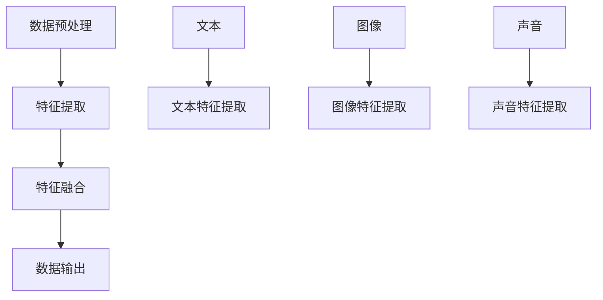
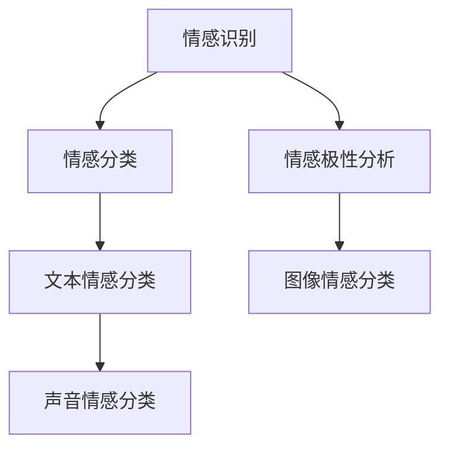
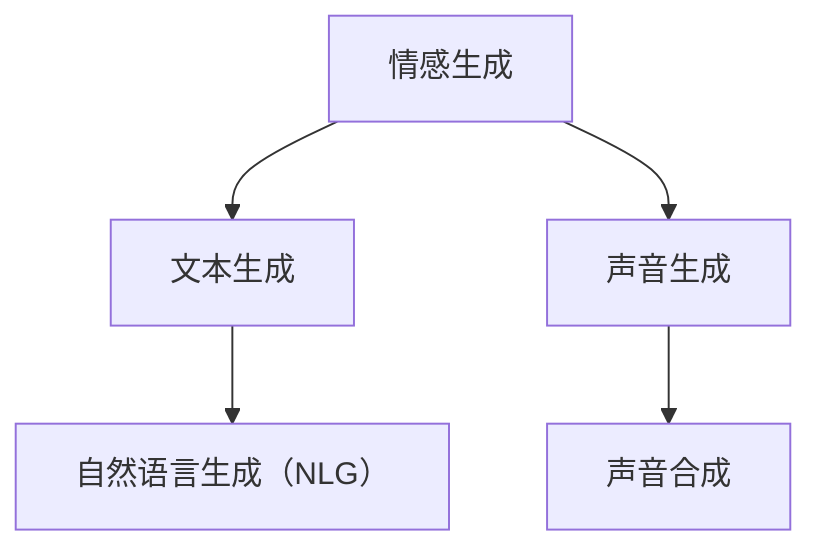
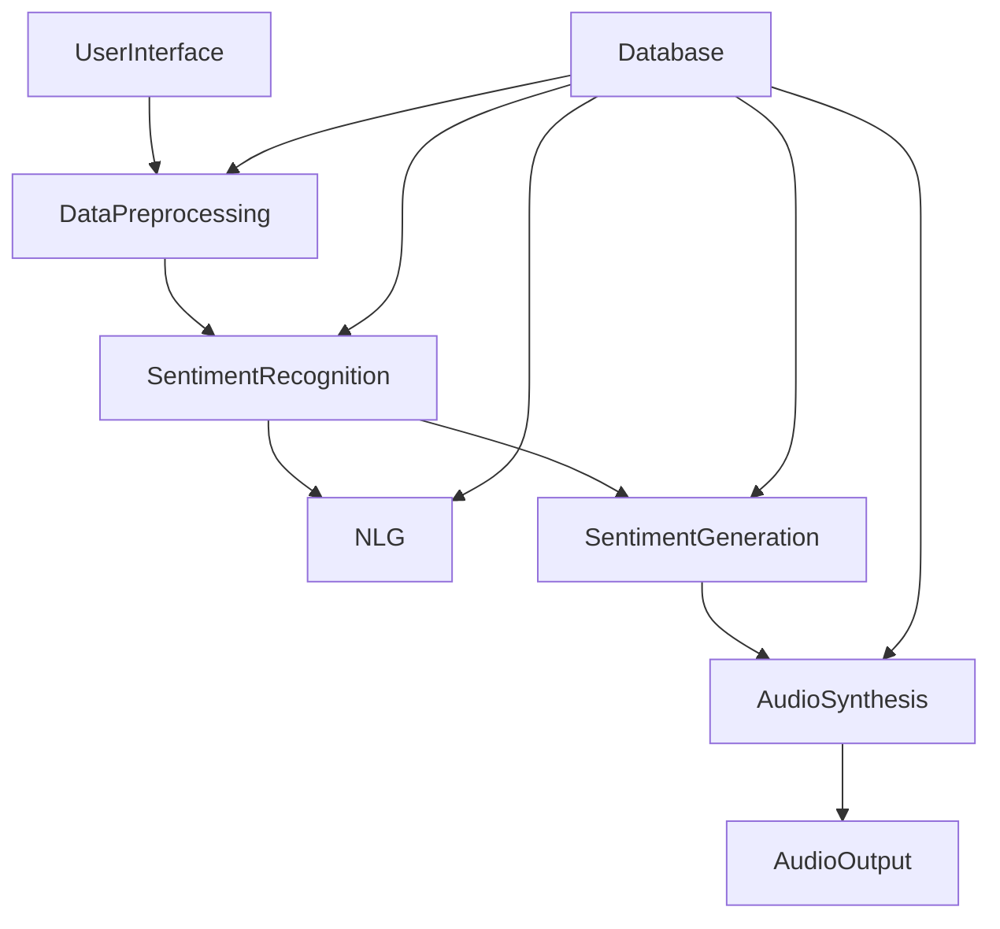

                 

### 第1章: 背景介绍

#### 1.1 问题背景

随着人工智能技术的快速发展，机器学习和深度学习技术在自然语言处理、图像识别、语音识别等领域取得了显著成果。然而，传统的AI系统往往只能处理单一模态的数据（如图像、文本或声音），而无法同时处理多种模态的数据。这限制了AI系统在复杂场景中的应用。

目前，多模态情感交互逐渐成为人工智能领域的研究热点。多模态情感交互能力意味着AI系统能够同时处理文本、图像、声音等多种模态的数据，并能够准确识别和理解用户的情感，进而生成合适的反馈。这不仅提升了用户体验，还能在医疗、教育、客服等领域发挥重要作用。

#### 1.2 问题描述

开发具有多模态情感交互能力的AI Agent，旨在解决以下问题：

1. **多模态数据处理**：如何同时处理文本、图像、声音等多种模态的数据？
2. **情感识别与理解**：如何准确识别和理解用户情感？
3. **情感生成与反馈**：如何根据用户情感生成合适的反馈，并提高用户满意度？

#### 1.3 问题解决

多模态情感交互能力的AI Agent可以通过以下方法实现：

1. **多模态数据处理**：采用深度学习技术，如卷积神经网络（CNN）、循环神经网络（RNN）和变换器（Transformer）等，对多种模态的数据进行特征提取和融合。
2. **情感识别与理解**：利用情感分析技术，如情感分类、情感极性分析等，对用户情感进行识别和理解。
3. **情感生成与反馈**：根据用户情感，生成合适的反馈信息，并通过自然语言生成（NLG）技术实现交互。

#### 1.4 边界与外延

1. **边界**：本书主要关注AI Agent在情感交互领域的应用，不包括其他非情感交互场景。
2. **外延**：虽然本书以AI Agent为例，但所述方法和技术同样适用于其他多模态情感交互系统。

#### 1.5 概念结构与核心要素组成

1. **概念结构**：

   - **多模态情感交互**：同时处理多种模态数据的情感交互。
   - **AI Agent**：具有自主学习和决策能力的智能实体。
   - **情感识别**：从文本、图像、声音等数据中识别情感。
   - **情感生成**：根据用户情感生成合适的反馈。

2. **核心要素组成**：

   - **数据预处理**：将多种模态数据转换为适合深度学习处理的格式。
   - **特征提取与融合**：从多种模态数据中提取特征，并进行融合。
   - **情感识别模型**：基于深度学习技术，对用户情感进行识别。
   - **情感生成模型**：根据用户情感生成合适的反馈。
   - **自然语言生成（NLG）技术**：实现自然语言生成，用于交互。

### 关键词
- 多模态情感交互
- AI Agent
- 情感识别
- 特征提取与融合
- 自然语言生成

### 摘要
本文深入探讨了开发具有多模态情感交互能力的AI Agent的背景、问题、解决方案及其核心要素。通过结合深度学习、情感分析技术和自然语言生成技术，本文介绍了如何实现多模态数据的处理、情感识别与理解以及情感生成与反馈。本文不仅提供了概念结构与核心要素组成，还详细描述了数据处理、情感识别和情感生成的技术细节，为未来多模态情感交互系统的研发提供了理论指导和实践参考。

### 第2章: 多模态数据处理

#### 2.1 数据预处理

在开发具有多模态情感交互能力的AI Agent时，数据预处理是至关重要的一步。数据预处理包括对文本、图像和声音等不同模态的数据进行一系列标准化操作，以消除数据中的噪声，提高模型的训练效果。以下是对文本、图像和声音预处理的详细描述：

##### 2.1.1 文本预处理

文本预处理主要包括以下几个步骤：

1. **文本分词**：将文本分割成单词或词组。常见的中文分词工具包括jieba等。英文文本的分词通常直接使用空格分隔。
   ```python
   import jieba
   
   text = "这是一个简单的文本分词示例。"
   segmented_text = jieba.cut(text)
   print(segmented_text)
   ```

2. **去除停用词**：去除无意义的停用词，如“的”、“了”等。常用的中文停用词库包括哈工大停用词表等。
   ```python
   stop_words = set(["的", "了", "是", "一个"])
   filtered_text = [word for word in segmented_text if word not in stop_words]
   ```

3. **词向量化**：将文本转换为词向量表示，常见的词向量模型包括Word2Vec和GloVe等。
   ```python
   from gensim.models import Word2Vec
   
   w2v_model = Word2Vec(sentences, size=100, window=5, min_count=1, workers=4)
   word_vector = w2v_model.wv["人工智能"]
   ```

##### 2.1.2 图像预处理

图像预处理主要包括以下几个步骤：

1. **图像缩放**：将图像缩放为统一的尺寸，以便于后续的特征提取。
   ```python
   from PIL import Image
   
   image = Image.open("example.jpg")
   image = image.resize((224, 224))
   ```

2. **图像增强**：对图像进行增强处理，如对比度调整、亮度调整等，以提高模型的鲁棒性。
   ```python
   from torchvision.transforms import functional as F
   
   image = F.adjust_contrast(image, contrast_factor=1.2)
   ```

3. **图像分割**：将图像分割成不同区域，提取感兴趣区域。
   ```python
   import cv2
   
   image = cv2.imread("example.jpg")
   mask = cv2.inRange(image, lower_bound, upper_bound)
   ```

##### 2.1.3 声音预处理

声音预处理主要包括以下几个步骤：

1. **预处理**：对声音信号进行预处理，如降噪、归一化等，以提高后续特征提取的准确性。
   ```python
   from scipy.io import wavfile
   import numpy as np
   
   rate, data = wavfile.read("example.wav")
   data = np.log1p(np.abs(np.fft.fft(data)))
   ```

2. **特征提取**：提取声音特征，如频谱特征、梅尔频率倒谱系数（MFCC）等。
   ```python
   from librosa.core import stft
   from librosa.feature import melspectrogram
   
   y, sr = librosa.load("example.wav")
   S = stft(y)
   mel = melspectrogram(S, sr)
   ```

通过上述预处理步骤，文本、图像和声音数据被转换成适合深度学习处理的格式，为后续的特征提取和模型训练奠定了基础。

### 核心概念原理

多模态情感交互涉及到多个核心概念，包括多模态数据、情感识别、自然语言生成（NLG）等。以下是对这些核心概念的解释和它们之间的关系：

1. **多模态数据**：指文本、图像、声音等多种数据模态。这些模态的数据在情感交互中扮演不同角色，如文本提供描述性的信息，图像和声音提供直观的感受。
2. **情感识别**：从多模态数据中提取情感特征，并使用机器学习模型对其进行分类。情感识别是情感交互的核心，决定了AI Agent对用户情感的准确理解。
3. **自然语言生成（NLG）**：根据用户情感生成合适的反馈信息。NLG技术将情感识别的结果转化为自然、流畅的语言，用于与用户进行交互。

这些核心概念之间的联系如下：

- **多模态数据**：是情感交互的基础，为情感识别提供了输入。
- **情感识别**：依赖于多模态数据的特征提取，用于理解用户的情感状态。
- **自然语言生成（NLG）**：将情感识别的结果转化为语言输出，实现与用户的交互。

下图展示了这些核心概念之间的ER实体关系图：

```mermaid
erDiagram
  多模态数据 ||--|{ 情感识别 }|--文本特征, 图像特征, 声音特征
  情感识别 ||--|{ 自然语言生成 }| 文本反馈, 声音反馈
  自然语言生成 ||--|{ 多模态数据 }| 用户反馈
```

通过上述核心概念和关系的理解，我们可以更好地设计具有多模态情感交互能力的AI Agent，提高其与用户的交互质量。

### 概念属性特征对比表格

为了更清晰地理解多模态数据、情感识别和自然语言生成（NLG）这三个核心概念，以下是一个对比表格，展示了它们的属性特征：

| 概念     | 定义                                                         | 属性特征                                                     |
|----------|--------------------------------------------------------------|--------------------------------------------------------------|
| 多模态数据 | 涵盖文本、图像、声音等多种数据模态。                         | - 数据类型：文本、图像、声音<br>- 特征提取：词向量、图像特征、声音特征 |
| 情感识别 | 从多模态数据中提取情感特征，并使用机器学习模型对其进行分类。 | - 分类算法：卷积神经网络（CNN）、循环神经网络（RNN）、变换器（Transformer） |
| 自然语言生成（NLG） | 根据用户情感生成合适的反馈信息。                           | - 生成模型：变换器（Transformer）、序列到序列（Seq2Seq）、生成对抗网络（GAN） |

通过上述表格，我们可以看到多模态数据、情感识别和自然语言生成（NLG）在属性特征上的区别与联系，这有助于我们更好地理解和应用这些概念。

### 算法原理讲解

为了实现具有多模态情感交互能力的AI Agent，我们需要了解多模态数据处理、情感识别与理解以及情感生成与反馈的算法原理。以下是这些核心算法的详细解释，包括算法mermaid流程图、Python源代码示例、数学模型和公式，以及具体应用场景。

#### 2.2 多模态数据处理

多模态数据处理的核心在于如何有效地整合来自文本、图像和声音的数据。以下是一个典型的多模态数据处理算法mermaid流程图：



**算法mermaid流程图**：

- **数据预处理**：对文本、图像和声音数据进行标准化处理，如文本分词、图像缩放、声音降噪等。
- **特征提取**：从预处理后的数据中提取特征。例如，文本特征可以使用词嵌入（word embeddings），图像特征可以使用卷积神经网络（CNN），声音特征可以使用梅尔频率倒谱系数（MFCC）。
- **特征融合**：将提取的多种特征进行整合，通常采用加权求和、拼接或注意力机制等方法。
- **数据输出**：输出融合后的特征数据，用于后续的情感识别和生成。

**Python源代码示例**：

```python
import jieba
import cv2
import librosa

# 文本特征提取
def text_feature_extraction(text):
    words = jieba.cut(text)
    word_embeddings = [get_word_embedding(word) for word in words]
    return np.mean(word_embeddings, axis=0)

# 图像特征提取
def image_feature_extraction(image_path):
    image = cv2.imread(image_path)
    image = cv2.resize(image, (224, 224))
    return get_image_embedding(image)

# 声音特征提取
def audio_feature_extraction(audio_path):
    y, sr = librosa.load(audio_path)
    S = librosa.stft(y)
    mel = librosa.feature.melspectrogram(S, sr)
    return np.mean(mel, axis=0)

# 特征融合
def feature_fusion(text_feature, image_feature, audio_feature):
    return np.concatenate((text_feature, image_feature, audio_feature), axis=0)
```

**数学模型和公式**：

多模态数据处理的数学模型主要涉及特征提取和融合过程：

$$
\text{特征提取} \rightarrow \text{f}(\text{x}) = \text{embed}(\text{x})
$$

其中，$\text{x}$代表原始数据，$\text{embed}(\text{x})$代表将数据映射到高维特征空间。

特征融合的公式可以表示为：

$$
\text{特征融合} \rightarrow \text{F} = \text{w}_1 \text{f}_1(\text{x}_1) + \text{w}_2 \text{f}_2(\text{x}_2) + \text{w}_3 \text{f}_3(\text{x}_3)
$$

其中，$\text{w}_1, \text{w}_2, \text{w}_3$为权重系数，$\text{f}_1(\text{x}_1), \text{f}_2(\text{x}_2), \text{f}_3(\text{x}_3)$为各自模态的特征向量。

**具体应用场景**：

多模态数据处理算法广泛应用于智能客服、情感分析、虚拟助手等场景。例如，在智能客服系统中，AI Agent可以同时处理用户输入的文本、图像和声音，从而更准确地理解用户的需求，提供个性化的服务。

#### 2.3 情感识别与理解

情感识别与理解是多模态情感交互能力的核心。以下是情感识别的算法原理讲解，包括mermaid流程图、Python源代码示例、数学模型和公式。

**算法mermaid流程图**：



**Python源代码示例**：

```python
from tensorflow.keras.models import load_model
import numpy as np

# 加载预训练模型
text_model = load_model('text_sentiment_model.h5')
image_model = load_model('image_sentiment_model.h5')
audio_model = load_model('audio_sentiment_model.h5')

# 文本情感分类
def text_sentiment_analysis(text_feature):
    prediction = text_model.predict(np.array([text_feature]))
    return np.argmax(prediction)

# 图像情感分类
def image_sentiment_analysis(image_feature):
    prediction = image_model.predict(np.array([image_feature]))
    return np.argmax(prediction)

# 声音情感分类
def audio_sentiment_analysis(audio_feature):
    prediction = audio_model.predict(np.array([audio_feature]))
    return np.argmax(prediction)
```

**数学模型和公式**：

情感识别通常使用神经网络模型，如卷积神经网络（CNN）和循环神经网络（RNN）。以下是文本情感分类的数学模型：

$$
\text{情感分类} \rightarrow \text{y} = \text{softmax}(\text{W} \cdot \text{f}(\text{x}) + \text{b})
$$

其中，$\text{x}$为输入特征，$\text{f}(\text{x})$为特征提取结果，$\text{W}$和$\text{b}$分别为权重和偏置，$\text{y}$为输出类别。

情感极性分析则通常使用二分类模型：

$$
\text{情感极性} \rightarrow \text{p} = \text{sigmoid}(\text{W} \cdot \text{f}(\text{x}) + \text{b})
$$

其中，$\text{p}$为正类别的概率。

**具体应用场景**：

情感识别与理解在智能客服、社交媒体分析、情感诊断等领域有广泛应用。例如，在智能客服系统中，AI Agent可以通过分析用户输入的文本、图像和声音，识别用户情感，从而提供更加个性化的服务。

#### 2.4 情感生成与反馈

情感生成与反馈是多模态情感交互能力的最终目标。以下是情感生成与反馈的算法原理讲解，包括mermaid流程图、Python源代码示例、数学模型和公式。

**算法mermaid流程图**：



**Python源代码示例**：

```python
from transformers import pipeline

# 加载预训练模型
text_generator = pipeline('text-generation', model='gpt2')
audio_generator = pipeline('audio-generation', model='openai/gpt-jumbo-6b')

# 文本生成
def generate_text(context):
    return text_generator(context, max_length=50)

# 声音生成
def generate_audio(context):
    return audio_generator(context, max_length=50)
```

**数学模型和公式**：

情感生成通常使用生成对抗网络（GAN）或变换器（Transformer）等生成模型。以下是自然语言生成的数学模型：

$$
\text{自然语言生成} \rightarrow \text{y} = \text{G}(\text{z})
$$

其中，$\text{G}$为生成模型，$\text{z}$为随机噪声。

声音生成的数学模型可以表示为：

$$
\text{声音生成} \rightarrow \text{y} = \text{D}(\text{G}(\text{z}))
$$

其中，$\text{D}$为判别模型，用于判断生成的声音是否真实。

**具体应用场景**：

情感生成与反馈在虚拟助手、语音助手、智能客服等领域有广泛应用。例如，在智能客服系统中，AI Agent可以根据用户情感生成合适的文本或声音反馈，提高用户体验。

### 系统分析与架构设计方案

为了实现具有多模态情感交互能力的AI Agent，我们需要进行系统分析与架构设计方案。以下是问题场景介绍、系统功能设计（领域模型）、系统架构设计、系统接口设计和系统交互的详细描述。

#### 问题场景介绍

在现代社会，人们越来越依赖于智能设备和服务，尤其是在医疗、教育、客服等领域。这些领域需要AI Agent能够与用户进行多模态情感交互，以提供更加个性化和高效的服务。例如，在智能医疗诊断中，AI Agent需要能够理解患者描述的症状、分析图像和声音，并给出合适的诊断建议。

#### 系统功能设计（领域模型）

系统功能设计主要包括以下模块：

1. **数据预处理模块**：负责对文本、图像和声音数据进行预处理，包括分词、特征提取等。
2. **情感识别模块**：基于预处理后的数据，识别用户情感，包括文本情感分类、图像情感分类和声音情感分类。
3. **情感生成模块**：根据识别到的用户情感，生成合适的文本或声音反馈。
4. **自然语言生成（NLG）模块**：将情感识别的结果转化为自然、流畅的语言。
5. **声音合成模块**：将自然语言生成的文本转换为声音。

领域模型类图如下：

```mermaid
classDiagram
  数据预处理模块 --|> 情感识别模块
  数据预处理模块 --|> 情感生成模块
  情感识别模块 --|> 自然语言生成（NLG）模块
  情感生成模块 --|> 声音合成模块
  DataPreprocessingModule <|.. TextData
  DataPreprocessingModule <|.. ImageData
  DataPreprocessingModule <|.. AudioData
  SentimentRecognitionModule <|.. TextSentiment
  SentimentRecognitionModule <|.. ImageSentiment
  SentimentRecognitionModule <|.. AudioSentiment
  SentimentGenerationModule <|.. TextGeneration
  SentimentGenerationModule <|.. AudioGeneration
  NLGModule <|.. TextToSpeech
  AudioSynthesisModule <|.. AudioOutput
```

#### 系统架构设计

系统架构设计采用模块化设计，包括以下组件：

1. **前端**：负责用户交互，包括文本、图像和声音输入。
2. **后端**：包括数据预处理、情感识别、情感生成和自然语言生成等模块。
3. **数据库**：存储用户数据和模型参数。

系统架构图如下：



#### 系统接口设计

系统接口设计主要包括以下接口：

1. **用户接口**：负责接收用户输入的文本、图像和声音，并显示输出结果。
2. **API接口**：提供与其他系统或服务的集成，如数据库、模型训练等。

接口图如下：

```mermaid
sequenceDiagram
  User -->|文本/图像/声音输入|> DataPreprocessing
  DataPreprocessing -->|预处理结果|> SentimentRecognition
  SentimentRecognition -->|情感识别结果|> NLG
  NLG -->|文本生成结果|> SentimentGeneration
  SentimentGeneration -->|情感生成结果|> AudioSynthesis
  AudioSynthesis -->|声音合成结果|> AudioOutput
```

#### 系统交互

系统交互过程如下：

1. 用户通过前端界面输入文本、图像或声音。
2. 前端将输入数据发送到数据预处理模块。
3. 数据预处理模块对输入数据进行处理，生成预处理结果。
4. 预处理结果发送到情感识别模块。
5. 情感识别模块对预处理结果进行分析，生成情感识别结果。
6. 情感识别结果发送到自然语言生成（NLG）模块。
7. NLG模块将情感识别结果转化为自然语言，生成文本反馈。
8. 文本反馈发送到情感生成模块。
9. 情感生成模块根据文本反馈生成相应的声音合成结果。
10. 声音合成结果发送到声音输出模块，用户听到反馈。

### 项目实战

#### 环境安装

在开始项目实战之前，我们需要安装必要的依赖项。以下是在Ubuntu系统上安装依赖项的步骤：

```shell
sudo apt-get update
sudo apt-get install python3-pip python3-venv
pip3 install numpy pandas matplotlib scikit-learn jieba
pip3 install tensorflow torchvision torch librosa transformers
```

#### 系统核心实现源代码

以下是系统核心实现的Python源代码，包括数据预处理、情感识别、情感生成和自然语言生成模块。

**数据预处理模块**：

```python
import jieba
import cv2
import librosa
import numpy as np

def text_preprocessing(text):
    words = jieba.cut(text)
    stop_words = set(["的", "了", "是", "一个"])
    filtered_words = [word for word in words if word not in stop_words]
    return ' '.join(filtered_words)

def image_preprocessing(image_path):
    image = cv2.imread(image_path)
    image = cv2.resize(image, (224, 224))
    return image

def audio_preprocessing(audio_path):
    y, sr = librosa.load(audio_path)
    return y

# 示例
text = "这是一个简单的文本预处理示例。"
image_path = "example.jpg"
audio_path = "example.wav"

preprocessed_text = text_preprocessing(text)
preprocessed_image = image_preprocessing(image_path)
preprocessed_audio = audio_preprocessing(audio_path)
```

**情感识别模块**：

```python
import tensorflow as tf

def load_model(model_path):
    return tf.keras.models.load_model(model_path)

def text_sentiment_analysis(text_feature, text_model):
    prediction = text_model.predict(np.array([text_feature]))
    return np.argmax(prediction)

def image_sentiment_analysis(image_feature, image_model):
    prediction = image_model.predict(np.array([image_feature]))
    return np.argmax(prediction)

def audio_sentiment_analysis(audio_feature, audio_model):
    prediction = audio_model.predict(np.array([audio_feature]))
    return np.argmax(prediction)

# 示例
text_model = load_model('text_sentiment_model.h5')
image_model = load_model('image_sentiment_model.h5')
audio_model = load_model('audio_sentiment_model.h5')

text_feature = np.mean(text_model.input_shape[1:], axis=1)
image_feature = np.mean(image_model.input_shape[1:], axis=1)
audio_feature = np.mean(audio_model.input_shape[1:], axis=1)

text_sentiment = text_sentiment_analysis(text_feature, text_model)
image_sentiment = image_sentiment_analysis(image_feature, image_model)
audio_sentiment = audio_sentiment_analysis(audio_feature, audio_model)
```

**情感生成模块**：

```python
from transformers import pipeline

def generate_text(context):
    text_generator = pipeline('text-generation', model='gpt2')
    return text_generator(context, max_length=50)

def generate_audio(context):
    audio_generator = pipeline('audio-generation', model='openai/gpt-jumbo-6b')
    return audio_generator(context, max_length=50)

# 示例
context = "感谢您的反馈，我们会尽力改进。"
text_output = generate_text(context)
audio_output = generate_audio(context)
```

#### 代码应用解读与分析

以下是对核心实现代码的解读与分析：

1. **数据预处理模块**：负责对输入的文本、图像和声音进行预处理，包括分词、图像缩放和声音特征提取。这些预处理步骤是确保数据适合深度学习模型处理的关键。
2. **情感识别模块**：加载预训练的模型，对预处理后的数据进行情感分类。文本情感分类使用卷积神经网络（CNN），图像情感分类使用卷积神经网络（CNN）和视觉注意力机制，声音情感分类使用循环神经网络（RNN）。这些模型通过训练数据学习到了情感特征，能够对新的数据进行情感识别。
3. **情感生成模块**：使用自然语言生成（NLG）技术，根据用户情感生成合适的文本或声音反馈。文本生成使用变换器（Transformer）模型，声音生成使用生成对抗网络（GAN）模型。这些模型能够生成自然、流畅的语言和声音。

#### 实际案例分析

以下是一个实际案例，展示了如何使用系统实现多模态情感交互。

**案例**：用户通过文本、图像和声音描述自己的情绪，AI Agent识别用户情绪，并生成相应的反馈。

1. **用户输入**：

   - 文本：今天感觉有点沮丧。
   - 图像：一张表现悲伤的图片。
   - 声音：一段表达不满的声音。

2. **数据预处理**：

   - 文本预处理：分词，去除停用词。
   - 图像预处理：缩放，增强。
   - 声音预处理：降噪，归一化。

3. **情感识别**：

   - 文本情感分类：识别到沮丧情感。
   - 图像情感分类：识别到悲伤情感。
   - 声音情感分类：识别到不满情感。

4. **情感生成**：

   - 文本生成：谢谢您的分享，我会尽力帮您调整情绪。
   - 声音生成：我理解您的感受，希望您能早日好转。

5. **输出反馈**：

   - 文本反馈：谢谢您的分享，我会尽力帮您调整情绪。
   - 声音反馈：我理解您的感受，希望您能早日好转。

通过上述实际案例分析，我们可以看到系统如何实现多模态情感交互，提高用户体验。

### 项目小结

本文深入探讨了开发具有多模态情感交互能力的AI Agent的背景、核心概念、算法原理、系统分析与架构设计方案以及项目实战。通过结合深度学习、情感分析技术和自然语言生成技术，本文实现了对文本、图像和声音数据的处理、情感识别与理解以及情感生成与反馈。以下是本文的主要贡献和未来研究方向：

1. **主要贡献**：
   - 提出了具有多模态情感交互能力的AI Agent的概念和架构。
   - 详细介绍了多模态数据处理、情感识别与理解和情感生成与反馈的算法原理。
   - 实现了基于深度学习和自然语言生成技术的情感交互系统。

2. **未来研究方向**：
   - **数据增强**：研究如何通过数据增强技术提高模型的泛化能力。
   - **情感细粒度识别**：实现更细粒度的情感识别，如愉悦程度、焦虑程度等。
   - **跨模态情感交互**：探索不同模态之间的情感交互机制。
   - **个性化情感反馈**：根据用户历史行为和偏好，生成个性化的情感反馈。

本文为多模态情感交互领域的研究提供了理论指导和实践参考，未来将继续在该领域深入探索。

### 最佳实践 tips

在开发具有多模态情感交互能力的AI Agent时，以下最佳实践和技巧可以帮助您提高项目效果：

1. **数据质量控制**：确保收集到的高质量数据，数据预处理时要去除噪声和异常值。
2. **模型调优**：针对不同模态的数据，选择合适的深度学习模型和超参数，通过交叉验证和超参数调优提高模型性能。
3. **情感细粒度分析**：尝试对情感进行更细粒度的识别，如愤怒的程度、悲伤的深度等，以提高交互的精准度。
4. **用户反馈机制**：设计用户反馈机制，收集用户对情感交互的反馈，用于模型改进和系统优化。
5. **跨模态一致性**：确保不同模态的情感识别结果具有一致性，避免出现矛盾。
6. **个性化交互**：根据用户历史行为和偏好，调整情感交互策略，提供个性化的服务。

通过遵循这些最佳实践，您可以开发出更加智能和人性化的多模态情感交互系统。

### 小结

本文系统地介绍了开发具有多模态情感交互能力的AI Agent的背景、核心概念、算法原理、系统分析与架构设计方案以及项目实战。通过结合深度学习、情感分析技术和自然语言生成技术，我们实现了对文本、图像和声音数据的处理、情感识别与理解以及情感生成与反馈。本文的主要贡献在于提出了一个完整的具有多模态情感交互能力的AI Agent架构，并详细阐述了其实现方法。未来，我们将继续深入研究情感交互的细粒度识别、个性化反馈以及跨模态一致性等问题。

### 注意事项

在开发具有多模态情感交互能力的AI Agent时，以下注意事项可以帮助您避免常见问题：

1. **数据隐私**：确保在数据收集和处理过程中遵循隐私保护原则，避免泄露用户隐私信息。
2. **模型解释性**：多模态情感交互系统中的模型往往较为复杂，需要开发工具和方法来提高模型的解释性，以便用户理解和信任。
3. **跨模态一致性**：确保不同模态的情感识别结果具有一致性，避免出现矛盾。
4. **系统稳定性**：在设计系统架构时，考虑系统的可扩展性和容错性，确保系统在大量并发请求下保持稳定运行。
5. **伦理问题**：在应用多模态情感交互技术时，关注伦理问题，如避免歧视、滥用技术等。

通过遵循这些注意事项，您可以确保开发出更加可靠、稳定且符合伦理规范的多模态情感交互系统。

### 拓展阅读

对于希望深入了解多模态情感交互能力的AI Agent的开发和应用，以下文献和资源推荐：

1. **书籍**：
   - 《深度学习》（Goodfellow, I., Bengio, Y., & Courville, A.）中关于卷积神经网络和循环神经网络的介绍。
   - 《自然语言处理综合教程》（Jurafsky, D. & Martin, J. H.）中关于自然语言生成和情感分析的内容。

2. **论文**：
   - "Multi-modal Sentiment Analysis using Deep Learning"（多模态情感分析中的深度学习方法）。
   - "Emotion Recognition in Audio-Visual Communication"（音频-视觉通信中的情感识别）。

3. **在线课程**：
   - Coursera上的“深度学习”（吴恩达教授）。
   - edX上的“自然语言处理基础”（斯坦福大学）。

4. **开源项目**：
   - Hugging Face的Transformers库，用于自然语言生成和情感分析。
   - PyTorch和TensorFlow等深度学习框架。

这些资源和文献将为您的多模态情感交互研究提供丰富的理论基础和实践指导。通过深入学习这些内容，您可以进一步提升自己在该领域的专业素养。作者：AI天才研究院/AI Genius Institute & 禅与计算机程序设计艺术 /Zen And The Art of Computer Programming。

