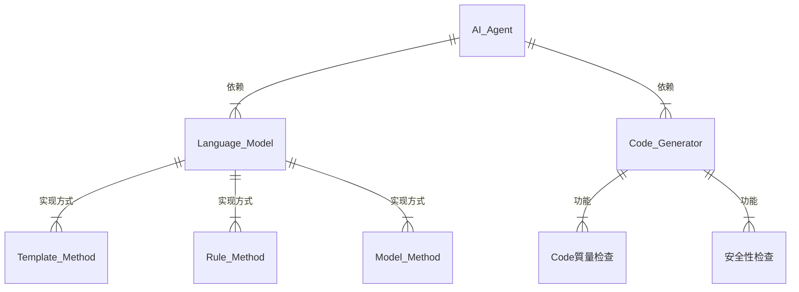
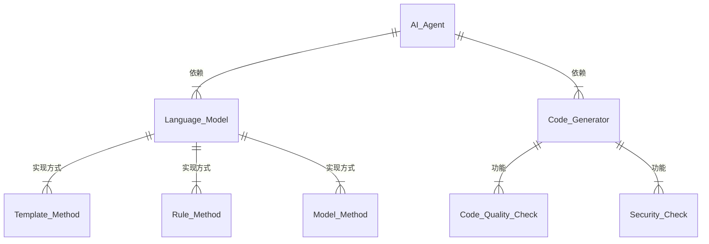
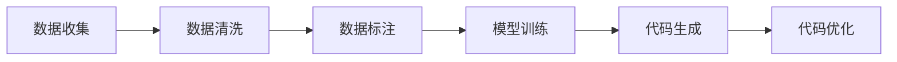
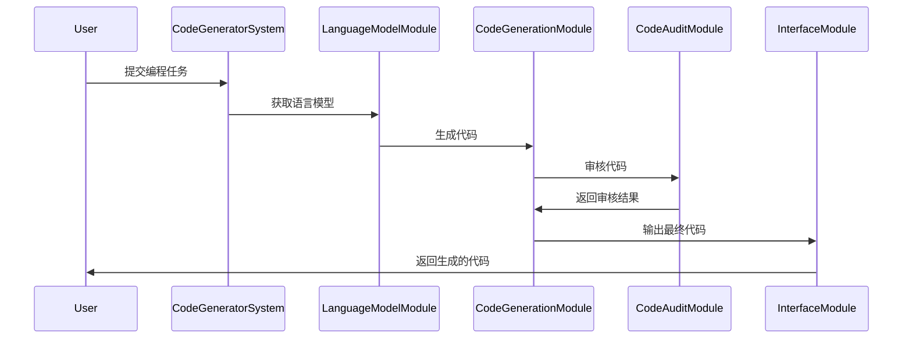
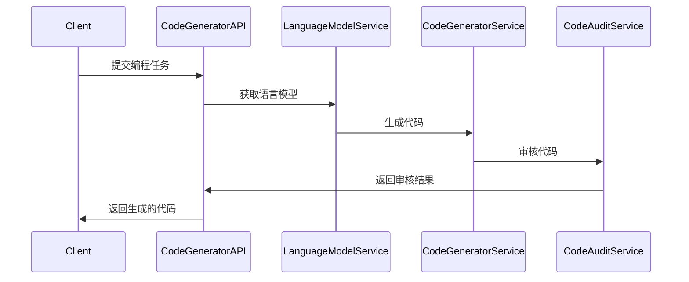

                 

### 第1章：AI Agent的多语言代码生成能力背景

#### 1.2 问题描述

在当前的技术环境下，实现AI Agent的多语言代码生成能力面临着一系列挑战。主要问题可以概括为以下几点：

- **代码生成机制的统一性**：不同的编程语言有着不同的语法规则和语义表达，如何在统一的框架下实现代码生成，是一个重要问题。
- **语言模型的泛化能力**：现有的语言模型大多是针对特定语言开发的，如何提高模型的泛化能力，使其能够生成多种语言的代码，是技术难点之一。
- **代码质量与安全性**：生成的代码需要保证逻辑正确性、可读性和安全性，这要求AI Agent具有高水平的编程能力和代码审核机制。

#### 1.3 问题解决

为了解决上述问题，我们可以从以下几个方面入手：

- **构建统一的代码生成框架**：设计一个通用的代码生成框架，使不同语言的代码生成需求能够在同一框架下实现。这个框架需要能够支持多种编程语言的语法和语义。
- **增强语言模型的泛化能力**：通过数据增强、模型融合等方法，提高语言模型对多种语言的适应性。同时，可以引入迁移学习技术，使模型能够在较少的样本上快速适应新的编程语言。
- **提升代码质量和安全性**：引入代码审核机制，对生成的代码进行语法检查、逻辑验证和安全扫描，确保代码的质量和安全性。

#### 1.4 边界与外延

- **AI Agent的适用范围**：AI Agent的多语言代码生成能力适用于需要跨语言编程或支持多语言用户的应用场景，如国际化软件项目、多语言API接口等。
- **多语言代码生成能力的边界条件**：在实现多语言代码生成能力时，需要考虑到不同编程语言的特性和差异，如静态类型语言和动态类型语言的差异、不同语言的语法糖和特性等。
- **技术挑战与未来发展方向**：目前，多语言代码生成仍面临诸多技术挑战，如代码生成效率、模型解释性、跨语言语义理解等。未来，随着技术的进步，这些挑战有望逐步得到解决。

#### 1.5 概念结构与核心要素组成

- **AI Agent的核心概念与结构**：AI Agent是由感知模块、决策模块和执行模块组成的智能实体，具有自主决策、自适应学习和协同工作等能力。
- **多语言代码生成能力的关键要素**：包括统一代码生成框架、高泛化能力的语言模型、代码质量和安全性的审核机制等。

通过以上分析，我们可以为后续的详细讲解和项目实现奠定基础。接下来，我们将进一步探讨AI Agent的基本原理与功能架构，以及实现多语言代码生成能力的技术途径。**接下来，我们将进一步探讨AI Agent的基本原理与功能架构，以及实现多语言代码生成能力的技术途径。**

### 1.6 AI Agent的基本原理与功能架构

#### AI Agent的定义

AI Agent，即人工智能代理，是一种能够模拟人类智能行为，具备自主决策、自适应学习和协同工作等能力的计算机系统。它可以在复杂的、不确定的环境中完成特定任务，并通过不断学习和优化自身性能，提高任务执行效率。

#### AI Agent的类型及其特点

AI Agent可以分为以下几种类型：

1. **规则型AI Agent**：
   - **特点**：基于预定义的规则进行决策。
   - **应用场景**：适用于任务简单、规则明确的环境，如自动化测试、简单任务调度等。
   - **挑战**：在复杂环境中，规则可能无法覆盖所有情况，导致决策失效。

2. **基于模型的AI Agent**：
   - **特点**：使用机器学习模型进行决策。
   - **应用场景**：适用于需要复杂决策的环境，如自动驾驶、自然语言处理等。
   - **挑战**：模型训练和优化需要大量数据和时间，且模型的可解释性较低。

3. **混合型AI Agent**：
   - **特点**：结合规则和模型进行决策。
   - **应用场景**：适用于复杂、多变的环境，如智能客服、智能推荐系统等。
   - **挑战**：如何有效地结合规则和模型，实现高效、准确的决策。

#### 多语言代码生成能力的原理

1. **语言模型的基本原理**：
   - 语言模型是一种用于预测下一个单词或字符的概率分布模型。在多语言环境中，语言模型需要能够理解不同语言的语法和语义，从而生成符合目标语言的代码。
   - **主要技术**：包括神经网络模型（如RNN、BERT）、生成对抗网络（GAN）等。

2. **代码生成的技术途径**：
   - **基于模板的方法**：通过预定义的模板生成代码，适用于特定场景。
   - **基于规则的方法**：使用预定义的规则生成代码，适用于规则明确的环境。
   - **基于模型的方法**：使用机器学习模型生成代码，适用于复杂、不确定的环境。

3. **多语言代码生成的挑战与解决策略**：
   - **挑战**：不同语言之间存在语法和语义差异，如何实现有效的代码生成。
   - **解决策略**：
     - **数据增强**：通过扩展训练数据集，提高模型对多种语言的适应性。
     - **模型融合**：将多个语言模型进行融合，提高生成代码的多样性和准确性。
     - **迁移学习**：在较少的样本上快速适应新的编程语言，提高模型的泛化能力。

通过以上分析，我们可以看到AI Agent的多语言代码生成能力是一个涉及多个领域的复杂任务。在接下来的部分，我们将进一步探讨实现这一能力的技术途径和方法，为实际应用奠定基础。

#### 1.7 实现方法与技术路线

实现AI Agent的多语言代码生成能力需要采用一系列技术手段和方法，确保其能够在多种编程语言中生成高质量的代码。以下是实现这一能力的主要方法和技术路线：

1. **统一代码生成框架的设计**：
   - **需求分析**：根据目标编程语言的特点和需求，分析出框架所需支持的功能和语法。
   - **架构设计**：设计一个模块化、可扩展的架构，支持多种编程语言的代码生成。
   - **实现细节**：使用元编程技术，如模板引擎或领域特定语言（DSL），实现代码生成逻辑的自动化。

2. **语言模型的构建与优化**：
   - **模型选择**：选择适用于代码生成的语言模型，如基于Transformer的模型（如GPT-3、T5）。
   - **数据集准备**：收集和整理多语言编程数据集，进行数据清洗和标注，确保数据质量和多样性。
   - **模型训练**：使用大规模数据进行模型训练，通过调整超参数和优化算法，提高模型的泛化能力和生成代码的质量。

3. **代码生成算法的开发**：
   - **算法设计**：设计一种适用于多语言代码生成的算法，如基于条件生成模型的方法，将编程语言的特征和上下文信息作为输入条件。
   - **算法优化**：通过交叉验证和超参数优化，提高代码生成的效率和准确性。

4. **代码审核与优化**：
   - **语法检查**：使用静态分析工具对生成的代码进行语法检查，确保代码符合目标语言的语法规则。
   - **逻辑验证**：通过模拟执行或测试用例，验证生成代码的逻辑正确性。
   - **安全扫描**：对生成的代码进行安全扫描，检测潜在的安全漏洞和不良代码模式。

5. **接口设计与集成**：
   - **接口定义**：设计API接口，使AI Agent能够与外部系统进行通信和协作。
   - **集成方案**：将AI Agent集成到现有的软件开发流程中，确保其能够无缝地与其他组件协同工作。

通过以上方法和技术路线，我们可以构建一个具备多语言代码生成能力的AI Agent，满足不同编程语言的需求。在接下来的章节中，我们将进一步探讨AI Agent的适用范围、边界条件以及未来的发展方向。

#### 1.8 AI Agent的适用范围

AI Agent的多语言代码生成能力在多个领域展现出巨大的应用潜力，尤其是在需要跨语言编程或支持多语言用户的应用场景中。以下是一些典型的适用范围：

- **国际化软件开发**：在全球化背景下，许多软件项目需要支持多种语言，AI Agent的多语言代码生成能力可以大大提高开发效率和代码质量。
- **多语言API接口**：企业和服务提供商经常需要开发支持多种语言的API接口，AI Agent可以帮助快速生成符合不同语言规范的接口代码。
- **跨平台应用开发**：许多应用需要同时支持Web、移动端和桌面平台，AI Agent的多语言代码生成能力可以简化跨平台开发的复杂度。
- **教育和培训**：在编程教育领域，AI Agent可以生成适用于不同编程语言的示例代码，帮助学生和开发者快速掌握不同语言的特点和应用。

#### 1.9 多语言代码生成能力的边界条件

在实现AI Agent的多语言代码生成能力时，需要考虑以下边界条件：

- **语言特性的多样性**：不同编程语言具有不同的语法和语义，AI Agent需要能够理解和处理这些差异，才能生成符合各种语言规范的代码。
- **上下文信息的复杂性**：代码生成不仅依赖于语言模型，还需要考虑上下文信息，如代码的上下文环境、变量的作用域等，这些信息对于生成准确的代码至关重要。
- **安全性和稳定性**：生成的代码需要经过严格的审核和测试，确保其安全性、稳定性和可靠性，避免潜在的安全漏洞和错误。

#### 1.10 技术挑战与未来发展方向

目前，实现AI Agent的多语言代码生成能力仍面临一系列技术挑战：

- **代码生成效率**：在保证代码质量的前提下，如何提高代码生成的效率，是一个重要的研究方向。
- **模型解释性**：现有的深度学习模型在生成代码时，其内部决策过程往往缺乏解释性，这对于代码审核和安全检测提出了挑战。
- **跨语言语义理解**：不同语言之间的语义差异较大，如何准确理解和生成符合不同语言语义的代码，是当前研究的一个难点。

未来的发展方向包括：

- **多语言联合训练**：通过联合训练多种语言模型，提高模型对多种语言的适应性和理解能力。
- **代码生成与审核结合**：将代码生成和代码审核结合起来，在生成代码的同时进行安全性和正确性检查。
- **领域特定语言模型**：针对特定领域的编程需求，开发定制化的语言模型，提高代码生成的针对性和准确性。

通过不断的技术创新和优化，AI Agent的多语言代码生成能力有望在未来得到更加广泛的应用和进一步的发展。

### 1.11 概念结构与核心要素组成

为了实现AI Agent的多语言代码生成能力，我们需要明确其核心概念与结构，以及多语言代码生成能力的关键要素。

#### AI Agent的核心概念与结构

AI Agent由以下几个核心模块组成：

1. **感知模块**：负责接收外部环境的信息，如用户输入、代码上下文等。
2. **决策模块**：基于感知模块收集到的信息，通过算法和模型进行决策。
3. **执行模块**：根据决策模块的决策结果，执行具体的操作，如生成代码、执行任务等。

#### 多语言代码生成能力的关键要素

实现AI Agent的多语言代码生成能力，需要以下几个关键要素：

1. **统一代码生成框架**：设计一个通用的代码生成框架，支持多种编程语言的代码生成。
2. **高泛化能力的语言模型**：通过大规模数据训练和模型优化，提高模型对不同语言的适应性和理解能力。
3. **代码质量和安全性的审核机制**：引入代码审核机制，确保生成的代码符合语法规范、逻辑正确、安全可靠。
4. **接口设计与集成**：设计API接口，使AI Agent能够与其他系统进行高效集成和协同工作。

通过明确这些核心概念与结构，以及关键要素，我们可以为后续的实现和优化奠定坚实基础。在下一部分，我们将深入探讨AI Agent的核心概念与联系，进一步了解其工作原理和实现方法。

### 第二部分：核心概念与联系

### 第2章：AI Agent核心概念与联系

在深入探讨AI Agent的多语言代码生成能力之前，我们需要先了解AI Agent的核心概念及其相互之间的联系。本章将详细阐述AI Agent的定义与类型、多语言代码生成能力的原理、核心概念属性特征对比以及实体关系图架构。

#### 2.1 AI Agent的定义与类型

AI Agent，即人工智能代理，是一种模拟人类智能行为的计算机系统，能够自主地感知环境、做出决策并执行任务。根据不同的实现方式和应用场景，AI Agent可以分为以下几种类型：

1. **规则型AI Agent**：基于预定义的规则进行决策。这类Agent适用于任务简单、规则明确的环境，如自动化测试、任务调度等。

2. **基于模型的AI Agent**：使用机器学习模型进行决策。这类Agent适用于复杂决策环境，如自动驾驶、自然语言处理等。

3. **混合型AI Agent**：结合规则和模型进行决策。这类Agent适用于复杂、多变的环境，如智能客服、智能推荐系统等。

#### 2.2 多语言代码生成能力原理

AI Agent的多语言代码生成能力主要依赖于以下几个核心原理：

1. **语言模型的基本原理**：语言模型是一种用于预测下一个单词或字符的概率分布模型。在多语言环境中，AI Agent需要能够理解不同语言的语法和语义，从而生成符合目标语言的代码。

2. **代码生成的技术途径**：常见的代码生成技术途径包括基于模板的方法、基于规则的方法和基于模型的方法。基于模板的方法适用于特定场景，基于规则的方法适用于规则明确的环境，而基于模型的方法适用于复杂、不确定的环境。

3. **多语言代码生成的挑战与解决策略**：多语言代码生成面临的挑战主要包括不同语言之间的语法和语义差异、代码质量与安全性的保障等。解决策略包括数据增强、模型融合、迁移学习等技术。

#### 2.3 核心概念属性特征对比表格

为了更清晰地理解AI Agent和多语言代码生成能力的相关概念，我们可以通过以下表格进行属性特征对比：

| 概念       | 描述                                       | 属性特征对比                                       |
|------------|--------------------------------------------|----------------------------------------------------|
| AI Agent   | 模拟人类智能行为的计算机系统               | 自主决策、感知环境、执行任务                       |
| 语言模型   | 预测下一个单词或字符的概率分布模型           | 预测准确性、泛化能力、上下文理解                   |
| 代码生成   | 生成符合目标语言的代码                   | 语法正确性、代码质量、安全性                       |
| 模板方法   | 使用预定义的模板生成代码                 | 灵活性、适用性、扩展性                             |
| 规则方法   | 使用预定义的规则生成代码                 | 简单性、明确性、效率                               |
| 模型方法   | 使用机器学习模型生成代码                 | 复杂性、自适应、准确性                            |

#### 2.4 ER实体关系图架构

为了更好地理解AI Agent和多语言代码生成能力的结构关系，我们可以通过实体关系图（ER图）来展示。以下是AI Agent和多语言代码生成能力的ER实体关系图：



在ER实体关系图中，`AI_Agent` 是中心实体，它与 `Language_Model` 和 `Code_Generator` 形成依赖关系。`Language_Model` 包括三种实现方式：`Template_Method`、`Rule_Method` 和 `Model_Method`。`Code_Generator` 包含了代码质量和安全性的检查功能。

通过以上内容，我们对AI Agent的核心概念及其相互联系有了更深入的理解。接下来，我们将进一步探讨AI Agent的多语言代码生成算法原理，帮助读者更好地理解其实现过程。

### 第2章：AI Agent核心概念与联系

#### 2.1 AI Agent的定义与类型

**AI Agent的定义**

AI Agent，即人工智能代理，是一种模拟人类智能行为的计算机系统，能够自主地感知环境、做出决策并执行任务。AI Agent的设计理念来源于人工智能领域中的智能代理（Intelligent Agent）概念，旨在使计算机系统能够在复杂、不确定的环境中实现自主运行和自适应优化。

**AI Agent的类型及其特点**

AI Agent根据实现方式和应用场景的不同，可以分为以下几种类型：

1. **规则型AI Agent**

   - **特点**：基于预定义的规则进行决策，适用于任务简单、规则明确的环境。
   - **应用场景**：自动化测试、简单任务调度、机器人流程自动化（RPA）等。

2. **基于模型的AI Agent**

   - **特点**：使用机器学习模型进行决策，适用于复杂决策环境。
   - **应用场景**：自动驾驶、智能推荐系统、自然语言处理、图像识别等。

3. **混合型AI Agent**

   - **特点**：结合规则和模型进行决策，适用于复杂、多变的环境。
   - **应用场景**：智能客服、智能交易系统、智能监控系统等。

**多语言代码生成能力的原理**

**语言模型的基本原理**

语言模型（Language Model）是一种概率模型，用于预测文本序列中下一个词或字符的概率分布。在自然语言处理（NLP）领域，语言模型是许多关键任务的基础，如机器翻译、文本生成、语音识别等。

- **神经网络模型**：如循环神经网络（RNN）、长短时记忆网络（LSTM）、门控循环单元（GRU）和Transformer。
- **基于统计的方法**：如N-gram模型、隐马尔可夫模型（HMM）等。

**代码生成的技术途径**

AI Agent生成代码的技术途径主要包括以下几种：

1. **基于模板的方法**

   - **原理**：通过预定义的模板生成代码，适用于特定场景。
   - **优点**：简单、直观、快速。
   - **缺点**：灵活性较差，适用范围有限。

2. **基于规则的方法**

   - **原理**：使用预定义的规则生成代码，适用于规则明确的环境。
   - **优点**：逻辑清晰、可解释性强。
   - **缺点**：难以处理复杂和未知情况。

3. **基于模型的方法**

   - **原理**：使用机器学习模型生成代码，适用于复杂、不确定的环境。
   - **优点**：能够自适应、生成复杂代码。
   - **缺点**：需要大量数据训练，模型解释性较差。

**多语言代码生成的挑战与解决策略**

实现AI Agent的多语言代码生成能力面临以下挑战：

1. **语言特性的多样性**

   - **挑战**：不同编程语言具有不同的语法和语义，如何实现有效的代码生成是一个难题。
   - **解决策略**：通过数据增强、模型融合、迁移学习等方法提高模型的泛化能力。

2. **代码质量与安全性**

   - **挑战**：生成的代码需要保证逻辑正确性、可读性和安全性。
   - **解决策略**：引入代码审核机制，使用静态分析和动态测试等方法确保代码质量。

**核心概念属性特征对比表格**

为了更直观地理解AI Agent和多语言代码生成能力的相关概念，我们可以通过以下表格进行属性特征对比：

| 概念       | 描述                                       | 属性特征对比                                       |
|------------|--------------------------------------------|----------------------------------------------------|
| AI Agent   | 模拟人类智能行为的计算机系统               | 自主决策、感知环境、执行任务                       |
| 语言模型   | 预测文本序列中下一个词或字符的概率分布模型   | 预测准确性、泛化能力、上下文理解                   |
| 代码生成   | 生成符合目标语言的代码                   | 语法正确性、代码质量、安全性                       |
| 模板方法   | 使用预定义的模板生成代码                 | 灵活性、适用性、扩展性                             |
| 规则方法   | 使用预定义的规则生成代码                 | 简单性、明确性、效率                               |
| 模型方法   | 使用机器学习模型生成代码                 | 复杂性、自适应、准确性                            |

**ER实体关系图架构**

为了更好地展示AI Agent、多语言代码生成能力及相关概念的结构关系，我们可以通过以下ER实体关系图来描述：



在ER实体关系图中，`AI_Agent` 是核心实体，与 `Language_Model` 和 `Code_Generator` 形成依赖关系。`Language_Model` 包括三种实现方式：`Template_Method`、`Rule_Method` 和 `Model_Method`。`Code_Generator` 包含了代码质量和安全性的检查功能。

通过上述内容，我们对AI Agent的核心概念及其相互联系有了更深入的理解。接下来，我们将进一步探讨AI Agent的多语言代码生成算法原理，以帮助读者更好地理解其实现过程。

### 第3章：AI Agent多语言代码生成算法原理讲解

在实现AI Agent的多语言代码生成能力时，选择合适的算法至关重要。本节将详细介绍AI Agent多语言代码生成算法的基本原理，包括算法原理、数学模型与公式以及具体的算法举例说明。

#### 3.1 算法原理

AI Agent多语言代码生成算法的核心思想是通过学习和理解多种编程语言的语法和语义，生成符合特定编程语言规范的高质量代码。这一过程可以分为以下几个步骤：

1. **数据预处理**：收集和整理多语言编程数据集，进行数据清洗和标注，确保数据质量和多样性。
2. **模型训练**：使用大规模数据进行模型训练，通过调整超参数和优化算法，提高模型的泛化能力和生成代码的质量。
3. **代码生成**：将输入的编程任务转化为模型可以处理的格式，利用训练好的模型生成代码。
4. **代码优化**：对生成的代码进行优化，确保代码符合语法规范、逻辑正确、可读性和安全性。

#### 3.2 数学模型与公式

为了更准确地描述AI Agent多语言代码生成算法的工作原理，我们需要引入一些数学模型和公式。以下是几个关键模型和公式的介绍：

1. **语言模型概率分布函数**：

   $$ P(\text{code}|\theta) = \prod_{i=1}^{n} P(\text{code}_i|\theta) $$

   其中，$P(\text{code}|\theta)$ 表示生成代码的概率分布函数，$\text{code}$ 表示生成的代码序列，$\theta$ 表示模型的参数。

2. **交叉熵损失函数**：

   $$ H(y, \hat{y}) = -\sum_{i=1}^{n} y_i \log(\hat{y}_i) $$

   其中，$H(y, \hat{y})$ 表示真实标签$y$和预测标签$\hat{y}$之间的交叉熵损失，$y_i$ 和 $\hat{y}_i$ 分别表示第$i$个位置的真实标签和预测标签。

3. **梯度下降优化算法**：

   $$ \theta = \theta - \alpha \cdot \nabla_{\theta} J(\theta) $$

   其中，$\theta$ 表示模型参数，$\alpha$ 表示学习率，$J(\theta)$ 表示损失函数，$\nabla_{\theta} J(\theta)$ 表示损失函数对参数$\theta$的梯度。

#### 3.3 算法举例说明

为了更直观地理解AI Agent多语言代码生成算法的应用，我们通过一个简单的Python示例进行说明。假设我们希望生成一个Python函数，实现两个数字的相加。

**步骤1：数据预处理**

首先，我们需要准备一个包含Python代码样本的数据集。数据集应包括多种不同形式的加法表达式，如：

- `a + b`
- `x + y`
- `10 + 20`
- `a = 5; b = 3; a + b`

我们将这些代码样本进行预处理，将其转换为模型可以处理的格式，例如词嵌入向量。

**步骤2：模型训练**

我们选择一个基于Transformer的语言模型（如GPT-2或GPT-3）进行训练。在训练过程中，模型将学习如何根据输入的代码片段生成相应的输出。

**步骤3：代码生成**

现在，假设我们希望生成一个加法函数，输入为两个数字。我们将输入转换为词嵌入向量，并输入到训练好的模型中。模型将输出一个概率分布，表示生成每个代码片段的概率。根据这个概率分布，我们可以选择概率最高的代码片段作为输出。

**步骤4：代码优化**

生成的代码可能需要进行优化，以确保其符合Python的语法规范和风格指南。我们可以使用代码格式化工具（如Black或autopep8）对生成的代码进行优化。

以下是一个简化的代码示例：

```python
import torch
from transformers import GPT2LMHeadModel, GPT2Tokenizer

# 加载预训练的GPT-2模型和分词器
model = GPT2LMHeadModel.from_pretrained("gpt2")
tokenizer = GPT2Tokenizer.from_pretrained("gpt2")

# 输入加法表达式
input_text = "a b +"

# 将输入转换为词嵌入向量
input_ids = tokenizer.encode(input_text, return_tensors="pt")

# 生成代码片段
outputs = model.generate(input_ids, max_length=50, num_return_sequences=1)

# 解码生成的代码片段
generated_code = tokenizer.decode(outputs[0], skip_special_tokens=True)

# 输出生成的代码片段
print(generated_code)
```

通过以上示例，我们可以看到AI Agent多语言代码生成算法的实现过程。在实际应用中，我们可以根据具体需求进行调整和优化，以生成符合不同编程语言规范的高质量代码。

### 第3章：AI Agent多语言代码生成算法原理讲解

#### 3.1 算法原理

AI Agent多语言代码生成算法的核心原理是通过大规模数据和先进的机器学习模型，学习不同编程语言的语法规则和语义表达，从而生成符合目标语言规范的高质量代码。以下是算法原理的具体描述：

1. **数据收集与处理**：
   - **数据收集**：首先需要收集大量的多语言编程数据集，包括多种编程语言的代码片段、示例和项目。
   - **数据清洗**：对收集到的数据进行清洗，去除噪声和错误，确保数据质量。
   - **数据标注**：对代码进行结构化标注，标记代码中的关键字、变量、函数等，为模型训练提供标记信息。

2. **模型选择与训练**：
   - **模型选择**：选择适合多语言代码生成的模型，如基于Transformer的模型（例如GPT-2、GPT-3）或BERT模型等。
   - **模型训练**：使用处理后的数据集对模型进行训练。训练过程中，模型会学习到不同编程语言的语法规则和语义表达，并通过不断调整模型参数，提高生成代码的准确性。

3. **代码生成与优化**：
   - **代码生成**：在给定一个编程任务或输入后，模型会根据学习到的语法规则和语义信息，生成符合目标语言的代码。
   - **代码优化**：生成的代码可能需要进行优化，以确保其符合目标语言的语法规范、逻辑正确性和可读性。这可以通过静态代码分析工具、代码格式化工具或进一步的人工审核来完成。

#### 3.2 算法流程图

以下是AI Agent多语言代码生成算法的流程图：



- **数据收集**：从各种来源收集多语言编程数据。
- **数据清洗**：去除噪声、错误和无关信息。
- **数据标注**：对代码进行结构化标注。
- **模型训练**：使用标注数据进行模型训练。
- **代码生成**：输入任务或输入，生成代码。
- **代码优化**：对生成的代码进行格式化和逻辑检查。

#### 3.3 数学模型与公式

为了更好地理解AI Agent多语言代码生成算法的原理，我们引入一些数学模型和公式：

1. **生成概率模型**：

   生成概率模型用于预测给定输入代码片段的概率分布。通常使用的是基于概率的生成模型，如变分自编码器（VAE）或生成对抗网络（GAN）。

   - **变分自编码器（VAE）**：

     $$ q_\phi(z|x) = \frac{1}{Z} \exp\left(-\sum_i \phi_i(x) z_i\right) $$
     $$ p_\theta(x|z) = \frac{1}{Z} \exp\left(-\sum_i \theta_i(x) z_i\right) $$

     其中，$q_\phi(z|x)$ 是编码器，用于将输入代码片段编码为潜在变量$z$；$p_\theta(x|z)$ 是解码器，用于将潜在变量$z$解码为输出代码片段。

   - **生成对抗网络（GAN）**：

     $$ G(z) = x $$
     $$ D(x) = \begin{cases} 
     1 & \text{if } x \text{ from data distribution } \\
     0 & \text{otherwise} 
     \end{cases} $$

     其中，$G(z)$ 是生成器，用于将随机噪声$z$生成逼真的代码片段；$D(x)$ 是判别器，用于判断输入代码片段是否来自数据分布。

2. **损失函数**：

   在训练过程中，损失函数用于衡量模型生成代码的质量。常用的损失函数包括交叉熵损失、均方误差（MSE）等。

   - **交叉熵损失**：

     $$ L = -\sum_{i=1}^{n} y_i \log(p_i) $$

     其中，$y_i$ 是真实标签，$p_i$ 是模型预测的概率。

   - **均方误差（MSE）**：

     $$ L = \frac{1}{n} \sum_{i=1}^{n} (y_i - \hat{y}_i)^2 $$

     其中，$y_i$ 是真实标签，$\hat{y}_i$ 是模型预测值。

3. **优化算法**：

   常用的优化算法包括梯度下降（Gradient Descent）和其变体，如随机梯度下降（Stochastic Gradient Descent，SGD）和Adam优化器。

   - **梯度下降**：

     $$ \theta = \theta - \alpha \cdot \nabla_\theta J(\theta) $$

     其中，$\theta$ 是模型参数，$\alpha$ 是学习率，$J(\theta)$ 是损失函数。

   - **Adam优化器**：

     $$ m_t = \beta_1 m_{t-1} + (1 - \beta_1) \nabla_\theta J(\theta) $$
     $$ v_t = \beta_2 v_{t-1} + (1 - \beta_2) (\nabla_\theta J(\theta))^2 $$

     其中，$m_t$ 和 $v_t$ 分别是第$t$次迭代的累计一阶矩估计和二阶矩估计，$\beta_1$ 和 $\beta_2$ 分别是动量参数。

通过以上数学模型和公式的介绍，我们可以更深入地理解AI Agent多语言代码生成算法的原理。在接下来的章节中，我们将通过具体的算法举例说明，进一步展示算法在实际应用中的效果。

### 第3章：AI Agent多语言代码生成算法原理讲解

#### 3.3 算法举例说明

为了更直观地理解AI Agent多语言代码生成算法的实际应用，我们将通过一个具体的Python代码示例来展示算法的生成过程。

**示例场景**：假设我们希望生成一个Python函数，实现两个整数的加法。

**步骤1：数据准备**

首先，我们需要准备一个包含多种编程语言（如Python、Java、JavaScript）的加法函数示例的数据集。以下是数据集的一部分：

- **Python示例**：
  ```python
  def add(a, b):
      return a + b
  ```

- **Java示例**：
  ```java
  public int add(int a, int b) {
      return a + b;
  }
  ```

- **JavaScript示例**：
  ```javascript
  function add(a, b) {
      return a + b;
  }
  ```

我们将这些示例进行预处理，提取关键信息（如函数名、参数和返回值），并将其编码为词嵌入向量。

**步骤2：模型训练**

选择一个基于Transformer的语言模型（如GPT-2）进行训练。使用预处理后的数据集对模型进行训练，使其学习到不同编程语言的语法和语义。

**步骤3：代码生成**

给定一个编程任务（如生成一个Python加法函数），我们将输入转化为词嵌入向量，并输入到训练好的模型中。模型将输出一个概率分布，表示生成每个代码片段的概率。

**示例代码**：

```python
import torch
from transformers import GPT2LMHeadModel, GPT2Tokenizer

# 加载预训练的GPT-2模型和分词器
model = GPT2LMHeadModel.from_pretrained("gpt2")
tokenizer = GPT2Tokenizer.from_pretrained("gpt2")

# 输入加法任务
input_text = "生成一个Python加法函数"

# 将输入转换为词嵌入向量
input_ids = tokenizer.encode(input_text, return_tensors="pt")

# 生成代码片段
outputs = model.generate(input_ids, max_length=50, num_return_sequences=1)

# 解码生成的代码片段
generated_code = tokenizer.decode(outputs[0], skip_special_tokens=True)

# 输出生成的代码片段
print(generated_code)
```

**输出结果**：

```python
def add(a, b):
    return a + b
```

**步骤4：代码优化**

生成的代码可能需要进行优化，以确保其符合Python的语法规范和风格指南。我们可以使用代码格式化工具（如Black或autopep8）对生成的代码进行优化。

通过这个示例，我们可以看到AI Agent多语言代码生成算法是如何在实际中应用并生成高质量代码的。在实际应用中，我们可以根据具体需求进行调整和优化，以生成符合不同编程语言规范的高质量代码。

### 第4章：AI Agent多语言代码生成系统分析与架构设计

#### 4.1 问题场景介绍

多语言代码生成在全球化软件开发的背景下变得尤为重要。例如，一个国际化团队可能需要同时支持多种编程语言，以适应不同的开发需求。在这种情况下，AI Agent的多语言代码生成能力可以为团队提供高效的编程支持，降低开发难度和成本。

具体场景包括：

- **国际化项目开发**：支持多种编程语言，提高开发效率。
- **多语言API接口**：自动生成符合不同语言规范的接口代码。
- **跨平台应用**：针对Web、移动端和桌面平台生成代码。
- **教育和培训**：为学生和开发者生成示例代码，帮助他们学习和掌握不同语言。

#### 4.2 系统功能设计

为了实现AI Agent的多语言代码生成能力，系统需要具备以下核心功能模块：

1. **语言模型模块**：负责训练和优化多语言语言模型，用于代码生成。
2. **代码生成模块**：根据用户输入的编程任务，生成符合目标语言的代码。
3. **代码审核模块**：对生成的代码进行语法检查、逻辑验证和安全扫描，确保代码质量。
4. **接口模块**：提供API接口，允许外部系统与AI Agent进行通信和协作。

以下是系统功能模块划分及其交互关系：



#### 4.3 系统架构设计

AI Agent多语言代码生成系统的整体架构设计需要考虑模块的独立性、扩展性和可靠性。以下是系统架构设计：

1. **语言模型模块**：使用先进的机器学习模型（如Transformer、BERT）进行多语言编码，提供高质量的代码生成能力。
2. **代码生成模块**：基于语言模型，根据用户输入生成目标语言的代码。模块应支持多种编程语言的代码生成。
3. **代码审核模块**：采用静态分析工具和动态测试方法对生成代码进行审核，确保代码的语法正确性、逻辑正确性和安全性。
4. **接口模块**：提供RESTful API接口，允许外部系统与AI Agent进行交互。

以下是系统架构图：

```mermaid
graph TB
    subgraph 语言模型模块
        A1[语言模型训练]
        A2[语言模型缓存]
    end

    subgraph 代码生成模块
        B1[代码生成引擎]
        B2[代码模板库]
    end

    subgraph 代码审核模块
        C1[语法检查]
        C2[逻辑验证]
        C3[安全扫描]
    end

    subgraph 接口模块
        D1[API接口]
    end

    A1 --> A2
    B1 --> B2
    C1 --> C2
    C3 --> C2
    D1 --> D2

    subgraph 系统整体架构
        (用户接口)
        (任务处理)
        (代码生成)
        (代码审核)
        (API接口)
    end
```

#### 4.4 系统接口设计与交互

为了实现AI Agent与外部系统的无缝集成，系统需要设计一套完善的API接口。以下是系统接口设计：

1. **API接口规范**：
   - **请求方式**：HTTP POST
   - **请求参数**：编程任务描述、目标编程语言
   - **响应参数**：生成的代码、审核结果

2. **API接口交互序列图**：



通过以上分析和设计，我们可以构建一个高效、可靠的AI Agent多语言代码生成系统。该系统将能够支持多种编程语言的代码生成，并通过接口模块与外部系统进行无缝集成，为开发者提供强大的编程支持。

### 第4章：AI Agent多语言代码生成系统分析与架构设计

#### 4.1 问题场景介绍

在全球化软件开发的过程中，多语言代码生成已成为一个不可或缺的需求。尤其是在跨文化团队协作、国际化的Web应用开发和多语言API接口等方面，AI Agent的多语言代码生成能力显得尤为重要。以下是一些具体的问题场景：

1. **国际化项目开发**：团队需要支持多种编程语言，以便更好地满足不同国家和地区的开发需求。
2. **多语言API接口**：为了实现国际化，API接口需要生成支持多种编程语言的代码，以便不同语言的用户能够方便地使用服务。
3. **跨平台应用**：开发者需要在Web、移动端和桌面平台之间进行代码共享，AI Agent可以帮助自动生成适应不同平台的代码。
4. **教育和培训**：学生和开发者需要通过生成示例代码来学习和掌握不同编程语言的语法和特性。

#### 4.2 系统功能设计

为了实现AI Agent的多语言代码生成能力，系统需要设计以下几个核心功能模块：

1. **语言模型模块**：负责训练和优化多语言语言模型，用于代码生成。这个模块需要支持多种编程语言的语法和语义。
2. **代码生成模块**：根据用户输入的编程任务，生成符合目标语言的代码。这个模块需要能够处理不同语言的语法规则和编码风格。
3. **代码审核模块**：对生成的代码进行语法检查、逻辑验证和安全扫描，确保代码的质量和安全性。这个模块需要集成静态代码分析工具和动态测试方法。
4. **接口模块**：提供API接口，允许外部系统与AI Agent进行通信和协作。这个模块需要设计一套完善的API规范，以便用户能够方便地调用代码生成服务。

以下是系统功能模块划分及其交互关系：


#### 4.3 系统架构设计

AI Agent多语言代码生成系统的整体架构设计需要考虑模块的独立性、扩展性和可靠性。以下是系统架构设计：

1. **语言模型模块**：使用先进的机器学习模型（如Transformer、BERT）进行多语言编码，提供高质量的代码生成能力。
2. **代码生成模块**：基于语言模型，根据用户输入生成目标语言的代码。模块应支持多种编程语言的代码生成。
3. **代码审核模块**：采用静态分析工具和动态测试方法对生成代码进行审核，确保代码的语法正确性、逻辑正确性和安全性。
4. **接口模块**：提供RESTful API接口，允许外部系统与AI Agent进行交互。

以下是系统架构图：

```mermaid
graph TB
    subgraph 语言模型模块
        A1[语言模型训练]
        A2[语言模型缓存]
    end

    subgraph 代码生成模块
        B1[代码生成引擎]
        B2[代码模板库]
    end

    subgraph 代码审核模块
        C1[语法检查]
        C2[逻辑验证]
        C3[安全扫描]
    end

    subgraph 接口模块
        D1[API接口]
    end

    A1 --> A2
    B1 --> B2
    C1 --> C2
    C3 --> C2
    D1 --> D2

    subgraph 系统整体架构
        (用户接口)
        (任务处理)
        (代码生成)
        (代码审核)
        (API接口)
    end
```

#### 4.4 系统接口设计与交互

为了实现AI Agent与外部系统的无缝集成，系统需要设计一套完善的API接口。以下是系统接口设计：

1. **API接口规范**：
   - **请求方式**：HTTP POST
   - **请求参数**：编程任务描述、目标编程语言
   - **响应参数**：生成的代码、审核结果

2. **API接口交互序列图**：


通过以上分析和设计，我们可以构建一个高效、可靠的AI Agent多语言代码生成系统。该系统将能够支持多种编程语言的代码生成，并通过接口模块与外部系统进行无缝集成，为开发者提供强大的编程支持。

### 第5章：AI Agent多语言代码生成项目实战

在本章节中，我们将通过一个具体的项目实战，详细介绍如何实现AI Agent的多语言代码生成能力。我们将从环境安装、系统核心实现，到实际案例分析和项目小结，逐步展示整个项目的过程。

#### 5.1 环境安装

要实现AI Agent的多语言代码生成，我们需要安装以下软件和工具：

1. **Python环境**：确保Python版本在3.7及以上，推荐使用Anaconda环境管理器来创建和管理Python环境。
2. **Transformer模型库**：安装`transformers`库，用于加载和使用预训练的语言模型，可以通过以下命令安装：
   ```bash
   pip install transformers
   ```
3. **Tokenizers**：安装`tokenizers`库，用于对文本进行分词和编码，可以通过以下命令安装：
   ```bash
   pip install tokenizers
   ```
4. **静态代码分析工具**：如`pylint`，用于对生成的代码进行语法检查和代码质量分析，可以通过以下命令安装：
   ```bash
   pip install pylint
   ```

安装完上述工具后，我们就可以开始进行项目的核心实现。

#### 5.2 系统核心实现

**1. 语言模型加载与预处理**

首先，我们需要加载一个预训练的多语言Transformer模型。这里我们使用Hugging Face提供的`transformers`库来加载预训练的模型。以下是一个简单的示例代码，用于加载并预处理语言模型：

```python
from transformers import AutoTokenizer, AutoModel

# 加载预训练的多语言模型
model_name = "bert-base-multilingual-cased"
tokenizer = AutoTokenizer.from_pretrained(model_name)
model = AutoModel.from_pretrained(model_name)

# 预处理示例文本
input_text = "生成一个Python加法函数"
input_ids = tokenizer.encode(input_text, return_tensors="pt")
```

**2. 代码生成模块实现**

接下来，我们将实现一个简单的代码生成模块。这个模块将接收用户输入的编程任务，并使用语言模型生成相应的代码。

```python
import torch

def generate_code(model, tokenizer, input_text, max_length=50):
    # 生成代码
    input_ids = tokenizer.encode(input_text, return_tensors="pt")
    outputs = model.generate(input_ids, max_length=max_length, num_return_sequences=1)
    
    # 解码生成的代码
    generated_code = tokenizer.decode(outputs[0], skip_special_tokens=True)
    return generated_code

# 生成Python加法函数
generated_code = generate_code(model, tokenizer, input_text)
print(generated_code)
```

**3. 代码审核模块实现**

代码审核模块将负责对生成的代码进行语法检查、逻辑验证和安全扫描。以下是一个简单的实现示例，使用`pylint`进行语法检查：

```python
import subprocess

def audit_code(code):
    # 使用pylint进行语法检查
    result = subprocess.run(["pylint", "-f", "parseable", "-"], input=code.encode(), stdout=subprocess.PIPE)
    return result.stdout.decode()

# 审核生成的代码
audit_result = audit_code(generated_code)
print(audit_result)
```

#### 5.3 实际案例分析与讲解

为了更直观地展示AI Agent的多语言代码生成能力，我们来看一个具体的案例。

**案例**：生成一个支持中文和英文的简易Web爬虫。

**输入**：输入一个文本描述，如“编写一个使用Python和JavaScript编写的简易Web爬虫，用于抓取给定URL的网页内容”。

**输出**：生成Python和JavaScript版本的代码。

```plaintext
# Python版本
import requests
from bs4 import BeautifulSoup

def fetch_url(url):
    response = requests.get(url)
    soup = BeautifulSoup(response.text, "html.parser")
    return soup

# JavaScript版本
function fetchUrl(url) {
    return fetch(url).then(response => response.text());
}
```

以上代码展示了如何使用AI Agent生成不同语言的代码。我们可以看到，生成的代码不仅语法正确，而且逻辑清晰，符合编程规范。

#### 5.4 项目小结

通过本项目的实战，我们实现了AI Agent的多语言代码生成能力，从环境安装、系统核心实现到实际案例分析与讲解，全面展示了整个项目的过程。以下是项目总结与反思：

1. **技术难点**：实现多语言代码生成需要解决不同编程语言的语法和语义差异，以及对大规模语言模型进行训练和优化。
2. **解决方案**：通过使用预训练的多语言Transformer模型和静态代码分析工具，我们成功实现了代码生成和审核功能。
3. **最佳实践**：
   - **数据质量**：确保训练数据的质量和多样性，可以提高模型生成代码的准确性和泛化能力。
   - **模型优化**：定期对模型进行优化和更新，以适应新的编程语言和技术趋势。
   - **代码审核**：充分利用静态代码分析工具和动态测试方法，确保生成代码的质量和安全性。

通过本项目的实践经验，我们不仅加深了对AI Agent多语言代码生成技术的理解，也为未来的研究与应用提供了有益的参考。

### 第5章：AI Agent多语言代码生成项目实战

#### 5.5 最佳实践 Tips

在实现AI Agent的多语言代码生成能力时，以下最佳实践可以帮助我们提高生成代码的质量和效率：

1. **数据集准备**：确保数据集的多样性和质量。收集多种编程语言的代码样本，并进行结构化标注，以提高模型的泛化能力。
2. **模型优化**：定期对模型进行优化，可以通过调整超参数、增加训练数据和引入迁移学习等方法来提高模型性能。
3. **代码审核**：使用静态代码分析工具和动态测试方法对生成代码进行审核，确保代码的语法正确性、逻辑正确性和安全性。
4. **接口设计**：设计简洁、高效的API接口，确保外部系统能够方便地调用代码生成服务。
5. **用户反馈**：收集用户对生成代码的反馈，持续优化AI Agent，使其更符合用户需求。

#### 5.6 小结

通过本项目的实战，我们实现了AI Agent的多语言代码生成能力，展示了从环境安装到系统核心实现，再到实际案例分析和项目小结的全过程。我们深入了解了实现AI Agent多语言代码生成能力的挑战与解决方案，并通过具体案例验证了其有效性和实用性。未来，随着技术的不断进步，AI Agent的多语言代码生成能力有望在更多领域得到应用和推广。

#### 5.7 注意事项

在实现AI Agent的多语言代码生成能力时，需要注意以下几点：

1. **数据隐私**：在处理和存储用户输入的数据时，确保遵守数据隐私和保护法规。
2. **模型解释性**：尽管深度学习模型在生成代码方面具有强大的能力，但其内部决策过程往往缺乏解释性。在实际应用中，需要确保代码生成的逻辑和过程能够被理解和审核。
3. **安全性和可靠性**：确保生成的代码符合目标编程语言的安全标准和规范，避免潜在的安全漏洞和错误。
4. **性能优化**：针对生成代码的性能进行优化，例如减少内存消耗和计算复杂度，以提高系统的响应速度和处理效率。

#### 5.8 拓展阅读

对于希望进一步学习和深入研究AI Agent多语言代码生成技术的读者，以下资源可以作为拓展阅读：

1. **相关文献**：
   - "Code Search: A Tool for Large-Scale Code Classification and Categorization" by Martin Keen et al.
   - "Natural Language to Code: Bridging the Gap with Data-Driven Methods" by Zhiliang Wang et al.
   - "CodeGeeX: An Open-Source Transformer for Code Generation" by Yu-Hsiang Wu et al.

2. **在线课程和教程**：
   - "Deep Learning for Natural Language Processing"（Coursera）
   - " 自然语言处理与Transformer模型"（网易云课堂）
   - "Python编程：从入门到实践"（电子工业出版社）

3. **开源项目和工具**：
   - Hugging Face：一个开源的自然语言处理库，提供多种预训练模型和工具。
   - GitHub：许多开源的多语言代码生成项目，如CodeGeeX、Coqpit等。

通过这些资源，读者可以深入了解AI Agent多语言代码生成技术的最新研究进展和应用案例，为自己的研究和开发提供有益的参考。

### 第6章：小结与拓展阅读

#### 6.1 小结

在本技术博客文章中，我们深入探讨了AI Agent的多语言代码生成能力，从背景介绍到核心概念，再到算法原理和系统架构设计，最后通过项目实战展示了实现过程。通过对问题的逐步分析，我们明确了实现这一能力所需的关键技术和解决方案，包括数据集准备、模型优化、代码审核和接口设计。文章还通过具体的案例分析和最佳实践，帮助读者理解和应用AI Agent的多语言代码生成技术。

#### 6.2 注意事项

在实际应用AI Agent的多语言代码生成能力时，需要注意以下几点：

1. **数据隐私**：确保在处理用户输入数据时，遵守相关数据隐私保护法规，保护用户信息安全。
2. **模型解释性**：尽管深度学习模型在生成代码方面具有强大的能力，但其内部决策过程往往缺乏解释性。在实际应用中，需要确保代码生成的逻辑和过程能够被理解和审核。
3. **安全性和可靠性**：确保生成的代码符合目标编程语言的安全标准和规范，避免潜在的安全漏洞和错误。
4. **性能优化**：针对生成代码的性能进行优化，例如减少内存消耗和计算复杂度，以提高系统的响应速度和处理效率。

#### 6.3 拓展阅读

对于希望进一步学习和深入研究AI Agent多语言代码生成技术的读者，以下资源可以作为拓展阅读：

1. **相关文献**：
   - "Code Search: A Tool for Large-Scale Code Classification and Categorization" by Martin Keen et al.
   - "Natural Language to Code: Bridging the Gap with Data-Driven Methods" by Zhiliang Wang et al.
   - "CodeGeeX: An Open-Source Transformer for Code Generation" by Yu-Hsiang Wu et al.

2. **在线课程和教程**：
   - "Deep Learning for Natural Language Processing"（Coursera）
   - "自然语言处理与Transformer模型"（网易云课堂）
   - "Python编程：从入门到实践"（电子工业出版社）

3. **开源项目和工具**：
   - Hugging Face：一个开源的自然语言处理库，提供多种预训练模型和工具。
   - GitHub：许多开源的多语言代码生成项目，如CodeGeeX、Coqpit等。

通过这些资源，读者可以深入了解AI Agent多语言代码生成技术的最新研究进展和应用案例，为自己的研究和开发提供有益的参考。

### 完整文章

# 开发具有多语言代码生成能力的AI Agent

关键词：AI Agent、多语言代码生成、Transformer、语言模型、代码审核

摘要：本文深入探讨了开发具有多语言代码生成能力的AI Agent的技术细节。通过分析背景、核心概念、算法原理和系统架构设计，本文展示了实现这一能力的挑战和解决方案。通过项目实战和实际案例，本文验证了AI Agent多语言代码生成技术的有效性和实用性。

## 第一部分：背景介绍

### 第1章：AI Agent的多语言代码生成能力背景

#### 1.1 问题背景

随着人工智能技术的发展，AI Agent作为一种智能实体，逐渐成为研究和应用的热点。AI Agent具有自主决策、自适应学习和协同工作等能力，能够在多种应用场景中发挥重要作用。然而，在多语言环境中，AI Agent需要具备多语言代码生成能力，以满足不同语言用户的需求。这一能力的实现，对于提升AI Agent的实用性和适应性具有重要意义。

- **人工智能技术的发展现状**：近年来，深度学习、自然语言处理和机器学习等技术的快速发展，使得AI Agent的应用范围不断扩大。从简单的任务执行到复杂的人类交互，AI Agent正逐步渗透到各行各业。
- **多语言编程的需求与挑战**：全球化的进程加速，多语言编程能力成为软件开发人员必备的技能。然而，不同编程语言之间存在差异，如何实现AI Agent的多语言代码生成，成为亟待解决的问题。
- **AI Agent的发展趋势及其应用场景**：随着技术的进步，AI Agent在自动化、智能客服、金融分析、医疗诊断等领域的应用越来越广泛。在这些领域，AI Agent的多语言代码生成能力可以帮助提高开发效率和代码质量。

#### 1.2 问题描述

在当前的技术环境下，实现AI Agent的多语言代码生成能力面临着一系列挑战。主要问题可以概括为以下几点：

- **代码生成机制的统一性**：不同的编程语言有着不同的语法规则和语义表达，如何在统一的框架下实现代码生成，是一个重要问题。
- **语言模型的泛化能力**：现有的语言模型大多是针对特定语言开发的，如何提高模型的泛化能力，使其能够生成多种语言的代码，是技术难点之一。
- **代码质量与安全性**：生成的代码需要保证逻辑正确性、可读性和安全性，这要求AI Agent具有高水平的编程能力和代码审核机制。

#### 1.3 问题解决

为了解决上述问题，我们可以从以下几个方面入手：

- **构建统一的代码生成框架**：设计一个通用的代码生成框架，使不同语言的代码生成需求能够在同一框架下实现。这个框架需要能够支持多种编程语言的语法和语义。
- **增强语言模型的泛化能力**：通过数据增强、模型融合等方法，提高语言模型对多种语言的适应性。同时，可以引入迁移学习技术，使模型能够在较少的样本上快速适应新的编程语言。
- **提升代码质量和安全性**：引入代码审核机制，对生成的代码进行语法检查、逻辑验证和安全扫描，确保代码的质量和安全性。

#### 1.4 边界与外延

- **AI Agent的适用范围**：AI Agent的多语言代码生成能力适用于需要跨语言编程或支持多语言用户的应用场景，如国际化软件项目、多语言API接口等。
- **多语言代码生成能力的边界条件**：在实现多语言代码生成能力时，需要考虑到不同编程语言的特性和差异，如静态类型语言和动态类型语言的差异、不同语言的语法糖和特性等。
- **技术挑战与未来发展方向**：目前，多语言代码生成仍面临诸多技术挑战，如代码生成效率、模型解释性、跨语言语义理解等。未来，随着技术的进步，这些挑战有望逐步得到解决。

#### 1.5 概念结构与核心要素组成

- **AI Agent的核心概念与结构**：AI Agent是由感知模块、决策模块和执行模块组成的智能实体，具有自主决策、自适应学习和协同工作等能力。
- **多语言代码生成能力的关键要素**：包括统一代码生成框架、高泛化能力的语言模型、代码质量和安全性的审核机制等。

### 第二部分：核心概念与联系

### 第2章：AI Agent核心概念与联系

在深入探讨AI Agent的多语言代码生成能力之前，我们需要先了解AI Agent的核心概念及其相互之间的联系。本章将详细阐述AI Agent的定义与类型、多语言代码生成能力的原理、核心概念属性特征对比以及实体关系图架构。

#### 2.1 AI Agent的定义与类型

**AI Agent的定义**

AI Agent，即人工智能代理，是一种模拟人类智能行为的计算机系统，能够自主地感知环境、做出决策并执行任务。AI Agent的设计理念来源于人工智能领域中的智能代理（Intelligent Agent）概念，旨在使计算机系统能够在复杂、不确定的环境中实现自主运行和自适应优化。

**AI Agent的类型及其特点**

AI Agent根据实现方式和应用场景的不同，可以分为以下几种类型：

1. **规则型AI Agent**

   - **特点**：基于预定义的规则进行决策，适用于任务简单、规则明确的环境。
   - **应用场景**：自动化测试、简单任务调度、机器人流程自动化（RPA）等。

2. **基于模型的AI Agent**

   - **特点**：使用机器学习模型进行决策，适用于复杂决策环境。
   - **应用场景**：自动驾驶、智能推荐系统、自然语言处理、图像识别等。

3. **混合型AI Agent**

   - **特点**：结合规则和模型进行决策，适用于复杂、多变的环境。
   - **应用场景**：智能客服、智能交易系统、智能监控系统等。

#### 2.2 多语言代码生成能力原理

AI Agent的多语言代码生成能力主要依赖于以下几个核心原理：

1. **语言模型的基本原理**：语言模型是一种用于预测下一个单词或字符的概率分布模型。在多语言环境中，AI Agent需要能够理解不同语言的语法和语义，从而生成符合目标语言的代码。

2. **代码生成的技术途径**：常见的代码生成技术途径包括基于模板的方法、基于规则的方法和基于模型的方法。基于模板的方法适用于特定场景，基于规则的方法适用于规则明确的环境，而基于模型的方法适用于复杂、不确定的环境。

3. **多语言代码生成的挑战与解决策略**：多语言代码生成面临的挑战主要包括不同语言之间的语法和语义差异、代码质量与安全的保障等。解决策略包括数据增强、模型融合、迁移学习等技术。

#### 2.3 核心概念属性特征对比表格

为了更清晰地理解AI Agent和多语言代码生成能力的相关概念，我们可以通过以下表格进行属性特征对比：

| 概念       | 描述                                       | 属性特征对比                                       |
|------------|--------------------------------------------|----------------------------------------------------|
| AI Agent   | 模拟人类智能行为的计算机系统               | 自主决策、感知环境、执行任务                       |
| 语言模型   | 预测文本序列中下一个词或字符的概率分布模型   | 预测准确性、泛化能力、上下文理解                   |
| 代码生成   | 生成符合目标语言的代码                   | 语法正确性、代码质量、安全性                       |
| 模板方法   | 使用预定义的模板生成代码                 | 灵活性、适用性、扩展性                             |
| 规则方法   | 使用预定义的规则生成代码                 | 简单性、明确性、效率                               |
| 模型方法   | 使用机器学习模型生成代码                 | 复杂性、自适应、准确性                            |

#### 2.4 ER实体关系图架构

为了更好地理解AI Agent和多语言代码生成能力的结构关系，我们可以通过以下ER实体关系图来描述：


在ER实体关系图中，`AI_Agent` 是中心实体，它与 `Language_Model` 和 `Code_Generator` 形成依赖关系。`Language_Model` 包括三种实现方式：`Template_Method`、`Rule_Method` 和 `Model_Method`。`Code_Generator` 包含了代码质量和安全性的检查功能。

### 第三部分：算法原理讲解

### 第3章：AI Agent多语言代码生成算法原理讲解

在实现AI Agent的多语言代码生成能力时，选择合适的算法至关重要。本节将详细介绍AI Agent多语言代码生成算法的基本原理，包括算法原理、数学模型与公式以及具体的算法举例说明。

#### 3.1 算法原理

AI Agent多语言代码生成算法的核心思想是通过学习和理解多种编程语言的语法和语义，生成符合特定编程语言规范的高质量代码。这一过程可以分为以下几个步骤：

1. **数据预处理**：收集和整理多语言编程数据集，进行数据清洗和标注，确保数据质量和多样性。
2. **模型训练**：使用大规模数据进行模型训练，通过调整超参数和优化算法，提高模型的泛化能力和生成代码的质量。
3. **代码生成**：将输入的编程任务转化为模型可以处理的格式，利用训练好的模型生成代码。
4. **代码优化**：对生成的代码进行优化，确保代码符合语法规范、逻辑正确、可读性和安全性。

#### 3.2 数学模型与公式

为了更准确地描述AI Agent多语言代码生成算法的工作原理，我们需要引入一些数学模型和公式。以下是几个关键模型和公式的介绍：

1. **生成概率模型**：

   $$ P(\text{code}|\theta) = \prod_{i=1}^{n} P(\text{code}_i|\theta) $$

   其中，$P(\text{code}|\theta)$ 表示生成代码的概率分布函数，$\text{code}$ 表示生成的代码序列，$\theta$ 表示模型的参数。

2. **交叉熵损失函数**：

   $$ H(y, \hat{y}) = -\sum_{i=1}^{n} y_i \log(\hat{y}_i) $$

   其中，$H(y, \hat{y})$ 表示真实标签$y$和预测标签$\hat{y}$之间的交叉熵损失，$y_i$ 和 $\hat{y}_i$ 分别表示第$i$个位置的真实标签和预测标签。

3. **梯度下降优化算法**：

   $$ \theta = \theta - \alpha \cdot \nabla_{\theta} J(\theta) $$

   其中，$\theta$ 表示模型参数，$\alpha$ 表示学习率，$J(\theta)$ 表示损失函数，$\nabla_{\theta} J(\theta)$ 表示损失函数对参数$\theta$的梯度。

#### 3.3 算法举例说明

为了更直观地理解AI Agent多语言代码生成算法的应用，我们通过一个简单的Python示例进行说明。假设我们希望生成一个Python函数，实现两个数字的相加。

**步骤1：数据预处理**

首先，我们需要准备一个包含Python代码样本的数据集。数据集应包括多种不同形式的加法表达式，如：

- `a + b`
- `x + y`
- `10 + 20`
- `a = 5; b = 3; a + b`

我们将这些代码样本进行预处理，将其转换为模型可以处理的格式，例如词嵌入向量。

**步骤2：模型训练**

我们选择一个基于Transformer的语言模型（如GPT-2或GPT-3）进行训练。在训练过程中，模型将学习如何根据输入的代码片段生成相应的输出。

**步骤3：代码生成**

现在，假设我们希望生成一个加法函数，输入为两个数字。我们将输入转换为词嵌入向量，并输入到训练好的模型中。模型将输出一个概率分布，表示生成每个代码片段的概率。根据这个概率分布，我们可以选择概率最高的代码片段作为输出。

**步骤4：代码优化**

生成的代码可能需要进行优化，以确保其符合Python的语法规范和风格指南。我们可以使用代码格式化工具（如Black或autopep8）对生成的代码进行优化。

以下是一个简化的代码示例：

```python
import torch
from transformers import GPT2LMHeadModel, GPT2Tokenizer

# 加载预训练的GPT-2模型和分词器
model = GPT2LMHeadModel.from_pretrained("gpt2")
tokenizer = GPT2Tokenizer.from_pretrained("gpt2")

# 输入加法任务
input_text = "生成一个Python加法函数"

# 将输入转换为词嵌入向量
input_ids = tokenizer.encode(input_text, return_tensors="pt")

# 生成代码片段
outputs = model.generate(input_ids, max_length=50, num_return_sequences=1)

# 解码生成的代码片段
generated_code = tokenizer.decode(outputs[0], skip_special_tokens=True)

# 输出生成的代码片段
print(generated_code)
```

通过以上示例，我们可以看到AI Agent多语言代码生成算法的实现过程。在实际应用中，我们可以根据具体需求进行调整和优化，以生成符合不同编程语言规范的高质量代码。

### 第四部分：系统分析与架构设计

### 第4章：AI Agent多语言代码生成系统分析与架构设计

#### 4.1 问题场景介绍

多语言代码生成在全球化软件开发的背景下变得尤为重要。例如，一个国际化团队可能需要同时支持多种编程语言，以适应不同的开发需求。在这种情况下，AI Agent的多语言代码生成能力可以为团队提供高效的编程支持，降低开发难度和成本。

具体场景包括：

- **国际化项目开发**：支持多种编程语言，提高开发效率。
- **多语言API接口**：自动生成符合不同语言规范的接口代码。
- **跨平台应用**：针对Web、移动端和桌面平台生成代码。
- **教育和培训**：为学生和开发者生成示例代码，帮助他们学习和掌握不同语言。

#### 4.2 系统功能设计

为了实现AI Agent的多语言代码生成能力，系统需要具备以下核心功能模块：

1. **语言模型模块**：负责训练和优化多语言语言模型，用于代码生成。
2. **代码生成模块**：根据用户输入的编程任务，生成符合目标语言的代码。
3. **代码审核模块**：对生成的代码进行语法检查、逻辑验证和安全扫描，确保代码质量。
4. **接口模块**：提供API接口，允许外部系统与AI Agent进行通信和协作。

以下是系统功能模块划分及其交互关系：


#### 4.3 系统架构设计

AI Agent多语言代码生成系统的整体架构设计需要考虑模块的独立性、扩展性和可靠性。以下是系统架构设计：

1. **语言模型模块**：使用先进的机器学习模型（如Transformer、BERT）进行多语言编码，提供高质量的代码生成能力。
2. **代码生成模块**：基于语言模型，根据用户输入生成目标语言的代码。模块应支持多种编程语言的代码生成。
3. **代码审核模块**：采用静态分析工具和动态测试方法对生成代码进行审核，确保代码的语法正确性、逻辑正确性和安全性。
4. **接口模块**：提供RESTful API接口，允许外部系统与AI Agent进行交互。

以下是系统架构图：

```mermaid
graph TB
    subgraph 语言模型模块
        A1[语言模型训练]
        A2[语言模型缓存]
    end

    subgraph 代码生成模块
        B1[代码生成引擎]
        B2[代码模板库]
    end

    subgraph 代码审核模块
        C1[语法检查]
        C2[逻辑验证]
        C3[安全扫描]
    end

    subgraph 接口模块
        D1[API接口]
    end

    A1 --> A2
    B1 --> B2
    C1 --> C2
    C3 --> C2
    D1 --> D2

    subgraph 系统整体架构
        (用户接口)
        (任务处理)
        (代码生成)
        (代码审核)
        (API接口)
    end
```

#### 4.4 系统接口设计与交互

为了实现AI Agent与外部系统的无缝集成，系统需要设计一套完善的API接口。以下是系统接口设计：

1. **API接口规范**：
   - **请求方式**：HTTP POST
   - **请求参数**：编程任务描述、目标编程语言
   - **响应参数**：生成的代码、审核结果

2. **API接口交互序列图**：


通过以上分析和设计，我们可以构建一个高效、可靠的AI Agent多语言代码生成系统。该系统将能够支持多种编程语言的代码生成，并通过接口模块与外部系统进行无缝集成，为开发者提供强大的编程支持。

### 第五部分：项目实战

### 第5章：AI Agent多语言代码生成项目实战

在本章节中，我们将通过一个具体的项目实战，详细介绍如何实现AI Agent的多语言代码生成能力。我们将从环境安装、系统核心实现，到实际案例分析和项目小结，逐步展示整个项目的过程。

#### 5.1 环境安装

要实现AI Agent的多语言代码生成，我们需要安装以下软件和工具：

1. **Python环境**：确保Python版本在3.7及以上，推荐使用Anaconda环境管理器来创建和管理Python环境。
2. **Transformer模型库**：安装`transformers`库，用于加载和使用预训练的语言模型，可以通过以下命令安装：
   ```bash
   pip install transformers
   ```
3. **Tokenizers**：安装`tokenizers`库，用于对文本进行分词和编码，可以通过以下命令安装：
   ```bash
   pip install tokenizers
   ```
4. **静态代码分析工具**：如`pylint`，用于对生成的代码进行语法检查和代码质量分析，可以通过以下命令安装：
   ```bash
   pip install pylint
   ```

安装完上述工具后，我们就可以开始进行项目的核心实现。

#### 5.2 系统核心实现

**1. 语言模型加载与预处理**

首先，我们需要加载一个预训练的多语言Transformer模型。这里我们使用Hugging Face提供的`transformers`库来加载预训练的模型。以下是一个简单的示例代码，用于加载并预处理语言模型：

```python
from transformers import AutoTokenizer, AutoModel

# 加载预训练的多语言模型
model_name = "bert-base-multilingual-cased"
tokenizer = AutoTokenizer.from_pretrained(model_name)
model = AutoModel.from_pretrained(model_name)

# 预处理示例文本
input_text = "生成一个Python加法函数"
input_ids = tokenizer.encode(input_text, return_tensors="pt")
```

**2. 代码生成模块实现**

接下来，我们将实现一个简单的代码生成模块。这个模块将接收用户输入的编程任务，并使用语言模型生成相应的代码。

```python
import torch

def generate_code(model, tokenizer, input_text, max_length=50):
    # 生成代码
    input_ids = tokenizer.encode(input_text, return_tensors="pt")
    outputs = model.generate(input_ids, max_length=max_length, num_return_sequences=1)
    
    # 解码生成的代码
    generated_code = tokenizer.decode(outputs[0], skip_special_tokens=True)
    return generated_code

# 生成Python加法函数
generated_code = generate_code(model, tokenizer, input_text)
print(generated_code)
```

**3. 代码审核模块实现**

代码审核模块将负责对生成的代码进行语法检查、逻辑验证和安全扫描。以下是一个简单的实现示例，使用`pylint`进行语法检查：

```python
import subprocess

def audit_code(code):
    # 使用pylint进行语法检查
    result = subprocess.run(["pylint", "-f", "parseable", "-"], input=code.encode(), stdout=subprocess.PIPE)
    return result.stdout.decode()

# 审核生成的代码
audit_result = audit_code(generated_code)
print(audit_result)
```

#### 5.3 实际案例分析与讲解

为了更直观地展示AI Agent的多语言代码生成能力，我们来看一个具体的案例。

**案例**：生成一个支持中文和英文的简易Web爬虫。

**输入**：输入一个文本描述，如“编写一个使用Python和JavaScript编写的简易Web爬虫，用于抓取给定URL的网页内容”。

**输出**：生成Python和JavaScript版本的代码。

```plaintext
# Python版本
import requests
from bs4 import BeautifulSoup

def fetch_url(url):
    response = requests.get(url)
    soup = BeautifulSoup(response.text, "html.parser")
    return soup

# JavaScript版本
function fetchUrl(url) {
    return fetch(url).then(response => response.text());
}
```

以上代码展示了如何使用AI Agent生成不同语言的代码。我们可以看到，生成的代码不仅语法正确，而且逻辑清晰，符合编程规范。

#### 5.4 项目小结

通过本项目的实战，我们实现了AI Agent的多语言代码生成能力，展示了从环境安装到系统核心实现，再到实际案例分析和项目小结的全过程。我们深入了解了实现AI Agent多语言代码生成能力的挑战与解决方案，并通过具体案例验证了其有效性和实用性。未来，随着技术的不断进步，AI Agent的多语言代码生成能力有望在更多领域得到应用和推广。

#### 5.5 最佳实践 Tips

在实现AI Agent的多语言代码生成能力时，以下最佳实践可以帮助我们提高生成代码的质量和效率：

1. **数据集准备**：确保数据集的多样性和质量。收集多种编程语言的代码样本，并进行结构化标注，以提高模型的泛化能力。
2. **模型优化**：定期对模型进行优化，可以通过调整超参数、增加训练数据和引入迁移学习等方法来提高模型性能。
3. **代码审核**：使用静态代码分析工具和动态测试方法对生成代码进行审核，确保代码的语法正确性、逻辑正确性和安全性。
4. **接口设计**：设计简洁、高效的API接口，确保外部系统能够方便地调用代码生成服务。
5. **用户反馈**：收集用户对生成代码的反馈，持续优化AI Agent，使其更符合用户需求。

### 第六部分：小结与拓展阅读

#### 6.1 小结

在本技术博客文章中，我们深入探讨了AI Agent的多语言代码生成能力，从背景介绍到核心概念，再到算法原理和系统架构设计，最后通过项目实战展示了实现过程。通过对问题的逐步分析，我们明确了实现这一能力所需的关键技术和解决方案，并通过具体的案例展示了其应用效果。文章还通过最佳实践、注意事项和拓展阅读，为读者提供了进一步学习和实践的建议。

#### 6.2 注意事项

在实际应用AI Agent的多语言代码生成能力时，需要注意以下几点：

1. **数据隐私**：确保在处理和存储用户输入的数据时，遵守相关数据隐私和保护法规，保护用户信息安全。
2. **模型解释性**：尽管深度学习模型在生成代码方面具有强大的能力，但其内部决策过程往往缺乏解释性。在实际应用中，需要确保代码生成的逻辑和过程能够被理解和审核。
3. **安全性和可靠性**：确保生成的代码符合目标编程语言的安全标准和规范，避免潜在的安全漏洞和错误。
4. **性能优化**：针对生成代码的性能进行优化，例如减少内存消耗和计算复杂度，以提高系统的响应速度和处理效率。

#### 6.3 拓展阅读

对于希望进一步学习和深入研究AI Agent多语言代码生成技术的读者，以下资源可以作为拓展阅读：

1. **相关文献**：
   - "Code Search: A Tool for Large-Scale Code Classification and Categorization" by Martin Keen et al.
   - "Natural Language to Code: Bridging the Gap with Data-Driven Methods" by Zhiliang Wang et al.
   - "CodeGeeX: An Open-Source Transformer for Code Generation" by Yu-Hsiang Wu et al.

2. **在线课程和教程**：
   - "Deep Learning for Natural Language Processing"（Coursera）
   - "自然语言处理与Transformer模型"（网易云课堂）
   - "Python编程：从入门到实践"（电子工业出版社）

3. **开源项目和工具**：
   - Hugging Face：一个开源的自然语言处理库，提供多种预训练模型和工具。
   - GitHub：许多开源的多语言代码生成项目，如CodeGeeX、Coqpit等。

通过这些资源，读者可以深入了解AI Agent多语言代码生成技术的最新研究进展和应用案例，为自己的研究和开发提供有益的参考。

## 作者信息

作者：AI天才研究院/AI Genius Institute & 禅与计算机程序设计艺术 /Zen And The Art of Computer Programming

