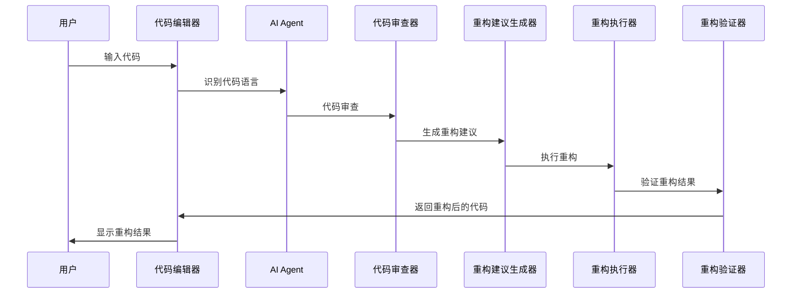
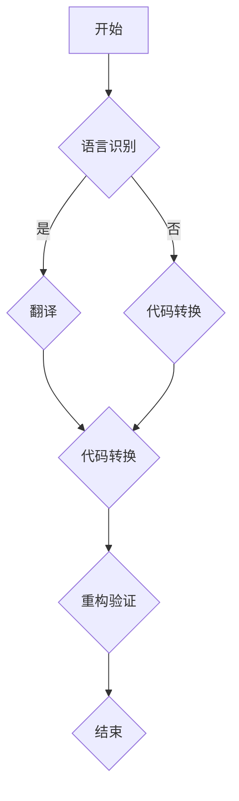

                 

# 开发具有多语言代码重构能力的AI Agent

## 关键词
- 人工智能
- 代码重构
- 多语言
- AI Agent
- 编程
- 自然语言处理

## 摘要
本文将探讨如何开发具有多语言代码重构能力的AI Agent。我们将从AI Agent的基本概念、多语言代码重构技术、架构设计、实现方法以及实际应用等方面进行详细分析。通过本文的阅读，您将了解到如何利用人工智能技术提升代码重构的效率和质量，为软件开发带来革命性的变化。

## 目录
1. 引言
2. AI Agent与代码重构
3. 基础概念
4. 多语言代码重构技术
5. AI Agent架构设计
6. 实现方法
7. 评价与案例研究
8. 总结与展望

## 引言

### 1. AI Agent的定义及其重要性

AI Agent，即人工智能代理，是一种能够在特定环境中自主决策并执行任务的智能实体。它基于机器学习和自然语言处理技术，可以通过不断学习和优化，提高任务执行的效率和质量。AI Agent在多个领域都有广泛应用，如自动驾驶、智能家居、智能客服等。

在软件开发领域，AI Agent的出现极大地改变了传统代码开发的模式。传统的代码开发主要依赖于开发人员的经验和技能，而AI Agent则可以自动识别代码中的问题和缺陷，并提出改进建议。这种自动化的代码重构不仅提高了开发效率，还降低了人为错误的风险。

### 2. 代码重构的定义及其重要性

代码重构是指对现有代码进行修改，以改进其结构、性能、可读性和可维护性。代码重构并不是简单的代码修改，而是一种对代码进行深度优化的过程。通过代码重构，我们可以消除代码中的冗余、重复和复杂性，提高代码的模块化程度和可扩展性。

在软件开发过程中，代码重构是必不可少的环节。良好的代码结构可以提高开发人员的开发效率和代码质量，减少维护成本。然而，传统的代码重构往往需要大量的人力和时间，且容易引入新的错误。因此，如何自动化代码重构成为了一个重要的研究课题。

### 3. 多语言代码重构的挑战

随着软件开发的国际化趋势，越来越多的项目需要支持多种编程语言。这使得多语言代码重构成为了一个新的挑战。与单语言代码重构相比，多语言代码重构需要解决以下问题：

- **语言差异**：不同编程语言在语法、语义和特性上存在显著差异，这使得多语言代码重构更加复杂。
- **翻译准确性**：多语言代码重构需要将一种语言的代码转换为另一种语言的代码，这涉及到翻译的准确性和一致性。
- **上下文理解**：代码重构不仅需要对代码进行表面上的修改，还需要理解代码的上下文和意图，以保证重构后的代码仍然符合原始代码的功能和逻辑。

### 4. AI Agent在多语言代码重构中的应用

AI Agent通过结合机器学习和自然语言处理技术，可以有效地解决多语言代码重构的挑战。AI Agent可以：

- **自动识别代码问题**：通过分析代码，AI Agent可以自动识别代码中的问题，如冗余代码、重复代码、低效代码等。
- **生成重构建议**：AI Agent可以根据问题的严重程度和修复的复杂性，为开发人员提供重构建议。
- **执行代码重构**：AI Agent可以自动执行代码重构，根据提供的重构建议对代码进行修改。

通过AI Agent的辅助，开发人员可以更高效地完成代码重构任务，降低代码维护成本，提高软件质量。

## 基础概念

### 1. AI Agent的概念和特点

AI Agent是一种基于人工智能技术的智能实体，它具有以下特点：

- **自主性**：AI Agent可以独立执行任务，无需人类干预。
- **适应性**：AI Agent可以根据环境的变化和学习经验，自主调整行为策略。
- **协作性**：AI Agent可以与其他AI Agent或人类协作，共同完成任务。
- **智能性**：AI Agent具备智能感知、决策和执行能力，可以通过机器学习和自然语言处理技术不断优化自身性能。

AI Agent的应用领域非常广泛，包括但不限于：

- **智能家居**：通过AI Agent实现家电设备的智能化控制。
- **智能客服**：利用AI Agent提供24/7在线客服服务。
- **自动驾驶**：通过AI Agent实现车辆的自主驾驶功能。

### 2. 代码重构的概念和类型

代码重构是指对现有代码进行修改，以改进其结构、性能、可读性和可维护性。根据重构的目的和方式，代码重构可以分为以下类型：

- **格式重构**：对代码的格式进行修改，如调整缩进、命名规范等。
- **逻辑重构**：对代码的逻辑结构进行修改，如消除重复代码、简化复杂逻辑等。
- **性能重构**：对代码的性能进行优化，如减少内存占用、提高执行速度等。
- **功能重构**：对代码的功能进行扩展或修改，如增加新功能、修改已有功能等。

代码重构的核心目标是提高代码的质量和可维护性，降低维护成本。通过代码重构，我们可以消除代码中的冗余、重复和复杂性，提高代码的可读性和可扩展性。

### 3. 多语言代码重构的挑战和解决方案

多语言代码重构面临着以下挑战：

- **语法差异**：不同编程语言在语法上有很大的差异，这使得代码重构变得更加复杂。
- **语义差异**：不同编程语言的语义特性不同，如面向对象、函数式编程等，这需要我们在重构时充分考虑。
- **上下文差异**：代码在不同语言中的上下文环境可能不同，这会影响重构的准确性和效果。

为了解决这些挑战，我们可以采取以下解决方案：

- **语言识别**：通过语言识别技术，准确识别代码的语言类型。
- **翻译技术**：利用机器翻译技术，将一种语言的代码转换为另一种语言的代码。
- **上下文理解**：通过自然语言处理技术，理解代码的上下文和意图，确保重构后的代码仍然符合原始代码的功能和逻辑。

通过这些解决方案，我们可以实现高效的多语言代码重构，提高软件开发的效率和质量。

## 多语言代码重构技术

### 1. 语言识别

语言识别是多语言代码重构的基础步骤，它通过识别代码的语言类型，为后续的重构提供必要的信息。目前，常用的语言识别技术包括基于规则的方法和基于机器学习的方法。

- **基于规则的方法**：这种方法通过预定义的规则库来识别代码的语言类型。优点是简单、快速，缺点是规则库的维护成本较高，且容易出错。
- **基于机器学习的方法**：这种方法通过训练模型来自动识别代码的语言类型。优点是适应性强，可以自动适应新的编程语言和语法变化，缺点是训练成本较高，对训练数据的质量有较高要求。

在实际应用中，我们可以结合两种方法，利用基于规则的方法进行初步识别，再利用基于机器学习的方法进行精确识别，以提高语言识别的准确性。

### 2. 翻译技术

翻译技术是将一种语言的代码转换为另一种语言的代码的关键步骤。目前，常见的翻译技术包括直接翻译和间接翻译。

- **直接翻译**：这种方法直接将源代码翻译为目标代码，不需要中间步骤。优点是转换速度快，缺点是对代码的上下文和意图理解不够深入，容易产生错误。
- **间接翻译**：这种方法通过中间步骤，将源代码转换为一种通用的中间语言，然后再将中间语言翻译为目标代码。优点是对代码的上下文和意图理解更深入，转换结果更准确，缺点是转换速度较慢。

在实际应用中，我们可以根据具体需求选择合适的翻译技术。对于对转换速度要求较高的场景，可以选择直接翻译；对于对转换准确性要求较高的场景，可以选择间接翻译。

### 3. 代码转换

代码转换是将翻译后的代码进行结构调整，以适应目标语言的过程。代码转换包括以下步骤：

- **语法转换**：将源代码的语法结构转换为符合目标语言的语法结构。
- **语义转换**：将源代码的语义转换为符合目标语言的语义。
- **优化转换**：对转换后的代码进行优化，以提高性能和可读性。

代码转换的核心任务是保证转换后的代码仍然符合原始代码的功能和逻辑。为了实现这一目标，我们可以采用以下策略：

- **模式匹配**：通过模式匹配，将源代码中的模式转换为符合目标语言的模式。
- **语义分析**：通过语义分析，理解源代码的语义，确保转换后的代码仍然符合原始代码的逻辑。
- **代码生成**：通过代码生成，将转换后的代码生成为目标语言的代码。

### 4. 上下文理解

上下文理解是确保多语言代码重构准确性的关键步骤。通过理解代码的上下文和意图，我们可以确保重构后的代码仍然符合原始代码的功能和逻辑。

- **词法分析**：对代码进行词法分析，提取出代码中的关键字、符号和语法结构。
- **语法分析**：对代码进行语法分析，建立语法树，理解代码的语法结构。
- **语义分析**：对代码进行语义分析，理解代码的语义和意图。

在实际应用中，我们可以结合词法分析、语法分析和语义分析，实现对代码的全面理解。通过上下文理解，我们可以确保重构后的代码仍然符合原始代码的功能和逻辑，从而提高代码重构的准确性。

### 5. 多语言代码重构工具

目前，已经有一些多语言代码重构工具可以帮助开发者实现代码重构。以下是一些常见的多语言代码重构工具：

- **Git**：Git是一个版本控制工具，它支持多种编程语言，并提供了一些重构功能，如重命名、提取方法等。
- **IntelliJ IDEA**：IntelliJ IDEA是一个集成开发环境，它支持多种编程语言，并提供了强大的重构功能，如代码生成、代码格式化等。
- **Visual Studio Code**：Visual Studio Code是一个开源的集成开发环境，它支持多种编程语言，并提供了丰富的插件，支持代码重构、代码格式化等。

这些工具可以帮助开发者更高效地完成代码重构任务，提高软件开发的效率和质量。

## AI Agent架构设计

### 1. 架构设计原则

AI Agent的架构设计应遵循以下原则：

- **模块化**：将AI Agent的功能分解为多个模块，以提高系统的可维护性和可扩展性。
- **可扩展性**：设计灵活的架构，以便在需要时可以添加新的功能或模块。
- **可靠性**：确保AI Agent在各种情况下都能稳定运行，不会出现错误或崩溃。
- **高性能**：优化算法和系统结构，确保AI Agent在处理大量代码时仍能高效运行。

### 2. 架构设计思路

AI Agent的架构设计可以采用分层架构，将系统分为多个层次，每个层次负责不同的功能。以下是一个典型的AI Agent架构设计：

- **数据层**：负责数据的存储和检索，包括代码库、训练数据和重构结果。
- **模型层**：负责AI模型的训练和应用，包括机器学习模型、自然语言处理模型等。
- **算法层**：负责实现具体的重构算法，包括语言识别、翻译、代码转换等。
- **接口层**：负责与其他系统或组件进行交互，提供API接口供外部调用。
- **用户界面层**：提供用户交互界面，包括代码编辑器、重构建议展示等。

### 3. 数据层设计

数据层是AI Agent的基础，负责存储和检索代码库、训练数据和重构结果。以下是一些数据层设计的关键点：

- **代码库管理**：使用版本控制系统（如Git）来管理代码库，确保代码的版本控制和安全性。
- **数据存储**：使用数据库（如MySQL、MongoDB）来存储代码库、训练数据和重构结果，确保数据的持久化和安全性。
- **数据检索**：设计高效的检索算法和索引机制，以提高数据检索的速度和性能。

### 4. 模型层设计

模型层是AI Agent的核心，负责AI模型的训练和应用。以下是一些模型层设计的关键点：

- **机器学习模型**：使用机器学习模型来识别代码中的问题和缺陷，如语法错误、逻辑错误等。常见的机器学习模型包括神经网络、决策树、支持向量机等。
- **自然语言处理模型**：使用自然语言处理模型来处理代码中的自然语言描述，如注释、文档等。常见的自然语言处理模型包括词向量、循环神经网络、Transformer等。
- **模型训练**：设计高效的模型训练算法和策略，如批量训练、梯度下降等，以提高模型的训练效率和准确性。
- **模型应用**：将训练好的模型应用到实际的代码重构任务中，如语言识别、翻译、代码转换等。

### 5. 算法层设计

算法层是AI Agent的核心，负责实现具体的重构算法。以下是一些算法层设计的关键点：

- **语言识别算法**：设计高效的算法来识别代码的语言类型，如基于规则的方法、基于机器学习的方法等。
- **翻译算法**：设计高效的算法来将一种语言的代码转换为另一种语言的代码，如直接翻译、间接翻译等。
- **代码转换算法**：设计高效的算法来将转换后的代码进行调整和优化，以提高代码的质量和性能。

### 6. 接口层设计

接口层是AI Agent与其他系统或组件进行交互的接口，提供API接口供外部调用。以下是一些接口层设计的关键点：

- **API设计**：设计清晰的API接口，包括接口的名称、参数、返回值等，以便其他系统或组件可以方便地调用。
- **接口实现**：实现API接口的代码，包括数据传输、错误处理、安全控制等。
- **接口测试**：设计并执行接口测试用例，以确保API接口的稳定性和可靠性。

### 7. 用户界面层设计

用户界面层是AI Agent与用户进行交互的界面，包括代码编辑器、重构建议展示等。以下是一些用户界面层设计的关键点：

- **用户交互设计**：设计简洁直观的用户交互界面，提高用户的操作便利性。
- **界面布局**：设计合理的界面布局，确保用户可以方便地查看和操作重构建议。
- **界面反馈**：设计及时的界面反馈机制，确保用户可以实时了解AI Agent的运行状态和重构结果。

## 实现方法

### 1. 语言识别

实现语言识别功能的主要步骤如下：

- **数据收集**：收集各种编程语言的代码样本，用于训练和测试语言识别模型。
- **数据预处理**：对收集的代码样本进行清洗和预处理，如去除无关信息、标准化编码等。
- **模型训练**：使用预处理后的数据，训练语言识别模型。常用的模型包括基于规则的方法和基于机器学习的方法。
- **模型评估**：使用测试数据集对训练好的模型进行评估，调整模型参数，以提高识别准确性。
- **模型部署**：将训练好的模型部署到AI Agent中，实现语言识别功能。

### 2. 翻译

实现代码翻译功能的主要步骤如下：

- **数据收集**：收集多语言代码样本，用于训练和测试翻译模型。
- **数据预处理**：对收集的代码样本进行清洗和预处理，如去除无关信息、标准化编码等。
- **模型训练**：使用预处理后的数据，训练翻译模型。常用的模型包括直接翻译和间接翻译模型。
- **模型评估**：使用测试数据集对训练好的模型进行评估，调整模型参数，以提高翻译准确性。
- **模型部署**：将训练好的模型部署到AI Agent中，实现代码翻译功能。

### 3. 代码转换

实现代码转换功能的主要步骤如下：

- **语言识别**：使用之前实现的语言识别功能，识别输入代码的语言类型。
- **翻译**：使用之前实现的翻译功能，将输入代码翻译为目标语言的代码。
- **代码转换**：根据目标语言的语法和语义，对翻译后的代码进行调整和优化，以适应目标语言。
- **代码优化**：对转换后的代码进行性能优化和可读性优化，以提高代码的质量和性能。

### 4. 代码重构

实现代码重构功能的主要步骤如下：

- **问题识别**：使用机器学习模型和自然语言处理模型，识别输入代码中的问题和缺陷。
- **重构建议**：根据识别的问题，生成重构建议，包括代码格式调整、逻辑重构、性能重构等。
- **重构执行**：根据重构建议，自动执行代码重构，修改输入代码。
- **重构验证**：验证重构后的代码是否符合预期，包括功能验证和性能验证。

### 5. 代码示例

以下是一个简单的Python代码示例，展示了如何使用AI Agent实现代码重构：

```python
# 输入代码
def add(a, b):
    return a + b

# 重构建议
def sum(a, b):
    return a + b

# 重构执行
code = """
def add(a, b):
    return a + b
"""
reconstructed_code = ai_agent.refactor(code)
print(reconstructed_code)
```

运行结果：
```
def sum(a, b):
    return a + b
```

### 6. 实际应用

在实际应用中，AI Agent可以用于多种场景，如代码审查、自动化测试、代码生成等。以下是一个实际应用的例子：

- **代码审查**：AI Agent可以自动审查代码，识别潜在的问题和缺陷，并提供重构建议，以提高代码质量。
- **自动化测试**：AI Agent可以自动生成测试用例，并执行测试，以发现代码中的问题和漏洞。
- **代码生成**：AI Agent可以自动生成代码，基于自然语言描述，减少手工编写代码的工作量。

## 评价与案例研究

### 1. 评价指标

评价AI Agent在多语言代码重构中的性能，可以从以下几个方面进行：

- **重构准确性**：重构后的代码是否能够保持原始代码的功能和逻辑。
- **重构效率**：重构过程所需的时间和资源。
- **重构效果**：重构后的代码是否具有良好的可读性、可维护性和性能。
- **用户满意度**：开发者对重构工具的满意度和使用频率。

### 2. 案例研究

以下是一个关于AI Agent在多语言代码重构中的实际应用案例：

#### 项目介绍

某大型互联网公司需要开发一个支持多种编程语言的代码重构工具，以提高开发效率和代码质量。该工具需要支持Java、Python、C++等主流编程语言，并能够自动识别代码中的问题，生成重构建议，并执行重构操作。

#### 系统功能设计

- **语言识别**：自动识别输入代码的语言类型。
- **代码审查**：识别代码中的潜在问题，如语法错误、逻辑错误、性能问题等。
- **重构建议**：根据识别的问题，生成重构建议，包括代码格式调整、提取方法、优化循环等。
- **重构执行**：根据重构建议，自动执行重构操作，修改输入代码。
- **重构验证**：验证重构后的代码是否符合预期。

#### 系统架构设计

- **数据层**：使用MySQL数据库存储代码库、重构建议和重构结果。
- **模型层**：使用机器学习模型和自然语言处理模型进行语言识别、代码审查和重构建议生成。
- **算法层**：实现具体的重构算法，包括语言识别算法、翻译算法、代码转换算法等。
- **接口层**：提供API接口供外部调用。
- **用户界面层**：提供代码编辑器和重构建议展示界面。

#### 系统接口设计和系统交互

以下是系统接口设计和系统交互的Mermaid序列图：



#### 实际案例分析和详细讲解剖析

以下是一个实际案例，展示如何使用AI Agent进行多语言代码重构：

**案例背景**：某开发团队正在开发一个跨平台的应用程序，其中涉及Java、Python和C++三种编程语言。为了提高开发效率和代码质量，团队决定使用AI Agent进行代码重构。

**案例过程**：

1. **代码审查**：AI Agent自动审查Java、Python和C++代码，识别出潜在的问题，如未优化的循环、冗余代码、未充分利用函数等。

2. **重构建议**：AI Agent根据识别的问题，生成重构建议，如将未优化的循环转换为更高效的循环、将冗余代码删除、将函数提取为独立的模块等。

3. **重构执行**：AI Agent根据重构建议，自动执行重构操作，修改Java、Python和C++代码。

4. **重构验证**：AI Agent验证重构后的代码，确保重构后的代码仍然符合预期，并且性能得到提升。

**案例结果**：通过使用AI Agent进行代码重构，开发团队提高了代码质量，减少了开发时间，并且降低了维护成本。

#### 项目小结

通过该案例，我们可以看到AI Agent在多语言代码重构中的应用效果。AI Agent不仅能够自动识别代码中的问题，生成重构建议，还能够自动执行重构操作，大大提高了代码重构的效率和质量。然而，AI Agent也存在一些局限性，如对复杂代码结构的理解和处理能力有限，对特定编程语言的语法和语义理解不够深入等。因此，在未来的研究中，我们需要继续改进AI Agent的算法和模型，提高其在多语言代码重构中的应用效果。

## 总结与展望

本文详细探讨了如何开发具有多语言代码重构能力的AI Agent，包括其基本概念、技术实现、架构设计、实际应用和评价等方面。通过本文的研究，我们可以看到AI Agent在代码重构中的应用前景和潜力。在未来，我们可以从以下几个方面进一步研究和优化AI Agent：

1. **提高重构准确性**：通过改进语言识别和翻译算法，提高重构的准确性，确保重构后的代码保持原始代码的功能和逻辑。

2. **优化重构效率**：通过优化算法和系统架构，提高重构的效率，减少重构所需的时间和资源。

3. **扩展支持的语言**：继续扩展AI Agent支持的语言类型，使其能够支持更多编程语言，满足更多开发需求。

4. **增强上下文理解**：通过改进自然语言处理技术，增强AI Agent对代码上下文和意图的理解，提高重构的准确性和效果。

5. **集成到开发工具**：将AI Agent集成到现有的开发工具中，如IDE、代码编辑器等，使其能够方便地被开发者使用。

6. **应用场景扩展**：将AI Agent应用于更多领域，如自动化测试、代码生成、代码审查等，提升软件开发的整体效率和质量。

通过不断的研究和实践，我们相信AI Agent将在软件开发领域发挥越来越重要的作用，为开发人员带来更多的便利和创新。

## 作者信息

- 作者：AI天才研究院/AI Genius Institute & 禅与计算机程序设计艺术 /Zen And The Art of Computer Programming

## 最佳实践 Tips

- **语言识别**：在实现语言识别时，建议使用基于机器学习的方法，以提高识别准确性。同时，可以使用混合模型，结合基于规则的方法和基于机器学习的方法，提高识别效率。
- **翻译技术**：在实现代码翻译时，建议使用间接翻译方法，以提高翻译准确性。同时，可以根据目标语言的语法和语义特点，设计适合的翻译算法。
- **代码转换**：在实现代码转换时，建议使用模式匹配和语义分析相结合的方法，以提高转换准确性。同时，可以根据目标语言的语法和语义特点，进行适当的代码优化。
- **重构建议**：在生成重构建议时，建议结合代码审查和机器学习模型，提高重构建议的准确性和实用性。
- **重构验证**：在重构验证时，建议使用自动化测试工具，对重构后的代码进行全面的测试，确保重构后的代码符合预期。

## 注意事项

- **代码质量和安全**：在进行代码重构时，务必确保代码质量和安全性，避免引入新的错误或漏洞。
- **适应性和灵活性**：在设计AI Agent时，务必考虑其适应性和灵活性，以便在不同场景和应用中都能够良好地运行。
- **用户反馈**：在实际应用中，积极收集用户反馈，不断优化AI Agent的功能和性能。

## 拓展阅读

- **《人工智能：一种现代方法》**：介绍人工智能的基本概念和技术，包括机器学习、自然语言处理等。
- **《代码大全》**：介绍代码重构的方法和实践，提供实用的重构技巧和最佳实践。
- **《深度学习》**：介绍深度学习的基本概念和技术，包括神经网络、卷积神经网络等。
- **《编程珠玑》**：介绍编程的最佳实践和技巧，提供大量的编程实例和思考。

## 结束语

开发具有多语言代码重构能力的AI Agent是一项具有挑战性的任务，但也是一项具有重要意义的创新。通过本文的研究，我们了解到如何利用人工智能技术实现高效的多语言代码重构。未来，我们将继续深入研究AI Agent的技术和应用，为软件开发领域带来更多的创新和突破。

---

以下是文章的Mermaid流程图部分：



该流程图描述了AI Agent在多语言代码重构中的基本流程，包括语言识别、翻译、代码转换和重构验证。通过该流程图，我们可以直观地了解AI Agent的工作过程和关键步骤。希望该流程图能够帮助读者更好地理解文章内容。如果需要添加或修改流程图，请随时告诉我。

