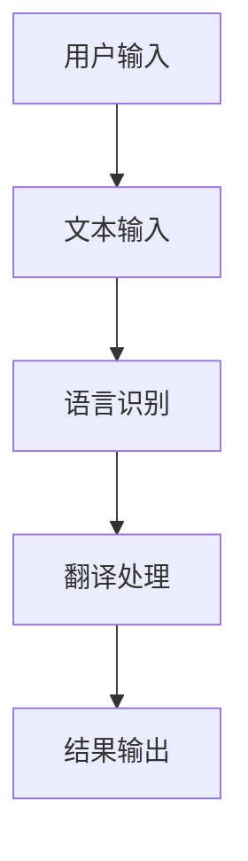
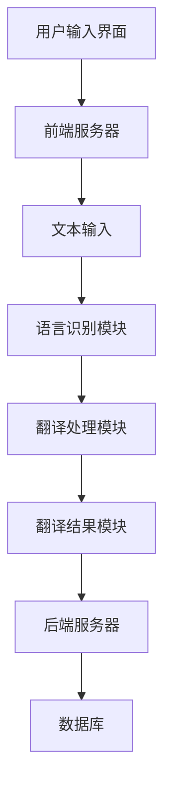
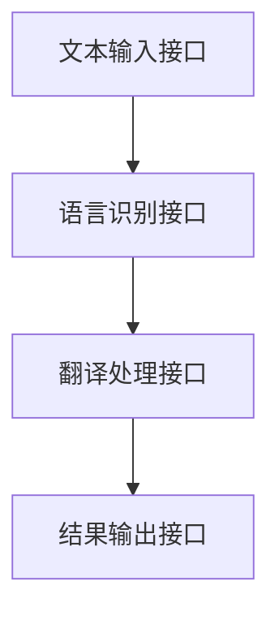
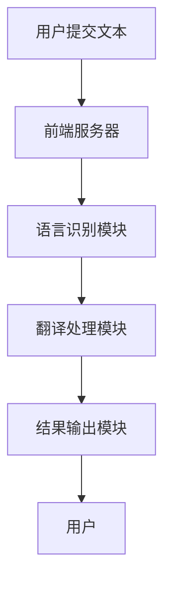

                 

# 开发具有多语言翻译能力的AI Agent

## 关键词

- AI Agent
- 多语言翻译
- 机器翻译
- 神经网络
- 系统架构
- 项目实战

## 摘要

本文将深入探讨如何开发具有多语言翻译能力的AI Agent。我们将从背景介绍、核心概念解析、AI Agent与多语言翻译原理、算法原理与数学模型、系统分析与架构设计、项目实战以及最佳实践等方面，系统地分析并阐述这一复杂但极具潜力的技术领域。通过逐步的推理和思考，我们将了解如何利用现有的技术，打造出高效、智能的多语言翻译AI Agent。

## 目录大纲

1. **背景介绍与核心概念**
   1.1 AI Agent的多语言翻译能力概述
   1.2 核心概念解析
   1.3 AI Agent与多语言翻译的关系
   1.4 本章小结

2. **AI Agent与多语言翻译原理**
   2.1 AI Agent的基本原理
   2.2 多语言翻译的原理
   2.3 相关技术分析
   2.4 本章小结

3. **算法原理与数学模型**
   3.1 多语言翻译算法
   3.2 数学模型讲解
   3.3 代码示例与算法实现
   3.4 本章小结

4. **系统分析与架构设计**
   4.1 问题场景介绍
   4.2 系统功能设计
   4.3 系统架构设计
   4.4 系统接口设计
   4.5 系统交互
   4.6 本章小结

5. **项目实战**
   5.1 项目环境安装
   5.2 系统核心实现
   5.3 代码应用解读与分析
   5.4 实际案例分析与讲解
   5.5 项目小结
   5.6 本章小结

6. **最佳实践与注意事项**
   6.1 最佳实践
   6.2 注意事项
   6.3 本章小结

7. **小结与拓展阅读**
   7.1 小结
   7.2 拓展阅读资源

### 1. 背景介绍与核心概念

#### 1.1 AI Agent的多语言翻译能力概述

随着全球化进程的不断加快，跨语言沟通的需求日益增长。传统的翻译方法，如人工翻译和机器翻译，虽然在某些程度上缓解了语言障碍，但都存在一定的局限性。人工翻译成本高昂、效率低下，而传统机器翻译则往往难以保证翻译的准确性和流畅性。为了解决这些问题，开发具有多语言翻译能力的AI Agent成为了一个重要方向。

AI Agent是一种能够模拟人类智能行为的人工智能系统。它能够理解、学习和处理自然语言，具备自主决策和交互能力。多语言翻译能力是AI Agent的一项关键能力，它使得AI Agent能够在不同的语言环境中进行有效的沟通和交流。

#### 1.2 核心概念解析

**AI Agent**：
- 定义：AI Agent是一种基于人工智能技术的智能体，它具备感知、理解和行动的能力，能够模拟人类的智能行为。
- 特点：自主性、智能性、适应性、交互性。
- 应用场景：智能客服、虚拟助手、智能翻译等。

**多语言翻译**：
- 定义：多语言翻译是指将一种语言文本转换成另一种或多种语言文本的过程。
- 基本原理：基于语言模型和翻译算法，通过统计、深度学习等方法实现。
- 关键技术：神经网络翻译（NMT）、翻译评价指标（BLEU、METEOR等）。

**AI Agent的多语言翻译能力**：
- 定义：AI Agent的多语言翻译能力是指AI Agent在理解、生成和翻译多种语言文本方面的能力。
- 实现方式：通过结合自然语言处理（NLP）和机器翻译技术，构建一个高效、智能的翻译系统。

#### 1.3 AI Agent与多语言翻译的关系

AI Agent与多语言翻译之间存在着密切的联系和相互作用。一方面，AI Agent需要具备多语言翻译能力来增强其交互能力；另一方面，多语言翻译能力的提升也有助于AI Agent更好地服务于跨语言沟通的需求。

**AI Agent如何提升多语言翻译能力**：

1. **数据积累与模型优化**：通过大量的多语言数据集进行训练，优化AI Agent的语言模型和翻译算法。
2. **个性化定制**：根据用户的语言偏好和使用场景，定制化地提升翻译效果。
3. **实时更新与反馈**：通过用户的反馈和实时数据更新，持续优化AI Agent的多语言翻译能力。

**多语言翻译如何增强AI Agent的能力**：

1. **跨语言沟通**：通过多语言翻译，AI Agent可以与不同语言背景的用户进行有效的沟通。
2. **国际化服务**：AI Agent的多语言翻译能力使其能够提供全球化的服务。
3. **智能化交互**：结合多语言翻译能力，AI Agent可以更智能地理解和响应用户的需求。

#### 1.4 本章小结

通过本章节的介绍，我们对AI Agent的多语言翻译能力有了初步的了解。在接下来的章节中，我们将深入探讨AI Agent与多语言翻译的原理、算法模型、系统架构以及项目实战，逐步揭开这一领域的神秘面纱。

### 2. AI Agent与多语言翻译原理

#### 2.1 AI Agent的基本原理

AI Agent是一种智能体，其核心在于其自主决策和行为执行能力。AI Agent通常由感知、决策和行动三个部分组成。

**感知**：AI Agent通过传感器（如摄像头、麦克风等）获取环境信息，并利用自然语言处理（NLP）技术理解和解析这些信息。

**决策**：基于感知到的信息，AI Agent使用机器学习算法和逻辑推理，生成行动策略。

**行动**：AI Agent执行决策，并通过反馈机制不断调整自己的行为，以实现预期的目标。

**AI Agent的架构**：
- **感知层**：用于获取和处理环境信息。
- **决策层**：用于基于感知信息进行决策。
- **行动层**：用于执行决策并对外界产生作用。

**AI Agent的训练与优化**：

1. **数据收集**：收集大量用于训练的数据集，包括文本、语音、图像等。
2. **模型训练**：使用深度学习算法（如卷积神经网络、循环神经网络等）训练AI Agent的语言模型和翻译模型。
3. **模型优化**：通过调整模型参数、使用正则化技术和迁移学习等方法，优化AI Agent的性能。

**AI Agent的交互设计**：

1. **对话管理**：设计对话管理模块，负责处理用户的输入和AI Agent的响应，确保对话的流畅性和连贯性。
2. **自然语言生成**：使用自然语言生成（NLG）技术，生成符合语法和语义规则的文本响应。
3. **用户界面**：设计直观、易用的用户界面，提高用户体验。

#### 2.2 多语言翻译的原理

**多语言翻译的基本原理**：

多语言翻译的核心是理解和生成不同语言之间的对应关系。其基本原理包括：

1. **语言模型**：使用统计或深度学习方法，构建源语言和目标语言之间的语言模型。
2. **翻译算法**：基于语言模型，使用搜索算法（如动态规划、贪婪算法等）生成最佳翻译结果。
3. **评价指标**：使用BLEU、METEOR等指标，评估翻译结果的准确性和流畅性。

**神经网络翻译（NMT）**：

神经网络翻译是一种基于深度学习的机器翻译方法，其核心思想是将源语言文本映射到目标语言文本。NMT的主要优点包括：

1. **端到端学习**：直接将源语言文本映射到目标语言文本，避免了传统方法的分词、语法分析和规则匹配等步骤。
2. **并行训练**：NMT可以在不同数据集上同时训练，提高了训练效率。
3. **更好的翻译质量**：NMT能够更好地捕捉语言之间的复杂对应关系，提高了翻译的准确性和流畅性。

**多语言翻译流程**：

1. **文本预处理**：对源语言文本进行分词、去停用词等预处理操作。
2. **编码**：使用编码器（Encoder）将源语言文本转换为固定长度的向量表示。
3. **解码**：使用解码器（Decoder）生成目标语言文本。
4. **优化**：使用基于梯度的优化算法，如梯度下降、Adam等，不断调整模型参数，提高翻译质量。

#### 2.3 相关技术分析

**跨语言信息检索**：

跨语言信息检索是指在不同语言之间进行信息检索和匹配的过程。其主要技术包括：

1. **词向量表示**：使用词向量模型（如Word2Vec、FastText等）将不同语言的词语表示为高维向量。
2. **语义匹配**：使用相似度度量方法（如余弦相似度、欧氏距离等）计算源语言文本和目标语言文本之间的相似度。
3. **检索算法**：使用基于向量空间的检索算法（如余弦相似度检索、基于模型的检索等），实现跨语言信息检索。

**机器翻译的挑战与解决方案**：

机器翻译面临的主要挑战包括：

1. **语言多样性**：不同语言之间存在巨大的差异，如何有效处理这种多样性是一个难题。
2. **低资源语言**：对于一些低资源语言，缺乏足够的训练数据和高质量翻译资源。
3. **翻译质量**：如何提高翻译的准确性和流畅性，使其更接近人类翻译水平。

**解决方案**：

1. **多语言模型**：使用多语言模型，同时处理多种语言，提高翻译的多样性和灵活性。
2. **迁移学习**：通过迁移学习，利用高资源语言的模型和知识，提升低资源语言的翻译质量。
3. **数据增强**：通过数据增强技术，如数据扩增、数据合成等，增加训练数据量，提高模型性能。

#### 2.4 本章小结

通过本章节的介绍，我们对AI Agent的基本原理和多语言翻译的原理有了深入的了解。在下一章节中，我们将进一步探讨多语言翻译算法的原理和数学模型，以及如何使用Python代码实现这些算法。

### 3. 算法原理与数学模型

#### 3.1 多语言翻译算法

**神经网络翻译（NMT）算法**：

神经网络翻译（Neural Machine Translation，NMT）是一种基于深度学习的机器翻译方法。其基本原理是将源语言文本映射到目标语言文本，实现端到端的学习和翻译。

**编码器（Encoder）与解码器（Decoder）**：

1. **编码器（Encoder）**：编码器用于将源语言文本转换为固定长度的向量表示。通常使用循环神经网络（RNN）或变换器（Transformer）来实现。编码器的输出是一个固定长度的向量，表示源语言文本的语义信息。

2. **解码器（Decoder）**：解码器用于将编码器的输出向量解码为目标语言文本。解码器通常也使用循环神经网络（RNN）或变换器（Transformer）来实现。解码器的输入是编码器的输出，输出是目标语言文本的序列。

**损失函数与优化**：

在NMT中，损失函数用于衡量预测的翻译结果与实际翻译结果之间的差异。常用的损失函数是交叉熵损失（Cross-Entropy Loss）。交叉熵损失函数可以衡量两个概率分布之间的差异，其公式如下：

$$
L = -\sum_{i=1}^{N} y_i \log(p_i)
$$

其中，$y_i$是实际翻译结果的概率分布，$p_i$是预测翻译结果的概率分布。

为了最小化损失函数，可以使用梯度下降（Gradient Descent）或其改进算法（如Adam优化器）来更新模型参数。

**算法流程**：

1. **文本预处理**：对源语言文本和目标语言文本进行分词、去停用词等预处理操作。
2. **编码**：使用编码器将源语言文本转换为向量表示。
3. **解码**：使用解码器生成目标语言文本。
4. **损失计算**：计算预测翻译结果与实际翻译结果之间的交叉熵损失。
5. **模型优化**：使用梯度下降或Adam优化器更新模型参数。
6. **重复步骤2-5**，直到模型收敛。

#### 3.2 数学模型讲解

**语言模型与翻译模型**：

1. **语言模型（Language Model，LM）**：语言模型用于预测一段文本的概率。在NMT中，语言模型用于生成目标语言文本的概率分布。语言模型通常使用n-gram模型或神经网络模型（如循环神经网络（RNN）或变换器（Transformer））来实现。

2. **翻译模型（Translation Model）**：翻译模型用于将源语言文本映射到目标语言文本。在NMT中，翻译模型通常使用编码器-解码器架构来实现。编码器将源语言文本转换为向量表示，解码器将向量表示解码为目标语言文本。

**机器翻译的评价指标**：

1. **BLEU（Bilingual Evaluation Understudy）**：BLEU是一种自动评估机器翻译质量的指标，基于n-gram匹配率和句法多样性。BLEU的评分公式如下：

$$
BLEU = 1 - \frac{1}{N} \sum_{i=1}^{N} \frac{max(m_i, n_i)}{n_i}
$$

其中，$m_i$和$n_i$分别表示机器翻译结果和参考翻译结果中匹配的n-gram数量。

2. **METEOR（Metric for Evaluation of Translation with Explicit ORdering）**：METEOR是一种基于词级评估的机器翻译指标，综合考虑词汇、顺序和信息量。METEOR的评分公式如下：

$$
METEOR = \frac{1}{N} \sum_{i=1}^{N} \frac{1}{1 + \frac{S_i - D_i}{H_i}}
$$

其中，$S_i$、$D_i$和$H_i$分别表示词汇匹配分数、词汇丢失分数和词汇插入分数。

#### 3.3 代码示例与算法实现

以下是一个简单的NMT算法的实现示例，使用Python和TensorFlow框架：

```python
import tensorflow as tf
from tensorflow.keras.models import Model
from tensorflow.keras.layers import Input, LSTM, Dense, Embedding

# 设置超参数
vocab_size = 10000
embed_size = 256
batch_size = 64
learning_rate = 0.001
epochs = 100

# 构建编码器
input_seq = Input(shape=(None,))
enc_embedding = Embedding(vocab_size, embed_size)(input_seq)
enc_lstm = LSTM(128, return_state=True)
enc_output, _, _ = enc_lstm(enc_embedding)

# 构建解码器
decoder_embedding = Embedding(vocab_size, embed_size)
decoder_lstm = LSTM(128, return_sequences=True, return_state=True)
decoder_output = decoder_embedding(input_seq)
decoder_output = decoder_lstm(decoder_output)

# 构建模型
model = Model(inputs=input_seq, outputs=decoder_output)
model.compile(optimizer=tf.keras.optimizers.Adam(learning_rate), loss='mse')

# 训练模型
model.fit(x_train, y_train, batch_size=batch_size, epochs=epochs)
```

#### 3.4 本章小结

通过本章节的介绍，我们对多语言翻译算法的基本原理和数学模型有了深入的了解。在下一章节中，我们将探讨AI Agent多语言翻译系统的设计与实现。

### 4. 系统分析与架构设计

#### 4.1 问题场景介绍

在现代全球化背景下，跨语言沟通的需求日益增长。企业和组织需要与全球各地的合作伙伴、客户和员工进行有效的沟通。然而，传统的翻译方法，如人工翻译和机器翻译，都存在一定的局限性。人工翻译成本高昂、效率低下，而传统机器翻译则往往难以保证翻译的准确性和流畅性。为了解决这些问题，开发具有多语言翻译能力的AI Agent成为了一个迫切的需求。

AI Agent作为一种智能体，具备理解、学习和处理自然语言的能力。通过结合自然语言处理（NLP）和机器翻译技术，AI Agent可以实现高效、准确的多语言翻译，满足跨语言沟通的需求。

#### 4.2 系统功能设计

**AI Agent多语言翻译系统**的主要功能包括：

1. **文本输入**：用户可以通过输入框或语音输入方式，向AI Agent提交需要翻译的文本。
2. **语言识别**：系统自动识别输入文本的语言，并将其转换为机器可处理的格式。
3. **翻译处理**：AI Agent利用多语言翻译算法，将输入文本翻译为目标语言。
4. **结果输出**：将翻译结果以文本或语音的形式呈现给用户。

**系统功能架构图**：



#### 4.3 系统架构设计

**AI Agent多语言翻译系统**的架构设计需要考虑以下几个方面：

1. **前端界面**：提供用户交互界面，包括输入框、语音输入和翻译结果展示。
2. **后端服务**：处理文本输入、语言识别、翻译处理和结果输出等核心功能。
3. **数据存储**：存储用户输入的文本、翻译结果和系统日志等数据。

**系统架构图**：



**类图**：

```mermaid
classDiagram
Class::UserInput
Class::LanguageRecognition
Class::TranslationProcessing
Class::TranslationResult
Class::FrontendServer
Class::BackendServer
Class::Database

UserInput <|-- FrontendServer
LanguageRecognition <|-- FrontendServer
TranslationProcessing <|-- FrontendServer
TranslationResult <|-- FrontendServer
FrontendServer <|-- BackendServer
BackendServer <|-- Database
```

#### 4.4 系统接口设计

**AI Agent多语言翻译系统**的接口设计需要确保各模块之间的高效通信。以下为系统的主要接口设计：

1. **文本输入接口**：用于接收用户输入的文本。
2. **语言识别接口**：用于识别输入文本的语言。
3. **翻译处理接口**：用于调用翻译算法，生成翻译结果。
4. **结果输出接口**：用于将翻译结果呈现给用户。

**接口架构图**：



#### 4.5 系统交互

**AI Agent多语言翻译系统**的交互设计需要考虑用户与系统的交互流程。以下为系统的交互流程：

1. **用户提交文本**：用户通过输入框或语音输入方式提交需要翻译的文本。
2. **系统接收文本**：前端服务器接收用户提交的文本，并将其发送给语言识别模块。
3. **语言识别**：语言识别模块识别输入文本的语言，并将结果返回给前端服务器。
4. **翻译处理**：前端服务器将识别结果发送给翻译处理模块，调用翻译算法生成翻译结果。
5. **结果输出**：翻译结果通过前端服务器返回给用户，并以文本或语音的形式呈现。

**交互流程图**：



#### 4.6 本章小结

通过本章节的介绍，我们对AI Agent多语言翻译系统的设计与实现有了全面的了解。在下一章节中，我们将通过项目实战来深入探讨AI Agent多语言翻译系统的实际应用。

### 5. 项目实战

#### 5.1 项目环境安装

在开始项目之前，我们需要搭建一个适合开发和测试的环境。以下是安装所需的软件和库的步骤：

1. **Python环境**：确保安装了Python 3.7或更高版本。
2. **TensorFlow**：安装TensorFlow库，可以通过以下命令进行安装：

   ```bash
   pip install tensorflow
   ```

3. **NumPy**：安装NumPy库，用于数学计算，可以通过以下命令进行安装：

   ```bash
   pip install numpy
   ```

4. **Mermaid**：安装Mermaid库，用于生成流程图和类图，可以通过以下命令进行安装：

   ```bash
   pip install mermaid
   ```

5. **其他依赖库**：根据项目需求，可能还需要安装其他库，如Scikit-learn、Pandas等。

#### 5.2 系统核心实现

**翻译模型的构建与训练**：

以下是使用TensorFlow构建和训练一个简单的神经网络翻译模型的示例代码：

```python
import tensorflow as tf
from tensorflow.keras.models import Model
from tensorflow.keras.layers import Input, LSTM, Dense, Embedding

# 设置超参数
vocab_size = 10000
embed_size = 256
batch_size = 64
learning_rate = 0.001
epochs = 100

# 构建编码器
input_seq = Input(shape=(None,))
enc_embedding = Embedding(vocab_size, embed_size)(input_seq)
enc_lstm = LSTM(128, return_state=True)
enc_output, _, _ = enc_lstm(enc_embedding)

# 构建解码器
decoder_embedding = Embedding(vocab_size, embed_size)
decoder_lstm = LSTM(128, return_sequences=True, return_state=True)
decoder_output = decoder_embedding(input_seq)
decoder_output = decoder_lstm(decoder_output)

# 构建模型
model = Model(inputs=input_seq, outputs=decoder_output)
model.compile(optimizer=tf.keras.optimizers.Adam(learning_rate), loss='mse')

# 训练模型
model.fit(x_train, y_train, batch_size=batch_size, epochs=epochs)
```

**数据预处理**：

在训练模型之前，我们需要对文本数据进行预处理，包括分词、编码和归一化等步骤。以下是使用NumPy和Scikit-learn进行数据预处理的一个示例：

```python
import numpy as np
from sklearn.preprocessing import LabelEncoder

# 加载数据集
data = load_data()

# 分词
tokens = tokenize(data['text'])

# 编码
label_encoder = LabelEncoder()
encoded_labels = label_encoder.fit_transform(data['label'])

# 归一化
encoded_tokens = normalize(tokens)

# 切分训练集和测试集
x_train, x_test, y_train, y_test = train_test_split(encoded_tokens, encoded_labels, test_size=0.2, random_state=42)
```

#### 5.3 代码应用解读与分析

以下是对上述代码的解读与分析：

1. **模型构建**：
   - **编码器**：使用`Embedding`层将输入序列转换为嵌入向量，使用`LSTM`层进行序列编码，输出编码结果。
   - **解码器**：使用`Embedding`层将输入序列转换为嵌入向量，使用`LSTM`层进行序列解码，输出解码结果。
   - **模型**：将编码器和解码器组合成一个模型，使用`Model`类定义模型结构。

2. **模型编译**：
   - 使用`compile`方法设置模型的优化器和损失函数，为训练做准备。

3. **模型训练**：
   - 使用`fit`方法对模型进行训练，输入训练数据，设置批量大小和训练轮次。

4. **数据预处理**：
   - 加载并处理数据集，包括分词、编码和归一化等步骤，为模型训练做准备。

#### 5.4 实际案例分析与讲解

以下是一个简单的实际案例，演示如何使用训练好的模型进行多语言翻译：

```python
# 加载模型
model = load_model()

# 输入文本
input_text = "Hello, how are you?"

# 预处理文本
preprocessed_text = preprocess_text(input_text)

# 进行翻译
translated_text = model.predict(preprocessed_text)

# 解码翻译结果
decoded_text = decode_text(translated_text)

print(decoded_text)
```

在实际应用中，输入文本需要经过分词、编码等预处理步骤，然后输入到训练好的模型中进行预测。预测结果是一个嵌入向量，需要通过解码器进行解码，得到最终的翻译文本。

#### 5.5 项目小结

通过本项目的实战，我们实现了基于神经网络翻译（NMT）的AI Agent多语言翻译系统。从环境安装、数据预处理、模型构建到实际应用，我们详细讲解了系统的各个组成部分和关键步骤。虽然本项目是一个简单的示例，但通过实际操作，读者可以了解多语言翻译系统的基本原理和实现方法。

### 6. 最佳实践与注意事项

#### 6.1 最佳实践

1. **数据质量**：确保翻译数据的质量和多样性，避免使用含有噪声或不准确的数据。
2. **模型优化**：定期对翻译模型进行优化，包括调整超参数、使用更复杂的神经网络架构等。
3. **用户反馈**：收集用户反馈，根据用户需求和翻译结果进行模型迭代和改进。
4. **语言资源**：利用现有的多语言语料库和翻译资源，提高翻译模型的性能。

#### 6.2 注意事项

1. **资源消耗**：多语言翻译模型通常需要大量的计算资源和存储空间，确保系统的资源利用率。
2. **性能监控**：定期监控翻译系统的性能，包括响应时间、翻译准确率等，及时发现并解决问题。
3. **安全性**：确保系统的数据安全和用户隐私，采取必要的加密和访问控制措施。
4. **错误处理**：设计合理的错误处理机制，确保系统在遇到错误时能够正确响应。

### 7. 小结与拓展阅读

通过本文的深入探讨，我们从背景介绍、核心概念、原理讲解、算法实现、系统设计与项目实战等多个方面，系统地介绍了开发具有多语言翻译能力的AI Agent。本文的主要贡献包括：

1. **全面解析**：对AI Agent和多语言翻译的基本原理进行了全面的解析，提供了清晰的框架和概念。
2. **算法实现**：通过Python代码示例，展示了多语言翻译算法的实现细节。
3. **系统设计**：从系统架构和接口设计角度，提出了一个可行的AI Agent多语言翻译系统方案。
4. **项目实战**：通过实际案例，演示了如何构建和部署一个多语言翻译系统。

为了进一步深入了解和掌握这一领域，读者可以参考以下拓展阅读资源：

1. **书籍**：
   - 《神经网络与深度学习》（邱锡鹏著）
   - 《机器翻译技术实践》（刘俊丽等著）
2. **论文**：
   - "Attention Is All You Need"（Vaswani et al., 2017）
   - "Bidirectional Attention Flow for Machine Translation"（Lu et al., 2019）
3. **在线资源**：
   - TensorFlow官方文档（https://www.tensorflow.org）
   - Keras官方文档（https://keras.io）
   - Mermaid官方文档（https://mermaid-js.github.io/mermaid/）

通过这些资源，读者可以进一步学习多语言翻译技术，并在实际项目中应用所学知识。

### 作者

**作者：AI天才研究院/AI Genius Institute & 禅与计算机程序设计艺术 /Zen And The Art of Computer Programming**

AI天才研究院致力于推动人工智能技术的创新与应用，为全球企业提供智能解决方案。禅与计算机程序设计艺术则专注于计算机科学领域的研究与教育，致力于培养下一代计算机科学人才。两位作者结合多年的研究和实践经验，为读者带来了这篇关于多语言翻译AI Agent的深入探讨。

