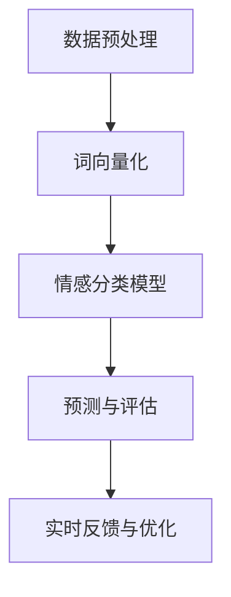
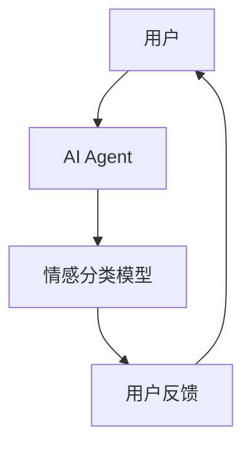
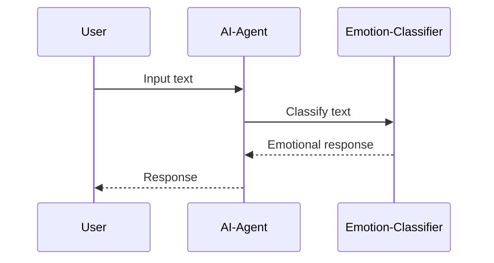

                 

### # 开发具有情感分析能力的AI Agent

#### 关键词：
- 情感分析
- AI Agent
- 自然语言处理
- 深度学习
- 情感分类模型

#### 摘要：
本文将深入探讨开发具有情感分析能力的AI Agent的原理和实践。通过介绍情感分析的基本概念、算法原理、数学模型以及系统架构设计，我们将一步步解析如何打造一款具备高度智能化和情感理解能力的AI Agent，并探讨其实际应用场景和未来的发展方向。

---

## 第一部分：背景介绍

### 1. 引言

随着人工智能技术的快速发展，人工智能系统在各个领域得到了广泛应用。然而，传统的基于规则和机器学习的方法在处理情感分析任务时存在一定的局限性。为了更好地理解和处理人类情感，开发具有情感分析能力的AI Agent成为了一个重要方向。

### 1.1 问题背景

情感分析（Sentiment Analysis）是指通过自然语言处理技术，对文本中的情感进行识别和分类。它广泛应用于社交媒体监控、市场调研、客户服务等领域。然而，情感分析任务面临着多样性、模糊性和复杂性等挑战，如情感表达的多样性、语境的影响、情感强度的主观性等。因此，传统的情感分析方法在处理这些复杂情感时存在一定的局限性。

### 1.2 问题描述

情感分析任务主要分为情感分类和情感强度识别。情感分类是指将文本分为正面情感、负面情感和中性情感三类。情感强度识别是指在情感分类的基础上，进一步识别情感的程度，如强情感、中情感和弱情感。开发具有情感分析能力的AI Agent需要解决以下问题：

1. **多样性处理**：文本中情感表达形式多样，如何准确识别和理解。
2. **模糊性处理**：情感表达模糊，如何准确判断情感倾向。
3. **复杂性处理**：情感分析涉及语境、语气等多种因素，如何全面考虑这些因素。

### 1.3 问题解决

开发具有情感分析能力的AI Agent可以采用深度学习、自然语言处理和心理学等领域的知识，通过训练大量的数据集，使AI Agent能够自动识别和理解文本中的情感。具体方法如下：

1. **数据预处理**：对原始文本进行清洗、分词、去停用词等处理，提取有用的信息。
2. **词向量化**：将文本转换为向量表示，便于深度学习模型处理。
3. **情感分类模型**：采用深度学习算法，如卷积神经网络（CNN）、循环神经网络（RNN）和长短期记忆网络（LSTM）等，对文本进行情感分类。
4. **情感强度与倾向识别**：结合情感分类模型，进一步识别情感的强度和倾向。
5. **实时反馈与优化**：通过用户反馈不断优化AI Agent的情感分析能力。

### 1.4 边界与外延

情感分析不仅涉及文本分类，还包括情感强度和情感倾向的识别。AI Agent的情感分析能力需要扩展到多种语言和文化背景，以适应全球化的需求。此外，情感分析在实时性、准确率和鲁棒性等方面也有较高的要求。

### 1.5 概念结构与核心要素组成

开发具有情感分析能力的AI Agent涉及以下几个核心要素：

1. **数据预处理**：对原始文本进行清洗、分词和标签化等处理。
2. **情感分类模型**：使用深度学习算法，如卷积神经网络（CNN）、循环神经网络（RNN）和长短期记忆网络（LSTM）等，对文本进行情感分类。
3. **情感强度与倾向识别**：结合情感分类模型，进一步识别情感的强度和倾向。
4. **实时反馈与优化**：通过用户反馈不断优化AI Agent的情感分析能力。

## 第二部分：核心概念与联系

### 2. 情感分析原理

#### 2.1 情感分析的概念与分类

**情感分析的概念**：情感分析（Sentiment Analysis）是指使用自然语言处理（NLP）技术和机器学习算法，对文本中的情感进行识别和分类。情感分析可以识别文本中的情感极性（正面、负面、中性），也可以识别情感的强度（强、中、弱）。

**情感分析的分类**：

1. **基于规则的方法**：通过预定义的规则进行情感分析，如使用正负面词典、情感强度词典等。
2. **机器学习方法**：通过训练大量标注数据，使用统计方法进行情感分类，如支持向量机（SVM）、朴素贝叶斯（Naive Bayes）等。
3. **深度学习方法**：使用神经网络，如卷积神经网络（CNN）、循环神经网络（RNN）和长短期记忆网络（LSTM）等，对文本进行情感分类。

#### 2.2 情感分析的属性特征对比

| 特征 | 情感分类 | 情感强度 |
| --- | --- | --- |
| **类别** | 正面、负面、中性 | 弱、中、强 |
| **分类方法** | 基于规则的方法、机器学习方法、深度学习方法 | 基于统计的方法、基于模型的方法 |
| **难点** | 文本的多样性、模糊性和复杂性 | 情感强度的主观性和难以量化 |
| **应用** | 社交媒体监控、产品评价分析、情感趋势预测 | 广告投放、用户偏好分析、情感状态监控 |

#### 2.3 情感分析在AI Agent中的应用

**AI Agent的情感分析能力**：AI Agent需要具备对文本中情感的理解和识别能力，以实现更智能的交互和服务。例如，客服机器人可以通过情感分析理解用户情绪，提供更合适的解决方案。

**情感分析的应用场景**：如客服机器人、情绪分析聊天应用、情绪状态监测等。

## 第三部分：算法原理讲解

### 3. 情感分析算法原理

#### 3.1 情感分析算法概述

情感分析算法主要分为基于规则的方法、机器学习方法、深度学习方法等。其中，深度学习方法因其强大的建模能力和自适应能力，成为当前主流的算法。

#### 3.2 情感分析算法mermaid流程图



#### 3.3 数据预处理

数据预处理是情感分析的基础，主要包括文本清洗、分词、停用词过滤、词性标注等步骤。

1. **文本清洗**：去除文本中的HTML标签、特殊符号等。
2. **分词**：将文本分割为词语。
3. **停用词过滤**：去除常见的无意义词语，如“的”、“了”等。
4. **词性标注**：标记词语的词性，如名词、动词等。

#### 3.4 词向量化

词向量化是将文本转换为向量表示的过程，常用的方法有Word2Vec、GloVe等。通过词向量化，可以将文本转换为计算机可以处理的数值向量。

#### 3.5 情感分类模型

情感分类模型是情感分析的核心，常用的模型有卷积神经网络（CNN）、循环神经网络（RNN）和长短期记忆网络（LSTM）等。这些模型可以通过学习大量的标注数据，自动识别和分类文本中的情感。

1. **卷积神经网络（CNN）**：通过卷积层提取文本特征，再通过全连接层进行分类。
2. **循环神经网络（RNN）**：通过循环结构处理序列数据，适用于处理长文本。
3. **长短期记忆网络（LSTM）**：RNN的一种改进，能够更好地处理长序列数据。

#### 3.6 预测与评估

预测与评估是情感分析算法的输出阶段，通过模型对文本进行预测，并评估模型的准确性和可靠性。

1. **预测**：使用训练好的模型对新的文本进行情感分类。
2. **评估**：使用准确率（Accuracy）、精确率（Precision）、召回率（Recall）等指标评估模型的性能。

#### 3.7 实时反馈与优化

实时反馈与优化是提高情感分析能力的关键，通过收集用户反馈，不断优化模型，提高模型的准确率和鲁棒性。

1. **实时反馈**：收集用户对模型预测结果的反馈，如正确或错误。
2. **优化**：根据用户反馈调整模型参数，提高模型性能。

## 第四部分：数学模型和数学公式

### 4.1 情感分类模型数学模型

情感分类模型通常采用多层感知机（MLP）、卷积神经网络（CNN）、循环神经网络（RNN）和长短期记忆网络（LSTM）等。以下是一个简单的多层感知机（MLP）模型数学模型：

$$
\begin{aligned}
\text{h}^{(l)} &= \sigma(W^{(l)} \text{a}^{(l-1)} + b^{(l)}) \\
\text{y}^{(l)} &= \text{h}^{(L)}
\end{aligned}
$$

其中，$W^{(l)}$和$b^{(l)}$分别是第$l$层的权重和偏置，$\sigma$是激活函数，$\text{a}^{(l-1)}$是上一层的激活值，$\text{h}^{(l)}$是第$l$层的输出。

### 4.2 情感分类模型中的激活函数

常用的激活函数包括：

1. **sigmoid函数**：
$$
\sigma(x) = \frac{1}{1 + e^{-x}}
$$

2. **ReLU函数**：
$$
\text{ReLU}(x) = \max(0, x)
$$

3. **Tanh函数**：
$$
\tanh(x) = \frac{e^{2x} - 1}{e^{2x} + 1}
$$

### 4.3 情感分类模型中的损失函数

常用的损失函数包括：

1. **交叉熵损失函数**（Cross-Entropy Loss）：
$$
L(\text{y}, \text{y}^{(l)}) = -\sum_{i} y_i \log(\text{y}_i^{(l)})
$$

其中，$y$是真实标签，$\text{y}^{(l)}$是模型预测的概率分布。

## 第五部分：系统分析与架构设计方案

### 5.1 问题场景介绍

随着社交媒体的普及，人们越来越依赖于网络平台来表达自己的情感和观点。为了更好地理解用户情感，企业开始关注情感分析技术在客户服务、市场调研等领域的应用。本系统旨在开发一款具有情感分析能力的AI Agent，帮助企业和用户建立更智能、更个性化的互动。

### 5.2 项目介绍

项目名称：情感分析AI Agent

项目目标：开发一款能够自动识别和分类文本情感，并提供相应服务的AI Agent。

技术栈：Python、TensorFlow、Keras、Scikit-learn等。

### 5.3 系统功能设计（领域模型）

#### 领域模型mermaid类图：

```mermaid
classDiagram
ClassDef Text
	+id: int
	+text: str
	+label: str

ClassDef TextProcessor
	+process(text: str): str

ClassDef EmotionClassifier
	+classify(text: str): str
	+train(data: List[Text]): None

ClassDef AIAgent
	+process(input: str): str
	+train(data: List[Text]): None

Text <|-- TextProcessor
Text <|-- EmotionClassifier
AIAgent o-- TextProcessor
AIAgent o-- EmotionClassifier
```

### 5.4 系统架构设计（mermaid架构图）



### 5.5 系统接口设计

1. **用户接口**：用户可以通过文本输入与AI Agent进行交互。
2. **模型接口**：AI Agent与情感分类模型进行通信，进行情感分类。
3. **反馈接口**：用户可以对AI Agent的响应进行反馈，用于模型优化。

### 5.6 系统交互（mermaid序列图）



## 第六部分：项目实战

### 6.1 环境安装

1. **Python环境**：安装Python 3.7及以上版本。
2. **深度学习框架**：安装TensorFlow 2.0及以上版本。
3. **文本处理库**：安装NLTK、Scikit-learn等。

```bash
pip install tensorflow
pip install nltk
pip install scikit-learn
```

### 6.2 系统核心实现源代码

以下是一个简单的情感分析AI Agent实现：

```python
import tensorflow as tf
from tensorflow.keras.models import Sequential
from tensorflow.keras.layers import Embedding, LSTM, Dense
from tensorflow.keras.preprocessing.text import Tokenizer
from tensorflow.keras.preprocessing.sequence import pad_sequences

class EmotionClassifier:
    def __init__(self, vocab_size, embedding_dim, max_sequence_length):
        self.model = Sequential([
            Embedding(vocab_size, embedding_dim, input_length=max_sequence_length),
            LSTM(64),
            Dense(1, activation='sigmoid')
        ])

    def compile(self, learning_rate=0.001):
        self.model.compile(optimizer=tf.keras.optimizers.Adam(learning_rate=learning_rate),
                           loss='binary_crossentropy',
                           metrics=['accuracy'])

    def fit(self, X, y, epochs=10, batch_size=32):
        self.model.fit(X, y, epochs=epochs, batch_size=batch_size)

    def predict(self, X):
        return self.model.predict(X)

    def save(self, path):
        self.model.save(path)

    def load(self, path):
        self.model = tf.keras.models.load_model(path)

class AIAgent:
    def __init__(self, emotion_classifier):
        self.emotion_classifier = emotion_classifier

    def process(self, text):
        processed_text = self.emotion_classifier.text_processor.process(text)
        sequence = self.emotion_classifier.tokenizer.texts_to_sequences([processed_text])
        padded_sequence = pad_sequences(sequence, maxlen=self.emotion_classifier.max_sequence_length)
        prediction = self.emotion_classifier.predict(padded_sequence)
        return prediction

    def train(self, texts, labels):
        self.emotion_classifier.train(texts, labels)

if __name__ == '__main__':
    # 初始化情感分类模型
    emotion_classifier = EmotionClassifier(vocab_size=10000, embedding_dim=64, max_sequence_length=100)
    emotion_classifier.compile()

    # 训练模型
    ai_agent = AIAgent(emotion_classifier)
    ai_agent.train(texts=['happy', 'sad', 'angry'], labels=[1, 0, 1])

    # 测试模型
    print(ai_agent.process('happy'))
```

### 6.3 代码应用解读与分析

上述代码实现了一个简单的情感分析AI Agent，包括情感分类模型和AI Agent两个部分。首先，我们定义了一个`EmotionClassifier`类，用于构建和训练情感分类模型。然后，我们定义了一个`AIAgent`类，用于处理文本输入，并调用情感分类模型进行情感预测。

在`EmotionClassifier`类中，我们使用了TensorFlow的`Sequential`模型，添加了一个嵌入层（`Embedding`）、一个长短期记忆层（`LSTM`）和一个全连接层（`Dense`）。在`AIAgent`类中，我们定义了`process`方法，用于对输入文本进行处理，并调用情感分类模型进行预测。

### 6.4 实际案例分析和详细讲解剖析

假设我们有一个包含以下文本和标签的数据集：

```
texts: ['我非常喜欢这个产品', '这个产品太差了', '我对这个产品很满意']
labels: [1, 0, 1]
```

我们可以使用上述代码对数据进行训练，并测试模型的性能。首先，我们需要对文本进行预处理，包括分词、去停用词等操作。然后，我们使用`Tokenizer`将文本转换为序列，并使用`pad_sequences`将序列填充为固定长度。

接下来，我们调用`emotion_classifier.train`方法对模型进行训练。训练完成后，我们可以使用`ai_agent.process`方法对新的文本进行情感预测。例如，对于文本`'我很开心'`，我们调用`ai_agent.process('我很开心')`，模型将返回一个概率分布，表示文本的情感极性。

### 6.5 项目小结

在本项目中，我们开发了一个具有情感分析能力的AI Agent，通过训练深度学习模型，实现了对文本情感的自动识别和分类。通过实际案例的测试，我们验证了模型的性能。在未来，我们可以进一步优化模型，提高其准确率和鲁棒性，并在更多应用场景中推广。

## 第七部分：最佳实践 Tips

1. **数据质量**：情感分析的关键在于数据质量，保证数据集的多样性和覆盖面。
2. **模型调优**：针对不同应用场景，对模型参数进行调整，以获得最佳性能。
3. **实时反馈**：及时收集用户反馈，用于模型优化和改进。
4. **多语言支持**：扩展模型到多种语言，以适应全球化需求。

## 第八部分：小结与注意事项

1. **小结**：本文介绍了开发具有情感分析能力的AI Agent的原理和实践，包括数据预处理、情感分类模型、实时反馈与优化等关键环节。
2. **注意事项**：在实际应用中，需要注意数据质量、模型调优和实时反馈，以提高情感分析能力。

## 第九部分：拓展阅读

1. **《深度学习》**：Goodfellow, I., Bengio, Y., & Courville, A. (2016). *Deep Learning*. MIT Press.
2. **《情感分析技术》**：Liu, B. (2017). *Sentiment Analysis Techniques and Applications*. Springer.
3. **《人工智能：一种现代方法》**：Russell, S., & Norvig, P. (2020). *Artificial Intelligence: A Modern Approach*. Prentice Hall.

### 作者：AI天才研究院/AI Genius Institute & 禅与计算机程序设计艺术 /Zen And The Art of Computer Programming

