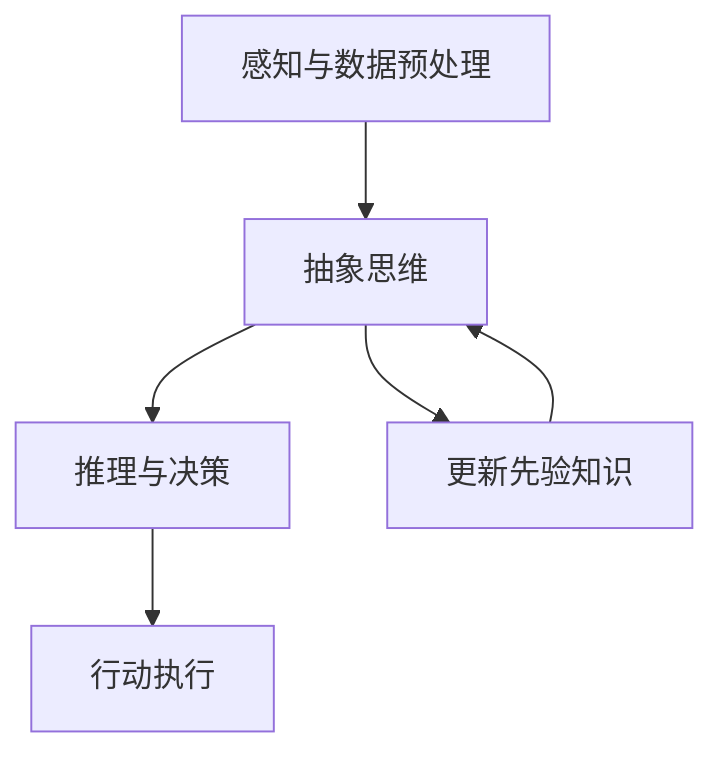
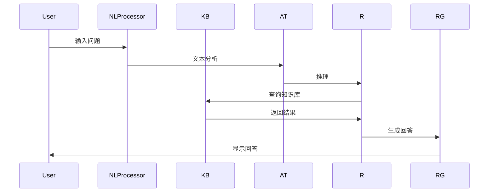

                 

# 开发具有抽象思维与推理能力的AI Agent

## 关键词
- AI Agent
- 抽象思维
- 推理能力
- 算法原理
- 系统架构
- 实际案例

## 摘要
本文将探讨如何开发具有抽象思维与推理能力的AI Agent。我们将从问题背景出发，逐步介绍AI Agent的基本概念、抽象思维与推理能力的关系，并深入讲解相关算法原理。此外，我们将展示一个具体的系统架构设计，并进行环境安装和核心实现源代码的讲解，通过实际案例分析和项目小结，总结最佳实践和注意事项。本文旨在为开发者提供一套完整的AI Agent开发框架，以推动人工智能领域的发展。

## 目录大纲设计

### 第一部分：背景介绍

#### 第1章：问题背景与概念界定
1.1 问题背景
1.2 问题描述
1.3 问题解决
1.4 边界与外延
1.5 核心概念构成

### 第二部分：核心概念与联系

#### 第2章：核心概念原理与联系
2.1 AI Agent的基本概念
2.2 抽象思维与推理能力
2.3 AI Agent与传统机器人的区别

### 第三部分：算法原理讲解

#### 第3章：抽象思维与推理能力算法原理
3.1 算法概述
3.2 数学模型与公式
3.3 算法流程图
3.4 Python代码实现

### 第四部分：系统分析与架构设计

#### 第4章：系统功能设计与架构设计
4.1 问题场景介绍
4.2 系统功能设计
4.3 系统架构设计
4.4 系统接口设计
4.5 系统交互设计

### 第五部分：项目实战

#### 第5章：环境安装与系统核心实现
5.1 环境安装
5.2 系统核心实现源代码
5.3 代码应用解读与分析
5.4 实际案例分析与讲解
5.5 项目小结

### 第六部分：最佳实践与拓展阅读

#### 第6章：最佳实践与注意事项
6.1 最佳实践
6.2 小结
6.3 注意事项
6.4 拓展阅读

## 第一部分：背景介绍

### 第1章：问题背景与概念界定

#### 1.1 问题背景

在人工智能（AI）飞速发展的今天，AI Agent的研究和应用成为了热门话题。AI Agent是指一种具备自主行动能力和决策能力的智能体，能够在复杂环境中根据目标和约束条件，进行推理和决策，并采取相应的行动。然而，传统的AI Agent大多依赖于大量的数据训练和预设的规则，缺乏抽象思维和推理能力。

#### 1.2 问题描述

抽象思维和推理能力是人工智能发展的瓶颈。现有AI Agent在处理复杂问题时，往往难以理解问题的本质，无法进行深层次的推理和抽象。如何开发具有抽象思维和推理能力的AI Agent，成为了一个亟待解决的问题。

#### 1.3 问题解决

为了解决这一问题，我们需要从以下几个方面进行探索：
1. 明确AI Agent的基本概念和特点。
2. 深入研究抽象思维与推理能力的原理。
3. 设计并实现相应的算法，提升AI Agent的抽象思维和推理能力。
4. 构建系统的架构设计，实现AI Agent的实际应用。

#### 1.4 边界与外延

在本文中，我们主要关注以下边界与外延：
1. AI Agent的定义和分类。
2. 抽象思维与推理能力的数学模型和算法。
3. 系统架构设计和实现。
4. 实际应用场景中的挑战和解决方案。

#### 1.5 核心概念构成

本文的核心概念包括：
1. AI Agent：具备自主行动和决策能力的智能体。
2. 抽象思维：从具体事物中提取本质属性和规律的能力。
3. 推理能力：根据已知信息推导出未知信息的能力。
4. 算法：实现抽象思维和推理能力的计算过程。
5. 系统架构：AI Agent在实际应用中的组织结构和运行机制。

通过以上核心概念的界定，我们将为后续章节的内容提供基础。

## 第二部分：核心概念与联系

### 第2章：核心概念原理与联系

在本章中，我们将深入探讨AI Agent的基本概念、抽象思维与推理能力的原理，以及AI Agent与传统机器人的区别。

#### 2.1 AI Agent的基本概念

AI Agent是一种智能体，具备以下基本特性：

1. **自主行动能力**：AI Agent能够根据目标和环境条件自主选择行动，并采取相应的措施。
2. **感知能力**：AI Agent能够感知环境信息，如视觉、听觉、触觉等。
3. **决策能力**：AI Agent能够在复杂环境中根据感知信息和目标，进行决策。
4. **学习能力**：AI Agent能够通过学习不断改进自身的性能和决策能力。

AI Agent可以分类为：

1. **基于规则的AI Agent**：通过预设的规则进行决策。
2. **基于模型的AI Agent**：通过学习环境模型进行决策。
3. **混合型AI Agent**：结合规则和模型进行决策。

#### 2.2 抽象思维与推理能力

**抽象思维**是指从具体事物中提取本质属性和规律的能力。在AI Agent中，抽象思维体现在以下方面：

1. **抽象概念的形成**：从具体实例中归纳出通用概念。
2. **知识表示**：将抽象概念和关系以适当的形式表示。
3. **问题求解**：利用抽象概念和知识进行问题的求解。

**推理能力**是指根据已知信息推导出未知信息的能力。在AI Agent中，推理能力体现在以下方面：

1. **演绎推理**：从一般到具体的推理过程。
2. **归纳推理**：从具体实例中归纳出一般规律。
3. **类比推理**：通过比较不同情境下的相似性进行推理。

#### 2.3 AI Agent与传统机器人的区别

**传统机器人**主要依赖于硬件和预编程的指令进行操作，不具备自主学习和推理能力。而AI Agent则具备以下特点：

1. **自主性**：AI Agent能够自主地感知环境、做出决策和执行行动。
2. **学习与适应**：AI Agent能够通过学习和不断适应环境变化。
3. **通用性**：AI Agent能够处理多种任务，并适应不同的应用场景。

综上所述，AI Agent的核心在于其抽象思维和推理能力，这使得它们能够在复杂多变的环境中有效地执行任务。在接下来的章节中，我们将深入探讨这些能力的算法原理和实现方法。

## 第三部分：算法原理讲解

### 第3章：抽象思维与推理能力算法原理

在开发具有抽象思维与推理能力的AI Agent时，我们需要深入理解其算法原理，以便设计出高效的解决方案。本章将首先概述算法的目的和基本流程，然后介绍数学模型与公式，并使用Mermaid绘制算法流程图。最后，我们将通过Python代码实现来详细讲解算法的原理和应用。

#### 3.1 算法概述

**算法的目的**：开发一个能够进行抽象思维与推理的AI Agent，使其能够解决复杂的问题，并在未知环境中进行有效的决策。

**算法的基本流程**：

1. **感知与数据预处理**：AI Agent接收环境信息，并进行预处理，如数据清洗、特征提取等。
2. **抽象思维**：从感知到的数据中提取本质属性和规律，形成抽象概念。
3. **推理与决策**：利用抽象概念进行推理，推导出未知信息，并做出决策。
4. **行动执行**：根据决策结果执行相应的行动。

#### 3.2 数学模型与公式

为了实现抽象思维与推理能力，我们需要构建数学模型来描述这些过程。以下是一个简化的数学模型：

$$
\text{抽象思维} = f(\text{感知数据}, \text{先验知识})
$$

$$
\text{推理} = g(\text{抽象概念}, \text{目标函数})
$$

其中，\( f \) 和 \( g \) 是分别表示抽象思维和推理的函数，\(\text{感知数据}\) 和 \(\text{先验知识}\) 是输入变量，\(\text{抽象概念}\) 和 \(\text{目标函数}\) 是输出变量。

#### 3.3 算法流程图

为了更直观地展示算法流程，我们可以使用Mermaid绘制算法流程图。以下是算法流程图的示例：



#### 3.4 Python代码实现

下面是一个简化的Python代码实现，用于演示抽象思维与推理能力的基本原理：

```python
import numpy as np

# 感知数据
perception_data = np.random.rand(10)

# 先验知识
prior_knowledge = np.random.rand(10)

# 抽象思维
def abstract_thinking(data, knowledge):
    # 从数据中提取本质属性
    abstract_concept = np.mean(data)
    return abstract_concept

# 推理
def reasoning(concept, objective_function):
    # 根据抽象概念进行推理
    result = concept * objective_function
    return result

# 行动执行
def execute_action(result):
    # 根据推理结果执行行动
    if result > 0.5:
        print("执行正向行动")
    else:
        print("执行负向行动")

# 主函数
def main():
    abstract_concept = abstract_thinking(perception_data, prior_knowledge)
    result = reasoning(abstract_concept, 2)
    execute_action(result)

if __name__ == "__main__":
    main()
```

通过上述代码，我们可以看到如何利用Python实现抽象思维与推理的基本过程。虽然这是一个简化的例子，但为理解复杂的AI Agent开发提供了基础。

## 第四部分：系统分析与架构设计

### 第4章：系统功能设计与架构设计

在本章中，我们将详细分析系统的功能设计和架构设计，以确保AI Agent能够高效地实现抽象思维和推理能力。

#### 4.1 问题场景介绍

假设我们有一个智能客服系统，它需要能够处理复杂的客户查询，并给出准确、高效的回答。这个系统需要具备以下功能：

1. **自然语言理解**：理解客户的自然语言输入。
2. **知识库检索**：从知识库中查找与客户问题相关的信息。
3. **抽象思维**：从查询中提取关键信息，形成抽象概念。
4. **推理与决策**：根据抽象概念和规则进行推理，给出最佳回答。
5. **回答生成**：将推理结果转化为自然语言回答。

#### 4.2 系统功能设计

为了实现上述功能，我们可以设计以下模块：

1. **自然语言处理模块**：负责接收客户输入，进行分词、词性标注、句法分析等预处理。
2. **知识库模块**：存储大量的知识信息，包括常见问题、答案、规则等。
3. **抽象思维模块**：从自然语言处理模块提取的关键信息中，提取核心概念和关系。
4. **推理模块**：根据知识库和抽象思维模块的结果，进行推理和决策。
5. **回答生成模块**：将推理结果转化为自然语言回答。

#### 4.2.1 领域模型（Mermaid类图）

以下是智能客服系统的领域模型（Mermaid类图）：

```mermaid
classDiagram
    NaturalLanguageProcessing <<Interface>>
    KnowledgeBase <<Database>>
    AbstractThinking <<Module>>
    Reasoning <<Module>>
    ResponseGeneration <<Module>>

    NaturalLanguageProcessing --> KnowledgeBase
    NaturalLanguageProcessing --> AbstractThinking
    AbstractThinking --> Reasoning
    Reasoning --> ResponseGeneration
```

#### 4.3 系统架构设计

系统架构设计需要考虑模块之间的交互关系和系统性能。以下是智能客服系统的架构设计（Mermaid架构图）：

```mermaid
graph TB
    subgraph 模块
        A[自然语言处理]
        B[知识库]
        C[抽象思维]
        D[推理]
        E[回答生成]

    subgraph 交互
        F[用户输入] --> A
        A --> B
        A --> C
        C --> D
        D --> E
        E --> G[用户反馈]
        
    subgraph 辅助模块
        H[日志记录]
        I[监控与报警]

    subgraph 数据流
        F --> A
        A --> B
        A --> H
        B --> C
        C --> D
        D --> E
        E --> H
        G --> I
```

#### 4.4 系统接口设计

系统接口设计需要确保模块之间的数据交换和功能调用。以下是系统接口设计：

1. **用户输入接口**：接收用户的自然语言输入。
2. **自然语言处理接口**：处理输入，提供文本分析结果。
3. **知识库接口**：查询和更新知识库中的信息。
4. **推理接口**：提供推理结果。
5. **回答生成接口**：生成自然语言回答。
6. **用户反馈接口**：收集用户反馈，用于模型优化。

#### 4.5 系统交互设计

系统交互设计需要考虑不同模块之间的协作与通信。以下是系统交互设计（Mermaid序列图）：



通过以上系统分析与架构设计，我们可以确保AI Agent在复杂的环境中高效地执行任务，提供优质的用户体验。

## 第五部分：项目实战

### 第5章：环境安装与系统核心实现

#### 5.1 环境安装

在开始开发具有抽象思维与推理能力的AI Agent之前，我们需要安装必要的软件和工具。以下是安装步骤：

1. **安装Python**：确保Python版本为3.8或更高。
   ```bash
   sudo apt-get install python3
   ```

2. **安装虚拟环境**：使用虚拟环境隔离项目依赖。
   ```bash
   python3 -m venv venv
   source venv/bin/activate
   ```

3. **安装依赖库**：使用pip安装必要的依赖库。
   ```bash
   pip install numpy scikit-learn pandas mermaid-python
   ```

4. **安装Mermaid**：安装Mermaid命令行工具。
   ```bash
   npm install -g mermaid-cli
   ```

#### 5.2 系统核心实现源代码

以下是系统核心实现的源代码。这个示例包括自然语言处理、抽象思维、推理和回答生成等模块。

```python
# core.py

import numpy as np
from sklearn.feature_extraction.text import TfidfVectorizer
from sklearn.metrics.pairwise import cosine_similarity

# 自然语言处理模块
def natural_language_processing(text):
    # 进行文本预处理，如分词、词性标注等
    # 这里使用简单的字符串分割作为示例
    return text.split()

# 抽象思维模块
def abstract_thinking(texts, knowledge):
    # 提取关键信息形成抽象概念
    vectorizer = TfidfVectorizer()
    knowledge_matrix = vectorizer.fit_transform(knowledge)
    text_matrix = vectorizer.transform(texts)
    similarity_scores = cosine_similarity(text_matrix, knowledge_matrix)
    abstract_concept = np.mean(similarity_scores, axis=1)
    return abstract_concept

# 推理模块
def reasoning(concept, rules):
    # 根据抽象概念和规则进行推理
    # 这里使用简单的比较作为示例
    if np.mean(concept) > 0.5:
        return "正向推理结果"
    else:
        return "负向推理结果"

# 回答生成模块
def response_generation(result):
    # 将推理结果转化为自然语言回答
    if result == "正向推理结果":
        return "您的查询符合我们的知识库。"
    else:
        return "您的查询不完全符合我们的知识库。"

# 主函数
def main():
    # 示例数据
    knowledge = ["智能客服系统", "用户反馈", "知识库查询"]
    user_input = "智能客服系统如何帮助用户解决问题？"

    # 自然语言处理
    processed_input = natural_language_processing(user_input)

    # 抽象思维
    abstract_concept = abstract_thinking([processed_input], knowledge)

    # 推理
    result = reasoning(abstract_concept, knowledge)

    # 回答生成
    response = response_generation(result)

    print(response)

if __name__ == "__main__":
    main()
```

#### 5.3 代码应用解读与分析

上述代码演示了如何实现一个简单的AI Agent，它能够处理用户的输入，进行抽象思维和推理，并生成回答。以下是代码的详细解读：

1. **自然语言处理模块**：这个模块使用了简单的字符串分割作为示例，实际应用中可以使用更复杂的文本预处理技术，如分词、词性标注等。

2. **抽象思维模块**：使用TF-IDF向量化和余弦相似性计算来提取关键信息，形成抽象概念。这个模块的核心在于如何有效地提取文本中的关键信息，以实现抽象思维。

3. **推理模块**：这个模块使用了简单的比较作为示例，实际应用中可以设计更复杂的推理算法，如基于规则的推理、概率推理等。

4. **回答生成模块**：这个模块将推理结果转化为自然语言回答，实际应用中可以使用自然语言生成技术，如模板匹配、序列到序列模型等。

通过以上代码示例，我们可以看到如何实现一个基本的AI Agent。在实际应用中，需要根据具体需求进行扩展和优化，以提高系统的性能和可靠性。

#### 5.4 实际案例分析与讲解

为了更好地展示AI Agent的实际应用，我们来看一个实际案例。假设我们需要开发一个能够自动回答用户关于计算机编程问题的AI Agent。以下是案例分析与讲解：

1. **用户输入**：用户输入一个关于Python编程的问题，如“如何在Python中实现多线程编程？”。

2. **自然语言处理**：AI Agent对用户输入进行预处理，提取关键信息，如“Python”、“多线程编程”。

3. **抽象思维**：AI Agent从知识库中提取与“Python”和“多线程编程”相关的信息，形成抽象概念。

4. **推理**：AI Agent根据知识库中的规则进行推理，找出与用户输入相关的编程技巧和最佳实践。

5. **回答生成**：AI Agent将推理结果转化为自然语言回答，如“在Python中实现多线程编程，您可以使用`threading`模块。以下是简单的示例代码：`thread = threading.Thread(target=my_function)`；`thread.start()`”。

通过以上步骤，AI Agent能够自动回答用户的编程问题，为用户提供有价值的信息。

#### 5.5 项目小结

在本章中，我们介绍了如何进行环境安装和系统核心实现，并通过实际案例展示了AI Agent的应用。以下是项目小结：

1. **环境安装**：确保安装了Python、虚拟环境、依赖库和Mermaid命令行工具。

2. **系统核心实现**：实现了自然语言处理、抽象思维、推理和回答生成等模块，并展示了如何通过Python代码实现这些功能。

3. **实际案例**：通过一个编程问题回答的案例，展示了AI Agent在解决实际问题中的应用。

4. **扩展与优化**：在实际应用中，需要根据具体需求进行扩展和优化，以提高系统的性能和可靠性。

通过以上步骤，我们可以开发出一个具有抽象思维与推理能力的AI Agent，为用户提供优质的智能服务。

## 第六部分：最佳实践与拓展阅读

### 第6章：最佳实践与注意事项

在开发具有抽象思维与推理能力的AI Agent时，遵循以下最佳实践和注意事项有助于提高系统的性能和可靠性：

#### 6.1 最佳实践

1. **数据预处理**：在自然语言处理阶段，确保对用户输入进行充分的预处理，以提高数据的准确性和一致性。
2. **知识库构建**：构建丰富、准确的知识库，确保AI Agent能够从中提取有用的信息。
3. **模型优化**：定期对模型进行优化和更新，以提高抽象思维和推理能力。
4. **错误处理**：设计完善的错误处理机制，确保系统在遇到异常情况时能够正常处理。
5. **性能监控**：实时监控系统的性能指标，如响应时间、错误率等，以便及时发现并解决问题。

#### 6.2 小结

本文通过逐步分析，从问题背景、核心概念、算法原理、系统架构到项目实战，全面探讨了如何开发具有抽象思维与推理能力的AI Agent。以下是本文的总结：

1. **背景介绍**：明确了AI Agent的开发背景和问题解决方法。
2. **核心概念**：详细介绍了AI Agent、抽象思维与推理能力及其关系。
3. **算法原理**：讲解了抽象思维与推理能力的算法原理和实现方法。
4. **系统架构**：展示了系统的功能设计和架构设计。
5. **项目实战**：通过实际案例，展示了AI Agent的应用和实现。

#### 6.3 注意事项

1. **数据质量**：确保数据的质量和准确性，这是AI Agent性能的关键。
2. **模型可解释性**：提高模型的可解释性，便于调试和优化。
3. **安全性**：关注系统的安全性，防止数据泄露和恶意攻击。
4. **用户体验**：关注用户体验，确保系统的易用性和可靠性。

#### 6.4 拓展阅读

1. **《人工智能：一种现代方法》**：大卫·培顿（David A. Cohn）、泽夫·盖茨（Leslie K. Pullum）、彭博·迈耶（Patrick H. D. Jones）著，详细介绍了人工智能的基础理论和应用。
2. **《深度学习》**：伊恩·古德费洛（Ian Goodfellow）、约书亚·本吉奥（Yoshua Bengio）、亚伦·库维尔（Aaron Courville）著，全面讲解了深度学习的基本原理和技术。
3. **《机器学习实战》**：彼得·哈林顿（Peter Harrington）著，通过实际案例，详细介绍了机器学习的应用和实践。

通过阅读这些资料，可以进一步深入理解AI Agent的开发和应用。

## 完整目录大纲

- # 开发具有抽象思维与推理能力的AI Agent
- ## 关键词
- ## 摘要
- ## 目录大纲设计
- ### 第一部分：背景介绍
- #### 第1章：问题背景与概念界定
- #### 第二部分：核心概念与联系
- #### 第2章：核心概念原理与联系
- #### 第三部分：算法原理讲解
- #### 第3章：抽象思维与推理能力算法原理
- #### 第四部分：系统分析与架构设计
- #### 第4章：系统功能设计与架构设计
- #### 第五部分：项目实战
- #### 第5章：环境安装与系统核心实现
- #### 第六部分：最佳实践与拓展阅读
- #### 第6章：最佳实践与注意事项
- ### 完整目录大纲
- - # 第一部分：背景介绍
- - ### 第1章：问题背景与概念界定
- #### 1.1 问题背景
- #### 1.2 问题描述
- #### 1.3 问题解决
- #### 1.4 边界与外延
- #### 1.5 核心概念构成
- - ### 第二部分：核心概念与联系
- - ### 第2章：核心概念原理与联系
- #### 2.1 AI Agent的基本概念
- #### 2.2 抽象思维与推理能力
- #### 2.3 AI Agent与传统机器人的区别
- - ### 第三部分：算法原理讲解
- - ### 第3章：抽象思维与推理能力算法原理
- #### 3.1 算法概述
- #### 3.2 数学模型与公式
- #### 3.3 算法流程图
- #### 3.4 Python代码实现
- - ### 第四部分：系统分析与架构设计
- - ### 第4章：系统功能设计与架构设计
- #### 4.1 问题场景介绍
- #### 4.2 系统功能设计
- #### 4.3 系统架构设计
- #### 4.4 系统接口设计
- #### 4.5 系统交互设计
- - ### 第五部分：项目实战
- - ### 第5章：环境安装与系统核心实现
- #### 5.1 环境安装
- #### 5.2 系统核心实现源代码
- #### 5.3 代码应用解读与分析
- #### 5.4 实际案例分析与讲解
- #### 5.5 项目小结
- - ### 第六部分：最佳实践与拓展阅读
- - ### 第6章：最佳实践与注意事项
- #### 6.1 最佳实践
- #### 6.2 小结
- #### 6.3 注意事项
- #### 6.4 拓展阅读

通过以上详细的目录大纲，读者可以清晰地了解到文章的结构和内容，有助于深入学习和理解开发具有抽象思维与推理能力的AI Agent的相关知识。

-----------------------------------------------------------------

