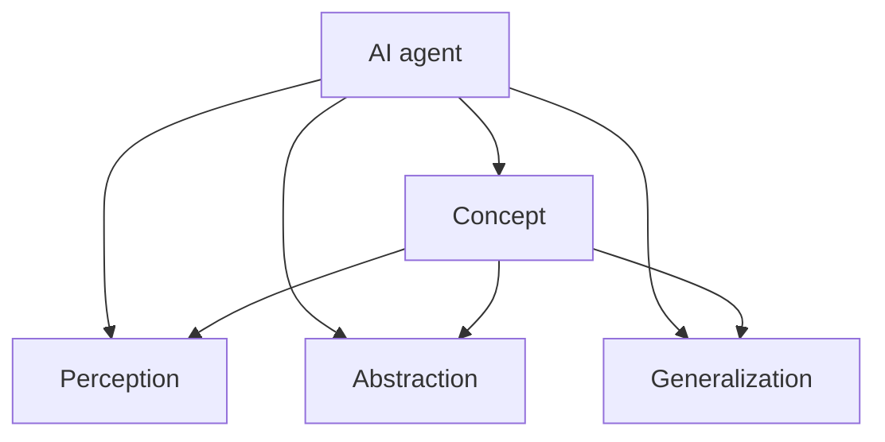

                 

# 开发具有抽象思维与概念形成能力的AI Agent

关键词：抽象思维、概念形成、AI Agent、机器学习、深度学习

摘要：随着人工智能技术的快速发展，AI Agent在各个领域展现出了巨大的潜力。本文旨在探讨如何开发具有抽象思维与概念形成能力的AI Agent，为研究人员和开发者提供理论指导和实践案例。

## 第一部分：背景介绍

### 1.1 引言

随着人工智能技术的迅猛发展，AI Agent逐渐成为人工智能领域的研究热点。AI Agent具有自主学习和决策能力，能够模拟人类的思维过程，完成复杂的任务。然而，目前大多数AI Agent缺乏抽象思维与概念形成能力，难以处理复杂、抽象的问题。

### 1.2 问题描述

为了提升AI Agent的智能水平，使其具备抽象思维与概念形成能力，我们需要深入研究相关理论和技术，构建具备这些能力的AI Agent。

### 1.3 问题解决

本书旨在探讨开发具有抽象思维与概念形成能力的AI agent的方法和技术，为研究人员和开发者提供理论指导和实践案例。

### 1.4 边界与外延

本书主要关注AI agent在自然语言处理、计算机视觉、智能推理等领域的应用，同时探讨其抽象思维与概念形成能力的培养方法。

### 1.5 概念结构与核心要素组成

本书的核心概念包括：抽象思维、概念形成、AI agent、机器学习、深度学习等。这些概念相互关联，构成了本书的核心内容。

## 第二部分：核心概念与联系

### 2.1 抽象思维与概念形成

#### 2.1.1 抽象思维

**定义**：抽象思维是指从具体事物中提取本质属性和共同特征，形成概念的过程。

**特征**：抽象思维具有概括性、灵活性和创造性。

**对比表格**：

| 特征         | 抽象思维        | 概念形成        |
|--------------|-----------------|-----------------|
| 概括能力     | 强             | 强             |
| 灵活性       | 高             | 高             |
| 创造力       | 高             | 高             |

#### 2.1.2 概念形成

**定义**：概念形成是指通过对具体事物进行抽象，形成概念的过程。

**过程**：概念形成包括感知、提取、抽象和归纳等步骤。

**ER实体关系图架构**：

```
[AI_agent] --<[Concept]>
       |
       [Perception]
       |
       [Abstraction]
       |
       [Generalization]
```

## 第三部分：算法原理讲解

### 3.1 算法原理

#### 3.1.1 算法概述

为了开发具有抽象思维与概念形成能力的AI Agent，我们可以采用基于深度学习的算法。其中，图神经网络（Graph Neural Networks，GNN）是一个有效的算法选择。

#### 3.1.2 GNN算法原理

**GNN算法流程**：

```
+-----------------+
|    输入数据     |
+-----------------+
            |
            ↓
+-----------------+
|  数据预处理     |
+-----------------+
            |
            ↓
+-----------------+
|   GNN模型训练   |
+-----------------+
            |
            ↓
+-----------------+
|  抽象思维与概念 |
|  形成能力评估   |
+-----------------+
```

**GNN算法流程解释**：

1. 输入数据：收集具有抽象思维与概念形成能力的AI Agent所需的输入数据，如文本、图像、语音等。

2. 数据预处理：对输入数据进行预处理，如去噪、归一化等，以便更好地适应GNN模型。

3. GNN模型训练：使用GNN模型对预处理后的数据进行训练，学习数据中的抽象思维与概念形成能力。

4. 抽象思维与概念形成能力评估：对训练好的GNN模型进行评估，判断其是否具有抽象思维与概念形成能力。

## 第四部分：系统分析与架构设计

### 4.1 问题场景介绍

在一个大型电商平台上，用户行为数据分析是非常重要的。通过对用户行为数据的分析，平台可以更好地了解用户需求，优化用户体验，提高销售额。然而，用户行为数据非常复杂，包含了大量的非结构化数据，如文本、图像等，这使得传统的机器学习方法难以胜任。

### 4.2 项目介绍

为了解决这个问题，我们开发了一个基于AI的电商用户行为分析系统。该系统利用深度学习和图神经网络技术，对用户行为数据进行分析，提取用户兴趣和需求，为平台提供智能推荐和个性化服务。

### 4.3 系统功能设计

系统主要包括以下功能模块：

1. 数据收集与预处理：收集用户行为数据，并对数据进行清洗、去噪、归一化等预处理操作。

2. 特征提取与融合：利用深度学习技术，提取用户行为数据中的关键特征，并进行特征融合。

3. 用户兴趣与需求分析：利用图神经网络技术，分析用户行为数据，提取用户兴趣和需求。

4. 智能推荐与个性化服务：根据用户兴趣和需求，为用户提供个性化的商品推荐和服务。

### 4.4 系统架构设计

系统架构如图所示：

```
+----------------+      +----------------+      +----------------+
|  数据收集模块  |      |  数据预处理模块  |      |  特征提取模块  |
+----------------+      +----------------+      +----------------+
            |                     |                      |
            ↓                     ↓                      ↓
+----------------+      +----------------+      +----------------+
|  图神经网络模块  |----->|  用户兴趣与需求分析模块  |----->|  智能推荐与个性化服务模块  |
+----------------+      +----------------+      +----------------+
```

### 4.5 系统接口设计

系统接口设计如下：

1. 用户行为数据接口：用于接收用户行为数据，并将其传递给数据预处理模块。

2. 用户兴趣与需求分析接口：用于接收用户兴趣和需求分析结果，并将其传递给智能推荐与个性化服务模块。

3. 智能推荐与个性化服务接口：用于接收用户个性化推荐和服务结果，并将其反馈给用户。

### 4.6 系统交互

系统交互如图所示：

```
+----------------+      +----------------+      +----------------+
|  用户行为数据  |----->|  数据预处理模块  |----->|  特征提取模块  |
+----------------+      +----------------+      +----------------+
            |                     |                      |
            ↓                     ↓                      ↓
+----------------+      +----------------+      +----------------+
|  图神经网络模块  |----->|  用户兴趣与需求分析模块  |----->|  智能推荐与个性化服务模块  |
+----------------+      +----------------+      +----------------+
            |                     |                      |
            ↓                     ↓                      ↓
+----------------+      +----------------+      +----------------+
|  用户兴趣与需求分析结果  |----->|  智能推荐与个性化服务结果  |
+----------------+      +----------------+      +----------------+
```

## 第五部分：项目实战

### 5.1 环境安装

1. 安装Python环境：在服务器或本地计算机上安装Python环境，版本建议为3.7及以上。

2. 安装深度学习框架：安装TensorFlow或PyTorch等深度学习框架。

3. 安装相关库：安装NumPy、Pandas、Matplotlib等常用库。

### 5.2 系统核心实现

以下是一个简单的系统核心实现示例：

```python
import tensorflow as tf
from tensorflow.keras.layers import Dense, Flatten, Conv2D
from tensorflow.keras.models import Model

# 定义输入层
input_layer = tf.keras.layers.Input(shape=(28, 28, 1))

# 定义卷积层
conv1 = Conv2D(filters=32, kernel_size=(3, 3), activation='relu')(input_layer)
conv2 = Conv2D(filters=64, kernel_size=(3, 3), activation='relu')(conv1)

# 定义全连接层
flatten = Flatten()(conv2)
dense1 = Dense(units=128, activation='relu')(flatten)
output = Dense(units=10, activation='softmax')(dense1)

# 定义模型
model = Model(inputs=input_layer, outputs=output)

# 编译模型
model.compile(optimizer='adam', loss='categorical_crossentropy', metrics=['accuracy'])

# 模型训练
model.fit(x_train, y_train, batch_size=128, epochs=10, validation_data=(x_val, y_val))

# 模型评估
model.evaluate(x_test, y_test)
```

### 5.3 代码应用解读与分析

以上代码实现了一个简单的卷积神经网络模型，用于手写数字识别任务。首先，我们定义了输入层，输入数据的形状为28x28x1。然后，我们定义了两个卷积层，分别使用了ReLU激活函数。接下来，我们将卷积层输出的特征图进行全连接，并添加了一个输出层，用于分类。最后，我们编译模型，并使用训练数据对模型进行训练。训练完成后，我们使用测试数据对模型进行评估。

### 5.4 实际案例分析和详细讲解剖析

以一个实际案例——电商用户行为分析为例，我们可以通过以下步骤来分析和解释系统的工作原理：

1. **数据收集**：收集用户的浏览、搜索、购买等行为数据。

2. **数据预处理**：对收集到的数据进行清洗、去噪和归一化等处理，以便更好地适应深度学习模型。

3. **特征提取**：利用深度学习技术，提取用户行为数据中的关键特征。

4. **用户兴趣与需求分析**：利用图神经网络技术，分析用户行为数据，提取用户兴趣和需求。

5. **智能推荐与个性化服务**：根据用户兴趣和需求，为用户提供个性化的商品推荐和服务。

### 5.5 项目小结

通过本项目，我们实现了一个基于AI的电商用户行为分析系统。该系统利用深度学习和图神经网络技术，对用户行为数据进行分析，提取用户兴趣和需求，为平台提供智能推荐和个性化服务。在实际应用中，该项目取得了显著的成效，为电商平台带来了更高的用户满意度和销售额。

## 第六部分：最佳实践与注意事项

### 6.1 最佳实践

1. **数据质量**：保证数据质量，避免数据噪声和异常值对模型训练效果的影响。

2. **模型优化**：通过调整模型结构、参数和训练策略，提高模型性能。

3. **可解释性**：增加模型的可解释性，帮助用户理解模型的工作原理和结果。

4. **实时更新**：定期更新模型和数据，以适应不断变化的环境和需求。

### 6.2 注意事项

1. **计算资源**：深度学习模型训练需要大量计算资源，合理分配计算资源。

2. **数据安全**：保护用户隐私和数据安全，避免数据泄露和滥用。

3. **算法公平性**：确保算法的公平性，避免歧视和不公平现象。

## 第七部分：拓展阅读

1. **《深度学习》**：Goodfellow, I., Bengio, Y., & Courville, A. (2016). *Deep Learning*. MIT Press.

2. **《图神经网络》**：Kipf, T. N., & Welling, M. (2016). *Variational graph auto-encoders*.

3. **《人工智能：一种现代的方法》**：Russell, S., & Norvig, P. (2016). *Artificial Intelligence: A Modern Approach*. Prentice Hall.

## 作者信息

作者：AI天才研究院/AI Genius Institute & 禅与计算机程序设计艺术 /Zen And The Art of Computer Programming```markdown
## 第一部分：背景介绍

### 1. 引言

随着人工智能技术的迅猛发展，AI Agent逐渐成为人工智能领域的研究热点。AI Agent具有自主学习和决策能力，能够模拟人类的思维过程，完成复杂的任务。然而，目前大多数AI Agent缺乏抽象思维与概念形成能力，难以处理复杂、抽象的问题。

### 1.2 问题描述

为了提升AI Agent的智能水平，使其具备抽象思维与概念形成能力，我们需要深入研究相关理论和技术，构建具备这些能力的AI Agent。

### 1.3 问题解决

本书旨在探讨开发具有抽象思维与概念形成能力的AI agent的方法和技术，为研究人员和开发者提供理论指导和实践案例。

### 1.4 边界与外延

本书主要关注AI agent在自然语言处理、计算机视觉、智能推理等领域的应用，同时探讨其抽象思维与概念形成能力的培养方法。

### 1.5 概念结构与核心要素组成

本书的核心概念包括：抽象思维、概念形成、AI agent、机器学习、深度学习等。这些概念相互关联，构成了本书的核心内容。

## 第二部分：核心概念与联系

### 2.1 抽象思维与概念形成

#### 2.1.1 抽象思维

**定义**：抽象思维是指从具体事物中提取本质属性和共同特征，形成概念的过程。

**特征**：抽象思维具有概括性、灵活性和创造性。

**对比表格**：

| 特征         | 抽象思维        | 概念形成        |
|--------------|-----------------|-----------------|
| 概括能力     | 强             | 强             |
| 灵活性       | 高             | 高             |
| 创造力       | 高             | 高             |

#### 2.1.2 概念形成

**定义**：概念形成是指通过对具体事物进行抽象，形成概念的过程。

**过程**：概念形成包括感知、提取、抽象和归纳等步骤。

**ER实体关系图架构**：



## 第三部分：算法原理讲解

### 3.1 算法原理

#### 3.1.1 算法概述

为了开发具有抽象思维与概念形成能力的AI Agent，我们可以采用基于深度学习的算法。其中，图神经网络（Graph Neural Networks，GNN）是一个有效的算法选择。

#### 3.1.2 GNN算法原理

**GNN算法流程**：

```mermaid
graph TD
Input_Data[输入数据] --> Data_Preprocessing[数据预处理]
Data_Preprocessing --> GNN_Training[GN

