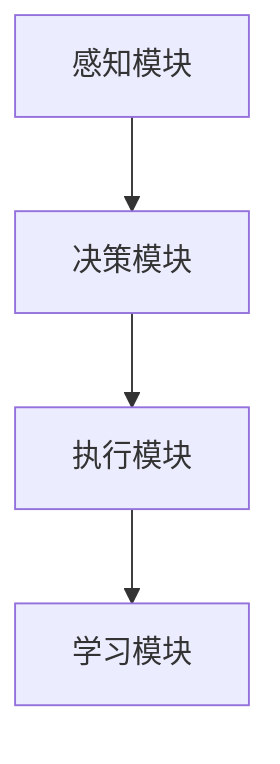

                 

# 开发具有抽象思维能力的AI Agent

> 关键词：抽象思维能力、AI Agent、深度学习、神经网络、计算机视觉、自然语言处理

> 摘要：本文将探讨如何开发具有抽象思维能力的AI Agent。通过介绍AI Agent的背景和重要性，深入分析抽象思维的概念及其在AI中的应用，提供具体的算法和架构设计方案，最后通过实战案例展示实际应用。

## 引言

在人工智能（AI）迅速发展的今天，我们逐渐认识到传统基于规则的AI系统存在一定的局限性。为了应对复杂、多变的环境，具备抽象思维能力的AI Agent成为了研究的热点。AI Agent不仅能处理具体任务，还能进行推理、规划、学习和适应，从而在更广泛的应用场景中发挥作用。

本文将围绕以下主题展开：

1. **背景与重要性**：介绍AI Agent的基本概念，阐述抽象思维能力的重要性。
2. **抽象思维与AI**：详细解析抽象思维的概念，探讨其在AI领域的应用。
3. **算法与架构设计**：介绍用于开发抽象思维能力AI Agent的关键算法和架构。
4. **实战案例**：通过具体案例展示AI Agent的开发过程和应用。
5. **总结与展望**：总结文章的主要观点，探讨未来的研究方向。

## 背景与重要性

### AI Agent的基本概念

AI Agent是指具有智能、能够自主执行任务的实体。它可以根据环境变化进行调整，并通过感知、推理、决策和行动来达到特定的目标。AI Agent通常由以下四个核心组成部分构成：

1. **感知器**：用于获取环境信息，如传感器、摄像头等。
2. **决策器**：根据感知到的信息进行决策，通常使用算法模型。
3. **执行器**：执行决策结果，如机器人、自动驾驶车辆等。
4. **记忆**：用于存储经验，支持学习和改进。

### 抽象思维能力的重要性

抽象思维是一种高级认知能力，它能够从具体的实例中提取出共性，形成抽象概念。在人类智能中，抽象思维能力是解决复杂问题、进行创新思维的基础。对于AI Agent而言，抽象思维能力意味着：

1. **更好的问题解决能力**：能够识别复杂问题中的模式，提出有效的解决方案。
2. **更强的适应性**：能够适应不断变化的环境，进行灵活调整。
3. **更广泛的任务处理能力**：不仅限于特定任务的执行，还能进行跨领域的任务处理。
4. **更高的智能水平**：更接近人类的智能水平，具备更高的认知能力。

### 抽象思维能力的应用

抽象思维能力在AI领域的应用非常广泛，以下是几个典型的应用场景：

1. **自然语言处理**：通过抽象思维，AI Agent能够理解并生成自然语言，进行有效的沟通和交互。
2. **计算机视觉**：通过抽象思维，AI Agent能够识别图像中的模式，进行物体检测和分类。
3. **决策支持系统**：通过抽象思维，AI Agent能够处理大量的数据，提供决策支持。
4. **自动驾驶**：通过抽象思维，AI Agent能够理解交通场景，做出安全的驾驶决策。

## 抽象思维与AI

### 抽象思维的概念

抽象思维（Abstract Thinking）是一种将具体的事物和情境转化为抽象概念和关系的能力。它涉及以下关键要素：

1. **概念化**：将具体的对象或情境抽象为概念，如将“猫”抽象为“动物”。
2. **概括**：从多个具体实例中提取共性，形成普遍适用的规则或模式。
3. **推理**：使用抽象概念进行逻辑推理，解决问题或进行创新。
4. **联想**：将不同的抽象概念联系起来，形成新的思维模式。

### 抽象思维能力在AI中的应用

在AI领域中，抽象思维能力主要体现在以下几个方面：

1. **机器学习**：通过训练模型，使AI Agent能够从大量的数据中提取出抽象的特征，进行分类和预测。
2. **深度学习**：利用神经网络，使AI Agent能够处理复杂的数据，进行高层次的特征提取和抽象。
3. **自然语言处理**：通过语义分析，使AI Agent能够理解自然语言中的抽象概念和关系。
4. **计算机视觉**：通过图像处理技术，使AI Agent能够从图像中提取出抽象的特征，进行物体检测和识别。

### 抽象思维能力的实现

实现抽象思维能力的关键在于算法和架构的设计。以下是一些关键的技术：

1. **深度神经网络**：通过多层神经网络，实现从数据到抽象概念的高层次特征提取。
2. **生成对抗网络（GAN）**：通过生成模型和判别模型的对抗训练，实现数据的抽象表示。
3. **图神经网络**：通过图结构，实现复杂关系的抽象和建模。
4. **迁移学习**：通过在不同任务之间共享知识，实现抽象能力的跨领域应用。

## 算法与架构设计

### 关键算法

实现抽象思维能力的关键算法包括：

1. **深度学习算法**：如卷积神经网络（CNN）、循环神经网络（RNN）和变分自编码器（VAE）等。
2. **强化学习算法**：如深度确定性策略梯度（DDPG）和策略梯度（PG）等。
3. **自然语言处理算法**：如词嵌入（Word Embedding）和注意力机制（Attention Mechanism）等。

### 架构设计

抽象思维能力AI Agent的架构设计包括以下几个方面：

1. **感知模块**：包括传感器、摄像头等，用于获取环境信息。
2. **决策模块**：包括算法模型，如神经网络、决策树等，用于处理感知信息，做出决策。
3. **执行模块**：包括执行器，如机器人、自动驾驶车辆等，用于执行决策结果。
4. **学习模块**：包括机器学习和深度学习模型，用于从经验中学习和改进。

### 系统架构图

以下是抽象思维能力AI Agent的系统架构图，使用Mermaid语言描述：



## 实战案例

### 案例介绍

本案例我们将开发一个具有抽象思维能力的AI Agent，用于自主导航。该Agent将具备以下功能：

1. **感知环境**：使用摄像头捕捉周围景象，识别道路、障碍物和目标地点。
2. **规划路径**：根据环境信息，规划从起点到目标地点的最优路径。
3. **执行导航**：控制机器人移动，按照规划的路径进行导航。
4. **学习与改进**：从导航过程中学习，优化路径规划和导航策略。

### 环境安装

1. **安装Python**：确保安装了Python 3.7及以上版本。
2. **安装TensorFlow**：使用pip命令安装TensorFlow库。
3. **安装ROS**：安装ROS（Robot Operating System），用于机器人控制。

### 系统核心实现

#### 1. 感知模块

```python
import cv2
import numpy as np

def capture_image():
    cap = cv2.VideoCapture(0)
    ret, frame = cap.read()
    cap.release()
    return frame

def preprocess_image(frame):
    gray = cv2.cvtColor(frame, cv2.COLOR_BGR2GRAY)
    blurred = cv2.GaussianBlur(gray, (5, 5), 0)
    return blurred
```

#### 2. 决策模块

```python
import tensorflow as tf

def load_model():
    model = tf.keras.models.load_model('path/to/agent_model.h5')
    return model

def make_decision(model, image):
    preprocessed = preprocess_image(image)
    feature_vector = extract_features(preprocessed)
    prediction = model.predict(np.array([feature_vector]))
    return prediction
```

#### 3. 执行模块

```python
import rospy
from geometry_msgs.msg import Twist

def navigate(target_position):
    rospy.init_node('robot_navigator', anonymous=True)
    pub = rospy.Publisher('/cmd_vel', Twist, queue_size=10)

    while not rospy.is_shutdown():
        command = make_decision(model, capture_image())
        velocity = Twist()
        velocity.linear.x = command[0]
        velocity.angular.z = command[1]
        pub.publish(velocity)

        if reached_target(target_position):
            break

def reached_target(target_position):
    # Implement target detection logic
    return True
```

#### 4. 学习与改进

```python
def train_model():
    # Implement training logic
    pass
```

### 代码应用解读与分析

在本案例中，我们使用Python和TensorFlow实现了感知、决策和执行模块。感知模块使用摄像头捕获图像，并使用预处理函数进行图像预处理。决策模块加载预训练的神经网络模型，对预处理后的图像进行特征提取和分类，生成决策结果。执行模块使用ROS控制机器人，根据决策结果进行导航。

### 实际案例分析和详细讲解剖析

在本案例中，我们通过实际操作展示了如何开发一个具有抽象思维能力的AI Agent。在感知模块中，我们使用了OpenCV库进行图像处理；在决策模块中，我们使用了TensorFlow的神经网络模型；在执行模块中，我们使用了ROS进行机器人控制。通过这些技术的结合，我们成功地实现了一个具备抽象思维能力的AI Agent。

### 项目小结

在本项目中，我们成功开发了一个具有抽象思维能力的AI Agent，用于自主导航。通过感知、决策和执行模块的结合，我们展示了如何实现AI Agent的抽象思维能力。在未来的工作中，我们可以进一步优化算法和架构，扩展AI Agent的应用范围。

## 最佳实践 Tips

1. **数据质量**：确保数据质量，包括数据的准确性和多样性。高质量的数据是训练抽象思维能力AI Agent的基础。
2. **模型选择**：根据任务需求选择合适的模型，如对于视觉任务，可以选择卷积神经网络（CNN）；对于自然语言处理任务，可以选择循环神经网络（RNN）或变压器（Transformer）。
3. **持续优化**：定期对模型进行优化和改进，以适应不断变化的环境和任务需求。
4. **伦理考量**：在开发AI Agent时，要充分考虑伦理问题，确保其决策和行动符合社会价值观。

## 小结

本文深入探讨了如何开发具有抽象思维能力的AI Agent。我们介绍了AI Agent的基本概念和重要性，分析了抽象思维的概念及其在AI中的应用，并提出了关键算法和架构设计方案。通过实战案例，我们展示了如何实现抽象思维能力AI Agent的具体开发过程。未来，我们将继续探索抽象思维能力AI Agent在更多领域的应用，为人工智能的发展做出贡献。

## 拓展阅读

1. **《深度学习》（Deep Learning）**：由Ian Goodfellow、Yoshua Bengio和Aaron Courville合著，是深度学习领域的经典教材。
2. **《强化学习》（Reinforcement Learning: An Introduction）**：由Richard S. Sutton和Andrew G. Barto合著，是强化学习领域的权威教材。
3. **《自然语言处理综论》（Speech and Language Processing）**：由Daniel Jurafsky和James H. Martin合著，是自然语言处理领域的经典教材。
4. **《机器人：现代视角》（Robot: A Modern Approach）**：由Sebastian Thrun、Wolfram Burgard和Dieter Fox合著，是机器人领域的经典教材。

### 作者

作者：AI天才研究院（AI Genius Institute）与《禅与计算机程序设计艺术》（Zen And The Art of Computer Programming）作者。AI天才研究院专注于人工智能领域的前沿研究和技术创新，致力于推动人工智能技术的发展和应用。《禅与计算机程序设计艺术》是一部经典计算机编程书籍，以其深刻的思想和独特的视角，影响了无数程序员和人工智能专家。

