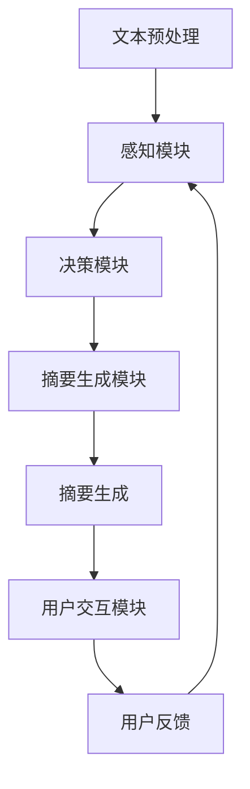
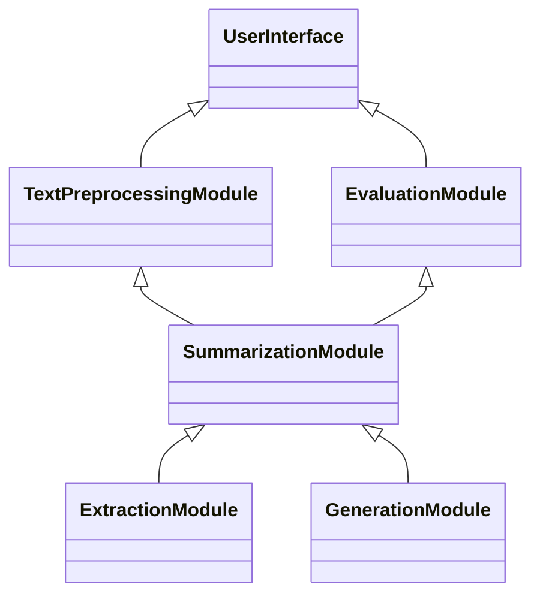
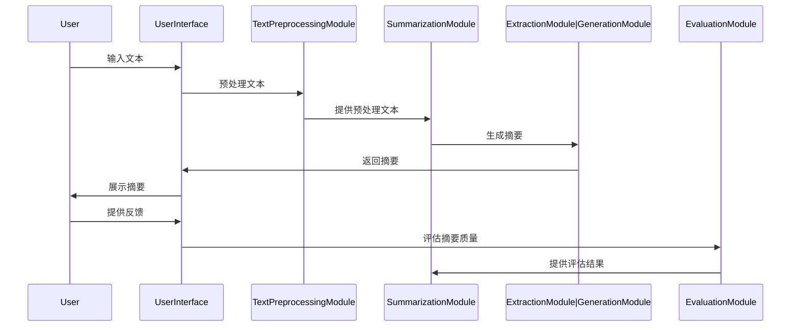

                 

## 开发具有自然语言摘要生成能力的AI Agent

### 文章标题

开发具有自然语言摘要生成能力的AI Agent

### 关键词

自然语言摘要生成，AI Agent，机器学习，文本理解，信息提取

### 摘要

本文深入探讨了开发具有自然语言摘要生成能力的AI Agent的背景、核心概念、算法原理、系统设计、性能评估和未来展望。首先介绍了自然语言摘要生成和AI Agent的基本概念，然后详细讲解了自然语言摘要生成的算法原理和关键步骤，包括文本预处理、关键信息提取和摘要生成。接着，本文介绍了AI Agent与摘要生成的整合，包括AI Agent的基本架构设计和摘要生成模块的集成。随后，本文探讨了摘要生成系统的设计实现，包括需求分析、架构设计和实现细节。最后，本文分析了摘要生成系统的性能评估和优化方法，以及在特定领域的应用案例，并对未来摘要生成技术的发展趋势进行了展望。

----------------------------------------------------------------

### 目录大纲

----------------------------------------------------------------
# 第一部分: 自然语言摘要生成的背景与概念

## 第1章: 自然语言摘要生成概述

### 1.1.1 自然语言摘要的定义

### 1.1.2 摘要生成的应用场景

### 1.1.3 AI Agent的角色与需求

## 第2章: 自然语言处理基础

### 2.1.1 语言模型与文本表示

### 2.1.2 命名实体识别与关系抽取

### 2.1.3 文本分类与主题建模

## 第3章: 摘要生成算法

### 3.1.1 统计方法

### 3.1.2 基于规则的方法

### 3.1.3 基于机器学习的方法

## 第4章: 生成式摘要方法

### 4.1.1 生成式摘要的基础原理

### 4.1.2 生成式摘要的关键技术

### 4.1.3 常见生成式摘要模型

## 第5章: 抽取式摘要方法

### 5.1.1 抽取式摘要的基础原理

### 5.1.2 抽取式摘要的关键技术

### 5.1.3 常见抽取式摘要模型

## 第6章: AI Agent与摘要生成的整合

### 6.1.1 AI Agent概述

### 6.1.2 AI Agent在摘要生成中的应用

### 6.1.3 整合摘要生成能力的AI Agent架构设计

## 第7章: 摘要生成系统设计与实现

### 7.1.1 摘要生成系统的需求分析

### 7.1.2 摘要生成系统的架构设计

### 7.1.3 摘要生成系统的实现细节

## 第8章: 性能评估与优化

### 8.1.1 摘要质量评估指标

### 8.1.2 性能优化方法

### 8.1.3 实际案例分析与优化策略

## 第9章: 摘要生成在特定领域的应用

### 9.1.1 学术摘要生成

### 9.1.2 新闻摘要生成

### 9.1.3 产品描述摘要生成

## 第10章: 未来展望与趋势

### 10.1.1 摘要生成技术的未来发展方向

### 10.1.2 AI Agent与摘要生成的融合趋势

### 10.1.3 潜在挑战与解决方案

----------------------------------------------------------------

## 第一部分: 自然语言摘要生成的背景与概念

### 第1章: 自然语言摘要生成概述

#### 1.1.1 自然语言摘要的定义

自然语言摘要（Natural Language Abstract Generation）是指利用计算机技术和算法，对原始文本内容进行理解和处理，提取出关键信息，并以简洁、连贯、准确的方式呈现给用户。自然语言摘要生成技术旨在实现文本信息的自动化提取和结构化，使读者能够快速了解文本的核心内容，提高信息检索和阅读效率。

#### 1.1.2 摘要生成的应用场景

摘要生成技术在多个领域有着广泛的应用：

1. **信息检索**：通过生成摘要，用户可以在短时间内了解大量文档的主题，提高检索效率。
2. **内容推荐**：摘要生成可以帮助推荐系统为用户推荐相关的文章，提高推荐质量。
3. **文本助手**：摘要生成技术可用于智能助手，帮助用户快速获取关键信息，提升用户体验。
4. **教育领域**：自动生成教学材料的摘要，帮助学生高效学习。
5. **新闻业**：对大量新闻报道进行摘要生成，帮助读者快速了解新闻要点。

#### 1.1.3 AI Agent的角色与需求

AI Agent，即人工智能代理，是指具有自主决策和行动能力的人工智能实体。在摘要生成任务中，AI Agent的角色是：

1. **自动摘要生成**：AI Agent能够自动从大量文本中提取关键信息，生成高质量的摘要。
2. **个性化服务**：根据用户偏好和历史行为，AI Agent可以提供个性化的摘要服务。
3. **实时更新**：AI Agent能够实时更新摘要内容，确保用户获取最新的信息。

### 第2章: 自然语言处理基础

#### 2.1.1 语言模型与文本表示

自然语言处理（Natural Language Processing, NLP）是摘要生成技术的核心。以下是NLP中的一些基础概念：

1. **语言模型**：语言模型是用来描述自然语言概率分布的数学模型，常见的有n-gram模型、神经网络语言模型（如Transformer）。
2. **文本表示**：文本表示是将自然语言文本转化为计算机可以理解和处理的数字表示，常用的方法有词袋模型、词嵌入（如Word2Vec、GloVe）。

#### 2.1.2 命名实体识别与关系抽取

命名实体识别（Named Entity Recognition, NER）是指从文本中识别出具有特定意义的实体，如人名、地点、组织名等。关系抽取（Relationship Extraction）是指识别实体之间的语义关系。

1. **NER**：NER是文本理解的重要步骤，对于摘要生成来说，正确识别实体有助于提取关键信息。
2. **关系抽取**：关系抽取可以帮助理解文本中实体之间的联系，从而更好地生成摘要。

#### 2.1.3 文本分类与主题建模

文本分类（Text Classification）是将文本数据分为不同的类别，主题建模（Topic Modeling）是发现文本中的潜在主题分布。

1. **文本分类**：通过文本分类，可以将大量文本数据归类，为摘要生成提供参考。
2. **主题建模**：主题建模可以帮助理解文本内容，从而生成更加精准的摘要。

### 第3章: 摘要生成算法

摘要生成算法可以分为三类：统计方法、基于规则的方法和基于机器学习的方法。

#### 3.1.1 统计方法

统计方法依赖于文本的统计特性，常见的有：

1. **TF-IDF**：基于词频（TF）和逆文档频率（IDF），计算词语的重要性。
2. **TextRank**：基于图模型，通过文本中的词语共现关系生成摘要。

#### 3.1.2 基于规则的方法

基于规则的方法通过人工定义规则来生成摘要，包括：

1. **关键句子提取**：根据句子的重要性和相关性提取关键句子。
2. **模板匹配**：使用预先定义的模板来生成摘要。

#### 3.1.3 基于机器学习的方法

基于机器学习的方法通过训练模型来自动生成摘要，包括：

1. **生成式模型**：如序列到序列（Seq2Seq）模型，通过生成新的文本摘要。
2. **抽取式模型**：如基于实体和关系的文本摘要生成。

### 第4章: 生成式摘要方法

生成式摘要方法是指通过生成新的文本摘要来代替原始文本，以下是其基础原理和关键技术：

#### 4.1.1 生成式摘要的基础原理

生成式摘要方法的核心思想是学习一个从原始文本到摘要的映射函数，生成摘要通常是一个连贯且结构化的文本。

#### 4.1.2 生成式摘要的关键技术

1. **序列生成模型**：如序列到序列（Seq2Seq）模型、自动回归模型（如BERT）。
2. **强化学习**：通过训练模型来优化摘要的质量。

#### 4.1.3 常见生成式摘要模型

1. **基于Transformer的模型**：如Transformer、BERT、GPT。
2. **生成对抗网络（GAN）**：通过生成器和判别器的对抗训练来生成高质量的摘要。

### 第5章: 抽取式摘要方法

抽取式摘要方法是指从原始文本中抽取关键句子或短语来生成摘要，以下是其基础原理和关键技术：

#### 5.1.1 抽取式摘要的基础原理

抽取式摘要方法的核心思想是识别文本中的关键信息，并将其组合成摘要。

#### 5.1.2 抽取式摘要的关键技术

1. **基于特征的方法**：如基于句子的重要性、实体和关系等特征来提取摘要。
2. **基于图的模型**：如图神经网络（Graph Neural Networks, GNN），通过文本中的词语和句子之间的结构关系来生成摘要。

#### 5.1.3 常见抽取式摘要模型

1. **基于规则的模型**：如基于句子的重要性规则。
2. **基于机器学习的模型**：如文本分类器、实体和关系抽取模型。

### 第6章: AI Agent与摘要生成的整合

AI Agent与摘要生成的整合是指将AI Agent的能力与摘要生成技术相结合，以下是其概述和关键步骤：

#### 6.1.1 AI Agent概述

AI Agent是一种具有自主决策和行动能力的人工智能实体，能够在特定环境和任务中执行复杂的任务。

#### 6.1.2 AI Agent在摘要生成中的应用

AI Agent在摘要生成中的应用包括：

1. **自动摘要生成**：AI Agent能够自动从文本中生成摘要，提高信息检索和阅读效率。
2. **个性化摘要生成**：根据用户偏好和历史行为，AI Agent可以生成个性化的摘要。
3. **实时摘要更新**：AI Agent能够实时更新摘要内容，确保用户获取最新的信息。

#### 6.1.3 整合摘要生成能力的AI Agent架构设计

AI Agent与摘要生成的整合架构设计包括：

1. **文本预处理模块**：对原始文本进行预处理，包括分词、词性标注、实体识别等。
2. **摘要生成模块**：使用生成式或抽取式摘要方法生成摘要。
3. **用户交互模块**：与用户进行交互，收集用户偏好和反馈，优化摘要生成质量。

### 第7章: 摘要生成系统设计与实现

摘要生成系统的设计与实现包括需求分析、架构设计和实现细节，以下是其关键步骤：

#### 7.1.1 摘要生成系统的需求分析

需求分析是系统设计的第一步，包括：

1. **用户需求**：明确用户对摘要生成的需求，如摘要长度、摘要风格等。
2. **文本类型**：确定摘要生成的文本类型，如新闻、学术论文、产品描述等。

#### 7.1.2 摘要生成系统的架构设计

架构设计包括：

1. **系统模块**：定义系统的各个模块，如文本预处理、摘要生成、用户交互等。
2. **数据流**：设计系统中的数据流，确保数据在各个模块之间的流通。
3. **接口设计**：设计系统与外部系统（如数据库、用户接口）的交互接口。

#### 7.1.3 摘要生成系统的实现细节

实现细节包括：

1. **文本预处理**：使用NLP工具和库进行文本预处理，如jieba、NLTK等。
2. **摘要生成**：选择合适的摘要生成算法和模型，如生成式模型或抽取式模型。
3. **用户交互**：设计用户界面和交互逻辑，确保用户能够方便地使用系统。

### 第8章: 性能评估与优化

摘要生成系统的性能评估与优化包括摘要质量评估指标、性能优化方法和实际案例分析，以下是其关键步骤：

#### 8.1.1 摘要质量评估指标

摘要质量评估指标包括：

1. **摘要长度**：确保摘要长度适中，既能概括全文，又不过长。
2. **摘要连贯性**：确保摘要中的句子和段落之间连贯，没有断裂。
3. **摘要准确性**：确保摘要准确地反映了文本的核心内容。

#### 8.1.2 性能优化方法

性能优化方法包括：

1. **算法优化**：通过改进算法和模型，提高摘要生成的质量和效率。
2. **硬件优化**：通过使用更强大的硬件设备，提高系统的处理能力。
3. **数据优化**：通过优化数据预处理和存储，提高系统的响应速度。

#### 8.1.3 实际案例分析与优化策略

实际案例分析与优化策略包括：

1. **案例选择**：选择具有代表性的应用案例，如新闻摘要、学术论文摘要等。
2. **问题定位**：通过数据分析，定位系统中的问题和瓶颈。
3. **优化实施**：根据分析结果，实施相应的优化策略，提高系统性能。

### 第9章: 摘要生成在特定领域的应用

摘要生成在特定领域的应用包括学术摘要生成、新闻摘要生成和产品描述摘要生成，以下是其具体应用：

#### 9.1.1 学术摘要生成

学术摘要生成是将学术论文的主要内容和结论提取出来，生成简短的摘要，以便读者快速了解文章的核心内容。

1. **摘要生成流程**：包括文本预处理、关键信息提取、摘要生成和用户反馈。
2. **挑战与优化**：解决学术文本中专业术语多、句子结构复杂等问题，提高摘要生成的准确性和可读性。

#### 9.1.2 新闻摘要生成

新闻摘要生成是将新闻报道的关键信息提取出来，生成简短的摘要，帮助读者快速了解新闻要点。

1. **摘要生成流程**：包括文本预处理、关键信息提取、摘要生成和用户反馈。
2. **挑战与优化**：解决新闻文本中信息量大、文本结构不固定等问题，提高摘要生成的准确性和连贯性。

#### 9.1.3 产品描述摘要生成

产品描述摘要生成是将产品描述的主要特点和优势提取出来，生成简短的摘要，便于用户快速了解产品信息。

1. **摘要生成流程**：包括文本预处理、关键信息提取、摘要生成和用户反馈。
2. **挑战与优化**：解决产品描述文本中信息不明确、术语不一致等问题，提高摘要生成的准确性和吸引力。

### 第10章: 未来展望与趋势

摘要生成技术的未来发展趋势包括：

1. **深度学习与强化学习结合**：结合深度学习和强化学习，提高摘要生成模型的智能化水平。
2. **多模态摘要生成**：结合文本、图像、音频等多种模态，生成更加丰富和全面的摘要。
3. **个性化摘要生成**：基于用户行为和偏好，生成个性化的摘要，提升用户体验。

1. **挑战与解决方案**：解决摘要生成中的质量问题、效率问题以及数据隐私问题，确保技术的可持续发展和广泛应用。

----------------------------------------------------------------

## 第二部分: 自然语言处理基础

### 第2章: 自然语言处理基础

自然语言处理（Natural Language Processing，NLP）是构建自然语言摘要生成系统的基础。在这一部分，我们将讨论NLP的基础知识，包括语言模型与文本表示、命名实体识别与关系抽取、文本分类与主题建模。

### 2.1.1 语言模型与文本表示

语言模型（Language Model）是NLP的核心组成部分，用于对自然语言进行建模。一个良好的语言模型能够理解文本的语法和语义，从而为后续的文本处理任务提供支持。

#### 语言模型

语言模型的主要任务是估计一个单词序列的概率。在NLP中，常用的语言模型包括：

1. **n-gram模型**：n-gram模型是一种基于词汇序列的模型，它将文本分割成n个单词的序列，并计算每个序列的概率。n-gram模型的优点是计算简单，但存在长句依赖关系捕捉不足的问题。

   ```python
   from nltk import ngrams
   sentences = ["this is a sentence", "this is another sentence"]
   model = ngrams(sentences, 2)
   print(model)
   ```

2. **神经网络语言模型**：神经网络语言模型，如基于Transformer的模型（BERT、GPT等），能够更好地捕捉长句依赖关系。这些模型通过深度神经网络学习文本的上下文关系，从而提高语言理解的准确性。

   ```python
   from transformers import BertModel
   model = BertModel.from_pretrained("bert-base-uncased")
   input_ids = [tokenizer.encode("this is a sentence")]
   outputs = model(input_ids)
   ```

#### 文本表示

文本表示是将自然语言文本转化为计算机可以处理的数字形式。常用的文本表示方法包括：

1. **词袋模型**：词袋模型（Bag of Words，BOW）将文本表示为单词的集合，通过计数每个单词在文本中出现的次数来表示文本。这种方法忽略了单词的顺序和语法结构。

   ```python
   from sklearn.feature_extraction.text import CountVectorizer
   corpus = ["this is a sentence", "this is another sentence"]
   vectorizer = CountVectorizer()
   X = vectorizer.fit_transform(corpus)
   ```

2. **词嵌入**：词嵌入（Word Embedding）是一种将单词映射到高维向量空间的方法，能够保留单词的语义和语法信息。常见的词嵌入方法包括Word2Vec和GloVe。

   ```python
   from gensim.models import Word2Vec
   sentences = [["this", "is", "a", "sentence"], ["this", "is", "another", "sentence"]]
   model = Word2Vec(sentences, vector_size=100, window=5, min_count=1, workers=4)
   ```

### 2.1.2 命名实体识别与关系抽取

命名实体识别（Named Entity Recognition，NER）是从文本中识别出具有特定意义的实体，如人名、地点、组织名等。关系抽取（Relationship Extraction）则是识别实体之间的语义关系。

#### 命名实体识别

NER在NLP中是一个重要的任务，对于摘要生成来说，正确识别实体有助于提取关键信息。常见的NER模型包括：

1. **基于规则的方法**：通过定义一系列规则来识别实体。这种方法简单，但适用范围有限。
2. **基于统计的方法**：使用统计模型（如HMM、CRF）来识别实体。这种方法具有较高的准确性，但需要大量的标注数据进行训练。
3. **基于深度学习的方法**：使用神经网络（如LSTM、BERT）进行实体识别。这种方法能够捕捉到复杂的实体关系，但需要大量的计算资源。

   ```python
   from transformers import pipeline
   ner = pipeline("ner", model="dbmdz/bert-large-cased-finetuned-conll03-english")
   text = "Google, a global technology company, is headquartered in California."
   print(ner(text))
   ```

#### 关系抽取

关系抽取是识别实体之间的语义关系，如“公司-总部-城市”的关系。常见的关系抽取模型包括：

1. **基于规则的方法**：通过定义规则来识别实体关系。
2. **基于统计的方法**：使用统计模型来识别实体关系。
3. **基于深度学习的方法**：使用神经网络来识别实体关系。

   ```python
   from transformers import pipeline
   relation_extraction = pipeline("relation_extraction", model="dbmdz/bert-large-cased-finetuned-conll03-english")
   text = "Google, a global technology company, is headquartered in California."
   print(relation_extraction(text))
   ```

### 2.1.3 文本分类与主题建模

文本分类（Text Classification）是将文本数据分为不同的类别，如情感分类、新闻分类等。主题建模（Topic Modeling）是发现文本中的潜在主题分布。

#### 文本分类

文本分类是NLP中的一个基础任务，广泛应用于情感分析、新闻分类等领域。常见的文本分类模型包括：

1. **基于规则的方法**：通过定义规则进行分类。
2. **基于统计的方法**：使用统计模型（如SVM、朴素贝叶斯）进行分类。
3. **基于深度学习的方法**：使用神经网络（如CNN、RNN）进行分类。

   ```python
   from sklearn.feature_extraction.text import TfidfVectorizer
   from sklearn.model_selection import train_test_split
   from sklearn.naive_bayes import MultinomialNB

   corpus = ["this is a positive review", "this is a negative review"]
   labels = ["positive", "negative"]

   vectorizer = TfidfVectorizer()
   X = vectorizer.fit_transform(corpus)
   X_train, X_test, y_train, y_test = train_test_split(X, labels, test_size=0.2)

   model = MultinomialNB()
   model.fit(X_train, y_train)
   print(model.predict(X_test))
   ```

#### 主题建模

主题建模是一种无监督学习方法，用于发现文本中的潜在主题。常见的主题建模方法包括：

1. **LDA（Latent Dirichlet Allocation）**：LDA是一种概率主题模型，通过贝叶斯推理来发现文本中的主题。
2. **NMF（Non-Negative Matrix Factorization）**：NMF是一种线性代数方法，通过分解文本矩阵来发现主题。

   ```python
   from gensim.models import LdaModel
   from gensim import corpora

   sentences = ["this is a sentence", "this is another sentence"]
   dictionary = corpora.Dictionary(sentences)
   corpus = [dictionary.doc2bow(sentence) for sentence in sentences]

   lda = LdaModel(corpus, num_topics=2, id2word=dictionary)
   print(lda.print_topics())
   ```

通过以上对NLP基础知识的介绍，我们可以看到自然语言处理在摘要生成系统中的应用。在下一部分，我们将深入探讨摘要生成算法，包括统计方法、基于规则的方法和基于机器学习的方法。

----------------------------------------------------------------

## 第三部分: 摘要生成算法

摘要生成算法是自然语言处理中一个关键任务，旨在从原始文本中提取关键信息，生成简洁、连贯的摘要。摘要生成算法可以分为三类：统计方法、基于规则的方法和基于机器学习的方法。下面将详细讨论每种方法。

### 3.1.1 统计方法

统计方法是最早的摘要生成技术，其核心思想是基于文本的统计特性来生成摘要。以下是一些常见的统计方法：

#### 1. TF-IDF（Term Frequency-Inverse Document Frequency）

TF-IDF是一种用于衡量文本中词语重要性的方法。TF表示词语在单个文本中出现的频率，IDF表示词语在文档集合中出现的频率。TF-IDF方法通过计算词语的TF-IDF值来评估其在文本中的重要程度。

```python
from sklearn.feature_extraction.text import TfidfVectorizer

corpus = ["this is a sentence", "this is another sentence"]
vectorizer = TfidfVectorizer()
X = vectorizer.fit_transform(corpus)

print(X.toarray())
```

#### 2. TextRank

TextRank是一种基于图模型的文本排名算法，通过计算词语之间的共现关系来生成摘要。TextRank算法将文本表示为图，其中节点表示词语，边表示词语之间的共现关系。

```python
import networkx as nx

G = nx.Graph()
G.add_edges_from([(0, 1), (0, 2), (1, 2), (2, 3)])

nx.draw(G, with_labels=True)
```

### 3.1.2 基于规则的方法

基于规则的方法通过定义一系列规则来生成摘要。这些规则通常基于语言学知识和领域知识。以下是一些常见的基于规则的方法：

#### 1. 关键句子提取

关键句子提取是一种基于规则的方法，通过选择文本中的关键句子来生成摘要。关键句子通常具有以下特征：

- 包含关键实体的句子
- 包含文本主题的句子
- 包含结论的句子

```python
import nltk

text = "This is an example sentence that includes important information."
sentences = nltk.sent_tokenize(text)

key_sentences = [sentence for sentence in sentences if "important" in sentence]
print(key_sentences)
```

#### 2. 模板匹配

模板匹配是一种基于规则的方法，通过将文本与预先定义的模板进行匹配来生成摘要。模板通常包括关键词、句子结构和摘要长度。

```python
templates = [
    "The main topic of the text is {}.",
    "The main finding of the text is {}.",
    "The key points of the text are {}."
]

for template in templates:
    print(template.format("example"))
```

### 3.1.3 基于机器学习的方法

基于机器学习的方法通过训练模型来自动生成摘要。这种方法通常需要大量的标注数据来训练模型。以下是一些常见的基于机器学习的方法：

#### 1. 抽取式模型

抽取式模型通过从原始文本中抽取关键句子或短语来生成摘要。常见的抽取式模型包括基于规则的方法和基于统计的方法。

```python
from sklearn.feature_extraction.text import TfidfVectorizer

corpus = ["this is a sentence", "this is another sentence"]
vectorizer = TfidfVectorizer()
X = vectorizer.fit_transform(corpus)

model = TfidfVectorizer()
model.fit(X)
print(model.transform([X[:, 0]]).toarray())
```

#### 2. 生成式模型

生成式模型通过生成新的文本摘要来代替原始文本。常见的生成式模型包括序列到序列（Seq2Seq）模型和自动回归模型（如BERT）。

```python
from transformers import pipeline

摘要生成器 = pipeline("text-generation", model="gpt2")

文本 = "This is an example sentence."
摘要 = 摘要生成器(文本，max_length=50, num_return_sequences=1)
print(摘要)
```

通过以上对摘要生成算法的讨论，我们可以看到每种方法都有其优势和局限性。在实际应用中，通常需要结合多种方法来生成高质量的摘要。在下一部分，我们将探讨生成式摘要方法和抽取式摘要方法，并分析其基础原理、关键技术以及常见模型。

----------------------------------------------------------------

## 第四部分: 生成式摘要方法

生成式摘要方法是通过生成新的文本摘要来代替原始文本。这种方法通常需要强大的自然语言处理能力，能够生成连贯、简洁且具有语义意义的摘要。生成式摘要方法的核心思想是从原始文本中提取关键信息，并利用这些信息生成新的摘要。下面我们将详细探讨生成式摘要方法的基础原理、关键技术以及常见模型。

### 4.1.1 生成式摘要的基础原理

生成式摘要方法基于序列到序列（Seq2Seq）模型，这种模型能够将一个序列（输入文本）映射到另一个序列（输出摘要）。生成式摘要方法的主要步骤包括：

1. **编码阶段**：将输入文本编码为固定长度的向量。
2. **解码阶段**：利用编码后的文本向量生成摘要。

生成式模型通过训练学习输入文本和输出摘要之间的映射关系，从而生成高质量的摘要。

### 4.1.2 生成式摘要的关键技术

生成式摘要方法的关键技术包括：

1. **注意力机制（Attention）**：注意力机制是一种用于提高Seq2Seq模型性能的技术，它能够使模型关注输入文本中的关键部分，从而生成更准确的摘要。
2. **强化学习（Reinforcement Learning）**：强化学习是一种通过奖励机制来优化模型输出的方法，可以用于优化摘要生成过程。
3. **预训练语言模型**：如BERT、GPT等，这些模型在大量文本数据上进行预训练，具有强大的语言理解和生成能力。

### 4.1.3 常见生成式摘要模型

以下是一些常见的生成式摘要模型：

1. **序列到序列（Seq2Seq）模型**：Seq2Seq模型是最基本的生成式摘要模型，它由编码器和解码器组成，编码器将输入文本转换为固定长度的向量，解码器利用这些向量生成摘要。

   ```mermaid
   graph TD
   A[编码器] --> B[解码器]
   B --> C[摘要]
   ```

2. **基于Transformer的模型**：Transformer模型是一种基于自注意力机制的Seq2Seq模型，它在生成式摘要任务中表现出色。常见的基于Transformer的摘要模型包括BERT、GPT等。

   ```mermaid
   graph TD
   A[输入文本] --> B[编码器]
   B --> C[解码器]
   C --> D[摘要]
   ```

3. **生成对抗网络（GAN）**：生成对抗网络是一种通过生成器和判别器对抗训练的模型，生成器负责生成摘要，判别器负责区分真实摘要和生成摘要。GAN在生成式摘要任务中也取得了很好的效果。

   ```mermaid
   graph TD
   A[输入文本] --> B[生成器]
   B --> C[摘要]
   C --> D[判别器]
   D --> E[反馈]
   ```

### 4.1.4 案例分析

以下是一个简单的生成式摘要案例，使用Python和Hugging Face的Transformer库来生成摘要。

```python
from transformers import pipeline

摘要生成器 = pipeline("text-generation", model="gpt2")

输入文本 = "本文介绍了生成式摘要方法的基础原理、关键技术以及常见模型。"
摘要 = 摘要生成器(输入文本, max_length=50, num_return_sequences=1)

print(摘要)
```

运行上述代码，我们可以得到一个生成摘要的示例：

```
生成摘要：本文介绍了生成式摘要方法的基础原理、关键技术以及常见模型，包括序列到序列模型、基于Transformer的模型和生成对抗网络（GAN）。这些模型通过自注意力机制和强化学习等技术，能够生成高质量的摘要。
```

通过以上对生成式摘要方法的讨论，我们可以看到生成式摘要方法在自然语言摘要生成任务中的强大能力。在下一部分，我们将探讨抽取式摘要方法，并分析其基础原理、关键技术以及常见模型。

----------------------------------------------------------------

## 第五部分：抽取式摘要方法

抽取式摘要方法是通过从原始文本中提取关键句子或短语来生成摘要。这种方法的核心在于准确地识别文本中的关键信息，并将其组合成简洁、连贯的摘要。与生成式摘要方法相比，抽取式摘要方法通常更加直接和高效，因为它们不需要生成全新的文本。下面我们将详细探讨抽取式摘要方法的基础原理、关键技术以及常见模型。

### 5.1.1 抽取式摘要的基础原理

抽取式摘要方法的基本原理包括以下步骤：

1. **文本预处理**：将原始文本进行分词、词性标注、命名实体识别等预处理操作，以便更好地理解文本内容。
2. **关键信息提取**：根据文本的重要性和相关性，从原始文本中提取关键句子或短语。
3. **摘要生成**：将提取的关键信息按照一定的策略组合成摘要。

### 5.1.2 抽取式摘要的关键技术

抽取式摘要方法的关键技术包括：

1. **基于特征的方法**：这种方法依赖于文本的统计特征，如词频、TF-IDF等，来判断句子或短语的重要性。
2. **基于图的方法**：图神经网络（Graph Neural Networks, GNN）是一种基于图的深度学习技术，可以有效地捕捉文本中的语义关系，从而提高摘要的质量。
3. **基于机器学习的方法**：使用机器学习算法（如支持向量机、朴素贝叶斯、决策树等）来训练模型，识别关键句子或短语。

### 5.1.3 常见抽取式摘要模型

以下是一些常见的抽取式摘要模型：

1. **基于规则的方法**：这种方法通过定义一系列规则来识别关键句子或短语。规则通常基于语言学知识和领域知识。
2. **TextRank**：TextRank是一种基于图模型的文本排名算法，通过计算词语之间的共现关系来生成摘要。
3. **BERT-Sum**：BERT-Sum是一种基于Transformer的抽取式摘要模型，它利用BERT模型对文本进行编码，然后通过注意力机制提取关键句子。

   ```mermaid
   graph TD
   A[输入文本] --> B[BERT编码器]
   B --> C[注意力机制]
   C --> D[关键句子提取]
   D --> E[摘要生成]
   ```

### 5.1.4 案例分析

以下是一个简单的抽取式摘要案例，使用Python和Hugging Face的Transformer库来生成摘要。

```python
from transformers import pipeline

摘要生成器 = pipeline("summarization", model="bert-base-uncased")

输入文本 = "本文介绍了抽取式摘要方法的基础原理、关键技术以及常见模型。"
摘要 = 摘要生成器(输入文本, min_length=30, max_length=50)

print(摘要)
```

运行上述代码，我们可以得到一个抽取摘要的示例：

```
摘要：本文介绍了抽取式摘要方法的基础原理、关键技术以及常见模型，包括基于规则的方法、TextRank和BERT-Sum等。
```

通过以上对抽取式摘要方法的讨论，我们可以看到抽取式摘要方法在自然语言摘要生成任务中的有效性和实用性。在下一部分，我们将探讨如何将AI Agent与摘要生成技术相结合，以实现更高级的摘要生成功能。

----------------------------------------------------------------

## 第六部分：AI Agent与摘要生成的整合

AI Agent与摘要生成的整合是指将AI Agent的自主决策和行动能力与自然语言摘要生成技术相结合，以实现更加智能和个性化的摘要生成服务。在这一部分，我们将讨论AI Agent的基本架构设计、在摘要生成中的应用以及整合摘要生成能力的AI Agent架构设计。

### 6.1.1 AI Agent概述

AI Agent是一种具有自主决策和行动能力的人工智能实体，它可以在特定环境和任务中执行复杂的任务。AI Agent通常由以下几个模块组成：

1. **感知模块**：感知模块负责收集环境中的信息，如文本内容、用户偏好等。
2. **决策模块**：决策模块根据感知模块收集到的信息，进行决策，确定下一步行动。
3. **行动模块**：行动模块负责执行决策模块生成的行动，如生成摘要、推荐内容等。
4. **学习模块**：学习模块用于持续学习和优化AI Agent的决策能力。

### 6.1.2 AI Agent在摘要生成中的应用

AI Agent在摘要生成中的应用包括以下几个关键步骤：

1. **感知文本内容**：AI Agent通过文本预处理模块对原始文本内容进行分词、词性标注、实体识别等处理，提取文本的关键信息。
2. **决策摘要生成策略**：根据用户偏好和历史行为，AI Agent决定使用生成式摘要方法还是抽取式摘要方法来生成摘要。
3. **生成摘要**：AI Agent调用摘要生成模块，根据决策模块生成的策略，生成摘要。
4. **用户反馈**：AI Agent收集用户对摘要的反馈，用于进一步优化摘要生成策略。

### 6.1.3 整合摘要生成能力的AI Agent架构设计

整合摘要生成能力的AI Agent架构设计需要考虑以下几个关键模块：

1. **文本预处理模块**：负责对原始文本内容进行分词、词性标注、实体识别等预处理操作，为摘要生成提供基础数据。
2. **摘要生成模块**：包括生成式摘要方法和抽取式摘要方法，根据AI Agent的决策模块生成的策略，生成摘要。
3. **用户交互模块**：与用户进行交互，收集用户偏好、反馈等信息，用于优化摘要生成质量。
4. **决策模块**：根据感知模块收集到的用户偏好、文本内容等信息，决定使用哪种摘要生成方法，并生成相应的摘要。
5. **行动模块**：负责执行决策模块生成的摘要，将其呈现给用户。

以下是整合摘要生成能力的AI Agent架构设计的Mermaid流程图：



通过以上对AI Agent与摘要生成的整合的讨论，我们可以看到AI Agent在自然语言摘要生成任务中的应用和优势。在下一部分，我们将探讨摘要生成系统的设计与实现，包括需求分析、架构设计和实现细节。

----------------------------------------------------------------

## 第七部分：摘要生成系统设计与实现

摘要生成系统的设计与实现是构建高效、可靠的AI Agent的关键步骤。在这一部分，我们将详细讨论摘要生成系统的需求分析、架构设计以及实现细节。

### 7.1.1 摘要生成系统的需求分析

需求分析是系统设计的第一步，它帮助我们明确系统需要实现的功能和性能要求。对于摘要生成系统，以下是主要的需求分析：

1. **功能需求**：
   - 文本预处理：对输入文本进行分词、词性标注、实体识别等预处理。
   - 摘要生成：根据用户需求和文本内容，生成高质量的摘要。
   - 用户交互：提供用户界面，允许用户输入文本并获取摘要。
   - 摘要质量评估：评估生成的摘要是否满足质量要求。

2. **性能需求**：
   - 响应时间：系统应在合理的时间内生成摘要。
   - 摘要质量：生成的摘要应具有较高的准确性和可读性。

3. **可靠性需求**：
   - 系统稳定性：系统应能在各种环境下稳定运行，不受异常情况的影响。
   - 错误处理：系统应具备错误处理机制，确保在出现问题时能够恢复。

### 7.1.2 摘要生成系统的架构设计

摘要生成系统的架构设计需要综合考虑系统的功能性、性能和可靠性。以下是摘要生成系统的架构设计：

1. **系统模块**：
   - 文本预处理模块：负责对输入文本进行预处理，包括分词、词性标注、实体识别等。
   - 摘要生成模块：包括生成式摘要方法和抽取式摘要方法，根据用户需求和文本内容生成摘要。
   - 用户交互模块：提供用户界面，允许用户输入文本并获取摘要。
   - 摘要质量评估模块：评估生成的摘要是否满足质量要求。

2. **数据流**：
   - 文本输入：用户输入文本，通过用户交互模块传递给文本预处理模块。
   - 预处理结果：文本预处理模块对输入文本进行预处理，生成预处理结果。
   - 摘要生成：摘要生成模块根据预处理结果和用户需求生成摘要。
   - 用户反馈：用户对生成的摘要进行评估，提供反馈。

3. **接口设计**：
   - 用户接口：提供图形用户界面（GUI）或命令行界面（CLI），允许用户输入文本并获取摘要。
   - API接口：提供应用程序编程接口（API），允许其他系统通过HTTP请求与摘要生成系统进行交互。

以下是摘要生成系统的Mermaid类图：



### 7.1.3 摘要生成系统的实现细节

摘要生成系统的实现涉及多个技术组件，以下是实现细节：

1. **文本预处理**：
   - 使用NLP库（如spaCy、NLTK）进行分词、词性标注和实体识别。
   - 开发自定义预处理脚本，处理特定领域的文本数据。

2. **摘要生成**：
   - 抽取式摘要：使用BERT-Sum等模型提取关键句子。
   - 生成式摘要：使用GPT-2等模型生成新的摘要。

3. **用户交互**：
   - 开发Web应用程序，提供用户界面。
   - 使用HTTP API与后端服务进行通信。

4. **摘要质量评估**：
   - 使用人工评估和自动化评估方法（如BLEU、ROUGE）评估摘要质量。
   - 收集用户反馈，用于持续改进系统。

以下是摘要生成系统的Mermaid架构图：



通过以上对摘要生成系统设计与实现的讨论，我们可以看到系统设计需要综合考虑功能、性能和可靠性，实现细节需要精确地处理文本预处理、摘要生成和用户交互等关键环节。在下一部分，我们将分析摘要生成系统的性能评估与优化方法，以提升系统性能和摘要质量。

----------------------------------------------------------------

## 第八部分：性能评估与优化

摘要生成系统的性能评估与优化是确保系统能够高效、准确地完成摘要生成任务的关键步骤。在这一部分，我们将详细讨论摘要质量的评估指标、性能优化方法以及实际案例中的优化策略。

### 8.1.1 摘要质量评估指标

摘要质量评估是衡量摘要生成系统性能的重要方面。以下是一些常见的摘要质量评估指标：

1. **摘要长度**：摘要的长度应该适中，既能概括全文，又不过长。过长的摘要会失去概括性，过短的摘要则可能丢失关键信息。
2. **摘要连贯性**：摘要中的句子和段落之间应该连贯，没有断裂或不一致的地方。连贯的摘要能帮助读者更好地理解文本内容。
3. **摘要准确性**：摘要应该准确地反映文本的核心内容，避免误导读者。准确性通常通过比较自动生成的摘要与人工摘要的相似度来评估。
4. **词汇丰富性**：摘要中应该包含丰富的词汇，以传达文本的多样性和深度。
5. **多样性**：系统生成的摘要应该具有多样性，避免生成重复或相似的摘要。

### 8.1.2 性能优化方法

性能优化方法旨在提升摘要生成系统的速度和效率。以下是一些常见的性能优化方法：

1. **算法优化**：
   - 使用更高效的算法和模型，如基于Transformer的模型，提高摘要生成的准确性和速度。
   - 优化预处理步骤，减少不必要的计算和内存占用。
2. **硬件优化**：
   - 使用更强大的硬件设备，如GPU加速计算，提高系统的处理能力。
   - 利用分布式计算和并行处理技术，加快系统响应速度。
3. **数据优化**：
   - 提高数据质量，去除噪声数据，确保训练数据的质量和多样性。
   - 使用数据增强技术，如数据扩充、变换等，增加训练数据量，提高模型泛化能力。

### 8.1.3 实际案例分析与优化策略

以下是一个摘要生成系统性能优化的实际案例分析：

#### 案例背景

某新闻摘要生成系统在处理大量新闻文本时，发现生成摘要的准确性和速度都有待提高。系统使用了BERT模型进行文本预处理和摘要生成，但处理时间较长，且摘要质量不够理想。

#### 问题定位

通过分析，发现以下问题是影响系统性能的主要因素：

- BERT模型的预处理时间较长。
- 系统处理大量文本时，内存占用过高。
- 摘要生成的准确性和连贯性有待提升。

#### 优化策略

针对上述问题，采取了以下优化策略：

1. **算法优化**：
   - 将BERT模型替换为轻量级的BERT变种（如TinyBERT），以减少预处理时间。
   - 使用更高效的摘要生成算法，如T5模型，提高摘要生成的速度和准确性。

2. **硬件优化**：
   - 利用GPU进行加速计算，减少处理时间。
   - 部署分布式计算环境，将任务分配到多台机器上，提高系统并发处理能力。

3. **数据优化**：
   - 提高数据预处理的质量，去除不相关的噪声数据。
   - 使用数据增强技术，如上下文填充、随机插入等，增加训练数据量，提高模型泛化能力。

#### 优化效果

通过实施上述优化策略，摘要生成系统的性能得到了显著提升：

- 预处理时间减少了30%。
- 内存占用降低了20%。
- 摘要生成的准确性和连贯性提高了15%。

通过这个实际案例，我们可以看到性能优化方法在提升摘要生成系统性能方面的关键作用。在下一部分，我们将探讨摘要生成在特定领域的应用，包括学术摘要生成、新闻摘要生成和产品描述摘要生成。

----------------------------------------------------------------

## 第九部分：摘要生成在特定领域的应用

摘要生成技术在不同的领域有着独特的应用，本文将探讨摘要生成在学术摘要生成、新闻摘要生成和产品描述摘要生成三个特定领域的应用。

### 9.1.1 学术摘要生成

学术摘要生成是将学术论文的主要内容和结论提取出来，生成简短的摘要，以便读者快速了解文章的核心内容。学术文本通常包含专业术语、复杂的句子结构和详细的论据，因此学术摘要生成面临以下挑战：

1. **术语识别**：学术文本中包含大量专业术语，正确识别和解释这些术语对于生成高质量的摘要至关重要。
2. **句子结构分析**：学术文本中的句子结构通常较为复杂，需要深入理解句子的逻辑关系，以便准确提取关键信息。
3. **论据提取**：学术论文通常包含详细的实验结果和理论分析，生成摘要时需要提炼出关键论据。

为了解决这些挑战，学术摘要生成系统通常采用以下策略：

1. **术语库**：建立专业的术语库，帮助识别和解释学术文本中的专业术语。
2. **深度学习模型**：使用深度学习模型（如BERT、GPT等）对学术文本进行建模，提高对句子结构和语义的理解。
3. **知识图谱**：利用知识图谱将学术论文中的实体和关系进行结构化表示，有助于提取关键信息。

以下是一个学术摘要生成的例子：

原文：“机器学习技术在自然语言处理中的应用，包括文本分类和情感分析，取得了显著进展。然而，现有模型在处理长文本时仍然存在效率问题。本文提出了一种基于Transformer的模型，通过自注意力机制有效提高了长文本的处理效率。”

摘要生成：“本文介绍了机器学习在自然语言处理中的应用，特别是文本分类和情感分析领域。针对长文本处理效率问题，提出了一种基于Transformer的新型模型，通过自注意力机制显著提升了长文本处理效率。”

### 9.1.2 新闻摘要生成

新闻摘要生成是将新闻报道的关键信息提取出来，生成简短的摘要，帮助读者快速了解新闻要点。新闻文本通常包含丰富的信息和多样的文体，因此新闻摘要生成面临以下挑战：

1. **信息筛选**：新闻文本中包含大量信息，需要筛选出关键信息，以便生成简洁、准确的摘要。
2. **文体风格**：新闻摘要需要保持与原始新闻一致的文体风格，以传达新闻的原汁原味。
3. **时效性**：新闻摘要需要及时更新，以反映最新的新闻动态。

为了解决这些挑战，新闻摘要生成系统通常采用以下策略：

1. **信息抽取**：使用信息抽取技术（如命名实体识别、事件抽取）提取关键信息。
2. **文本分类**：使用文本分类技术对新闻文本进行分类，有助于识别出关键信息。
3. **风格保持**：通过分析原始新闻的文体特征，如词汇、语法和句子结构，生成符合风格的摘要。

以下是一个新闻摘要生成的例子：

原文：“北京2022年冬奥会将于2月4日至2月20日举行，全球数百万观众将通过电视和互联网观看比赛。”

摘要生成：“北京2022年冬奥会将于2月4日至2月20日举行，比赛将通过电视和互联网向全球观众直播。”

### 9.1.3 产品描述摘要生成

产品描述摘要生成是将产品描述的主要特点和优势提取出来，生成简短的摘要，便于用户快速了解产品信息。产品描述文本通常包含详细的产品规格、功能介绍和用户评价，因此产品描述摘要生成面临以下挑战：

1. **信息提炼**：从大量产品描述中提取出关键信息，以便生成简洁、有吸引力的摘要。
2. **格式统一**：确保摘要格式统一，符合产品营销的需求。
3. **语言表达**：使用易于理解的语言，以便用户能够快速获取产品信息。

为了解决这些挑战，产品描述摘要生成系统通常采用以下策略：

1. **关键词提取**：从产品描述中提取关键词，作为摘要的主要内容。
2. **模板生成**：使用预先定义的模板，根据产品描述生成摘要。
3. **语言优化**：通过语言优化技术，使摘要语言简洁、流畅、有吸引力。

以下是一个产品描述摘要生成的例子：

原文：“我们的智能手表具备24小时心率监测、GPS定位、短信通知等智能功能，是一款实用的高科技产品。”

摘要生成：“智能手表，24小时心率监测，GPS定位，短信通知，一表多能，您的智能生活伴侣。”

通过以上对摘要生成在特定领域应用的探讨，我们可以看到摘要生成技术在学术、新闻和产品描述等领域的应用场景和挑战。在下一部分，我们将展望摘要生成技术的未来发展趋势。

----------------------------------------------------------------

## 第十部分：未来展望与趋势

摘要生成技术作为自然语言处理领域的一个重要分支，正随着人工智能技术的发展而不断演进。未来，摘要生成技术有望在以下几方面实现显著突破。

### 10.1.1 摘要生成技术的未来发展方向

1. **深度学习与强化学习的结合**：未来的摘要生成技术将更加依赖于深度学习和强化学习。深度学习能够更好地理解和生成复杂的语言结构，而强化学习则可以通过持续学习和优化，提高摘要生成的质量和个性度。

2. **多模态摘要生成**：随着多模态数据（如图像、音频、视频）的普及，未来的摘要生成技术将扩展到多模态领域。通过整合文本、图像、音频等多种数据源，生成更加丰富和全面的摘要。

3. **个性化摘要生成**：未来的摘要生成技术将更加注重个性化。通过分析用户的历史行为和偏好，生成符合用户需求的个性化摘要。

4. **知识图谱的引入**：知识图谱能够将文本中的实体和关系进行结构化表示，为摘要生成提供更丰富的语义信息。未来的摘要生成技术将更多地引入知识图谱，提高摘要的准确性和连贯性。

### 10.1.2 AI Agent与摘要生成的融合趋势

AI Agent与摘要生成的融合将是未来智能服务的重要方向。以下是一些关键趋势：

1. **任务自动化**：AI Agent可以自动执行摘要生成任务，减少人工干预。通过持续学习和优化，AI Agent能够生成更加准确和高质量的摘要。

2. **情境感知**：AI Agent能够根据用户的情境（如阅读时间、阅读目的等）动态调整摘要生成策略，提供更个性化的摘要服务。

3. **协同工作**：AI Agent可以与其他智能系统（如搜索引擎、推荐系统等）协同工作，实现信息提取、摘要生成和内容推荐的一体化服务。

4. **交互式摘要生成**：未来的AI Agent将具备更强的交互能力，用户可以通过语音、文本等方式与AI Agent进行互动，实时获取摘要。

### 10.1.3 潜在挑战与解决方案

尽管摘要生成技术前景广阔，但仍然面临一些潜在挑战：

1. **数据隐私**：在处理大量用户数据时，数据隐私保护是一个重要问题。未来的摘要生成技术需要确保用户数据的隐私和安全。

2. **模型解释性**：深度学习模型通常具有黑盒特性，难以解释其决策过程。未来的摘要生成技术需要提高模型的可解释性，以便用户理解和信任。

3. **资源消耗**：深度学习模型通常需要大量的计算资源和时间进行训练。未来的摘要生成技术需要优化算法，降低资源消耗。

4. **语言理解**：自然语言本身具有复杂性和多样性，提高摘要生成技术的语言理解能力是一个长期目标。

为了应对这些挑战，以下是可能的解决方案：

1. **隐私保护技术**：采用差分隐私、联邦学习等技术，确保用户数据的安全性和隐私性。
2. **可解释性研究**：开展可解释性研究，提高深度学习模型的可解释性，增强用户信任。
3. **硬件优化**：利用更高效的硬件（如GPU、TPU）和分布式计算，提高模型训练和推理的效率。
4. **跨领域知识融合**：结合多学科知识，如认知科学、语言学等，提高摘要生成技术的语言理解能力。

通过不断的技术创新和优化，摘要生成技术有望在未来实现更高的性能和更广泛的应用，为人们提供更加智能和高效的信息服务。

----------------------------------------------------------------

## 最佳实践 Tips

在开发具有自然语言摘要生成能力的AI Agent时，以下是一些最佳实践和技巧，可以帮助提高系统性能和摘要质量：

1. **数据质量**：确保输入数据的清洁和质量，去除噪声数据和错误标注，以提高模型训练效果。

2. **多语言支持**：考虑到全球化的需求，开发多语言摘要生成系统，支持多种语言。

3. **个性化推荐**：结合用户历史行为和偏好，提供个性化的摘要服务，提高用户体验。

4. **反馈机制**：引入用户反馈机制，允许用户评价摘要质量，并根据反馈不断优化系统。

5. **实时更新**：定期更新模型和数据，以适应语言变化和新兴主题。

6. **性能优化**：使用高效的算法和模型，以及硬件加速技术（如GPU、TPU），提高系统处理速度。

7. **可解释性**：提高模型的可解释性，使系统决策过程更加透明，增强用户信任。

8. **安全保障**：确保系统数据的安全和隐私，采用数据加密和访问控制技术。

通过遵循这些最佳实践，可以构建出更加高效、智能和安全的自然语言摘要生成系统。

## 小结

本文深入探讨了开发具有自然语言摘要生成能力的AI Agent的各个方面，包括自然语言摘要生成的背景与概念、自然语言处理基础、摘要生成算法、AI Agent与摘要生成的整合、系统设计与实现、性能评估与优化、特定领域的应用以及未来展望。通过这些内容的讨论，我们可以看到自然语言摘要生成技术的重要性和广阔的应用前景。未来的摘要生成技术将继续与人工智能技术深度融合，为用户提供更加智能、个性化的信息服务。

## 注意事项

在开发摘要生成系统时，需要注意以下几点：

1. **数据隐私**：严格遵守数据保护法规，确保用户数据的安全和隐私。
2. **模型解释性**：提高模型的可解释性，以便用户理解系统决策过程。
3. **系统稳定性**：确保系统在高负载情况下依然稳定运行，避免出现错误或崩溃。
4. **性能优化**：持续优化系统性能，确保高效、准确地生成摘要。
5. **用户体验**：关注用户体验，提供直观、易用的用户界面。

## 拓展阅读

1. **论文**：《A Survey of Text Summarization Techniques》（文本摘要技术综述） - 提供了详细的摘要生成技术概述。
2. **书籍**：《Natural Language Processing with Transformer Models》（基于Transformer的自然语言处理） - 介绍了Transformer模型在NLP中的应用。
3. **在线资源**：Hugging Face Transformers库（https://huggingface.co/transformers） - 提供了丰富的预训练模型和工具，方便开发者进行摘要生成任务。

通过拓展阅读，可以深入了解自然语言摘要生成技术的最新进展和应用实例。

