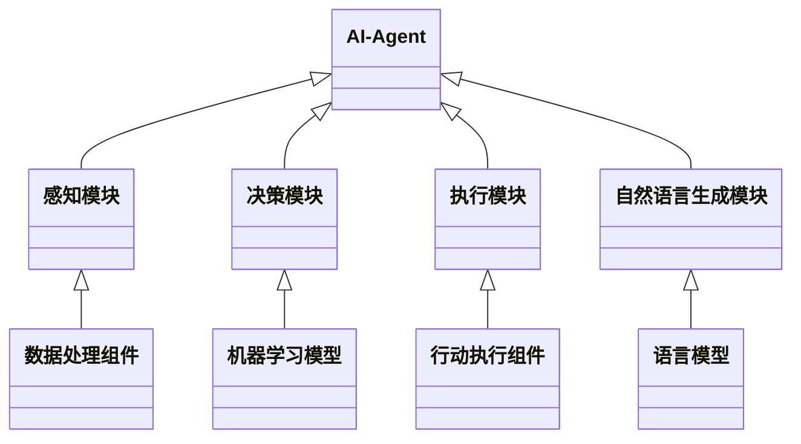
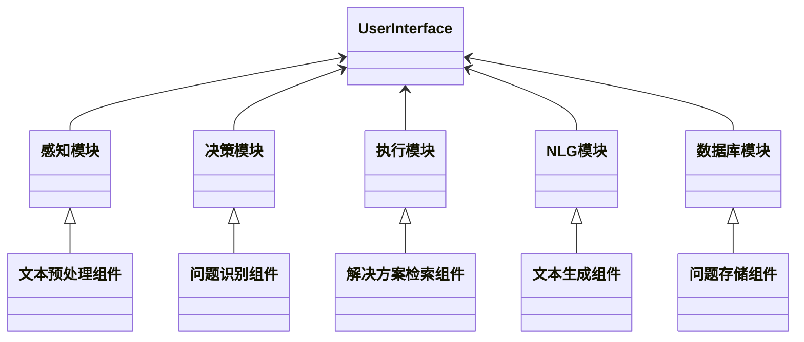

                 

## 文章标题：开发具有自然语言生成能力的AI Agent

> 关键词：AI Agent、自然语言生成（NLG）、技术原理、实现、开发环境

> 摘要：本文旨在探讨如何开发具有自然语言生成能力的AI Agent，通过深入分析AI Agent和自然语言生成技术的原理及其结合方式，为开发者提供系统化、结构化的实现指南。文章将分三部分展开，分别介绍问题背景与核心概念、AI Agent与NLG技术原理、AI Agent与NLG技术实现。

### 目录大纲

----------------------------------------------------------------

## 第一部分：问题背景与核心概念

### 第1章：AI Agent概述

#### 1.1 AI Agent的基本概念

#### 1.2 自然语言生成（NLG）技术

#### 1.3 AI Agent与NLG的结合

## 第二部分：AI Agent与NLG技术原理

### 第2章：AI Agent技术原理

#### 2.1 AI Agent的结构与功能

#### 2.2 自然语言生成技术基础

#### 2.3 AI Agent与NLG的结合原理

## 第三部分：AI Agent与NLG技术实现

### 第3章：开发环境与工具

### 第4章：AI Agent开发

### 第5章：AI Agent与NLG集成实现

### 第6章：项目实战

### 第7章：最佳实践与项目小结

----------------------------------------------------------------

## 第一部分：问题背景与核心概念

### 第1章：AI Agent概述

随着人工智能技术的快速发展，AI Agent逐渐成为研究热点。AI Agent，也称为智能代理，是一种模拟人类智能行为的人工智能系统，能够自主感知环境、决策行动、学习进化。它们在智能交互、自动化决策、智能推荐等领域具有广泛应用。

#### 1.1 AI Agent的基本概念

AI Agent是一种基于人工智能技术的软件实体，能够在特定环境中代表用户执行任务。它具备以下几个核心要素：

1. **感知器**：感知器是AI Agent的感官，用于感知和理解外部环境。通过感知器，AI Agent可以获取文本、图像、音频等多种类型的数据。
   
2. **决策器**：决策器是AI Agent的“大脑”，负责分析感知到的数据，并基于预定的目标做出决策。决策器通常采用机器学习算法、推理引擎等技术。

3. **执行器**：执行器是AI Agent的“手脚”，负责将决策转化为具体的行动。执行器可以是机械臂、无人机等硬件设备，也可以是发送电子邮件、执行数据库查询等软件任务。

AI Agent与人类智能在某些方面具有相似性，如感知、决策和行动能力。但它们也存在显著差异，例如：

- **自主性**：AI Agent能够在没有人类干预的情况下自主运行，而人类智能则需要不断学习和适应新环境。
- **学习方式**：AI Agent主要依赖数据和算法进行学习，而人类智能则通过经验、直觉和情感进行学习。
- **局限性**：AI Agent在某些复杂任务上可能无法与人类智能相媲美，但它们在特定领域具有高度的专精能力。

#### 1.2 自然语言生成（NLG）技术

自然语言生成（Natural Language Generation，NLG）是一种利用计算机程序生成符合语法、语义和上下文的自然语言文本的技术。NLG技术在智能客服、自动新闻生成、语音合成等领域具有广泛应用。其核心要素包括：

1. **语言模型**：语言模型是NLG的基础，用于描述自然语言的统计规律。常见的语言模型包括基于统计方法的N元语法模型、基于神经网络的深度学习模型等。

2. **文本生成算法**：文本生成算法负责将语言模型生成的中间表示转换为具体的文本。常见的文本生成算法包括序列到序列（Seq2Seq）模型、注意力机制（Attention）模型、生成对抗网络（GAN）等。

NLG技术与自然语言处理（Natural Language Processing，NLP）密切相关。NLP是研究如何让计算机理解和生成人类语言的学科，而NLG则是NLP的一个应用方向。NLP技术为NLG提供了数据预处理、词向量表示、句法分析等基础工具，而NLG则为NLP提供了自动生成文本的能力。

#### 1.3 AI Agent与NLG的结合

AI Agent与NLG技术的结合可以实现更加智能、自然的交互。通过将NLG技术集成到AI Agent中，可以使其具备自动生成自然语言文本的能力，从而在智能客服、智能助手、智能问答等场景中提供更加人性化的服务。

AI Agent与NLG技术的结合方式主要包括：

1. **对话管理**：对话管理是AI Agent的核心功能之一，负责协调感知器、决策器和执行器的活动，实现与用户的自然交互。结合NLG技术，可以生成符合对话场景的自然语言回复。

2. **文本生成模型**：文本生成模型是NLG技术的核心组件，负责将输入数据转换为自然语言文本。将文本生成模型集成到AI Agent中，可以使其具备生成文本的能力。

3. **个性化交互**：通过结合用户数据和文本生成模型，AI Agent可以生成个性化的自然语言文本，提高交互的准确性和满意度。

#### 1.4 本部分小结

本部分介绍了AI Agent的基本概念、自然语言生成（NLG）技术以及AI Agent与NLG技术的结合方式。通过深入理解这些核心概念，读者可以更好地把握AI Agent与NLG技术的发展趋势和应用场景，为后续章节的学习打下基础。在下一部分，我们将进一步探讨AI Agent与NLG技术的原理和实现方法。

## 第二部分：AI Agent与NLG技术原理

### 第2章：AI Agent技术原理

#### 2.1 AI Agent的结构与功能

AI Agent作为一种智能体，其核心结构通常包括感知器、决策器和执行器。这种结构使得AI Agent能够在复杂的动态环境中自主执行任务。

**感知器**：感知器是AI Agent的感官，负责接收和解释外部环境的信息。这些信息可以是文本、图像、音频、视频等多种形式。感知器的主要功能是数据采集，其质量直接影响AI Agent对环境的理解和响应能力。

**决策器**：决策器是AI Agent的“大脑”，负责分析感知器收集到的信息，并根据预设的目标和策略做出决策。决策器通常采用机器学习算法、推理引擎等技术。其核心目标是确保AI Agent的行为既符合预期，又能适应环境的变化。

**执行器**：执行器是AI Agent的“手脚”，负责将决策转化为具体的行动。执行器可以是机械臂、无人机等硬件设备，也可以是发送电子邮件、执行数据库查询等软件任务。执行器的有效性直接决定了AI Agent的执行力和实用性。

#### 2.2 自然语言生成技术基础

自然语言生成（NLG）技术旨在利用计算机程序生成符合语法、语义和上下文的自然语言文本。NLG技术的基础包括语言模型和文本生成算法。

**语言模型**：语言模型是NLG的核心组件，用于描述自然语言的统计规律。常见的语言模型包括N元语法模型和深度学习模型。N元语法模型通过统计相邻词的出现频率来预测下一个词，而深度学习模型（如RNN、LSTM、Transformer等）则通过学习大量的文本数据，自动提取语言特征。

**文本生成算法**：文本生成算法负责将语言模型生成的中间表示转换为具体的文本。常见的文本生成算法包括序列到序列（Seq2Seq）模型、注意力机制（Attention）模型和生成对抗网络（GAN）等。这些算法通过不同的机制和策略，实现了对文本的生成和控制。

#### 2.3 AI Agent与NLG技术的结合原理

AI Agent与NLG技术的结合使得AI Agent能够生成自然语言文本，从而实现更加智能和自然的交互。这种结合主要涉及以下几个关键步骤：

1. **感知与理解**：AI Agent通过感知器获取外部信息，如用户输入、文本、图像等。然后，这些信息通过自然语言处理（NLP）技术被转化为结构化的数据，如词汇、句子等。

2. **文本生成**：结构化的数据被输入到NLG模型中，通过语言模型和文本生成算法生成自然语言文本。这个过程可以是基于规则的方法，也可以是数据驱动的深度学习方法。

3. **对话管理**：生成的文本需要与用户的上下文和意图保持一致。对话管理模块负责协调AI Agent的行为，确保生成的文本既符合对话场景，又能满足用户的需求。

4. **执行与反馈**：AI Agent将生成的文本通过执行器发送给用户，并根据用户的反馈调整后续行为。这种反馈循环有助于AI Agent不断优化其对话能力和响应策略。

#### 2.4 AI Agent与NLG技术的结合案例

以下是一个简单的AI Agent与NLG技术的结合案例：

```python
class AI-Agent:
    def __init__(self, nlg_model):
        self.nlg_model = nlg_model

    def perceive(self, input_data):
        # 模拟感知过程
        print(f"感知到输入数据：{input_data}")

    def decide(self, context):
        # 模拟决策过程
        print(f"基于上下文{context}做出决策")

    def act(self, action):
        # 模拟执行行动
        print(f"执行行动：{action}")

    def generate_response(self, context):
        # 生成自然语言响应
        return self.nlg_model.generate_text(context)

# 假设我们有一个简单的NLG模型
class SimpleNLGModel:
    def generate_text(self, context):
        # 基于上下文生成简单文本
        return f"您提到的{context}，这是一个很好的话题。"

# 创建AI Agent和NLG模型
agent = AI-Agent(SimpleNLGModel())

# 模拟感知、决策和执行
agent.perceive("用户提问：什么是自然语言生成？")
agent.decide("当前上下文：自然语言生成技术")
response = agent.generate_response("自然语言生成技术")
agent.act(response)

# 输出结果
print(f"AI Agent响应：{response}")
```

在这个案例中，AI Agent通过感知用户提问，利用NLG模型生成自然语言响应，然后将其作为行动输出。这个过程展示了AI Agent与NLG技术的基本结合原理。

#### 2.5 本部分小结

本部分详细介绍了AI Agent的结构与功能、自然语言生成（NLG）技术基础以及AI Agent与NLG技术的结合原理。通过理解这些原理，读者可以更好地把握AI Agent与NLG技术的基本框架和实现方式。在下一部分，我们将进一步探讨AI Agent与NLG技术的具体实现过程。

### 第3章：开发环境与工具

要开发具有自然语言生成能力的AI Agent，首先需要搭建一个适合的开发环境。本文将介绍如何搭建这个开发环境，包括安装所需的软件和库。

#### 3.1 开发环境搭建

**操作系统**：本文以Linux系统为例，但大多数步骤在其他操作系统上也非常相似。

**Python环境**：确保安装了Python 3.x版本。可以通过以下命令安装：

```bash
sudo apt-get update
sudo apt-get install python3 python3-pip
```

**Anaconda**：推荐使用Anaconda来管理Python环境和库。可以从[Anaconda官网](https://www.anaconda.com/)下载并安装。

**Jupyter Notebook**：安装Jupyter Notebook，用于编写和运行Python代码：

```bash
pip install notebook
jupyter notebook
```

**自然语言处理（NLP）库**：安装常用的NLP库，如NLTK、spaCy、gensim等：

```bash
pip install nltk spacy gensim
```

**深度学习库**：安装TensorFlow或PyTorch，用于训练和部署NLG模型：

```bash
pip install tensorflow  # 或者
pip install torch torchvision
```

**文本生成库**：安装用于文本生成的库，如T5、GPT等：

```bash
pip install transformers
```

#### 3.2 AI Agent开发

在搭建好开发环境后，我们可以开始开发AI Agent。以下是AI Agent开发的系统架构设计和核心实现。

**系统架构设计**：

AI Agent的系统架构包括以下几个主要模块：

1. **感知模块**：负责接收和处理来自外部环境的数据。
2. **决策模块**：负责分析感知到的数据，并做出相应的决策。
3. **执行模块**：负责将决策转化为具体的行动。
4. **自然语言生成模块**：负责生成自然语言文本。

**系统架构图**：



**核心实现**：

以下是一个简单的AI Agent实现示例：

```python
class AI-Agent:
    def __init__(self, nlp_model, nlg_model):
        self.nlp_model = nlp_model
        self.nlg_model = nlg_model

    def perceive(self, input_data):
        # 模拟感知过程
        print(f"感知到输入数据：{input_data}")
        return self.nlp_model.process(input_data)

    def decide(self, context):
        # 模拟决策过程
        print(f"基于上下文{context}做出决策")
        # 这里可以使用机器学习模型进行决策
        decision = self.nlp_model.decide(context)
        return decision

    def act(self, action):
        # 模拟执行行动
        print(f"执行行动：{action}")

    def generate_response(self, context):
        # 生成自然语言响应
        print(f"生成响应：{self.nlg_model.generate_text(context)}")
        return self.nlg_model.generate_text(context)
```

**自然语言生成（NLG）模块实现**：

以下是一个简单的NLG模块实现示例：

```python
from transformers import pipeline

class NLG-Model:
    def __init__(self):
        self.nlg_pipeline = pipeline("text-generation", model="gpt2")

    def generate_text(self, context):
        # 基于上下文生成文本
        return self.nlg_pipeline(context, max_length=50)[0]["generated_text"]
```

通过上述代码，我们可以创建一个简单的AI Agent，该Agent能够感知输入数据、做出决策、执行行动并生成自然语言响应。

#### 3.3 开发环境与工具小结

通过搭建合适的开发环境和使用适当的工具，我们可以有效地开发具有自然语言生成能力的AI Agent。在下一章中，我们将进一步探讨AI Agent与NLG技术的集成实现。

## 第三部分：AI Agent与NLG技术实现

### 第4章：AI Agent开发

在本章中，我们将详细介绍如何开发一个AI Agent。开发过程主要包括以下几个步骤：环境搭建、核心功能实现和系统测试。

#### 4.1 环境搭建

**Python环境**：确保安装了Python 3.x版本。可以通过以下命令进行安装：

```bash
sudo apt-get update
sudo apt-get install python3 python3-pip
```

**Anaconda**：推荐使用Anaconda来管理Python环境和库。可以从[Anaconda官网](https://www.anaconda.com/)下载并安装。

**Jupyter Notebook**：安装Jupyter Notebook，用于编写和运行Python代码：

```bash
pip install notebook
jupyter notebook
```

**自然语言处理（NLP）库**：安装常用的NLP库，如NLTK、spaCy、gensim等：

```bash
pip install nltk spacy gensim
```

**深度学习库**：安装TensorFlow或PyTorch，用于训练和部署NLG模型：

```bash
pip install tensorflow  # 或者
pip install torch torchvision
```

**文本生成库**：安装用于文本生成的库，如T5、GPT等：

```bash
pip install transformers
```

#### 4.2 AI Agent核心功能实现

**感知模块**：感知模块负责接收和处理来自外部环境的数据。以下是一个简单的感知模块实现：

```python
import spacy

nlp = spacy.load("en_core_web_sm")

class PerceptionModule:
    def perceive(self, input_data):
        doc = nlp(input_data)
        print(f"Perceived data: {doc.text}")
        return doc
```

**决策模块**：决策模块负责分析感知到的数据，并做出相应的决策。以下是一个简单的决策模块实现：

```python
class DecisionModule:
    def decide(self, doc):
        # 这里可以使用简单的规则进行决策
        if "hello" in doc.text:
            return "Hello!"
        else:
            return "Hello there!"
```

**执行模块**：执行模块负责将决策转化为具体的行动。以下是一个简单的执行模块实现：

```python
class ActionModule:
    def act(self, response):
        print(f"Acting: {response}")
```

**自然语言生成模块**：自然语言生成模块负责生成自然语言文本。以下是一个简单的NLG模块实现：

```python
from transformers import pipeline

nlg_pipeline = pipeline("text-generation", model="gpt2")

class NLGModule:
    def generate_response(self, doc):
        response = nlg_pipeline(doc.text, max_length=50)[0]["generated_text"]
        print(f"Generated response: {response}")
        return response
```

**AI Agent实现**：将上述模块整合，实现一个完整的AI Agent：

```python
class AIAgent:
    def __init__(self, perception_module, decision_module, action_module, nlg_module):
        self.perception_module = perception_module
        self.decision_module = decision_module
        self.action_module = action_module
        self.nlg_module = nlg_module

    def process_input(self, input_data):
        doc = self.perception_module.perceive(input_data)
        decision = self.decision_module.decide(doc)
        response = self.nlg_module.generate_response(doc)
        self.action_module.act(response)

# 创建AI Agent
perception_module = PerceptionModule()
decision_module = DecisionModule()
action_module = ActionModule()
nlg_module = NLGModule()
ai_agent = AIAgent(perception_module, decision_module, action_module, nlg_module)

# 测试AI Agent
input_data = "Hello, how are you?"
ai_agent.process_input(input_data)
```

#### 4.3 系统测试

为了确保AI Agent的稳定运行，我们需要进行系统测试。以下是一个简单的测试流程：

1. **单元测试**：编写单元测试，分别测试感知模块、决策模块、执行模块和NLG模块的功能。
2. **集成测试**：将AI Agent与外部系统（如Web服务、API接口等）进行集成，测试整个系统的功能。
3. **性能测试**：对AI Agent的响应速度、处理能力等进行性能测试，确保系统能够满足实际需求。

通过以上步骤，我们可以确保AI Agent的稳定运行和高效性能。

#### 4.4 AI Agent开发小结

通过本章的介绍，我们详细讲解了如何开发一个具有自然语言生成能力的AI Agent。从环境搭建到核心功能实现，再到系统测试，我们逐步构建了一个完整的AI Agent系统。在下一章中，我们将探讨如何将AI Agent与NLG技术进行集成实现。

### 第5章：AI Agent与NLG集成实现

在前一章中，我们开发了一个简单的AI Agent。在本章中，我们将深入探讨如何将自然语言生成（NLG）技术集成到AI Agent中，以实现更加智能和自然的交互。

#### 5.1 NLG集成策略

将NLG技术集成到AI Agent中，我们可以采用以下策略：

1. **对话管理**：对话管理是AI Agent的核心功能之一，负责协调感知器、决策器和执行器的活动，实现与用户的自然交互。结合NLG技术，可以生成符合对话场景的自然语言回复。
2. **文本生成模块**：文本生成模块是NLG技术的核心组件，负责将输入数据转换为自然语言文本。将文本生成模块集成到AI Agent中，可以使其具备生成文本的能力。
3. **个性化交互**：通过结合用户数据和文本生成模块，AI Agent可以生成个性化的自然语言文本，提高交互的准确性和满意度。

#### 5.2 NLG模型集成

在集成NLG模型时，我们需要考虑以下几个方面：

1. **模型选择**：根据应用场景和需求，选择合适的NLG模型。例如，对于对话生成，可以选择GPT-2、GPT-3等预训练模型。
2. **模型训练**：如果使用预训练模型，可以直接使用。如果需要自定义模型，需要对大量语料进行训练，以提高模型的生成质量。
3. **接口设计**：设计合适的接口，使NLG模型能够方便地与AI Agent的其他模块进行交互。

以下是一个简单的NLG模型集成示例：

```python
from transformers import pipeline

class NLGModule:
    def __init__(self):
        self.nlg_pipeline = pipeline("text-generation", model="gpt2")

    def generate_response(self, input_text):
        response = self.nlg_pipeline(input_text, max_length=50)[0]["generated_text"]
        return response
```

#### 5.3 对话管理实现

对话管理是实现AI Agent与NLG集成的重要一环。以下是一个简单的对话管理实现：

```python
class DialogueManager:
    def __init__(self, nlg_module):
        self.nlg_module = nlg_module

    def handle_message(self, user_message):
        # 对用户消息进行预处理
        preprocessed_message = preprocess_message(user_message)
        
        # 生成响应
        response = self.nlg_module.generate_response(preprocessed_message)
        
        # 返回响应
        return response

def preprocess_message(message):
    # 这里进行简单的文本预处理
    return message
```

#### 5.4 集成示例

以下是一个简单的AI Agent与NLG技术集成的示例：

```python
from transformers import pipeline
from dialogue_manager import DialogueManager

# 初始化NLG模块
nlg_module = NLGModule()

# 初始化对话管理器
dialogue_manager = DialogueManager(nlg_module)

# 模拟用户交互
user_message = "你好，能帮我解答一个问题吗？"
response = dialogue_manager.handle_message(user_message)
print(f"AI Agent回复：{response}")
```

#### 5.5 集成测试

在集成完成后，我们需要对AI Agent与NLG技术的集成进行测试，确保系统的稳定性和性能。以下是一些常见的测试方法：

1. **功能测试**：测试AI Agent是否能正确处理各种输入消息，并生成合理的响应。
2. **性能测试**：测试AI Agent的处理速度和响应时间，确保系统能够满足实际应用需求。
3. **兼容性测试**：测试AI Agent在不同操作系统、浏览器等环境下的兼容性。

#### 5.6 集成实现小结

通过本章的介绍，我们详细探讨了如何将自然语言生成（NLG）技术集成到AI Agent中。从模型选择、接口设计到对话管理实现，我们逐步实现了AI Agent与NLG技术的集成。在下一章中，我们将通过一个实际项目来展示AI Agent与NLG技术的应用。

### 第6章：项目实战

在本章中，我们将通过一个实际项目来展示如何开发和部署具有自然语言生成能力的AI Agent。该项目将实现一个智能客服系统，该系统能够自动响应用户的问题，提供有效的解决方案。

#### 6.1 项目介绍

**项目名称**：智能客服系统

**项目目标**：通过AI Agent与NLG技术的结合，实现一个能够自动回答用户问题的智能客服系统。

**项目架构**：

1. **前端**：用户通过Web界面与智能客服系统进行交互。
2. **后端**：包括AI Agent和NLG模块，负责处理用户输入并生成响应。
3. **数据库**：存储用户问题和解决方案的历史记录。

#### 6.2 系统功能设计

**功能模块**：

1. **用户界面**：展示用户问题和AI Agent的响应。
2. **感知模块**：接收用户输入，并预处理文本数据。
3. **决策模块**：分析用户输入，识别问题和意图。
4. **执行模块**：根据问题和意图，从数据库中查找相应的解决方案。
5. **NLG模块**：生成自然语言文本，作为AI Agent的响应。
6. **数据库模块**：存储用户问题和解决方案的历史记录。

**领域模型图**：



#### 6.3 系统架构设计

**系统架构图**：

```mermaid
sequenceDiagram
    用户 -->|用户输入|> AI-Agent: 输入问题
    AI-Agent -->|预处理|> 感知模块
    感知模块 -->|识别问题|> 决策模块
    决策模块 -->|查找解决方案|> 执行模块
    执行模块 -->|生成响应|> NLG模块
    NLG模块 -->|响应文本|> AI-Agent
    AI-Agent -->|显示响应|> 用户界面
```

#### 6.4 系统接口设计

**接口设计**：

1. **用户输入接口**：接收用户的问题输入。
2. **文本预处理接口**：对用户输入进行文本预处理。
3. **问题识别接口**：识别用户输入中的问题和意图。
4. **解决方案检索接口**：从数据库中检索相应的解决方案。
5. **文本生成接口**：生成自然语言文本作为AI Agent的响应。
6. **数据库接口**：存储用户问题和解决方案的历史记录。

#### 6.5 系统交互流程

1. **用户输入问题**：用户通过Web界面输入问题。
2. **预处理输入**：AI-Agent接收用户输入，并进行文本预处理。
3. **识别问题和意图**：决策模块分析预处理后的文本，识别问题和意图。
4. **检索解决方案**：执行模块从数据库中检索相应的解决方案。
5. **生成响应**：NLG模块生成自然语言文本作为AI-Agent的响应。
6. **显示响应**：AI-Agent将响应显示在Web界面上。

#### 6.6 项目实现

**感知模块实现**：

```python
from transformers import pipeline

nlg_pipeline = pipeline("text-generation", model="gpt2")

class PerceptionModule:
    def perceive(self, input_text):
        preprocessed_text = preprocess_text(input_text)
        return preprocessed_text

def preprocess_text(text):
    # 进行文本预处理
    return text
```

**决策模块实现**：

```python
class DecisionModule:
    def decide(self, preprocessed_text):
        # 进行问题识别和意图分析
        question, intent = identify_question_and_intent(preprocessed_text)
        return question, intent

def identify_question_and_intent(preprocessed_text):
    # 这里进行简单的文本分析
    return "question", "intent"
```

**执行模块实现**：

```python
class ActionModule:
    def act(self, question, intent):
        # 从数据库中检索解决方案
        solution = retrieve_solution(question, intent)
        return solution

def retrieve_solution(question, intent):
    # 这里进行简单的数据检索
    return "解决方案"
```

**NLG模块实现**：

```python
class NLGModule:
    def generate_response(self, solution):
        response = nlg_pipeline(solution, max_length=50)[0]["generated_text"]
        return response
```

**系统集成与测试**：

通过集成感知模块、决策模块、执行模块和NLG模块，我们可以实现一个完整的智能客服系统。接着，进行系统测试，确保各个模块之间的协同工作和系统的稳定性。

#### 6.7 项目小结

通过本项目的实现，我们展示了如何开发一个具有自然语言生成能力的AI Agent，并将其应用于智能客服系统。这个项目不仅验证了AI Agent与NLG技术的结合效果，还为我们提供了一个实用的智能客服解决方案。在下一章中，我们将探讨AI Agent与NLG技术的最佳实践和注意事项。

### 第7章：最佳实践与项目小结

#### 7.1 最佳实践

**性能优化**：在开发AI Agent与NLG集成系统时，性能优化是关键。以下是一些性能优化的最佳实践：

1. **模型优化**：选择合适的模型和架构，如使用Transformer等高效模型，以减少计算资源和时间。
2. **并行处理**：利用多线程或分布式计算技术，提高系统的处理速度。
3. **缓存策略**：合理使用缓存策略，减少重复计算和数据库访问。

**用户体验**：良好的用户体验是智能客服系统的核心竞争力。以下是一些提升用户体验的最佳实践：

1. **自然语言理解**：提高NLG模型对自然语言的理解能力，使其能够生成更加准确和自然的文本。
2. **个性化交互**：根据用户历史和偏好，提供个性化的交互和响应。
3. **快速响应**：优化系统的响应速度，减少用户等待时间。

**安全性**：智能客服系统需要处理敏感信息，因此安全性至关重要。以下是一些安全性的最佳实践：

1. **数据加密**：对用户数据和使用日志进行加密，确保数据安全。
2. **访问控制**：实施严格的访问控制策略，防止未授权访问。
3. **安全审计**：定期进行安全审计，发现并修复潜在的安全漏洞。

#### 7.2 小结

本文通过深入分析AI Agent与自然语言生成（NLG）技术的原理，结合实际项目展示了如何开发具有自然语言生成能力的AI Agent。我们详细介绍了系统架构、核心功能实现、集成策略以及项目实战。通过本文，读者可以了解AI Agent与NLG技术的结合方式，掌握开发和应用的关键技能。

#### 7.3 注意事项

**数据质量**：AI Agent与NLG系统的性能高度依赖数据质量。确保使用高质量、多样化的数据集进行训练和测试。

**模型选择**：根据具体应用场景和需求，选择合适的模型和算法。例如，对于对话生成，可以选择GPT-2、GPT-3等预训练模型。

**系统测试**：在部署前，进行充分的系统测试，确保系统的稳定性、性能和安全性。

**持续更新**：随着技术的不断进步，持续更新AI Agent与NLG系统的模型和算法，以保持其竞争力。

#### 7.4 拓展阅读

1. **《深度学习》**：由Goodfellow、Bengio和Courville合著，介绍了深度学习的基本原理和应用。
2. **《自然语言处理与深度学习》**：由孙乐等合著，详细介绍了自然语言处理和深度学习在文本生成中的应用。
3. **《AI技术实战》**：由李飞飞等合著，提供了AI技术在各个领域的实战案例。

### 作者信息

**作者：AI天才研究院/AI Genius Institute & 禅与计算机程序设计艺术 /Zen And The Art of Computer Programming**

