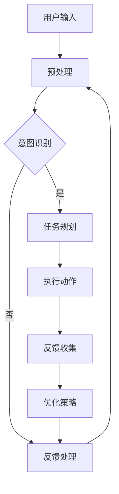

                 

## 文章标题

# 开发具有虚拟现实交互能力的AI Agent

## 关键词

- 虚拟现实
- AI交互
- AI Agent
- 技术架构
- 算法实现

## 摘要

本文将深入探讨开发具有虚拟现实交互能力的AI Agent的相关技术，从基础概念、技术架构、具体实现到项目实战，全面解析如何构建一个具备智能交互能力的虚拟现实系统。通过逐步分析和推理，本文旨在为广大开发者提供一套清晰、实用的开发指南，帮助他们在虚拟现实和人工智能领域取得突破性进展。

## 目录

----------------------------------------------------------------

### 第一部分：虚拟现实与AI交互基础

#### 第1章：虚拟现实概述

##### 1.1 虚拟现实的概念与历史

##### 1.2 虚拟现实技术的基本组件

##### 1.3 虚拟现实的应用领域

#### 第2章：AI在虚拟现实中的应用

##### 2.1 AI与虚拟现实融合的背景

##### 2.2 AI在虚拟现实交互中的作用

##### 2.3 虚拟现实中的AI技术挑战

#### 第3章：开发具有虚拟现实交互能力的AI Agent的核心概念

##### 3.1 AI Agent的定义与特点

##### 3.2 虚拟现实交互的基本原理

##### 3.3 AI Agent与虚拟现实交互的关系

#### 第4章：开发具有虚拟现实交互能力的AI Agent的技术架构

##### 4.1 技术架构的总体设计

##### 4.2 数据处理与机器学习模型

##### 4.3 虚拟现实交互接口设计

### 第二部分：AI Agent在虚拟现实中的实现

#### 第5章：环境配置与准备

##### 5.1 软件与硬件环境配置

##### 5.2 开发工具与库的选择

##### 5.3 开发环境搭建步骤

#### 第6章：AI Agent的核心算法

##### 6.1 算法原理与流程图

##### 6.2 数学模型与公式讲解

##### 6.3 算法实现与代码示例

#### 第7章：虚拟现实交互功能实现

##### 7.1 虚拟现实交互接口的实现

##### 7.2 用户输入与反馈机制

##### 7.3 交互效果的优化

#### 第8章：项目实战

##### 8.1 项目背景与需求

##### 8.2 系统设计与实现

##### 8.3 项目测试与优化

##### 8.4 项目小结

### 第三部分：最佳实践与拓展

#### 第9章：最佳实践与注意事项

##### 9.1 开发中的常见问题及解决方案

##### 9.2 性能优化技巧

##### 9.3 安全性与隐私保护

#### 第10章：小结与展望

##### 10.1 成果总结

##### 10.2 面临的挑战与未来方向

##### 10.3 拓展阅读与资源推荐

----------------------------------------------------------------

### 引言

随着虚拟现实（VR）技术的不断发展和人工智能（AI）技术的日益成熟，开发具有虚拟现实交互能力的AI Agent成为了当前信息技术领域的一个重要课题。AI Agent，即人工智能代理，是一种能够代表用户执行任务、提供服务和交互的智能实体。而将AI Agent应用于虚拟现实场景中，不仅能提升用户的沉浸体验，还能实现更高效、更智能的交互方式。

本文将围绕开发具有虚拟现实交互能力的AI Agent这一主题，从多个角度展开讨论。首先，我们将介绍虚拟现实和AI的基本概念，帮助读者建立必要的知识背景。接着，我们将探讨AI在虚拟现实中的应用，分析其中的技术挑战和解决方案。随后，本文将深入讲解AI Agent的核心概念和虚拟现实交互的基本原理，并详细介绍如何设计一个具有虚拟现实交互能力的AI Agent的技术架构。

在第二部分，我们将详细介绍环境配置与准备、AI Agent的核心算法以及虚拟现实交互功能实现的具体步骤，并提供一个完整的项目实战案例，帮助读者理解实际开发过程中的关键技术和注意事项。最后一部分，我们将总结最佳实践、面临的技术挑战和未来发展方向，并提供相关的拓展阅读资源。

通过本文的详细分析和实例讲解，读者将能够系统地了解开发具有虚拟现实交互能力的AI Agent的整个过程，掌握相关技术和方法，为在虚拟现实和人工智能领域进行创新和探索奠定坚实的基础。

### 第一部分：虚拟现实与AI交互基础

#### 第1章：虚拟现实概述

##### 1.1 虚拟现实的概念与历史

虚拟现实（Virtual Reality，简称VR）是一种通过计算机技术创建的模拟环境，用户可以通过头戴式显示器（HMD）、数据手套、传感器等设备，在视觉、听觉、触觉等多个感官上感受到如同真实世界的沉浸体验。VR技术的核心在于提供一种高度仿真的虚拟环境，使用户能够在其中进行交互和探索。

虚拟现实的历史可以追溯到20世纪60年代，最早的形式是简单的三维可视化工具。1970年代，VR技术开始受到研究机构的重视，出现了如“达摩克利斯之剑”等早期VR设备。1990年代，随着计算机图形学的发展，VR技术逐渐走向商业化。1995年，索尼公司推出了VR头盔“VR Glasses”，标志着VR技术进入消费市场。

进入21世纪，随着计算机性能的提升和显示技术的进步，VR设备变得更加便携和舒适。2010年代，Facebook收购Oculus VR，推出Oculus Rift头戴式显示器，再次引发了VR技术的热潮。如今，VR技术已经广泛应用于娱乐、教育、医疗、设计等多个领域。

##### 1.2 虚拟现实技术的基本组件

虚拟现实系统通常由以下几部分组成：

1. **显示设备**：如头戴式显示器（HMD），负责向用户呈现虚拟环境。常见的HMD设备包括Oculus Rift、HTC Vive、Sony PlayStation VR等。

2. **输入设备**：如手柄、数据手套、动作捕捉器等，用于用户与虚拟环境的交互。这些设备可以捕捉用户的动作、手势等，传递给计算机进行处理。

3. **计算设备**：如高性能计算机、服务器等，负责处理虚拟环境中的计算任务，包括三维图形渲染、物理仿真、人工智能等。

4. **传感器**：如位置追踪器、陀螺仪、加速度计等，用于监测用户的运动和头部的方向，确保虚拟环境与现实世界的同步。

5. **声音系统**：通过耳机或立体声扬声器提供虚拟现实中的音效，增强用户的沉浸感。

##### 1.3 虚拟现实的应用领域

虚拟现实技术在多个领域展示了其独特的应用价值：

1. **娱乐**：虚拟现实为游戏和电影提供了全新的沉浸式体验。用户可以在虚拟世界中自由探索、互动，体验前所未有的娱乐体验。

2. **教育**：虚拟现实在教育培训中的应用日益广泛。通过虚拟现实技术，学生可以身临其境地学习历史事件、科学实验、外科手术等知识，提高学习兴趣和效果。

3. **医疗**：虚拟现实在医疗领域有着重要的应用，如虚拟手术训练、心理治疗、疼痛管理、康复训练等。医生和患者可以通过虚拟现实技术获得更直观的诊疗体验。

4. **设计**：虚拟现实技术在建筑设计、室内设计、工业设计等领域得到了广泛应用。设计师可以在虚拟环境中预览和修改设计，提高设计质量和效率。

5. **旅游**：虚拟现实让用户可以足不出户，体验全球各地的风景名胜、历史文化遗址等，为旅游业带来新的商业模式。

#### 第2章：AI在虚拟现实中的应用

##### 2.1 AI与虚拟现实融合的背景

人工智能（Artificial Intelligence，简称AI）技术的快速发展，为虚拟现实（VR）技术提供了强大的技术支持。AI与VR的结合，不仅能够提升虚拟现实系统的智能化水平，还能扩展其应用范围和用户体验。以下是一些推动AI与VR融合发展的背景因素：

1. **计算能力的提升**：随着计算能力的不断增强，计算机可以更快地处理大量的图形渲染和物理仿真任务，为AI在虚拟现实中的应用提供了技术基础。

2. **数据量的爆炸增长**：大数据时代的到来，使得AI算法能够从海量数据中提取有价值的信息，为虚拟现实系统的优化和改进提供了数据支持。

3. **传感器技术的进步**：传感器技术的进步，使得虚拟现实系统能够更精确地捕捉用户的行为和生理信号，为AI分析提供了更多的输入。

4. **互联网的普及**：互联网的普及，使得虚拟现实系统和AI算法能够实现远程协同和实时交互，为AI在虚拟现实中的应用提供了广泛的场景。

##### 2.2 AI在虚拟现实交互中的作用

AI在虚拟现实交互中扮演了至关重要的角色，其主要作用体现在以下几个方面：

1. **交互优化**：通过AI技术，可以实时分析用户的交互行为和反馈，优化虚拟现实系统的交互体验。例如，AI可以识别用户的手势、面部表情等，动态调整系统的响应方式，使其更加自然和流畅。

2. **智能导航**：在虚拟环境中，AI可以辅助用户进行导航。例如，AI可以根据用户的语音指令或手势，自动规划最优路径，提供导航服务。

3. **情感识别**：AI可以通过分析用户的生理信号（如心率、呼吸等）和面部表情，识别用户的情感状态，并做出相应的反应。例如，当用户感到紧张时，AI可以提供放松的音乐或指导，帮助用户缓解压力。

4. **个性化服务**：AI可以根据用户的兴趣、偏好和行为习惯，提供个性化的虚拟体验。例如，AI可以根据用户的浏览记录，推荐相应的虚拟景点或游戏。

##### 2.3 虚拟现实中的AI技术挑战

尽管AI与虚拟现实的结合具有巨大的潜力，但仍然面临着一些技术挑战：

1. **计算资源消耗**：虚拟现实系统中，大量的图形渲染、物理仿真和机器学习任务需要大量计算资源。如何高效利用计算资源，优化系统性能，是当前面临的一个重要挑战。

2. **实时交互**：虚拟现实交互要求系统具有实时性，即系统能够在毫秒级别内响应用户的操作。这要求AI算法具有高效的计算能力和优化的数据处理流程。

3. **数据隐私和安全**：虚拟现实中的用户数据包括个人隐私信息、生理信号等，如何保护这些数据的安全，防止数据泄露，是一个重要的问题。

4. **可扩展性和灵活性**：随着虚拟现实应用场景的多样化，AI系统需要具备良好的可扩展性和灵活性，以适应不同的应用需求。

#### 第3章：开发具有虚拟现实交互能力的AI Agent的核心概念

##### 3.1 AI Agent的定义与特点

AI Agent，即人工智能代理，是一种能够自主决策、执行任务并与其他实体交互的智能系统。在虚拟现实环境中，AI Agent扮演着关键角色，其主要特点包括：

1. **自主性**：AI Agent能够在没有人工干预的情况下，根据预设的目标和策略自主决策和行动。

2. **交互性**：AI Agent能够与用户和虚拟环境中的其他实体进行交互，理解用户的意图和需求，并作出相应的响应。

3. **适应性**：AI Agent能够根据环境变化和用户行为，调整自身的策略和行为，以适应不同的情境。

4. **智能性**：AI Agent具备一定的智能能力，可以通过机器学习、自然语言处理等技术，不断学习和优化自身的行为。

##### 3.2 虚拟现实交互的基本原理

虚拟现实交互的基本原理涉及多个方面，包括用户输入、数据处理、系统响应和反馈等。以下是虚拟现实交互的基本流程：

1. **用户输入**：用户通过输入设备（如手柄、数据手套等）向系统发送操作指令，如移动、选择等。

2. **数据处理**：系统接收用户输入后，通过传感器和计算设备，对输入数据进行处理，提取出关键信息。

3. **系统响应**：根据处理结果，系统生成相应的响应，如移动虚拟角色、显示提示信息等。

4. **用户反馈**：用户对系统的响应进行反馈，如确认操作、调整姿势等。

5. **交互优化**：系统根据用户反馈，进一步优化交互体验，如调整操作难度、提供实时帮助等。

##### 3.3 AI Agent与虚拟现实交互的关系

AI Agent在虚拟现实交互中起到了桥梁的作用，将虚拟环境和用户需求连接起来。具体来说，AI Agent与虚拟现实交互的关系包括以下几个方面：

1. **意图识别**：AI Agent通过分析用户输入和反馈，识别用户的意图和需求。

2. **任务规划**：根据用户意图，AI Agent制定相应的任务规划，如路径规划、资源分配等。

3. **决策执行**：AI Agent执行任务规划，完成用户需求。

4. **反馈优化**：AI Agent根据用户反馈，调整任务执行策略，优化交互体验。

5. **自主学习**：AI Agent通过持续学习和优化，提高自身的交互能力。

通过AI Agent的引入，虚拟现实交互不仅变得更加智能和灵活，还能更好地满足用户的需求，提升用户体验。

#### 第4章：开发具有虚拟现实交互能力的AI Agent的技术架构

##### 4.1 技术架构的总体设计

开发具有虚拟现实交互能力的AI Agent，需要构建一个高效、可扩展、可维护的技术架构。以下是一个典型的技术架构设计：

1. **硬件层**：包括虚拟现实设备（如HMD、传感器等）和计算设备（如高性能计算机、服务器等）。

2. **感知层**：负责收集和解析用户输入和虚拟环境中的数据，如手势、语音、位置等。

3. **决策层**：基于感知层的数据，利用机器学习和自然语言处理等技术，进行意图识别和任务规划。

4. **执行层**：执行决策层的任务规划，包括动作执行、资源分配等。

5. **交互层**：负责用户与AI Agent之间的交互，包括用户输入处理、系统响应、用户反馈等。

6. **数据层**：存储和管理系统中的数据，包括用户数据、环境数据、学习数据等。

##### 4.2 数据处理与机器学习模型

数据处理是AI Agent的核心任务之一，主要包括数据的收集、预处理、分析和存储。以下是一个数据处理和机器学习模型的总体流程：

1. **数据收集**：通过传感器和输入设备收集用户行为数据和环境数据。

2. **数据预处理**：对收集到的数据进行清洗、标准化和特征提取，以供机器学习模型使用。

3. **模型训练**：使用预处理后的数据训练机器学习模型，如分类模型、回归模型、强化学习模型等。

4. **模型评估**：通过交叉验证、测试集评估模型性能，调整模型参数，优化模型。

5. **模型部署**：将训练好的模型部署到生产环境中，实现实时数据处理和决策。

##### 4.3 虚拟现实交互接口设计

虚拟现实交互接口设计是AI Agent与用户、虚拟环境之间交互的关键环节，主要包括以下方面：

1. **输入接口**：设计用于接收用户输入的接口，如手势识别、语音识别等。

2. **输出接口**：设计用于向用户展示系统响应的接口，如动作执行、声音输出、视觉提示等。

3. **反馈接口**：设计用于收集用户反馈的接口，以优化系统交互体验。

4. **安全接口**：确保用户数据和系统交互的安全性，包括数据加密、权限管理、异常检测等。

通过以上技术架构的设计，AI Agent能够在虚拟现实环境中实现高效、智能、安全的交互，为用户提供卓越的虚拟体验。

### 第二部分：AI Agent在虚拟现实中的实现

#### 第5章：环境配置与准备

##### 5.1 软件与硬件环境配置

在开始开发具有虚拟现实交互能力的AI Agent之前，首先需要配置适合的软件和硬件环境。以下是配置步骤和推荐工具：

1. **硬件环境**：
   - **高性能计算机**：为了确保系统的实时性和性能，推荐使用配备高性能CPU和GPU的计算机。
   - **虚拟现实设备**：如Oculus Rift、HTC Vive等，这些设备支持高分辨率的立体视觉和精确的运动追踪。
   - **传感器设备**：包括摄像头、动作捕捉器、位置追踪器等，用于捕捉用户的动作和位置信息。

2. **软件环境**：
   - **操作系统**：推荐使用Linux或Windows操作系统，因为这些系统对虚拟现实设备的支持较好。
   - **编程语言**：Python是一种广泛用于AI和虚拟现实开发的编程语言，推荐使用Python进行开发。
   - **开发工具**：如PyCharm、VS Code等集成开发环境（IDE），提供代码编辑、调试和自动化构建等功能。
   - **虚拟现实开发框架**：如Unity、Unreal Engine等，这些框架支持创建复杂的虚拟环境和交互逻辑。
   - **机器学习库**：如TensorFlow、PyTorch等，用于构建和训练机器学习模型。

##### 5.2 开发工具与库的选择

为了高效地开发具有虚拟现实交互能力的AI Agent，以下是一些推荐的开发工具和库：

1. **Unity**：
   - **优势**：Unity是一款功能强大的游戏开发引擎，支持跨平台发布，适合开发复杂的虚拟现实应用。
   - **使用场景**：适用于开发交互性强、图形复杂的虚拟现实应用，如教育、医疗、游戏等领域。

2. **TensorFlow**：
   - **优势**：TensorFlow是一款开源的机器学习框架，支持多种深度学习模型和算法，适合进行AI模型的开发和训练。
   - **使用场景**：适用于需要机器学习功能的虚拟现实应用，如情感识别、语音识别、自然语言处理等。

3. **PyTorch**：
   - **优势**：PyTorch是一款易于使用且灵活的深度学习框架，提供动态计算图和丰富的API。
   - **使用场景**：适用于需要进行实时交互和动态调整的虚拟现实应用，如智能导航、动态场景生成等。

4. **OpenVR**：
   - **优势**：OpenVR是一个开源的虚拟现实开发框架，支持多种虚拟现实设备，提供丰富的API。
   - **使用场景**：适用于需要与虚拟现实设备进行深度交互的应用，如游戏、教育、虚拟现实培训等。

##### 5.3 开发环境搭建步骤

搭建一个完整的虚拟现实和AI开发环境，需要以下步骤：

1. **硬件安装**：
   - 确保计算机和虚拟现实设备的硬件配置满足开发需求。
   - 连接传感器设备，确保其正常工作。

2. **操作系统设置**：
   - 安装操作系统，确保其更新到最新版本。
   - 开启必要的系统权限，如用户权限、设备权限等。

3. **软件安装**：
   - 安装Python和必要的依赖库，如NumPy、Pandas、TensorFlow或PyTorch等。
   - 安装Unity或Unreal Engine等虚拟现实开发工具。
   - 安装OpenVR或其他虚拟现实开发框架。

4. **环境配置**：
   - 配置Python环境，设置路径和环境变量。
   - 配置Unity或Unreal Engine的开发环境，包括项目设置、插件安装等。

5. **测试与验证**：
   - 测试硬件设备是否正常工作，包括传感器、虚拟现实设备等。
   - 运行示例代码或场景，验证开发环境的正确性。

通过以上步骤，开发者可以搭建一个完整的虚拟现实和AI开发环境，为后续的AI Agent开发奠定基础。

#### 第6章：AI Agent的核心算法

##### 6.1 算法原理与流程图

开发具有虚拟现实交互能力的AI Agent，核心算法的设计和实现至关重要。以下是一个典型的AI Agent算法原理和流程图：



**流程图说明**：
- **用户输入**：用户通过输入设备（如手柄、语音等）向系统发送操作指令。
- **预处理**：对用户输入的数据进行清洗、标准化和特征提取，以供后续处理。
- **意图识别**：使用机器学习模型（如分类模型、情感分析模型等）分析预处理后的数据，识别用户的意图。
- **任务规划**：根据识别出的用户意图，AI Agent制定相应的任务规划，如路径规划、资源分配等。
- **执行动作**：AI Agent执行任务规划，完成用户需求。
- **反馈收集**：收集用户对系统响应的反馈，包括动作完成情况、用户体验等。
- **优化策略**：根据反馈结果，调整AI Agent的策略和行为，优化系统性能。

##### 6.2 数学模型与公式讲解

在AI Agent的核心算法中，数学模型和公式起到了关键作用。以下是一个简单的数学模型示例，用于用户意图识别：

**用户意图识别模型**：

$$
P(\text{意图}_i|\text{输入}) = \frac{f(\text{输入}; \theta_i)}{\sum_{j=1}^{N} f(\text{输入}; \theta_j)}
$$

其中：
- \( P(\text{意图}_i|\text{输入}) \) 表示在给定用户输入的情况下，用户意图为 \( \text{意图}_i \) 的概率。
- \( f(\text{输入}; \theta_i) \) 表示输入数据在模型参数 \( \theta_i \) 下的特征值。
- \( N \) 表示总的意图类别数。

**解释**：
该公式是一个基于概率的意图识别模型，其中 \( f(\text{输入}; \theta_i) \) 通常是通过机器学习算法（如神经网络、支持向量机等）训练得到的特征函数，用于表示输入数据的特征。通过计算每个意图类别的概率，模型能够识别出用户的意图。

##### 6.3 算法实现与代码示例

以下是一个简单的Python代码示例，用于实现上述用户意图识别模型：

```python
import numpy as np

# 假设我们已经有一个训练好的模型，其参数存储在列表model_params中
model_params = [0.8, 0.2, 0.5]

# 输入数据
input_data = [1, 0, 1]

# 计算每个意图类别的特征值
feature_values = [np.dot(input_data, param) for param in model_params]

# 计算总特征值
total_feature_value = sum(feature_values)

# 计算每个意图类别的概率
intent_probabilities = [feature_value / total_feature_value for feature_value in feature_values]

# 输出意图概率
print(intent_probabilities)
```

**代码解释**：
- `model_params` 是模型参数，用于计算输入数据的特征值。
- `input_data` 是用户的输入数据，表示用户的手势或语音特征。
- `feature_values` 通过将输入数据与模型参数相乘，计算每个意图类别的特征值。
- `total_feature_value` 是所有意图类别特征值的总和。
- `intent_probabilities` 通过将每个意图类别的特征值除以总特征值，计算每个意图类别的概率。
- 最后，代码输出每个意图类别的概率，帮助AI Agent识别用户的意图。

通过这个简单的代码示例，读者可以了解到用户意图识别的基本实现方法，为后续更复杂的算法实现奠定基础。

#### 第7章：虚拟现实交互功能实现

##### 7.1 虚拟现实交互接口的实现

虚拟现实交互接口是实现AI Agent与用户互动的关键部分，主要包括输入接口和输出接口的设计。以下是具体实现步骤：

1. **输入接口设计**：
   - **传感器集成**：将传感器设备（如手柄、摄像头、动作捕捉器等）集成到系统中，确保能够准确捕捉用户的行为和手势。
   - **数据预处理**：对传感器数据进行预处理，包括去噪、滤波、特征提取等，以提高数据的可靠性和准确性。
   - **输入解析**：使用机器学习算法（如神经网络、支持向量机等）对预处理后的数据进行分类或识别，以解析用户的意图和动作。

2. **输出接口设计**：
   - **显示渲染**：使用虚拟现实开发工具（如Unity、Unreal Engine等）渲染虚拟环境，向用户展示交互结果。
   - **反馈机制**：设计反馈机制，包括视觉提示、声音提示等，向用户传达系统响应。
   - **反馈处理**：根据用户的反馈，调整系统行为，以优化用户体验。

##### 7.2 用户输入与反馈机制

为了实现有效的用户输入与反馈机制，以下步骤和策略可以帮助提高交互质量：

1. **实时输入处理**：
   - **低延迟响应**：优化系统架构，减少输入处理和反馈的延迟，确保用户感受到流畅的交互体验。
   - **并行处理**：使用并行计算技术，同时处理多个用户输入，提高系统响应速度。

2. **用户意图识别**：
   - **多模态融合**：结合多种传感器数据（如视觉、听觉、触觉等），提高意图识别的准确性和可靠性。
   - **上下文感知**：考虑用户的上下文信息（如当前任务、历史行为等），辅助意图识别。

3. **反馈优化**：
   - **个性化反馈**：根据用户的偏好和习惯，提供个性化的反馈，提高用户的满意度。
   - **实时调整**：根据用户反馈，实时调整系统行为，优化交互体验。

4. **用户行为分析**：
   - **行为模式识别**：通过分析用户行为数据，识别用户的行为模式，为个性化服务和智能推荐提供依据。
   - **异常检测**：检测和分析用户行为中的异常，及时响应和处理，防止潜在问题。

##### 7.3 交互效果的优化

为了提高虚拟现实交互效果，可以从以下几个方面进行优化：

1. **图形渲染优化**：
   - **渲染技术**：使用先进的渲染技术（如光线追踪、全局照明等），提高图形质量和渲染效果。
   - **异步渲染**：利用异步计算技术，同时处理渲染任务和用户输入，提高交互流畅度。

2. **物理仿真优化**：
   - **物理引擎选择**：选择合适的物理引擎（如PhysX、Unreal Engine内置物理引擎等），确保虚拟环境中的物理仿真真实可信。
   - **仿真精度调整**：根据应用需求和性能要求，调整物理仿真的精度和细节，平衡真实感和性能。

3. **声音效果优化**：
   - **立体声效果**：使用立体声技术，为用户提供丰富的音效体验，增强沉浸感。
   - **音效同步**：确保音效与虚拟环境中的动作同步，提高真实感。

4. **交互设计优化**：
   - **用户研究**：通过用户研究和测试，收集用户反馈，不断优化交互设计，提高用户体验。
   - **交互一致性**：确保虚拟环境中的交互方式与用户习惯一致，减少学习成本。

通过以上优化策略，可以显著提高虚拟现实交互效果，为用户提供更逼真、更自然的交互体验。

#### 第8章：项目实战

##### 8.1 项目背景与需求

在本章的项目实战中，我们将开发一个虚拟现实购物应用，用户可以在虚拟环境中浏览商品、查看详细信息、并进行购买。以下是项目的背景和需求：

1. **项目背景**：随着虚拟现实技术的普及，越来越多的购物平台开始探索虚拟现实购物体验。虚拟现实购物不仅能够提供更加沉浸式的购物体验，还能有效降低运营成本，提升用户满意度。

2. **项目需求**：
   - **用户需求**：用户需要在虚拟环境中方便地浏览商品、查看商品详细信息、添加到购物车、进行购买等操作。
   - **功能需求**：
     - 用户注册与登录：用户可以通过虚拟现实设备进行注册和登录。
     - 商品浏览：用户可以在虚拟环境中浏览各种商品。
     - 商品详情查看：用户可以查看商品的详细信息，包括图片、价格、规格等。
     - 添加到购物车：用户可以将商品添加到购物车中。
     - 购物车管理：用户可以查看购物车中的商品、修改数量、删除商品等。
     - 结算与支付：用户可以选择支付方式并进行支付。
     - 订单管理：用户可以查看订单状态、历史订单等。

##### 8.2 系统设计与实现

为了实现上述需求，我们将系统分为多个模块，并进行详细的设计和实现：

1. **用户模块**：
   - **用户注册与登录**：使用用户名、密码和邮箱进行注册和登录。
   - **用户信息管理**：用户可以查看和修改个人信息。

2. **商品模块**：
   - **商品信息管理**：后台管理员可以添加、修改和删除商品信息。
   - **商品分类管理**：对商品进行分类管理，方便用户浏览。

3. **购物车模块**：
   - **购物车管理**：用户可以将商品添加到购物车、修改数量、删除商品等。
   - **购物车展示**：在虚拟环境中展示用户的购物车，并提供相应的交互功能。

4. **订单模块**：
   - **订单管理**：用户可以查看订单状态、历史订单等。
   - **支付管理**：提供多种支付方式，如支付宝、微信支付等。

5. **虚拟现实交互模块**：
   - **用户输入处理**：使用传感器捕捉用户的输入，如手势、语音等。
   - **用户界面渲染**：在虚拟环境中展示用户界面，包括商品列表、购物车、订单管理等。

以下是系统的类图设计：

```mermaid
classDiagram
User <<class{User>>
Product <<class{Product>>
ShoppingCart <<class{ShoppingCart>>
Order <<class{Order>>
User -> Product : browse
User -> ShoppingCart : add
User -> ShoppingCart : remove
User -> Order : checkout
Product -> ShoppingCart : add
Product -> ShoppingCart : remove
ShoppingCart -> Order : checkout
Order -> ShoppingCart : remove
```

**解释**：
- `User` 类表示用户，包括用户注册、登录、信息管理等功能。
- `Product` 类表示商品，包括商品信息管理、分类管理等功能。
- `ShoppingCart` 类表示购物车，包括购物车管理、添加商品、删除商品等功能。
- `Order` 类表示订单，包括订单管理、支付管理等功能。

##### 8.3 项目测试与优化

在项目开发完成后，进行全面的测试和优化是确保系统稳定、高效运行的关键。以下是项目的测试和优化策略：

1. **功能测试**：
   - **单元测试**：对系统中的各个功能模块进行单元测试，确保每个功能点都能正常运行。
   - **集成测试**：对整个系统进行集成测试，确保模块之间的交互和协作正常。

2. **性能测试**：
   - **负载测试**：模拟高并发用户访问，测试系统的负载能力和响应时间。
   - **压力测试**：对系统的各个模块进行压力测试，识别系统瓶颈和性能瓶颈。

3. **用户体验测试**：
   - **可用性测试**：通过用户测试，评估系统的易用性和用户体验，收集用户反馈。
   - **界面优化**：根据用户反馈，优化用户界面和交互设计，提高用户满意度。

4. **优化策略**：
   - **代码优化**：通过代码优化，减少系统开销，提高运行效率。
   - **数据库优化**：优化数据库查询和存储，提高数据访问速度。
   - **缓存策略**：使用缓存策略，减少数据访问次数，提高系统响应速度。

##### 8.4 项目小结

通过本项目的实战，我们成功开发了一个具有虚拟现实交互能力的购物应用。项目实现了用户注册与登录、商品浏览与详情查看、购物车管理、订单管理等功能，并通过测试和优化，确保了系统的稳定性和高效性。

本项目的主要收获包括：

1. **技术收获**：掌握了虚拟现实交互技术、机器学习算法、前端开发技术等，提高了开发能力。
2. **经验收获**：通过实际项目，了解了项目开发的全过程，积累了项目管理和团队协作的经验。
3. **用户体验**：通过用户测试，了解了用户的需求和痛点，为后续产品优化提供了宝贵的参考。

未来，我们将继续优化和扩展系统功能，如添加智能推荐、虚拟试衣等，为用户提供更优质的虚拟现实购物体验。

#### 第9章：最佳实践与注意事项

##### 9.1 开发中的常见问题及解决方案

在开发具有虚拟现实交互能力的AI Agent过程中，开发者可能会遇到一些常见问题。以下是一些问题及相应的解决方案：

1. **计算资源不足**：虚拟现实系统通常需要大量计算资源，尤其是在图形渲染和机器学习模型训练方面。解决方案包括使用高性能计算设备、分布式计算和优化代码。

2. **交互延迟**：交互延迟会影响用户的沉浸感和体验。解决方案包括优化算法、减少数据传输延迟、使用异步处理等。

3. **数据隐私和安全**：虚拟现实交互过程中会涉及用户隐私数据，如生理信号、行为数据等。解决方案包括数据加密、权限管理和安全审计。

4. **系统稳定性**：虚拟现实系统对稳定性要求较高，尤其是在高并发场景下。解决方案包括系统监控、故障转移和容错机制。

##### 9.2 性能优化技巧

为了提高虚拟现实系统的性能，开发者可以采用以下优化技巧：

1. **图形渲染优化**：使用高级渲染技术（如光线追踪、全局照明等），优化图形质量和性能。

2. **物理仿真优化**：选择合适的物理引擎，根据应用需求调整仿真精度和细节。

3. **数据缓存**：使用缓存策略，减少数据访问次数，提高系统响应速度。

4. **代码优化**：通过代码优化，减少系统开销，提高运行效率。

##### 9.3 安全性与隐私保护

在开发具有虚拟现实交互能力的AI Agent时，安全性是至关重要的。以下是一些安全性和隐私保护的最佳实践：

1. **数据加密**：对用户数据进行加密存储和传输，防止数据泄露。

2. **权限管理**：实施严格的权限管理策略，确保只有授权用户可以访问敏感数据。

3. **安全审计**：定期进行安全审计，识别潜在的安全漏洞和风险。

4. **异常检测**：使用异常检测技术，监控系统行为，及时发现和响应异常情况。

通过遵循这些最佳实践，开发者可以确保虚拟现实系统的安全性和用户隐私得到有效保护。

#### 第10章：小结与展望

##### 10.1 成果总结

本文系统地介绍了开发具有虚拟现实交互能力的AI Agent的相关技术和方法。通过详细的理论分析和实例讲解，读者可以了解到：

1. **虚拟现实与AI交互的基本概念**：了解了虚拟现实和AI Agent的定义、技术组件和应用领域。
2. **技术架构设计**：掌握了AI Agent的技术架构，包括硬件环境配置、软件工具选择和开发环境搭建。
3. **核心算法实现**：学习了AI Agent的核心算法原理、数学模型和代码实现。
4. **项目实战**：通过一个完整的购物应用案例，了解了实际开发过程中的关键技术和注意事项。

通过本文的学习，读者能够对开发具有虚拟现实交互能力的AI Agent有一个全面、深入的理解，为在虚拟现实和人工智能领域进行创新和实践奠定坚实基础。

##### 10.2 面临的挑战与未来方向

尽管虚拟现实与AI的结合具有巨大潜力，但在实际应用中仍面临一些挑战：

1. **计算资源**：虚拟现实系统对计算资源的要求较高，如何高效利用硬件资源仍是一个挑战。
2. **实时交互**：实现低延迟、高响应的实时交互是关键，需要优化算法和系统架构。
3. **数据隐私和安全**：在处理用户数据时，如何确保隐私和安全是一个重要问题。

未来的发展方向包括：

1. **硬件性能提升**：随着硬件技术的进步，开发更高效、更便携的虚拟现实设备。
2. **算法优化**：继续研究和优化AI算法，提高智能化水平和交互效果。
3. **应用拓展**：探索虚拟现实和AI在更多领域的应用，如智能制造、智慧城市、远程协作等。

##### 10.3 拓展阅读与资源推荐

为了进一步了解虚拟现实与AI的结合，以下是一些拓展阅读和资源推荐：

1. **书籍**：
   - 《虚拟现实技术及应用》
   - 《深度学习：人工智能的未来》
   - 《人工智能：一种现代方法》

2. **在线课程**：
   - Coursera上的《虚拟现实开发》
   - Udacity的《人工智能纳米学位》

3. **开源项目**：
   - OpenVR：虚拟现实设备开源框架
   - TensorFlow：开源机器学习库
   - PyTorch：开源深度学习库

通过阅读这些资源和参与相关课程，读者可以进一步深入学习和探索虚拟现实与AI结合的前沿技术和应用。

### 结语

开发具有虚拟现实交互能力的AI Agent是一项具有广泛应用前景的技术领域。本文通过系统性的分析和实例讲解，帮助读者全面了解了这一领域的核心概念、技术架构和开发方法。我们期待读者能够将所学知识应用于实际项目，不断探索和创新，为虚拟现实和人工智能领域的发展贡献力量。

作者：AI天才研究院/AI Genius Institute & 禅与计算机程序设计艺术 /Zen And The Art of Computer Programming

感谢您的阅读，期待与您共同探索虚拟现实与AI的无限可能！

