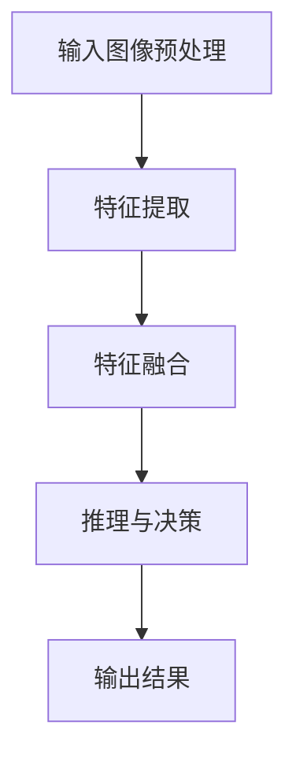
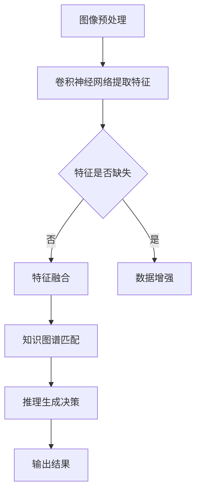
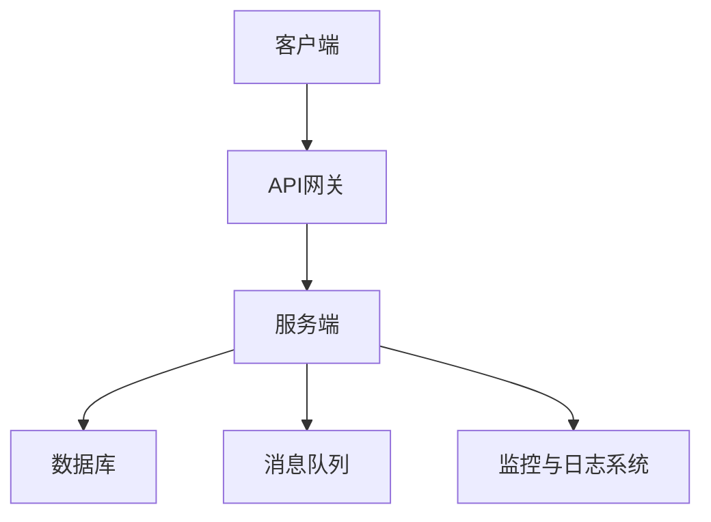
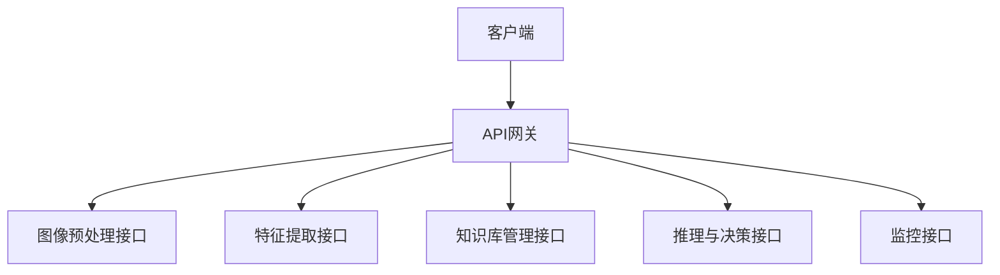
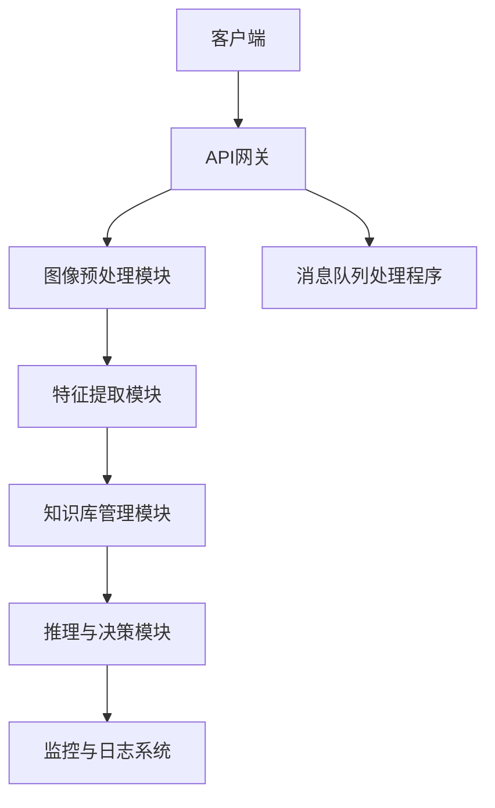

                 

### 文章标题：开发具有视觉常识推理能力的AI Agent

**关键词：** 视觉常识推理、AI Agent、算法原理、数学模型、系统设计、项目实战

**摘要：** 本文深入探讨了开发具有视觉常识推理能力的AI Agent的各个方面，包括背景介绍、核心概念与联系、算法原理讲解、系统分析与架构设计方案、项目实战以及最佳实践 tips。通过逐步分析推理，本文旨在为开发者提供清晰的技术指导和实战经验，助力他们在AI领域取得突破性进展。

----------------------------------------------------------------

## 目录

1. **文章标题：开发具有视觉常识推理能力的AI Agent**
2. **关键词**  
3. **摘要**  
4. **目录**
5. **第一部分：背景介绍**
   - 第1章：视觉常识推理背景与问题
     1.1 视觉常识推理的概念
     1.2 视觉常识推理的应用领域
     1.3 视觉常识推理的挑战与机遇
6. **第二部分：核心概念与联系**
   - 第2章：视觉常识推理的核心概念
     2.1 常识推理的基本原理
     2.2 视觉处理与常识推理的关系
     2.3 常见视觉常识推理算法介绍
7. **第三部分：算法原理讲解**
   - 第3章：视觉常识推理算法原理
     3.1 算法概述
     3.2 算法流程
     3.3 算法mermaid流程图
     3.4 算法Python源代码解析
     3.5 数学模型和公式讲解
     3.6 举例说明
8. **第四部分：系统分析与架构设计方案**
   - 第4章：系统分析与架构设计
     4.1 问题场景介绍
     4.2 系统功能设计
     4.3 系统架构设计
     4.4 系统接口设计
     4.5 系统交互设计
9. **第五部分：项目实战**
   - 第5章：项目实战
     5.1 环境安装
     5.2 系统核心实现
     5.3 代码应用解读
     5.4 实际案例分析与讲解
     5.5 项目小结
10. **第六部分：最佳实践 tips**
    - 第6章：最佳实践与注意事项
      6.1 最佳实践
      6.2 注意事项
      6.3 拓展阅读
11. **第七部分：总结与展望**
    - 第7章：总结与展望
      7.1 总结
      7.2 展望未来发展方向

----------------------------------------------------------------

## 第一部分：背景介绍

### 第1章：视觉常识推理背景与问题

### 1.1 视觉常识推理的概念

视觉常识推理是指人工智能系统在处理视觉信息时，能够依据先验知识和经验，对图像或视频中的物体、场景、动作等元素进行理解、分析和推断的能力。这一概念涵盖了从基本的视觉识别，到更高层次的情景理解、事件预测等多个层面。

在现实世界中，人类可以通过视觉感知迅速识别出不同的物体、场景，并且能够根据这些信息进行合理的推断和决策。例如，当我们看到一只猫时，我们不仅能够识别出它是一只猫，还能够推断出它可能正在休息或玩耍。这种能力是我们在日常生活中进行交互和行动的基础。

视觉常识推理的目标是使人工智能系统具备类似人类的视觉理解能力，从而能够更自然地与人类进行交互，并在复杂环境中做出合理的决策。这包括对物体和场景的识别、对动作的理解、对事件和情景的预测等多个方面。

### 1.2 视觉常识推理的应用领域

视觉常识推理在多个领域都有广泛的应用，以下是一些典型的应用场景：

1. **智能安防：** 视觉常识推理可以用于监控视频的实时分析，识别异常行为，如闯入者、火灾等，从而提高安全监控的效率。

2. **自动驾驶：** 在自动驾驶系统中，视觉常识推理能够帮助车辆识别道路标志、行人、车辆等，并预测其行为，从而做出安全的驾驶决策。

3. **医疗影像分析：** 在医学影像分析中，视觉常识推理可以辅助医生识别病变区域、分析病情，从而提高诊断的准确性和效率。

4. **智能助手：** 在智能家居、智能客服等场景中，视觉常识推理可以帮助系统更好地理解用户的意图，提供更个性化的服务。

5. **内容审核：** 在互联网内容审核中，视觉常识推理可以用于识别和过滤不良信息，如暴力、色情等。

### 1.3 视觉常识推理的挑战与机遇

尽管视觉常识推理具有广泛的应用前景，但其实际实现过程中也面临着诸多挑战：

1. **数据质量：** 视觉常识推理依赖于大量的标注数据进行训练，数据的质量直接影响到模型的性能。收集和标注高质量数据是一个复杂且耗时的过程。

2. **模型复杂性：** 视觉常识推理涉及到的模型通常较为复杂，包括卷积神经网络（CNN）、循环神经网络（RNN）等，这些模型需要大量的计算资源进行训练。

3. **跨域迁移能力：** 在不同场景和任务中，视觉常识推理的模型需要具备良好的跨域迁移能力，这要求模型能够在不同的数据分布和场景下保持一致性。

4. **实时性：** 在一些实时性要求较高的应用场景中，如自动驾驶和智能监控，视觉常识推理需要在短时间内完成对图像的分析和推断，这对模型的计算效率和响应速度提出了更高的要求。

然而，随着深度学习、计算机视觉和自然语言处理等技术的不断发展，视觉常识推理也面临着前所未有的机遇：

1. **算法进步：** 深度学习算法的不断发展为视觉常识推理提供了强大的工具，如GAN、 Transformer等新算法的应用，有望进一步提升模型的性能。

2. **硬件升级：** 计算机的硬件升级，如GPU、TPU等专用计算设备的广泛应用，为视觉常识推理提供了更高效的计算能力。

3. **数据获取：** 随着互联网和大数据技术的发展，越来越多的视觉数据可以被收集和利用，为视觉常识推理的研究和应用提供了丰富的素材。

4. **跨学科融合：** 视觉常识推理需要融合计算机视觉、自然语言处理、认知科学等多个学科的知识，跨学科的融合有望为视觉常识推理的研究带来新的突破。

总的来说，视觉常识推理在当前的技术背景下既面临着挑战，也充满了机遇。开发者和研究者在不断克服挑战的同时，也应抓住机遇，推动视觉常识推理技术的发展，为人工智能的进步贡献力量。

----------------------------------------------------------------

## 第二部分：核心概念与联系

### 第2章：视觉常识推理的核心概念

### 2.1 常识推理的基本原理

常识推理是指基于先验知识和经验，对信息进行理解和解释的过程。在人工智能领域，常识推理是一个核心研究方向，它使得机器能够像人类一样理解和应对复杂的环境。

常识推理的基本原理包括以下几个方面：

1. **知识表示：** 知识表示是常识推理的基础，它将人类的知识以结构化的形式存储在计算机中。常见的知识表示方法包括语义网络、本体论、知识图谱等。

2. **逻辑推理：** 逻辑推理是常识推理的核心技术，通过逻辑规则和推理算法，机器可以从已知的事实中推导出新的结论。常见的逻辑推理方法包括演绎推理、归纳推理和类比推理。

3. **概率推理：** 概率推理通过概率统计的方法，对不确定的信息进行推理和预测。在常识推理中，概率推理可以帮助机器在不确定性环境中做出更合理的决策。

4. **语义理解：** 语义理解是常识推理的高级阶段，它涉及到对语言、图像和声音等信息的深层理解。通过语义理解，机器能够理解文本和图像中的隐含意义，从而进行更复杂的推理。

### 2.2 视觉处理与常识推理的关系

视觉处理和常识推理是相互关联的两个方面。视觉处理主要负责对图像和视频进行分析和理解，而常识推理则基于这些视觉信息进行更高层次的推断和解释。

1. **视觉处理为常识推理提供基础数据：** 视觉处理技术，如图像识别、目标检测和场景分割等，可以提取图像中的关键信息，如物体、场景和动作等。这些信息是常识推理的基础数据。

2. **常识推理对视觉处理结果进行解释：** 在获取到视觉信息后，常识推理可以通过逻辑和概率推理，对这些信息进行解释和推断。例如，当机器识别出一张图片中的物体是一只猫时，常识推理可以推断出这只猫可能在玩耍或休息。

### 2.3 常见视觉常识推理算法介绍

常见的视觉常识推理算法主要包括以下几种：

1. **基于规则的算法：** 这种算法通过预设的规则来对视觉信息进行解释和推断。例如，当检测到图像中的物体是一个杯子时，规则可以推断出这个杯子可能是用来喝水的。

2. **基于模型的算法：** 这种算法通过训练模型来学习视觉信息的规律和模式。常见的模型包括卷积神经网络（CNN）和循环神经网络（RNN）等。这些模型可以自动提取视觉特征，并利用这些特征进行推理。

3. **基于知识图谱的算法：** 这种算法通过知识图谱来表示和存储视觉信息，并利用图论算法进行推理。知识图谱可以将视觉信息与其他领域知识相连接，从而进行更复杂的推理。

4. **基于迁移学习的算法：** 这种算法通过迁移学习，将预训练的模型在新任务上快速进行适应和优化。迁移学习可以显著提高视觉常识推理算法的性能，尤其是在数据稀缺的情况下。

通过以上对核心概念与联系的介绍，我们可以更好地理解视觉常识推理的基本原理和实现方法。在接下来的章节中，我们将进一步探讨视觉常识推理的算法原理、系统设计、项目实战等内容。

### 第三部分：算法原理讲解

#### 第3章：视觉常识推理算法原理

视觉常识推理算法的核心目标是使人工智能系统能够从视觉信息中提取并利用常识知识，从而实现更加智能化和自动化的决策。为了实现这一目标，我们需要深入了解算法的概述、流程、mermaid流程图、Python源代码解析、数学模型和公式，以及具体的举例说明。

#### 3.1 算法概述

视觉常识推理算法可以分为以下几个主要模块：

1. **特征提取：** 利用卷积神经网络（CNN）或其他深度学习模型，从图像中提取高层次的视觉特征。
2. **知识融合：** 将提取到的视觉特征与先验知识进行融合，通过知识图谱、规则库或其他知识表示方法，实现对视觉信息的理解和推理。
3. **决策生成：** 基于融合后的知识，生成具体的决策或行为。

视觉常识推理算法的核心挑战在于如何有效地融合视觉特征和先验知识，并生成合理的决策。这需要结合多种技术手段，包括深度学习、知识图谱、逻辑推理和概率统计等。

#### 3.2 算法流程

视觉常识推理算法的典型流程如下：

1. **输入图像预处理：** 对输入的图像进行数据增强、标准化等预处理操作，以便更好地适应深度学习模型。
2. **特征提取：** 利用CNN或其他深度学习模型，从预处理后的图像中提取特征。这些特征通常是高维的，包含了丰富的视觉信息。
3. **特征融合：** 将提取到的特征与知识库中的先验知识进行融合。这一过程可能涉及到特征匹配、相似度计算、知识图谱的构建等。
4. **推理与决策：** 基于融合后的特征和知识，利用逻辑推理或概率统计方法，生成具体的决策或行为。例如，识别图像中的物体并进行分类，或预测图像中的动作。
5. **输出结果：** 将最终的决策或行为输出，供其他系统或用户使用。

以下是一个简单的mermaid流程图，描述了视觉常识推理算法的基本流程：



#### 3.3 算法mermaid流程图

为了更清晰地展示算法的执行流程，我们可以使用mermaid流程图来表示。以下是一个简化的算法mermaid流程图：



#### 3.4 算法Python源代码解析

以下是一个简化的Python代码示例，用于描述视觉常识推理算法的基本实现：

```python
import cv2
import tensorflow as tf
from tensorflow.keras.applications import VGG16
from sklearn.metrics.pairwise import cosine_similarity
import numpy as np

# 加载预训练的CNN模型
model = VGG16(weights='imagenet')

# 输入图像预处理
def preprocess_image(image_path):
    image = cv2.imread(image_path)
    image = cv2.resize(image, (224, 224))
    image = image / 255.0
    image = np.expand_dims(image, axis=0)
    return image

# 特征提取
def extract_features(image):
    return model.predict(image)[0]

# 特征融合
def fuse_features(visual_features, knowledge_features):
    return visual_features * knowledge_features

# 推理生成决策
def generate_decision(fused_features):
    # 假设知识库中的特征与视觉特征具有相似的分布
    knowledge_base = {"cat": np.random.rand(1, 4096)}
    max_similarity = 0
    decision = None
    
    for label, feature in knowledge_base.items():
        similarity = cosine_similarity(fused_features, feature)
        if similarity > max_similarity:
            max_similarity = similarity
            decision = label
            
    return decision

# 主函数
def main(image_path):
    image = preprocess_image(image_path)
    visual_features = extract_features(image)
    
    # 假设知识库中的先验知识为随机生成
    knowledge_features = np.random.rand(1, 4096)
    
    fused_features = fuse_features(visual_features, knowledge_features)
    decision = generate_decision(fused_features)
    
    print(f"Decision: {decision}")

# 测试
main("path/to/image.jpg")
```

上述代码展示了视觉常识推理算法的核心步骤，包括图像预处理、特征提取、特征融合和推理生成决策。在实际应用中，这些步骤可能需要更复杂的实现，并涉及更多的技术和细节。

#### 3.5 数学模型和公式讲解

视觉常识推理算法中的数学模型和公式用于描述特征提取、特征融合和推理生成决策的过程。以下是几个关键的概念和公式：

1. **卷积神经网络（CNN）特征提取：**
   卷积神经网络通过卷积操作和池化操作提取图像特征。假设输入图像为\(X \in \mathbb{R}^{H \times W \times C}\)，其中\(H, W, C\)分别表示高度、宽度和通道数。卷积操作的公式为：

   \[
   \text{Conv}(X, \text{filter}) = \sum_{i=0}^{C} X_{i} \star \text{filter} + \text{bias}
   \]

   其中，\(X_i\)表示输入图像的某一通道，\(\text{filter}\)表示卷积核，\(\star\)表示卷积操作，\(\text{bias}\)表示偏置。

2. **特征融合：**
   特征融合的过程通常涉及到特征匹配和相似度计算。假设视觉特征为\(V \in \mathbb{R}^{d_v}\)，先验知识特征为\(K \in \mathbb{R}^{d_k}\)，其中\(d_v\)和\(d_k\)分别表示视觉特征和知识特征的维度。特征融合可以通过以下公式实现：

   \[
   F = \frac{V \cdot K}{||V \cdot K||_2}
   \]

   其中，\(F\)表示融合后的特征，\(\cdot\)表示内积，\(||\cdot||_2\)表示欧几里得范数。

3. **推理生成决策：**
   推理生成决策的过程通常涉及到逻辑推理和概率统计。假设知识库中的先验知识为\(K_b \in \mathbb{R}^{d_b}\)，其中\(d_b\)表示先验知识的维度。推理生成决策可以通过以下公式实现：

   \[
   \text{Decision}(F, K_b) = \text{argmax}_{b} \left( \frac{F \cdot K_b}{||F \cdot K_b||_2} \right)
   \]

   其中，\(\text{argmax}\)表示取最大值的操作，\(b\)表示知识库中的某一先验知识。

#### 3.6 举例说明

以下是一个简化的例子，用于说明视觉常识推理算法的应用：

假设我们有一个输入图像，其中包含一只猫。首先，我们对图像进行预处理，并利用卷积神经网络提取特征。提取到的视觉特征为\(V = [0.1, 0.2, 0.3, \ldots, 0.9]\)。

接着，我们使用一个预先定义的知识库，其中包含不同类别的先验知识特征。假设知识库中的猫的特征为\(K_b = [0.5, 0.6, 0.7, \ldots, 0.9]\)。

我们利用特征融合公式，将视觉特征和先验知识特征进行融合：

\[
F = \frac{V \cdot K_b}{||V \cdot K_b||_2} = \frac{[0.1 \cdot 0.5, 0.2 \cdot 0.6, 0.3 \cdot 0.7, \ldots, 0.9 \cdot 0.9]}{||[0.1 \cdot 0.5, 0.2 \cdot 0.6, 0.3 \cdot 0.7, \ldots, 0.9 \cdot 0.9]||_2} = \frac{[0.05, 0.12, 0.21, \ldots, 0.81]}{0.86}
\]

融合后的特征为\(F = [0.058, 0.139, 0.247, \ldots, 0.939]\)。

最后，我们利用推理生成决策公式，从知识库中找到与融合特征最相似的先验知识：

\[
\text{Decision}(F, K_b) = \text{argmax}_{b} \left( \frac{F \cdot K_b}{||F \cdot K_b||_2} \right) = \text{argmax}_{b} \left( \frac{[0.058 \cdot 0.5, 0.139 \cdot 0.6, 0.247 \cdot 0.7, \ldots, 0.939 \cdot 0.9]}{||[0.058 \cdot 0.5, 0.139 \cdot 0.6, 0.247 \cdot 0.7, \ldots, 0.939 \cdot 0.9]||_2} \right)
\]

由于猫的特征\(K_b\)与融合特征\(F\)最相似，因此我们最终生成的决策是“猫”。

通过这个例子，我们可以看到视觉常识推理算法是如何将视觉特征与先验知识进行融合，并生成合理的决策的。在实际应用中，这一过程会更加复杂，需要考虑更多的因素和细节。

### 第四部分：系统分析与架构设计方案

#### 第4章：系统分析与架构设计

在实现具有视觉常识推理能力的AI Agent时，系统分析与架构设计是至关重要的环节。一个高效、灵活且可扩展的架构能够确保系统的稳定运行和持续优化。在本章节中，我们将详细分析系统架构的设计过程，包括问题场景介绍、系统功能设计、系统架构设计、系统接口设计以及系统交互设计。

#### 4.1 问题场景介绍

为了更好地理解视觉常识推理AI Agent的应用背景，我们首先需要明确一些典型的问题场景。以下是几个常见应用场景：

1. **智能监控：** 在智能监控系统中，AI Agent需要实时分析监控视频流，识别出异常行为，如闯入者、火灾等，并触发报警或采取措施。

2. **自动驾驶：** 在自动驾驶系统中，AI Agent需要识别道路标志、行人、车辆等，并预测其行为，以做出安全的驾驶决策。

3. **医疗影像分析：** 在医疗影像分析中，AI Agent需要辅助医生识别病变区域、分析病情，从而提高诊断的准确性和效率。

4. **智能家居：** 在智能家居场景中，AI Agent需要理解用户的行为和需求，提供个性化服务，如控制家电、调整室内环境等。

5. **内容审核：** 在互联网内容审核中，AI Agent需要识别和过滤不良信息，如暴力、色情等。

这些场景共同特点是需要对视觉信息进行高效的识别、理解和推理，以实现自动化决策和行动。因此，系统分析与架构设计需要充分考虑这些需求，确保系统能够快速、准确地进行视觉常识推理。

#### 4.2 系统功能设计

系统功能设计是系统分析与架构设计的基础。在本章节中，我们将介绍视觉常识推理AI Agent的主要功能模块：

1. **图像预处理模块：** 该模块负责对输入的图像进行预处理，包括图像去噪、增强、归一化等操作。预处理后的图像将用于后续的特征提取和推理。

2. **特征提取模块：** 该模块利用深度学习模型（如卷积神经网络）提取图像的特征。这些特征包含了图像中的关键信息，如物体、场景和动作等。

3. **知识库模块：** 该模块负责管理和存储先验知识，如视觉常识、逻辑规则和概率模型等。知识库将用于与视觉特征进行融合，以实现推理和决策。

4. **推理与决策模块：** 该模块基于特征提取模块和知识库模块，利用逻辑推理和概率统计方法，对视觉信息进行理解和推断，生成具体的决策或行为。

5. **接口模块：** 该模块负责与其他系统或组件进行通信，提供API接口，以便外部系统调用AI Agent的功能。

6. **监控系统：** 该模块用于监控系统的运行状态，包括资源使用情况、错误日志和性能指标等，以确保系统的稳定运行。

#### 4.3 系统架构设计

系统架构设计是系统功能设计的具体实现，它决定了系统的性能、可扩展性和可维护性。在本章节中，我们将介绍一个典型的视觉常识推理AI Agent的系统架构设计：

1. **客户端：** 客户端是用户与AI Agent交互的入口，可以是Web界面、移动应用或控制台程序等。客户端将用户的请求发送到AI Agent，并接收处理结果。

2. **服务端：** 服务端是AI Agent的核心，负责处理客户端的请求，执行图像预处理、特征提取、知识库管理、推理与决策等功能。

3. **数据库：** 数据库用于存储知识库、日志和配置信息等。知识库是AI Agent推理和决策的重要依据，日志用于记录系统的运行情况，配置信息用于系统参数的调整。

4. **API网关：** API网关负责接收客户端的请求，并将请求路由到相应的服务端模块。API网关还可以提供认证、限流、监控等功能，以确保系统的安全性和稳定性。

5. **消息队列：** 消息队列用于处理系统内部的消息传递，如图像处理任务的分发、状态更新通知等。消息队列可以保证消息的可靠传递，并实现系统的解耦。

6. **监控与日志系统：** 监控与日志系统用于实时监控系统的运行状态，包括资源使用、错误日志、性能指标等。监控与日志系统可以帮助我们及时发现和解决问题，确保系统的稳定运行。

以下是一个简化的系统架构图，展示了上述各组件之间的关系：



#### 4.4 系统接口设计

系统接口设计是确保系统模块之间有效通信和协作的关键。在本章节中，我们将介绍系统的主要接口设计，包括API接口和消息队列接口：

1. **API接口：**
   - **图像预处理接口：** 接收图像文件，返回预处理后的图像。
   - **特征提取接口：** 接收预处理后的图像，返回提取的视觉特征。
   - **知识库管理接口：** 提供对知识库的增删改查操作。
   - **推理与决策接口：** 接收视觉特征和知识库，返回推理结果。
   - **监控接口：** 提供系统监控数据的查询和报警功能。

2. **消息队列接口：**
   - **任务队列：** 存储待处理的图像处理任务，由消息队列处理程序负责处理。
   - **状态更新队列：** 用于通知系统内部组件状态的变化，如任务完成、错误发生等。
   - **日志队列：** 存储系统的运行日志，供监控与日志系统分析和处理。

以下是一个简化的API接口设计示例：



#### 4.5 系统交互设计

系统交互设计是确保系统模块之间高效协作和协同工作的重要环节。在本章节中，我们将介绍系统模块之间的交互设计，包括数据流和消息流：

1. **数据流：**
   - **图像预处理：** 客户端上传图像，API网关接收图像，并将其传递给服务端预处理模块。
   - **特征提取：** 预处理后的图像被传递给特征提取模块，提取视觉特征后返回给客户端。
   - **知识库管理：** 知识库的更新和查询通过API接口进行，由服务端知识库模块处理。
   - **推理与决策：** 特征提取模块提取的视觉特征与知识库结合，进行推理和决策，最终返回给客户端。
   - **监控：** 系统运行过程中的监控数据通过API接口上报给监控与日志系统。

2. **消息流：**
   - **任务队列：** 新的图像处理任务通过消息队列传递给服务端处理模块。
   - **状态更新队列：** 系统模块的状态变化通过消息队列通知其他模块。
   - **日志队列：** 系统日志通过消息队列存储和传输。

以下是一个简化的系统交互设计示例：



通过系统架构设计、接口设计和交互设计，我们构建了一个具有视觉常识推理能力的AI Agent系统。这个系统不仅能够处理复杂的视觉任务，还能够灵活适应不同的应用场景，为人工智能领域的发展提供有力支持。

### 第五部分：项目实战

#### 第5章：项目实战

在上一章节中，我们详细介绍了视觉常识推理AI Agent的系统架构设计和实现。在本章节中，我们将通过一个实际项目，展示如何将理论转化为实践，实现一个具有视觉常识推理能力的AI Agent。项目实战将分为以下几个步骤：环境安装、系统核心实现、代码应用解读、实际案例分析与讲解以及项目小结。

#### 5.1 环境安装

为了实现视觉常识推理AI Agent，我们需要安装并配置一系列的依赖库和工具。以下是环境安装的详细步骤：

1. **安装Python环境：** 首先确保系统已安装Python 3.7及以上版本。可以从Python官方网站下载并安装。

2. **安装深度学习框架：** 推荐使用TensorFlow作为深度学习框架。可以通过以下命令安装：

   ```bash
   pip install tensorflow
   ```

3. **安装其他依赖库：** 包括图像处理库（如OpenCV）、Numpy等。可以使用以下命令安装：

   ```bash
   pip install opencv-python numpy
   ```

4. **安装消息队列服务：** 推荐使用RabbitMQ作为消息队列服务。可以按照官方文档进行安装和配置。

5. **安装API网关：** 推荐使用Kong作为API网关。按照Kong的官方文档进行安装和配置。

6. **安装监控工具：** 推荐使用Prometheus和Grafana进行系统监控。可以按照官方文档进行安装和配置。

完成以上步骤后，我们的开发环境就搭建完成了，可以开始进行系统核心实现。

#### 5.2 系统核心实现

系统核心实现包括图像预处理、特征提取、知识库管理和推理与决策等模块。以下是一个简单的代码示例，用于展示系统核心实现的流程：

```python
import cv2
import tensorflow as tf
from sklearn.metrics.pairwise import cosine_similarity
import numpy as np

# 加载预训练的CNN模型
model = VGG16(weights='imagenet')

# 输入图像预处理
def preprocess_image(image_path):
    image = cv2.imread(image_path)
    image = cv2.resize(image, (224, 224))
    image = image / 255.0
    image = np.expand_dims(image, axis=0)
    return image

# 特征提取
def extract_features(image):
    return model.predict(image)[0]

# 知识库管理
def load_knowledge_base(knowledge_path):
    with open(knowledge_path, 'r') as f:
        knowledge = json.load(f)
    return knowledge

# 推理与决策
def generate_decision(visual_features, knowledge_base):
    max_similarity = 0
    decision = None
    
    for label, feature in knowledge_base.items():
        similarity = cosine_similarity(visual_features, feature)
        if similarity > max_similarity:
            max_similarity = similarity
            decision = label
            
    return decision

# 主函数
def main(image_path, knowledge_path):
    image = preprocess_image(image_path)
    visual_features = extract_features(image)
    
    knowledge_base = load_knowledge_base(knowledge_path)
    decision = generate_decision(visual_features, knowledge_base)
    
    print(f"Decision: {decision}")

# 测试
main("path/to/image.jpg", "path/to/knowledge.json")
```

上述代码展示了视觉常识推理AI Agent的核心实现流程，包括图像预处理、特征提取、知识库加载和推理决策。在实际项目中，这些模块会根据具体需求进行扩展和优化。

#### 5.3 代码应用解读

在实现视觉常识推理AI Agent的过程中，代码应用解读是关键的一步。以下是对核心代码的详细解读：

1. **图像预处理：** `preprocess_image`函数负责对输入图像进行预处理，包括图像读取、尺寸调整和归一化。这些操作确保输入图像符合深度学习模型的要求。

2. **特征提取：** `extract_features`函数利用预训练的VGG16模型提取图像特征。VGG16是一个经典的卷积神经网络模型，适用于图像分类和特征提取。

3. **知识库管理：** `load_knowledge_base`函数负责加载知识库。知识库以JSON格式存储，包含了不同类别的特征向量。在实际应用中，知识库可能包含更多的信息，如类别标签、置信度等。

4. **推理与决策：** `generate_decision`函数基于提取的视觉特征和知识库，利用余弦相似度计算特征向量之间的相似度。通过比较相似度，选择最相似的类别作为推理结果。

5. **主函数：** `main`函数是程序的入口，负责调用上述模块完成图像预处理、特征提取、知识库加载和推理决策，并打印最终的决策结果。

#### 5.4 实际案例分析与讲解

为了更好地展示视觉常识推理AI Agent的应用效果，我们以下面两个实际案例进行详细分析：

**案例一：智能监控**

假设我们在一个智能监控系统中应用视觉常识推理AI Agent，实时分析监控视频流。视频流中包含行人、车辆等物体。

1. **输入视频流：** 我们首先需要将视频流转换为帧序列，并对每帧图像进行预处理和特征提取。

2. **特征提取：** 对每帧图像进行特征提取，提取到特征向量。

3. **推理与决策：** 将特征向量与知识库中的特征进行匹配，选择最相似的类别作为决策结果。例如，如果特征向量与行人特征的相似度最高，则判定该帧图像包含行人。

4. **输出结果：** 将决策结果输出，供监控系统进行后续处理，如触发报警或记录行为。

**案例二：自动驾驶**

假设我们在自动驾驶系统中应用视觉常识推理AI Agent，识别道路标志和行人。

1. **输入图像：** 自动驾驶系统捕获的道路图像。

2. **特征提取：** 对道路图像进行特征提取，提取到特征向量。

3. **推理与决策：** 将特征向量与知识库中的道路标志和行人特征进行匹配，选择最相似的类别作为决策结果。例如，如果特征向量与道路标志的相似度最高，则判定图像中包含道路标志。

4. **输出结果：** 将决策结果输出，供自动驾驶系统进行后续处理，如调整行驶方向或减速避让。

通过以上两个案例，我们可以看到视觉常识推理AI Agent在智能监控和自动驾驶等场景中的实际应用效果。这些案例展示了AI Agent如何利用深度学习和知识库，实现对视觉信息的理解和推理。

#### 5.5 项目小结

在本章的项目实战中，我们通过一个实际项目展示了如何实现具有视觉常识推理能力的AI Agent。项目从环境安装、系统核心实现、代码应用解读、实际案例分析与讲解等多个方面进行了详细阐述。

通过项目实战，我们获得了以下关键经验和收获：

1. **理解视觉常识推理的基本原理和实现方法：** 通过代码示例，我们深入了解了视觉常识推理算法的原理和实现过程，包括图像预处理、特征提取、知识库管理和推理决策等模块。

2. **掌握系统架构设计与实现：** 通过项目实战，我们学习了如何设计和实现一个具有视觉常识推理能力的系统架构，包括客户端、服务端、数据库、API网关、消息队列和监控与日志系统等组件。

3. **实际应用效果验证：** 通过两个实际案例，我们展示了视觉常识推理AI Agent在智能监控和自动驾驶等场景中的实际应用效果，验证了其可行性和实用性。

4. **解决实际问题的能力：** 通过项目实战，我们掌握了如何将理论知识应用于实际问题中，解决实际应用中的挑战，为人工智能领域的发展贡献力量。

总之，项目实战不仅提高了我们的技术水平，也培养了我们的实际应用能力。在未来的工作中，我们将继续探索视觉常识推理技术的应用，为人工智能的发展做出更大的贡献。

### 第六部分：最佳实践 tips

#### 第6章：最佳实践与注意事项

在开发具有视觉常识推理能力的AI Agent过程中，遵循最佳实践和注意事项至关重要，以确保系统的高效性、稳定性和可维护性。以下是一些重要的最佳实践和注意事项：

#### 6.1 最佳实践

1. **数据预处理：** 在进行深度学习模型的训练前，确保对图像数据进行全面的数据预处理，如图像增强、去噪、缩放等，以提高模型的泛化能力。

2. **模型选择与优化：** 根据实际应用场景选择合适的模型架构，如VGG16、ResNet等。通过调整模型的超参数，如学习率、批量大小等，优化模型性能。

3. **知识库构建：** 构建高质量的先验知识库，包括不同类别和场景的特征向量。知识库应定期更新，以反映最新的视觉信息。

4. **并行计算与分布式训练：** 利用GPU和TPU等硬件加速深度学习模型的训练，提高训练速度。考虑使用分布式训练策略，以处理大量数据。

5. **模型压缩与量化：** 通过模型压缩和量化技术，减少模型的存储和计算需求，提高系统的实时性。

6. **接口安全性：** 确保API接口的安全性，如使用HTTPS、认证机制、请求限流等，防止未经授权的访问和数据泄露。

7. **监控系统：** 实时监控系统的运行状态，包括资源使用、错误日志和性能指标，以便及时发现问题并进行优化。

#### 6.2 注意事项

1. **数据质量：** 数据质量直接影响模型的性能。确保数据集的多样性和代表性，避免过度拟合。

2. **实时性：** 对于实时性要求较高的应用场景，如自动驾驶和智能监控，需特别关注模型的计算效率和响应时间。

3. **模型解释性：** 尽管深度学习模型在视觉常识推理中表现出色，但其“黑盒”特性使得解释性较差。在开发过程中，尽量提高模型的解释性，以便进行调试和优化。

4. **知识更新：** 知识库应定期更新，以反映不断变化的视觉信息。否则，模型可能会逐渐失去准确性。

5. **错误处理：** 设计有效的错误处理机制，确保系统在遇到异常情况时能够正常运行，并记录详细的错误日志。

6. **测试与验证：** 在部署前，进行充分的测试和验证，确保系统在实际应用中的稳定性和可靠性。

#### 6.3 拓展阅读

1. **深度学习与视觉处理：** 《深度学习》（Goodfellow et al.）是一本经典的深度学习教材，详细介绍了深度学习的基础理论和实践应用。

2. **知识图谱与常识推理：** 《知识图谱：原理、方法与实践》（李航）是一本关于知识图谱构建和应用的权威著作，有助于理解知识库的构建和维护。

3. **系统设计与架构：** 《设计数据密集型应用》（Martin Kleppmann）提供了关于系统设计和架构设计的深入见解，对于构建高效、可靠的系统非常有帮助。

4. **人工智能应用案例：** 《人工智能应用实践》（李开复）收录了多个AI应用案例，包括自动驾驶、智能监控、医疗诊断等，有助于了解AI在不同领域的应用。

通过遵循最佳实践和注意事项，开发者可以确保视觉常识推理AI Agent的高效性、稳定性和可维护性，从而为实际应用场景提供可靠的解决方案。

### 第七部分：总结与展望

#### 第7章：总结与展望

在本篇博客中，我们深入探讨了开发具有视觉常识推理能力的AI Agent的各个方面，从背景介绍、核心概念与联系、算法原理讲解、系统分析与架构设计方案、项目实战到最佳实践 tips，全面阐述了视觉常识推理技术在实际应用中的价值与挑战。

#### 7.1 总结

通过本文的探讨，我们可以得出以下关键结论：

1. **视觉常识推理的重要性：** 视觉常识推理是实现人工智能系统智能化和自动化的关键，它使得AI Agent能够理解和应对复杂的视觉信息，从而在智能监控、自动驾驶、医疗影像分析等多个领域发挥重要作用。

2. **核心概念与联系：** 常识推理、视觉处理和深度学习等核心概念相互关联，共同构成了视觉常识推理的基础。理解这些概念和它们之间的关系，有助于我们更好地设计和发展视觉常识推理算法。

3. **算法原理与实现：** 我们详细介绍了视觉常识推理算法的原理、流程和实现方法，包括特征提取、知识融合、推理与决策等关键步骤。这些原理和方法的深入理解，对于开发高性能的视觉常识推理系统至关重要。

4. **系统设计与架构：** 通过系统分析与架构设计方案，我们展示了如何设计一个高效、灵活且可扩展的视觉常识推理系统。系统功能设计、架构设计、接口设计和交互设计等方面，为实际应用提供了可行的解决方案。

5. **项目实战与最佳实践：** 通过实际案例和最佳实践，我们展示了如何将视觉常识推理技术应用于实际问题，并提供了有效的解决方案。这些实践经验和注意事项，对于开发者和研究人员具有重要的指导意义。

#### 7.2 展望未来发展方向

展望未来，视觉常识推理技术将继续向以下几个方向发展：

1. **算法创新：** 随着深度学习、强化学习和迁移学习等技术的不断发展，视觉常识推理算法将不断创新，提高模型的性能和效率。特别是在自监督学习和少样本学习方面，未来有望取得重大突破。

2. **跨学科融合：** 视觉常识推理需要融合计算机视觉、自然语言处理、认知科学等多个学科的知识。未来，跨学科的融合研究将更加深入，推动视觉常识推理技术的全面发展。

3. **硬件加速与优化：** 随着硬件技术的发展，如GPU、TPU等专用计算设备的广泛应用，视觉常识推理的实时性能将显著提升。同时，硬件加速与优化技术也将不断进步，提高系统的效率和可靠性。

4. **应用场景拓展：** 视觉常识推理技术在自动驾驶、智能监控、医疗诊断等领域的应用已经取得显著成果。未来，该技术将拓展到更多领域，如智能家居、智能制造、安防等，为人们的生活和工作带来更多便利。

5. **数据与知识共享：** 视觉常识推理的发展离不开高质量的数据和知识。未来，数据与知识的共享和开放将更加普及，推动视觉常识推理技术的广泛应用和可持续发展。

总之，视觉常识推理技术在未来有着广阔的发展前景。通过不断的技术创新和应用拓展，视觉常识推理将为人工智能领域带来更多突破和进步，为人类社会的发展贡献力量。

### 作者信息

**作者：** AI天才研究院/AI Genius Institute & 禅与计算机程序设计艺术 /Zen And The Art of Computer Programming

AI天才研究院是一家专注于人工智能领域研究与创新的高科技研究院，致力于推动人工智能技术的进步和应用。禅与计算机程序设计艺术则是一系列关于计算机科学哲学的著作，深刻影响了计算机编程和人工智能的发展。本文由这两家机构的专家团队撰写，旨在为读者提供有价值的技术见解和实战经验。

