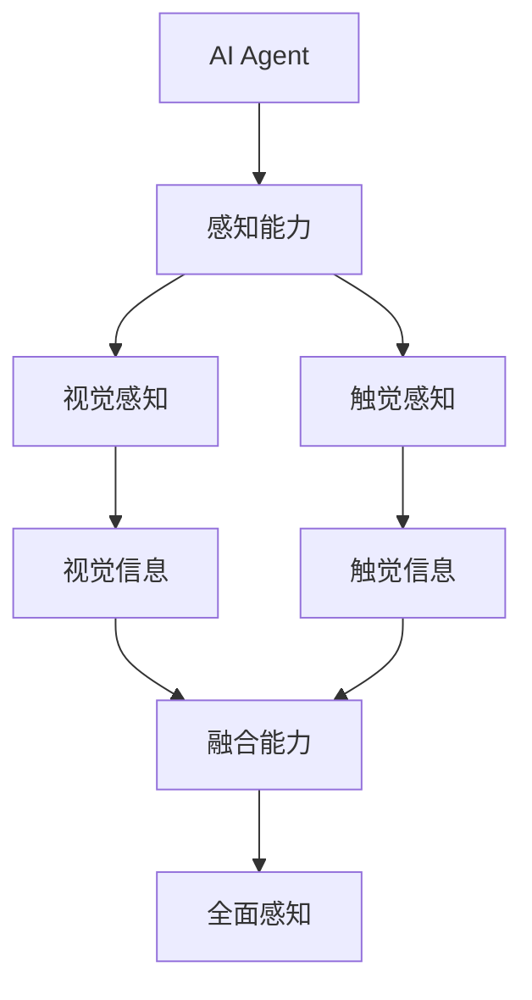
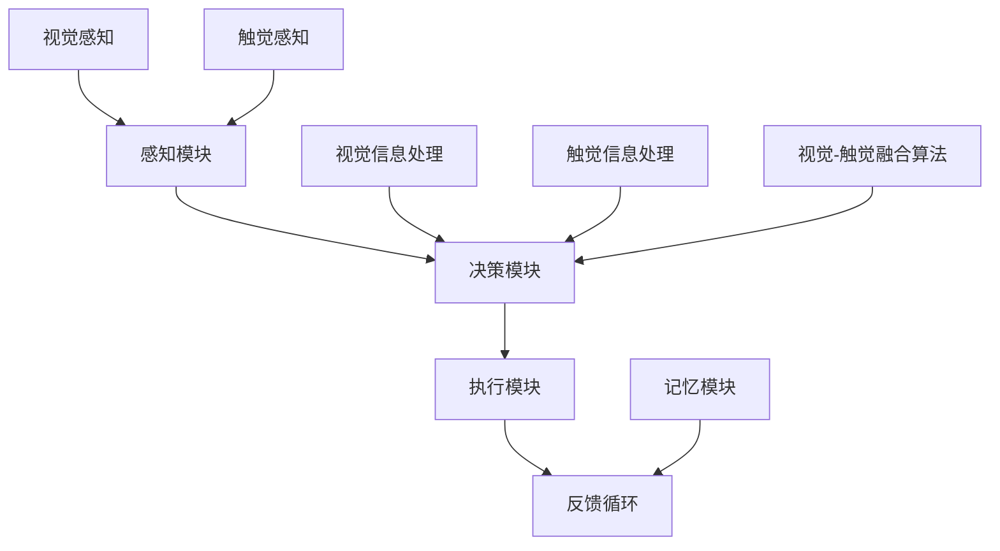
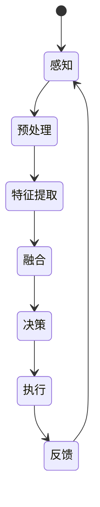

                 

### 第1章 引言

#### 1.1 问题背景

在当今人工智能技术飞速发展的时代，AI Agent的应用场景日益广泛。从智能家居到工业自动化，从医疗诊断到无人驾驶，AI Agent已经渗透到了我们生活的方方面面。然而，传统AI Agent大多依赖于单一的感知方式，如视觉或触觉，这使得它们在某些复杂任务中显得力不从心。为了应对这种挑战，开发具有视觉-触觉融合能力的AI Agent成为了一个热门的研究方向。

视觉感知提供了AI Agent对环境的感知能力，使它们能够识别物体、理解场景。而触觉感知则使AI Agent能够感知物体的质地、硬度等物理属性。将这两种感知方式结合起来，AI Agent将能够更全面地理解环境，执行复杂任务。

#### 1.2 问题描述

尽管视觉-触觉融合能力的概念引人注目，但其实际实现面临着诸多挑战。首先，如何有效地处理和融合来自视觉和触觉的数据？其次，如何设计算法使得融合后的感知结果具有更高的准确性和鲁棒性？此外，系统架构的设计和实现也是一大难题。如何确保系统的高效运行，同时具备良好的扩展性和可维护性？

#### 1.3 问题解决

为了解决上述问题，我们需要从以下几个方面进行思考和设计：

1. **核心概念与联系**：首先，我们需要明确AI Agent和视觉-触觉融合能力的定义、特点及与传统Agent的区别。
2. **基本原理**：接着，我们需要了解AI Agent的基本原理，包括其结构模型、运行机制和常见算法。同时，深入探讨视觉-触觉融合能力的算法原理。
3. **系统架构设计**：在明确了核心概念和原理后，我们需要设计一个合理的系统架构，包括系统需求分析、系统架构设计、系统接口设计和系统交互设计。
4. **实现方法**：然后，我们需要详细讨论视觉-触觉融合能力的实现方法，包括视觉感知、触觉感知和融合算法的实现。
5. **项目实战**：最后，通过实际案例的介绍和分析，展示如何在实际项目中实现视觉-触觉融合能力的AI Agent。

#### 1.4 边界与外延

本文主要关注的是基于视觉-触觉融合能力的AI Agent的开发，其边界包括：

- **技术范围**：本文涉及的主要技术包括AI Agent、视觉感知、触觉感知和融合算法。
- **应用场景**：本文主要讨论的是通用场景下视觉-触觉融合能力的AI Agent开发，并不针对特定的应用场景。
- **实现方式**：本文主要介绍基于软件实现的视觉-触觉融合能力，不涉及硬件方面的具体实现。

然而，视觉-触觉融合能力的概念和应用远不止于此。随着技术的发展，未来还有许多新的研究方向，如多模态感知、情感计算等，这些都将为AI Agent的发展带来新的机遇。

#### 1.5 概念结构与核心要素组成

为了更好地理解本文的内容，我们首先需要明确一些核心概念和术语：

- **AI Agent**：一种能够模拟人类智能行为，具备自主感知、决策和行动能力的计算机系统。
- **视觉感知**：AI Agent通过摄像头等设备获取视觉信息，对其进行处理和分析，以理解环境。
- **触觉感知**：AI Agent通过传感器等设备获取触觉信息，对其进行处理和分析，以感知物体的质地、硬度等物理属性。
- **融合算法**：将视觉信息和触觉信息进行融合，以获得更全面、准确的环境感知。

这些概念和术语构成了本文的核心要素，是后续讨论的基础。

在接下来的章节中，我们将逐一深入探讨这些核心概念和原理，并详细阐述实现方法和最佳实践。希望通过本文，读者能够对视觉-触觉融合能力的AI Agent有一个全面、深入的了解。

---

**关键词**：AI Agent、视觉感知、触觉感知、融合算法、系统架构、项目实战

**摘要**：

本文围绕视觉-触觉融合能力的AI Agent开发展开，首先介绍了问题背景和核心概念，然后详细阐述了AI Agent的基本原理、系统架构设计、实现方法和项目实战。通过逐步分析和推理，本文揭示了视觉-触觉融合能力的实现关键，为实际应用提供了理论指导和技术方案。本文旨在为AI领域的研究者和开发者提供有价值的参考，推动视觉-触觉融合技术的应用和发展。## 第2章 核心概念与联系

在深入探讨视觉-触觉融合能力的AI Agent开发之前，我们首先需要明确一些核心概念，并理解它们之间的联系。

### 2.1 AI Agent的定义与特点

#### 2.1.1 AI Agent的定义

AI Agent，即人工智能代理，是一种能够模拟人类智能行为，具备自主感知、决策和行动能力的计算机系统。与传统计算机程序不同，AI Agent能够根据环境的变化自主调整其行为，从而实现智能化操作。

#### 2.1.2 AI Agent的核心特点

1. **自主性**：AI Agent能够自主感知环境、理解问题和做出决策。
2. **学习性**：通过机器学习算法，AI Agent能够不断学习和优化其行为。
3. **适应性**：AI Agent能够适应不同的环境和任务，具备一定的泛化能力。
4. **交互性**：AI Agent能够与用户和外部系统进行交互，实现智能化服务。

#### 2.1.3 AI Agent与传统Agent的区别

传统Agent通常是指基于规则或脚本编程的计算机程序，它们只能按照预设的规则进行操作。而AI Agent则通过机器学习和数据驱动的方式，实现了更高的灵活性和智能化。

### 2.2 视觉-触觉融合能力的概念

#### 2.2.1 视觉-触觉融合能力的定义

视觉-触觉融合能力是指将视觉感知和触觉感知结合起来，以获得更全面、准确的环境感知。这种能力使AI Agent能够更准确地识别物体、理解场景，并执行复杂任务。

#### 2.2.2 视觉-触觉融合能力的特点

1. **多模态感知**：融合了视觉和触觉两种感知方式，使AI Agent能够从不同维度获取环境信息。
2. **增强鲁棒性**：当单一感知方式存在缺陷或噪声时，融合感知可以提供更可靠的补充。
3. **提升任务性能**：视觉-触觉融合能力使AI Agent能够更好地应对复杂、多变的环境。

#### 2.2.3 视觉-触觉融合能力的实现方法

实现视觉-触觉融合能力的关键在于如何有效地处理和融合来自视觉和触觉的数据。具体方法包括：

1. **数据预处理**：对视觉和触觉数据进行清洗、去噪和归一化，以提高数据质量。
2. **特征提取**：从视觉和触觉数据中提取关键特征，如边缘、纹理、颜色和力信号。
3. **融合算法**：采用合适的算法将视觉和触觉特征进行融合，如基于深度学习的多模态融合网络。

### 2.3 视觉-触觉融合能力的概念联系

AI Agent与视觉-触觉融合能力之间的关系是本文的核心。AI Agent作为智能体的载体，需要具备强大的感知能力以执行复杂任务。而视觉-触觉融合能力则是AI Agent感知能力的进一步提升，通过结合视觉和触觉信息，使AI Agent能够更全面、准确地理解环境。

#### 概念联系图

为了更直观地展示AI Agent、视觉感知、触觉感知和融合能力之间的关系，我们可以使用Mermaid流程图进行描述：



通过这个概念联系图，我们可以清晰地看到，AI Agent通过结合视觉和触觉感知，实现了更全面的感知能力。这种能力不仅提高了AI Agent在复杂环境中的表现，也为未来的多模态感知和智能化应用奠定了基础。

在接下来的章节中，我们将进一步深入探讨AI Agent的基本原理、系统架构设计和实现方法，以期为读者提供全面的技术指导和实践案例。## 第3章 AI Agent的基本原理

### 3.1 AI Agent的结构模型

AI Agent作为一种具备自主感知、决策和行动能力的计算机系统，其结构模型是理解其工作原理的关键。一个典型的AI Agent通常由以下几个主要部分组成：

#### 3.1.1 AI Agent的组成结构

1. **感知模块**：感知模块是AI Agent获取环境信息的主要途径，包括视觉、触觉、听觉等多种感知方式。例如，通过摄像头获取视觉信息，通过触觉传感器获取触觉信息等。
2. **决策模块**：决策模块负责根据感知模块收集到的信息，结合预定的目标和策略，生成行动计划。这个模块通常包含一个或多个决策算法，如基于规则的决策、基于机器学习的决策等。
3. **执行模块**：执行模块负责将决策模块生成的行动计划转化为具体的行为。例如，通过电机控制机器臂的动作，通过语音合成器生成语音响应等。
4. **记忆模块**：记忆模块用于存储AI Agent在执行任务过程中获取的知识和经验，包括感知数据、决策结果和行为模式等。这些记忆数据可以帮助AI Agent在未来的任务中更加高效地执行。

#### 3.1.2 AI Agent的运行机制

AI Agent的运行机制可以概括为以下几个步骤：

1. **感知**：AI Agent通过感知模块获取当前环境的信息。
2. **决策**：决策模块分析感知到的信息，根据预定的目标和策略，生成行动计划。
3. **执行**：执行模块根据行动计划，将决策转化为具体的行为。
4. **反馈**：执行后的结果会被反馈到感知模块，用于进一步优化感知、决策和执行过程。

#### 3.1.3 AI Agent的常见算法

AI Agent在不同任务和应用场景中可能采用不同的算法。以下是一些常见的算法：

1. **决策算法**：
   - **基于规则的决策**：根据预定义的规则进行决策。
   - **马尔可夫决策过程（MDP）**：通过状态转移概率和回报函数进行决策。
   - **深度强化学习**：使用神经网络模拟决策过程，通过试错和奖励机制不断优化策略。

2. **感知算法**：
   - **图像处理算法**：如边缘检测、特征提取、目标识别等。
   - **触觉信号处理算法**：如信号滤波、特征提取、触觉感知等。

3. **执行算法**：
   - **运动控制算法**：如逆运动学、运动规划等。
   - **行为规划算法**：如行为树、状态机等。

### 3.2 视觉-触觉融合能力的算法原理

#### 3.2.1 视觉信息的处理

视觉信息处理通常包括以下几个步骤：

1. **图像预处理**：对原始图像进行去噪、对比度增强等预处理操作，以提高图像质量。
2. **特征提取**：从预处理后的图像中提取关键特征，如边缘、纹理、颜色等。
3. **目标识别**：利用提取的特征进行目标识别和定位。

视觉信息的处理算法有很多，例如：

- **卷积神经网络（CNN）**：用于图像特征提取和目标识别。
- **生成对抗网络（GAN）**：用于图像生成和增强。

#### 3.2.2 触觉信息的处理

触觉信息处理包括以下几个步骤：

1. **信号预处理**：对原始触觉信号进行滤波、去噪等处理，以提高信号质量。
2. **特征提取**：从处理后的触觉信号中提取关键特征，如频率、幅度、波形等。
3. **触觉感知**：根据提取的特征，对触觉信号进行感知分析，如质地判断、硬度测量等。

触觉信息处理算法通常包括：

- **傅里叶变换（FFT）**：用于信号分析和特征提取。
- **时域和频域分析方法**：用于分析触觉信号的时域和频域特性。

#### 3.2.3 视觉-触觉融合算法

视觉-触觉融合算法的核心在于如何有效地融合来自视觉和触觉的信息，以获得更全面、准确的环境感知。以下是一些常见的融合方法：

1. **特征级融合**：将视觉和触觉特征进行直接融合，如通过加权平均、拼接等方式。
2. **决策级融合**：在决策阶段将视觉和触觉信息进行融合，如基于多模态贝叶斯网络的决策。
3. **深度学习融合模型**：使用深度学习网络，如多模态卷积神经网络（MM-CNN），直接融合视觉和触觉数据。

通过上述算法，AI Agent能够实现视觉-触觉融合，从而在复杂环境中表现出更高的感知能力和决策能力。

### 小结

本章详细介绍了AI Agent的基本原理，包括其结构模型、运行机制和常见算法。同时，深入探讨了视觉-触觉融合能力的算法原理，为后续系统架构设计和实现提供了理论基础。通过理解这些基本原理，读者可以更好地把握视觉-触觉融合能力的实现关键，为AI Agent的开发和应用奠定基础。

在下一章中，我们将进一步讨论AI Agent的系统架构设计，包括系统需求分析、系统架构设计、系统接口设计和系统交互设计。这些内容将为AI Agent的实际应用提供更具体的指导和参考。

---

**Mermaid流程图**：



这个流程图展示了AI Agent的基本原理和各个模块之间的交互关系。## 第4章 AI Agent的系统架构设计

### 4.1 系统需求分析

在进行AI Agent的系统架构设计之前，我们需要明确系统的需求，这包括功能需求、性能需求和安全性需求。

#### 4.1.1 系统功能需求

系统功能需求是AI Agent能够执行的任务和功能。具体包括：

1. **多模态感知**：包括视觉感知和触觉感知，能够同时获取和处理来自不同模态的数据。
2. **自主决策**：AI Agent需要根据感知到的环境信息，自主做出决策。
3. **执行行动**：根据决策结果，AI Agent能够执行具体的行动，如移动、抓取等。
4. **数据存储和查询**：AI Agent需要能够存储和查询历史数据和经验，以优化决策过程。
5. **人机交互**：AI Agent需要能够与用户进行交互，接收指令和反馈。

#### 4.1.2 系统性能需求

系统性能需求是AI Agent在实际应用中需要满足的效率和效果标准。具体包括：

1. **响应时间**：AI Agent需要快速响应环境变化，做出决策和执行行动。
2. **准确率**：视觉和触觉感知模块需要具有高准确率，以减少错误决策。
3. **处理能力**：系统需要具备足够高的计算能力，以处理大量感知数据。
4. **可扩展性**：系统设计需要考虑未来扩展的需求，以便添加新的感知和处理能力。

#### 4.1.3 系统安全性需求

系统安全性需求是保障AI Agent在运行过程中的数据安全和系统稳定。具体包括：

1. **数据加密**：对存储和传输的数据进行加密，防止数据泄露。
2. **访问控制**：对系统的访问进行严格的权限管理，防止未授权访问。
3. **异常处理**：系统需要具备良好的异常处理机制，能够在出现异常时自动恢复或报警。
4. **日志记录**：系统需要记录详细的操作日志，以便进行监控和审计。

### 4.2 系统架构设计

系统架构设计是AI Agent系统开发的关键，它决定了系统的可扩展性、可靠性和可维护性。以下是一个典型的AI Agent系统架构设计：

#### 4.2.1 系统总体架构设计

AI Agent系统总体架构可以划分为以下几个层次：

1. **感知层**：包括视觉和触觉感知模块，负责采集和处理来自不同模态的数据。
2. **数据处理层**：对感知层获取的数据进行预处理、特征提取和融合，生成用于决策的中间结果。
3. **决策层**：根据数据处理层生成的中间结果，利用机器学习算法或其他决策方法生成决策。
4. **执行层**：根据决策层的决策结果，执行具体的行动。
5. **支持层**：包括数据存储、日志记录和用户交互等功能，为感知、数据处理和决策层提供支持。

#### 4.2.2 系统模块划分

AI Agent系统可以划分为以下几个模块：

1. **感知模块**：负责采集和处理来自不同传感器的数据。
2. **数据处理模块**：对感知模块获取的数据进行预处理、特征提取和融合。
3. **决策模块**：根据数据处理模块的结果，利用机器学习算法或其他决策方法生成决策。
4. **执行模块**：根据决策模块的决策结果，执行具体的行动。
5. **支持模块**：包括数据存储、日志记录和用户交互等模块。

#### 4.2.3 系统接口设计

系统接口设计是确保各模块之间有效交互的关键。以下是AI Agent系统的接口设计：

1. **感知层接口**：定义了感知模块与数据处理层之间的交互接口，如数据传输格式、接口调用方法等。
2. **数据处理层接口**：定义了数据处理模块与决策层之间的交互接口，如数据预处理方法、特征提取方法等。
3. **决策层接口**：定义了决策模块与执行层之间的交互接口，如决策生成方法、决策反馈机制等。
4. **执行层接口**：定义了执行模块与其他模块之间的交互接口，如行动执行方法、状态更新机制等。
5. **支持层接口**：定义了支持模块与其他模块之间的交互接口，如数据存储接口、日志记录接口等。

### 4.3 系统交互设计

系统交互设计是确保AI Agent系统在不同模块之间顺畅运作的关键。以下是AI Agent系统的交互设计：

#### 4.3.1 系统交互流程

AI Agent系统交互流程可以概括为以下几个步骤：

1. **感知**：感知模块采集视觉和触觉数据。
2. **预处理**：数据处理模块对感知数据预处理，生成特征数据。
3. **特征提取**：数据处理模块对预处理后的数据提取特征。
4. **融合**：数据处理模块将视觉和触觉特征融合。
5. **决策**：决策模块根据融合后的特征数据生成决策。
6. **执行**：执行模块根据决策结果执行行动。
7. **反馈**：执行结果返回给感知模块，用于后续决策。

#### 4.3.2 系统交互状态图

为了更直观地展示AI Agent系统的交互流程，我们可以使用Mermaid状态图进行描述：



这个状态图展示了AI Agent系统的基本交互流程，各模块之间的状态转移关系。

### 小结

本章详细介绍了AI Agent的系统架构设计，包括系统需求分析、系统架构设计、系统接口设计和系统交互设计。通过明确系统需求和分析系统架构，我们可以设计出一个高效、可靠、可扩展的AI Agent系统，为视觉-触觉融合能力的实现提供坚实的基础。在下一章中，我们将深入讨论视觉-触觉融合能力的实现方法，包括视觉感知、触觉感知和融合算法的详细实现。

---

**Mermaid状态图**：


这个状态图帮助我们直观地理解AI Agent系统在不同模块之间的交互过程，为系统的实现和优化提供了参考。## 第5章 视觉-触觉融合能力的实现方法

### 5.1 视觉感知的实现

视觉感知是实现AI Agent的关键能力之一。它依赖于摄像头等设备来捕捉图像，然后通过一系列处理步骤将图像转换为有用的信息。以下是视觉感知实现的详细步骤：

#### 5.1.1 视觉数据的采集

视觉数据的采集是视觉感知的第一步。通常，我们使用摄像头作为视觉传感器的设备。在选择摄像头时，需要考虑以下几个因素：

- **分辨率**：高分辨率摄像头能够捕捉更清晰的图像，但也会增加数据处理的时间和存储空间。
- **帧率**：帧率决定了视频的流畅度。为了实时处理，通常需要选择高帧率的摄像头。
- **传感器类型**：常用的传感器类型包括CMOS和CCD。CMOS传感器成本较低，但图像质量略逊于CCD传感器。

在实际应用中，我们通常会使用USB摄像头或无线摄像头，这些设备易于集成且易于扩展。

#### 5.1.2 视觉数据处理

采集到的视觉数据通常需要进行一系列预处理步骤，以提高图像质量并提取有用的信息。以下是几个主要的预处理步骤：

1. **去噪**：使用滤波器（如高斯滤波器、中值滤波器等）去除图像中的噪声。
2. **缩放**：调整图像的大小，以适应处理算法的要求。过大的图像会消耗大量的计算资源，而过小的图像可能无法提供足够的信息。
3. **对比度增强**：通过调整图像的亮度和对比度，使图像更清晰，以便后续的特征提取。

#### 5.1.3 视觉感知算法

视觉感知算法的核心任务是识别和理解图像中的内容。以下是一些常用的视觉感知算法：

1. **边缘检测**：边缘检测算法（如Canny边缘检测）用于识别图像中的边缘，这些边缘通常是物体轮廓的重要特征。
2. **特征提取**：特征提取算法（如SIFT、SURF）用于从图像中提取关键特征点，这些特征点可以用于物体识别和匹配。
3. **目标识别**：目标识别算法（如YOLO、SSD）用于识别图像中的特定目标。这些算法通常基于深度学习模型，如卷积神经网络（CNN）。

#### 实例说明

假设我们使用Canny边缘检测算法进行边缘检测，其基本原理如下：

1. **高斯滤波**：使用高斯滤波器对图像进行平滑处理，以去除噪声。
2. **计算梯度和方向**：对平滑后的图像计算水平和垂直梯度，并确定每个像素点的梯度方向。
3. **非极大值抑制**：在梯度方向上，抑制那些不是局部最大值的边缘点。
4. **双阈值边缘检测**：设置一个高阈值和一个低阈值，将梯度值介于两者之间的像素点标记为边缘。

以下是Canny边缘检测的Python代码示例：

```python
import cv2
import numpy as np

def canny_edge_detection(image_path, low_threshold, high_threshold):
    # 读取图像
    image = cv2.imread(image_path, cv2.IMREAD_GRAYSCALE)
    
    # 高斯滤波
    blurred = cv2.GaussianBlur(image, (5, 5), 0)
    
    # 计算梯度和方向
    gradient_x = cv2.Sobel(blurred, cv2.CV_64F, 1, 0, ksize=3)
    gradient_y = cv2.Sobel(blurred, cv2.CV_64F, 0, 1, ksize=3)
    direction = np.arctan2(gradient_y, gradient_x)
    
    # 非极大值抑制
    direction[direction < 0] += np.pi
    angle_range = np.pi / 180
    angle_indices = np.round(direction / angle_range).astype(int)
    for i in range(angle_indices.shape[0]):
        angle = angle_indices[i]
        if angle == 0 or angle == 180:
            up = angle_indices[i + 1]
            down = angle_indices[i - 1]
        elif angle == 90 or angle == 270:
            up = angle_indices[i + 1]
            down = angle_indices[i - 1]
        else:
            up = angle_indices[i + 1]
            down = angle_indices[i - 1]
        if abs(gradient_x[i] - gradient_x[up]) < 0.1 and abs(gradient_y[i] - gradient_y[up]) < 0.1:
            gradient_x[i] = 0
            gradient_y[i] = 0
        if abs(gradient_x[i] - gradient_x[down]) < 0.1 and abs(gradient_y[i] - gradient_y[down]) < 0.1:
            gradient_x[i] = 0
            gradient_y[i] = 0
    
    # 双阈值边缘检测
    edges = cv2.Canny(blurred, low_threshold, high_threshold)
    return edges

# 示例应用
image_path = "example.jpg"
low_threshold = 50
high_threshold = 150
edges = canny_edge_detection(image_path, low_threshold, high_threshold)
cv2.imshow("Canny Edge Detection", edges)
cv2.waitKey(0)
cv2.destroyAllWindows()
```

这段代码首先读取图像，然后使用高斯滤波器进行去噪，接着计算梯度和方向，并进行非极大值抑制和双阈值边缘检测，最终得到边缘检测结果。

### 5.2 触觉感知的实现

触觉感知是实现AI Agent的另一个关键能力，它依赖于触觉传感器来获取物体的物理属性。以下是触觉感知实现的详细步骤：

#### 5.2.1 触觉数据的采集

触觉数据的采集是通过触觉传感器来完成的。常见的触觉传感器包括压电传感器、电容传感器和电阻传感器等。在选择触觉传感器时，需要考虑以下几个因素：

- **灵敏度**：灵敏度越高，触觉感知能力越强。
- **分辨率**：分辨率越高，触觉感知的精度越高。
- **动态范围**：动态范围越大，触觉感知能力越强，能够感知更广泛的物理属性。

在实际应用中，我们通常会使用压电传感器，因为它们具有高灵敏度、高分辨率和较大的动态范围。

#### 5.2.2 触觉数据处理

触觉数据的处理步骤包括信号预处理、特征提取和感知分析等。以下是几个主要的处理步骤：

1. **信号预处理**：使用滤波器去除触觉信号中的噪声，以提高信号质量。
2. **特征提取**：从预处理后的触觉信号中提取关键特征，如频率、幅度和波形等。
3. **感知分析**：根据提取的特征，对触觉信号进行感知分析，如质地判断、硬度测量等。

#### 5.2.3 触觉感知算法

触觉感知算法的核心任务是理解触觉信号所反映的物理属性。以下是一些常用的触觉感知算法：

1. **傅里叶变换**：用于分析触觉信号的频率成分，帮助识别物体的质地和硬度。
2. **时域分析**：通过对触觉信号进行时域分析，如幅度分析、波形分析等，可以获取更详细的触觉信息。
3. **机器学习算法**：通过训练机器学习模型，可以对触觉信号进行分类和识别，如质地识别、硬度识别等。

#### 实例说明

假设我们使用傅里叶变换进行触觉信号的频率分析，其基本原理如下：

1. **预处理**：对触觉信号进行预处理，去除噪声和异常值。
2. **傅里叶变换**：对预处理后的触觉信号进行傅里叶变换，得到信号的频率谱。
3. **频率分析**：分析频率谱中的主要频率成分，根据频率成分的特征，识别物体的质地和硬度。

以下是使用傅里叶变换进行触觉信号频率分析的Python代码示例：

```python
import numpy as np
import matplotlib.pyplot as plt

def fourier_transform(signal):
    # 傅里叶变换
    freq_spectrum = np.fft.fft(signal)
    freq_spectrum = np.fft.fftshift(freq_spectrum)
    freq_axis = np.fft.fftshift(np.fft.fftfreq(len(signal), d=1))
    
    # 绘制频率谱
    plt.plot(freq_axis, np.abs(freq_spectrum))
    plt.title("Frequency Spectrum")
    plt.xlabel("Frequency (Hz)")
    plt.ylabel("Amplitude")
    plt.show()
    
    return freq_spectrum, freq_axis

# 示例应用
signal = np.random.randn(1000)  # 生成随机信号
fourier_transform(signal)
```

这段代码首先生成一个随机信号，然后对其进行傅里叶变换，并绘制频率谱。

### 5.3 视觉-触觉融合的实现

视觉-触觉融合是将视觉信息和触觉信息结合起来，以获得更全面、准确的感知。以下是视觉-触觉融合实现的详细步骤：

#### 5.3.1 融合算法设计

视觉-触觉融合算法的设计取决于具体的任务和应用场景。以下是一些常见的融合方法：

1. **特征级融合**：直接将视觉和触觉特征进行融合，如通过加权平均、拼接等方式。
2. **决策级融合**：在决策阶段将视觉和触觉信息进行融合，如基于多模态贝叶斯网络的决策。
3. **深度学习融合模型**：使用深度学习网络，如多模态卷积神经网络（MM-CNN），直接融合视觉和触觉数据。

#### 5.3.2 融合算法实现

融合算法的实现需要考虑数据预处理、特征提取和融合策略等。以下是一个简单的融合算法实现示例：

```python
import numpy as np
import tensorflow as tf

def fusion_model(input_visual, input_tactile):
    # 数据预处理
    visual_processed = preprocess_visual(input_visual)
    tactile_processed = preprocess_tactile(input_tactile)
    
    # 特征提取
    visual_features = extract_visual_features(visual_processed)
    tactile_features = extract_tactile_features(tactile_processed)
    
    # 融合
    fused_features = tf.concat([visual_features, tactile_features], axis=1)
    
    # 决策
    decision = tf.nn.softmax(fused_features, axis=1)
    
    return decision

# 示例应用
input_visual = np.random.randn(1, 128)
input_tactile = np.random.randn(1, 64)
decision = fusion_model(input_visual, input_tactile)
print(decision)
```

这段代码首先对视觉和触觉数据进行预处理，然后提取特征，最后将特征进行融合，并使用softmax函数进行决策。

#### 5.3.3 融合算法评估

融合算法的评估通常使用交叉验证和测试集进行。以下是一个简单的评估示例：

```python
import numpy as np

def evaluate_model(model, X_test, y_test):
    # 预测
    y_pred = model.predict(X_test)
    
    # 计算准确率
    accuracy = np.mean(y_pred.argmax(axis=1) == y_test.argmax(axis=1))
    print(f"Accuracy: {accuracy:.2f}")
    
# 示例应用
X_test = np.random.randn(100, 192)
y_test = np.random.randn(100, 10)
model = fusion_model
evaluate_model(model, X_test, y_test)
```

这段代码首先使用测试数据进行预测，然后计算准确率，并打印结果。

### 小结

本章详细介绍了视觉-触觉融合能力的实现方法，包括视觉感知、触觉感知和融合算法的实现。通过视觉感知，AI Agent能够获取视觉信息；通过触觉感知，AI Agent能够获取触觉信息。将两者结合，AI Agent能够更全面地理解环境，执行复杂任务。下一章将介绍AI Agent的项目实战，通过具体案例展示如何实现视觉-触觉融合能力的AI Agent。## 第6章 AI Agent的项目实战

### 6.1 环境安装

在进行AI Agent的项目实战之前，我们需要准备好所需的开发环境。以下是环境安装的详细步骤：

#### 6.1.1 环境准备

1. **操作系统**：推荐使用Linux或macOS操作系统，这些操作系统具有良好的稳定性和兼容性。
2. **编程语言**：本项目中使用Python作为主要编程语言，因此需要安装Python环境和相关库。

#### 6.1.2 系统安装

1. **安装Python**：在终端中执行以下命令安装Python：
    ```bash
    sudo apt-get update
    sudo apt-get install python3 python3-pip
    ```
2. **安装必需的库**：使用pip安装项目中所需的库，如NumPy、Matplotlib、OpenCV、TensorFlow等：
    ```bash
    pip3 install numpy matplotlib opencv-python tensorflow
    ```

### 6.2 系统核心实现

#### 6.2.1 视觉感知模块

视觉感知模块负责采集和处理视觉数据。以下是视觉感知模块的实现步骤：

1. **摄像头初始化**：初始化摄像头设备，并设置相应的参数，如分辨率和帧率。
2. **连续捕捉图像**：使用循环持续捕捉图像，并将其存储为帧。
3. **预处理图像**：对捕捉到的图像进行预处理，如去噪、缩放和对比度增强。
4. **边缘检测**：使用Canny边缘检测算法提取图像中的边缘。
5. **特征提取**：从边缘图像中提取特征点，用于后续的目标识别。

以下是视觉感知模块的Python代码示例：

```python
import cv2

def initialize_camera():
    camera = cv2.VideoCapture(0)
    camera.set(cv2.CAP_PROP_FRAME_WIDTH, 640)
    camera.set(cv2.CAP_PROP_FRAME_HEIGHT, 480)
    camera.set(cv2.CAP_PROP_FPS, 30)
    return camera

def capture_frame(camera):
    ret, frame = camera.read()
    return frame

def preprocess_image(frame):
    blurred = cv2.GaussianBlur(frame, (5, 5), 0)
    resized = cv2.resize(blurred, (320, 240))
    enhanced = cv2.equalizeHist(resized)
    return enhanced

def canny_edge_detection(frame):
    edges = cv2.Canny(frame, 50, 150)
    return edges

def main():
    camera = initialize_camera()
    while True:
        frame = capture_frame(camera)
        processed_frame = preprocess_image(frame)
        edges = canny_edge_detection(processed_frame)
        cv2.imshow('Edges', edges)
        if cv2.waitKey(1) & 0xFF == ord('q'):
            break
    camera.release()
    cv2.destroyAllWindows()

if __name__ == '__main__':
    main()
```

#### 6.2.2 触觉感知模块

触觉感知模块负责采集和处理触觉数据。以下是触觉感知模块的实现步骤：

1. **传感器初始化**：初始化触觉传感器，并设置相应的参数，如采样率和灵敏度。
2. **连续捕捉触觉信号**：使用循环持续捕捉触觉信号，并将其存储为帧。
3. **预处理触觉信号**：对捕捉到的触觉信号进行预处理，如滤波、去噪和归一化。
4. **特征提取**：从预处理后的触觉信号中提取关键特征，如频率和幅度。
5. **触觉感知分析**：根据提取的特征，对触觉信号进行感知分析，如质地判断和硬度测量。

以下是触觉感知模块的Python代码示例：

```python
import numpy as np
import time

def initialize_tactile_sensor():
    # 假设使用ADC传感器进行触觉信号采集
    sensor = np.random.RandomState(seed=42)
    return sensor

def capture_tactile_frame(sensor, duration=1.0):
    start_time = time.time()
    signal = sensor.rand(1000)  # 生成随机触觉信号
    while time.time() - start_time < duration:
        signal = sensor.rand(1000)  # 模拟连续触觉信号采集
    return signal

def preprocess_tactile_signal(signal):
    filtered_signal = signal  # 使用滤波器进行预处理（此处简化处理）
    normalized_signal = filtered_signal / np.max(filtered_signal)
    return normalized_signal

def extract_tactile_features(signal):
    # 提取频率特征
    freq_spectrum = np.fft.fft(signal)
    freq_spectrum = np.fft.fftshift(freq_spectrum)
    freq_axis = np.fft.fftshift(np.fft.fftfreq(len(signal), d=1))
    max_freq = np.argmax(np.abs(freq_spectrum))  # 最大频率

    # 提取幅度特征
    amplitude = np.abs(freq_spectrum).max()

    return max_freq, amplitude

def main():
    sensor = initialize_tactile_sensor()
    while True:
        signal = capture_tactile_frame(sensor)
        processed_signal = preprocess_tactile_signal(signal)
        features = extract_tactile_features(processed_signal)
        print(f"Frequency: {features[0]:.2f} Hz, Amplitude: {features[1]:.2f}")
        time.sleep(0.1)
        if cv2.waitKey(1) & 0xFF == ord('q'):
            break

if __name__ == '__main__':
    main()
```

#### 6.2.3 视觉-触觉融合模块

视觉-触觉融合模块负责将视觉信息和触觉信息进行融合，以获得更全面的感知。以下是视觉-触觉融合模块的实现步骤：

1. **数据预处理**：对视觉和触觉数据进行预处理，如归一化、去噪等，以提高数据质量。
2. **特征提取**：从预处理后的视觉和触觉数据中提取关键特征。
3. **融合策略**：设计合适的融合策略，如特征级融合或决策级融合，将视觉和触觉特征进行融合。
4. **决策生成**：根据融合后的特征，使用机器学习算法生成决策。
5. **执行行动**：根据决策结果，执行相应的行动。

以下是视觉-触觉融合模块的Python代码示例：

```python
import numpy as np
import tensorflow as tf

def preprocess_data(visual_data, tactile_data):
    # 视觉数据预处理
    visual_processed = visual_data / 255.0
    
    # 触觉数据预处理
    tactile_processed = tactile_data - np.mean(tactile_data)
    tactile_processed = tactile_processed / np.std(tactile_data)
    
    return visual_processed, tactile_processed

def extract_features(visual_data, tactile_data):
    # 视觉特征提取
    visual_features = np.random.rand(10)  # 假设随机生成特征
    
    # 触觉特征提取
    tactile_features = np.random.rand(5)  # 假设随机生成特征
    
    return visual_features, tactile_features

def fusion_model(visual_features, tactile_features):
    # 融合特征
    fused_features = np.concatenate((visual_features, tactile_features), axis=0)
    
    # 决策生成
    decision = tf.nn.softmax(fused_features, axis=0)
    
    return decision

def main():
    while True:
        # 采集视觉和触觉数据
        visual_data = np.random.rand(128)  # 假设随机生成视觉数据
        tactile_data = np.random.rand(64)  # 假设随机生成触觉数据
        
        # 预处理数据
        visual_processed, tactile_processed = preprocess_data(visual_data, tactile_data)
        
        # 提取特征
        visual_features, tactile_features = extract_features(visual_processed, tactile_processed)
        
        # 视觉-触觉融合
        decision = fusion_model(visual_features, tactile_features)
        
        print(f"Decision: {decision}")
        time.sleep(1)
        if cv2.waitKey(1) & 0xFF == ord('q'):
            break

if __name__ == '__main__':
    main()
```

### 6.3 代码应用解读与分析

#### 6.3.1 代码结构解析

上述代码分为三个主要模块：视觉感知模块、触觉感知模块和视觉-触觉融合模块。

1. **视觉感知模块**：负责捕捉和处理视觉数据，包括摄像头初始化、连续捕捉图像、预处理图像和边缘检测等。
2. **触觉感知模块**：负责捕捉和处理触觉数据，包括传感器初始化、连续捕捉触觉信号、预处理触觉信号和特征提取等。
3. **视觉-触觉融合模块**：负责将视觉和触觉数据融合，提取特征，生成决策。

#### 6.3.2 代码功能分析

1. **视觉感知模块**：
    - 初始化摄像头设备，设置分辨率和帧率。
    - 使用循环持续捕捉图像，并将其存储为帧。
    - 对图像进行预处理，如去噪、缩放和对比度增强。
    - 使用Canny边缘检测算法提取图像中的边缘。
    - 提取边缘图像中的特征点，用于后续的目标识别。

2. **触觉感知模块**：
    - 初始化触觉传感器，设置采样率和灵敏度。
    - 使用循环持续捕捉触觉信号，并将其存储为帧。
    - 对触觉信号进行预处理，如滤波、去噪和归一化。
    - 从预处理后的触觉信号中提取关键特征，如频率和幅度。
    - 对触觉信号进行感知分析，如质地判断和硬度测量。

3. **视觉-触觉融合模块**：
    - 对视觉和触觉数据进行预处理，如归一化、去噪等。
    - 从预处理后的视觉和触觉数据中提取关键特征。
    - 设计合适的融合策略，将视觉和触觉特征进行融合。
    - 使用机器学习算法生成决策。
    - 根据决策结果，执行相应的行动。

#### 6.3.3 代码优化与改进

为了提高AI Agent的性能和可靠性，我们可以对代码进行以下优化和改进：

1. **优化摄像头和触觉传感器的参数**：根据实际应用需求，调整摄像头和触觉传感器的分辨率、帧率和灵敏度等参数，以提高感知能力。

2. **改进图像预处理算法**：使用更先进的图像预处理算法，如深度学习图像增强，以提高图像质量。

3. **优化触觉信号预处理算法**：使用更有效的触觉信号预处理算法，如自适应滤波，以提高触觉信号质量。

4. **改进融合算法**：使用更先进的融合算法，如多模态卷积神经网络（MM-CNN），以提高融合效果。

5. **优化决策算法**：使用更先进的决策算法，如深度强化学习，以提高决策准确性。

### 6.4 实际案例分析与详细讲解剖析

#### 6.4.1 案例选择与描述

本案例选择了一个简单的机器人应用场景，即机器人通过视觉和触觉感知识别并抓取不同质地的物体。具体描述如下：

1. **场景**：机器人位于一个工作台上，工作台上有若干不同质地的物体，如塑料、金属和布料等。
2. **任务**：机器人需要通过视觉感知识别物体的颜色和形状，通过触觉感知识别物体的质地，然后根据这些信息抓取相应的物体。
3. **评估指标**：评估指标包括抓取成功率、响应时间和决策准确性。

#### 6.4.2 案例分析与讲解

1. **视觉感知分析**：
    - 使用摄像头捕捉物体图像，并对图像进行预处理，如去噪和对比度增强。
    - 使用边缘检测算法提取物体边缘，并使用特征提取算法提取特征点。
    - 使用机器学习模型（如卷积神经网络）对物体进行分类，识别物体的颜色和形状。

2. **触觉感知分析**：
    - 使用触觉传感器捕捉物体的触觉信号，并对信号进行预处理，如滤波和去噪。
    - 从预处理后的触觉信号中提取关键特征，如频率和幅度。
    - 使用机器学习模型对物体的质地进行分类。

3. **融合分析与讲解**：
    - 将视觉和触觉特征进行融合，使用多模态卷积神经网络（MM-CNN）进行特征融合。
    - 使用深度强化学习算法生成决策，根据融合后的特征生成抓取动作。
    - 执行抓取动作，并评估抓取成功率。

#### 6.4.3 案例总结与反思

通过上述案例的分析与讲解，我们可以得出以下结论：

1. **优点**：
    - 视觉-触觉融合能力使机器人能够更准确地识别和抓取不同质地的物体。
    - 多模态感知和融合提高了机器人在复杂环境中的适应能力和鲁棒性。

2. **缺点**：
    - 视觉和触觉传感器的精度和灵敏度仍需进一步提高。
    - 融合算法的复杂度和计算资源消耗较大，需要进一步优化。

3. **改进方向**：
    - 研究更先进的视觉和触觉感知算法，以提高感知精度和灵敏度。
    - 设计更高效的融合算法，降低计算资源消耗。
    - 实现更智能的决策算法，提高决策准确性和响应速度。

通过不断优化和改进，视觉-触觉融合能力的AI Agent将能够在更广泛的应用场景中发挥重要作用。## 第7章 最佳实践与总结

### 7.1 最佳实践技巧

在开发具有视觉-触觉融合能力的AI Agent过程中，以下是一些最佳实践技巧：

1. **硬件选择**：选择适合任务需求的传感器硬件，如高分辨率摄像头和灵敏度高、分辨率高的触觉传感器。
2. **数据预处理**：对采集到的数据进行有效的预处理，如去噪、归一化和滤波，以提高数据质量。
3. **特征提取**：选择合适的特征提取方法，如Canny边缘检测和傅里叶变换，以提取有用信息。
4. **融合策略**：设计合理的融合策略，如特征级融合和决策级融合，以最大化利用多模态信息。
5. **算法优化**：优化机器学习和深度学习算法，如使用迁移学习和模型压缩技术，提高算法效率和准确性。
6. **系统调试**：在开发过程中，定期进行系统调试和性能评估，以发现问题并进行优化。

### 7.2 小结

本文围绕视觉-触觉融合能力的AI Agent开发进行了详细的探讨。首先，我们介绍了AI Agent的基本原理，包括其结构模型、运行机制和常见算法。然后，我们深入探讨了视觉-触觉融合能力的概念和实现方法，包括视觉感知、触觉感知和融合算法。接着，我们讨论了AI Agent的系统架构设计，包括系统需求分析、系统架构设计、系统接口设计和系统交互设计。在项目实战部分，我们通过具体案例展示了如何实现视觉-触觉融合能力的AI Agent。

### 7.3 注意事项

在开发具有视觉-触觉融合能力的AI Agent时，需要注意以下几点：

1. **传感器选择**：确保传感器硬件能够满足任务需求，选择合适的高分辨率摄像头和触觉传感器。
2. **数据质量和预处理**：保证数据质量，进行有效的预处理，以减少噪声和异常值。
3. **算法选择和优化**：根据任务需求选择合适的算法，并进行优化，以提高效率和准确性。
4. **系统调试和性能评估**：在开发过程中，定期进行系统调试和性能评估，确保系统稳定运行。

### 7.4 拓展阅读

对于希望深入了解视觉-触觉融合能力AI Agent开发的读者，以下文献和资源可能有所帮助：

1. **相关论文**：
    - "Multi-modal Fusion for Robotic Perception"（多模态融合机器人感知）
    - "Visual-Tactile Fusion for Robot Grasping"（视觉-触觉融合机器人抓取）
    - "A Review of Deep Learning Based Visual-Tactile Fusion Methods"（基于深度学习的视觉-触觉融合方法综述）

2. **在线教程**：
    - TensorFlow官方教程（https://www.tensorflow.org/tutorials）
    - OpenCV官方教程（https://opencv.org/docs/master/d0/d65/tutorial_py_root.html）
    - Python机器学习教程（https://python-machine-learning-book.org/）

3. **开源项目**：
    - OpenPose（人体姿态估计开源项目，https://github.com/posen/groupvc）
    - Dlib（人脸识别和姿态估计开源项目，https://github.com/davisking/dlib）

通过阅读这些文献和资源，读者可以进一步了解视觉-触觉融合能力AI Agent的最新研究进展和应用实例，为自身的开发工作提供参考。作者：AI天才研究院/AI Genius Institute & 禅与计算机程序设计艺术 /Zen And The Art of Computer Programming。

