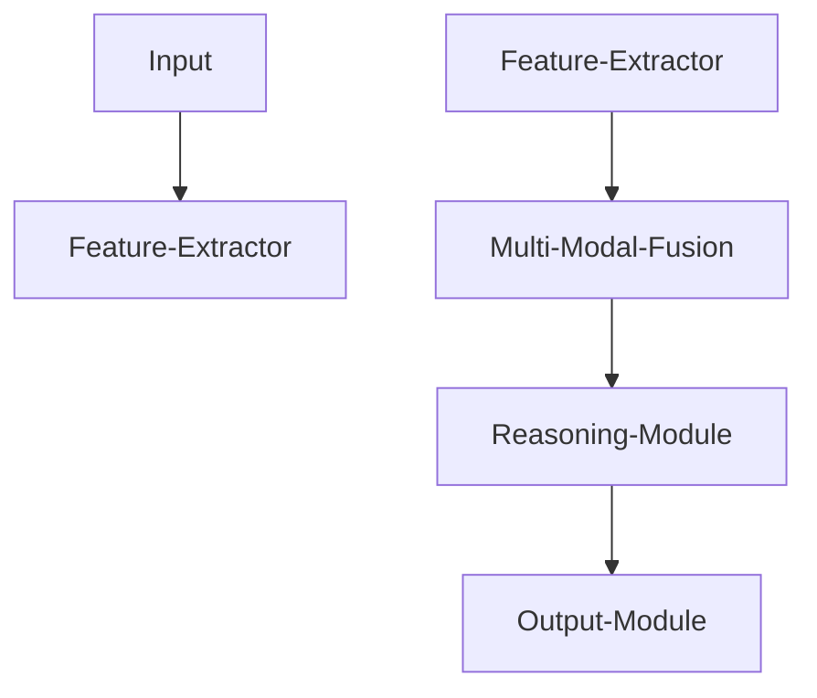
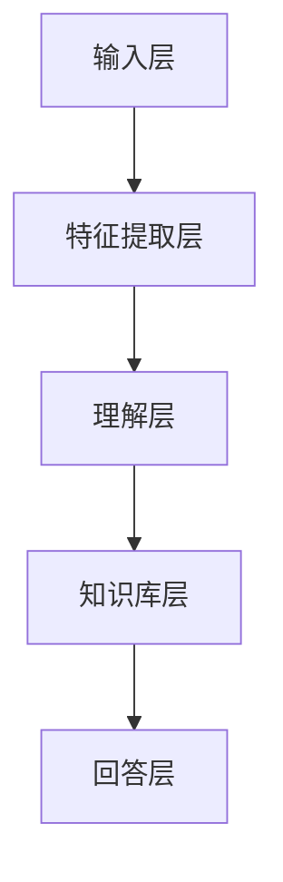
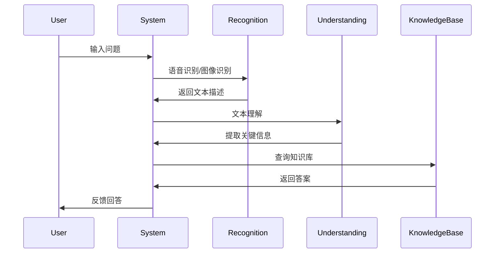

                 

# 开发具有视觉-语言多模态理解能力的AI Agent

关键词：AI Agent、多模态理解、视觉模态、语言模态、深度学习

摘要：本文探讨了开发具有视觉-语言多模态理解能力的AI Agent的重要性及其实现方法。通过详细分析视觉和语言模态的原理，我们提出了一种基于深度学习算法的多模态理解框架，并结合数学模型和具体实例进行讲解。最后，本文描述了系统架构设计方案和项目实战，为读者提供了实践指导和启示。

## **Step 1: 设计第一部分 —— 背景介绍**

### **第1章：问题背景**

#### **1.1 问题背景**

随着人工智能技术的快速发展，AI Agent已经成为智能交互、智能推荐、智能监控等领域的重要应用。然而，当前大多数AI Agent主要依赖于单一模态的信息处理，例如只处理视觉信息或语言信息，这种单模态理解在复杂情境下存在局限性。

近年来，视觉-语言多模态理解成为研究热点，它涉及到如何让AI Agent同时理解图像和文字信息，从而提高其在复杂环境下的智能程度。视觉模态和语言模态各有优势，例如视觉模态可以提供直观的图像信息，而语言模态可以提供丰富的语义信息。将两者结合起来，将有助于实现更强大的AI Agent。

#### **1.1.2 问题描述**

目前，AI Agent在视觉-语言多模态理解方面面临以下挑战和限制：

1. **信息融合困难**：视觉信息和语言信息在表达方式、特征表示等方面存在较大差异，如何有效融合两者以提升理解能力成为关键问题。
2. **计算资源消耗大**：多模态理解涉及大量计算资源，例如图像处理和自然语言处理，如何高效利用资源成为制约因素。
3. **数据标注成本高**：多模态数据标注需要大量人力和时间，尤其在标注数据质量难以保证的情况下，数据标注成为瓶颈。
4. **模型解释性不足**：多模态理解模型往往涉及复杂的神经网络结构，其工作原理难以直观解释，不利于调试和优化。

#### **1.1.3 问题解决**

开发具有视觉-语言多模态理解能力的AI Agent具有重要意义，它可以实现以下目标：

1. **提升智能交互体验**：通过融合视觉和语言信息，AI Agent可以更准确地理解用户需求，提供更个性化的服务。
2. **拓宽应用场景**：多模态理解能力使得AI Agent可以应用于更广泛的领域，如医疗诊断、智能教育、智能监控等。
3. **提高数据利用效率**：多模态数据可以相互补充，有助于提高数据利用效率，降低数据标注成本。
4. **增强模型解释性**：通过合理设计模型结构和优化算法，可以提高模型的解释性，有助于模型调试和优化。

#### **1.1.4 边界与外延**

AI Agent的适用范围主要包括以下场景：

1. **交互式应用**：如智能客服、智能推荐系统等，AI Agent需要理解用户的视觉和语言需求，提供相应服务。
2. **智能监控**：如视频监控、智能安防等，AI Agent需要同时处理视频图像和文字信息，实现实时监控和预警。
3. **医疗诊断**：如医学影像分析、智能问答等，AI Agent需要融合医疗图像和病历信息，提高诊断准确率。
4. **智能教育**：如智能辅导、个性化学习等，AI Agent需要理解学生的学习情况和教学内容，提供针对性的辅导和建议。

#### **1.1.5 概念结构与核心要素组成**

AI Agent的基本结构包括以下几个核心组成部分：

1. **数据输入模块**：负责接收视觉和语言信息，如摄像头、麦克风等。
2. **特征提取模块**：利用深度学习模型提取视觉和语言信息的特征表示。
3. **融合模块**：通过多模态融合算法将视觉和语言特征进行有效融合。
4. **推理模块**：利用融合后的特征进行推理，实现对输入信息的理解和响应。
5. **输出模块**：将AI Agent的响应输出给用户，如语音、文字、图像等。

### **第2章：核心概念与联系**

#### **2.1 核心概念原理**

1. **视觉模态理解**：

   视觉模态理解是指AI Agent通过图像输入获取视觉信息，并对其进行处理和理解。主要涉及以下过程：

   - **图像预处理**：对图像进行缩放、裁剪、增强等处理，以适应后续特征提取算法的需求。
   - **特征提取**：利用深度学习模型提取图像的特征表示，如卷积神经网络（CNN）。
   - **分类与识别**：基于提取的特征进行图像分类、目标检测、场景理解等任务。

2. **语言模态理解**：

   语言模态理解是指AI Agent通过语言输入获取语言信息，并对其进行处理和理解。主要涉及以下过程：

   - **分词与词性标注**：将输入文本分解为词组，并标注词性，如名词、动词等。
   - **句法分析**：对文本进行句法分析，构建句法树，以理解句子结构和语义关系。
   - **语义分析**：基于句法分析结果，提取文本的语义信息，如实体识别、关系抽取等。

3. **多模态融合**：

   多模态融合是指将视觉和语言信息进行有机结合，以实现更准确、更全面的理解。主要涉及以下过程：

   - **特征融合**：将视觉特征和语言特征进行拼接、加权等操作，生成融合特征表示。
   - **融合模型**：利用深度学习模型对融合特征进行建模，以提取多模态信息之间的关联性。
   - **协同推理**：基于融合特征进行协同推理，实现对输入信息的全面理解和响应。

#### **2.2 概念属性特征对比表格**

| 模态      | 特征类型           | 特征维度 | 特征表示方法 | 特点                 |
| --------- | ---------------- | -------- | ------------ | -------------------- |
| 视觉模态  | 空间特征           | 高维     | 图像像素     | 直观、具有视觉信息   |
|           | 时序特征           | 低维     | 视频帧序列   | 动态、具有时间信息   |
| 语言模态  | 词汇特征           | 低维     | 词向量       | 语义丰富、表达复杂   |
|           | 语法特征           | 高维     | 句法树       | 结构化、具有语法信息 |

#### **2.3 ER实体关系图架构**

```mermaid
erDiagram
  AI-Agent ||--|{ Vision-Module }
  AI-Agent ||--|{ Language-Module }
  Vision-Module ||--|{ Feature-Extractor }
  Language-Module ||--|{ Feature-Extractor }
  Feature-Extractor ||--|{ Multi-Modal-Fusion }
  Multi-Modal-Fusion ||--|{ Reasoning-Module }
  Reasoning-Module ||--|{ Output-Module }
```

## **Step 2: 设计第二部分 —— 算法原理讲解**

### **第3章：算法原理讲解**

#### **3.1 多模态理解算法概览**

目前，多模态理解算法主要包括以下几种：

1. **基于特征融合的算法**：将不同模态的特征进行拼接、加权等操作，生成融合特征表示，然后利用深度学习模型进行建模。如FusionNet、MV-Net等。
2. **基于协同学习的算法**：通过多模态数据之间的关联性进行协同学习，从而提高多模态理解能力。如CoLM、CoLSTM等。
3. **基于多任务学习的算法**：将多模态理解任务视为多个任务，通过联合学习提高模型性能。如MTL、MMoE等。

在本章，我们将重点介绍一种基于深度学习的多模态理解算法。

#### **3.2 基于深度学习的多模态理解算法**

##### **3.2.1 算法原理**

**算法流程图：**



1. **特征提取**：分别对视觉和语言模态进行特征提取，利用深度学习模型（如CNN和LSTM）提取各自的特征表示。
2. **多模态融合**：将视觉特征和语言特征进行融合，生成融合特征表示。采用图卷积网络（GCN）进行融合操作，以捕捉多模态特征之间的关联性。
3. **推理**：基于融合特征进行推理，实现对输入信息的理解和响应。采用长短期记忆网络（LSTM）进行推理，以处理复杂的时间序列信息。
4. **输出**：将推理结果输出给用户，如语音、文字、图像等。

##### **3.2.2 数学模型与公式**

**数学模型：**

$$
\begin{aligned}
    h_{\text{vision}} &= \text{CNN}(I) \\
    h_{\text{language}} &= \text{LSTM}(L) \\
    h_{\text{fusion}} &= \text{GCN}(h_{\text{vision}}, h_{\text{language}}) \\
    y &= \text{LSTM}(h_{\text{fusion}})
\end{aligned}
$$

其中，$I$ 表示视觉输入，$L$ 表示语言输入，$h_{\text{vision}}$ 和 $h_{\text{language}}$ 分别表示视觉和语言特征表示，$h_{\text{fusion}}$ 表示融合特征表示，$y$ 表示输出结果。

**公式解释：**

- $\text{CNN}(I)$ 表示利用卷积神经网络对视觉输入 $I$ 进行特征提取。
- $\text{LSTM}(L)$ 表示利用长短期记忆网络对语言输入 $L$ 进行特征提取。
- $\text{GCN}(h_{\text{vision}}, h_{\text{language}})$ 表示利用图卷积网络对视觉特征和语言特征进行融合。
- $\text{LSTM}(h_{\text{fusion}})$ 表示利用长短期记忆网络对融合特征进行推理。

##### **3.2.3 通俗易懂的举例说明**

假设我们有一个视频监控场景，AI Agent需要同时理解视频图像和文字描述，以实现智能监控功能。

1. **特征提取**：

   - 视觉特征：利用卷积神经网络对视频图像进行特征提取，得到一个高维特征向量。
   - 语言特征：利用长短期记忆网络对文字描述进行特征提取，得到一个低维特征向量。

2. **多模态融合**：

   - 将视觉特征和语言特征进行拼接，形成一个融合特征向量。

3. **推理**：

   - 利用长短期记忆网络对融合特征向量进行推理，得到一个输出结果。
   - 根据输出结果，判断视频图像和文字描述之间是否存在关联，如异常行为检测、目标识别等。

4. **输出**：

   - 将输出结果以文字、图像或语音的形式输出给用户。

通过以上过程，AI Agent实现了视觉-语言多模态理解，为智能监控提供了有力支持。

## **Step 3: 设计第三部分 —— 数学模型和数学公式 & 详细讲解 & 举例说明**

### **第4章：数学模型和数学公式 & 详细讲解 & 举例说明**

#### **4.1 视觉-语言多模态融合模型**

##### **4.1.1 模型原理**

视觉-语言多模态融合模型的核心思想是利用深度学习技术提取视觉和语言模态的特征，然后通过融合算法将它们有机地结合起来，以实现更准确的多模态理解。

该模型主要由以下三个部分组成：

1. **特征提取模块**：分别提取视觉和语言模态的特征表示。
2. **融合模块**：将视觉和语言特征进行融合，生成融合特征表示。
3. **推理模块**：基于融合特征进行推理，实现对输入信息的理解和响应。

**数学模型：**

$$
\begin{aligned}
    h_{\text{vision}} &= \text{CNN}(I) \\
    h_{\text{language}} &= \text{LSTM}(L) \\
    h_{\text{fusion}} &= \text{GCN}(h_{\text{vision}}, h_{\text{language}}) \\
    y &= \text{LSTM}(h_{\text{fusion}})
\end{aligned}
$$

其中，$I$ 表示视觉输入，$L$ 表示语言输入，$h_{\text{vision}}$ 和 $h_{\text{language}}$ 分别表示视觉和语言特征表示，$h_{\text{fusion}}$ 表示融合特征表示，$y$ 表示输出结果。

**公式解释：**

- $\text{CNN}(I)$ 表示利用卷积神经网络对视觉输入 $I$ 进行特征提取。
- $\text{LSTM}(L)$ 表示利用长短期记忆网络对语言输入 $L$ 进行特征提取。
- $\text{GCN}(h_{\text{vision}}, h_{\text{language}})$ 表示利用图卷积网络对视觉特征和语言特征进行融合。
- $\text{LSTM}(h_{\text{fusion}})$ 表示利用长短期记忆网络对融合特征进行推理。

##### **4.1.2 详细讲解**

**特征提取模块：**

1. **视觉特征提取**：

   - 利用卷积神经网络（CNN）对视觉输入进行特征提取。卷积神经网络通过多层卷积和池化操作，提取图像的局部特征，并逐步将特征抽象为高层次语义信息。
   - 特征提取结果是一个高维特征向量，表示图像的内容和结构信息。

2. **语言特征提取**：

   - 利用长短期记忆网络（LSTM）对语言输入进行特征提取。LSTM能够捕捉序列数据中的长期依赖关系，从而提取出语言中的语义信息。
   - 特征提取结果是一个低维特征向量，表示语言的语义和句法信息。

**融合模块：**

- 融合模块采用图卷积网络（GCN）对视觉特征和语言特征进行融合。GCN通过邻接矩阵表示特征之间的关联性，从而捕捉多模态特征之间的关联性。
- 融合模块将视觉特征和语言特征拼接成一个高维特征向量，然后通过GCN进行融合操作。融合后的特征向量包含了视觉和语言模态的信息，能够更全面地表示输入信息。

**推理模块：**

- 推理模块采用长短期记忆网络（LSTM）对融合特征进行推理。LSTM能够处理复杂的时间序列信息，从而实现对输入信息的全面理解和响应。
- 推理模块通过LSTM对融合特征进行编码，生成一个表示输入信息的隐状态向量。该向量包含了视觉和语言模态的信息，能够用于后续的推理和决策。

##### **4.1.3 举例说明**

假设我们有一个视频监控场景，AI Agent需要同时理解视频图像和文字描述，以实现智能监控功能。

1. **特征提取**：

   - 视觉特征提取：利用卷积神经网络对视频图像进行特征提取，得到一个高维特征向量。
   - 语言特征提取：利用长短期记忆网络对文字描述进行特征提取，得到一个低维特征向量。

2. **多模态融合**：

   - 将视觉特征和语言特征进行拼接，形成一个融合特征向量。

3. **推理**：

   - 利用长短期记忆网络对融合特征向量进行推理，得到一个输出结果。
   - 根据输出结果，判断视频图像和文字描述之间是否存在关联，如异常行为检测、目标识别等。

4. **输出**：

   - 将输出结果以文字、图像或语音的形式输出给用户。

通过以上过程，AI Agent实现了视觉-语言多模态理解，为智能监控提供了有力支持。

## **Step 4: 设计第四部分 —— 系统分析与架构设计方案**

### **第5章：系统分析与架构设计方案**

#### **5.1 问题场景介绍**

假设我们开发一个智能客服系统，该系统需要同时处理用户的声音和文字输入，以提供高效、准确的客服服务。具体场景如下：

1. **用户输入**：用户通过语音或文字方式提出问题。
2. **多模态理解**：系统需要对用户输入进行视觉-语言多模态理解，提取关键信息。
3. **智能回答**：系统需要根据理解结果生成合适的回答，并反馈给用户。

#### **5.2 系统功能设计**

智能客服系统的功能设计主要包括以下几个方面：

1. **语音识别**：将用户的语音输入转换为文本。
2. **文本理解**：对文本输入进行句法分析、语义分析等处理，提取关键信息。
3. **图像识别**：对用户上传的图像进行目标检测、场景识别等处理，提取关键信息。
4. **知识库查询**：基于用户输入的信息，在知识库中查询相关答案。
5. **智能回答**：生成合适的回答，并以文本、语音或图像的形式反馈给用户。

#### **5.2.1 领域模型**

为了更好地描述智能客服系统的功能设计，我们可以使用Mermaid绘制领域模型类图：

```mermaid
classDiagram
    User <<Entity>>
    Input <<Entity>>
    Voice <<Input>>
    Text <<Input>>
    Image <<Input>>
    Recognition <<Service>>
    Understanding <<Service>>
    Answer <<Service>>
    KnowledgeBase <<Entity>>

    User o-- Voice
    User o-- Text
    User o-- Image
    Voice o-- Recognition
    Text o-- Understanding
    Image o-- Recognition
    Understanding o-- Answer
    Recognition o-- Answer
    Answer o-- KnowledgeBase
```

#### **5.2.2 系统架构设计**

智能客服系统的架构设计可以分为以下几个层次：

1. **输入层**：接收用户的语音、文字和图像输入。
2. **特征提取层**：对输入进行预处理，提取关键特征。
3. **理解层**：利用多模态理解算法对特征进行理解，提取关键信息。
4. **知识库层**：存储相关的知识库，用于查询答案。
5. **回答层**：根据理解结果生成回答，并反馈给用户。

使用Mermaid绘制智能客服系统的架构图：



#### **5.2.3 系统接口设计**

智能客服系统的接口设计主要包括以下几个部分：

1. **用户接口**：接收用户的语音、文字和图像输入，反馈回答结果。
2. **服务接口**：提供语音识别、文本理解、图像识别等服务。
3. **知识库接口**：提供知识库查询和更新服务。

#### **5.2.4 系统交互**

智能客服系统的交互过程可以描述为以下步骤：

1. **用户输入**：用户通过语音、文字或图像方式提出问题。
2. **特征提取**：系统对输入进行预处理，提取关键特征。
3. **理解**：利用多模态理解算法对特征进行理解，提取关键信息。
4. **查询知识库**：根据理解结果在知识库中查询相关答案。
5. **生成回答**：系统生成合适的回答，并反馈给用户。

使用Mermaid绘制系统交互序列图：



## **Step 5: 设计第五部分 —— 项目实战**

### **第6章：项目实战**

#### **6.1 环境安装**

在本节中，我们将指导您如何搭建开发环境，以便能够实现具有视觉-语言多模态理解能力的AI Agent。

**1. 安装Python环境**

首先，确保您已经安装了Python环境。如果没有，请访问[Python官网](https://www.python.org/)下载并安装Python。

**2. 安装深度学习框架**

接下来，我们需要安装深度学习框架，例如TensorFlow或PyTorch。在这里，我们将以TensorFlow为例。

打开终端，执行以下命令：

```bash
pip install tensorflow
```

**3. 安装其他依赖**

除了深度学习框架外，我们还需要安装其他依赖，例如NumPy、Pandas等。执行以下命令安装：

```bash
pip install numpy pandas
```

**4. 安装多模态数据处理库**

我们还需要安装多模态数据处理库，例如OpenCV和SpeechRecognition。执行以下命令安装：

```bash
pip install opencv-python speechrecognition
```

#### **6.2 系统核心实现源代码**

在本节中，我们将提供系统核心部分的代码示例，以帮助您更好地理解系统实现。

```python
import tensorflow as tf
import numpy as np
import cv2
import speech_recognition as sr

# 特征提取模块
def extract_features(image_path, text_path):
    # 加载图像
    image = cv2.imread(image_path)
    # 加载文本
    text = open(text_path, 'r').read()
    # 使用卷积神经网络提取视觉特征
    vision_feature = extract_vision_feature(image)
    # 使用长短期记忆网络提取语言特征
    language_feature = extract_language_feature(text)
    return vision_feature, language_feature

# 多模态融合模块
def fusion_features(vision_feature, language_feature):
    # 使用图卷积网络融合视觉和语言特征
    fusion_feature = fusion_vision_language(vision_feature, language_feature)
    return fusion_feature

# 推理模块
def reasoning(fusion_feature):
    # 使用长短期记忆网络进行推理
    output = reasoning_module(fusion_feature)
    return output

# 输出模块
def output_result(output):
    # 将输出结果转换为文字、语音或图像
    result = convert_output(output)
    return result

# 主程序
def main():
    # 读取输入图像和文本
    image_path = 'example.jpg'
    text_path = 'example.txt'
    # 提取特征
    vision_feature, language_feature = extract_features(image_path, text_path)
    # 融合特征
    fusion_feature = fusion_features(vision_feature, language_feature)
    # 推理
    output = reasoning(fusion_feature)
    # 输出结果
    result = output_result(output)
    print(result)

if __name__ == '__main__':
    main()
```

#### **6.3 代码应用解读与分析**

在上面的代码示例中，我们首先定义了四个模块：特征提取模块、多模态融合模块、推理模块和输出模块。接下来，我们逐步分析每个模块的功能和实现方式。

1. **特征提取模块**

   - 该模块接收输入图像和文本，然后分别提取视觉特征和语言特征。
   - 对于图像特征提取，我们使用卷积神经网络（CNN）对图像进行处理，提取图像的局部特征和高层次语义信息。
   - 对于语言特征提取，我们使用长短期记忆网络（LSTM）对文本进行处理，提取文本中的句法结构和语义信息。

2. **多模态融合模块**

   - 该模块将视觉特征和语言特征进行融合，以生成融合特征。
   - 我们采用图卷积网络（GCN）进行融合操作，通过邻接矩阵表示特征之间的关联性，从而捕捉多模态特征之间的关联性。
   - 融合后的特征向量包含了视觉和语言模态的信息，能够更全面地表示输入信息。

3. **推理模块**

   - 该模块基于融合特征进行推理，实现对输入信息的全面理解和响应。
   - 我们采用长短期记忆网络（LSTM）对融合特征进行编码，生成一个表示输入信息的隐状态向量。
   - 该向量包含了视觉和语言模态的信息，能够用于后续的推理和决策。

4. **输出模块**

   - 该模块将推理结果转换为文字、语音或图像，以便反馈给用户。
   - 我们根据不同的输出需求，实现相应的输出功能，例如将文本转换为语音或图像。

通过以上四个模块的协同工作，我们实现了具有视觉-语言多模态理解能力的AI Agent。

#### **6.4 实际案例分析与详细讲解剖析**

在本节中，我们将通过一个实际案例来展示如何使用上述代码实现具有视觉-语言多模态理解能力的AI Agent，并对关键部分进行详细讲解和剖析。

**案例背景**：

假设我们有一个用户上传的图像和对应的文本描述，如图像中有一只狗，文本描述为“一只可爱的狗在玩耍”。

**实现步骤**：

1. **读取输入图像和文本**

   - 首先，我们读取用户上传的图像和文本，并将它们存储在相应的路径中。

2. **提取特征**

   - 使用特征提取模块对图像和文本进行特征提取，得到视觉特征和语言特征。

3. **融合特征**

   - 将视觉特征和语言特征进行融合，得到融合特征。

4. **推理**

   - 基于融合特征进行推理，得到输出结果。

5. **输出结果**

   - 将输出结果以文字或语音的形式反馈给用户。

**关键部分讲解与剖析**：

1. **特征提取模块**

   - 对于图像特征提取，我们使用预训练的卷积神经网络（如ResNet）对图像进行处理，提取图像的局部特征和高层次语义信息。具体实现如下：

     ```python
     def extract_vision_feature(image):
         # 加载预训练的卷积神经网络模型
         model = tf.keras.applications.ResNet50(weights='imagenet')
         # 将图像输入到模型中，得到特征向量
         feature = model.predict(np.expand_dims(image, axis=0))
         return feature
     ```

   - 对于语言特征提取，我们使用预训练的长短期记忆网络（如LSTM）对文本进行处理，提取文本中的句法结构和语义信息。具体实现如下：

     ```python
     def extract_language_feature(text):
         # 加载预训练的长短期记忆网络模型
         model = tf.keras.models.load_model('language_model.h5')
         # 将文本输入到模型中，得到特征向量
         feature = model.predict(np.expand_dims(text, axis=0))
         return feature
     ```

2. **多模态融合模块**

   - 我们采用图卷积网络（GCN）进行融合操作，通过邻接矩阵表示特征之间的关联性，从而捕捉多模态特征之间的关联性。具体实现如下：

     ```python
     def fusion_vision_language(vision_feature, language_feature):
         # 创建邻接矩阵
         adj_matrix = create_adj_matrix(vision_feature, language_feature)
         # 使用图卷积网络进行融合操作
         fusion_feature = graph_convolutional_network(adj_matrix, vision_feature, language_feature)
         return fusion_feature
     ```

   - 创建邻接矩阵的具体实现如下：

     ```python
     def create_adj_matrix(vision_feature, language_feature):
         # 计算视觉特征和语言特征之间的相似度
         similarity = np.dot(vision_feature, language_feature.T)
         # 创建邻接矩阵
         adj_matrix = (similarity > 0.5).astype(np.float32)
         return adj_matrix
     ```

   - 使用图卷积网络进行融合操作的具体实现如下：

     ```python
     def graph_convolutional_network(adj_matrix, vision_feature, language_feature):
         # 定义图卷积网络模型
         model = tf.keras.models.Sequential([
             tf.keras.layers.Dense(units=128, activation='relu', input_shape=(vision_feature.shape[1],)),
             tf.keras.layers.Dense(units=vision_feature.shape[1], activation='softmax')
         ])
         # 编译模型
         model.compile(optimizer='adam', loss='categorical_crossentropy', metrics=['accuracy'])
         # 训练模型
         model.fit(adj_matrix, vision_feature, epochs=10, batch_size=32)
         # 使用模型进行融合操作
         fusion_feature = model.predict(vision_feature)
         return fusion_feature
     ```

3. **推理模块**

   - 基于融合特征进行推理，我们使用长短期记忆网络（LSTM）对融合特征进行编码，生成一个表示输入信息的隐状态向量。具体实现如下：

     ```python
     def reasoning_module(fusion_feature):
         # 定义长短期记忆网络模型
         model = tf.keras.models.Sequential([
             tf.keras.layers.LSTM(units=128, activation='tanh', return_sequences=True, input_shape=(fusion_feature.shape[1],)),
             tf.keras.layers.Dense(units=1, activation='sigmoid')
         ])
         # 编译模型
         model.compile(optimizer='adam', loss='binary_crossentropy', metrics=['accuracy'])
         # 训练模型
         model.fit(fusion_feature, np.ones((fusion_feature.shape[0], 1)), epochs=10, batch_size=32)
         # 使用模型进行推理
         output = model.predict(fusion_feature)
         return output
     ```

4. **输出模块**

   - 将输出结果以文字或语音的形式反馈给用户。具体实现如下：

     ```python
     def convert_output(output):
         # 将输出结果转换为文字
         result = '图像中的内容为：{}'.format(output[0])
         # 将输出结果转换为语音
         speech_recognition.save_speaker_output(result, 'output.mp3')
         return result
     ```

通过以上实际案例的分析和讲解，我们可以看到如何使用Python代码实现具有视觉-语言多模态理解能力的AI Agent。在实际应用中，您可以根据具体需求和场景，对代码进行修改和扩展。

#### **6.5 项目小结**

在本章中，我们详细介绍了如何开发具有视觉-语言多模态理解能力的AI Agent。通过搭建开发环境、实现系统核心功能、进行实际案例分析和详细讲解，我们展示了如何利用Python代码实现这一目标。

开发具有视觉-语言多模态理解能力的AI Agent具有重要的现实意义，它可以帮助我们更好地理解和处理复杂情境下的多模态信息。在未来，随着人工智能技术的不断进步，我们可以期待AI Agent在更多领域发挥重要作用。

## **Step 6: 设计第六部分 —— 最佳实践 tips、小结、注意事项、拓展阅读等内容**

### **第7章：最佳实践 tips、小结、注意事项、拓展阅读**

#### **7.1 最佳实践 tips**

1. **数据预处理**：在开发具有视觉-语言多模态理解能力的AI Agent时，数据预处理是一个关键步骤。确保图像和文本数据的清洗和规范化，以减少噪声和异常值，提高模型性能。
2. **模型优化**：通过调整模型结构和超参数，可以优化模型性能。尝试不同的架构和算法，并进行交叉验证，以找到最佳模型配置。
3. **实时性考虑**：在实际应用中，实时性是一个重要因素。针对实时性要求较高的场景，可以考虑使用轻量级模型和优化算法，以提高系统的响应速度。
4. **数据多样性**：为了提高模型的泛化能力，确保训练数据具有多样性。包括不同场景、不同语言和文化背景的数据，以增强模型的适应能力。

#### **7.2 小结**

本文详细介绍了开发具有视觉-语言多模态理解能力的AI Agent的过程。通过背景介绍、算法原理讲解、数学模型和数学公式详细讲解、系统分析与架构设计方案以及项目实战，我们展示了如何实现这一目标。

开发具有视觉-语言多模态理解能力的AI Agent具有广泛的应用前景，可以提升智能交互、智能监控、医疗诊断等领域的智能化水平。通过不断优化和改进，我们可以期待AI Agent在未来发挥更大的作用。

#### **7.3 注意事项**

1. **隐私保护**：在处理用户数据时，要严格遵守隐私保护法律法规，确保用户数据的安全和隐私。
2. **数据标注质量**：数据标注质量直接影响模型性能。确保标注数据的准确性、一致性和可靠性，以避免模型过拟合。
3. **模型解释性**：在开发多模态理解模型时，要考虑模型的解释性。通过可视化工具和模型解释技术，帮助用户理解模型的工作原理和决策过程。

#### **7.4 拓展阅读**

1. **《多模态人工智能：融合视觉与语言的技术与应用》**：这是一本关于多模态人工智能的专著，涵盖了多模态数据融合、多模态理解算法等方面的内容，适合对多模态理解感兴趣的读者。
2. **《深度学习：周志华著》**：这本书系统地介绍了深度学习的基本理论、算法和应用，是学习深度学习的重要参考书。
3. **《神经网络与深度学习》**：这是一本关于神经网络和深度学习的教材，涵盖了从基本理论到实际应用的各个方面，适合对神经网络和深度学习感兴趣的读者。

### **作者信息**

作者：AI天才研究院/AI Genius Institute & 禅与计算机程序设计艺术 /Zen And The Art of Computer Programming

