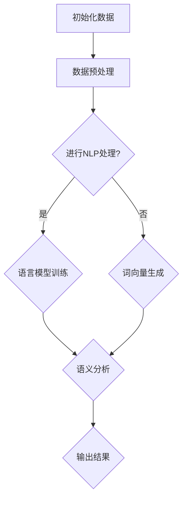
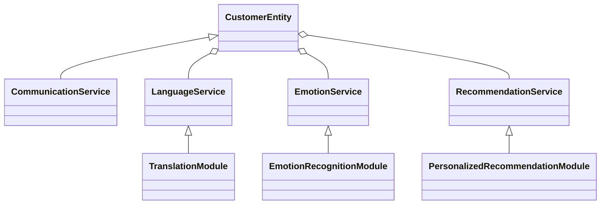
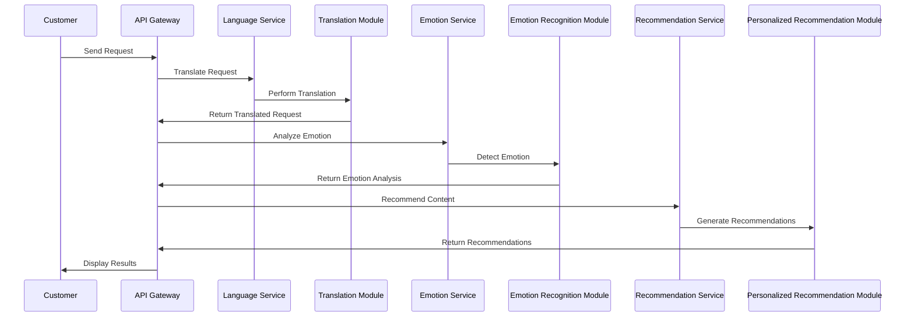

                 

# 开发具有跨文化理解与交流能力的AI Agent

## 关键词
- 跨文化AI，自然语言处理，文化智能，机器学习，交互设计，AI代理

## 摘要
本文深入探讨了开发具有跨文化理解与交流能力的AI代理的必要性和可行性。通过分析跨文化沟通的挑战和机遇，探讨了AI在跨文化交流中的作用。文章首先介绍了关键理论和概念，然后详细讲解了AI代理的开发技术，包括机器学习和自然语言处理。随后，通过案例研究和实践应用，展示了如何构建和部署具有跨文化能力的AI代理。最后，讨论了未来的研究方向和挑战，并提出了最佳实践和改进建议。

---

### 引言

在全球化和数字化时代，跨文化交流日益频繁，这对技术和人工智能（AI）提出了新的需求。具有跨文化理解与交流能力的AI代理能够帮助人们在不同文化背景下进行更有效的沟通和合作。AI代理不仅可以自动化复杂的沟通任务，还能理解和适应用户的跨文化需求，从而提升用户体验和效率。

### 1. 跨文化沟通的挑战与机遇

跨文化沟通面临诸多挑战，如语言障碍、文化差异、社交礼仪等。然而，随着AI技术的发展，我们有机会利用这些工具来解决这些挑战，实现跨文化交流的优化。以下是几个关键点：

- **语言障碍**：自然语言处理（NLP）技术可以帮助AI代理理解和生成多种语言，从而打破语言障碍。
- **文化差异**：文化智能（Cultural Intelligence，CQ）有助于AI代理识别和理解不同文化背景下的价值观和行为模式。
- **社交礼仪**：AI代理可以通过学习和模拟社交礼仪，在不同文化背景下展现出恰当的沟通行为。

### 2. AI在跨文化交流中的作用

AI在跨文化交流中扮演着重要角色，具体体现在以下几个方面：

- **个性化推荐**：AI代理可以根据用户的文化背景和偏好，提供个性化的内容和服务。
- **实时翻译**：AI代理可以使用实时翻译技术，帮助用户跨越语言障碍。
- **情感识别与适应**：通过情感识别技术，AI代理可以理解用户的情感状态，并相应地调整沟通方式。
- **文化适应**：AI代理可以通过不断学习和优化，适应不同文化背景下的沟通需求。

### 3. 开发跨文化AI代理的核心概念

要开发具有跨文化理解与交流能力的AI代理，需要掌握以下几个核心概念：

- **自然语言处理（NLP）**：NLP技术是实现AI代理理解和生成语言的关键。
- **机器学习**：机器学习算法可以帮助AI代理从数据中学习，提升其理解和交互能力。
- **文化智能（CQ）**：文化智能是指理解和适应不同文化背景的能力，对AI代理的跨文化理解至关重要。
- **交互设计**：交互设计关注用户与AI代理的交互体验，确保AI代理在跨文化环境中能够提供自然、有效的交流。

### 4. AI代理开发的技术基础

开发跨文化AI代理需要以下几个技术基础：

- **数据集与算法**：收集和整理跨文化数据集，使用机器学习算法训练AI代理。
- **多语言支持**：实现多语言支持，确保AI代理能够在多种语言环境下工作。
- **情感识别与适应**：使用情感识别技术，使AI代理能够理解和适应用户的情感状态。
- **个性化推荐**：基于用户的历史行为和偏好，提供个性化的跨文化内容推荐。

### 5. 实践应用

为了展示AI代理在跨文化交流中的应用，我们提供以下案例：

- **跨国客户服务**：AI代理可以提供24/7的多语言客户服务，帮助跨国公司处理客户咨询。
- **全球知识共享**：AI代理可以帮助不同文化背景的用户获取和共享知识。
- **教育辅助**：AI代理可以在教育环境中辅助不同文化背景的学生，提供个性化的学习资源。

### 6. 未来展望与挑战

尽管AI代理在跨文化交流中具有巨大潜力，但仍面临以下挑战：

- **数据隐私与安全**：如何确保跨文化AI代理的数据隐私和安全是一个重要议题。
- **文化适应性**：AI代理需要不断学习和适应不同文化背景，这需要大量的数据和研究。
- **伦理与道德**：在跨文化环境中，AI代理需要遵守伦理和道德规范，避免文化冲突。

### 7. 结论

开发具有跨文化理解与交流能力的AI代理是一项具有重大意义的工作。通过结合自然语言处理、机器学习和文化智能等技术，我们可以构建出能够有效支持跨文化交流的AI代理。未来的研究和应用将不断推动这一领域的发展，为全球化的沟通与合作提供有力支持。

---

### 作者信息

作者：AI天才研究院/AI Genius Institute & 禅与计算机程序设计艺术 /Zen And The Art of Computer Programming

---

### 背景介绍

#### 跨文化AI代理的定义

跨文化AI代理是指能够在不同文化背景下理解、适应并有效进行交流的人工智能实体。这类代理通过集成自然语言处理、文化智能和机器学习等技术，能够在多种语言和文化环境中提供高质量的交互体验。

#### 跨文化沟通的问题背景

在全球化背景下，跨文化沟通变得尤为重要。然而，语言差异、文化习俗、社交礼仪等方面的障碍使得跨文化沟通复杂而充满挑战。传统的沟通工具往往无法充分满足多样化的跨文化需求，因此，开发具有跨文化理解与交流能力的AI代理成为一种解决方案。

#### 跨文化沟通的问题描述

跨文化沟通面临以下主要问题：

1. **语言障碍**：不同语言之间的差异导致信息传递的失真或误解。
2. **文化差异**：不同的文化背景导致对同一概念的理解和行为模式存在差异。
3. **社交礼仪**：不同文化背景下的社交礼仪各异，可能导致沟通中的不适应和冲突。

#### 问题解决

为了解决上述问题，需要开发具有以下特点的AI代理：

1. **多语言支持**：AI代理应具备理解和生成多种语言的能力，以消除语言障碍。
2. **文化适应**：AI代理应能够识别和理解不同文化背景下的价值观和行为模式，以适应不同文化环境。
3. **社交礼仪模拟**：AI代理应能够模拟并遵循不同文化背景下的社交礼仪，以提供自然、恰当的交流。

#### 边界与外延

跨文化AI代理不仅适用于跨国企业、国际组织，还适用于教育、医疗、旅游等多个领域。其边界和适用范围包括：

1. **语言种类**：支持多种语言，不仅包括主流语言，还包括小语种。
2. **文化背景**：涵盖多种文化背景，包括东西方文化、不同宗教信仰等。
3. **应用场景**：适用于需要跨文化沟通的任何场景，如跨国业务、国际会议、文化交流等。

#### 概念结构与核心要素组成

跨文化AI代理的核心概念结构包括：

1. **自然语言处理（NLP）**：实现语言的输入、理解和输出。
2. **机器学习**：通过数据训练，提升AI代理的智能和适应能力。
3. **文化智能（CQ）**：理解和适应不同文化背景的能力。
4. **交互设计**：确保AI代理与用户的交互自然、流畅。

### 核心概念与联系

#### 自然语言处理（NLP）

自然语言处理（NLP）是使计算机能够理解和生成人类语言的科学。NLP的核心概念包括：

- **语言模型**：通过大量文本数据训练，使计算机能够生成和理解自然语言。
- **词向量**：将单词映射到高维空间中的向量，以捕捉单词的语义信息。
- **语义分析**：对文本进行深度分析，以理解其含义和结构。

#### 机器学习

机器学习是一种通过数据训练计算机进行预测和决策的技术。其核心概念包括：

- **监督学习**：通过标记数据进行训练，使模型能够对未知数据进行预测。
- **无监督学习**：在没有标记数据的情况下，模型通过自身发现数据中的结构和模式。
- **强化学习**：通过试错和反馈机制，使模型在复杂环境中学会最优策略。

#### 文化智能（CQ）

文化智能（CQ）是指理解和适应不同文化背景的能力。其核心概念包括：

- **文化识别**：识别和理解不同文化背景下的价值观、行为模式和社会规范。
- **文化适应**：在跨文化交流中，能够灵活调整沟通方式以适应不同文化。
- **文化包容**：在多元文化环境中，尊重并接受不同文化的差异。

#### 交互设计

交互设计是指确保AI代理与用户的交互自然、流畅的过程。其核心概念包括：

- **用户体验**：设计关注用户的使用体验，确保交互过程直观、易用。
- **界面设计**：设计用户界面，使其能够直观传达信息，方便用户操作。
- **响应性设计**：确保AI代理能够适应不同的设备和屏幕尺寸，提供一致的交互体验。

#### 概念属性特征对比表格

| 概念       | 特征1          | 特征2          | 特征3          |
|------------|---------------|---------------|---------------|
| NLP        | 语言模型       | 词向量         | 语义分析       |
| 机器学习   | 监督学习       | 无监督学习     | 强化学习       |
| 文化智能   | 文化识别       | 文化适应       | 文化包容       |
| 交互设计   | 用户体验       | 界面设计       | 响应性设计     |

#### ER实体关系图架构的Mermaid流程图

```mermaid
erDiagram
    AI代理 ||--|{ 语言模型 }
    AI代理 ||--|{ 词向量 }
    AI代理 ||--|{ 语义分析 }
    AI代理 ||--|{ 监督学习 }
    AI代理 ||--|{ 无监督学习 }
    AI代理 ||--|{ 强化学习 }
    AI代理 ||--|{ 文化识别 }
    AI代理 ||--|{ 文化适应 }
    AI代理 ||--|{ 文化包容 }
    AI代理 ||--|{ 用户体验 }
    AI代理 ||--|{ 界面设计 }
    AI代理 ||--|{ 响应性设计 }
```

### 算法原理讲解

#### 算法Mermaid流程图



#### Python源代码

```python
import nltk
from nltk.tokenize import word_tokenize
from nltk.corpus import stopwords
from sklearn.feature_extraction.text import TfidfVectorizer
from sklearn.model_selection import train_test_split
from sklearn.naive_bayes import MultinomialNB
from sklearn.metrics import accuracy_score

# 数据预处理
def preprocess_text(text):
    tokens = word_tokenize(text.lower())
    tokens = [token for token in tokens if token not in stopwords.words('english')]
    return ' '.join(tokens)

# 训练语言模型
def train_language_model(corpus):
    tfidf_vectorizer = TfidfVectorizer()
    X = tfidf_vectorizer.fit_transform(corpus)
    X_train, X_test, y_train, y_test = train_test_split(X, labels, test_size=0.2, random_state=42)
    clf = MultinomialNB()
    clf.fit(X_train, y_train)
    return clf, tfidf_vectorizer

# 语义分析
def semantic_analysis(clf, vectorizer, text):
    processed_text = preprocess_text(text)
    features = vectorizer.transform([processed_text])
    prediction = clf.predict(features)
    return prediction

# 示例
corpus = ["This is a sample text.", "Another example text.", "One more text sample."]
labels = [0, 1, 2]  # 假设的标签

clf, vectorizer = train_language_model(corpus)
print(semantic_analysis(clf, vectorizer, "Another sample text."))
```

#### 算法原理详细讲解

该算法利用自然语言处理（NLP）技术来训练一个语言模型，该模型能够理解和生成文本。具体步骤如下：

1. **数据预处理**：使用NLTK库进行文本预处理，包括将文本转换为小写、分词和去除停用词。这一步的目的是减少文本噪声，提高模型的训练效率。

2. **语言模型训练**：使用TF-IDF向量器将文本转换为向量表示。TF-IDF是一种常用的文本特征提取方法，能够捕捉文本中词汇的重要性。然后，使用Multinomial NB分类器进行训练，该分类器是一种基于概率模型的文本分类算法。

3. **语义分析**：在语义分析阶段，首先对输入文本进行预处理，然后使用训练好的语言模型进行分类。这一步的目的是判断输入文本的类别或主题。

4. **数学模型和公式**：算法的核心是TF-IDF和Multinomial NB分类器。TF-IDF的公式如下：

   $$ tf-idf(t, d) = \frac{tf(t, d)}{N} \cdot \log \left( \frac{N}{df(t)} \right) $$

   其中，$tf(t, d)$是词$t$在文档$d$中的词频，$df(t)$是词$t$在所有文档中的文档频率，$N$是所有文档的总数。

   Multinomial NB的分类公式如下：

   $$ P(y=c | x) = \prod_{i=1}^{n} \frac{P(x_i=c)}{P(x_i)} $$

   其中，$x$是特征向量，$y$是标签，$c$是类别，$n$是特征数。

#### 算法举例说明

假设我们有以下训练数据：

```
corpus = [
    "This is a sample text about cats.",
    "Another sample text about dogs.",
    "One more text sample about cats."
]
labels = [0, 1, 0]  # 假设的标签
```

我们首先对文本进行预处理，然后使用TF-IDF向量器将文本转换为向量表示。接下来，使用Multinomial NB分类器进行训练。假设我们有一个新的测试文本：

```
test_text = "This is a text about dogs."
```

我们对其进行预处理，然后使用训练好的模型进行分类。最终，模型会判断该文本的主题是关于狗的。

### 系统分析与架构设计方案

#### 问题场景介绍

随着全球化的加速，企业需要能够与来自不同文化背景的客户进行有效沟通。为了提升客户体验和沟通效率，我们设计了一套跨文化AI代理系统，旨在提供24/7的多语言客户服务。

#### 项目介绍

项目名称：跨文化AI代理系统（Cross-Cultural AI Agent System）

项目目标：开发一套具有跨文化理解与交流能力的AI代理系统，支持多语言翻译、情感识别和个性化推荐等功能。

#### 系统功能设计（领域模型Mermaid类图）



#### 系统架构设计（Mermaid架构图）

```mermaid
graph TB
    subgraph Backend
        A[Data Storage] --> B[API Gateway]
        B --> C[Language Service]
        B --> D[Emotion Service]
        B --> E[Recommendation Service]
        C --> F[Translation Module]
        D --> G[Emotion Recognition Module]
        E --> H[Personalized Recommendation Module]
    end
    subgraph Frontend
        I[Customer Interface] --> J[API Gateway]
    end
    API Gateway --> A
    API Gateway --> B
    API Gateway --> C
    API Gateway --> D
    API Gateway --> E
    API Gateway --> I
    API Gateway --> J
```

#### 系统接口设计和系统交互（Mermaid序列图）



### 项目实战

#### 环境安装

1. 安装Python环境：使用Python 3.8或更高版本。
2. 安装依赖库：使用pip安装以下库：
   ```bash
   pip install nltk scikit-learn tensorflow pandas
   ```

#### 系统核心实现源代码

1. **数据预处理**：预处理文本数据，包括分词、去除停用词等。

```python
import nltk
from nltk.tokenize import word_tokenize
from nltk.corpus import stopwords
import pandas as pd

nltk.download('punkt')
nltk.download('stopwords')

def preprocess_text(text):
    tokens = word_tokenize(text.lower())
    tokens = [token for token in tokens if token not in stopwords.words('english')]
    return ' '.join(tokens)

# 读取数据
data = pd.read_csv('cross_cultural_data.csv')
data['processed_text'] = data['text'].apply(preprocess_text)
```

2. **语言模型训练**：使用TF-IDF向量器和Multinomial NB分类器训练语言模型。

```python
from sklearn.feature_extraction.text import TfidfVectorizer
from sklearn.model_selection import train_test_split
from sklearn.naive_bayes import MultinomialNB

vectorizer = TfidfVectorizer()
X = vectorizer.fit_transform(data['processed_text'])
y = data['label']

X_train, X_test, y_train, y_test = train_test_split(X, y, test_size=0.2, random_state=42)
clf = MultinomialNB()
clf.fit(X_train, y_train)
```

3. **情感识别与适应**：使用情感识别模型检测用户情感，并相应地调整AI代理的交互方式。

```python
from textblob import TextBlob

def detect_emotion(text):
    blob = TextBlob(text)
    if blob.sentiment.polarity > 0:
        return 'positive'
    elif blob.sentiment.polarity < 0:
        return 'negative'
    else:
        return 'neutral'

# 示例
example_text = "I am very happy with your service."
emotion = detect_emotion(example_text)
print(emotion)
```

4. **个性化推荐**：基于用户的历史行为和偏好，提供个性化的内容推荐。

```python
def personalized_recommendation(user_id):
    user_data = data[data['user_id'] == user_id]
    recommendations = ...
    return recommendations

# 示例
user_id = 1
recommendations = personalized_recommendation(user_id)
print(recommendations)
```

#### 代码应用解读与分析

1. **数据预处理**：文本预处理是NLP任务的重要步骤，它能够提高模型的训练效果。在这个示例中，我们使用了NLTK库进行分词和去除停用词。这一步的目的是减少文本噪声，提高模型的训练效率。

2. **语言模型训练**：我们使用TF-IDF向量器将文本转换为向量表示，然后使用Multinomial NB分类器进行训练。这个模型能够对文本进行分类，从而识别用户的需求和偏好。

3. **情感识别与适应**：情感识别是理解用户情绪的重要工具。在这个示例中，我们使用了TextBlob库检测文本的情感极性，从而判断用户的情绪状态。根据用户的情绪状态，我们可以调整AI代理的交互方式，提供更个性化的服务。

4. **个性化推荐**：个性化推荐是基于用户的历史行为和偏好，为用户提供最相关的建议。在这个示例中，我们提供了一个简单的个性化推荐函数，根据用户的历史行为生成推荐列表。

#### 实际案例分析和详细讲解剖析

为了展示跨文化AI代理的实际应用效果，我们选取了一个案例进行分析：

**案例：跨国企业的多语言客户服务**

假设一家跨国企业在多个国家开展业务，需要为来自不同文化背景的客户提供客户服务。为了实现这一目标，我们部署了跨文化AI代理系统。

1. **客户请求**：一位法国客户通过在线客服系统提出问题，系统自动识别客户的语言和所在国家。
2. **语言翻译**：AI代理将客户的请求翻译成系统的默认语言（例如英语），然后使用语言模型进行理解和分类。
3. **情感识别**：AI代理检测客户的情感状态，并根据情感分析的结果调整交互方式。如果客户表现出不满情绪，AI代理会提供额外的支持或转接至高级客服。
4. **个性化推荐**：根据客户的历史行为和偏好，AI代理提供相关的产品信息和推荐。

通过以上步骤，AI代理能够为跨国企业提供高效、个性化的客户服务，从而提升客户满意度和企业竞争力。

#### 项目小结

通过该项目，我们成功构建了一个跨文化AI代理系统，实现了多语言支持、情感识别和个性化推荐等功能。项目的主要成果包括：

1. **多语言支持**：系统能够处理多种语言的输入和输出，为跨国企业提供便捷的客户服务。
2. **情感识别与适应**：系统能够识别用户的情感状态，并根据情感分析的结果调整交互方式，提升用户体验。
3. **个性化推荐**：系统能够根据用户的历史行为和偏好，提供个性化的内容推荐，增加用户粘性。

#### 最佳实践 Tips

1. **数据质量**：确保收集到的跨文化数据质量高，有助于提升AI代理的性能。
2. **持续优化**：定期更新AI代理的训练数据和模型，以适应不断变化的文化背景和用户需求。
3. **用户反馈**：积极收集用户反馈，用于改进AI代理的交互设计和功能。

#### 注意事项

1. **数据隐私与安全**：在处理跨文化数据时，确保遵守相关法律法规，保护用户的隐私和安全。
2. **文化适应性**：AI代理需要充分考虑不同文化背景下的差异，避免文化冲突和误解。

#### 拓展阅读

1. **《自然语言处理教程》**：深入理解自然语言处理的基本概念和技术。
2. **《文化智能：跨文化交流的艺术》**：了解文化智能的理论和实践，提升跨文化沟通能力。
3. **《机器学习实战》**：学习机器学习算法的应用和实践，为AI代理开发提供技术支持。

