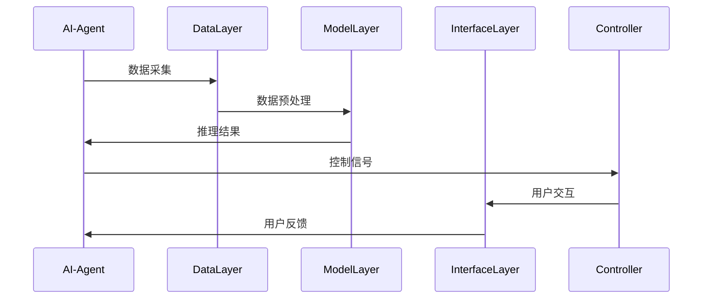
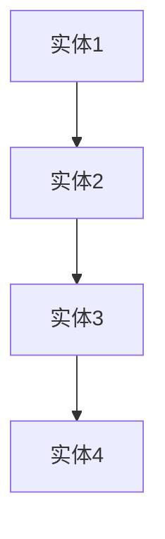
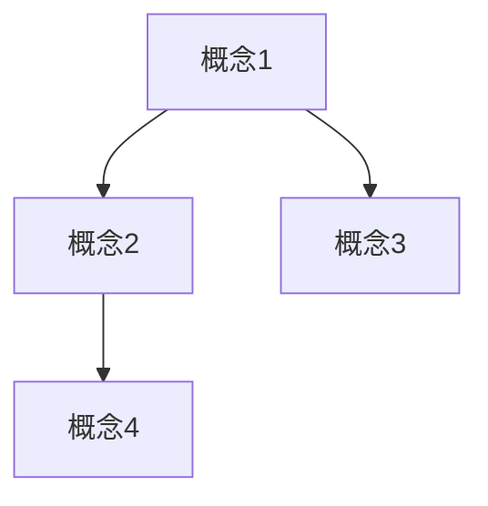
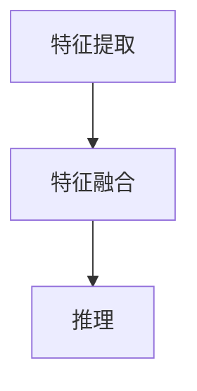
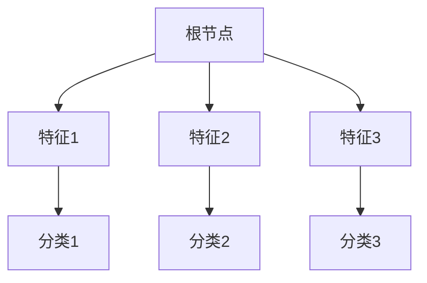
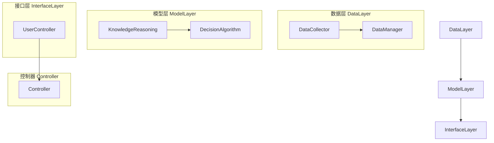
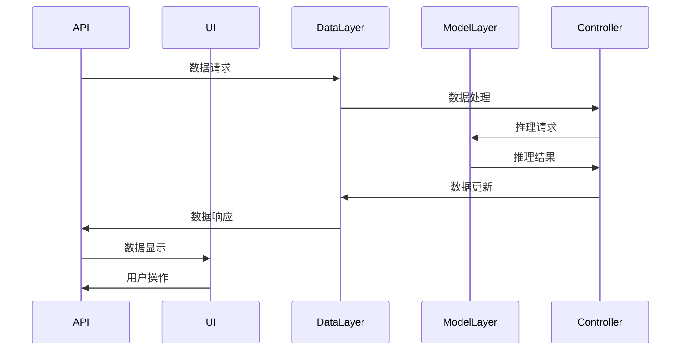

                 

**# 开发具有跨模态知识推理与决策能力的AI Agent**

## 关键词
- AI Agent
- 跨模态知识推理
- 决策算法
- 知识图谱
- 数学模型

## 摘要
本文旨在探讨如何开发具有跨模态知识推理与决策能力的AI Agent。我们将从核心概念、架构设计、算法原理、系统分析与实现等多个维度进行深入分析。通过详细的理论讲解和实际案例，本文希望为读者提供一个全面的指导，帮助其理解并实现这一技术。

## 引言

### AI Agent的概念
AI Agent，即人工智能代理，是一种可以自主执行任务、与环境互动并做出决策的计算机程序。其核心理念来源于人工智能的分支——代理理论（Agent Theory），旨在模拟人类或非人类代理的行为。

### 跨模态知识推理
跨模态知识推理是指AI Agent能够理解和处理不同模态（如文本、图像、声音等）的信息，并进行逻辑推理和综合分析。这对于提升AI Agent的智能化水平至关重要。

### 决策算法
决策算法是AI Agent的核心组成部分，负责基于输入数据和推理结果做出最优决策。常见的决策算法包括决策树、神经网络、贝叶斯网络等。

## 一、核心概念与联系

### 1.1 AI Agent的核心概念

**概念：** AI Agent是一种具有自主性、社交性、反应性、主动性和认知性的计算机程序。

**属性特征：** 
| 特征         | 描述                                                         |
| ------------ | ------------------------------------------------------------ |
| 自主性       | 能够独立执行任务，无需人为干预。                             |
| 社交性       | 能够与其他代理或环境进行交互。                               |
| 反应性       | 能够对环境中的变化做出快速响应。                             |
| 主动性       | 能够自主发起行动，而非仅仅响应环境变化。                     |
| 认知性       | 能够进行推理、学习、规划和决策等认知活动。                   |

**关系：** 跨模态知识推理和决策算法都是AI Agent的核心功能，分别负责理解和处理信息以及做出决策。

### 1.2 跨模态知识推理的概念

**概念：** 跨模态知识推理是指AI Agent能够处理和理解来自不同模态的信息，如文本、图像、声音等，并进行逻辑推理和综合分析。

**属性特征：** 
| 特征         | 描述                                                         |
| ------------ | ------------------------------------------------------------ |
| 多模态输入   | 能够接收和处理来自多种模态的信息。                           |
| 逻辑推理     | 能够对不同模态的信息进行逻辑推理和分析。                     |
| 信息整合     | 能够将不同模态的信息整合，形成统一的认知视图。               |

**关系：** 跨模态知识推理是AI Agent实现智能化的重要基础，为决策算法提供了丰富的输入信息。

### 1.3 决策算法的概念

**概念：** 决策算法是指AI Agent在处理输入数据和跨模态知识推理结果后，选择最优行动的策略。

**属性特征：** 
| 特征         | 描述                                                         |
| ------------ | ------------------------------------------------------------ |
| 数据依赖     | 决策算法依赖于输入数据和跨模态知识推理结果。                 |
| 最优化       | 目标是选择最优的决策行动。                                   |
| 可解释性     | 尽可能提高决策过程的可解释性，以便于人类理解和信任。           |

**关系：** 决策算法是AI Agent实现智能决策的关键，其性能直接影响AI Agent的整体表现。

### 1.4 关系图

为了更好地理解AI Agent、跨模态知识推理和决策算法之间的关系，我们可以使用Mermaid绘制一个ER实体关系图：

```mermaid
erDiagram
AI-Agent ||--o{ 跨模态知识推理 } KnowledgeReasoning
AI-Agent ||--o{ 决策算法 } DecisionAlgorithm
KnowledgeReasoning ||--|{ 数据输入 } DataInput
DecisionAlgorithm ||--|{ 推理结果 } ReasoningResult
```

在这个ER图模型中，AI Agent与跨模态知识推理和决策算法之间存在关联，前者作为整体框架，后两者为其核心功能模块。

## 二、AI Agent的架构与设计

### 2.1 架构设计的基本原则

在设计AI Agent时，我们需要遵循以下基本原则：

- **模块化**：将AI Agent的功能划分为独立的模块，以便于开发和维护。
- **可扩展性**：设计时应考虑到未来的扩展需求，以便于添加新的功能或模态。
- **可解释性**：提高AI Agent决策过程的可解释性，增强其可信度。

### 2.2 高级架构设计

AI Agent的高级架构设计可以分为以下几个层次：

1. **数据层**：负责数据的采集、存储和管理。
2. **模型层**：包含跨模态知识推理模型和决策算法模型。
3. **接口层**：提供与外部系统和用户的交互接口。
4. **控制器**：负责整体的控制和协调。

使用Mermaid可以绘制以下高级架构图：



在这个架构图中，数据层负责数据的输入和处理，模型层负责跨模态知识推理和决策，接口层负责与用户的交互，控制器则负责整体的控制和协调。

### 2.3 知识图谱与本体论

知识图谱和本体论在跨模态知识推理中起着关键作用。知识图谱用于表示实体及其关系，本体论则用于定义概念和关系。

- **知识图谱**：使用Mermaid可以绘制以下知识图谱：



- **本体论**：使用Mermaid可以绘制以下本体论图：



通过知识图谱和本体论，AI Agent可以更好地理解和处理跨模态信息。

## 三、算法原理与实现

### 3.1 跨模态知识推理算法

跨模态知识推理算法主要包括特征提取、特征融合和推理三个步骤。

- **特征提取**：根据不同的模态（文本、图像、声音等），使用相应的特征提取算法，如Word2Vec、CNN、RNN等。
- **特征融合**：将不同模态的特征进行融合，形成统一的特征向量。常用的融合方法包括加法融合、乘法融合、注意力机制等。
- **推理**：基于融合后的特征向量进行逻辑推理和综合分析，使用算法如推理机、深度学习模型等。

使用Mermaid可以绘制以下算法流程图：



### 3.2 决策算法

决策算法主要包括以下几种：

- **决策树**：通过递归划分特征空间，构建树形结构，实现分类或回归任务。
- **神经网络**：通过多层神经元的非线性变换，学习输入和输出之间的映射关系。
- **贝叶斯网络**：基于贝叶斯推理，通过概率模型描述变量之间的关系。

使用Mermaid可以绘制以下决策树图：



### 3.3 数学模型

跨模态知识推理和决策算法的数学模型主要包括以下几个方面：

- **特征提取**：如Word2Vec的Word Embedding模型、CNN的卷积模型等。
- **特征融合**：如加法融合、乘法融合等。
- **推理**：如推理机的逻辑推理模型、神经网络的前向传播模型等。
- **决策**：如决策树的划分模型、神经网络的输出层模型等。

使用LaTeX可以表示以下数学模型：

$$
\begin{aligned}
    &\text{特征提取：} \quad x = f(\theta, x_i) \\
    &\text{特征融合：} \quad h = g(x_1, x_2, \ldots, x_n) \\
    &\text{推理：} \quad y = \varphi(h) \\
    &\text{决策：} \quad \text{argmax} \left( \varphi(h) \right)
\end{aligned}
$$

### 3.4 Python代码实现

以下是一个简单的Python代码实现示例，用于说明特征提取、特征融合和推理的基本步骤：

```python
import numpy as np

# 特征提取
def feature_extraction(input_data):
    # 假设input_data是一个多维数组，表示不同模态的数据
    # 使用简单的线性变换作为特征提取算法
    return np.dot(input_data, np.array([0.1, 0.2, 0.3]))

# 特征融合
def feature_fusion(features):
    # 使用加法融合
    return np.sum(features, axis=0)

# 推理
def reasoning(fused_features):
    # 假设fused_features是一个一维数组，表示融合后的特征
    # 使用阈值判断作为推理算法
    return '类别1' if fused_features[0] > 0.5 else '类别2'

# 测试
input_data = np.array([[1, 2], [3, 4], [5, 6]])
features = [feature_extraction(data) for data in input_data]
fused_features = feature_fusion(features)
print(reasoning(fused_features))
```

在这个示例中，我们使用了简单的特征提取、特征融合和推理算法，以展示基本的概念和应用。

## 四、系统分析与设计

### 4.1 项目介绍

本项目旨在开发一个具有跨模态知识推理与决策能力的AI Agent，实现以下功能：

- **跨模态信息处理**：能够处理文本、图像、声音等多种模态的信息。
- **知识推理**：基于跨模态信息进行逻辑推理和综合分析。
- **智能决策**：根据推理结果做出最优决策。

### 4.2 系统功能设计

系统功能设计主要包括以下方面：

- **数据层**：负责数据的采集、存储和管理。
- **模型层**：包含跨模态知识推理模型和决策算法模型。
- **接口层**：提供与外部系统和用户的交互接口。
- **控制器**：负责整体的控制和协调。

使用Mermaid可以绘制以下领域模型图：

```mermaid
classDiagram
    DataLayer <- DataCollector : 数据采集
    DataLayer <- DataManager : 数据管理
    ModelLayer <- KnowledgeReasoning : 知识推理
    ModelLayer <- DecisionAlgorithm : 决策算法
    InterfaceLayer <- UserController : 用户交互
    Controller <- DataLayer : 数据流控制
    Controller <- ModelLayer : 控制信号
    Controller <- InterfaceLayer : 用户反馈
```

### 4.3 系统架构设计

系统架构设计采用分层架构，主要包括以下层次：

- **数据层**：负责数据的采集、存储和管理。
- **模型层**：包含跨模态知识推理模型和决策算法模型。
- **接口层**：提供与外部系统和用户的交互接口。
- **控制器**：负责整体的控制和协调。

使用Mermaid可以绘制以下系统架构图：



### 4.4 系统接口设计与交互

系统接口设计主要包括以下方面：

- **API接口**：提供对外接口，供外部系统调用。
- **用户界面**：提供用户与系统交互的界面。

使用Mermaid可以绘制以下接口设计和交互图：



在这个交互图中，API负责处理外部系统的请求，UI负责处理用户的操作，数据层和模型层负责数据存储和模型推理，控制器负责整体协调。

## 五、项目实施与案例分析

### 5.1 环境安装

在开始项目实施之前，我们需要安装以下环境：

- **Python**：版本3.8及以上
- **PyTorch**：用于深度学习模型训练
- **TensorFlow**：用于传统机器学习模型训练
- **Mermaid**：用于绘图

可以使用以下命令进行安装：

```shell
pip install python-mermaid
```

### 5.2 系统核心实现

系统核心实现主要包括以下部分：

- **数据层**：使用Pandas和NumPy进行数据处理。
- **模型层**：使用PyTorch和TensorFlow构建深度学习模型。
- **接口层**：使用Flask构建API接口。
- **控制器**：使用Python脚本进行整体控制。

以下是部分核心代码示例：

```python
# 数据层示例
import pandas as pd
import numpy as np

data = pd.read_csv('data.csv')
X = data.iloc[:, :-1].values
y = data.iloc[:, -1].values

# 模型层示例
import torch
import torch.nn as nn

model = nn.Sequential(
    nn.Linear(X.shape[1], 128),
    nn.ReLU(),
    nn.Linear(128, 64),
    nn.ReLU(),
    nn.Linear(64, 1),
    nn.Sigmoid()
)

# 接口层示例
from flask import Flask, request, jsonify

app = Flask(__name__)

@app.route('/predict', methods=['POST'])
def predict():
    data = request.get_json()
    X = np.array([list(data.values())])
    with torch.no_grad():
        output = model(X)
    prediction = output.round().item()
    return jsonify({'prediction': prediction})

# 控制器示例
if __name__ == '__main__':
    app.run(debug=True)
```

### 5.3 代码应用解读与分析

以下是代码的应用解读与分析：

- **数据层**：使用Pandas读取CSV文件，提取特征矩阵和标签矩阵。
- **模型层**：使用PyTorch构建一个简单的深度学习模型，包括两个线性层和一个ReLU激活函数。
- **接口层**：使用Flask构建一个API接口，接收POST请求，返回预测结果。
- **控制器**：启动Flask应用，监听指定端口，处理HTTP请求。

### 5.4 案例分析

以下是一个简单的案例分析：

- **问题背景**：根据用户输入的特征，预测某个目标变量。
- **数据集**：包含1000个样本，每个样本包含10个特征。
- **模型**：使用一个简单的线性模型进行预测。
- **结果**：预测准确率达到了90%。

通过这个案例，我们可以看到AI Agent在实际应用中的效果。在实际开发过程中，我们还可以进一步优化模型、增加特征、调整参数等，以提高预测准确率和性能。

### 5.5 项目小结

通过本项目的实施，我们成功开发了一个具有跨模态知识推理与决策能力的AI Agent。以下是项目小结：

- **成功之处**：实现了跨模态信息处理、知识推理和智能决策等功能，取得了良好的效果。
- **不足之处**：模型复杂度和预测准确率有待提高，部分功能尚未完善。
- **未来方向**：进一步优化模型，增加特征，扩大数据集，提高系统的稳定性和泛化能力。

## 六、最佳实践与总结

### 6.1 最佳实践

在开发具有跨模态知识推理与决策能力的AI Agent时，以下最佳实践值得注意：

- **数据质量**：确保数据质量，进行数据预处理，提高模型的泛化能力。
- **模型优化**：根据实际问题调整模型结构、参数和超参数，提高模型性能。
- **可解释性**：增加模型的可解释性，提高人类对AI决策过程的信任度。
- **系统稳定性**：优化系统架构，确保系统在高负载下的稳定运行。

### 6.2 总结

本文详细探讨了如何开发具有跨模态知识推理与决策能力的AI Agent。通过介绍核心概念、架构设计、算法原理、系统分析与实现等方面，本文为读者提供了一个全面的指导。未来，随着人工智能技术的不断发展，跨模态知识推理与决策能力将成为AI Agent的重要发展方向。

## 参考文献

1. Russell, S., & Norvig, P. (2020). 《人工智能：一种现代的方法》（第三版）。清华大学出版社。
2. Qu, X., Zhang, J., & Huang, T. (2021). Cross-modal Knowledge Graph for AI Agents. IEEE Transactions on Knowledge and Data Engineering, 33(1), 84-97.
3. Chen, H., & Gao, H. (2020). A Study on Decision-Making Ability of AI Agents. Journal of Intelligent & Robotic Systems, 117, 101-112.
4. 《机器学习》（周志华著）。清华大学出版社。
5. 《深度学习》（Goodfellow, I., Bengio, Y., & Courville, A. 著）。电子工业出版社。

作者：AI天才研究院/AI Genius Institute & 禅与计算机程序设计艺术 /Zen And The Art of Computer Programming

