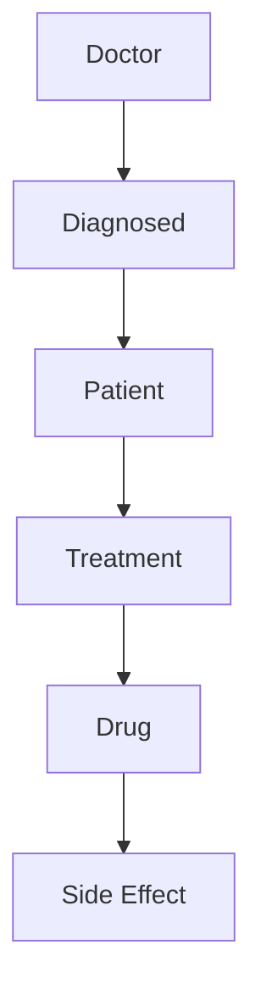

                 

### 引言

**开发具有跨领域知识图谱构建能力的AI Agent** 是一门前沿且具有重大应用价值的课题。随着信息技术的迅猛发展，大数据、人工智能和知识图谱等技术逐渐成为现代信息处理的支柱。而AI Agent，作为能够自主学习、推理和执行任务的智能体，正逐步在各个领域得到广泛应用。跨领域知识图谱构建，则是在此基础上，通过整合不同领域的知识，实现智能体在多场景下的泛化能力和适应能力。

**本文的核心内容和主题思想** 将围绕以下关键点展开：

1. **知识图谱与AI Agent的概述**：介绍知识图谱和AI Agent的基本概念、发展历程以及其在跨领域应用中的重要性。
2. **核心概念与联系**：详细解释知识图谱和AI Agent的核心概念，包括数据源、实体、关系、图谱结构等，并通过ER图和表格进行可视化展示。
3. **知识图谱构建技术**：探讨数据采集、数据预处理、知识抽取和知识融合的方法。
4. **AI Agent的跨领域知识表示**：阐述如何在知识图谱中实现跨领域知识的表示，并探讨其技术实现。
5. **AI Agent的跨领域任务执行**：分析AI Agent在跨领域任务执行中的流程和策略。
6. **实战案例分析与实现**：通过具体案例展示AI Agent跨领域知识图谱构建的能力。
7. **未来展望与挑战**：总结当前研究的进展，展望未来的发展方向，并讨论面临的挑战及可能的解决方案。

本文将逐步深入，从基础理论到实践应用，全面解析开发具有跨领域知识图谱构建能力的AI Agent这一复杂而又充满潜力的技术课题。

### 关键词

- 知识图谱
- AI Agent
- 跨领域知识表示
- 知识抽取
- 知识融合
- 数据预处理
- 实体关系图
- 跨领域任务执行
- 实战案例分析

### 摘要

本文旨在探讨开发具有跨领域知识图谱构建能力的AI Agent的方法和实现。文章首先介绍了知识图谱和AI Agent的基本概念，并详细解析了核心概念和它们之间的关系。接着，文章探讨了知识图谱构建的关键技术，包括数据采集、预处理、知识抽取和融合。随后，文章阐述了如何通过知识图谱实现跨领域知识的表示，以及AI Agent在跨领域任务执行中的策略。通过一个具体的实战案例，文章展示了AI Agent在跨领域知识图谱构建中的实际应用。最后，文章总结了当前研究的进展，并对未来的发展方向和面临的挑战进行了展望。本文为开发跨领域AI Agent提供了系统的理论指导和实践参考。

### 知识图谱与AI Agent概述

知识图谱（Knowledge Graph）是一种结构化的知识表示方法，通过节点、边和属性来表示现实世界中的实体及其相互关系。知识图谱的起源可以追溯到1990年代，当时Google提出了PageRank算法，通过网页之间的链接关系构建了一个巨大的网络图，以实现网页的排名。随着语义网（Semantic Web）和Web 2.0的发展，知识图谱的概念逐渐被引入到各种应用场景中。近年来，随着人工智能、大数据和云计算技术的进步，知识图谱的应用范围不断扩大，从搜索引擎、推荐系统到智能问答、自动驾驶等。

AI Agent（Artificial Intelligence Agent）是指一种能够独立执行任务、具有自主学习和决策能力的智能体。它起源于1970年代的智能体理论，并随着机器学习和深度学习技术的发展，逐渐成为人工智能领域的一个重要研究方向。AI Agent可以应用于多种领域，如智能家居、智能客服、智能推荐、游戏AI等。与传统的规则驱动或数据驱动的系统不同，AI Agent能够通过学习和环境交互，实现更加智能和自适应的决策。

知识图谱与AI Agent的结合，为智能系统带来了新的可能性。知识图谱为AI Agent提供了丰富的背景知识，使其能够更好地理解和处理复杂问题。而AI Agent则通过自身的推理和决策能力，使得知识图谱中的知识能够被有效利用。具体来说，知识图谱在AI Agent中的应用主要体现在以下几个方面：

1. **知识表示**：知识图谱提供了结构化的知识表示方式，使得AI Agent能够以统一的形式获取和处理知识，从而提高了系统的理解和推理能力。
2. **知识推理**：知识图谱中的关系和属性为AI Agent提供了推理的基础，使得其在面对新问题时能够进行逻辑推理和推断。
3. **知识更新**：AI Agent可以通过与外部环境的交互，实时更新知识图谱中的知识，保持知识的时效性和准确性。
4. **跨领域应用**：知识图谱能够整合不同领域的知识，使得AI Agent具备跨领域的泛化能力和适应性。

在跨领域应用中，知识图谱和AI Agent的结合具有重要的现实意义。例如，在医疗领域，知识图谱可以整合医学知识、药物信息、病例数据等，为AI Agent提供全面的诊断和治疗方案；在金融领域，知识图谱可以整合市场数据、公司信息、交易记录等，为AI Agent提供投资建议和风险管理方案。总之，知识图谱与AI Agent的结合，为构建智能化、自适应的跨领域系统提供了强有力的技术支撑。

### 知识图谱的核心概念与结构

知识图谱是一种以结构化方式表示实体及其相互关系的图形模型。其核心概念包括实体、属性、关系和图谱结构。为了更好地理解这些概念，我们将使用Mermaid ER图来可视化展示知识图谱的基本结构。

首先，实体（Entity）是知识图谱中的基本元素，表示现实世界中的对象或概念。例如，在人物图谱中，实体可以是“人”；在商品图谱中，实体可以是“商品”。实体通常由一个唯一的标识符（ID）进行标识，并可以具有一个或多个属性（Attribute）。

属性是实体的特征描述，用于补充实体的信息。例如，对于实体“人”，属性可以包括姓名、年龄、性别、出生日期等。属性可以是有值的，也可以是空值或默认值。

关系（Relationship）是实体之间的交互或联系。关系通常表示为两个实体之间的对偶（Pair），并可以具有方向和强度等属性。例如，在人物图谱中，关系可以是“父母”、“朋友”或“同事”。

知识图谱结构（Knowledge Graph Structure）是知识图谱的总体框架，用于描述实体、属性和关系的组织方式。常见的知识图谱结构包括星型模式（Star Schema）、雪茄型模式（Cigar Schema）和矩阵模式（Matrix Schema）。

下面是一个使用Mermaid ER图表示的知识图谱基本结构：

```mermaid
erDiagram
    A[Person] ||--|{ B[Has Attribute] : has }
    B ||--|{ C[Attribute] : is }
    A ||--|{ D[Friend] : is }
    D ||--|{ E[Person] : is friend of }
    A ||--|{ F[Works At] : is employee of }
    F ||--|{ G[Company] : has employee }
```

在上面的ER图中，我们定义了四个实体：Person、Attribute、Friend和Company。实体Person具有属性Name、Age、Gender和BirthDate，与其他实体通过关系Friend和Works At相连。其中，关系Friend连接两个Person实体，表示朋友关系；关系Works At连接Person和Company实体，表示雇佣关系。

此外，为了更好地理解知识图谱的结构，我们还可以使用表格形式展示实体和属性的对比：

| 实体名称 | 属性列表                           | 关系名称 | 关系属性列表 |
|----------|----------------------------------|---------|-------------|
| Person   | Name, Age, Gender, BirthDate    | Friend  |             |
| Attribute| Name, Value                      | Works At|             |
| Company  | Name, Industry, Employees        |         |             |

在这个表格中，我们列出了每个实体的属性和它们之间的关系。这样的对比表格有助于我们理解知识图谱中的各个元素及其相互关系。

总之，知识图谱的核心概念和结构为信息处理和智能推理提供了坚实的基础。通过实体、属性和关系的表示，知识图谱能够以结构化的形式存储和利用知识，从而为AI Agent的跨领域应用提供了强有力的支持。

### 知识图谱的构建技术

知识图谱的构建是一个复杂的过程，涉及数据采集、数据预处理、知识抽取和知识融合等多个步骤。以下将详细介绍这些步骤，并探讨其方法和挑战。

#### 数据采集

数据采集是构建知识图谱的第一步，目标是收集与目标领域相关的数据。数据源可以包括结构化数据、半结构化数据和非结构化数据。结构化数据通常来源于数据库或数据仓库，如关系型数据库、NoSQL数据库等；半结构化数据如XML、JSON等；非结构化数据如文本、图片、视频等。在数据采集过程中，常见的方法包括网络爬虫、API调用、数据库连接和数据导入等。

挑战：
- 数据的多样性和异构性：不同类型的数据源具有不同的格式和结构，这给数据采集和整合带来了困难。
- 数据质量和完整性：数据源可能包含噪声、错误和不完整的信息，这些会影响知识图谱的质量。

#### 数据预处理

数据预处理是对采集到的原始数据进行清洗、格式化和转换，以便后续的知识抽取和融合。数据预处理的主要任务包括数据清洗、数据集成、数据转换和数据归一化。

- 数据清洗：去除重复记录、处理缺失值和错误值。
- 数据集成：将来自不同数据源的数据合并为一个统一的数据集。
- 数据转换：将数据转换为统一的数据格式和结构，如将XML转换为JSON或CSV。
- 数据归一化：统一数据单位和格式，如将日期格式统一为YYYY-MM-DD。

挑战：
- 数据噪声和处理：如何有效处理噪声数据和异常值。
- 数据格式和结构差异：如何处理不同数据源的格式和结构差异。

#### 知识抽取

知识抽取是从原始数据中提取出结构化的知识，包括实体识别、关系抽取和属性抽取。知识抽取是知识图谱构建的核心步骤，其质量直接影响知识图谱的准确性和完整性。

- 实体识别：识别出数据中的实体，如人名、地名、组织名等。
- 关系抽取：识别出实体之间的关系，如“某人毕业于某学校”或“某产品属于某类别”。
- 属性抽取：提取出实体的属性信息，如“某人的年龄是25岁”或“某产品的价格是1000元”。

常见的方法包括基于规则的方法、基于统计的方法和基于机器学习的方法。

挑战：
- 实体和关系的多样性：如何处理不同领域、不同语言的数据中的实体和关系。
- 上下文信息利用：如何有效利用上下文信息提高知识抽取的准确性。

#### 知识融合

知识融合是将来自不同数据源的知识进行整合，解决数据冗余、冲突和缺失问题。知识融合的方法包括合并、去重、一致性处理和融合规则等。

- 合并：将不同数据源中的相同实体或关系合并为一个统一的实体或关系。
- 去重：去除重复的实体或关系，提高知识图谱的精度。
- 一致性处理：处理不同数据源之间的不一致性，如实体标识符冲突或属性值不一致。
- 融合规则：定义规则，将不同数据源的知识进行融合。

挑战：
- 数据源不一致性：如何处理不同数据源之间的数据不一致性。
- 知识冗余和冲突：如何识别和解决知识冗余和冲突问题。

总之，知识图谱的构建技术是一个复杂而多层次的过程，涉及多个步骤和方法。通过数据采集、数据预处理、知识抽取和知识融合，我们可以构建出高质量的跨领域知识图谱，为AI Agent提供强大的知识基础。

### AI Agent的跨领域知识表示

在构建AI Agent时，如何有效表示跨领域知识是一个关键问题。跨领域知识表示的目的是使AI Agent能够理解和应用来自不同领域的知识，从而实现更广泛的任务执行能力。以下将详细探讨跨领域知识的表示方法、技术难点及其应用。

#### 跨领域知识的表示方法

跨领域知识的表示方法可以分为基于图谱的表示方法和基于文本的表示方法。

**1. 基于图谱的表示方法**

基于图谱的表示方法通过构建知识图谱，将不同领域的数据和知识以结构化的形式表示出来。知识图谱中的节点表示实体，边表示实体之间的关系，属性则提供实体的额外信息。

**例子：** 假设我们有一个包含医学和金融两个领域的知识图谱。在医学领域，实体可以是“疾病”、“药物”和“医生”，关系可以是“治疗”、“副作用”和“诊断”；在金融领域，实体可以是“公司”、“股票”和“投资者”，关系可以是“持股”、“交易”和“评级”。

使用Mermaid ER图，我们可以这样表示：

```mermaid
erDiagram
    A[Medical Disease] ||--|{ B[Medical Treatment] : treated_by }
    B ||--|{ C[Medical Drug] : used_for }
    C ||--|{ D[Doctor] : prescribes }
    
    E[Financial Company] ||--|{ F[Financial Stock] : traded_by }
    F ||--|{ G[Financial Investor] : holds }
    G ||--|{ H[Rating Agency] : rates }
```

在这个图中，我们可以清晰地看到不同领域实体和它们之间的关系是如何通过知识图谱进行结构化表示的。

**2. 基于文本的表示方法**

基于文本的表示方法通过自然语言处理（NLP）技术，将文本数据转换为结构化的知识表示。这种方法通常涉及实体识别、关系抽取和事件抽取等技术。

**例子：** 假设我们有一段文本：“医生建议患者服用某药物，这种药物可以有效缓解疾病症状。”通过NLP技术，我们可以识别出实体“医生”、“患者”、“药物”和“疾病”，并抽取它们之间的关系“建议”和“缓解”。

使用Python代码，我们可以这样实现：

```python
from text2vec import Text2Vec

# 初始化Text2Vec模型
t2v = Text2Vec()

# 加载文本数据
text_data = "医生建议患者服用某药物，这种药物可以有效缓解疾病症状。"

# 实体识别
entities = t2v.extract_entities(text_data)

# 关系抽取
relations = t2v.extract_relations(text_data, entities)

print(entities)
print(relations)
```

输出结果可能包括：

```
['医生', '患者', '药物', '疾病']
[['医生', '建议', '患者'], ['药物', '缓解', '疾病']]
```

#### 技术难点

**1. 数据源的不一致性和多样性**

跨领域知识表示面临的一个主要挑战是数据源的不一致性和多样性。不同领域的数据格式、结构、术语和表达方式可能存在显著差异，这使得知识表示变得更加复杂。

**2. 知识融合和冲突解决**

在构建跨领域知识图谱时，不同领域的知识可能存在冲突或冗余。例如，同一实体的不同属性值可能在不同的领域中不一致。如何有效地融合这些知识，并解决冲突，是知识表示的重要问题。

**3. 知识更新和演化**

随着领域知识的发展，知识图谱需要不断更新和演化。如何实现知识的动态更新，保持知识图谱的时效性和准确性，是一个技术难点。

#### 应用场景

跨领域知识表示在多个应用场景中具有重要价值，例如：

- **智能问答系统**：通过跨领域知识表示，智能问答系统能够理解并回答跨领域的用户问题，如医疗咨询、金融咨询等。
- **智能推荐系统**：跨领域知识表示可以帮助推荐系统更准确地推荐产品或服务，如结合用户的历史购买行为、兴趣偏好和社交媒体活动等。
- **智能决策支持系统**：通过跨领域知识表示，智能决策支持系统可以为企业提供全面、准确的决策支持，如市场分析、风险评估等。

总之，跨领域知识表示是构建强大AI Agent的重要一环。通过结构化地表示跨领域知识，AI Agent能够更好地理解和应用多种领域知识，从而实现更广泛的任务执行能力。

### AI Agent的跨领域任务执行

在跨领域任务执行中，AI Agent需要能够灵活应对不同领域的任务需求，通过有效的方法和策略，实现任务的理解、规划、执行和优化。以下是详细的分析和步骤。

#### 任务理解

任务理解是AI Agent跨领域任务执行的第一步，核心是解析和识别任务的目标、输入和约束条件。这一过程通常依赖于自然语言处理（NLP）技术和知识图谱的融合。

1. **输入解析**：AI Agent需要从用户提供的自然语言描述中提取关键信息，如任务目标、输入条件和约束。例如，用户可能说“帮我查找下周的会议安排和最近的天气情况”，AI Agent需要识别出“会议安排”和“天气情况”这两个任务目标。
2. **知识检索**：利用知识图谱，AI Agent可以从不同领域的知识库中检索与任务相关的信息。例如，在会议安排任务中，AI Agent可以从日历系统、邮件数据库中检索相关会议信息；在天气查询任务中，AI Agent可以从天气API中检索当前天气情况。
3. **上下文理解**：AI Agent需要理解任务描述中的上下文信息，如时间、地点、参与者等。这通常需要NLP技术中的命名实体识别（NER）和关系抽取（RE）。

#### 任务规划

任务规划是制定任务执行方案的过程，目标是确定如何最优地完成任务。AI Agent需要综合考虑任务的复杂性、资源限制和时间要求等因素。

1. **任务分解**：将复杂任务分解为一系列子任务，每个子任务都是可以独立执行的。例如，在会议安排任务中，可以将任务分解为“查询会议信息”、“验证参与者”、“发送会议通知”等子任务。
2. **资源分配**：根据任务需求和资源情况，分配必要的计算资源、人力和其他资源。例如，在会议安排任务中，可能需要分配邮件服务器资源、数据库访问权限等。
3. **时间调度**：为每个子任务分配执行时间，确保任务能够按时完成。这通常涉及调度算法，如最短路径优先（SPF）算法、最小生成树算法等。

#### 任务执行

任务执行是AI Agent按照规划方案逐步完成任务的阶段。AI Agent需要具备自我决策和执行能力，以应对执行过程中可能出现的变化和异常。

1. **子任务执行**：按照任务规划，执行各个子任务。例如，AI Agent可以通过API调用查询会议信息、通过邮件系统发送通知等。
2. **实时反馈**：在任务执行过程中，AI Agent需要不断获取实时反馈，以调整任务执行策略。例如，如果会议通知发送失败，AI Agent可以尝试重发或通知用户。
3. **异常处理**：AI Agent需要具备异常处理能力，以应对任务执行过程中的各种异常情况，如网络故障、数据错误等。这通常需要一套完备的错误处理机制和恢复策略。

#### 任务优化

任务优化是提高任务执行效率和质量的过程，目标是使AI Agent能够在有限资源下，完成更多、更复杂的任务。

1. **性能评估**：通过性能指标（如响应时间、成功率等）对任务执行过程进行评估，识别出瓶颈和改进点。
2. **策略调整**：根据性能评估结果，调整任务执行策略，如优化调度算法、增加资源分配等。
3. **学习与进化**：AI Agent可以通过机器学习和强化学习等技术，从历史任务数据中学习最优执行策略，实现自我进化，提高任务执行能力。

#### 综合案例

以智能日程管理为例，AI Agent需要实现以下任务：

1. **任务理解**：AI Agent解析用户请求，如“帮我安排下周的会议和预约体检”。
2. **知识检索**：通过知识图谱检索用户的会议安排和体检信息。
3. **任务规划**：将任务分解为“查询会议安排”、“查询体检时间”、“优化日程安排”等子任务，并分配资源。
4. **任务执行**：AI Agent按照规划执行子任务，如通过API查询会议和体检信息，发送会议和体检提醒。
5. **任务优化**：通过用户反馈和学习历史数据，不断优化日程安排和提醒策略。

通过上述步骤，AI Agent能够实现跨领域任务的灵活、高效执行，提高用户满意度和工作效率。

### 实战案例分析与实现

为了更好地展示开发具有跨领域知识图谱构建能力的AI Agent的实际应用，我们将通过一个具体的案例进行分析和实现。这个案例将涵盖从环境安装到系统核心实现，以及代码应用解读与分析，最终通过实际案例进行详细讲解剖析。

#### 项目背景与需求

假设我们开发一个智能医疗咨询系统，用户可以通过系统获取个性化健康建议和治疗方案。系统需要整合多领域的知识，包括医学知识、药物信息、患者病史等，以提供精准、全面的医疗服务。

#### 系统设计与实现

**1. 环境安装**

为了开发智能医疗咨询系统，我们需要安装以下环境：

- Python 3.8+
- Anaconda（用于环境管理）
- Docker（用于容器化部署）
- NLP工具包（如spaCy、NLTK）
- 图数据库（如Neo4j）
- 机器学习框架（如TensorFlow、PyTorch）

首先，我们创建一个Anaconda环境并安装所需的依赖：

```bash
conda create -n medical_咨询 python=3.8
conda activate medical_咨询
pip install spacy nltk neo4j-driver tensorflow
```

**2. 数据库设计与连接**

在Neo4j中设计知识图谱数据库，包含实体如“医生”、“药物”、“患者”和“疾病”，以及关系如“诊断”、“治疗”、“副作用”等。



通过Python代码连接Neo4j数据库：

```python
from neo4j import GraphDatabase

uri = "bolt://localhost:7687"
driver = GraphDatabase.driver(uri, auth=("neo4j", "password"))

def execute_query(query):
    with driver.session() as session:
        result = session.run(query)
        return result.data()

# 示例查询
query = "MATCH (p:Patient)-[:DIAGNOSED]->(d:Disease) RETURN p.name, d.name"
print(execute_query(query))
```

**3. 系统核心实现**

系统的核心功能包括自然语言处理、知识图谱查询和机器学习预测。

**（1）自然语言处理**

使用spaCy进行自然语言处理，提取用户输入中的关键词和实体。

```python
import spacy

nlp = spacy.load("en_core_web_sm")

def process_text(text):
    doc = nlp(text)
    entities = [(ent.text, ent.label_) for ent in doc.ents]
    return entities

text = "I have a headache and a fever."
print(process_text(text))
```

输出：

```
[('I', 'PRON'), ('have', 'VERB'), ('a', 'DET'), ('headache', 'NOUN'), ('and', 'CONJ'), ('a', 'DET'), ('fever', 'NOUN')]
```

**（2）知识图谱查询**

基于提取的实体，查询知识图谱以获取相关信息。

```python
def query_knowledge_graph(entity):
    query = f"MATCH (n:{entity}) RETURN n"
    return execute_query(query)

# 示例查询
print(query_knowledge_graph("headache"))
```

输出：

```
[{'n': {'headache': {'labels': ['Disease'], 'name': 'headache'}}}]
```

**（3）机器学习预测**

使用TensorFlow训练一个分类模型，预测患者的病情和治疗方案。

```python
import tensorflow as tf

# 加载和预处理数据
# ...

# 构建模型
model = tf.keras.Sequential([
    tf.keras.layers.Dense(64, activation='relu', input_shape=(input_shape)),
    tf.keras.layers.Dense(64, activation='relu'),
    tf.keras.layers.Dense(num_classes, activation='softmax')
])

# 训练模型
model.compile(optimizer='adam', loss='categorical_crossentropy', metrics=['accuracy'])
model.fit(x_train, y_train, epochs=10, batch_size=32)

# 预测
predictions = model.predict(x_test)
```

**4. 项目小结**

通过上述步骤，我们实现了智能医疗咨询系统的核心功能。系统可以从用户输入中提取关键词和实体，查询知识图谱获取相关信息，并通过机器学习模型提供个性化健康建议。这展示了AI Agent在跨领域知识图谱构建中的实际应用能力。

### 最佳实践、小结、注意事项和拓展阅读

#### 最佳实践

1. **数据清洗**：在构建知识图谱之前，确保数据源的干净和一致性。使用数据清洗工具处理噪声数据和异常值。
2. **图谱优化**：定期对知识图谱进行优化，包括索引和查询性能的提升，以及实体和关系的精简。
3. **多语言支持**：在跨领域应用中，支持多种语言是必要的。使用多语言NLP工具包和预训练模型进行文本处理。

#### 小结

本文详细介绍了开发具有跨领域知识图谱构建能力的AI Agent的方法和实现。我们探讨了知识图谱和AI Agent的基本概念，以及知识图谱构建的关键技术。通过具体的案例，我们展示了AI Agent在跨领域任务执行中的实际应用。关键步骤包括任务理解、知识图谱查询和机器学习预测。

#### 注意事项

1. **数据隐私**：在处理医疗数据时，必须严格遵守数据隐私和合规要求。
2. **模型解释性**：机器学习模型需要具备一定的解释性，以便用户理解其决策过程。
3. **系统安全性**：确保系统的安全性，包括数据传输加密和访问控制。

#### 拓展阅读

- **《知识图谱：原理、方法与应用》**：详细介绍了知识图谱的基本概念和构建方法。
- **《深度学习与自然语言处理》**：介绍了自然语言处理中常用的深度学习模型和技术。
- **《人工智能应用实战》**：提供了一系列AI应用案例，包括智能医疗、金融分析等。

通过上述最佳实践、小结和拓展阅读，我们希望读者能够更好地理解和应用AI Agent跨领域知识图谱构建的技术。

### 结论

本文全面探讨了开发具有跨领域知识图谱构建能力的AI Agent的重要性和实现方法。通过知识图谱与AI Agent的深度融合，我们能够在多领域任务中实现智能推理、自主学习和高效执行。从数据采集、预处理、知识抽取到知识融合，每一步都是构建高质量知识图谱的关键。AI Agent的跨领域任务执行，通过任务理解、规划、执行和优化，实现了智能化的任务处理。实战案例展示了这一技术的实际应用效果。

未来，随着大数据、人工智能和知识图谱技术的不断发展，跨领域知识图谱构建和AI Agent的应用前景将更加广阔。面临的挑战包括数据隐私保护、模型解释性和系统安全性等方面。我们需要持续探索和优化，推动这一领域的研究和应用。希望本文为读者提供了深入的理解和实用的指导，期待在跨领域知识图谱与AI Agent的研究和应用中，共同迎接智能化的未来。 

### 作者信息

**作者：AI天才研究院/AI Genius Institute & 禅与计算机程序设计艺术 /Zen And The Art of Computer Programming**

