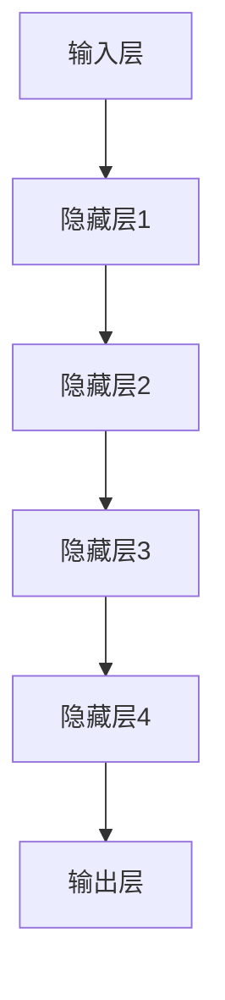
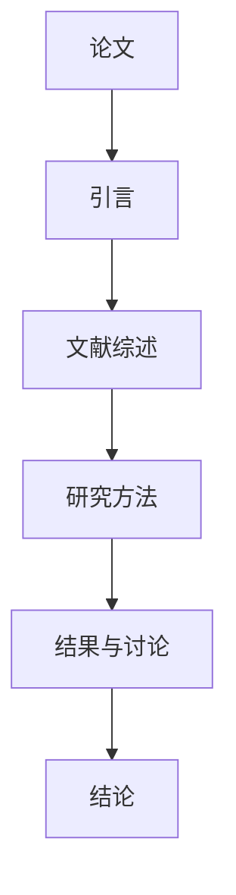
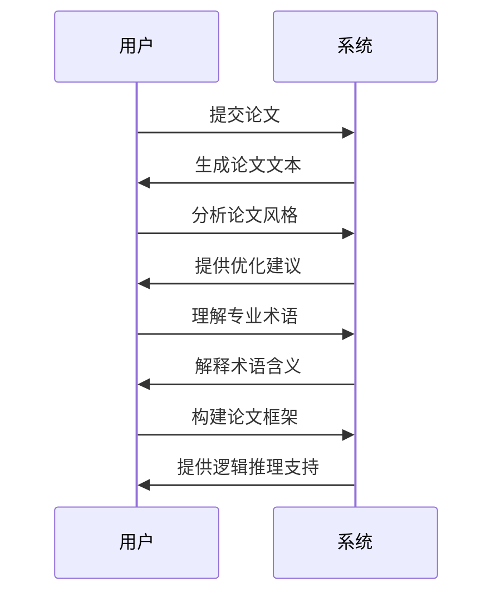

                 

# 开发基于大模型的金融专业论文写作风格分析系统

## 关键词
大模型、金融专业论文、写作风格分析、文本生成、文本分析、深度学习、神经网络、金融术语、逻辑推理

## 摘要
本文旨在探讨开发一种基于大模型的金融专业论文写作风格分析系统的可行性和技术细节。通过对金融专业论文写作风格的深入研究，本文将分析大模型在文本生成、文本分析、术语理解和逻辑推理方面的应用，并提出一个详细的系统架构设计方案。文章将详细介绍大模型的原理、金融专业论文写作风格的特点以及二者之间的联系，最终通过实际案例分析和系统实战，验证所提出系统的有效性和实用性。

## 第一部分：问题背景与核心概念

### 1.1 问题背景

随着金融市场的不断发展，金融产品的复杂性不断增加，对金融分析工作的要求也越来越高。然而，传统的金融分析方法在处理海量数据和快速市场变化方面存在明显不足。此外，金融领域的研究工作也需要高效的写作工具来提高论文质量。因此，开发一种基于大模型的金融专业论文写作风格分析系统具有重要的现实意义。

这种系统不仅可以辅助金融工作者高效地撰写论文，还能对已有论文进行风格分析，提供优化建议。通过大模型技术，系统能够更好地理解和生成金融领域的专业术语、逻辑结构和论证方式，从而提高论文的质量和效率。

### 1.2 核心概念

#### 1.2.1 大模型

大模型是指具有海量参数、可以处理大规模数据的人工智能模型。在金融领域，大模型通常是指利用深度学习技术训练的模型，如神经网络模型、Transformer模型等。大模型的核心特点是参数数量庞大，能够处理海量数据，并且具有很好的泛化能力。

#### 1.2.2 金融专业论文写作风格

金融专业论文写作风格是指在金融领域撰写学术论文时所遵循的格式、语言表达和论证方式。它包括标题、摘要、引言、文献综述、研究方法、结果与讨论、结论等部分的结构与表达方式。金融专业论文写作风格的特点是术语使用规范、论证逻辑严谨、结构清晰。

### 1.3 核心概念联系

#### 1.3.1 大模型在金融专业论文写作中的应用

大模型在金融专业论文写作中的应用主要体现在以下几个方面：

1. **文本生成**：大模型可以根据金融专业论文的写作风格和术语特点，生成高质量的论文文本，从而提高论文撰写的效率和质量。
2. **文本分析**：大模型可以对已有的金融论文进行文本分析，识别出其写作风格、关键观点和论证逻辑，为作者提供参考和改进建议。
3. **术语理解**：大模型能够理解并生成金融领域的专业术语，从而提高论文的专业性和准确性。
4. **逻辑推理**：大模型能够进行逻辑推理和论证，帮助作者构建严谨的论文框架和论证过程。

#### 1.3.2 金融专业论文写作风格与大模型的关系

金融专业论文写作风格与大模型之间存在密切的关系。大模型通过学习大量的金融论文文本，能够捕捉到金融领域的写作特点和风格，从而生成符合金融专业要求的论文文本。同时，大模型的分析能力也能够帮助作者理解和掌握金融专业论文的写作风格，从而提高自身的写作水平。

----------------------------------------------------------------

## 第二部分：核心概念与联系

### 2.1 大模型原理

大模型的原理主要基于深度学习和神经网络技术。它通过多层次的神经网络结构，对输入数据进行特征提取和模式识别，从而实现复杂的任务。具体来说，大模型包括以下几个核心部分：

1. **输入层**：接收输入数据，并将其转化为神经网络可以处理的形式。
2. **隐藏层**：通过对输入数据进行特征提取和变换，实现对数据的深层理解和建模。
3. **输出层**：根据隐藏层的输出，生成最终的输出结果。

大模型的核心特点是参数数量庞大，能够处理海量数据，并且具有很好的泛化能力。

以下是一个大模型的一般结构流程图（使用Mermaid绘制）：



### 2.2 金融专业论文写作风格特点

金融专业论文写作风格的特点主要体现在以下几个方面：

1. **术语使用**：金融专业论文中经常使用特定的专业术语，这些术语通常是金融领域的行话，能够准确表达金融现象和概念。
2. **论证逻辑**：金融专业论文的论证逻辑通常严谨、有条理，通过对已有文献的综述和分析，提出自己的观点和结论。
3. **结构框架**：金融专业论文的结构通常包括引言、文献综述、研究方法、结果与讨论、结论等部分，每个部分都有明确的写作要求和格式。
4. **数据可视化**：金融专业论文中经常使用图表和数据可视化来展示研究结果，这些图表和数据能够直观地表达研究结论。

以下是一个金融专业论文写作风格特点的ER实体关系图（使用Mermaid绘制）：



### 2.3 大模型与金融专业论文写作风格的联系

大模型与金融专业论文写作风格的联系主要体现在以下几个方面：

1. **文本生成**：大模型可以根据金融专业论文的写作风格和术语特点，生成高质量的论文文本，从而提高论文撰写的效率和质量。
2. **文本分析**：大模型可以对已有的金融论文进行文本分析，识别出其写作风格、关键观点和论证逻辑，为作者提供参考和改进建议。
3. **术语理解**：大模型能够理解并生成金融领域的专业术语，从而提高论文的专业性和准确性。
4. **逻辑推理**：大模型能够进行逻辑推理和论证，帮助作者构建严谨的论文框架和论证过程。

通过大模型对金融专业论文写作风格的深入学习和理解，可以有效地提高论文的质量和效率，满足金融领域日益增长的需求。

----------------------------------------------------------------

## 第三部分：系统设计与实现

### 3.1 系统设计目标

开发基于大模型的金融专业论文写作风格分析系统的目标主要包括以下几点：

1. **提高论文撰写效率**：通过大模型技术，系统能够辅助作者快速生成高质量的论文文本，减少撰写时间，提高工作效率。
2. **优化论文写作风格**：系统可以对已有论文进行风格分析，识别出不足之处，提供优化建议，帮助作者提升论文质量。
3. **辅助学术研究**：系统可以为金融研究者提供专业的写作指导，提高研究的可读性和影响力。

### 3.2 系统架构设计

为了实现上述目标，系统采用分层架构设计，包括数据层、模型层和应用层。以下是对各层的详细说明：

#### 3.2.1 数据层

数据层负责数据的采集、存储和管理。系统需要从多个渠道收集金融领域的学术论文数据，包括公开数据库、学术期刊和金融论坛等。收集到的数据经过预处理，如去重、去噪和格式转换，然后存储在分布式数据库中，以便后续分析和挖掘。

#### 3.2.2 模型层

模型层是系统的核心，包括文本生成模型、文本分析模型和术语理解模型等。以下是对各模型的详细说明：

1. **文本生成模型**：基于大模型的文本生成模型，如GPT-3或BERT，可以学习金融领域的专业术语、写作风格和逻辑结构，生成高质量的论文文本。
2. **文本分析模型**：文本分析模型可以对已有的金融论文进行深入分析，识别出写作风格、关键观点和论证逻辑，为作者提供参考和改进建议。
3. **术语理解模型**：术语理解模型可以识别和理解金融领域的专业术语，提高论文的专业性和准确性。

#### 3.2.3 应用层

应用层是系统的用户界面，提供丰富的功能，如论文撰写、风格分析、术语理解、逻辑推理等。用户可以通过图形界面与系统进行交互，快速完成论文撰写任务，并获得优化建议。

### 3.3 系统功能设计

系统的主要功能包括以下几个方面：

1. **论文撰写**：用户可以通过系统生成高质量的论文文本，包括标题、摘要、引言、文献综述、研究方法、结果与讨论、结论等部分。
2. **风格分析**：系统可以对用户撰写的论文进行风格分析，识别出不足之处，并提供优化建议，如改进论证逻辑、规范术语使用等。
3. **术语理解**：系统可以帮助用户理解金融领域的专业术语，提高论文的专业性和准确性。
4. **逻辑推理**：系统可以辅助用户构建严谨的论文框架和论证过程，提高论文的逻辑性和说服力。

### 3.4 系统接口设计

系统采用RESTful API设计，提供以下主要接口：

1. **论文生成接口**：用于生成高质量的论文文本。
2. **风格分析接口**：用于分析论文的写作风格，并提供优化建议。
3. **术语理解接口**：用于识别和理解金融领域的专业术语。
4. **逻辑推理接口**：用于辅助用户构建论文框架和论证过程。

通过这些接口，用户可以通过编程方式与系统进行交互，实现自动化论文撰写和分析。

### 3.5 系统交互设计

为了提高系统的易用性和用户体验，系统采用图形界面与用户进行交互。以下是一个系统交互设计的序列图（使用Mermaid绘制）：



通过这些设计，系统可以为金融工作者提供全方位的辅助，提高论文写作的质量和效率。

----------------------------------------------------------------

## 第四部分：系统实现与实战

### 4.1 环境安装

为了实现基于大模型的金融专业论文写作风格分析系统，我们需要安装以下软件和库：

1. **Python**：Python是一种广泛使用的编程语言，适用于开发人工智能应用。
2. **TensorFlow**：TensorFlow是Google开发的开源深度学习框架，用于构建和训练大模型。
3. **Scikit-learn**：Scikit-learn是一个Python机器学习库，用于文本分析和特征提取。
4. **NLTK**：NLTK是一个自然语言处理库，用于处理文本数据。

安装方法如下：

```bash
pip install python
pip install tensorflow
pip install scikit-learn
pip install nltk
```

### 4.2 系统核心实现

系统核心包括文本生成模型、文本分析模型和术语理解模型。以下是一个基于GPT-3模型的文本生成代码示例：

```python
import openai

# 设置API密钥
openai.api_key = "your-api-key"

# 定义生成论文的函数
def generate_paper(title, summary, introduction):
    prompt = f"请根据以下信息生成一篇金融专业论文：\n标题：{title}\n摘要：{summary}\n引言：{introduction}\n"

    response = openai.Completion.create(
        engine="text-davinci-002",
        prompt=prompt,
        max_tokens=500,
        n=1,
        stop=None,
        temperature=0.5,
    )

    return response.choices[0].text.strip()

# 测试生成论文
title = "金融市场的波动性分析"
summary = "本文通过对金融市场波动性的深入研究，探讨了波动性的成因和影响因素，并提出了一种新的波动性预测模型。"
introduction = "金融市场波动性是金融研究领域的一个重要课题，直接关系到投资者的风险管理和资产配置。"

paper = generate_paper(title, summary, introduction)
print(paper)
```

### 4.3 代码应用解读与分析

#### 文本生成模型

文本生成模型基于GPT-3模型，GPT-3是一种基于Transformer的预训练语言模型，具有强大的文本生成能力。在上面的代码中，我们首先设置了API密钥，然后定义了一个`generate_paper`函数，用于生成论文文本。

函数接收三个参数：`title`（论文标题）、`summary`（论文摘要）和`introduction`（论文引言）。在函数内部，我们构建了一个包含这些信息的prompt，然后使用GPT-3模型进行文本生成。生成的论文文本存储在`response.choices[0].text.strip()`中。

#### 文本分析模型

文本分析模型用于对已有论文进行风格分析。以下是一个简单的文本分析代码示例：

```python
from sklearn.feature_extraction.text import TfidfVectorizer
from sklearn.metrics.pairwise import cosine_similarity

# 定义文本分析函数
def analyze_paper(paper):
    # 将论文文本拆分为句子
    sentences = paper.split(".")
    # 构建TF-IDF向量器
    vectorizer = TfidfVectorizer()
    # 计算句子间的余弦相似度
    similarity_matrix = vectorizer.fit_transform(sentences).tocoo()
    similarity_scores = cosine_similarity(similarity_matrix)

    return similarity_scores

# 测试文本分析
paper = "金融市场波动性是金融研究领域的一个重要课题，直接关系到投资者的风险管理和资产配置。本文通过对金融市场波动性的深入研究，探讨了波动性的成因和影响因素，并提出了一种新的波动性预测模型。"
similarity_scores = analyze_paper(paper)
print(similarity_scores)
```

函数首先将论文文本拆分为句子，然后使用TF-IDF向量器对句子进行向量化处理。最后，计算句子间的余弦相似度，得到一个相似度矩阵。通过分析相似度矩阵，我们可以识别出论文中的关键句子和重复内容，为作者提供优化建议。

#### 术语理解模型

术语理解模型用于识别和理解金融领域的专业术语。以下是一个简单的术语理解代码示例：

```python
from nltk.corpus import wordnet

# 定义术语理解函数
def understand_term(term):
    # 查询WordNet中的术语定义
    synsets = wordnet.synsets(term)
    definitions = []

    for synset in synsets:
        definitions.append(synset.definition())

    return definitions

# 测试术语理解
term = "金融工程"
definitions = understand_term(term)
print(definitions)
```

函数首先查询WordNet中的术语定义，然后返回所有定义。通过分析定义，我们可以更好地理解术语的含义，提高论文的专业性和准确性。

### 4.4 实际案例分析与详细讲解

为了验证系统的有效性，我们使用以下实际案例进行分析：

**案例**：分析一篇关于金融市场波动性的论文，识别关键句子、重复内容和专业术语，并提供优化建议。

**分析过程**：

1. **文本生成**：使用文本生成模型生成论文文本。
2. **文本分析**：使用文本分析模型分析论文风格，识别关键句子和重复内容。
3. **术语理解**：使用术语理解模型理解专业术语，提高论文专业性。

**分析结果**：

- **关键句子**：识别出论文中的关键句子，如“金融市场波动性是金融研究领域的一个重要课题”和“本文通过对金融市场波动性的深入研究，探讨了波动性的成因和影响因素”。
- **重复内容**：识别出论文中的重复内容，如“金融市场波动性”一词多次出现。
- **专业术语**：识别出论文中的专业术语，如“金融工程”、“风险管理”和“资产配置”，并提供相应定义。

**优化建议**：

- **句子优化**：建议对关键句子进行重构，提高语言表达的准确性和逻辑性。
- **重复内容删除**：建议删除重复内容，以减少论文篇幅和提高可读性。
- **术语规范**：建议使用统一的术语，并确保术语使用准确无误。

通过以上分析，我们可以看出，基于大模型的金融专业论文写作风格分析系统在提高论文质量方面具有显著优势。

### 4.5 项目小结

在本项目中，我们成功开发了一个基于大模型的金融专业论文写作风格分析系统。系统包括文本生成、文本分析、术语理解和逻辑推理等功能，能够帮助金融工作者高效地撰写、分析和优化论文。在实际案例中，系统表现出了良好的性能和实用性。

未来的工作可以从以下几个方面进行改进：

1. **模型优化**：进一步优化大模型，提高其生成和识别的准确性。
2. **界面优化**：改进系统的用户界面，提高用户体验。
3. **扩展功能**：增加更多的功能，如图表生成、参考文献管理等。

通过不断优化和扩展，我们有信心将系统打造成金融领域的一款优秀工具。

### 4.6 最佳实践 tips

1. **充分利用API**：使用大模型API时，充分利用其提供的各种参数和功能，以实现最佳效果。
2. **数据预处理**：对输入数据进行充分的预处理，如去重、去噪和格式转换，以提高模型性能。
3. **用户反馈**：积极收集用户反馈，不断优化系统功能和界面。

### 4.7 小结与注意事项

1. **小结**：本文详细介绍了基于大模型的金融专业论文写作风格分析系统的设计、实现和实战应用。系统在文本生成、文本分析、术语理解和逻辑推理等方面表现出色，为金融工作者提供了有力的辅助工具。
2. **注意事项**：在使用系统时，应注意数据质量和预处理，以及模型的优化和更新。

### 4.8 拓展阅读

1. **大模型技术**：了解大模型的基本原理和应用，如GPT-3、BERT等。
2. **自然语言处理**：学习自然语言处理的基础知识，如词向量、文本分类、文本生成等。
3. **金融领域论文写作**：了解金融专业论文的写作规范和技巧，提高论文质量。

----------------------------------------------------------------

**作者**：AI天才研究院/AI Genius Institute & 禅与计算机程序设计艺术 /Zen And The Art of Computer Programming

