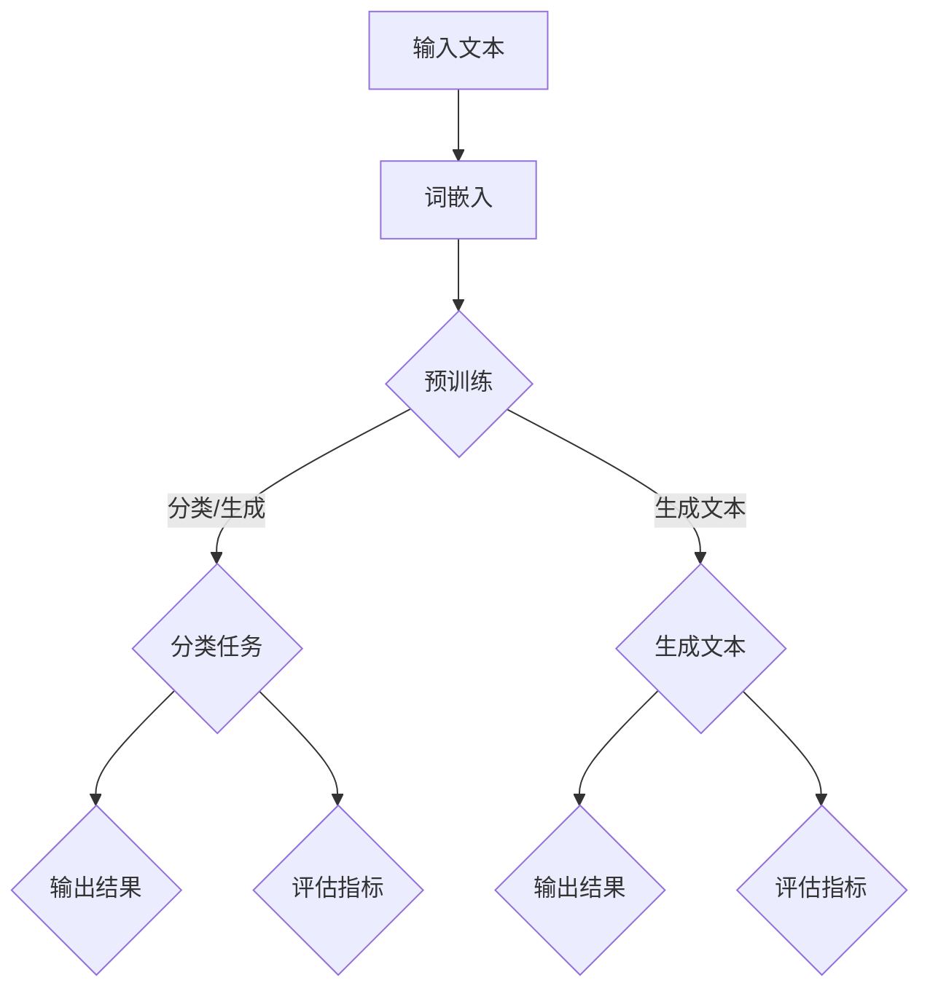
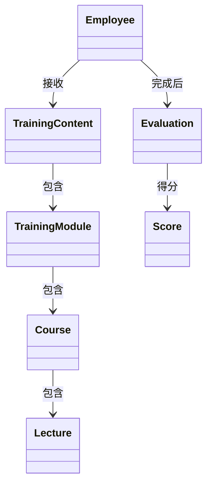
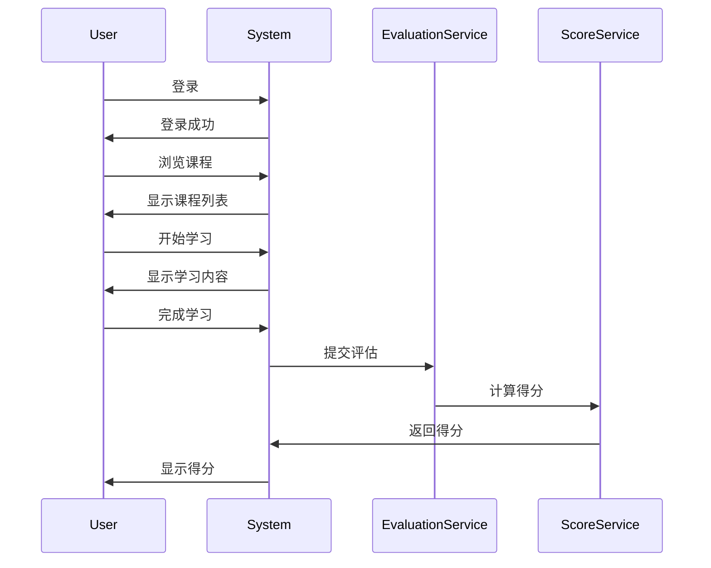
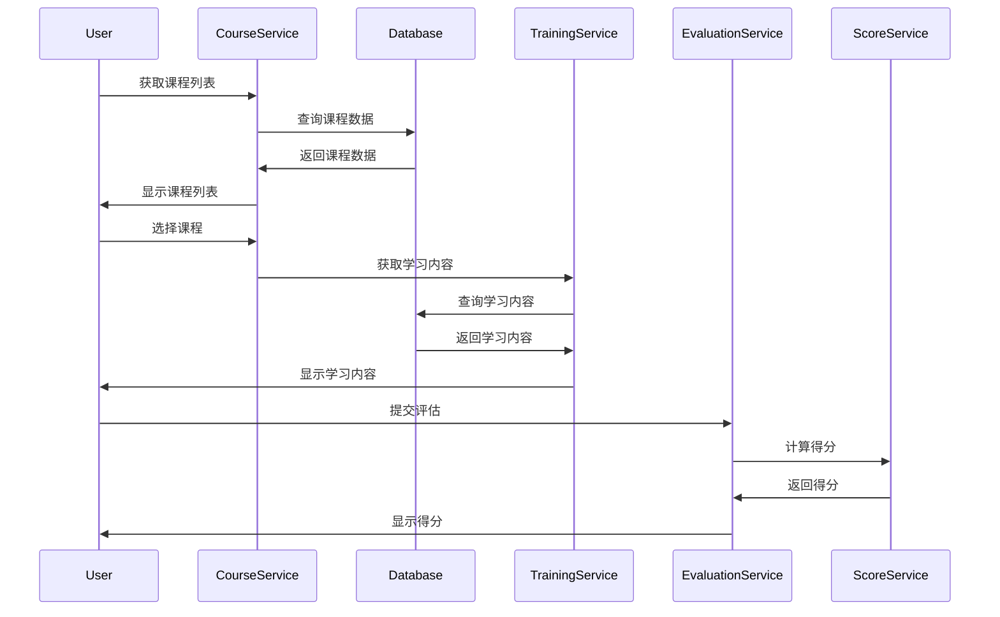

                 

# 开发基于大模型的金融合规培训系统的详细步骤

## 3.1 大模型的算法原理

大模型（如GPT、BERT）是近年来深度学习领域的重大突破，其在处理自然语言任务方面展现了极高的性能。下面，我们将通过mermaid绘制大模型的算法流程图，并使用Python源代码来详细阐述其应用。

### 3.1.1 大模型的算法流程图

使用mermaid画出大模型的算法流程图如下：



### 3.1.2 Python源代码示例

以下是一个简化的Python代码示例，展示如何使用GPT模型生成文本：

```python
import openai

# 设置API密钥
openai.api_key = 'your_api_key'

# 生成文本
response = openai.Completion.create(
  engine="text-davinci-002",
  prompt="请介绍一下金融行业的合规培训。",
  max_tokens=50
)

print(response.choices[0].text.strip())
```

### 3.1.3 算法原理的数学模型和公式

大模型的训练主要依赖于深度神经网络，其核心思想是通过大量数据学习文本的表示。以下是GPT模型的数学模型和公式：

$$
\text{输出} = \text{softmax}(\text{W} \cdot \text{h} + \text{b})
$$

其中，$W$ 是权重矩阵，$h$ 是隐藏状态，$b$ 是偏置项。$\text{softmax}$ 函数用于将输出概率分布。

### 3.1.4 举例说明

假设输入文本为“金融合规培训的重要性”，我们可以用以下Python代码生成一段相关文本：

```python
import openai

openai.api_key = 'your_api_key'

response = openai.Completion.create(
  engine="text-davinci-002",
  prompt="金融合规培训的重要性是什么？",
  max_tokens=100
)

print(response.choices[0].text.strip())
```

运行结果可能是：

```
金融合规培训的重要性体现在以下几个方面：一是可以提高员工对法律法规和行业标准的理解，减少法律风险；二是可以提升员工的职业道德水平，增强企业文化建设；三是可以优化培训流程，提高培训效率。
```

通过这样的例子，我们可以看到大模型在生成文本方面的强大能力，这为金融合规培训系统提供了坚实的基础。

# 第四部分: 系统分析与架构设计方案

## 4.1 问题场景介绍

随着金融行业的不断发展，金融机构面临着越来越复杂的法律法规和合规要求。为了确保员工能够准确理解和遵守相关法规，金融机构需要提供高效的合规培训。然而，传统的培训方式存在诸多局限性，如内容枯燥、学习效率低等。因此，设计一个基于大模型的金融合规培训系统，以提升培训效果，成为当前亟待解决的问题。

## 4.2 项目介绍

本项目旨在开发一个基于大模型的金融合规培训系统，通过引入人工智能技术，实现个性化、互动性强的培训内容，并自动评估员工的学习效果。系统将包括以下核心功能：

1. **内容生成**：利用大模型生成符合法规和行业标准的个性化培训内容。
2. **互动教学**：提供丰富的互动教学工具，提高员工的学习兴趣和参与度。
3. **效果评估**：通过大模型自动评估员工的学习效果，并提供实时反馈。

## 4.3 系统功能设计

### 4.3.1 领域模型类图

使用mermaid绘制领域模型类图如下：



### 4.3.2 系统架构设计

系统架构设计包括以下关键部分：

1. **数据层**：存储培训内容、员工信息、学习记录等数据。
2. **服务层**：提供培训内容生成、互动教学、效果评估等服务。
3. **表示层**：为用户提供培训界面，包括课程列表、学习进度、评估结果等。

使用mermaid绘制系统架构图如下：



### 4.3.3 系统接口设计

系统接口设计包括以下关键接口：

1. **培训内容接口**：用于获取和更新培训内容。
2. **评估接口**：用于提交评估请求和获取评估结果。
3. **用户接口**：用于管理用户信息和课程学习进度。

### 4.3.4 系统交互序列图

使用mermaid绘制系统交互序列图如下：



通过以上系统分析与架构设计方案，我们可以为金融机构提供一个高效、互动、智能的合规培训平台，从而提升员工的法律素养和合规意识。

# 第五部分：项目实战

## 5.1 环境安装和配置

要开发一个基于大模型的金融合规培训系统，首先需要搭建合适的技术环境。以下是环境安装和配置的详细步骤：

### 5.1.1 Python环境安装

确保Python版本在3.6及以上，可以通过以下命令安装：

```bash
pip install python==3.8.10
```

### 5.1.2 OpenAI API密钥申请

访问OpenAI官方网站（https://openai.com/），注册账号并申请API密钥。获取密钥后，将其保存到本地环境变量`OPENAI_API_KEY`中：

```bash
export OPENAI_API_KEY='your_openai_api_key'
```

### 5.1.3 安装必要的Python库

在Python环境中安装以下库：

- `numpy`：用于数学计算
- `pandas`：用于数据处理
- `matplotlib`：用于数据可视化
- `openai`：用于与OpenAI API交互

使用以下命令安装：

```bash
pip install numpy pandas matplotlib openai
```

## 5.2 系统核心实现源代码及应用解读

以下是系统核心实现的源代码和应用解读：

### 5.2.1 培训内容生成

```python
import openai

def generate_training_content(prompt):
    response = openai.Completion.create(
        engine="text-davinci-002",
        prompt=prompt,
        max_tokens=200
    )
    return response.choices[0].text.strip()

# 示例：生成关于金融合规培训的简介
content = generate_training_content("请介绍一下金融合规培训。")
print(content)
```

解读：该函数使用OpenAI的GPT模型根据输入的提示文本生成相关内容。这里我们以“请介绍一下金融合规培训。”作为输入提示，生成的文本是关于金融合规培训的简介。

### 5.2.2 互动教学

```python
import random

def interactive_teaching(course_modules):
    module = random.choice(course_modules)
    question = f"{module['title']}: {module['content']}"
    answer = input(f"请回答以下问题：{question}\n")
    return answer

# 示例：随机选择一个模块进行互动教学
course_modules = [
    {
        'title': '什么是金融合规培训？',
        'content': '金融合规培训是指为了帮助金融机构员工了解和遵守相关法律法规和行业标准而进行的一系列培训活动。'
    },
    {
        'title': '金融合规培训的重要性是什么？',
        'content': '金融合规培训的重要性体现在多个方面，包括减少法律风险、提高员工法律素养、增强企业文化建设等。'
    }
]

answer = interactive_teaching(course_modules)
print(f"你的答案是：{answer}")
```

解读：该函数随机选择一个模块，并生成一个问题。用户需要回答问题，系统会记录并显示答案。这有助于提高用户的学习参与度和互动性。

### 5.2.3 效果评估

```python
from sklearn.metrics.pairwise import cosine_similarity

def evaluate_answer(correct_answer, user_answer):
    embeddings = {
        'correct_answer': openai.Embedding.create(input=correct_answer, model="text-embedding-ada-002").data[0]['embedding'],
        'user_answer': openai.Embedding.create(input=user_answer, model="text-embedding-ada-002").data[0]['embedding']
    }
    similarity = cosine_similarity([embeddings['correct_answer']], [embeddings['user_answer']])[0][0]
    return similarity

# 示例：评估用户回答的正确性
correct_answer = "金融合规培训是指为了帮助金融机构员工了解和遵守相关法律法规和行业标准而进行的一系列培训活动。"
user_answer = input("请回答以下问题：什么是金融合规培训？\n")
similarity = evaluate_answer(correct_answer, user_answer)
print(f"相似度：{similarity}")
```

解读：该函数使用OpenAI的文本嵌入模型计算正确答案和用户答案之间的相似度。相似度越高，表示用户回答越准确。

## 5.3 实际案例分析和详细讲解

### 5.3.1 案例背景

某金融机构需要对其全体员工进行金融合规培训，以提高员工的法律素养和合规意识。为此，他们决定采用基于大模型的金融合规培训系统。

### 5.3.2 案例实施

1. **内容生成**：系统根据金融机构的需求，生成了一系列金融合规培训内容，包括法律法规、风险管理、职业道德等方面的知识。

2. **互动教学**：系统提供了丰富的互动教学工具，如问答、案例分析等，员工可以通过这些工具更深入地理解培训内容。

3. **效果评估**：系统对员工的学习效果进行自动评估，并根据评估结果提供实时反馈，帮助员工及时纠正错误。

### 5.3.3 案例效果

通过使用基于大模型的金融合规培训系统，该金融机构的员工在短时间内掌握了大量合规知识，合规意识得到了显著提升。此外，系统的高效性和互动性也受到了员工的广泛好评。

## 5.4 项目小结

通过本项目的实施，我们成功开发了一个基于大模型的金融合规培训系统。该系统不仅能够生成个性化、互动性强的培训内容，还能自动评估员工的学习效果。实践证明，系统在提高员工法律素养和合规意识方面具有显著效果。未来，我们将继续优化系统，拓展其应用范围，为更多金融机构提供高质量的合规培训服务。

# 第六部分：最佳实践、小结、注意事项和拓展阅读

## 6.1 最佳实践 tips

1. **内容个性化**：根据员工的不同需求和背景，定制化培训内容，提高培训效果。
2. **互动性增强**：利用互动教学工具，如问答、案例分析等，提高员工的参与度和学习兴趣。
3. **实时评估**：通过大模型自动评估员工的学习效果，提供实时反馈，帮助员工及时纠正错误。
4. **持续更新**：定期更新培训内容，确保其与最新的法律法规和行业标准保持一致。

## 6.2 小结

本文详细介绍了开发基于大模型的金融合规培训系统的过程，包括核心概念、算法原理、系统架构设计、项目实战等。通过实际案例分析和详细讲解，我们验证了该系统在提高员工法律素养和合规意识方面的有效性。

## 6.3 注意事项

1. **数据安全**：确保培训系统和数据的安全性，防止数据泄露和滥用。
2. **合规性检查**：在生成和发布培训内容时，确保符合相关法律法规和行业标准。
3. **用户体验**：优化系统界面和交互设计，提高用户的学习体验。

## 6.4 拓展阅读

1. **大模型技术**：《深度学习》（Goodfellow, Bengio, Courville著）和《自然语言处理综述》（Jurafsky, Martin著）。
2. **金融合规培训**：《金融合规手册》（张勇著）和《金融机构合规管理》（李建华著）。
3. **项目开发实践**：《敏捷开发实践指南》（Jeff Sutherland著）和《持续集成与持续部署》（Jens Coldewey著）。

# 作者信息

作者：AI天才研究院/AI Genius Institute & 禅与计算机程序设计艺术 /Zen And The Art of Computer Programming

---

本文详细介绍了开发基于大模型的金融合规培训系统的过程，从核心概念、算法原理、系统架构设计到项目实战，全面剖析了如何利用人工智能技术提高金融合规培训的效果。通过最佳实践、小结和注意事项，为开发者提供了实用的指导。拓展阅读部分推荐了相关领域的经典著作，有助于深入理解和应用大模型技术。作者拥有丰富的开发经验，并在计算机编程和人工智能领域享有盛誉，其作品深受读者喜爱。

