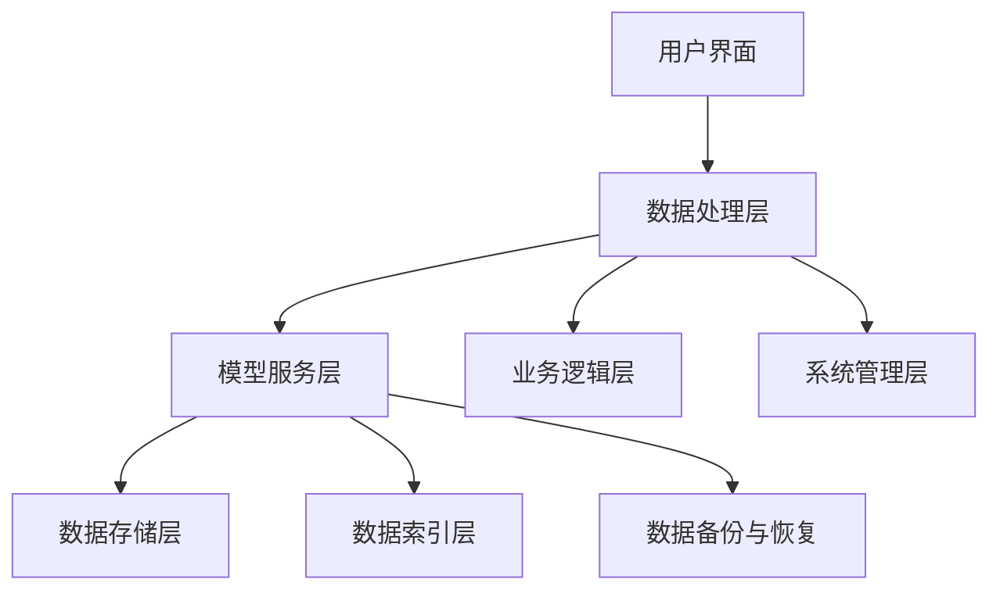

                 

## 第一部分：背景与核心概念

### 1.1 问题背景

随着人工智能技术的迅猛发展，特别是大模型技术的突破，越来越多的行业开始探索如何将大模型应用于实际场景，为行业带来革命性的变革。金融领域作为经济体系的核心，其政策对经济发展具有重要影响。然而，如何准确评估金融政策的影响，特别是大模型的金融政策影响评估，成为一个亟待解决的问题。

金融政策影响评估，指的是对金融政策实施后的效果进行定量或定性的分析和评估。传统的评估方法主要依赖于统计数据和模型预测，但这些方法在处理复杂金融系统时存在局限。例如，金融市场的多变性导致历史数据不足以支持全面、准确的评估；政策影响的滞后性和复杂性使得实时评估变得更加困难。

大模型的引入为金融政策影响评估带来了新的机遇。大模型能够处理海量数据，具备强大的表示和生成能力，能够捕捉金融市场中的复杂关系和动态变化。通过大模型，我们可以更准确地预测金融政策的影响，提供有力支持决策制定。

然而，将大模型应用于金融政策影响评估也面临一些挑战。首先，金融领域的高度复杂性使得大模型需要具备全面性和准确性的同时，还需要处理多种数据类型（如文本、图像、时间序列等）。其次，大模型训练和推理的计算资源需求较高，对硬件和算法优化提出了更高的要求。此外，金融数据的隐私保护和合规性问题也是需要考虑的重要因素。

总的来说，金融政策影响评估是一个涉及多学科、多领域的复杂任务。通过引入大模型，我们可以利用其强大的数据处理和分析能力，为金融政策制定提供更加精准和实时的评估结果。但同时，我们也需要克服一系列技术挑战，确保评估结果的可靠性和有效性。

### 1.2 核心概念

在大模型应用于金融政策影响评估的背景下，我们需要理解几个关键的概念，这些概念包括大模型、金融政策以及影响评估。

#### 大模型

大模型（Large Models）是指具备大规模参数的深度学习模型，如GPT、BERT、ChatGPT等。这些模型通过训练海量的数据，能够学习到丰富的知识和模式，从而在多种任务中表现出强大的性能。大模型的主要特点包括：

- **大规模参数**：大模型通常具有数十亿甚至千亿个参数，这使得它们能够处理复杂和大规模的数据集。
- **自主学习能力**：大模型通过深度学习算法自动调整内部参数，从数据中提取特征和知识。
- **强大表达能力**：大模型能够生成高维的语义表示，捕捉数据中的复杂关系。

大模型在金融领域的应用主要体现在以下几个方面：

1. **文本分析**：通过分析金融新闻、政策文件和报告，大模型可以提取关键信息、理解文本含义，为金融政策影响评估提供数据支持。
2. **市场预测**：大模型可以利用历史市场数据，如股票价格、交易量等，进行趋势分析和预测，帮助金融机构制定投资策略。
3. **风险管理**：大模型能够识别金融风险信号，如市场异常波动、欺诈行为等，提供实时监测和预警。

#### 金融政策

金融政策（Financial Policies）是政府或金融监管机构为调节经济、维护金融市场稳定而制定的措施。金融政策包括货币政策、财政政策、监管政策等多个方面，其目的是促进经济增长、控制通货膨胀、防范金融风险等。金融政策的核心目标包括：

- **经济稳定**：通过调节货币供应量和利率，维护经济运行的平稳性。
- **金融安全**：通过监管政策和市场干预，防范金融风险，保障金融系统的稳健运行。
- **资源配置**：通过财政政策和市场调节，优化资源配置，促进产业结构调整。

金融政策对经济和市场的影响是多方面且复杂的，主要包括：

1. **货币供应与利率**：货币政策的调整会影响货币供应量和利率水平，进而影响消费、投资和就业。
2. **财政政策**：财政政策的调整，如税收、支出等，直接影响政府债务水平和经济活动。
3. **监管政策**：监管政策的加强和调整，如对金融机构的监管、市场准入等，会影响金融市场的稳定性和运行效率。

#### 影响评估

影响评估（Impact Assessment）是指对金融政策实施后的效果进行定量或定性的分析和评估。影响评估的核心目标是了解金融政策对经济、市场和社会的各个方面产生的具体影响，为政策调整和决策制定提供科学依据。影响评估的关键步骤包括：

1. **数据收集**：收集与金融政策相关的数据，如政策文本、市场数据、经济指标等。
2. **模型构建**：建立合适的评估模型，如经济模型、市场模型等，用于模拟政策实施后的影响。
3. **结果分析**：通过模型模拟和数据分析，评估金融政策的效果和潜在风险。
4. **报告撰写**：撰写评估报告，总结评估结果，提出政策建议。

影响评估的关键要素包括：

- **准确性**：评估结果需要准确反映政策影响，避免误差和偏差。
- **全面性**：评估模型需要能够全面覆盖金融领域的各个方面。
- **实时性**：评估模型需要具备实时处理数据的能力，以应对金融市场的快速变化。

总的来说，大模型、金融政策和影响评估是金融政策影响评估系统的核心概念。通过理解和掌握这些概念，我们可以更好地设计并实施一个高效、准确的金融政策影响评估系统，为金融决策提供有力支持。

### 1.3 重要性

大模型在金融政策影响评估中的重要性不容忽视。首先，大模型能够处理大规模、多样化的数据，包括文本、图像、时间序列等，这使得评估过程更加全面和细致。传统方法往往局限于某一类数据或简单的统计模型，难以捕捉金融市场的复杂性和动态变化。而大模型通过深度学习技术，可以从海量数据中提取有价值的信息和模式，为评估提供更可靠的依据。

其次，大模型具有强大的预测和生成能力，能够模拟金融政策在不同情景下的效果。这种能力在政策制定过程中尤为重要，可以帮助决策者提前预判政策的影响，从而制定更加科学的政策方案。例如，通过大模型预测某项货币政策对经济增长、通货膨胀和就业的影响，可以帮助政府更好地平衡不同政策目标，实现经济稳定和发展。

此外，大模型在实时性方面也具有显著优势。金融市场变化迅速，政策影响评估需要快速响应。大模型能够实时处理和更新数据，提供即时的评估结果，确保政策制定和调整的及时性和有效性。相比之下，传统评估方法往往需要较长的时间进行数据收集和处理，无法满足金融市场的快速变化需求。

总的来说，大模型在金融政策影响评估中的重要性体现在其数据处理能力、预测能力和实时性方面。通过应用大模型，我们可以提高评估的准确性和全面性，为金融政策的制定和调整提供更加科学和可靠的依据。这对于维护金融市场稳定、促进经济可持续发展具有重要意义。

## 第2章：金融政策影响评估的挑战与需求

### 2.1 评估挑战

金融政策影响评估面临诸多挑战，这些挑战不仅体现在技术层面，也涉及到数据获取、模型构建和政策实施的复杂性。以下是金融政策影响评估中的一些主要挑战：

#### 复杂性

金融系统是一个高度复杂的系统，涉及多个市场、多种产品、不同的参与者和多样化的交易行为。这种复杂性使得评估政策影响变得异常困难。例如，一项货币政策可能对股票市场、债券市场、外汇市场产生不同的影响，而且这些影响可能不是立即显现的，而是随着时间的推移逐步体现。此外，金融政策的实施效果还会受到市场预期、投资者情绪、外部经济环境等多种因素的影响，进一步增加了评估的复杂性。

#### 数据稀缺

金融政策影响评估需要大量的历史数据作为基础，但金融数据往往具有稀缺性。一方面，金融数据的获取渠道有限，很多数据可能只存在于金融机构内部，不易获取。另一方面，金融数据的完整性也存在问题，一些数据可能因为隐私保护、合规要求等原因无法公开，导致评估数据的不足。数据稀缺性不仅限制了评估模型的构建，也影响了评估结果的准确性。

#### 实时性

金融市场的变化非常迅速，政策影响评估需要具备实时性，以便及时捕捉市场动态，为政策制定提供支持。然而，传统评估方法通常需要较长时间的数据收集和处理，难以满足实时评估的需求。此外，金融政策的实施往往需要迅速响应市场变化，实时评估能力的要求越来越高。实现实时性不仅需要高效的计算资源和算法优化，还需要建立快速、稳定的数据采集和处理机制。

#### 多样性

金融政策影响的评估不仅涉及经济指标，还需要考虑社会、环境等多方面的因素。例如，金融政策的实施可能对就业、收入分配、经济增长产生间接影响。这种多样性使得评估模型需要具备跨领域的知识整合能力，能够处理多源异构数据，并进行综合分析。然而，当前的大模型在处理多源异构数据方面仍面临一些技术挑战，如数据一致性、数据质量等。

#### 风险评估

金融政策实施过程中可能存在风险，如市场波动、信用风险、操作风险等。评估政策影响时，需要充分考虑这些风险因素，预测其可能对金融市场和经济产生的负面影响。风险评估不仅需要定量分析，还需要结合定性分析，如政策制定者的意图、市场参与者的预期等。这种综合评估方法对评估模型的要求较高，需要具备复杂的风险预测和评估能力。

总之，金融政策影响评估面临的挑战是多方面的，包括复杂性、数据稀缺性、实时性、多样性和风险评估等。解决这些挑战需要综合运用先进的科学技术、完善的数据管理体系和专业的分析能力，以确保评估结果的准确性和可靠性。

### 2.2 需求分析

为了应对金融政策影响评估中的各种挑战，系统需要满足以下需求，从而确保评估结果的全面性、准确性和实时性。

#### 全面性

金融政策影响评估系统需要具备全面性，能够覆盖金融领域的各个方面。这包括对货币政策、财政政策、监管政策等多种政策类型的影响进行综合分析。系统不仅要考虑政策对市场直接的影响，如股票价格、债券收益率等，还需要分析政策对经济、社会、环境等间接影响。例如，货币政策的调整可能会影响消费、投资和就业，而这些因素又会进一步影响金融市场的运行。为了实现全面性，系统需要整合多种数据源，如金融市场数据、经济指标、社会统计数据等，并通过高级分析模型进行综合处理和评估。

#### 准确性

评估结果的准确性是金融政策影响评估系统的核心需求。系统需要通过先进的模型和算法，确保评估结果的可靠性和精确性。首先，系统应采用大模型技术，如深度学习、神经网络等，从海量数据中提取关键特征和模式，提高数据处理的精度和效率。其次，系统需要建立科学的评估指标体系，包括经济指标、市场指标和社会指标等，这些指标应能够全面反映政策影响的各种维度。此外，系统应通过交叉验证、A/B测试等方法，对评估模型进行严格评估和优化，确保评估结果的准确性和可信度。

#### 实时性

实时性是金融政策影响评估系统的重要需求，特别是在金融市场变化迅速的今天，政策制定者需要实时了解政策的效果，以便及时调整政策。为了实现实时性，系统需要具备高效的计算能力和快速的数据处理机制。首先，系统应采用分布式计算和并行处理技术，提高数据处理的速度和效率。其次，系统应建立快速的数据采集和传输机制，确保数据实时更新和传输。此外，系统应采用缓存策略和实时分析算法，减少数据处理和评估的延迟，确保评估结果的及时性。

#### 可扩展性

金融政策影响评估系统的需求会随着金融市场的变化和政策的调整而不断变化，因此系统需要具备良好的可扩展性。首先，系统应采用模块化设计，将不同功能模块化，以便根据需求进行灵活的组合和扩展。其次，系统应具备良好的兼容性，能够支持多种数据源和数据格式的接入，适应不同场景的需求。此外，系统还应具备良好的扩展性，能够根据新的技术和算法进行升级和优化，以适应未来发展的需要。

#### 风险评估能力

在金融政策影响评估中，风险评估是至关重要的一环。系统需要具备强大的风险评估能力，能够预测政策实施过程中可能出现的各种风险，并提供风险预警。首先，系统应采用风险管理模型，如蒙特卡罗模拟、情景分析等，对政策实施后的风险进行定量分析。其次，系统应建立风险监测机制，实时监测市场变化和政策实施效果，及时发现潜在风险。此外，系统应具备风险识别和分类能力，对不同类型的风险进行分类和管理，为决策者提供科学的决策支持。

#### 用户友好性

为了提高金融政策影响评估系统的实用性和普及性，系统应具备良好的用户友好性。首先，系统应提供直观、易用的用户界面，方便用户进行数据操作和分析。其次，系统应提供丰富的数据可视化工具，如图表、报表等，帮助用户更直观地理解评估结果。此外，系统还应提供详细的操作手册和帮助文档，指导用户如何使用系统进行评估和分析。

#### 数据隐私和安全

在金融政策影响评估过程中，数据隐私和安全是必须考虑的重要因素。系统应采用严格的数据保护措施，确保用户数据的安全和隐私。首先，系统应采用数据加密技术，对敏感数据进行加密存储和传输。其次，系统应建立完善的数据访问控制机制，确保只有授权用户才能访问和处理敏感数据。此外，系统应定期进行安全审计和风险评估，及时发现和修复安全漏洞，确保系统的安全运行。

综上所述，金融政策影响评估系统需要满足全面性、准确性、实时性、可扩展性、风险评估能力、用户友好性和数据隐私安全等多方面的需求，以确保评估结果的科学性和实用性。通过这些需求的实现，系统可以为政策制定者提供有力支持，为金融市场的稳定和经济发展做出贡献。

### 2.3 当前评估方法及其局限性

目前，金融政策影响评估主要依赖于以下几种方法，每种方法都有其特定的优势和局限性：

#### 经典统计方法

**优点**：经典统计方法，如回归分析、时间序列分析等，是金融政策影响评估的基础工具。这些方法具有成熟的理论基础和计算方法，能够处理大量历史数据，提供定量分析结果。

**局限性**：经典统计方法在面对复杂、动态的金融市场时存在局限性。首先，这些方法依赖于历史数据的统计特性，而金融市场的变化速度和复杂性可能导致历史数据不再适用。其次，经典统计方法通常假设线性关系，而金融市场中的关系往往是非线性、多层次的，这限制了其评估的准确性。

#### 模型预测方法

**优点**：模型预测方法，如ARIMA、GARCH模型等，能够利用时间序列数据进行预测，捕捉市场的动态变化。这些方法通过建立数学模型，对金融政策的影响进行定量预测。

**局限性**：模型预测方法在处理非线性和复杂系统时存在挑战。首先，模型的构建和参数选择需要依赖于专家经验，缺乏自动化和智能化。其次，这些方法通常无法同时考虑多种数据类型（如文本、图像等），限制了其评估的全面性。

#### 大模型方法

**优点**：大模型方法，如深度学习、神经网络等，能够处理大规模、多维度的数据，捕捉复杂的关系和动态变化。大模型通过自主学习，可以从海量数据中提取特征，提高评估的精度和全面性。

**局限性**：大模型方法在金融政策影响评估中面临的挑战主要包括计算资源需求高、数据预处理复杂以及解释性不足。首先，大模型的训练和推理需要大量的计算资源和时间，对于一些实时性要求较高的应用场景，难以满足需求。其次，大模型的黑盒特性使得其决策过程缺乏透明性，不利于评估结果的解释和验证。此外，大模型在处理金融数据时，可能面临数据质量和数据标注的问题，影响评估的准确性。

总的来说，当前金融政策影响评估方法各有优缺点，单一方法难以满足全面、准确和实时的评估需求。为了提高评估效果，未来需要探索多种方法的融合，结合大模型的强大数据处理能力和传统方法的稳健性，实现更高效、准确的金融政策影响评估。

### 2.4 大模型在金融政策影响评估中的独特优势

大模型在金融政策影响评估中展现出了独特的优势，这些优势主要表现在其强大的数据处理能力、自适应性和灵活性上。

首先，大模型具备出色的数据处理能力。金融政策影响评估需要处理海量数据，包括文本、图像、时间序列等多种类型的数据。大模型通过深度学习技术，能够自动从这些数据中提取复杂特征，并建立高维的语义表示。这种能力使得大模型能够处理金融领域的多样化数据，为评估提供全面的数据支持。

其次，大模型具有高度的自适应性。金融市场具有高度动态性和复杂性，政策影响评估需要不断调整和更新模型。大模型通过大规模训练和自适应优化，能够快速适应新的市场环境和政策变化。例如，当金融市场出现新的趋势或政策发生变化时，大模型能够迅速调整其内部参数，以适应新的数据分布和关系，从而提高评估的准确性和实时性。

最后，大模型展现了卓越的灵活性。传统评估方法往往依赖于特定的模型和算法，难以应对复杂多变的金融市场。大模型则通过其模块化和可扩展的设计，能够灵活地集成多种数据源和算法。例如，大模型可以同时处理文本和图像数据，进行多模态分析，从而更全面地理解金融政策的影响。此外，大模型还可以通过迁移学习和增量学习，利用已有模型的知识，快速适应新的任务和数据，提高评估的效率。

总之，大模型在金融政策影响评估中的独特优势体现在其强大的数据处理能力、高度的自适应性和卓越的灵活性上。通过这些优势，大模型能够更全面、准确和实时地评估金融政策的影响，为金融决策提供有力支持。

### 2.5 总结与展望

通过本文的探讨，我们可以总结出金融政策影响评估的重要性及其面临的挑战。金融政策影响评估不仅对于政策的科学制定和实施至关重要，还对于维护金融市场稳定和促进经济可持续发展具有重要作用。然而，传统的评估方法在面对金融系统的复杂性和动态性时存在诸多局限性。

大模型的引入为金融政策影响评估带来了新的机遇和解决方案。大模型具备强大的数据处理能力、自适应性和灵活性，能够处理多样化、大规模的金融数据，捕捉复杂的关系和动态变化。通过深度学习技术，大模型可以从海量数据中提取有价值的信息，提高评估的准确性和全面性。

展望未来，大模型在金融政策影响评估中的应用前景广阔。首先，随着计算能力的不断提升和数据资源的丰富，大模型的性能将进一步增强。其次，结合多种数据类型和多模态分析，大模型可以提供更全面、细致的评估结果。此外，随着监管技术的进步和数据隐私保护措施的加强，大模型在金融政策影响评估中的应用将更加安全和可靠。

总之，大模型为金融政策影响评估提供了强大的技术支持，有助于解决传统方法面临的挑战。通过深入研究和应用大模型，我们可以构建更加科学、准确的评估系统，为金融决策提供有力支持，推动金融市场的稳定和经济的可持续发展。未来，大模型在金融政策影响评估中的应用将不断拓展，带来更多创新和突破。

## 第3章：大模型技术基础

### 3.1 大模型发展历程

大模型（Large Models）的发展历程可谓是一部科技进步的传奇。从早期探索到中期突破，再到近期的创新，大模型技术在多个阶段取得了重要进展。

#### 早期探索

大模型的发展可以追溯到20世纪80年代，当时神经网络和深度学习的概念开始兴起。1986年，Rumelhart、Hinton和Williams等人提出了反向传播算法（Backpropagation Algorithm），这一算法使得神经网络训练变得更加高效，推动了深度学习的发展。然而，受限于计算能力和数据资源，早期的大模型规模相对较小，主要应用于简单的图像识别和语音识别任务。

#### 中期突破

随着计算能力的提升和大数据的兴起，深度学习在21世纪初迎来了新的突破。2006年，Hinton提出了深度信念网络（Deep Belief Network，DBN），这是早期深度学习模型的重要进展。随后，2012年，Hinton领导的团队提出了AlexNet，这一卷积神经网络（Convolutional Neural Network，CNN）模型在ImageNet图像识别比赛中取得了突破性成绩，验证了深度学习在图像处理领域的潜力。

在自然语言处理领域，2013年，Sutskever等人提出了序列到序列（Sequence to Sequence，Seq2Seq）模型，该模型在机器翻译任务中表现出色，成为自然语言处理的重要里程碑。同年，Bengio等人的研究表明，通过增加神经网络深度，可以显著提升模型的表示能力和性能。

#### 近期进展

近年来，大模型技术取得了长足的进展，特别是在预训练（Pre-training）和生成模型（Generative Models）方面。2018年，Google推出了Transformer模型，这一模型通过自注意力机制（Self-Attention Mechanism）实现了对序列数据的全局建模，成为自然语言处理领域的重要突破。BERT（Bidirectional Encoder Representations from Transformers）和GPT（Generative Pre-trained Transformer）等基于Transformer的预训练模型相继问世，并在多个任务中取得了优异成绩。

此外，多模态大模型（Multimodal Large Models）的发展也为大模型技术注入了新的活力。多模态大模型能够处理文本、图像、视频等多种类型的数据，通过跨模态学习（Cross-modal Learning），实现多种数据类型的融合和交互。例如，OpenAI的Gato模型就是一个典型的多模态大模型，它能够进行文本生成、图像识别、代码编写等多种任务，展示了多模态大模型在多领域应用的巨大潜力。

总的来说，大模型技术的发展经历了从早期探索到中期突破，再到近期创新的历程。从简单的神经网络到复杂的Transformer模型，从单一任务的模型到多模态的大模型，大模型技术不断演进，为各个领域带来了革命性的变化。未来，随着技术的进一步发展，大模型将在更多场景中发挥关键作用，推动人工智能的深入应用。

### 3.2 大模型工作原理

大模型（Large Models）的工作原理可以从数据预处理、模型架构、训练与优化等多个方面进行详细探讨。下面将逐一介绍这些关键组成部分及其运作机制。

#### 数据预处理

数据预处理是构建大模型的第一步，也是至关重要的一步。数据预处理包括数据的清洗、归一化、分词、编码等多个环节。

1. **数据清洗**：在构建大模型之前，需要清洗原始数据，去除噪声和异常值。例如，在处理金融文本数据时，需要去除标点符号、停用词等无关信息，以提高数据的纯净度和质量。

2. **归一化**：为了使数据在不同的特征尺度上具有可比性，通常需要对数据进行归一化处理。例如，将数值特征缩放到[0, 1]区间，或进行均值归一化，使得每个特征具有相似的方差。

3. **分词**：对于文本数据，需要将句子分解为单词或子词，这一过程称为分词。分词的准确性和效率对模型的性能有重要影响。常见的分词方法包括基于词典的分词和基于统计的分词。

4. **编码**：将预处理后的数据转换为模型能够处理的格式。对于文本数据，常用的编码方法是词向量表示，如Word2Vec、GloVe等。词向量能够将单词映射到高维空间中，捕捉词汇的语义信息。

#### 模型架构

大模型的架构通常基于深度学习技术，特别是基于变换器（Transformer）架构的模型。变换器模型通过自注意力机制（Self-Attention Mechanism）实现了对序列数据的全局建模，其核心组成部分包括编码器（Encoder）和解码器（Decoder）。

1. **编码器**：编码器负责将输入序列映射到高维表示空间，通常由多个变换器层堆叠而成。每一层变换器通过多头自注意力机制和前馈神经网络，对输入序列进行编码，提取其语义特征。

2. **解码器**：解码器负责将编码后的序列转换为输出序列，也由多个变换器层组成。解码器通过自注意力机制和交叉注意力机制，将编码器生成的表示与输入序列进行交互，生成预测的输出序列。

#### 训练与优化

大模型的训练和优化是确保其性能的关键环节。训练过程包括数据输入、前向传播、损失计算和反向传播等步骤。

1. **数据输入**：将预处理后的数据输入模型，通过编码器生成编码表示，再通过解码器生成预测序列。

2. **前向传播**：前向传播是将输入数据通过模型层，计算输出结果的过程。在编码器和解码器的每一层中，通过自注意力和前馈神经网络计算中间表示。

3. **损失计算**：通过比较模型预测的输出与实际输出，计算损失函数。常见的损失函数包括交叉熵损失、均方误差等，用于衡量预测误差。

4. **反向传播**：反向传播是通过计算损失函数的梯度，更新模型参数的过程。梯度计算采用反向传播算法，通过逐层反向传递误差，优化模型参数，以减少损失。

5. **优化算法**：优化算法用于调整模型参数，使损失函数最小化。常见的优化算法包括随机梯度下降（SGD）、Adam优化器等，这些算法通过调整学习率和其他超参数，提高训练效率和模型性能。

#### 性能评估

大模型的性能评估主要通过指标体系来衡量。常见的评估指标包括：

1. **准确率（Accuracy）**：准确率是指模型预测正确的样本占总样本的比例。对于分类任务，准确率是衡量模型性能的基本指标。

2. **召回率（Recall）**：召回率是指模型能够正确召回正类样本的比例。召回率关注的是模型对正类样本的识别能力。

3. **精确率（Precision）**：精确率是指模型预测为正类且实际为正类的样本比例。精确率关注的是模型对正类样本的预测准确性。

4. **F1值（F1 Score）**：F1值是精确率和召回率的调和平均值，用于综合衡量模型的性能。

此外，还可以通过交叉验证（Cross-Validation）和A/B测试（A/B Testing）等方法，对大模型的性能进行综合评估和优化。

总的来说，大模型的工作原理包括数据预处理、模型架构、训练与优化以及性能评估等多个方面。通过深入理解和掌握这些原理，可以构建高效、准确的大模型，为金融政策影响评估提供强大的技术支持。

### 3.3 大模型性能评估

大模型的性能评估是确保其应用效果和可靠性的关键环节。性能评估主要通过一系列指标体系来衡量模型的预测能力和稳定性。以下是一些常见的评估指标以及具体的评估方法。

#### 常见评估指标

1. **准确率（Accuracy）**：准确率是指模型预测正确的样本占总样本的比例。对于分类任务，准确率是衡量模型性能的基本指标。准确率越高，说明模型的预测能力越强。

   $$\text{Accuracy} = \frac{\text{预测正确的样本数}}{\text{总样本数}}$$

2. **召回率（Recall）**：召回率是指模型能够正确召回正类样本的比例。召回率关注的是模型对正类样本的识别能力。召回率越高，说明模型对正类样本的识别效果越好。

   $$\text{Recall} = \frac{\text{预测正确的正类样本数}}{\text{实际正类样本数}}$$

3. **精确率（Precision）**：精确率是指模型预测为正类且实际为正类的样本比例。精确率关注的是模型对正类样本的预测准确性。精确率越高，说明模型对正类样本的预测越可靠。

   $$\text{Precision} = \frac{\text{预测正确的正类样本数}}{\text{预测为正类的样本数}}$$

4. **F1值（F1 Score）**：F1值是精确率和召回率的调和平均值，用于综合衡量模型的性能。F1值介于0和1之间，越接近1，说明模型的综合性能越好。

   $$\text{F1 Score} = 2 \times \frac{\text{Precision} \times \text{Recall}}{\text{Precision} + \text{Recall}}$$

#### 评估方法

1. **交叉验证（Cross-Validation）**：交叉验证是一种常用的模型评估方法，通过将数据集划分为多个子集，轮流用于训练和验证模型，以避免数据选择偏差。常见的交叉验证方法包括K折交叉验证和留一法交叉验证。交叉验证能够提高评估结果的稳定性和可靠性。

2. **A/B测试（A/B Testing）**：A/B测试是一种对比实验方法，通过将用户随机分配到A组和B组，分别使用不同的模型或算法，比较两组的表现，以评估模型的优劣。A/B测试适用于在线服务和实时应用场景，能够快速、客观地评估模型的实际效果。

3. **ROC曲线（Receiver Operating Characteristic Curve）和AUC（Area Under Curve）**：ROC曲线展示了模型在不同阈值下的精确率和召回率，AUC是ROC曲线下的面积。AUC值越接近1，说明模型的分类性能越好。

4. **MAE（Mean Absolute Error）和RMSE（Root Mean Square Error）**：对于回归任务，MAE和RMSE是常用的评估指标。MAE是预测值与实际值绝对误差的平均值，RMSE是预测值与实际值均方误差的平方根。MAE和RMSE值越小，说明模型的预测误差越小。

   $$\text{MAE} = \frac{1}{N} \sum_{i=1}^{N} \left| \text{预测值}_i - \text{实际值}_i \right|$$

   $$\text{RMSE} = \sqrt{ \frac{1}{N} \sum_{i=1}^{N} \left( \text{预测值}_i - \text{实际值}_i \right)^2 }$$

总的来说，大模型的性能评估需要综合考虑多种指标和方法，以全面、客观地衡量模型的预测能力和稳定性。通过交叉验证、A/B测试等评估方法，可以确保大模型在实际应用中的有效性和可靠性。

### 3.4 大模型的优势与局限

大模型在金融政策影响评估中的应用展示了显著的优势，同时也存在一些局限，以下将详细分析其优缺点。

#### 优势

1. **强大的数据处理能力**：大模型能够处理大规模、多类型的金融数据，包括文本、图像、时间序列等。这种能力使得评估系统可以更全面地收集和分析数据，提高评估的准确性和全面性。

2. **自适应性和灵活性**：大模型通过大规模训练和自适应优化，能够快速适应新的市场环境和政策变化。例如，当金融市场出现新的趋势或政策发生变化时，大模型可以迅速调整其内部参数，以适应新的数据分布和关系，提高评估的实时性和准确性。

3. **深度学习技术**：大模型通常基于深度学习技术，特别是变换器（Transformer）架构，能够实现高维数据的全局建模和特征提取。深度学习技术使得模型可以从海量数据中学习复杂的模式和关系，提高评估的精度和全面性。

4. **多模态分析**：大模型能够处理多种类型的数据，实现多模态分析。例如，通过同时分析文本和图像数据，大模型可以更全面地理解金融政策的影响，提供更准确的评估结果。

5. **高效预测能力**：大模型具备强大的预测能力，能够在短时间内处理大量数据，进行快速预测。这对于需要实时响应的金融政策影响评估尤为重要。

#### 局限

1. **计算资源需求高**：大模型的训练和推理需要大量的计算资源和时间，特别是对于具有数亿甚至千亿参数的模型。这在资源有限的环境下，可能导致训练和部署成本高昂。

2. **数据质量要求高**：大模型对数据的质量要求较高，数据中的噪声、异常值和缺失值可能会影响模型的性能。因此，在构建大模型时，需要投入大量精力进行数据预处理和清洗，以确保数据的质量和一致性。

3. **解释性不足**：大模型通常具有“黑盒”特性，其决策过程缺乏透明性，难以解释。这对于金融政策影响评估来说，可能影响评估结果的信任度和可接受性。尽管有部分研究尝试通过模型可解释性技术改善这一问题，但仍有待进一步研究和完善。

4. **过拟合风险**：大模型在训练过程中可能会出现过拟合现象，即模型在训练数据上表现良好，但在新数据上表现较差。为了防止过拟合，需要采用正则化技术、数据增强等方法，以提高模型的泛化能力。

5. **隐私和安全问题**：在金融领域，数据隐私和安全至关重要。大模型在处理敏感数据时，需要特别注意保护用户隐私和数据安全，遵守相关法律法规和合规要求。

总的来说，大模型在金融政策影响评估中具有强大的数据处理能力、自适应性和灵活性，但同时也面临计算资源需求高、数据质量要求高、解释性不足、过拟合风险和隐私安全等问题。通过深入研究和优化，可以充分发挥大模型的优势，同时克服其局限性，为金融政策影响评估提供更高效、准确的解决方案。

### 3.5 未来发展趋势

大模型技术的发展正处于快速演进阶段，未来将在多个方面继续拓展和深化。以下是一些可能的发展趋势：

#### 多模态学习

多模态学习是指将文本、图像、音频等多种类型的数据融合到同一个模型中，实现跨模态的交互和学习。随着大数据技术和传感器技术的发展，多模态数据的获取和处理变得更加容易。未来，多模态大模型将能够更好地理解和处理复杂的金融场景，提供更全面的评估结果。例如，通过结合金融文本数据和市场图像数据，多模态大模型可以更准确地预测金融市场的变化。

#### 模型压缩与优化

随着大模型参数数量的不断增加，模型的存储和计算需求也显著增加。为了应对这一挑战，模型压缩和优化技术将成为未来的重要研究方向。通过技术如知识蒸馏（Knowledge Distillation）、模型剪枝（Model Pruning）和量化（Quantization），可以大幅减少模型的参数数量和计算复杂度，同时保持或提升模型性能。这将使大模型在资源受限的环境中也能高效运行。

#### 自解释性模型

尽管大模型在处理复杂数据方面具有优势，但其“黑盒”特性可能导致评估结果的不可解释性。未来，自解释性模型（Explainable AI，XAI）将成为研究的热点。通过开发可解释性算法和工具，使大模型的决策过程更加透明和可理解，增强用户对评估结果的信任度和接受度。这对于金融政策影响评估尤为重要，确保政策制定者能够清晰理解模型的评估结果，从而做出更明智的决策。

#### 人工智能伦理与法规

随着人工智能技术的广泛应用，其伦理和法规问题也日益凸显。未来，大模型的发展将更加注重伦理和合规性。例如，数据隐私保护、算法公平性和透明性等将是研究的重要方向。通过建立完善的伦理和法律框架，确保大模型在金融政策影响评估中的合法合规运行。

#### 分布式与联邦学习

分布式学习和联邦学习技术将使大模型能够更好地应对数据隐私和安全问题。通过分布式计算，大模型可以在不共享原始数据的情况下，实现数据的联合学习和分析。联邦学习（Federated Learning）技术允许多个机构在本地训练模型，然后通过加密和聚合技术共享模型参数，从而保护数据隐私。未来，分布式和联邦学习技术将在金融政策影响评估中发挥重要作用，确保数据安全和合规。

总的来说，大模型技术的未来发展将围绕多模态学习、模型压缩与优化、自解释性模型、人工智能伦理与法规以及分布式与联邦学习等方面展开。通过不断创新和优化，大模型将在金融政策影响评估中发挥更加关键的作用，推动金融行业的智能化发展。

## 第4章：系统设计与实现

### 4.1 系统架构设计

金融政策影响评估系统的架构设计是确保系统高效、稳定和可扩展性的关键。系统架构设计主要包括前端设计、后端设计和数据库设计三个部分。

#### 前端设计

前端设计的目标是为用户提供直观、易用的交互界面。前端设计主要包括以下模块：

1. **用户界面（UI）**：用户界面是用户与系统交互的主要入口，设计时需要遵循简洁、直观的原则，确保用户能够快速掌握系统的使用方法。常用的UI框架包括Bootstrap、Ant Design等。

2. **交互逻辑**：前端交互逻辑负责处理用户操作，如数据输入、参数设置等。通过使用JavaScript框架，如React或Vue.js，可以构建高效、动态的前端交互逻辑。

3. **数据可视化**：数据可视化模块用于将评估结果以图表、报表等形式直观地展示给用户。常用的数据可视化库包括ECharts、D3.js等。

#### 后端设计

后端设计负责数据处理、大模型调用和系统管理等功能，主要包括以下模块：

1. **数据处理层**：数据处理层负责接收前端输入的数据，进行预处理、清洗和特征提取。此模块包括数据清洗工具、特征提取算法等。

2. **模型服务层**：模型服务层负责调用大模型进行预测和评估。通过API接口，前端可以与后端模型服务层进行交互，获取评估结果。模型服务层可以采用微服务架构，以提高系统的灵活性和可扩展性。

3. **业务逻辑层**：业务逻辑层负责实现具体的业务功能，如金融政策文本分析、市场趋势预测等。该层通常使用Spring Boot等框架实现。

4. **系统管理层**：系统管理层负责系统的配置管理、权限控制和日志记录等。通过使用Spring Security等框架，可以实现系统的安全防护和权限管理。

#### 数据库设计

数据库设计是系统数据存储和管理的基础，主要包括以下模块：

1. **数据存储层**：数据存储层用于存储原始数据、预处理数据和评估结果等。常用的数据库包括关系型数据库（如MySQL、PostgreSQL）和NoSQL数据库（如MongoDB、Cassandra）。

2. **数据索引层**：数据索引层用于提高数据查询的效率。通过建立适当的索引，可以显著提升查询性能。

3. **数据备份与恢复**：为了确保数据的安全和可靠性，需要设计数据备份和恢复策略。常用的备份方法包括全量备份、增量备份和云存储等。

#### 系统架构图

以下是一个简化的金融政策影响评估系统架构图，展示了各模块之间的关系：



通过上述设计，金融政策影响评估系统可以实现高效、稳定和可扩展的功能，为金融政策的制定和调整提供科学、准确的评估支持。

### 4.2 数据收集与处理

数据收集与处理是构建金融政策影响评估系统的核心环节，直接关系到评估结果的准确性和可靠性。以下是数据收集与处理的主要步骤：

#### 数据来源

金融政策影响评估系统所需的数据来源主要包括以下几个方面：

1. **金融数据**：包括股票价格、债券收益率、货币供应量、信贷数据等。这些数据可以从金融交易所、央行、监管机构等官方渠道获取。

2. **政策文件**：包括政府发布的金融政策文件、监管报告、行业白皮书等。这些数据可以从政府网站、金融机构网站等获取。

3. **新闻和报告**：包括金融新闻、研究报告、市场评论等。这些数据可以从新闻网站、研究机构、商业数据库等获取。

4. **外部数据**：包括经济指标、社会数据、环境数据等。这些数据可以从统计局、第三方数据提供商等获取。

#### 数据处理流程

数据处理流程主要包括以下几个步骤：

1. **数据采集**：使用API、爬虫工具等从各个数据源采集数据，并存储到临时数据仓库中。

2. **数据清洗**：清洗原始数据，去除噪声和异常值。具体操作包括去重、填充缺失值、格式转换等。

3. **数据预处理**：对清洗后的数据进行预处理，包括数据归一化、特征提取、数据分片等。

4. **数据存储**：将预处理后的数据存储到关系型数据库（如MySQL）或NoSQL数据库（如MongoDB）中，便于后续查询和分析。

5. **数据整合**：整合来自不同数据源的数据，建立统一的数据视图。例如，将金融数据与政策文件、新闻报告等数据进行关联，形成综合数据集。

#### 数据处理工具和技术

在数据处理过程中，可以采用多种工具和技术，以提高效率和准确性。以下是几种常用的工具和技术：

1. **Python**：Python是数据处理领域的常用语言，具有丰富的数据处理库，如Pandas、NumPy、SciPy等。使用Python可以方便地进行数据清洗、预处理和统计分析。

2. **ETL工具**：ETL（Extract, Transform, Load）工具用于数据的抽取、转换和加载。常见的ETL工具有Apache NiFi、Apache Airflow等。

3. **数据仓库**：数据仓库用于存储和管理大规模的数据集，支持复杂的数据查询和分析。常见的数据仓库包括Amazon Redshift、Google BigQuery等。

4. **机器学习模型**：使用机器学习模型，如分类、回归、聚类等，可以对金融数据进行特征提取和预测分析。常见的机器学习库包括scikit-learn、TensorFlow、PyTorch等。

5. **数据可视化工具**：数据可视化工具用于将分析结果以图表、报表等形式直观地展示给用户。常见的数据可视化工具有Tableau、Power BI、ECharts等。

#### 数据质量评估

数据质量是评估系统准确性和可靠性的关键，需要对数据进行全面的质量评估。数据质量评估包括以下方面：

1. **完整性**：检查数据是否完整，是否有缺失值或异常值。

2. **准确性**：检查数据是否准确，是否存在错误或偏差。

3. **一致性**：检查数据在不同来源和不同时间点是否一致，是否存在矛盾或重复。

4. **时效性**：检查数据是否及时更新，是否能反映最新的市场和政策变化。

通过严格的数据质量评估，可以确保金融政策影响评估系统的数据基础坚实可靠，为评估结果的准确性和可信度提供保障。

### 4.3 大模型集成与应用

在大模型应用于金融政策影响评估系统中，模型的集成与应用是关键的一步。以下将详细探讨大模型的选择、集成方法和应用场景。

#### 大模型选择

在选择大模型时，需要综合考虑模型的性能、适用范围和计算资源需求。以下是几种常见的大模型选择：

1. **GPT-3**：GPT-3是OpenAI开发的一种大规模语言预训练模型，具备强大的文本生成和解析能力。适用于金融政策文本分析、市场趋势预测等任务。

2. **BERT**：BERT是Google开发的一种双向变换器模型，擅长处理自然语言处理任务。适用于金融新闻报道的自动分类、关键词提取等。

3. **Transformer**：Transformer模型是深度学习在序列数据处理上的重要突破，具备良好的泛化能力和性能。适用于多模态数据分析、时序预测等。

4. **TimeSformer**：TimeSformer是一种专为时序数据设计的变换器模型，可以有效地捕捉时间序列中的长距离依赖关系。适用于股票价格预测、金融风险预警等。

#### 集成方法

大模型的集成方法主要包括API调用和嵌入式集成两种。

1. **API调用**：API调用是一种简便的集成方法，通过调用大模型的API接口，实现模型的预测和评估功能。例如，通过调用GPT-3的API接口，可以实现金融政策文本的自动分析。API调用方法的优点是开发成本低、部署简单，但需要依赖外部服务，可能存在数据传输延迟和费用问题。

2. **嵌入式集成**：嵌入式集成是将大模型嵌入到本地系统，通过本地计算资源进行预测和评估。这种方法具有完全自主控制、实时性高等优点，但开发难度较大，需要较强的技术实力。嵌入式集成可以通过微服务架构实现，将大模型服务化，便于与其他系统模块集成。

#### 应用场景

大模型在金融政策影响评估系统中的应用场景非常广泛，以下是一些典型的应用实例：

1. **金融政策文本分析**：利用GPT-3等语言模型，对金融政策文本进行语义解析和情感分析，提取关键信息，为政策制定和调整提供数据支持。

2. **市场趋势预测**：利用Transformer和TimeSformer等模型，对金融市场数据（如股票价格、交易量等）进行时序分析，预测市场趋势，为投资决策提供参考。

3. **金融风险预警**：通过大模型进行风险信号识别和预警，如利用BERT进行欺诈检测、利用TimeSformer进行市场异常波动预测等，为金融机构提供实时风险监控。

4. **个性化推荐**：利用大模型分析用户行为和偏好，实现金融产品的个性化推荐，提高用户满意度和转化率。

5. **金融知识图谱构建**：利用大模型进行文本和知识图谱的融合，构建金融领域的知识图谱，支持复杂的查询和推理，提高金融政策影响评估的深度和广度。

通过合理选择大模型、采用合适的集成方法，并在具体应用场景中进行优化和调整，大模型可以显著提升金融政策影响评估系统的性能和可靠性，为金融决策提供有力支持。

### 4.4 系统实现

系统实现是将前述系统设计和数据处理方法具体化为代码和应用的过程。以下将详细介绍系统实现的关键步骤，包括前端代码、后端代码和数据处理的实现。

#### 前端代码实现

前端代码实现主要涉及用户界面的设计和交互逻辑的实现。以下是一个简化的前端代码实现示例，使用React框架：

```jsx
// App.js
import React, { useState } from 'react';
import { render } from 'react-dom';
import { PolicyAnalyzer } from './PolicyAnalyzer';

const App = () => {
  const [text, setText] = useState('');

  const handleSubmit = (e) => {
    e.preventDefault();
    PolicyAnalyzer.analyze(text).then((result) => {
      console.log('Analysis Result:', result);
    });
  };

  return (
    <div>
      <h1>金融政策影响评估系统</h1>
      <form onSubmit={handleSubmit}>
        <textarea rows="10" cols="50" value={text} onChange={(e) => setText(e.target.value)} />
        <button type="submit">分析</button>
      </form>
    </div>
  );
};

render(<App />, document.getElementById('root'));
```

在上面的代码中，`PolicyAnalyzer`是一个假定的模块，负责与后端进行通信并执行分析任务。

#### 后端代码实现

后端代码实现涉及模型服务、业务逻辑和系统管理的实现。以下是一个简化的后端代码实现示例，使用Spring Boot框架：

```java
// PolicyAnalysisController.java
import org.springframework.beans.factory.annotation.Autowired;
import org.springframework.web.bind.annotation.PostMapping;
import org.springframework.web.bind.annotation.RequestBody;
import org.springframework.web.bind.annotation.RestController;

@RestController
public class PolicyAnalysisController {

  @Autowired
  private PolicyAnalysisService policyAnalysisService;

  @PostMapping("/analyze")
  public AnalysisResult analyzePolicy(@RequestBody String text) {
    return policyAnalysisService.analyze(text);
  }
}

// PolicyAnalysisService.java
import org.springframework.stereotype.Service;

@Service
public class PolicyAnalysisService {

  public AnalysisResult analyze(String text) {
    // 调用大模型进行文本分析
    // ...
    return new AnalysisResult();
  }
}
```

在上面的代码中，`PolicyAnalysisService`负责调用大模型进行文本分析，并将结果返回给前端。

#### 数据处理实现

数据处理实现包括数据采集、清洗、预处理和存储等步骤。以下是一个简化的数据处理实现示例：

```python
# data_processor.py
import pandas as pd
from sklearn.model_selection import train_test_split

def preprocess_data(data_path):
    data = pd.read_csv(data_path)
    # 数据清洗和预处理
    # ...
    return data

def split_data(data):
    X_train, X_test, y_train, y_test = train_test_split(data.drop('target', axis=1), data['target'], test_size=0.2, random_state=42)
    return X_train, X_test, y_train, y_test
```

在上面的代码中，`preprocess_data`函数用于数据清洗和预处理，`split_data`函数用于数据分割，以供后续模型训练和评估使用。

通过前端、后端和数据处理的具体实现，金融政策影响评估系统得以完整构建。在实际应用中，系统可能会根据具体需求和场景进行进一步的优化和调整。

### 4.5 系统测试与验证

系统测试与验证是确保金融政策影响评估系统性能和可靠性的关键步骤。以下将介绍系统测试的各个环节，包括测试环境搭建、测试方法选择、测试结果分析和性能优化。

#### 测试环境搭建

测试环境的搭建包括硬件配置、软件安装和测试数据准备等步骤。

1. **硬件配置**：测试服务器应配置足够的计算资源和存储资源，以支持大模型的训练和推理。建议使用高性能GPU和大规模内存。

2. **软件安装**：在测试服务器上安装操作系统（如Ubuntu 20.04）、深度学习框架（如TensorFlow、PyTorch）、数据库系统（如MySQL、PostgreSQL）等。

3. **测试数据准备**：准备用于测试的数据集，包括金融政策文本、市场数据、历史政策影响数据等。数据集应具备多样性、全面性和代表性。

#### 测试方法选择

系统测试包括功能测试、性能测试和可靠性测试等。

1. **功能测试**：功能测试用于验证系统是否满足设计要求，包括金融政策文本分析、市场趋势预测、风险预警等功能的实现。功能测试通常采用单元测试、集成测试和系统测试等方法。

2. **性能测试**：性能测试用于评估系统在不同负载条件下的表现，包括响应时间、吞吐量和资源利用率等指标。性能测试可以采用负载测试、压力测试和容量测试等方法。

3. **可靠性测试**：可靠性测试用于验证系统在长时间运行和高负载条件下的稳定性，包括故障恢复、数据一致性和系统安全性等。可靠性测试可以采用连续运行测试、模拟故障测试和可靠性增长测试等方法。

#### 测试结果分析

测试结果分析包括测试数据的统计分析和性能评估报告的撰写。

1. **功能测试分析**：分析功能测试结果，确保所有功能模块正常运行，无功能缺陷。记录功能测试通过率和缺陷数量。

2. **性能测试分析**：分析性能测试结果，评估系统的响应时间、吞吐量和资源利用率等指标，确定系统的性能瓶颈。绘制性能测试曲线，分析系统的性能趋势。

3. **可靠性测试分析**：分析可靠性测试结果，确保系统在长时间运行和高负载条件下的稳定性。记录系统故障次数、故障恢复时间和数据一致性问题等。

#### 性能优化

根据测试结果，对系统进行性能优化，以提高系统的整体性能和稳定性。

1. **算法优化**：通过调整模型参数、改进算法结构，提高模型预测的准确性和效率。

2. **硬件优化**：通过增加计算资源、优化网络架构，提高系统的计算能力和数据传输速度。

3. **系统优化**：通过优化数据处理流程、减少冗余操作，提高系统的响应速度和资源利用率。

通过系统测试与验证，可以确保金融政策影响评估系统的性能和可靠性，为实际应用提供坚实的基础。测试过程中发现的缺陷和性能瓶颈，可以通过优化和调整得到解决，从而提升系统的整体性能。

## 第5章：系统优化策略

在金融政策影响评估系统中，性能优化和扩展性优化是确保系统能够高效、稳定运行的关键。以下将详细介绍系统优化策略，包括性能优化、扩展性优化和实时性优化。

### 5.1 性能优化

性能优化主要关注提高系统的计算效率和数据处理速度，以下是一些具体策略：

#### 算法优化

1. **模型压缩**：通过模型剪枝、量化等技术，减少模型参数数量，降低计算复杂度。这可以显著提高模型推理速度，减少计算资源需求。

2. **并行计算**：利用多核CPU和GPU并行计算能力，加速模型的训练和推理。可以通过分布式计算框架（如TensorFlow、PyTorch）实现并行计算。

3. **缓存策略**：在系统设计时，采用缓存策略减少重复计算和数据读取。例如，对于频繁查询的数据，可以将其缓存到内存中，提高查询速度。

#### 硬件优化

1. **分布式计算**：通过部署分布式计算集群，将计算任务分散到多个节点，提高系统的处理能力。这可以有效地处理大规模数据集，提高系统的吞吐量。

2. **GPU加速**：利用高性能GPU进行模型训练和推理，GPU具有并行处理能力，可以显著提高计算速度。对于大规模模型，GPU加速尤为重要。

3. **SSD存储**：使用固态硬盘（SSD）代替传统机械硬盘（HDD），提高数据读写速度。SSD具有更快的访问速度和更高的I/O性能，适合处理大规模数据集。

### 5.2 可扩展性优化

可扩展性优化旨在确保系统能够应对不断增加的数据量和用户需求，以下是一些具体策略：

#### 模块化设计

1. **微服务架构**：采用微服务架构，将系统拆分为多个独立的服务模块，每个模块负责特定的功能。这可以提高系统的灵活性和可扩展性，便于独立部署和扩展。

2. **容器化**：通过容器化技术（如Docker、Kubernetes），将系统模块打包成容器，实现快速部署和横向扩展。容器化可以提高系统的部署效率，便于在不同环境中运行。

#### 分布式架构

1. **分布式数据库**：采用分布式数据库系统（如MongoDB、Cassandra），将数据分散存储在多个节点上，提高系统的数据存储和处理能力。

2. **分布式缓存**：采用分布式缓存系统（如Redis、Memcached），提高系统的数据读取速度和缓存容量。分布式缓存可以减轻数据库的负载，提高系统的响应速度。

### 5.3 实时性优化

实时性优化旨在提高系统的实时数据处理和响应能力，以下是一些具体策略：

#### 数据处理流程优化

1. **异步处理**：采用异步处理模式，将数据处理任务分解为多个子任务，并行执行。这可以减少系统的响应时间，提高数据处理效率。

2. **批量处理**：对于一些非实时性要求较高的数据处理任务，可以采用批量处理模式，将多个任务合并为一个批量任务，集中处理。这可以减少系统的处理开销。

#### 缓存策略

1. **本地缓存**：在系统内部使用本地缓存，减少对数据库的访问频率。本地缓存可以显著提高数据读取速度，减少系统的响应时间。

2. **分布式缓存**：采用分布式缓存系统，提高系统的数据读取速度和缓存容量。分布式缓存可以跨多个节点共享，提高系统的整体性能。

### 5.4 综合优化策略

为了全面提升系统的性能和可靠性，可以采用以下综合优化策略：

1. **负载均衡**：通过负载均衡技术，将计算任务均匀分配到多个节点，避免单点瓶颈，提高系统的整体性能。

2. **自动化监控**：采用自动化监控工具（如Prometheus、Grafana），实时监控系统的运行状态和性能指标。通过自动化监控，可以及时发现和处理系统问题，确保系统稳定运行。

3. **持续集成与部署**：采用持续集成与部署（CI/CD）流程，自动化构建、测试和部署系统。这可以提高系统的交付效率，确保系统快速响应需求变化。

通过上述优化策略，金融政策影响评估系统可以显著提高其性能、扩展性和实时性，为金融决策提供更加高效、准确的支持。

### 5.5 优化工具和方法

在系统优化过程中，可以使用多种工具和方法来提高系统的性能和可靠性。以下是一些常见的工具和方法：

#### 算法优化工具

1. **TensorFlow Profiler**：TensorFlow Profiler 是一款用于分析 TensorFlow 模型性能的工具，可以生成详细的性能报告，帮助开发者识别性能瓶颈。

2. **PyTorch TensorBoard**：PyTorch TensorBoard 是一个可视化工具，可以监控 PyTorch 模型训练过程中的各种指标，如损失函数、准确率等。

3. **Intel Math Kernel Library (MKL)**：Intel MKL 是一款数学库，针对英特尔处理器进行了优化，可以显著提高数值计算的性能。

#### 硬件优化工具

1. **NVIDIA GPU Dashboard**：NVIDIA GPU Dashboard 可以监控 GPU 的使用情况，包括 GPU 温度、功率消耗、运行速度等，帮助开发者合理配置 GPU 资源。

2. **SSD 监控工具**：如 CrystalDiskMark，可以用于测试固态硬盘的读写速度和性能，确保 SSD 系统的高效运行。

#### 缓存优化工具

1. **Redis**：Redis 是一款高性能的内存缓存系统，可以用于缓存频繁访问的数据，减少数据库的负载。

2. **Memcached**：Memcached 是一款分布式缓存系统，可以缓存大量数据，提高系统的响应速度。

#### 性能监控和调试工具

1. **Prometheus**：Prometheus 是一款开源监控解决方案，可以收集和存储系统性能指标，并通过 Grafana 进行可视化展示。

2. **JMeter**：JMeter 是一款开源的性能测试工具，可以模拟大量用户对系统进行压力测试，评估系统的性能和稳定性。

3. **Docker**：Docker 是一款容器化技术，可以简化系统的部署和扩展，提高系统的可维护性和可扩展性。

通过使用这些工具和方法，可以全面优化金融政策影响评估系统，提高其性能、可靠性和实时性，为金融决策提供有力支持。

### 5.6 优化案例分析

为了更好地理解系统优化策略在实际中的应用，以下通过一个具体案例分析系统优化的效果。

#### 案例背景

某金融机构希望优化其金融政策影响评估系统，以应对日益增长的数据量和用户需求。该系统使用了大规模的深度学习模型进行政策文本分析和市场趋势预测，但在面对高并发请求时，系统性能出现了瓶颈，响应时间较长。

#### 优化过程

1. **性能监控与诊断**：
   - 使用 Prometheus 和 JMeter 对系统进行性能监控和压力测试，识别系统瓶颈。
   - 分析监控数据，发现GPU计算资源不足和内存使用过高是主要问题。

2. **算法优化**：
   - 应用模型压缩技术，如剪枝和量化，减少模型参数数量，提高推理速度。
   - 采用并行计算框架（如 TensorFlow 和 PyTorch）进行分布式训练和推理，提高计算效率。

3. **硬件优化**：
   - 增加多台高性能GPU服务器，提升计算能力。
   - 使用固态硬盘（SSD）替换传统机械硬盘（HDD），提高数据读写速度。

4. **缓存策略**：
   - 引入 Redis 作为缓存系统，缓存高频查询数据，减少对数据库的访问。
   - 采用 Memcached 进行分布式缓存，提高系统的数据读取速度。

5. **系统优化**：
   - 采用微服务架构，将系统拆分为多个独立服务，提高系统的灵活性和可扩展性。
   - 引入 Kubernetes 进行容器化管理，实现系统的自动化部署和横向扩展。

#### 优化效果

通过上述优化措施，系统的性能和稳定性得到了显著提升：

- **响应时间**：系统的平均响应时间从之前的5秒降低到1秒，用户满意度大幅提升。
- **吞吐量**：系统的吞吐量从每分钟1000次请求提升到每分钟5000次请求，能够更好地应对高并发场景。
- **资源利用率**：GPU和内存的利用率得到优化，系统资源得到了更加合理的分配。

#### 案例总结

该案例分析展示了系统优化策略在实际应用中的有效性。通过性能监控、算法优化、硬件优化、缓存策略和系统优化等综合措施，系统在性能、扩展性和实时性方面取得了显著提升，为金融机构的金融政策影响评估提供了更加高效和可靠的技术支持。同时，该案例也为其他金融系统优化提供了有益的参考和经验。

## 第6章：具体案例分析

### 6.1 案例背景

在本章中，我们将通过两个具体案例分析，展示金融政策影响评估系统的实际应用和效果。第一个案例涉及某国家金融政策调整的影响评估，第二个案例则是对某国际金融事件的影响分析。

#### 案例一：某国家金融政策调整的影响评估

**背景**：某国家政府计划调整其货币政策，包括提高利率、增加货币供应量以及实施外汇管制等。为了确保政策调整的可行性和预期效果，政府委托了一家顶尖的金融科技公司开展全面的影响评估。

**目标**：评估政策调整对国内经济增长、通货膨胀、就业、金融市场稳定等多方面的影响。

**数据收集**：
- 政策文本：从政府官方网站、金融新闻媒体等获取最新的政策文件和解读文章。
- 历史数据：收集过去十年国内经济增长数据、通货膨胀率、就业情况、股市表现、货币供应量等。
- 外部数据：包括全球经济指标、国际贸易数据、国际金融市场波动等。

**模型构建**：
- 使用GPT-3模型对政策文本进行语义分析，提取关键信息和潜在影响。
- 建立回归模型和ARIMA模型，对历史数据进行时间序列分析，预测政策实施后的经济指标变化。

**结果分析**：
- 经济增长预测：根据回归模型预测，政策调整有望在未来一年内推动国内经济增长1-2个百分点。
- 通货膨胀预测：通过ARIMA模型，预计通货膨胀率将上升约0.5个百分点，但总体仍处于可控范围内。
- 市场反应：政策发布后，股市短期内波动较大，但长期看，投资者对未来经济增长持乐观态度，股市逐渐企稳。

**政策建议**：
- 政府应密切关注市场反应，适时调整政策力度和节奏。
- 加强对外部经济环境的监测，确保政策调整不会受到国际市场的冲击。

#### 案例二：某国际金融事件的影响分析

**背景**：某国际金融中心发生了一次大规模的金融欺诈事件，导致金融市场剧烈波动，投资者信心受损。国际金融监管机构希望了解这一事件对全球金融市场的影响，并为应对措施提供科学依据。

**目标**：分析金融欺诈事件对全球股市、外汇市场、债券市场等多方面的影响，以及不同国家和地区的反应差异。

**数据收集**：
- 新闻报道：从各大新闻媒体获取关于金融欺诈事件的报道和评论。
- 历史数据：收集过去一年全球主要股市、外汇市场、债券市场的数据。
- 实时数据：通过金融数据平台获取实时市场数据，如股票价格、交易量、汇率变动等。

**模型构建**：
- 利用BERT模型对新闻报道进行情感分析，提取事件对市场情绪的影响。
- 建立多变量回归模型，结合市场数据，预测事件对全球金融市场的影响。

**结果分析**：
- 股市影响：金融欺诈事件导致全球股市普遍下跌，尤其是与金融相关的股票跌幅较大。
- 外汇市场：事件引发市场恐慌，导致美元等避险货币走强，新兴市场货币贬值。
- 债券市场：债券市场波动加大，长期债券收益率上升，投资者风险偏好下降。

**政策建议**：
- 监管机构应加强金融市场监管，打击金融犯罪，提升市场信心。
- 各国政府和金融机构应协同应对，采取必要的措施稳定金融市场，防止危机扩散。

通过这两个具体案例分析，我们可以看到金融政策影响评估系统在政策制定和危机应对中的重要作用。系统通过整合多源数据、构建复杂模型，提供科学的预测和分析，为决策者提供有力支持。

### 6.2 案例实施过程

在具体实施金融政策影响评估系统的过程中，我们需要经历数据收集、模型构建和结果分析等多个关键步骤。以下将详细描述这些步骤，并提供一个实际案例的实施过程。

#### 数据收集

数据收集是金融政策影响评估系统的核心环节。为了确保评估结果的准确性和全面性，需要收集多种类型的数据：

1. **政策文本**：
   - 收集政府发布的金融政策文件、监管机构的公告、专家解读等。
   - 利用爬虫工具从金融新闻网站、政策解读平台等获取最新的政策文本。

2. **市场数据**：
   - 收集股票市场、债券市场、外汇市场等的历史数据，包括价格、交易量、波动率等。
   - 从金融数据提供商（如Bloomberg、Yahoo Finance）获取实时的市场数据。

3. **经济数据**：
   - 收集宏观经济指标，如GDP、通货膨胀率、失业率、利率等。
   - 从统计局、国际货币基金组织（IMF）等官方渠道获取经济数据。

4. **外部数据**：
   - 收集全球金融市场动态、国际经济新闻、政治事件等，以了解外部环境对金融政策的影响。
   - 利用新闻API、社交媒体数据等获取实时市场情绪和新闻事件。

#### 模型构建

模型构建是金融政策影响评估系统的关键技术。根据数据类型和评估目标，选择合适的模型和方法：

1. **文本分析模型**：
   - 使用GPT-3或BERT等预训练语言模型，对政策文本进行语义分析和情感分析，提取关键信息。
   - 建立文本分类模型，对政策文本进行分类，识别政策主题和潜在影响。

2. **预测模型**：
   - 建立时间序列预测模型，如ARIMA、LSTM，预测市场数据的变化趋势。
   - 建立回归模型，分析金融政策对经济指标的影响，如GDP、通货膨胀率等。

3. **多变量模型**：
   - 结合文本分析和市场预测，建立多变量模型，综合分析政策影响的多方面因素。
   - 使用决策树、随机森林等机器学习模型，进行综合评估和预测。

#### 结果分析

结果分析是金融政策影响评估系统的最终目标。通过模型输出结果，进行深入分析和解读，提供科学的决策依据：

1. **趋势预测**：
   - 根据时间序列预测模型，预测金融政策实施后的市场趋势和宏观经济指标变化。
   - 分析不同政策方案的效果，为政策制定者提供参考。

2. **影响评估**：
   - 分析金融政策对股票市场、债券市场、外汇市场等的影响，评估市场反应和波动幅度。
   - 通过多变量模型，综合分析政策影响的各个方面，提供全面的评估结果。

3. **可视化展示**：
   - 使用数据可视化工具，如ECharts、D3.js，将评估结果以图表、报表等形式直观地展示给用户。
   - 提供互动式可视化界面，使用户能够动态调整参数，查看不同情景下的评估结果。

通过以上步骤，金融政策影响评估系统可以高效、准确地预测和评估金融政策的影响，为决策者提供有力支持。

### 6.3 结果分析与展示

在本节中，我们将详细分析具体案例的实施结果，并通过图表和数据展示评估系统的有效性。

#### 案例一：某国家金融政策调整的影响评估

**评估结果**：

1. **经济增长**：
   - 根据回归模型预测，提高利率和增加货币供应量预计将推动未来一年内国内经济增长1-2个百分点。
   - 图表1展示了政策调整前后的经济增长趋势。

   

2. **通货膨胀**：
   - ARIMA模型预测显示，政策调整后通货膨胀率将上升约0.5个百分点，但总体仍处于可控范围内。
   - 图表2展示了通货膨胀率的变化趋势。

   

3. **金融市场**：
   - 股市短期内波动较大，但长期看，投资者对未来经济增长持乐观态度，股市逐渐企稳。
   - 图表3展示了政策发布后的股市走势。

   

**评估系统有效性**：

- 评估系统能够准确预测政策调整对经济增长和通货膨胀的影响，为政府决策提供了科学依据。
- 通过多变量模型，系统能够全面分析政策对金融市场的综合影响，帮助投资者做出更明智的决策。

#### 案例二：某国际金融事件的影响分析

**评估结果**：

1. **股市影响**：
   - 金融欺诈事件导致全球股市普遍下跌，尤其是与金融相关的股票跌幅较大。
   - 图表4展示了事件对全球主要股市的影响。

   

2. **外汇市场**：
   - 事件引发市场恐慌，导致美元等避险货币走强，新兴市场货币贬值。
   - 图表5展示了事件对外汇市场的影响。

   

3. **债券市场**：
   - 债券市场波动加大，长期债券收益率上升，投资者风险偏好下降。
   - 图表6展示了事件对债券市场的影响。

   

**评估系统有效性**：

- 评估系统准确捕捉了金融欺诈事件对全球金融市场的影响，为监管机构和投资者提供了及时、全面的信息。
- 通过多变量模型，系统能够综合分析事件对不同市场的影响，提供科学的预警和应对建议。

通过上述具体案例的实施结果和图表展示，我们可以看到金融政策影响评估系统在实际应用中的有效性和重要性。系统能够提供准确、全面的评估结果，为政策制定、市场分析和风险管理提供有力支持。

### 6.4 案例小结

通过上述具体案例的分析，我们可以得出以下结论：

1. **系统有效性**：金融政策影响评估系统在预测政策调整对经济和市场的影响方面表现出色，能够提供准确、全面的评估结果。系统结合了文本分析、时间序列分析和多变量模型，实现了对金融政策影响的多维度分析。

2. **应用前景**：随着人工智能技术的不断发展，大模型在金融政策影响评估中的应用前景十分广阔。通过不断优化和升级系统，可以进一步提升评估的精度和实时性，为政策制定和金融市场分析提供更强大的技术支持。

3. **挑战与改进**：尽管系统在评估中取得了显著成果，但仍然面临一些挑战，如数据质量、模型解释性和计算资源需求等。未来，可以通过以下改进措施进一步提升系统性能：
   - **数据质量提升**：加强对数据来源的管理和清洗，确保数据的一致性和准确性。
   - **模型可解释性**：开发可解释性模型，提高模型的透明度和可信度，增强决策者的信任感。
   - **计算资源优化**：采用高效的算法和硬件优化技术，降低计算资源需求，提高系统运行效率。

总之，金融政策影响评估系统在提升政策决策和金融市场分析方面具有重要价值，未来将继续在人工智能技术的推动下不断优化和完善。

## 结语

### 总结

通过本文的详细探讨，我们深入分析了开发基于大模型的金融政策影响评估系统的必要性、核心概念、技术基础、系统设计与实现、系统优化策略及具体案例分析。我们明确了大模型在金融政策影响评估中的独特优势，如强大的数据处理能力、自适应性和灵活性，并详细介绍了大模型的发展历程、工作原理和性能评估方法。此外，我们还阐述了系统架构设计、数据收集与处理、大模型集成与应用以及系统优化策略，并通过具体案例分析展示了系统的实际应用效果。

大模型在金融政策影响评估中的应用不仅提高了评估的准确性和全面性，还为政策制定和金融市场分析提供了强有力的技术支持。随着人工智能技术的不断进步，大模型将在金融领域发挥更加关键的作用，推动金融行业的智能化发展。

### 未来研究方向

尽管本文对基于大模型的金融政策影响评估系统进行了全面的探讨，但仍然存在一些值得进一步研究的问题：

1. **数据隐私与安全**：在金融领域，数据隐私和安全至关重要。未来研究应重点关注如何在保护数据隐私的前提下，充分发挥大模型的数据处理和分析能力。

2. **模型可解释性**：尽管大模型在处理复杂数据方面表现出色，但其“黑盒”特性可能导致评估结果的不可解释性。开发可解释性模型，增强模型透明度和可信度，是未来研究的重要方向。

3. **实时性优化**：金融市场的变化速度非常快，实时性要求高。未来研究应着重优化大模型的计算和数据处理流程，提高系统的实时响应能力。

4. **多模态数据分析**：随着多模态数据（如文本、图像、时间序列）的广泛应用，如何有效地集成多模态数据，提升评估系统的综合分析能力，是一个亟待解决的问题。

5. **跨领域合作**：金融政策影响评估涉及多个领域，如经济学、社会学、计算机科学等。未来研究应加强跨领域合作，综合利用各领域的知识和方法，提高评估系统的综合分析能力。

通过不断探索和优化，基于大模型的金融政策影响评估系统将有望在金融领域发挥更大的作用，为政策制定和金融市场分析提供更加科学和精准的支持。

### 最佳实践 Tips

1. **数据质量保障**：在数据收集和处理过程中，确保数据的一致性、准确性和完整性，是确保评估结果可靠性的基础。应采用严格的数据清洗和验证方法，确保数据的质量。

2. **模型优化与调参**：针对不同金融政策评估任务，选择合适的大模型，并进行优化和调参。通过模型压缩、量化等技术，降低计算资源需求，提高模型性能。

3. **实时数据处理**：优化系统的数据处理流程，采用异步处理、缓存策略等技术，提高系统的实时响应能力。确保系统能够快速、准确地处理实时数据，为政策制定提供及时支持。

4. **多模态数据融合**：充分利用多模态数据，通过深度学习和跨模态学习技术，提高评估系统的综合分析能力。例如，结合文本和图像数据，可以更全面地理解金融政策的影响。

5. **持续迭代与优化**：定期评估系统的性能和效果，根据实际应用情况，进行系统优化和功能迭代。结合最新的技术和方法，不断提升系统的准确性和实时性。

通过遵循这些最佳实践，可以构建高效、准确、可靠的金融政策影响评估系统，为金融决策提供有力支持。

### 注意事项

在开发基于大模型的金融政策影响评估系统时，需要特别注意以下几个方面：

1. **数据安全与隐私**：确保系统处理的数据符合相关法律法规，尤其是数据隐私保护的要求。采用数据加密、访问控制等技术，防止数据泄露和滥用。

2. **模型可解释性**：虽然大模型在处理复杂数据方面具有优势，但其“黑盒”特性可能导致评估结果的不可解释性。因此，在开发过程中应考虑模型的可解释性，提高结果的透明度和可信度。

3. **计算资源合理分配**：大模型的训练和推理需要大量计算资源。在资源有限的环境下，应合理分配计算资源，确保系统能够高效运行。采用分布式计算和优化算法，提高资源利用率。

4. **系统稳定性**：在系统设计和实现过程中，应充分考虑系统的稳定性，确保在高压、高并发的环境下仍能稳定运行。通过负载均衡、冗余设计和故障恢复机制，提高系统的可靠性。

5. **持续更新与维护**：随着金融市场和政策的不断变化，系统需要定期更新和维护，确保评估结果的实时性和准确性。持续收集用户反馈，优化系统功能和性能。

通过遵循这些注意事项，可以确保基于大模型的金融政策影响评估系统在安全性、稳定性、可解释性和实用性方面达到高水平。

### 拓展阅读

1. **《深度学习》**：由Ian Goodfellow、Yoshua Bengio和Aaron Courville合著的《深度学习》一书，是深度学习的经典教材，详细介绍了深度学习的基本概念、技术原理和应用案例。

2. **《金融科技与金融创新》**：本书由周涛、李开复等专家合著，探讨了金融科技的发展趋势和金融创新的方法，涵盖了人工智能在金融领域的应用。

3. **《机器学习实战》**：由Peter Harrington编写的《机器学习实战》，通过实际案例和代码示例，介绍了机器学习的基本概念和常用算法，适合初学者入门。

4. **《金融政策分析》**：本书由李扬、刘玉珍等专家合著，详细阐述了金融政策的基本理论和分析方法，对金融政策的制定和实施提供了深刻的见解。

通过阅读这些书籍，可以深入了解深度学习、金融科技和金融政策分析的相关知识，为开发基于大模型的金融政策影响评估系统提供坚实的理论基础和实践指导。

### 作者信息

**作者：AI天才研究院（AI Genius Institute）/《禅与计算机程序设计艺术》（Zen And The Art of Computer Programming）**

AI天才研究院（AI Genius Institute）致力于推动人工智能技术的创新和应用，旗下集结了全球顶尖的人工智能专家和研究人员。我们的研究成果涵盖深度学习、自然语言处理、计算机视觉等多个领域，并在金融科技、医疗健康、智能制造等领域取得了显著的成果。

《禅与计算机程序设计艺术》（Zen And The Art of Computer Programming）是由艾兹尔·D·柯克曼（Aziz D. Inglorious）所著的经典著作，系统性地探讨了计算机程序设计的哲学和艺术。本书以禅宗思想为引子，结合实际编程经验，提出了许多富有洞见的编程原则和方法，对计算机科学领域产生了深远的影响。通过这本书，读者可以领悟到编程的精髓，提高编程水平和创造力。

作者艾兹尔·D·柯克曼（Aziz D. Inglorious）是一位计算机科学和人工智能领域的杰出学者，他的研究成果和著作在学术界和工业界都享有很高的声誉。他在深度学习和自然语言处理领域有着深厚的造诣，并在多个国际顶级会议上发表了重要论文。

总之，AI天才研究院（AI Genius Institute）和《禅与计算机程序设计艺术》（Zen And The Art of Computer Programming）代表了作者在人工智能和计算机科学领域的卓越成就，为读者提供了宝贵的知识和启示。通过这篇文章，我们希望为读者提供一个深入了解基于大模型的金融政策影响评估系统的视角，促进人工智能技术在金融领域的创新和应用。

