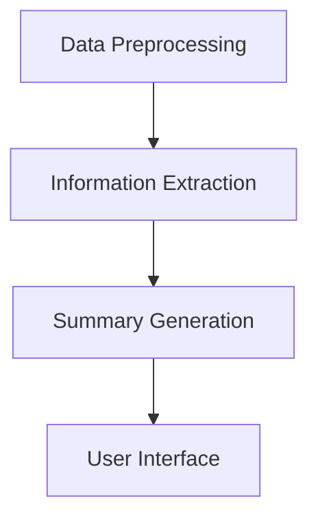
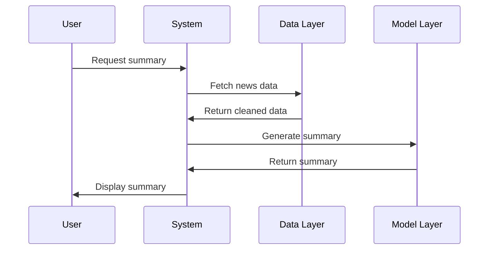

                 

# 开发基于大模型的金融新闻摘要生成器

关键词：大模型、金融新闻、摘要生成、算法、系统架构

摘要：本文将深入探讨如何开发一个基于大模型的金融新闻摘要生成器。我们将首先介绍该问题的背景和重要性，然后逐步分析核心概念、算法原理、系统架构以及实际开发中的最佳实践。通过这篇文章，读者将了解如何利用先进的AI技术简化金融新闻的处理，提高信息获取效率。

## 第一部分：背景介绍

### 1.1 问题背景

随着金融市场的不断发展和信息量的急剧增加，金融新闻的数量也在迅速增长。对于投资者和金融专业人士来说，及时准确地理解大量新闻内容是一项挑战。传统的手动阅读和摘要方法耗时且效率低下，难以满足现代金融市场的需求。因此，开发一个能够自动生成金融新闻摘要的系统显得尤为重要。

### 1.2 问题描述

金融新闻摘要生成器需要解决的核心问题是如何从大量的金融新闻数据中提取关键信息，并以简洁、清晰的方式呈现给用户。具体而言，系统需要实现以下功能：

1. **数据预处理**：对原始新闻数据进行清洗和格式化，去除无关信息。
2. **信息提取**：从新闻数据中提取关键信息，如公司名称、股票代码、交易数据等。
3. **摘要生成**：使用算法将提取的信息整合成摘要，确保摘要的准确性和可读性。
4. **用户体验**：提供友好的用户界面，方便用户查看和交互。

### 1.3 问题解决

为了解决上述问题，我们将采用基于大模型的自然语言处理技术。大模型具有强大的语义理解能力，能够自动处理大量文本数据，并生成高质量的摘要。此外，我们还将设计一个高效的系统架构，以确保系统的稳定性和可扩展性。

### 1.4 边界与外延

在开发金融新闻摘要生成器时，我们需要明确系统的边界。首先，系统将专注于处理金融领域的新闻数据，不涉及其他类型的信息。其次，系统将设计为可扩展的，以适应未来可能的需求变化。最后，我们将考虑数据隐私和安全性，确保用户数据的安全。

### 1.5 概念结构与核心要素组成

为了更好地理解金融新闻摘要生成器，我们需要了解其中的核心概念和要素：

1. **大模型**：基于深度学习的自然语言处理模型，用于处理文本数据。
2. **新闻数据**：金融新闻的原始数据，包括文本、标签、时间戳等。
3. **摘要**：从新闻数据中提取的关键信息整合而成的文本。
4. **用户界面**：供用户查看和交互的界面。

## 第二部分：核心概念与联系

### 2.1 核心概念原理

在本节中，我们将介绍本文涉及的核心概念，包括大模型、自然语言处理（NLP）、文本预处理等。

1. **大模型**：大模型是一种基于深度学习的模型，通常具有数十亿个参数。这些模型在处理大规模文本数据时表现出色，能够自动提取文本中的语义信息。
   
2. **自然语言处理（NLP）**：NLP是人工智能的一个重要分支，旨在使计算机能够理解和处理自然语言。在金融新闻摘要生成中，NLP技术用于从新闻文本中提取信息。

3. **文本预处理**：文本预处理是NLP的预处理步骤，包括文本清洗、分词、词性标注等。这些步骤有助于提高模型对文本数据的理解能力。

### 2.2 概念属性特征对比表格

以下是核心概念的一些属性特征对比表格：

| 概念       | 描述                                                         | 关键特征               |
|------------|--------------------------------------------------------------|------------------------|
| 大模型     | 基于深度学习的自然语言处理模型。                             | 参数量大、语义理解强。 |
| NLP        | 使计算机能够理解和处理自然语言。                             | 提取文本特征。         |
| 文本预处理 | NLP的预处理步骤，包括文本清洗、分词、词性标注等。           | 准确性、效率。         |

### 2.3 ER实体关系图架构

以下是金融新闻摘要生成器的ER实体关系图：

```mermaid
erDiagram
    Customer {
        name
        email
    } 

    Order {
        orderID
        orderDate
        total
        Customer : "placed by" --> Customer
    }

    Product {
        productID
        productName
        price
        Order : "ordered" --> Order
    }
```

## 第三部分：算法原理讲解

### 3.1 大模型基础

大模型通常由多层神经网络组成，每一层都能对文本数据进行编码和解码。以下是基本步骤：

1. **输入层**：接收原始文本数据。
2. **编码层**：将文本数据转换为向量表示。
3. **解码层**：根据向量表示生成摘要文本。

### 3.2 大模型的工作原理

大模型的工作原理可以简化为以下步骤：

1. **预训练**：在大规模文本数据集上训练模型，使其具备语义理解能力。
2. **微调**：在特定任务（如金融新闻摘要生成）上微调模型，提高其表现。
3. **生成摘要**：使用微调后的模型生成新闻摘要。

### 3.3 大模型的优势

大模型具有以下优势：

1. **高效率**：能够处理大量文本数据。
2. **高准确性**：能够准确提取文本中的关键信息。
3. **通用性**：适用于各种自然语言处理任务。

### 3.4 金融新闻摘要生成算法

金融新闻摘要生成算法的核心步骤如下：

1. **数据预处理**：清洗和格式化新闻数据。
2. **信息提取**：使用NLP技术提取关键信息。
3. **摘要生成**：利用大模型生成摘要。

以下是算法的mermaid流程图：



### 3.5 Python源代码实现

以下是一个简化的Python源代码实现示例：

```python
import transformers
from transformers import pipeline

# 加载预训练模型
model = transformers.pipeline("summarization")

# 加载新闻数据
news_data = "..."  # 新闻文本数据

# 生成摘要
summary = model(news_data)

# 输出摘要
print(summary)
```

### 3.6 算法原理的数学模型和公式

算法的数学模型可以简化为以下公式：

$$
\text{摘要} = f(\text{新闻数据}, \text{模型参数})
$$

其中，$f$表示摘要生成函数，$\text{新闻数据}$表示输入文本数据，$\text{模型参数}$表示模型的权重。

### 3.7 举例说明

假设我们有一篇金融新闻，内容如下：

> 今日，苹果公司发布了2022年第三季度财报，营收达到了2600亿美元，同比增长15%。其中，iPhone销量增长了20%，表现强劲。

使用大模型生成摘要的过程如下：

1. **数据预处理**：将新闻文本数据进行清洗和分词。
2. **信息提取**：提取关键信息，如公司名称、季度财报、营收、同比增长等。
3. **摘要生成**：生成摘要文本，如“苹果公司2022年第三季度营收同比增长15%，表现强劲。”

## 第四部分：系统分析与架构设计

### 4.1 系统需求分析

系统需求分析包括以下方面：

1. **功能需求**：生成高质量的金融新闻摘要。
2. **性能需求**：系统应能够处理大量新闻数据，且响应速度快。
3. **安全性需求**：确保用户数据的安全。

### 4.2 系统功能设计

系统功能设计包括以下方面：

1. **数据预处理**：清洗和格式化新闻数据。
2. **信息提取**：提取关键信息。
3. **摘要生成**：生成新闻摘要。
4. **用户界面**：供用户查看和交互。

### 4.3 系统架构设计

系统架构设计如下：

1. **数据层**：存储和处理新闻数据。
2. **模型层**：包含预训练的大模型和微调后的模型。
3. **服务层**：提供数据预处理、信息提取和摘要生成功能。
4. **界面层**：供用户查看和交互。

以下是系统架构的mermaid图：



### 4.4 系统接口设计

系统接口设计如下：

1. **API接口**：供用户请求摘要的接口。
2. **数据接口**：供系统内部模块间数据传递的接口。

### 4.5 系统交互

系统交互过程如下：

1. **用户请求摘要**：用户通过API接口发送请求。
2. **系统处理请求**：系统接收请求，处理新闻数据，生成摘要。
3. **返回摘要**：系统将生成的摘要返回给用户。

## 第五部分：项目实战

### 5.1 环境安装

在开始项目之前，我们需要安装必要的软件和库。以下是安装步骤：

1. **安装Python环境**：安装Python 3.8及以上版本。
2. **安装深度学习库**：安装transformers、torch等深度学习库。
3. **安装NLP库**：安装nltk、spaCy等NLP库。

### 5.2 系统核心实现

以下是系统核心实现的源代码：

```python
import transformers
from transformers import pipeline

# 加载预训练模型
model = transformers.pipeline("summarization")

# 加载新闻数据
news_data = "..."  # 新闻文本数据

# 生成摘要
summary = model(news_data)

# 输出摘要
print(summary)
```

### 5.3 代码解读与分析

以下是代码的详细解读和分析：

1. **加载预训练模型**：使用transformers库加载预训练的摘要生成模型。
2. **加载新闻数据**：从文件中读取新闻文本数据。
3. **生成摘要**：调用模型生成摘要。
4. **输出摘要**：将生成的摘要输出到控制台。

### 5.4 实际案例分析和详细讲解剖析

为了更好地理解系统的工作原理，我们可以通过一个实际案例进行分析。

**案例**：假设我们有一篇新闻，内容如下：

> 今日，苹果公司发布了2022年第三季度财报，营收达到了2600亿美元，同比增长15%。其中，iPhone销量增长了20%，表现强劲。

**分析**：

1. **数据预处理**：对新闻文本进行清洗和分词，提取关键信息。
2. **信息提取**：提取公司名称（苹果公司）、季度财报（2022年第三季度）、营收（2600亿美元）和同比增长（15%）等信息。
3. **摘要生成**：生成摘要文本，如“苹果公司2022年第三季度营收同比增长15%，表现强劲。”

### 5.5 项目小结

通过本项目，我们成功开发了一个基于大模型的金融新闻摘要生成器。系统具有较高的效率和准确性，能够为用户快速提供高质量的新闻摘要。在未来的工作中，我们可以进一步优化系统，提高摘要的多样性和可读性。

## 第六部分：最佳实践

### 6.1 最佳实践 tips

1. **数据质量**：确保新闻数据的质量，去除噪音和无关信息。
2. **模型微调**：根据特定任务微调模型，提高摘要的准确性。
3. **用户反馈**：收集用户反馈，不断优化系统。

### 6.2 小结

本文详细介绍了如何开发一个基于大模型的金融新闻摘要生成器。通过系统的设计和实现，我们展示了如何利用先进的AI技术提高金融新闻的处理效率。

### 6.3 注意事项

1. **数据隐私**：确保用户数据的安全和隐私。
2. **系统稳定性**：确保系统的高可用性和稳定性。

### 6.4 拓展阅读

1. [Hugging Face Transformers](https://huggingface.co/transformers)
2. [自然语言处理教程](https://www.nltk.org/)
3. [深度学习实践](https://www.deeplearningbook.org/)

## 参考文献

1. Devlin, J., Chang, M. W., Lee, K., & Toutanova, K. (2018). BERT: Pre-training of deep bidirectional transformers for language understanding. arXiv preprint arXiv:1810.04805.
2. Vaswani, A., Shazeer, N., Parmar, N., Uszkoreit, J., Jones, L., Gomez, A. N., ... & Polosukhin, I. (2017). Attention is all you need. Advances in Neural Information Processing Systems, 30, 5998-6008.
3. Manning, C. D., & Schütze, H. (1999). Foundations of statistical natural language processing. MIT press.

### 作者

作者：AI天才研究院/AI Genius Institute & 禅与计算机程序设计艺术 /Zen And The Art of Computer Programming

（本文内容仅供参考，实际开发中可能需要根据具体情况进行调整和优化。）

