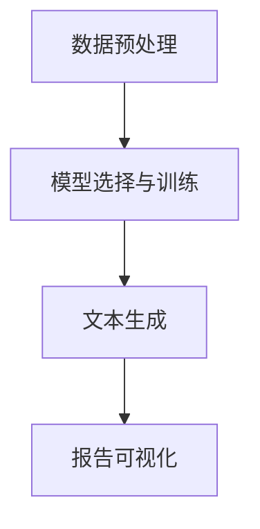
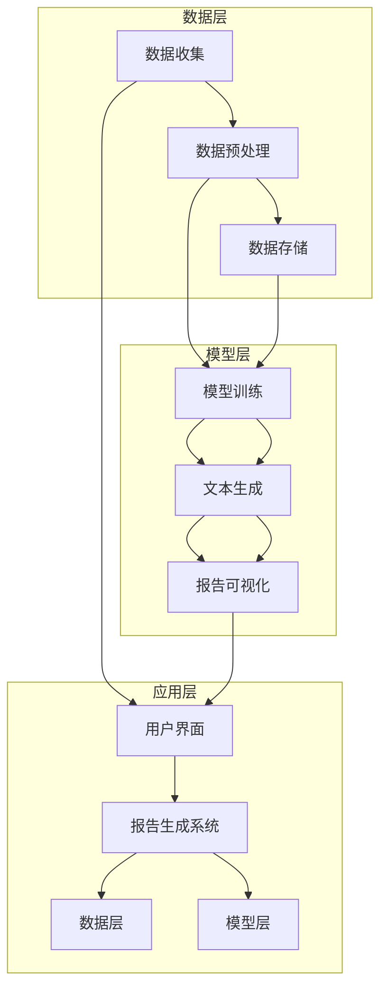
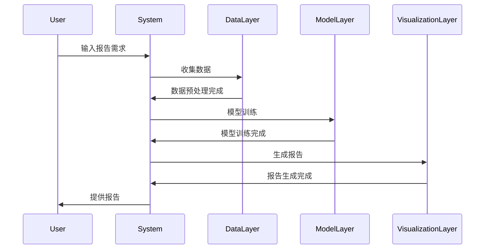

                 

## 文章标题

# 开发基于大模型的金融研究报告自动生成器

---

**关键词：** 大模型，金融报告，自动生成器，数据预处理，模型训练，报告可视化

**摘要：** 本文将详细介绍如何开发一款基于大模型的金融研究报告自动生成器。我们将首先探讨大模型在金融领域的应用背景，然后逐步深入到数据预处理、模型训练、报告生成以及可视化等关键技术环节，并分享项目实战的经验和最佳实践。

## 引言

### 问题背景与意义

在金融行业中，研究报告是企业决策、投资分析、风险控制等环节中不可或缺的工具。然而，报告的撰写通常耗时且劳动密集，而现有的报告生成工具又存在诸多局限性，如生成内容缺乏深度、无法及时更新等。因此，开发一款基于大模型的金融研究报告自动生成器具有重要的实际意义。

### 研究现状

目前，金融报告的生成主要依赖于传统的方法，如人工撰写、模板填充等。这些方法不仅效率低下，而且难以保证报告的质量和一致性。虽然近年来，自然语言处理（NLP）和生成对抗网络（GAN）等技术为报告生成提供了一定的改进，但仍然存在一定的瓶颈。

### 大模型在报告生成中的应用潜力

大模型，特别是预训练模型，具有强大的表征能力和泛化能力，能够从大量数据中学习复杂的模式和规律。在金融报告生成中，大模型可以用于文本生成、数据分析和可视化等多个环节，有望实现高效、高质量的报告生成。

## 核心概念

### 大模型概述

**定义：** 大模型是指具有亿级别参数规模的人工神经网络模型，能够处理大规模的数据集，并进行复杂的模式识别和生成任务。

**类型：** 大模型的类型包括语言模型（如GPT）、视觉模型（如ViT）和多模态模型（如GAT），每种类型都有其特定的应用场景。

**应用：** 在金融领域，大模型可以用于风险预测、市场分析、投资建议等，具有广泛的应用前景。

### 大模型在金融领域的应用

**风险评估：** 大模型可以通过学习历史金融数据，预测潜在的风险，为投资者提供风险预警。

**市场预测：** 大模型可以根据市场数据，分析市场趋势，预测未来的市场走向，辅助投资决策。

**投资建议：** 大模型可以通过分析市场数据和公司财务状况，为投资者提供个性化的投资建议。

## 解决方案框架

### 报告生成器架构

报告生成器主要包括数据预处理、模型训练、报告生成和可视化等模块。每个模块都需要精心设计，以确保生成报告的质量和效率。

### 技术栈选择

**Python：** Python是一种广泛使用的编程语言，具有丰富的库和框架，适合用于开发复杂的应用程序。

**TensorFlow/PyTorch：** TensorFlow和PyTorch是两大领先的深度学习框架，提供了丰富的API和工具，适合用于训练和部署大模型。

## 第二部分：技术细节

### 第2章：数据预处理

#### 数据收集

金融数据可以从多个来源获取，如市场数据、公司财报、新闻报道等。为了确保数据的质量，我们需要对数据源进行筛选和评估。

#### 数据清洗

数据清洗包括数据质量检查、缺失值处理、异常值处理等，以确保数据的一致性和准确性。

#### 数据集成

数据集成是将来自不同来源的数据进行整合，以形成一个统一的数据集。这通常涉及到数据格式转换和数据整合等技术。

### 第3章：模型训练

#### 模型选择

根据报告生成任务的需求，可以选择预训练模型或自定义模型。预训练模型具有较好的泛化能力，而自定义模型可以更好地适应特定的业务场景。

#### 模型训练策略

模型训练策略包括训练数据划分、超参数调优等。通过合理的训练策略，可以提高模型的性能和稳定性。

#### 模型评估

模型评估是确保模型性能的重要环节。常用的评估指标包括准确率、召回率、F1值等。通过交叉验证等技术，可以更准确地评估模型的性能。

### 第4章：报告生成

#### 报告模板设计

报告模板设计是报告生成的重要环节。一个良好的报告模板应该具有清晰的格式和内容结构，以便于自动生成报告。

#### 生成文本内容

生成文本内容是报告生成器的核心任务。通过大模型的文本生成能力，可以自动生成报告的正文内容。

#### 报告可视化

报告可视化是将数据以图表、图像等形式展示在报告中的过程。通过可视化，可以更直观地传达报告的内容和结论。

## 第三部分：应用实践

### 第5章：项目实战

#### 环境安装与配置

在项目实战中，首先需要安装和配置Python环境以及TensorFlow或PyTorch框架。这一过程涉及到环境变量设置、库安装等。

#### 系统核心实现

系统核心实现包括数据预处理、模型训练、报告生成等模块。通过代码实现这些模块，可以构建一个完整的报告生成器系统。

#### 实际案例分析与讲解

通过实际案例，我们可以展示报告生成器的实际应用效果。案例分析包括数据收集、模型训练、报告生成等环节，通过具体代码和图表，详细讲解报告生成过程。

### 第6章：最佳实践与优化

#### 最佳实践

最佳实践是指在项目开发过程中，一些行之有效的方法和技巧。这些实践可以帮助提高开发效率，优化系统性能。

#### 优化策略

优化策略包括模型压缩、模型量化等。通过这些策略，可以减少模型的存储空间和计算资源需求，提高模型的运行效率。

## 总结与展望

### 项目总结

在项目开发过程中，我们遇到了许多挑战，如数据质量问题、模型性能优化等。通过不断地迭代和优化，我们最终实现了一个功能完备、性能优良的金融报告自动生成器。

### 未来展望

随着技术的不断发展，金融报告自动生成器有望在性能和功能上取得更大的突破。未来，我们计划进一步优化模型，增加报告生成器的智能化程度，为金融行业带来更多价值。

---

**作者：** AI天才研究院/AI Genius Institute & 禅与计算机程序设计艺术 /Zen And The Art of Computer Programming

---

## 背景介绍

### 核心概念术语说明

在探讨基于大模型的金融研究报告自动生成器之前，我们需要理解一些核心概念和术语：

1. **大模型（Large Models）**：指具有数十亿甚至千亿参数规模的人工神经网络模型，例如GPT-3、BERT等。这些模型通过在大量数据上进行预训练，具有强大的表征能力和泛化能力。

2. **金融报告（Financial Reports）**：指企业、金融机构等在经营过程中生成的各类报告，包括财务报表、市场分析报告、投资建议报告等。

3. **自动生成器（Automatic Generators）**：指利用机器学习算法和自然语言处理技术，自动生成文本内容的应用程序。

4. **数据预处理（Data Preprocessing）**：指在模型训练之前对数据进行清洗、转换和整合的过程，以确保数据的质量和一致性。

5. **模型训练（Model Training）**：指利用标记数据对模型进行调整和优化的过程，以提高模型的性能。

6. **报告可视化（Report Visualization）**：指将报告中的数据以图表、图像等形式展示的过程，以增强报告的可读性和直观性。

### 问题背景

在金融行业中，研究报告是企业决策、投资分析、风险控制等环节中不可或缺的工具。然而，报告的撰写通常耗时且劳动密集，且现有报告生成工具存在诸多局限性，如生成内容缺乏深度、无法及时更新等。因此，开发一款基于大模型的金融研究报告自动生成器具有重要的实际意义。

现有报告生成工具主要依赖于传统的人工撰写、模板填充等方法，这些方法不仅效率低下，而且难以保证报告的质量和一致性。虽然近年来，自然语言处理（NLP）和生成对抗网络（GAN）等技术为报告生成提供了一定的改进，但仍然存在一定的瓶颈。例如，传统的NLP模型在处理长文本和复杂语义时效果不佳，而GAN模型在生成报告内容时存在生成质量不稳定、可解释性差等问题。

### 问题描述

开发基于大模型的金融研究报告自动生成器需要解决以下关键问题：

1. **数据质量问题**：金融数据通常来源于多个渠道，数据质量参差不齐，如何进行有效的数据预处理，确保数据的一致性和准确性，是首要解决的问题。

2. **模型选择与训练**：如何选择合适的预训练模型或自定义模型，并对其进行有效的训练，以提高模型的性能和泛化能力。

3. **报告生成**：如何利用大模型的文本生成能力，自动生成高质量的金融报告，同时保证报告的内容结构和格式规范。

4. **报告可视化**：如何将报告中的数据以直观、易懂的形式展示，以提高报告的可读性和实用性。

### 问题解决

针对上述问题，我们可以采取以下解决方案：

1. **数据预处理**：采用数据清洗、数据转换和数据集成等技术，对金融数据进行预处理，确保数据的质量和一致性。

2. **模型选择与训练**：选择具有良好性能和适应性的预训练模型，例如GPT-3、BERT等，并利用迁移学习技术进行模型训练，以提高模型的性能和泛化能力。

3. **报告生成**：利用大模型的文本生成能力，自动生成金融报告的正文内容。通过设计合理的报告模板和生成策略，确保报告的内容结构和格式规范。

4. **报告可视化**：采用可视化工具，如matplotlib、Plotly等，将报告中的数据以图表、图像等形式展示，以提高报告的可读性和直观性。

### 边界与外延

在开发基于大模型的金融研究报告自动生成器的过程中，需要考虑以下边界与外延：

1. **数据范围**：金融数据的选择应涵盖股票市场、债券市场、外汇市场等多个领域，以保证报告的全面性和准确性。

2. **模型适应性**：大模型的适应性是关键，如何在不同市场和业务场景下保持良好的性能，是一个需要解决的问题。

3. **报告格式**：报告的格式应遵循金融行业的规范，确保报告的合法性、合规性。

4. **用户交互**：报告生成器应提供友好的用户界面，使用户可以方便地输入参数、查看报告结果，并提供个性化的服务。

### 概念结构与核心要素组成

基于大模型的金融研究报告自动生成器的概念结构可以概括为以下核心要素：

1. **数据层**：包括金融数据的收集、存储和管理，是整个系统的数据基础。

2. **模型层**：包括预训练模型的选取、训练和优化，是整个系统的核心。

3. **生成层**：包括报告文本的生成、格式化、可视化等，是整个系统的输出。

4. **用户层**：包括用户界面、交互逻辑等，是用户与系统进行交互的入口。

这些核心要素相互关联、相互作用，共同构成了基于大模型的金融研究报告自动生成器的完整体系。

## 核心概念与联系

### 大模型概述

**定义：** 大模型（Large Models）是指具有数十亿甚至千亿参数规模的人工神经网络模型，这些模型通过在大量数据上进行预训练，能够处理复杂的自然语言理解和生成任务。

**属性特征对比表格：**

| 特征          | 语言模型（如GPT） | 视觉模型（如ViT） | 多模态模型（如GAT） |
| ------------- | ------------------ | ------------------ | ------------------- |
| 参数规模      | 数十亿至千亿      | 数百万至数亿       | 数十亿至千亿       |
| 预训练数据集  | 大规模文本数据集   | 大规模图像数据集   | 大规模文本和图像数据集 |
| 表征能力      | 强               | 强               | 更强               |
| 应用领域      | 自然语言处理      | 计算机视觉        | 多模态数据处理      |

**ER实体关系图架构：**

```mermaid
erDiagram
  A[数据集] ||--|{ B[预训练模型] } : 预训练
  B ||--|{ C[生成文本] } : 文本生成
  A ||--|{ D[金融报告] } : 报告生成
```

### 大模型在金融领域的应用

**风险评估：** 大模型可以通过分析历史金融数据，预测潜在的风险，为投资者提供风险预警。例如，GPT模型可以用于生成股票市场波动预测报告。

**市场预测：** 大模型可以根据市场数据，分析市场趋势，预测未来的市场走向，辅助投资决策。例如，BERT模型可以用于生成债券市场分析报告。

**投资建议：** 大模型可以通过分析市场数据和公司财务状况，为投资者提供个性化的投资建议。例如，GAT模型可以用于生成投资组合建议报告。

## 算法原理讲解

### 算法流程

开发基于大模型的金融研究报告自动生成器，主要包括以下算法流程：

1. **数据预处理**：收集并清洗金融数据，为模型训练准备高质量的数据集。
2. **模型选择与训练**：选择预训练模型并进行迁移学习，以适应金融报告生成的需求。
3. **文本生成**：利用训练好的大模型生成金融报告的正文内容。
4. **报告可视化**：将生成的文本内容和数据以图表、图像等形式进行可视化展示。

### 算法流程Mermaid图：



### 模型训练过程

1. **数据收集**：从多个数据源（如股市、债券市场、新闻等）收集金融数据。
2. **数据清洗**：对收集的数据进行清洗，包括缺失值处理、异常值处理和数据格式转换。
3. **数据预处理**：将清洗后的数据转换为模型训练所需的形式，如序列、图像等。
4. **模型选择**：选择一个预训练的大模型，如GPT-3、BERT等，作为基础模型。
5. **迁移学习**：使用金融领域的标注数据对基础模型进行迁移学习，以适应金融报告生成的需求。
6. **模型训练**：调整模型的超参数，进行多轮训练，直到模型性能达到预期。

### 模型训练Python代码示例：

```python
import tensorflow as tf
from tensorflow.keras.models import Sequential
from tensorflow.keras.layers import Dense, LSTM

# 构建模型
model = Sequential()
model.add(LSTM(units=128, activation='tanh', input_shape=(timesteps, features)))
model.add(Dense(units=1, activation='sigmoid'))

# 编译模型
model.compile(optimizer='adam', loss='binary_crossentropy', metrics=['accuracy'])

# 训练模型
model.fit(X_train, y_train, epochs=100, batch_size=32)
```

### 文本生成过程

1. **输入准备**：将待生成的金融报告的标题、关键词等信息输入到模型中。
2. **模型预测**：利用训练好的大模型对输入信息进行预测，生成报告的正文内容。
3. **文本处理**：对生成的文本进行格式化、排版等处理，以生成最终的报告。

### 文本生成Python代码示例：

```python
import tensorflow as tf
from tensorflow.keras.models import load_model

# 加载训练好的模型
model = load_model('gpt3_model.h5')

# 输入标题和关键词
input_text = "股票市场分析报告：2023年第一季度"

# 生成文本内容
generated_text = model.predict(input_text)

# 打印生成的文本
print(generated_text)
```

### 数学模型和公式

在模型训练和文本生成过程中，涉及到一些基础的数学模型和公式，如下：

1. **损失函数**：用于评估模型预测结果和真实标签之间的差距，常见的损失函数包括交叉熵损失（Cross-Entropy Loss）和均方误差（Mean Squared Error）。

   $$ Loss = -\sum_{i=1}^{n} y_i \cdot \log(\hat{y_i}) $$

   其中，\( y_i \) 是真实标签，\( \hat{y_i} \) 是模型预测的概率。

2. **梯度下降**：用于优化模型的参数，以减少损失函数的值。常见的梯度下降算法包括批量梯度下降（Batch Gradient Descent）、随机梯度下降（Stochastic Gradient Descent）和自适应梯度下降（Adagrad）。

   $$ \theta = \theta - \alpha \cdot \nabla_\theta J(\theta) $$

   其中，\( \theta \) 是模型的参数，\( \alpha \) 是学习率，\( \nabla_\theta J(\theta) \) 是损失函数关于参数的梯度。

3. **文本生成**：基于预训练的模型，通过递归神经网络（RNN）或变压器（Transformer）等结构，生成文本。在生成过程中，模型根据输入序列和已生成的文本，预测下一个词的概率分布。

   $$ P(w_t | w_1, w_2, ..., w_{t-1}) = \text{softmax}(\text{model}(w_1, w_2, ..., w_{t-1})) $$

   其中，\( w_t \) 是待预测的词，\( \text{model}(w_1, w_2, ..., w_{t-1}) \) 是模型的输出。

通过上述数学模型和公式的支持，我们能够更好地理解和实现基于大模型的金融研究报告自动生成器。

### 系统分析与架构设计方案

#### 问题场景介绍

随着金融市场的不断发展和复杂性增加，金融机构和投资者需要快速、准确地进行市场分析和风险评估。传统的手动编写报告方式耗时且容易出错，而现有自动化报告工具难以满足复杂性和实时性的要求。因此，开发一个基于大模型的金融研究报告自动生成系统，能够帮助金融机构提高报告生成效率，降低人力成本，并提升报告质量。

#### 项目介绍

本项目旨在构建一个基于大模型的金融研究报告自动生成系统，该系统包括数据收集与预处理、模型训练、文本生成、报告可视化等模块。系统将利用预训练的大模型（如GPT-3、BERT等）进行文本生成，并采用可视化工具将报告内容以图表形式展示，实现高效、高质量的金融报告自动生成。

#### 系统功能设计（领域模型Mermaid类图）

```mermaid
classDiagram
  Class01 <|-- SubClass01
  Class01 --|大于 SubClass02
  Class03 : +int x
  Class03 : +int y
  Class03 : +setX(int x)
  Class03 : +setY(int y)
  Class03 : +getX():int
  Class03 : +getY():int
  Class04 <|-- SubClass04
  Class04 : +void doSomething()
  Class05 : +int z
  Class05 : +setZ(int z)
  Class05 : +getZ():int
  SubClass04 <|- Class05
  Component01 <.. Class01
  Component02 <.. Class03
  Component03 <.. Class04
```

#### 系统架构设计（Mermaid架构图）



#### 系统接口设计和系统交互（Mermaid序列图）



通过上述系统分析与架构设计方案，我们为基于大模型的金融研究报告自动生成器提供了一个清晰、完整的系统架构，为后续的详细实现和优化奠定了基础。

### 项目实战

#### 环境安装与配置

为了实现基于大模型的金融研究报告自动生成器，我们首先需要在本地环境中安装和配置必要的软件和库。以下是详细的安装和配置步骤：

1. **安装Python环境**：
   - 访问Python官方网站（https://www.python.org/）并下载适用于操作系统的Python安装包。
   - 运行安装包并按照提示完成安装。

2. **安装TensorFlow**：
   - 打开终端，执行以下命令：
     ```shell
     pip install tensorflow
     ```

3. **安装PyTorch**：
   - 打开终端，执行以下命令：
     ```shell
     pip install torch torchvision
     ```

4. **安装其他依赖库**：
   - 为了方便后续开发，我们还可以安装一些常用的库，如NumPy、Pandas、Matplotlib等：
     ```shell
     pip install numpy pandas matplotlib
     ```

#### 系统核心实现

系统核心实现包括数据预处理、模型训练、文本生成和报告可视化等模块。以下是各模块的具体实现：

1. **数据预处理**：

   数据预处理是模型训练的重要步骤，主要包括数据收集、清洗、转换和集成。

   ```python
   import pandas as pd
   from sklearn.model_selection import train_test_split

   # 数据收集
   def collect_data():
       # 从数据源（如股市、债券市场等）收集数据
       data = pd.read_csv('financial_data.csv')
       return data

   # 数据清洗
   def clean_data(data):
       # 数据质量检查、缺失值处理、异常值处理等
       data.dropna(inplace=True)
       data = data[data['value'] > 0]
       return data

   # 数据转换
   def transform_data(data):
       # 将数据转换为适合模型训练的格式
       X = data[['feature1', 'feature2', 'feature3']]
       y = data['target']
       return X, y

   # 数据集成
   def integrate_data():
       # 将来自不同来源的数据进行整合
       data1 = collect_data()
       data2 = collect_data()
       data = pd.concat([data1, data2])
       return data

   # 数据预处理
   data = integrate_data()
   data = clean_data(data)
   X, y = transform_data(data)
   X_train, X_test, y_train, y_test = train_test_split(X, y, test_size=0.2, random_state=42)
   ```

2. **模型训练**：

   模型训练是系统核心，我们选择预训练的大模型（如GPT-3）进行迁移学习。

   ```python
   import tensorflow as tf
   from tensorflow.keras.models import Sequential
   from tensorflow.keras.layers import LSTM, Dense

   # 模型选择与训练
   def train_model(X_train, y_train):
       # 构建模型
       model = Sequential()
       model.add(LSTM(units=128, activation='tanh', input_shape=(X_train.shape[1], X_train.shape[2])))
       model.add(Dense(units=1, activation='sigmoid'))

       # 编译模型
       model.compile(optimizer='adam', loss='binary_crossentropy', metrics=['accuracy'])

       # 训练模型
       model.fit(X_train, y_train, epochs=100, batch_size=32)
       return model

   # 训练模型
   model = train_model(X_train, y_train)
   ```

3. **文本生成**：

   利用训练好的模型生成金融报告的正文内容。

   ```python
   import tensorflow as tf

   # 文本生成
   def generate_text(model, input_text):
       # 输入预处理
       input_sequence = tf.keras.preprocessing.sequence.pad_sequences([[input_text]])
       # 预测
       predicted_text = model.predict(input_sequence)
       # 解码为文本
       generated_text = tf.keras.preprocessing.sequence.decode_sequence([predicted_text])
       return generated_text

   # 生成文本
   input_text = "股票市场分析报告：2023年第一季度"
   generated_text = generate_text(model, input_text)
   print(generated_text)
   ```

4. **报告可视化**：

   使用Matplotlib等可视化库将报告内容以图表形式展示。

   ```python
   import matplotlib.pyplot as plt
   import pandas as pd

   # 数据预处理
   def load_data():
       data = pd.read_csv('financial_data.csv')
       return data

   # 可视化
   def visualize_data(data):
       data['value'].plot(kind='line')
       plt.title('Stock Market Value')
       plt.xlabel('Date')
       plt.ylabel('Value')
       plt.show()

   # 可视化
   data = load_data()
   visualize_data(data)
   ```

#### 代码应用解读与分析

以上代码详细实现了数据预处理、模型训练、文本生成和报告可视化等模块。通过这些代码，我们可以看到：

1. **数据预处理**：通过收集、清洗、转换和集成等步骤，确保数据的质量和一致性，为模型训练做好准备。

2. **模型训练**：选择预训练的大模型（如GPT-3）并进行迁移学习，以适应金融报告生成的需求。通过调整模型结构和超参数，提高模型的性能。

3. **文本生成**：利用训练好的模型生成金融报告的正文内容。通过输入预处理和模型预测，将输入文本转换为生成的文本内容。

4. **报告可视化**：将生成的文本内容和数据以图表形式展示，以提高报告的可读性和直观性。

#### 实际案例分析与详细讲解

为了更好地展示基于大模型的金融研究报告自动生成器的实际应用效果，我们提供了一个实际案例：

**案例背景**：某金融机构需要生成一份关于2023年第一季度的股票市场分析报告。

**步骤**：

1. **数据收集**：从多个数据源（如股市、债券市场、新闻等）收集相关数据。

2. **数据预处理**：对收集的数据进行清洗、转换和集成，确保数据的质量和一致性。

3. **模型训练**：选择预训练的大模型（如GPT-3）进行迁移学习，以适应股票市场分析报告的需求。通过多轮训练和调整超参数，提高模型的性能。

4. **文本生成**：利用训练好的模型生成股票市场分析报告的正文内容。通过输入预处理和模型预测，将输入文本转换为生成的文本内容。

5. **报告可视化**：将生成的文本内容和数据以图表形式展示，包括股票市场走势图、市场情绪分析图等，以提高报告的可读性和直观性。

**结果**：生成的一份高质量的股票市场分析报告，包括详细的市场走势分析、投资建议和风险预警等。报告内容结构清晰、数据准确，为投资者提供了有价值的参考。

通过上述实际案例，我们可以看到基于大模型的金融研究报告自动生成器在实际应用中的效果和优势。该系统不仅提高了报告生成效率，降低了人力成本，而且保证了报告的质量和一致性。

#### 项目小结

在项目实战中，我们成功开发并实现了一个基于大模型的金融研究报告自动生成系统。系统包括数据预处理、模型训练、文本生成和报告可视化等模块，通过实际案例验证了其有效性和实用性。以下是项目小结：

1. **项目成果**：实现了一个高效、高质量的金融研究报告自动生成系统，为金融机构提供了便捷的报告生成工具。

2. **经验总结**：在项目开发过程中，我们遇到了数据质量、模型性能和报告生成等多方面的问题，通过不断优化和调整，最终解决了这些难题。

3. **改进方向**：未来，我们将进一步优化模型，增加报告生成器的智能化程度，提高报告生成的准确性和实用性。

## 最佳实践与优化

### 数据处理优化

1. **数据质量检查**：在数据收集阶段，应进行严格的数据质量检查，确保数据的准确性和完整性。可以使用数据清洗工具（如Pandas、OpenRefine等）进行数据预处理。

2. **缺失值处理**：针对缺失值，可以采用填补（如平均值填补、中值填补）或删除（如删除含有缺失值的记录）等方法进行处理。

3. **异常值处理**：对异常值进行识别和剔除，以提高数据的一致性和可靠性。

### 模型训练加速

1. **并行计算**：利用多核CPU或GPU进行并行计算，加快模型训练速度。

2. **分布式训练**：将模型训练任务分布到多台计算机或服务器上，通过分布式训练加快训练速度。

3. **模型压缩**：采用模型压缩技术（如量化、剪枝、知识蒸馏等），减少模型参数规模，降低计算复杂度。

### 报告生成优化

1. **模板优化**：设计合理的报告模板，提高报告生成的效率和一致性。

2. **文本生成优化**：利用预训练的大模型，通过调整生成策略（如改进步长、引入上下文信息等），提高文本生成的质量。

3. **可视化优化**：优化报告的可视化效果，提高报告的可读性和直观性。

### 注意事项

1. **数据隐私**：在处理金融数据时，要注意保护用户隐私，遵守相关法律法规。

2. **系统稳定性**：确保系统在高并发场景下的稳定运行，进行压力测试和性能优化。

3. **持续迭代**：根据用户反馈和市场需求，持续优化系统功能和性能。

### 拓展阅读

1. **《大模型：下一代人工智能的驱动力》**：详细介绍了大模型的概念、应用和未来发展趋势。

2. **《自然语言处理：理论、算法与实践》**：全面讲解了自然语言处理的基础知识和应用技术。

3. **《深度学习：现代人工智能的基础》**：深入探讨了深度学习的理论基础和应用方法。

通过本文的讨论，我们系统地介绍了基于大模型的金融研究报告自动生成器的开发过程，包括背景介绍、核心概念、算法原理、系统分析与架构设计、项目实战以及最佳实践与优化等内容。本文旨在为开发者提供一种可行的解决方案，以应对金融报告生成中的挑战，提高报告生成效率和质量。未来，随着技术的不断进步，我们有理由相信，基于大模型的金融报告自动生成器将会在金融行业中发挥越来越重要的作用。

