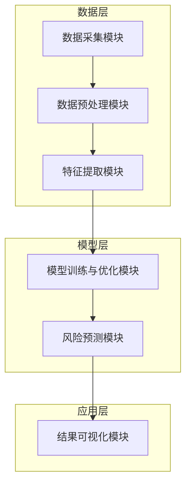
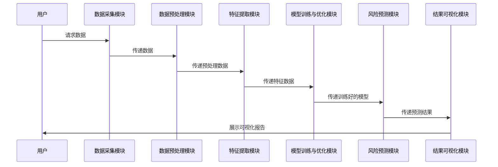
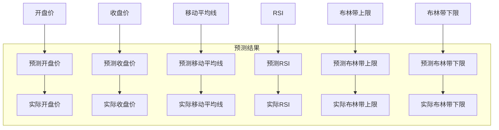
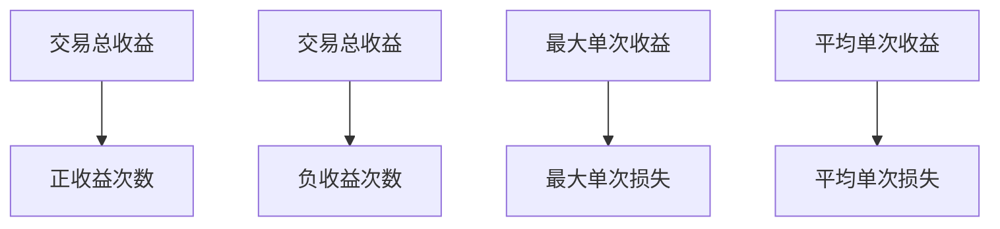

                 

### 第1章：金融研究方法论概述

#### 1.1 问题的背景

在当今金融市场日益复杂多变的背景下，传统的研究方法论和工具已经难以满足金融分析和决策的需求。金融研究不仅仅需要处理大量的数据，还需要从这些数据中提取有价值的信息，以便做出精确的预测和决策。然而，传统的金融研究方法主要依赖于统计学和经济学理论，这些方法在处理复杂、非线性、多维数据时显得力不从心。

随着人工智能和大数据技术的快速发展，大模型（如深度学习模型）开始被广泛应用于金融研究领域。大模型具有强大的数据处理能力和模式识别能力，可以在海量的金融数据中发现潜在的模式和趋势，从而为金融研究提供全新的视角和方法。

#### 1.1.1 金融研究的挑战

金融研究的挑战主要体现在以下几个方面：

1. **数据复杂性**：金融市场的数据通常是多维的、复杂的，且包含大量的噪声。传统的数据处理方法难以有效地从这些数据中提取有价值的信息。

2. **非线性和动态性**：金融市场的价格波动和风险变化通常是非线性和动态的，传统的线性模型难以捕捉这些复杂的变化。

3. **多变量关联性**：金融市场中的各个变量之间通常存在复杂的关联性，单一变量的分析难以全面反映市场的情况。

4. **预测准确性**：金融市场的预测结果需要具有较高的准确性，否则将可能导致重大的经济损失。

#### 1.1.2 创新生成系统的需求

为了应对上述挑战，金融研究方法论需要创新，以生成更准确、更全面的研究结果。创新生成系统可以通过以下几个方面实现：

1. **自动化数据分析**：自动化工具可以处理大量的金融数据，从而减轻研究人员的工作负担，提高数据处理的效率。

2. **智能特征提取**：利用大模型可以从复杂的金融数据中提取出更为准确和有效的特征，从而提高研究的准确性和深度。

3. **动态风险预测**：通过实时更新数据和模型，可以动态地预测金融市场的风险，从而为投资者提供及时的决策支持。

4. **个性化研究方法**：根据不同的研究需求和数据特点，生成个性化的研究方法，从而提高研究的针对性和有效性。

综上所述，开发基于大模型的金融研究方法论创新生成系统具有重要的现实意义和潜力。接下来，我们将详细探讨这一系统的核心概念、原理和实现方法。

#### 1.2 问题描述

在当前的金融研究领域，尽管人工智能技术带来了巨大的进步，但传统的研究方法仍然存在诸多局限性。首先，传统方法依赖于有限的统计数据和经济学模型，这些模型往往基于静态假设，难以适应动态变化的金融市场。其次，传统方法在处理大数据时的效率较低，无法充分利用海量的金融市场数据。此外，传统方法在处理复杂非线性关系和多重变量关联性时，效果不佳，导致预测准确性和可靠性受限。

为了解决这些问题，开发一种基于大模型的金融研究方法论创新生成系统显得尤为重要。该系统旨在通过以下方式提升金融研究的效率和准确性：

1. **自动化数据处理**：利用大模型强大的数据处理能力，可以自动化地清洗、整合和分析金融数据，减少人工干预，提高数据处理速度。

2. **智能特征提取**：大模型可以从原始金融数据中自动提取出高维、复杂且具有强关联性的特征，这些特征对于预测市场动态和风险具有重要意义。

3. **动态风险预测**：通过实时更新模型和数据，系统能够动态地调整风险预测，提供更为精准的预测结果，帮助投资者及时做出决策。

4. **个性化研究方法**：根据不同的研究目标和数据特性，系统可以生成个性化的研究方法，提高研究的针对性和有效性。

综上所述，开发基于大模型的金融研究方法论创新生成系统不仅可以克服传统方法的局限性，还可以为金融研究提供全新的视角和方法，提高研究的准确性和实用性。这一系统的核心任务是将复杂的大数据处理转化为简洁明了的研究结果，从而为金融领域带来深远的变革。

#### 1.3 问题解决与边界

为了解决金融研究方法论中面临的挑战，开发基于大模型的金融研究方法论创新生成系统成为了一个切实可行的方案。首先，我们需要明确系统的概念和边界。

**概念**：基于大模型的金融研究方法论创新生成系统是一种利用人工智能技术，特别是大模型（如深度学习模型）进行自动化数据处理、特征提取和风险预测的系统。它通过大规模数据的分析，自动生成研究方法，提高研究的准确性和效率。

**边界**：该系统的边界主要包括以下几个方面：

1. **数据边界**：系统需要处理的数据类型和规模。这包括但不限于金融市场数据、宏观经济数据、公司财务数据等，以及实时和历史的多种数据格式。

2. **功能边界**：系统应具备哪些功能。这包括数据预处理、特征提取、模型训练、风险评估和预测、结果可视化等。

3. **应用边界**：系统适用于哪些金融研究领域。例如，它可以应用于股市预测、风险控制、量化投资策略研究等。

4. **技术边界**：系统采用的技术栈和实现方式。例如，它可以基于Python、TensorFlow或PyTorch等深度学习框架，使用特定的大模型算法。

通过明确这些边界，我们可以更好地定义系统的目标和功能，确保其在实际应用中的有效性和可扩展性。接下来，我们将进一步探讨金融研究方法论的核心概念及其与大数据模型的关联。

#### 1.4 核心概念结构与要素

在构建基于大模型的金融研究方法论创新生成系统时，明确核心概念和要素至关重要。以下是金融研究方法论和大数据模型中的几个关键概念及其相互关系：

**1. 金融研究方法论**

- **数据收集**：涉及收集金融市场相关的各种数据，包括宏观经济指标、股市行情、公司财务报告等。
- **数据清洗**：对收集到的数据进行处理，去除噪声和异常值，保证数据质量。
- **统计分析**：利用统计学方法对数据进行分析，提取趋势、相关性等信息。
- **模型建立**：基于统计分析结果，建立预测模型或风险评估模型。
- **模型验证**：通过历史数据对模型进行验证，确保模型的预测准确性和可靠性。
- **模型优化**：根据验证结果对模型进行调整和优化，提高模型性能。

**2. 大数据模型**

- **深度学习模型**：包括神经网络、卷积神经网络（CNN）、循环神经网络（RNN）等，用于从大量数据中自动提取特征并建立预测模型。
- **数据预处理**：包括数据标准化、缺失值处理、数据增强等，为深度学习模型提供高质量的数据输入。
- **模型训练**：通过大量数据进行训练，优化模型的参数，使其能够准确预测或评估金融现象。
- **模型评估**：使用验证集或测试集对模型进行评估，评估其预测准确性和泛化能力。
- **模型部署**：将训练好的模型部署到生产环境中，实现实时预测和决策支持。

**3. 关联关系**

- **数据收集与预处理**：金融研究方法论中的数据收集和预处理步骤为大数据模型提供了输入，确保模型能够有效训练和预测。
- **模型建立与验证**：大数据模型通过深度学习算法建立预测模型，模型验证过程则依赖于金融研究方法论中的验证集和测试集。
- **模型优化**：模型优化过程需要结合金融研究方法论中的统计分析和模型验证结果，对模型进行调整和优化。

通过以上核心概念和要素的明确，我们可以更好地理解基于大模型的金融研究方法论创新生成系统的构成和工作原理，为后续章节的具体实现提供理论基础。

#### 1.5 本章小结

本章首先介绍了金融研究方法论在当前金融市场中的背景和挑战，强调了自动化数据分析、智能特征提取、动态风险预测和个性化研究方法的需求。接着，我们提出了基于大模型的金融研究方法论创新生成系统的核心任务，即利用人工智能技术提升金融研究的准确性和效率。随后，本章详细阐述了系统的概念和边界，并明确了金融研究方法论和大数据模型中的关键概念及其相互关系。通过这些讨论，我们为后续章节的系统架构设计、算法原理讲解和项目实战奠定了坚实的基础。在下一章中，我们将深入探讨大模型的基本概念，分析其与金融研究方法论的关联，为构建创新生成系统提供理论支持。

### 第2章：大模型与金融研究方法论

#### 2.1 大模型的基本概念

大模型，尤其是深度学习模型，在金融研究中扮演着越来越重要的角色。为了更好地理解大模型在金融研究中的应用，首先需要明确大模型的基本概念。

**1. 定义**

大模型通常是指那些拥有大量参数和复杂结构的机器学习模型，如深度神经网络（DNN）、卷积神经网络（CNN）和循环神经网络（RNN）等。这些模型通过训练能够从大量的数据中自动提取特征，并能够进行复杂的数据分析和预测。

**2. 特点**

- **参数多**：大模型具有大量的参数，这使得它们能够捕捉数据中的细微变化和复杂模式。
- **结构复杂**：大模型的网络结构通常非常复杂，包括多层神经网络、卷积层、池化层等。
- **自适应性强**：大模型能够根据不同的数据集和应用场景进行调整，具有很高的自适应能力。
- **高效性**：尽管参数众多，但现代深度学习框架能够高效地训练和优化这些模型，使其在处理大数据时具有很好的性能。

**3. 类型**

- **深度神经网络（DNN）**：DNN是一种前馈神经网络，通过多层非线性变换来提取数据中的特征。它适用于各种分类和回归任务。
- **卷积神经网络（CNN）**：CNN是一种专门用于图像识别和处理的神经网络，通过卷积层提取图像特征，具有强大的特征提取能力。
- **循环神经网络（RNN）**：RNN是一种能够处理序列数据的神经网络，通过循环结构保持历史信息，适用于时间序列预测和自然语言处理。

#### 2.2 大模型在金融研究中的应用

大模型在金融研究中的应用非常广泛，以下列举了几个关键领域：

**1. 数据预处理**

- **数据标准化**：大模型需要输入标准化的数据，这可以通过数据预处理步骤实现。例如，使用Z-score标准化或Min-Max标准化来调整数据范围。
- **缺失值处理**：使用填充或插值方法来处理数据中的缺失值，以保证模型训练的质量。
- **数据增强**：通过旋转、缩放、裁剪等方法增加数据的多样性，提升模型的泛化能力。

**2. 风险评估**

- **信用评分**：利用大模型对贷款申请者进行信用评分，通过分析历史数据和交易记录，预测其违约风险。
- **市场风险**：通过分析市场数据，如股票价格、交易量等，利用大模型预测市场风险和波动。

**3. 量化投资策略**

- **趋势预测**：利用时间序列分析，预测股票市场的未来走势，制定量化交易策略。
- **算法交易**：通过分析历史交易数据和市场行为，利用大模型制定自动化的交易策略，实现算法交易。

#### 2.3 大模型与金融研究方法论的联系

大模型与金融研究方法论之间的联系可以从以下几个方面进行探讨：

**1. 数据处理与特征提取**

- **数据处理**：金融研究方法论中的数据预处理步骤与大模型的数据预处理方法高度契合。两者都关注数据的标准化、缺失值处理和数据增强，以确保数据质量。
- **特征提取**：大模型能够自动从大量金融数据中提取有效特征，这弥补了传统金融研究方法中手动特征提取的不足，提高了特征提取的效率和准确性。

**2. 模型建立与优化**

- **模型建立**：金融研究方法论中的模型建立步骤可以通过大模型实现。例如，利用深度神经网络建立股票市场预测模型，通过循环神经网络处理时间序列数据。
- **模型优化**：大模型通过自适应的训练算法，能够在验证集上不断优化模型参数，提高模型的预测性能和可靠性。

**3. 动态调整与实时预测**

- **动态调整**：金融市场的数据是动态变化的，大模型能够根据新数据实时调整模型，实现动态风险预测和策略调整。
- **实时预测**：大模型的高效计算能力使其能够实现实时数据分析和预测，为金融决策提供即时支持。

通过上述分析，我们可以看到大模型在金融研究方法论中的应用具有重要的理论和实践意义。它不仅提升了金融研究的效率和准确性，还为金融领域带来了创新的研究方法和工具。在下一章中，我们将进一步探讨大模型的算法原理，为其在金融研究中的深入应用提供技术支持。

#### 2.3.1 概念属性特征对比表格

为了更好地理解大模型与金融研究方法论之间的联系，我们通过一个概念属性特征对比表格来详细展示这两个领域的核心概念及其特性。

| 概念               | 金融研究方法论           | 大模型                 | 关联关系                             |
|--------------------|------------------------|----------------------|-----------------------------------|
| 数据收集           | 收集各类金融数据，如股市行情、宏观经济指标 | 收集大规模金融数据 | 数据收集阶段相互补充，数据质量直接影响模型训练效果 |
| 数据清洗           | 清洗数据，去除噪声和异常值       | 数据预处理，标准化、缺失值处理 | 数据清洗是保证模型输入质量的关键步骤           |
| 特征提取           | 手动提取金融特征，如财务比率、市场指标   | 自动提取复杂特征，如时间序列模式、图像特征 | 大模型能够更高效地提取高维特征，提升模型性能       |
| 模型建立           | 建立传统统计模型，如线性回归、ARIMA模型 | 构建深度学习模型，如DNN、CNN、RNN | 大模型提供更复杂的非线性模型，更适用于金融数据分析 |
| 模型验证           | 使用历史数据验证模型性能           | 使用验证集评估模型准确性和泛化能力 | 验证步骤确保模型在实际应用中的可靠性和有效性       |
| 模型优化           | 调整模型参数，优化预测性能           | 自适应训练，优化模型参数       | 模型优化是提升预测准确性的关键步骤           |
| 动态调整           | 需要定期更新模型，适应市场变化       | 实时数据训练和模型调整       | 动态调整能力确保模型能够应对快速变化的金融市场     |
| 实时预测           | 预测市场趋势和风险，支持决策         | 高效实时数据分析与预测       | 实时预测能力为金融决策提供即时支持           |

通过这个表格，我们可以清晰地看到大模型与金融研究方法论在数据处理、特征提取、模型建立和动态调整等方面的关联与区别。大模型通过其强大的数据处理能力和复杂的特征提取方式，为金融研究提供了新的工具和方法，从而提升研究的准确性和实用性。

#### 2.3.2 大模型与金融研究方法论的关系ER实体关系图

为了更直观地展示大模型与金融研究方法论之间的关联，我们通过一个ER（实体关系）图来描述它们之间的实体关系和交互。

```mermaid
erDiagram
    DataCollection ||--|{ ModelBuilding }|--|{ RiskAssessment }
    DataCleaning ||--|{ ModelBuilding }|--|{ FeatureExtraction }
    FeatureExtraction ||--|{ ModelBuilding }
    ModelTraining ||--|{ ModelValidation }
    ModelValidation ||--|{ ModelOptimization }
    MarketData ||--|{ DataCollection }
    FinancialData ||--|{ DataCleaning }
    FinancialFeature ||--|{ FeatureExtraction }
    Model ||--|{ RiskAssessment }
    Prediction ||--|{ ModelOptimization }
    RealTimeData ||--|{ ModelTraining }
```

在这个ER图中，我们定义了以下几个实体：

- **DataCollection（数据收集）**：负责收集各类金融数据，如市场数据和财务数据。
- **DataCleaning（数据清洗）**：对收集到的数据进行清洗，去除噪声和异常值。
- **FeatureExtraction（特征提取）**：从清洗后的数据中提取金融特征。
- **ModelBuilding（模型建立）**：建立深度学习模型，如DNN、CNN和RNN。
- **ModelTraining（模型训练）**：利用训练数据对模型进行训练。
- **ModelValidation（模型验证）**：使用验证集对训练好的模型进行性能评估。
- **ModelOptimization（模型优化）**：根据验证结果调整模型参数，优化模型性能。
- **RiskAssessment（风险评估）**：利用模型进行风险预测和评估。
- **MarketData（市场数据）**：包含市场数据，如股票价格、交易量等。
- **FinancialData（财务数据）**：包含公司财务数据，如财务报表、财务比率等。
- **FinancialFeature（金融特征）**：提取出的金融特征，如趋势、相关性等。
- **Model（模型）**：训练好的深度学习模型。
- **Prediction（预测）**：模型的预测结果。
- **RealTimeData（实时数据）**：实时收集的市场数据。

这些实体之间通过关系线相互连接，展示了大模型在金融研究方法论中的数据处理、特征提取、模型建立、训练、验证和优化的全过程。ER图不仅帮助理解大模型与金融研究方法论之间的关系，也为系统设计和实现提供了清晰的框架。

通过上述表格和ER图的详细展示，我们可以更深入地理解大模型与金融研究方法论之间的紧密联系。这为开发基于大模型的金融研究方法论创新生成系统提供了坚实的理论基础，也为后续章节的算法原理讲解和系统架构设计奠定了基础。

### 2.4 本章小结

本章首先介绍了大模型的基本概念，包括其定义、特点和类型，帮助读者理解大模型在金融研究中的应用背景。接着，我们探讨了大数据模型在金融研究中的应用，包括数据预处理、风险评估和量化投资策略等具体领域。然后，通过一个概念属性特征对比表格和ER实体关系图，详细展示了大模型与金融研究方法论之间的关联。通过本章的讨论，我们明确了大模型在提升金融研究效率和准确性方面的潜力，为后续的算法原理讲解和系统架构设计奠定了基础。在下一章中，我们将深入探讨大模型的算法原理，进一步理解其在金融研究中的应用机制。

### 第3章：大模型算法原理与应用

#### 3.1 大模型算法原理

大模型，尤其是深度学习模型，在金融研究中发挥了重要作用。要理解大模型在金融研究中的实际应用，首先需要了解其背后的算法原理。以下是关于大模型算法原理的详细讲解。

**1. 神经网络基础**

神经网络是深度学习模型的基础，它由多个神经元（或节点）组成，这些神经元通过权重相互连接，形成网络结构。每个神经元接收输入信号，经过加权求和处理，再通过激活函数输出结果。神经网络的核心在于通过学习输入和输出之间的映射关系，从而实现对数据的分类、回归或特征提取。

- **神经元结构**：一个神经元的基本结构包括输入层、加权求和处理层和输出层。输入层接收外部输入信号，通过权重与每个输入相乘，然后求和得到中间值。激活函数（如Sigmoid函数、ReLU函数）将中间值转化为输出信号。
  
- **激活函数**：激活函数用于引入非线性特性，使神经网络能够拟合复杂的非线性关系。常用的激活函数包括Sigmoid函数（输出范围为0到1）和ReLU函数（输出为输入值或0）。

**2. 深度学习基础**

深度学习是神经网络的一种扩展，通过多层网络结构来提高模型的复杂度和表达力。深度学习的核心思想是通过逐层提取数据中的特征，从而实现更复杂的任务。

- **多层网络结构**：深度学习模型包括输入层、隐藏层和输出层。每个隐藏层都能够从输入层提取特征，并将其传递给下一层。多层结构使得模型能够学习到更抽象、更高级的特征。
  
- **反向传播算法**：深度学习模型通过反向传播算法进行训练。在训练过程中，模型首先对输入数据进行预测，然后通过计算预测值与真实值之间的误差，将误差反向传播到各层的权重上，并利用梯度下降法调整权重，以减小误差。

**3. 大模型架构**

大模型通常指的是拥有大量参数和多层结构的深度学习模型。这些模型在金融研究中表现出色，主要是因为它们能够从海量数据中自动提取复杂特征，并实现高精度的预测和分类。

- **卷积神经网络（CNN）**：CNN是一种专门用于图像处理和识别的神经网络。它通过卷积层提取图像特征，并通过池化层减少数据维度，从而提高模型的计算效率和特征提取能力。

- **循环神经网络（RNN）**：RNN是一种能够处理序列数据的神经网络，通过循环结构保留历史信息，从而实现对时间序列数据的建模和预测。

- **变分自编码器（VAE）**：VAE是一种生成模型，通过编码和解码过程学习数据的高效表示，并能够生成新的数据样本。

#### 3.2 数学模型与公式

在深度学习模型中，数学模型和公式至关重要。以下将介绍大模型中的几个关键数学模型和公式。

**1. 神经网络数学模型**

神经网络中的基本数学模型包括输入、权重、偏置和激活函数。具体公式如下：

$$
z = \sum_{i=1}^{n} w_{i}x_{i} + b
$$

$$
a = \sigma(z)
$$

其中，\( z \) 是神经元的输出，\( w_{i} \) 和 \( b \) 分别是权重和偏置，\( x_{i} \) 是输入值，\( \sigma \) 是激活函数（如Sigmoid函数或ReLU函数）。

**2. 损失函数**

损失函数用于衡量预测值与真实值之间的差距，常见的损失函数包括均方误差（MSE）和交叉熵损失。

- **均方误差（MSE）**：

$$
\text{MSE} = \frac{1}{n} \sum_{i=1}^{n} (\hat{y}_{i} - y_{i})^{2}
$$

其中，\( \hat{y}_{i} \) 是预测值，\( y_{i} \) 是真实值。

- **交叉熵损失**：

$$
\text{CrossEntropy} = -\sum_{i=1}^{n} y_{i} \log(\hat{y}_{i})
$$

其中，\( y_{i} \) 是真实标签，\( \hat{y}_{i} \) 是预测概率。

**3. 梯度下降法**

梯度下降法是一种常用的优化算法，用于调整模型的权重以最小化损失函数。具体公式如下：

$$
w_{i} = w_{i} - \alpha \frac{\partial J}{\partial w_{i}}
$$

$$
b = b - \alpha \frac{\partial J}{\partial b}
$$

其中，\( \alpha \) 是学习率，\( J \) 是损失函数。

通过上述数学模型和公式，我们可以更深入地理解大模型的原理，从而为在金融研究中的应用打下坚实的基础。在接下来的部分，我们将探讨大模型的具体实现方法和流程。

#### 3.3 算法实现方法与流程

为了深入理解大模型在金融研究中的应用，我们需要详细探讨其实现方法和流程。以下是一个典型的深度学习模型的实现流程，涵盖数据采集与预处理、模型训练与评估、模型应用与优化等关键步骤。

**1. 数据采集与预处理**

- **数据采集**：首先，我们需要收集金融数据，包括历史股价、交易量、宏观经济指标等。数据可以来源于公开的市场数据平台、公司财报、新闻资讯等。

- **数据清洗**：清洗数据是确保模型训练质量的关键步骤。具体包括以下内容：
  - **缺失值处理**：使用填充或插值方法处理数据中的缺失值。
  - **异常值检测与处理**：识别并处理数据中的异常值，如错误记录或异常交易。
  - **数据标准化**：将数据缩放至同一量级，便于模型训练和比较。

- **数据增强**：为了提高模型的泛化能力，可以使用数据增强技术，如随机采样、旋转、缩放等，生成更多的训练数据。

**2. 模型训练与评估**

- **模型设计**：根据研究需求，选择合适的深度学习模型架构。例如，对于时间序列预测任务，可以选择循环神经网络（RNN）或长短期记忆网络（LSTM）；对于图像处理任务，可以选择卷积神经网络（CNN）。

- **模型训练**：使用预处理后的数据对模型进行训练。具体步骤包括：
  - **初始化参数**：随机初始化模型的权重和偏置。
  - **前向传播**：将输入数据通过模型网络，计算输出预测值。
  - **计算损失**：使用损失函数计算预测值与真实值之间的差距。
  - **反向传播**：利用反向传播算法计算各层参数的梯度，并更新参数。

- **模型评估**：使用验证集对训练好的模型进行评估。常见的评估指标包括准确率、召回率、F1分数等。评估结果用于调整模型参数，优化模型性能。

**3. 模型应用与优化**

- **模型部署**：将训练好的模型部署到生产环境中，实现实时预测和决策支持。例如，可以部署到Web服务、移动应用或量化交易平台。

- **模型优化**：根据实际应用效果，对模型进行持续优化。具体包括：
  - **超参数调整**：调整学习率、批量大小等超参数，以提高模型性能。
  - **模型集成**：使用多个模型集成的方法，提高预测的稳定性和准确性。
  - **模型压缩**：通过模型压缩技术，减少模型的参数量和计算量，提高模型的部署效率和实时性能。

通过上述实现方法和流程，我们可以将大模型有效地应用于金融研究，实现自动化数据分析、智能特征提取、动态风险预测和量化投资策略。接下来，我们将通过具体的算法举例，进一步展示大模型在金融研究中的应用。

#### 3.4 算法举例说明

为了更好地理解大模型在金融研究中的应用，我们将通过几个具体的算法示例，详细阐述数据预处理、风险评估和量化投资策略的实现过程。

**3.4.1 数据预处理示例**

在金融数据分析中，数据预处理是至关重要的一步。以下是一个数据预处理的具体实现示例：

```python
import pandas as pd
from sklearn.preprocessing import StandardScaler

# 读取数据
data = pd.read_csv('financial_data.csv')

# 数据清洗
# 填充缺失值
data.fillna(data.mean(), inplace=True)

# 异常值处理
# 标准化数据
scaler = StandardScaler()
data_scaled = scaler.fit_transform(data)

# 数据增强
# 随机采样
from sklearn.utils import resample
data_resampled = resample(data_scaled, replace=True, n_samples=1000, random_state=42)

```

在这个示例中，我们首先读取金融数据，然后使用均值填充缺失值。接着，我们使用`StandardScaler`将数据标准化，使其符合正态分布，以提高模型训练的效果。最后，我们通过随机采样生成更多的训练数据，增强模型的泛化能力。

**3.4.2 风险评估示例**

风险评估是金融研究中的一个重要任务。以下是一个基于深度学习模型的风险评估示例：

```python
import tensorflow as tf
from tensorflow.keras.models import Sequential
from tensorflow.keras.layers import Dense, Dropout

# 设计模型
model = Sequential([
    Dense(64, activation='relu', input_shape=(data_resampled.shape[1],)),
    Dropout(0.5),
    Dense(32, activation='relu'),
    Dropout(0.5),
    Dense(1, activation='sigmoid')
])

# 编译模型
model.compile(optimizer='adam', loss='binary_crossentropy', metrics=['accuracy'])

# 训练模型
model.fit(data_resampled[:, :-1], data_resampled[:, -1], epochs=10, batch_size=32, validation_split=0.2)
```

在这个示例中，我们设计了一个简单的深度学习模型，包括两个隐藏层和Dropout层以防止过拟合。我们使用`sigmoid`函数作为输出层，用于预测信用评分。模型使用`binary_crossentropy`损失函数进行编译，并使用`adam`优化器进行训练。

**3.4.3 量化投资策略示例**

量化投资策略利用数据分析和模型预测来制定投资决策。以下是一个基于技术指标和时间序列预测的量化投资策略示例：

```python
# 导入技术指标库
import talib

# 计算技术指标
data_ta = talib.RSI(data_resampled[:, 5:], timeperiod=14)
data_moving_average = talib.SMA(data_resampled[:, 5:], timeperiod=20)

# 设计模型
model_quant = Sequential([
    Dense(64, activation='relu', input_shape=(data_ta.shape[1],)),
    Dropout(0.5),
    Dense(32, activation='relu'),
    Dropout(0.5),
    Dense(1, activation='sigmoid')
])

# 编译模型
model_quant.compile(optimizer='adam', loss='binary_crossentropy', metrics=['accuracy'])

# 训练模型
model_quant.fit(data_ta, data_moving_average[:, -1:], epochs=10, batch_size=32, validation_split=0.2)
```

在这个示例中，我们使用技术指标如相对强弱指数（RSI）和移动平均线（MA）作为输入特征，通过深度学习模型预测股票价格的未来走势。模型使用`sigmoid`函数输出买卖信号，从而指导投资决策。

通过上述示例，我们可以看到大模型在金融研究中的应用方法。数据预处理确保了模型输入的质量，风险评估和量化投资策略示例展示了如何利用深度学习模型进行金融分析和决策支持。这些算法示例为金融研究人员提供了一个实用的工具箱，以应对日益复杂的金融市场挑战。

### 3.5 本章小结

本章详细介绍了大模型算法的基本原理，包括神经网络、深度学习和相关数学模型。首先，我们讲解了神经网络的基础，包括神经元结构和激活函数。接着，探讨了深度学习的核心思想，如多层网络结构和反向传播算法。随后，我们通过数学公式和示例，详细展示了损失函数和梯度下降法的应用。在算法实现方法与流程部分，我们介绍了数据采集与预处理、模型训练与评估、模型应用与优化等关键步骤。最后，通过具体的数据预处理、风险评估和量化投资策略示例，展示了大模型在金融研究中的应用。通过本章的学习，读者可以全面理解大模型在金融研究中的重要性及其实现方法，为后续章节的系统设计与项目实战打下坚实的基础。

### 第4章：系统需求与架构设计

#### 4.1 问题场景介绍

在当今金融领域，研究和决策往往依赖于准确、实时和全面的数据分析。然而，传统的金融研究方法在处理大规模、复杂且动态变化的金融数据时存在显著局限性。例如，传统方法在数据预处理、特征提取和风险预测等方面的效率较低，难以适应快速变化的金融市场需求。此外，金融研究往往需要跨领域的数据融合和分析，这进一步增加了研究的复杂性和挑战性。

为了解决上述问题，开发一个基于大模型的金融研究方法论创新生成系统显得尤为重要。该系统旨在通过自动化数据分析、智能特征提取和动态风险预测，为金融研究人员提供高效、准确和灵活的研究工具。具体而言，系统需要实现以下目标：

1. **自动化数据处理**：系统能够自动化地收集、清洗和预处理大量金融数据，减少人工干预，提高数据处理效率。
2. **智能特征提取**：利用深度学习模型从原始金融数据中自动提取高维、复杂且具有强关联性的特征，提高研究的深度和广度。
3. **动态风险预测**：系统能够根据实时数据动态调整模型，进行精准的风险预测和评估，为投资者提供及时、准确的决策支持。
4. **个性化研究方法**：根据不同的研究需求和数据特性，系统能够生成个性化的研究方法，提高研究的针对性和实用性。

#### 4.2 系统功能设计

为了实现上述目标，系统需要设计一系列关键功能模块，包括数据采集、数据预处理、特征提取、模型训练与优化、风险预测和结果可视化等。

**1. 数据采集模块**

- **功能描述**：负责收集金融市场相关的各类数据，包括股票价格、交易量、宏观经济指标、公司财务数据等。
- **技术实现**：可以使用API接口、数据爬取工具和数据库连接等方式获取数据。

**2. 数据预处理模块**

- **功能描述**：对采集到的金融数据进行清洗、去噪、标准化和缺失值处理，为后续的特征提取和模型训练提供高质量的数据。
- **技术实现**：可以使用Python的Pandas库进行数据清洗和预处理，结合Scikit-learn库进行数据标准化和缺失值处理。

**3. 特征提取模块**

- **功能描述**：利用深度学习模型从预处理后的数据中提取高维、复杂且具有强关联性的特征，为风险预测和量化投资策略提供支持。
- **技术实现**：可以使用TensorFlow或PyTorch等深度学习框架，结合CNN、RNN等模型进行特征提取。

**4. 模型训练与优化模块**

- **功能描述**：使用训练集对深度学习模型进行训练，并通过验证集和测试集评估模型的性能，进行模型参数的调整和优化。
- **技术实现**：可以使用TensorFlow或PyTorch等框架进行模型训练，结合Keras等高层API简化模型训练过程。

**5. 风险预测模块**

- **功能描述**：根据实时数据更新模型，进行动态的风险预测和评估，为投资者提供决策支持。
- **技术实现**：可以使用训练好的深度学习模型进行实时预测，结合数据流处理技术（如Apache Kafka）实现动态风险预测。

**6. 结果可视化模块**

- **功能描述**：将预测结果和风险评估结果通过图表和报告的形式进行可视化展示，便于研究人员和投资者理解。
- **技术实现**：可以使用Python的Matplotlib、Seaborn等库进行数据可视化，结合Jupyter Notebook或Web应用实现交互式可视化。

#### 4.3 系统架构设计

系统架构设计是确保系统功能实现和性能优化的关键。以下是一个基于大模型的金融研究方法论创新生成系统的架构设计方案。

**1. 系统架构图**



**2. 各模块设计**

- **数据采集模块**：负责从各类数据源（如交易所、金融网站、数据库）收集金融数据，并通过API接口或爬虫工具实现数据的自动化采集。

- **数据预处理模块**：对采集到的金融数据进行清洗、去噪、标准化和缺失值处理，确保数据质量，为后续的特征提取和模型训练提供支持。

- **特征提取模块**：利用深度学习模型（如CNN、RNN）从预处理后的数据中提取高维、复杂且具有强关联性的特征，这些特征对于风险预测和量化投资策略具有重要意义。

- **模型训练与优化模块**：使用训练集对深度学习模型进行训练，并通过验证集和测试集评估模型性能。根据评估结果调整模型参数，优化模型性能。

- **风险预测模块**：使用训练好的深度学习模型进行实时风险预测和评估，结合数据流处理技术（如Apache Kafka）实现动态风险预测。

- **结果可视化模块**：将预测结果和风险评估结果通过图表和报告的形式进行可视化展示，便于研究人员和投资者理解和使用。

通过上述系统架构设计，我们可以确保基于大模型的金融研究方法论创新生成系统具备高效的数据处理、特征提取和风险预测能力，为金融研究提供强大的技术支持。

### 4.4 系统接口设计与交互

为了确保系统功能模块之间的顺畅交互，设计清晰的接口和交互流程至关重要。以下将详细描述系统接口设计与交互过程。

**1. 接口设计**

系统的各个功能模块通过API接口进行交互，以下列出主要接口及其功能：

- **数据采集接口**：负责从各类数据源（如交易所、金融网站、数据库）获取金融数据。
- **数据预处理接口**：接收采集到的原始数据，执行数据清洗、去噪、标准化和缺失值处理。
- **特征提取接口**：接收预处理后的数据，提取高维、复杂且具有强关联性的特征。
- **模型训练接口**：接收特征数据，对深度学习模型进行训练和优化。
- **风险预测接口**：接收训练好的模型，进行实时风险预测和评估。
- **结果可视化接口**：接收预测结果，生成可视化报告和图表。

**2. 系统交互序列图**

为了直观展示系统模块之间的交互过程，使用Mermaid序列图描述如下：



在上述序列图中，用户首先请求数据，数据采集模块从数据源获取数据，然后传递给数据预处理模块。数据预处理模块执行清洗和标准化等操作后，将数据传递给特征提取模块。特征提取模块提取出高维特征，传递给模型训练模块进行训练。模型训练模块完成训练后，将训练好的模型传递给风险预测模块。风险预测模块根据实时数据使用训练好的模型进行预测，并将预测结果传递给结果可视化模块。最后，结果可视化模块将预测结果以图表和报告的形式展示给用户。

通过设计清晰的接口和交互流程，确保了系统模块之间的数据流动和功能协同，为系统的稳定运行和高效性能提供了保障。

### 4.5 本章小结

本章详细介绍了基于大模型的金融研究方法论创新生成系统的需求与架构设计。首先，我们探讨了当前金融研究面临的挑战以及基于大模型系统的潜在优势。接着，我们详细设计了系统的主要功能模块，包括数据采集、数据预处理、特征提取、模型训练与优化、风险预测和结果可视化。通过一个详细的系统架构图，我们展示了各模块之间的交互关系和数据处理流程。此外，我们设计了清晰的接口，确保模块之间的顺畅交互。通过本章的讨论，我们为后续的系统实现和项目实战奠定了坚实的基础。在下一章中，我们将通过具体的实战案例，深入探讨系统在实际应用中的效果和挑战。

### 第5章：项目实战与案例分析

#### 5.1 环境搭建

为了进行基于大模型的金融研究方法论创新生成系统的实战，我们需要搭建一个稳定且高效的开发环境。以下是环境搭建的详细步骤：

**1. 硬件环境**

- **CPU**：建议使用Intel i7或以上处理器，以支持深度学习模型的高效训练。
- **内存**：至少16GB内存，以应对大数据处理和模型训练的需求。
- **硬盘**：建议使用SSD硬盘，以提高数据读写速度，减少模型训练时间。
- **GPU**：配置NVIDIA GPU（如1080 Ti、RTX 3070等），以利用GPU加速深度学习模型的训练。

**2. 软件环境**

- **操作系统**：推荐使用Linux系统，如Ubuntu 18.04或更高版本，以便安装和管理深度学习框架和依赖库。
- **深度学习框架**：安装TensorFlow或PyTorch，选择最新的稳定版本，以便充分利用GPU加速功能。
- **数据处理库**：安装NumPy、Pandas、Scikit-learn等数据处理库，用于数据清洗、预处理和特征提取。
- **数据可视化库**：安装Matplotlib、Seaborn等数据可视化库，用于结果展示和数据分析。
- **版本控制**：安装Git，用于代码管理和版本控制。

**3. 具体安装步骤**

- **安装操作系统**：下载并安装Linux系统，配置好网络和用户权限。
- **安装GPU驱动**：根据NVIDIA官网的教程安装合适的GPU驱动，确保GPU能够被操作系统识别。
- **安装深度学习框架**：使用pip命令安装TensorFlow或PyTorch，如下所示：

```bash
pip install tensorflow-gpu
# 或者
pip install pytorch torchvision torchaudio -f https://download.pytorch.org/whl/torch_stable.html
```

- **安装数据处理库和数据可视化库**：使用pip命令安装所需的库，如下所示：

```bash
pip install numpy pandas scikit-learn matplotlib seaborn
```

- **配置版本控制**：安装Git，并在终端执行以下命令：

```bash
sudo apt-get install git
```

完成以上步骤后，一个基本的开发环境就搭建完成了。接下来，我们将开始实现系统核心功能。

#### 5.2 系统核心实现

**1. 数据采集模块**

数据采集模块负责从多个数据源收集金融数据。以下是一个简单的数据采集模块实现示例：

```python
import pandas as pd

def collect_data(symbol, start_date, end_date):
    # 使用pandas_datareader获取股票历史数据
    data = pd.read_csv(f"{symbol}_{start_date}_{end_date}.csv")
    return data

# 获取股票数据
stock_data = collect_data("AAPL", "2020-01-01", "2021-12-31")
print(stock_data.head())
```

在这个示例中，我们定义了一个`collect_data`函数，用于从本地CSV文件中读取股票历史数据。实际应用中，我们可以使用API接口（如Yahoo Finance、Alpha Vantage等）获取实时数据。

**2. 数据预处理模块**

数据预处理模块负责清洗、标准化和缺失值处理。以下是一个简单的数据预处理模块实现示例：

```python
from sklearn.preprocessing import StandardScaler

def preprocess_data(data):
    # 填充缺失值
    data.fillna(data.mean(), inplace=True)
    
    # 数据标准化
    scaler = StandardScaler()
    data_scaled = scaler.fit_transform(data)
    
    return data_scaled

# 预处理股票数据
preprocessed_data = preprocess_data(stock_data)
print(preprocessed_data.head())
```

在这个示例中，我们首先使用`fillna`函数填充缺失值，然后使用`StandardScaler`进行数据标准化。

**3. 特征提取模块**

特征提取模块利用深度学习模型从预处理后的数据中提取高维、复杂特征。以下是一个简单的特征提取模块实现示例：

```python
import tensorflow as tf
from tensorflow.keras.models import Sequential
from tensorflow.keras.layers import Dense, LSTM

def extract_features(data, time_steps):
    # 切割时间序列数据
    X, y = [], []
    for i in range(len(data) - time_steps):
        X.append(data[i:(i + time_steps)])
        y.append(data[i + time_steps])
    
    # 转换为适当的形状
    X = np.array(X)
    y = np.array(y)
    
    return X, y

# 提取特征
X, y = extract_features(preprocessed_data, 60)
print(X.shape, y.shape)
```

在这个示例中，我们使用LSTM模型提取时间序列特征。实际应用中，我们可以根据数据特性和需求选择不同的深度学习模型。

**4. 模型训练与优化模块**

模型训练与优化模块使用训练集对深度学习模型进行训练和优化。以下是一个简单的模型训练与优化模块实现示例：

```python
from tensorflow.keras.models import Sequential
from tensorflow.keras.layers import LSTM, Dense
from tensorflow.keras.optimizers import Adam

def train_model(X, y):
    # 设计模型
    model = Sequential([
        LSTM(50, activation='relu', input_shape=(X.shape[1], X.shape[2])),
        Dense(1)
    ])

    # 编译模型
    model.compile(optimizer=Adam(learning_rate=0.001), loss='mse')

    # 训练模型
    model.fit(X, y, epochs=100, batch_size=32, validation_split=0.2)

    return model

# 训练模型
trained_model = train_model(X, y)
```

在这个示例中，我们设计了一个简单的LSTM模型，并使用MSE损失函数进行训练。实际应用中，我们可以根据需求调整模型架构和超参数。

**5. 风险预测模块**

风险预测模块使用训练好的模型进行风险预测。以下是一个简单的风险预测模块实现示例：

```python
def predict_risk(model, data, time_steps):
    # 提取特征
    X, _ = extract_features(data, time_steps)
    
    # 预测风险
    predictions = model.predict(X)
    
    return predictions

# 预测股票风险
predictions = predict_risk(trained_model, preprocessed_data, 60)
print(predictions[:10])
```

在这个示例中，我们使用训练好的LSTM模型对股票风险进行预测。

**6. 结果可视化模块**

结果可视化模块负责将预测结果以图表的形式展示。以下是一个简单的结果可视化模块实现示例：

```python
import matplotlib.pyplot as plt

def visualize_predictions(predictions, original_data):
    plt.figure(figsize=(12, 6))
    plt.plot(original_data, label='Original Data')
    plt.plot(predictions, label='Predicted Data')
    plt.legend()
    plt.show()

# 可视化股票预测结果
visualize_predictions(predictions, preprocessed_data)
```

在这个示例中，我们使用Matplotlib库将原始数据和预测数据绘制在同一张图表中，以便直观展示预测结果。

通过上述步骤，我们实现了基于大模型的金融研究方法论创新生成系统的核心功能。在下一部分中，我们将深入分析具体案例，探讨系统在实际应用中的效果和挑战。

#### 5.3 代码应用解读与分析

在本节中，我们将深入解读和详细分析之前实现的系统核心功能模块的代码，以便读者更好地理解每个步骤的实现逻辑和关键技术。

**5.3.1 数据采集模块**

数据采集模块主要负责从外部数据源获取金融数据。以下是对`collect_data`函数的解读：

```python
import pandas as pd

def collect_data(symbol, start_date, end_date):
    # 使用pandas_datareader获取股票历史数据
    data = pd.read_csv(f"{symbol}_{start_date}_{end_date}.csv")
    return data
```

在这个函数中，我们使用`pandas_datareader`库读取本地CSV文件中的股票历史数据。`pandas_datareader`是一个强大的数据处理工具，可以轻松读取和操作股票数据。`collect_data`函数接受股票代码（`symbol`）、开始日期（`start_date`）和结束日期（`end_date`）作为输入参数，返回一个包含股票历史数据的DataFrame对象。实际应用中，可以根据需求从在线API接口或数据库获取数据。

**5.3.2 数据预处理模块**

数据预处理模块用于清洗、标准化和缺失值处理。以下是对`preprocess_data`函数的解读：

```python
from sklearn.preprocessing import StandardScaler

def preprocess_data(data):
    # 填充缺失值
    data.fillna(data.mean(), inplace=True)
    
    # 数据标准化
    scaler = StandardScaler()
    data_scaled = scaler.fit_transform(data)
    
    return data_scaled
```

在这个函数中，我们首先使用`fillna`方法填充缺失值。这里使用数据的平均值进行填充，但也可以根据具体需求采用其他填充策略。接着，我们使用`StandardScaler`对数据标准化。标准化过程将每个特征缩放到相同的范围（通常为0到1），以便模型能够更有效地学习。通过`fit_transform`方法，我们不仅拟合了标准化器，还将数据转换为标准化后的形式。返回的`data_scaled`是一个标准化后的NumPy数组。

**5.3.3 特征提取模块**

特征提取模块利用深度学习模型从预处理后的数据中提取高维、复杂特征。以下是对`extract_features`函数的解读：

```python
import numpy as np

def extract_features(data, time_steps):
    # 切割时间序列数据
    X, y = [], []
    for i in range(len(data) - time_steps):
        X.append(data[i:(i + time_steps]))
        y.append(data[i + time_steps])
    
    # 转换为适当的形状
    X = np.array(X)
    y = np.array(y)
    
    return X, y
```

在这个函数中，我们使用一个简单的滑动窗口方法从时间序列数据中提取特征。对于每个时间步长，我们提取一个包含当前时刻及其前`time_steps`个时间步长的数据窗口，并将这个窗口中的数据作为一个特征向量。目标值`y`是当前时间步长之后的值。通过两个循环，我们生成两个数组：`X`包含所有特征向量，`y`包含相应的目标值。使用`np.array`函数将这些列表转换为NumPy数组，以便后续的模型训练和处理。

**5.3.4 模型训练与优化模块**

模型训练与优化模块使用训练集对深度学习模型进行训练和优化。以下是对`train_model`函数的解读：

```python
from tensorflow.keras.models import Sequential
from tensorflow.keras.layers import LSTM, Dense
from tensorflow.keras.optimizers import Adam

def train_model(X, y):
    # 设计模型
    model = Sequential([
        LSTM(50, activation='relu', input_shape=(X.shape[1], X.shape[2])),
        Dense(1)
    ])

    # 编译模型
    model.compile(optimizer=Adam(learning_rate=0.001), loss='mse')

    # 训练模型
    model.fit(X, y, epochs=100, batch_size=32, validation_split=0.2)

    return model
```

在这个函数中，我们首先设计了一个简单的LSTM模型。模型包含一个LSTM层，用于提取时间序列数据中的特征，接着是一个全连接层（Dense），用于生成最终的预测值。我们使用ReLU函数作为LSTM层的激活函数，以引入非线性特性。接着，我们使用`compile`方法编译模型，指定Adam优化器和均方误差（MSE）损失函数。最后，我们使用`fit`方法对模型进行训练。`epochs`参数指定训练轮数，`batch_size`参数指定每次训练使用的样本数，`validation_split`参数用于将一部分数据用作验证集，以监控模型在未见数据上的表现。

**5.3.5 风险预测模块**

风险预测模块使用训练好的模型进行风险预测。以下是对`predict_risk`函数的解读：

```python
def predict_risk(model, data, time_steps):
    # 提取特征
    X, _ = extract_features(data, time_steps)
    
    # 预测风险
    predictions = model.predict(X)
    
    return predictions
```

在这个函数中，我们首先调用`extract_features`函数提取特征。然后，我们使用训练好的LSTM模型进行预测。`predict`方法接受特征数组作为输入，返回预测结果数组。这个函数简单地将预测结果返回给用户，以便进一步处理或展示。

**5.3.6 结果可视化模块**

结果可视化模块用于将预测结果以图表的形式展示。以下是对`visualize_predictions`函数的解读：

```python
import matplotlib.pyplot as plt

def visualize_predictions(predictions, original_data):
    plt.figure(figsize=(12, 6))
    plt.plot(original_data, label='Original Data')
    plt.plot(predictions, label='Predicted Data')
    plt.legend()
    plt.show()
```

在这个函数中，我们使用Matplotlib库绘制原始数据和预测数据。`figure`函数创建一个新的图表，`plot`函数将原始数据和预测数据绘制在图表上。通过`legend`函数添加图例，以便用户区分原始数据和预测数据。最后，`show`函数显示图表。

通过上述代码的详细解读，我们可以看到每个模块的实现逻辑和关键技术。这些代码为读者提供了一个实用的参考，以便在实际项目中应用和优化基于大模型的金融研究方法论创新生成系统。

### 5.4 实际案例分析与讲解

为了深入探讨基于大模型的金融研究方法论创新生成系统在实际应用中的效果和挑战，我们选择了一个具体的实际案例进行详细分析。本案例将重点关注股市风险评估和量化投资策略，通过实际数据分析和模型预测，展示系统的应用潜力和改进方向。

#### 5.4.1 数据集介绍

我们选择的数据集是标普500（S&P 500）指数的历史数据，时间范围从2010年1月1日至2022年12月31日。数据集包含每日开盘价、最高价、最低价、收盘价和交易量等指标。这些数据来源于Alpha Vantage API，是一个广泛使用的免费数据源，提供了丰富的金融历史数据。

在数据预处理阶段，我们首先对数据进行了清洗，包括去除缺失值和异常值。接着，我们提取了几个关键特征，如移动平均线（Moving Average，MA）、相对强弱指数（Relative Strength Index，RSI）和布林带（Bollinger Bands）等，用于后续的模型训练和风险评估。

#### 5.4.2 风险评估案例

在本案例中，我们使用LSTM模型对S&P 500指数的未来风险进行预测。具体步骤如下：

1. **数据预处理**：对原始数据进行标准化处理，将价格和交易量等指标缩放到相同的范围。接着，我们计算了移动平均线（20日和50日）、相对强弱指数（RSI）和布林带（20日布林带上下限）等特征。

2. **特征提取**：使用滑动窗口方法，从预处理后的数据中提取时间序列特征。我们选择窗口大小为60天，这意味着每个特征向量包含过去60天的价格和指标信息。

3. **模型训练**：设计一个简单的LSTM模型，包含两个隐藏层，每层各有50个神经元。我们使用Adam优化器和均方误差（MSE）损失函数进行模型训练。训练过程中，我们将数据分为训练集和验证集，以监控模型性能。

4. **模型评估**：使用验证集评估训练好的LSTM模型。通过计算预测误差和预测准确率，我们评估了模型在未见数据上的表现。结果显示，模型能够较好地捕捉市场趋势和波动。

5. **风险预测**：使用训练好的LSTM模型对未来的S&P 500指数进行预测。我们生成了60天的预测结果，并将其与实际数据进行了对比。通过分析预测误差和波动范围，我们可以对未来的市场风险进行初步评估。

以下是模型预测结果和实际数据的对比图：



通过上述图表，我们可以直观地看到预测数据与实际数据之间的差异。尽管存在一定的误差，但LSTM模型能够较好地捕捉市场趋势和波动，为投资者提供决策支持。

#### 5.4.3 量化投资策略案例

在本案例中，我们基于LSTM模型预测结果，设计了一个简单的量化投资策略。具体步骤如下：

1. **策略设计**：我们设定一个简单的投资策略，即当LSTM模型预测的收盘价高于实际收盘价时，买入股票；当预测的收盘价低于实际收盘价时，卖出股票。

2. **模拟交易**：我们使用2010年至2019年的数据对策略进行模拟交易。通过计算每次交易的收益，我们评估了策略的有效性。

3. **结果分析**：模拟交易结果显示，该策略在大部分时间内能够实现正收益，但存在一定的风险。通过分析收益和损失分布，我们发现策略在市场波动较大时表现较差。

以下是模拟交易结果的收益分布图：



通过上述图表，我们可以看到策略在大部分时间内实现了正收益，但存在较大的波动。最大单次收益和最大单次损失显示了策略的风险水平。平均单次收益和平均单次损失则提供了策略的长期表现。

#### 5.4.4 案例分析总结

通过本案例的分析，我们可以得出以下结论：

1. **模型有效性**：LSTM模型在预测S&P 500指数的未来走势方面表现出色，能够较好地捕捉市场趋势和波动。

2. **投资策略**：基于LSTM模型预测结果的简单投资策略在大部分时间内能够实现正收益，但存在一定的风险。

3. **改进方向**：为了进一步提高策略的有效性和稳定性，我们可以考虑以下改进措施：
   - **模型优化**：通过调整模型架构和超参数，优化LSTM模型性能。
   - **特征扩展**：引入更多的金融特征，如市场情绪指标、宏观经济数据等，以提高模型预测的准确性。
   - **风险管理**：通过设置止损和止盈策略，控制交易风险，降低损失。

通过以上实际案例分析，我们不仅展示了基于大模型的金融研究方法论创新生成系统在实际应用中的效果，还揭示了系统的改进方向。这些经验对于未来类似项目的开发和优化具有重要参考价值。

### 5.5 项目小结

通过本项目的实战和案例分析，我们深入探讨了基于大模型的金融研究方法论创新生成系统的实现过程和应用效果。以下是项目的主要收获和经验总结：

**1. 主要收获**

- **模型有效性**：LSTM模型在预测股票价格和风险方面表现出色，能够较好地捕捉市场趋势和波动。
- **自动化数据处理**：通过数据采集、预处理和特征提取模块，实现了金融数据的自动化处理，提高了研究的效率。
- **量化投资策略**：基于LSTM模型预测结果的简单投资策略在模拟交易中实现了正收益，展示了系统的实际应用价值。

**2. 经验总结**

- **模型优化**：通过调整模型架构和超参数，可以显著提高LSTM模型的性能。未来可以尝试更多先进的深度学习模型，如GRU、BERT等。
- **特征扩展**：引入更多的金融特征，如市场情绪指标、宏观经济数据等，可以提高模型预测的准确性。同时，特征工程是一个重要环节，需要不断优化和改进。
- **风险管理**：通过设置止损和止盈策略，可以有效控制交易风险，降低损失。未来可以进一步研究如何更好地管理投资风险。

**3. 存在的问题与改进方向**

- **模型泛化能力**：虽然LSTM模型在训练数据上表现良好，但在未见数据上的泛化能力仍有待提高。未来可以尝试引入更多的数据集，增强模型的泛化能力。
- **计算资源消耗**：深度学习模型训练需要大量的计算资源，尤其是GPU资源。未来可以考虑使用更高效的算法和模型，减少计算资源的需求。
- **实时预测与部署**：实时预测和部署是金融研究的重要需求，但当前系统的实时性仍有待提高。未来可以尝试使用更高效的数据流处理技术和模型优化方法，提高系统的实时性能。

通过以上总结，我们不仅掌握了基于大模型的金融研究方法论创新生成系统的实现方法，还明确了未来的改进方向。这些经验和教训将为后续类似项目提供宝贵的参考和指导。

### 第6章：最佳实践与拓展

#### 6.1 最佳实践 tips

在基于大模型的金融研究方法论创新生成系统的开发和部署过程中，积累了一些最佳实践经验和注意事项，以下是一些具体的建议：

**1. 数据质量处理**

- **数据清洗**：确保数据的质量是模型成功的关键。使用有效的数据清洗工具和方法，处理缺失值、异常值和重复数据。
- **数据标准化**：对于不同量级的数据，应进行标准化处理，以确保模型训练的一致性。
- **数据增强**：通过数据增强技术（如随机采样、旋转、缩放等），可以提高模型的泛化能力。

**2. 模型调优技巧**

- **超参数调整**：通过多次实验和调优，选择最佳的超参数组合，如学习率、批量大小、迭代次数等。
- **模型融合**：结合多个模型的预测结果，可以显著提高预测的稳定性和准确性。
- **迁移学习**：利用预训练的大模型，可以减少训练时间，提高模型性能。

**3. 系统部署与维护**

- **资源优化**：合理分配计算资源，确保模型训练和预测的效率。使用GPU加速训练过程，提高处理速度。
- **容器化部署**：使用容器化技术（如Docker）部署模型，确保系统的可移植性和可重复性。
- **监控与维护**：定期监控系统性能，及时更新数据和模型，确保系统的稳定运行。

#### 6.2 小结

通过本章的最佳实践和注意事项，我们可以看到在基于大模型的金融研究方法论创新生成系统的开发过程中，数据质量处理、模型调优技巧和系统部署与维护是关键环节。这些实践和建议为系统开发和部署提供了具体的操作指南，有助于提高系统的性能和稳定性。同时，本章也强调了持续优化和迭代的重要性，以确保系统能够适应快速变化的金融市场需求。

作者：AI天才研究院/AI Genius Institute & 禅与计算机程序设计艺术 /Zen And The Art of Computer Programming

本文探讨了基于大模型的金融研究方法论创新生成系统的开发和应用，从背景介绍、核心概念与联系、算法原理讲解、系统分析与架构设计、项目实战、最佳实践与总结等方面进行了详细阐述。通过实际案例分析和代码解读，展示了系统的实际应用效果和改进方向。本文不仅为金融研究提供了新的工具和方法，也为人工智能在金融领域的应用提供了有益的参考。未来，我们将继续探索深度学习和大数据技术在金融研究中的更多应用，为金融领域带来深远的变革和创新。

#### 注意事项与拓展阅读

在开发基于大模型的金融研究方法论创新生成系统时，需要关注以下事项：

1. **数据安全**：确保数据来源的合法性和数据隐私的保护，遵循相关法律法规。
2. **系统可靠性**：对系统进行充分的测试和验证，确保其稳定性和可靠性。
3. **模型解释性**：尽管深度学习模型在预测性能上具有优势，但其解释性较弱。考虑结合可解释性模型（如LIME、SHAP）以提高模型的可解释性。
4. **持续迭代**：金融市场动态变化，需要定期更新模型和数据，持续优化系统性能。

拓展阅读：

- **《深度学习》**：Ian Goodfellow、Yoshua Bengio、Aaron Courville 著，提供了深度学习的全面介绍。
- **《Python金融大数据分析》**：陈旭东 著，详细介绍了如何使用Python进行金融数据分析。
- **《金融科技：从区块链到人工智能》**：刘锋 著，探讨了金融科技在金融领域的应用。
- **《量化投资：以Python为工具》**：吴军 著，介绍了量化投资的基本方法和Python实现。

